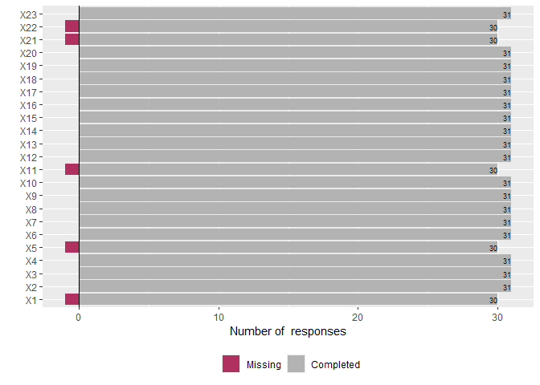

Analisis of individual Questions EKE Colombia - Banano and Plantain 2023
================
Laura Valbuena
2024-07-20

## Likert library functions, and Global Variables

#### Before starting

- You need a data frame with the questions in the columns and the
  responses in the rows
- The variables in the data frame should be factors

#### `likert` Function -Based on CRAN <https://cran.r-project.org/web/packages/likert/likert.pdf>

**Description:**  
This function analyzes Likert type items and provides statistics about
them.

**Parameters:**  

- `items`: Data frame with the likert items.

- `summary`: (Optional) A pre-summarized data frame.

**Details:**  
For each column this function calculates the percentage of responses for
each factor.

**Returns:**  
A data frame with columns “item”, “Factor_1”, “Factor_2”, …, “Factor_n”
with percentage of responses in values.

**Example Usage:**  
`likert(data_frame)`

#### `summary` Function -Based on CRAN <https://cran.r-project.org/web/packages/likert/likert.pdf>

**Description:**  
This function prints summary table of likert analysis

**Parameters:**  

- `Object`: Likert class data frame.

**Details:**  
This functions provides aditional information about the likert analysis.

**Returns:**  
A data frame with columns “item”, “low”, “neutral”, “high”, “mean”,
“sd”. Low, neutral and high correspond to the percentage of responses in
levels below neutral, neutral and above neutral respectively. Mean ans
sd column gives the mean and standard deviation of the results.

**Example Usage:**  
summary(Likert_data_frame)

#### `likert.histogram.plot` Function -Based on CRAN <https://cran.r-project.org/web/packages/likert/likert.pdf>

**Description:**  
Histogram plot of the results

**Parameters:**  

- `Object`: Likert class data frame.

- `xlab`: Label for x-axis.

**Details:**  
This functions plots the number of responses of the likert analysis in a
histogram plot.

**Returns:**  
A histogram plot with missing values at left and complete response count
at right.

**Example Usage:**  
likert.histogram.plot(Likert_data_frame, xlab = “Number of responses”)

#### `likert.bar.plot` Function -Based on CRAN <https://cran.r-project.org/web/packages/likert/likert.pdf>

**Description:**  
Bar plot of the results

**Parameters:**  

- `Object`: Likert class data frame.

**Details:**  
This functions plots the likert analysis in a bar plot.

**Returns:**  
A bar plot with items at y-axis and percentage at x-axis. Up the plot
there are the percentage values for low, neutral and high levels. Bars
shows the distribution of responses for each factor.

**Example Usage:**  
likert.bar.plot(Likert_data_frame)

#### `likert.density.plot` Function -Based on CRAN <https://cran.r-project.org/web/packages/likert/likert.pdf>

**Description:**  
density plot of the results

**Parameters:**  

- `Object`: Likert class data frame.

- `facet`: If “FALSE” it returns one plot with the density distribution
  of all items. Default “TRUE”.

- `bw`: Smoothing bandwidth. Default 0.5.

**Details:**  
This functions plots the density distribution of the likert analysis.

**Returns:**  
Density plot with factor in the x-axis. vertical lines shows the mean of
the items.

**Example Usage:**  
likert.density.plot(Likert_data_frame, facet=FALSE, bw=0.5)

#### `likert.heat.plot` Function -Based on CRAN <https://cran.r-project.org/web/packages/likert/likert.pdf>

**Description:**  
Heat plot of the results

**Parameters:**  

- `Object`: Likert class data frame.

**Details:**  
This functions plots the likert analysis in a heat plot.

**Returns:**  
A heat plot with items at y-axis and factors at x-axis. Shows the
percentage of responses for each factor. Items are sorted in alphabet
order.

**Example Usage:**  
likert.heat.plot(Likert_data_frame)

\#Dataset structure

\#Likert analysis

\#summary

\#likert histogram plot
<!-- -->

\#likert bar plot
<!-- -->

\#likert density plot
<!-- --><!-- --><!-- --><!-- --><!-- --><!-- --><!-- --><!-- --><!-- --><!-- --><!-- --><!-- --><!-- --><!-- --><!-- --><!-- --><!-- --><!-- --><!-- --><!-- --><!-- --><!-- --><!-- -->

\#likert heat plot
<!-- -->
