Analisis of individual Questions EKE Colombia - Banano and Plantain 2023
================
Jacobo Robledo
2024-01-04

## Libraries, Functions, and Global Variables

#### `tree_map_3` Function

**Description:**  
This function creates a treemap visualization based on a given dataset.
It first calculates the frequency of occurrences for specified grouping
variables and then plots a treemap using these frequencies.

**Parameters:**  

- `data`: A data frame containing the data to be visualized.

- `group`: The name of the column in ‘data’ to be used as the primary
  grouping variable.

- `subgroup_1`: The name of the column in ‘data’ to be used as the first
  level subgroup.

- `subgroup_2`: The name of the column in ‘data’ to be used as the
  second level subgroup.

- `color_column`: The name of the column in ‘data’ that determines the
  color of the treemap blocks.

- `title`: The title to be displayed on the treemap.

**Details:**  
The function groups the data by ‘group’, ‘subgroup_1’, ‘subgroup_2’, and
‘color_column’, then calculates the frequency of each group. It uses the
‘treemap’ package to create the treemap, where the size of each block is
determined by the calculated frequency. The color of the blocks is
determined by the ‘color_column’. The function allows customization of
label sizes, colors, and placement, as well as border colors and widths.

**Returns:**  
A treemap plot as specified by the input parameters.

**Example Usage:**  
`tree_map_3(my_data, "main_category", "sub_category1", "sub_category2", "color_var", "My Treemap Title")`

#### `Col_map_by_depto` Function

**Description:**  
This function creates a colored map visualization based on departmental
data. It utilizes the `colmap` function to map data to specific
geographical areas (departments) and applies a continuous color scale to
these areas.

**Function Structure:** - `colmap(departamentos, data, data_id, var)`:
Maps the `var` variable from the `data` data frame onto the
`departamentos` geographical layout. The `data_id` specifies the
matching column in `data` that corresponds to department IDs. -
`scale_fill_continuous(low, high, na.value)`: Applies a continuous color
scale to the map. The `low` and `high` parameters define the color range
for the lowest and highest values of `var`, respectively. The `na.value`
parameter defines the color for missing values. -
`labs(fill = legend_lab)`: Sets the label for the map legend.

**Parameters:**  
- `departamentos`: The geographical layout of departments. - `data`: The
data frame containing the data to be visualized. - `data_id`: The column
in `data` that corresponds to department IDs. - `var`: The variable in
`data` to be visualized on the map. - `low`: The color representing the
low end of the `var` variable’s range. - `high`: The color representing
the high end of the `var` variable’s range. - `na.value`: The color used
for missing values in `var`. - `legend_lab`: The label for the map’s
legend.

**Example Usage:**  
Suppose you have a data frame `my_data` with department IDs in
`depto_id` column and a variable `population` to visualize. You could
call:

`R Col_map_by_depto(departamentos = my_map_layout, data = my_data, data_id = "depto_id", var = "population", low = "blue", high = "red", na.value = "grey", legend_lab = "Population")`

#### `category_by_mean_by_question` Function

**Description:**  
This function retrieves the category corresponding to a given mean value
for a specific question. It reads a dataset from a specified URL
containing category information in both English and Spanish. The
function allows the user to specify the language for the category
description.

**Parameters:**  
- `question`: The question number for which the category needs to be
found. - `mean`: The mean value whose corresponding category is to be
retrieved. - `language`: A character vector specifying the language of
the category description. Default is `c("en", "es")`.

**Functionality:**  
- The function first rounds the mean value to the nearest whole
number. - It then reads a dataset from a given URL that contains
categories in both English and Spanish. - Depending on the selected
language, it filters the dataset to find the category corresponding to
the provided question number and rounded mean value. - If the language
is set to “en” (English), it retrieves the category from the
`trans_answer` column; if “es” (Spanish), it retrieves from the
`Category` column. - An error message is displayed if the specified
language is not found.

**Returns:**  
The category corresponding to the specified mean and question in the
chosen language.

**Example Usage:**  
Suppose you have a mean value of 3.6 for question number 5 and want the
category in English. You could call:

`R   category <- category_by_mean_by_question(question = 5, mean = 3.6, language = "en")`

#### `count_elements_by_group` Function

**Description:**  
This function is designed to count the frequency of elements within a
specified column that contains comma-separated values. It processes the
data to convert it into a long format and then performs a count of each
element within the specified groups.

**Parameters:**  
- `data`: The data frame containing the data to be analyzed. -
`value_column`: The name of the column in `data` that contains the
comma-separated values. - `group_columns`: A vector of column names in
`data` used to define groups for aggregation.

**Functionality:**  
- The function first uses `separate_rows` to split the comma-separated
values in `value_column` and convert the data into a long format. -
`group_by` is then applied to group the data by the columns specified in
`group_columns`. - `count` is used to count the occurrences of each
unique element within these groups. - The result is a long-format data
frame with the frequency count of each element in the specified groups.

**Returns:**  
A data frame in long format that contains the counts of each unique
element within the specified groups.

**Example Usage:**  
Suppose you have a data frame `df` with a column `categories` containing
comma-separated values and you want to count these values within groups
defined by `column1` and `column2`. You could call:
`R   result <- count_elements_by_group(df, "categories", c("column1", "column2"))`

#### `bar_plot_banana_plantain` Function

**Description:**  
This function creates a bar plot specifically designed for visualizing
data related to ‘Banana’ and ‘Plantain’ categories. It includes
customizable aesthetics such as background color for highlighting, bar
color coding, and an adjustable upper limit for the y-axis to enhance
the proportional representation of data.

**Parameters:**  
- `data_set`: The data frame containing the data to be plotted. -
`x_lab`: Label for the x-axis. - `y_lab`: Label for the y-axis. -
`title`: The title of the plot. - `x`: The name of the column in
`data_set` to be used as the x-axis variable. - `y`: The name of the
column in `data_set` to be used as the y-axis variable. - `facet`: The
name of the column in `data_set` to create facets for different panels
in the plot. - `alpha`: The transparency level for the background color
of the geom_rect. - `background_color`: The name of the column in
`data_set` that contains the background colors for the rectangles. -
`bar_color`: The name of the column in `data_set` that contains the
colors for the bars. - `proportional_limit`: A numeric value to set the
upper limit of the y-axis as a proportion of the maximum value of the y
variable.

**Functionality:**  
- The function starts by converting provided column names into symbols
for `ggplot2` aesthetics. - It calculates the new y-axis upper limit
based on the provided `proportional_limit`. - A ggplot object is
initialized, and layers are added for rectangles, text, and bars, with
aesthetics mapped accordingly. - The plot’s appearance is customized,
including colors for text and lines, and removing the grid lines for a
cleaner look. - The y-axis is scaled with the calculated limit, and
facet panels are created as per the `facet` column.

**Returns:**  
A ggplot object representing the bar plot with customized aesthetics and
scales, ready for rendering or further modification.

**Example Usage:**  
To create a plot for a data frame `df` with background colors specified
in `bg_colors` and bar colors in `bar_colors`, where we want to facet by
the ‘type’ column and set the y-axis upper limit to be 20% higher than
the max ‘value’ in `df`:

`R result_plot <- bar_plot_banana_plantain(   data_set = df,   x_lab = "Type of Crop",   y_lab = "Value in Percentage",   title = "Crop Value Comparison",   x = "type",   y = "value",   facet = "category",   alpha = 0.3,   background_color = "bg_colors",   bar_color = "bar_colors",   proportional_limit = 1.2 ) # Print the result print(result_plot)`

#### `assign_group_color` Function

**Description:**  
This function dynamically assigns color codes to data points based on
their categorical responses within specific groups (crops). It is
designed to work with variable-length categories and color mappings for
different groups. It’s especially useful for visualizing data where the
color representation depends on both the group (crop) and the category
of response.

**Parameters:**  
- `data`: The data frame containing the data to be processed. -
`levels_by_crop`: A named list where each element is a vector of
categorical levels for a specific crop. - `colors_by_crop`: A named list
where each element is a vector of colors corresponding to each
categorical level for each crop.

**Functionality:**  
- The function iterates through each row of the data frame. - For each
row, it matches the crop and its corresponding answer to its categorical
level. - It then assigns the color based on the matched level from the
provided color vectors. - The function handles varying lengths of
categories and color mappings, making it versatile for different
datasets.

**Returns:**  
The modified data frame with an additional column `group_color` that
contains the assigned color codes based on the crop and answer
categories.

**Example Usage:**  
To assign colors to a dataset `df` with crops ‘Banana’ and ‘Plantain’
and their respective levels and colors:

``` r
#libraries----
  library(treemap)
```

    ## Warning: package 'treemap' was built under R version 4.3.2

``` r
  library(tidyverse)
```

    ## ── Attaching core tidyverse packages ──────────────────────── tidyverse 2.0.0 ──
    ## ✔ dplyr     1.1.3     ✔ readr     2.1.4
    ## ✔ forcats   1.0.0     ✔ stringr   1.5.0
    ## ✔ ggplot2   3.4.4     ✔ tibble    3.2.1
    ## ✔ lubridate 1.9.3     ✔ tidyr     1.3.0
    ## ✔ purrr     1.0.2     
    ## ── Conflicts ────────────────────────────────────────── tidyverse_conflicts() ──
    ## ✖ dplyr::filter() masks stats::filter()
    ## ✖ dplyr::lag()    masks stats::lag()
    ## ℹ Use the conflicted package (<http://conflicted.r-lib.org/>) to force all conflicts to become errors

``` r
  library(RColorBrewer)
  library("colmaps")
```

    ## The legacy packages maptools, rgdal, and rgeos, underpinning the sp package,
    ## which was just loaded, were retired in October 2023.
    ## Please refer to R-spatial evolution reports for details, especially
    ## https://r-spatial.org/r/2023/05/15/evolution4.html.
    ## It may be desirable to make the sf package available;
    ## package maintainers should consider adding sf to Suggests:.

``` r
  library("homicidios")
  library(voronoiTreemap)
```

    ## Warning: package 'voronoiTreemap' was built under R version 4.3.2

``` r
  library(webshot)
```

    ## Warning: package 'webshot' was built under R version 4.3.2

``` r
  library(webshot2)
```

    ## Warning: package 'webshot2' was built under R version 4.3.2

    ## Registered S3 method overwritten by 'webshot2':
    ##   method        from   
    ##   print.webshot webshot
    ## 
    ## Attaching package: 'webshot2'
    ## 
    ## The following objects are masked from 'package:webshot':
    ## 
    ##     appshot, resize, rmdshot, shrink, webshot

``` r
  library(purrr)
  library(rlang)
```

    ## 
    ## Attaching package: 'rlang'
    ## 
    ## The following objects are masked from 'package:purrr':
    ## 
    ##     %@%, flatten, flatten_chr, flatten_dbl, flatten_int, flatten_lgl,
    ##     flatten_raw, invoke, splice

``` r
#Global variables
  #set the color palette for bananas and plantains
  palette_banana <- colorRampPalette(c("#FFDA00","#FFF2CC" ))
  palette_plantain <- colorRampPalette(c("#28B463","#BEF4BE"))
  palette_soil<- colorRampPalette(c( "#654321","#d8c298"))
  #data set: individual questions:
  #read individual surveys from GitHub
  num_cols <- length(read.csv("https://raw.githubusercontent.com/jrobledob/R2M_Colombia_banana_and_plantain/main/Data/DATA_Individual_surveys_Banana_and_Plantain_Colombia_Clean_surveys_2023-12-28.csv", nrows = 1, header = TRUE))
  # Create a colClasses vector with "character" for each column
  col_classes <- rep("character", num_cols)
  individual_surveys<- read.csv("https://raw.githubusercontent.com/jrobledob/R2M_Colombia_banana_and_plantain/main/Data/DATA_Individual_surveys_Banana_and_Plantain_Colombia_Clean_surveys_2023-12-28.csv", colClasses = col_classes)
  #reformat columns
  individual_surveys$question_number<- as.integer(individual_surveys$question_number)
  #Getting the experience of each expert by department by crop
  experience_of_each_expert<- individual_surveys %>%
    filter(question_number==1) %>%
    select(crop, expert_ID, expert_in, numeric_answer) %>%
    mutate(numeric_answer= as.numeric(numeric_answer))
  colnames(experience_of_each_expert)[which(colnames(experience_of_each_expert)=="numeric_answer")]<- "weights"
  #correct the missing answer which is "Antioquia"
  experience_of_each_expert$expert_in[which(is.na(experience_of_each_expert$expert_in))]<- "Antioquia"
    
#function tree_map_3 
  tree_map_3<- function(data,group, subgroup_1, subgroup_2, color_column, title){
    #Calculate the frequencies
    frequency_personalized_question<- data %>%
      group_by(!!rlang::sym(group), !!rlang::sym(subgroup_1), !!rlang::sym(subgroup_2), !!rlang::sym(color_column)) %>%
      summarise(frequency=n())
    #Plot the tree map 
    figure<- treemap(frequency_personalized_question,
            index=c(group,subgroup_1, subgroup_2), 
            vSize="frequency",
            vColor=color_column,
            type="color",
            fontsize.labels=c(0,7,4),                # size of labels. Give the size per level of aggregation: size for group, size for subgroup, sub-subgroups...
            fontcolor.labels=c("transparent","#654321", "#A58F65"),    # Color of labels
            fontface.labels=c(2,1,1),                  # Font of labels: 1,2,3,4 for normal, bold, italic, bold-italic...
            bg.labels=c("transparent"),              # Background color of labels
            align.labels=list(
              c("center", "top"), 
              c("right", "bottom"), 
              c("left", "top")
            ),                                   # Where to place labels in the rectangle?
            overlap.labels=0.5,                      # number between 0 and 1 that determines the tolerance of the overlap between labels. 0 means that labels of lower levels are not printed if higher level labels overlap, 1  means that labels are always printed. In-between values, for instance the default value .5, means that lower level labels are printed if other labels do not overlap with more than .5  times their area size.
            inflate.labels=T,                        # If true, labels are bigger when rectangle is bigger.
            border.col=c("white","#654321","#A58F65"),             # Color of borders of groups, of subgroups, of subsubgroups ....
            border.lwds=c(3,2, 0.5),                         # Width of colors
            title=title,                      # Customize your title
            #fontsize.title=12                       # Size of the title
    )
    return(figure)
  }

#function Col_map_by_depto
  Col_map_by_depto<- function(data, data_id, var, low, high, na.values, legend_lab){
    
    figure<- colmap(departamentos, data = data, data_id = data_id, var = var)+
      scale_fill_continuous(low = low , high = high, na.value = na.values)
    labs(fill= legend_lab)
    return(figure)
  }
  
#function category_by_mean_by_question
category_by_mean_by_question<- function(question, mean, language=c("en","es")){
  mean<-round(mean, 0)
  data<- read.csv("https://raw.githubusercontent.com/jrobledob/R2M_Colombia_banana_and_plantain/main/Data/SUP_DATA_Categories_that_can_be_chosen_in_every_question_of_the_individual_survey_English_and_Spanish.csv")
  if (language=="en") {
    category<- filter(data, number==question & number_to_category==mean)$trans_answer
  }else{
    if (language=="es") {
      category<- filter(data, number==question & number_to_category==mean)$Category
    }
    cat("ERROR: Language not found")
  }
  return(category)
}

#Function count_elements_by_group
count_elements_by_group <- function(data, value_column, group_columns) {
  # Split the comma-separated values and convert to long format
  data_long <- data %>%
    separate_rows(!!sym(value_column), sep = ",\\s*") %>%
    group_by(across(all_of(group_columns))) %>%
    count(!!sym(value_column))
  return(data_long)
}
  
#function bar_plot_banana_plantain
bar_plot_banana_plantain <- function(data_set, x_lab, y_lab, title, x, y, alpha, background_color, bar_color, proportional_limit, facet = NULL) {
  # Calculate new y-axis upper limit, 20% above the max value
  ymax_limit <- max(data_set[[y]], na.rm = TRUE) * proportional_limit
  
  # Convert strings to symbols
  x_sym <- rlang::sym(x)
  y_sym <- rlang::sym(y)
  background_color_sym <- rlang::sym(background_color)
  bar_color_sym <- rlang::sym(bar_color)
  
  # Start the plot
  p <- ggplot(data_set, aes(x = !!x_sym, y = !!y_sym)) +
    geom_rect(aes(fill = !!background_color_sym), xmin = -Inf, xmax = Inf, ymin = -Inf, ymax = Inf, alpha = alpha) +
    geom_text(aes(label = !!y_sym), vjust = -0.5, color = "#654321") +
    geom_bar(aes(fill = !!bar_color_sym), color = "#654321",stat = 'identity', position = position_dodge()) +
    scale_fill_identity() +
    labs(x = x_lab, y = y_lab, title = title) +
    theme(
      text = element_text(color = "#654321"),
      axis.title = element_text(color = "#654321"),
      axis.text = element_text(color = "#654321"),
      axis.line = element_line(color = "#654321"),
      panel.grid.major = element_blank(),
      panel.grid.minor = element_blank(),
      panel.border = element_rect(color = "#654321", fill = NA),
      strip.text = element_text(color = "#654321"),
      strip.background = element_rect(fill = "#A58F65", colour = NA),
      legend.position = "none"
    ) +
    ylim(0, ymax_limit)
  
  # Conditionally add facet grid if facet is provided
  if (!is.null(facet) && facet != "") {
    facet_sym <- rlang::sym(facet)
    facet_formula <- as.formula(paste(". ~", facet))
    p <- p + facet_grid(facet_formula)
  }
  
  # Return the plot
  return(p)
}

#function assign_group_color 
assign_group_color <- function(data, answer_col, levels_by_crop, colors_by_crop) {
  # Ensure that answer_col is a string representing the column name
  # levels_by_crop is a named list of vectors containing the knowledge levels for each crop
  # colors_by_crop is a named list of vectors containing the colors corresponding to each knowledge level for each crop
  
  answer_col_sym <- rlang::sym(answer_col)  # Convert the string to a symbol
  
  data <- data %>%
    mutate(group_color = purrr::map2_chr(crop, !!answer_col_sym, function(crop_name, answer) {
      # Find the index of the answer within the levels for the given crop
      level_index <- match(answer, levels_by_crop[[crop_name]])
      # Use the index to get the corresponding color
      if (!is.na(level_index)) {
        colors_by_crop[[crop_name]][level_index]
      } else {
        NA_character_  # If there's no match, return NA
      }
    }))
  
  return(data)
}
```

## Question 1: How many years of experience do you have in each department?

``` r
#selecting only question 1----
  question_1<- filter(individual_surveys, question_number==1)
  #organizing the order of the levels
  question_1$answer_in_english<- factor(question_1$answer_in_english,levels = c("1 to 2", "3 to 5","5 to 9","10 to 15","More than 15"))
  #finding the number of levels per crop (banana and plantain)
  levels_per_crop_Q1<- tapply(question_1$answer_in_english, question_1$crop, function(x){length(unique(x))})
  #generating a ramp palette according to the number of levels per crop
  colors_banana_question1<- palette_banana(levels_per_crop_Q1["Banana"])
  colors_plantain_question1<- palette_plantain(levels_per_crop_Q1["Plantain"])
  #Assigning the colors by crop and answer
  question_1<- question_1 %>%
    mutate(group_color= case_when(
      crop=="Banana" & answer_in_english == "1 to 2" ~ colors_banana_question1[5],
      crop=="Banana" & answer_in_english == "3 to 5" ~ colors_banana_question1[4],
      crop=="Banana" & answer_in_english == "5 to 9" ~ colors_banana_question1[3],
      crop=="Banana" & answer_in_english == "10 to 15" ~ colors_banana_question1[2],
      crop=="Banana" & answer_in_english == "More than 15" ~ colors_banana_question1[1],
      crop=="Plantain" & answer_in_english == "1 to 2" ~ colors_plantain_question1[5],
      crop=="Plantain" & answer_in_english == "3 to 5" ~ colors_plantain_question1[4],
      crop=="Plantain" & answer_in_english == "5 to 9" ~ colors_plantain_question1[3],
      crop=="Plantain" & answer_in_english == "10 to 15" ~ colors_plantain_question1[2],
      crop=="Plantain" & answer_in_english == "More than 15" ~ colors_plantain_question1[1],
    ))
#tree map
tree_map_3(data = question_1, "crop", "expert_in", "answer_in_english", "group_color", title="Experience of Experts by Department")
```

    ## `summarise()` has grouped output by 'crop', 'expert_in', 'answer_in_english'.
    ## You can override using the `.groups` argument.

<!-- -->

    ## $tm
    ##        crop          expert_in answer_in_english vSize  vColor stdErr
    ## 1    Banana          Antioquia            1 to 2     1 #FFF2CC      1
    ## 2    Banana          Antioquia          10 to 15     2 #FFE033      2
    ## 3    Banana          Antioquia            3 to 5     3 #FFEB99      3
    ## 4    Banana          Antioquia      More than 15     5 #FFDA00      5
    ## 5    Banana          Antioquia              <NA>    11 #FFDA00     11
    ## 6    Banana            Bolívar            1 to 2     1 #FFF2CC      1
    ## 7    Banana            Bolívar              <NA>     1 #FFF2CC      1
    ## 8    Banana             Caldas            5 to 9     1 #FFE566      1
    ## 9    Banana             Caldas              <NA>     1 #FFE566      1
    ## 10   Banana              Cesar            1 to 2     1 #FFF2CC      1
    ## 11   Banana              Cesar            3 to 5     2 #FFEB99      2
    ## 12   Banana              Cesar              <NA>     3 #FFEB99      3
    ## 13   Banana              Chocó            1 to 2     1 #FFF2CC      1
    ## 14   Banana              Chocó            3 to 5     1 #FFEB99      1
    ## 15   Banana              Chocó              <NA>     2 #FFEB99      2
    ## 16   Banana            Córdoba            1 to 2     3 #FFF2CC      3
    ## 17   Banana            Córdoba              <NA>     3 #FFF2CC      3
    ## 18   Banana              Huila            5 to 9     1 #FFE566      1
    ## 19   Banana              Huila              <NA>     1 #FFE566      1
    ## 20   Banana         La Guajira            1 to 2     1 #FFF2CC      1
    ## 21   Banana         La Guajira          10 to 15     1 #FFE033      1
    ## 22   Banana         La Guajira            3 to 5     4 #FFEB99      4
    ## 23   Banana         La Guajira            5 to 9     3 #FFE566      3
    ## 24   Banana         La Guajira      More than 15     1 #FFDA00      1
    ## 25   Banana         La Guajira              <NA>    10 #FFDA00     10
    ## 26   Banana          Magdalena            1 to 2     4 #FFF2CC      4
    ## 27   Banana          Magdalena          10 to 15     2 #FFE033      2
    ## 28   Banana          Magdalena            3 to 5     4 #FFEB99      4
    ## 29   Banana          Magdalena            5 to 9     2 #FFE566      2
    ## 30   Banana          Magdalena      More than 15     1 #FFDA00      1
    ## 31   Banana          Magdalena              <NA>    13 #FFDA00     13
    ## 32   Banana               <NA>            1 to 2     1 #FFF2CC      1
    ## 33   Banana               <NA>              <NA>    48 #FFF2CC     48
    ## 34   Banana               <NA>              <NA>     1 #FFF2CC      1
    ## 35   Banana            Quindío            5 to 9     1 #FFE566      1
    ## 36   Banana            Quindío              <NA>     1 #FFE566      1
    ## 37   Banana          Risaralda            5 to 9     1 #FFE566      1
    ## 38   Banana          Risaralda              <NA>     1 #FFE566      1
    ## 39 Plantain          Antioquia            1 to 2     1 #BEF4BE      1
    ## 40 Plantain          Antioquia            5 to 9     1 #73D490      1
    ## 41 Plantain          Antioquia      More than 15     1 #28B463      1
    ## 42 Plantain          Antioquia              <NA>     3 #28B463      3
    ## 43 Plantain             Arauca            1 to 2     1 #BEF4BE      1
    ## 44 Plantain             Arauca            5 to 9     1 #73D490      1
    ## 45 Plantain             Arauca      More than 15     1 #28B463      1
    ## 46 Plantain             Arauca              <NA>     3 #28B463      3
    ## 47 Plantain          Atlántico            5 to 9     1 #73D490      1
    ## 48 Plantain          Atlántico              <NA>     1 #73D490      1
    ## 49 Plantain            Bolívar            5 to 9     1 #73D490      1
    ## 50 Plantain            Bolívar              <NA>     1 #73D490      1
    ## 51 Plantain             Caldas            1 to 2     1 #BEF4BE      1
    ## 52 Plantain             Caldas          10 to 15     1 #4DC479      1
    ## 53 Plantain             Caldas            5 to 9     2 #73D490      2
    ## 54 Plantain             Caldas      More than 15     3 #28B463      3
    ## 55 Plantain             Caldas              <NA>     7 #28B463      7
    ## 56 Plantain           Casanare            1 to 2     1 #BEF4BE      1
    ## 57 Plantain           Casanare            5 to 9     1 #73D490      1
    ## 58 Plantain           Casanare      More than 15     1 #28B463      1
    ## 59 Plantain           Casanare              <NA>     3 #28B463      3
    ## 60 Plantain              Chocó            1 to 2     1 #BEF4BE      1
    ## 61 Plantain              Chocó              <NA>     1 #BEF4BE      1
    ## 62 Plantain            Córdoba            5 to 9     1 #73D490      1
    ## 63 Plantain            Córdoba              <NA>     1 #73D490      1
    ## 64 Plantain              Huila            5 to 9     1 #73D490      1
    ## 65 Plantain              Huila              <NA>     1 #73D490      1
    ## 66 Plantain         La Guajira            1 to 2     1 #BEF4BE      1
    ## 67 Plantain         La Guajira            3 to 5     2 #98E4A7      2
    ## 68 Plantain         La Guajira            5 to 9     1 #73D490      1
    ## 69 Plantain         La Guajira              <NA>     4 #73D490      4
    ## 70 Plantain          Magdalena            3 to 5     2 #98E4A7      2
    ## 71 Plantain          Magdalena            5 to 9     1 #73D490      1
    ## 72 Plantain          Magdalena              <NA>     3 #73D490      3
    ## 73 Plantain               Meta            3 to 5     2 #98E4A7      2
    ## 74 Plantain               Meta            5 to 9     3 #73D490      3
    ## 75 Plantain               Meta      More than 15     5 #28B463      5
    ## 76 Plantain               Meta              <NA>    10 #28B463     10
    ## 77 Plantain               <NA>              <NA>    58 #73D490     58
    ## 78 Plantain Norte De Santander            5 to 9     1 #73D490      1
    ## 79 Plantain Norte De Santander              <NA>     1 #73D490      1
    ## 80 Plantain            Quindío            1 to 2     1 #BEF4BE      1
    ## 81 Plantain            Quindío          10 to 15     1 #4DC479      1
    ## 82 Plantain            Quindío            5 to 9     2 #73D490      2
    ## 83 Plantain            Quindío      More than 15     2 #28B463      2
    ## 84 Plantain            Quindío              <NA>     6 #28B463      6
    ## 85 Plantain          Risaralda            1 to 2     4 #BEF4BE      4
    ## 86 Plantain          Risaralda            3 to 5     2 #98E4A7      2
    ## 87 Plantain          Risaralda            5 to 9     1 #73D490      1
    ## 88 Plantain          Risaralda      More than 15     3 #28B463      3
    ## 89 Plantain          Risaralda              <NA>    10 #28B463     10
    ## 90 Plantain          Santander            5 to 9     1 #73D490      1
    ## 91 Plantain          Santander              <NA>     1 #73D490      1
    ## 92 Plantain              Sucre            5 to 9     1 #73D490      1
    ## 93 Plantain              Sucre              <NA>     1 #73D490      1
    ## 94 Plantain             Tolima            5 to 9     1 #73D490      1
    ## 95 Plantain             Tolima              <NA>     1 #73D490      1
    ##    vColorValue level         x0        y0          w          h   color
    ## 1           NA     3 0.96540881 0.5000000 0.03459119 0.27272727 #FFF2CC
    ## 2           NA     3 0.79245283 0.5000000 0.17295597 0.10909091 #FFE033
    ## 3           NA     3 0.79245283 0.6090909 0.17295597 0.16363636 #FFEB99
    ## 4           NA     3 0.79245283 0.7727273 0.20754717 0.22727273 #FFDA00
    ## 5           NA     2 0.79245283 0.5000000 0.20754717 0.50000000 #FFDA00
    ## 6           NA     3 0.79245283 0.1363636 0.06918239 0.13636364 #FFF2CC
    ## 7           NA     2 0.79245283 0.1363636 0.06918239 0.13636364 #FFF2CC
    ## 8           NA     3 0.79245283 0.0000000 0.06918239 0.13636364 #FFE566
    ## 9           NA     2 0.79245283 0.0000000 0.06918239 0.13636364 #FFE566
    ## 10          NA     3 0.71069182 0.0000000 0.08176101 0.11538462 #FFF2CC
    ## 11          NA     3 0.54716981 0.0000000 0.16352201 0.11538462 #FFEB99
    ## 12          NA     2 0.54716981 0.0000000 0.24528302 0.11538462 #FFEB99
    ## 13          NA     3 0.91698113 0.3863636 0.08301887 0.11363636 #FFF2CC
    ## 14          NA     3 0.91698113 0.2727273 0.08301887 0.11363636 #FFEB99
    ## 15          NA     2 0.91698113 0.2727273 0.08301887 0.22727273 #FFEB99
    ## 16          NA     3 0.79245283 0.2727273 0.12452830 0.22727273 #FFF2CC
    ## 17          NA     2 0.79245283 0.2727273 0.12452830 0.22727273 #FFF2CC
    ## 18          NA     3 0.86163522 0.1363636 0.06918239 0.13636364 #FFE566
    ## 19          NA     2 0.86163522 0.1363636 0.06918239 0.13636364 #FFE566
    ## 20          NA     3 0.54716981 0.1153846 0.08176101 0.11538462 #FFF2CC
    ## 21          NA     3 0.62893082 0.1153846 0.08176101 0.11538462 #FFE033
    ## 22          NA     3 0.54716981 0.2307692 0.14016173 0.26923077 #FFEB99
    ## 23          NA     3 0.68733154 0.2307692 0.10512129 0.26923077 #FFE566
    ## 24          NA     3 0.71069182 0.1153846 0.08176101 0.11538462 #FFDA00
    ## 25          NA     2 0.54716981 0.1153846 0.24528302 0.38461538 #FFDA00
    ## 26          NA     3 0.54716981 0.6923077 0.12264151 0.30769231 #FFF2CC
    ## 27          NA     3 0.54716981 0.5000000 0.09811321 0.19230769 #FFE033
    ## 28          NA     3 0.66981132 0.6923077 0.12264151 0.30769231 #FFEB99
    ## 29          NA     3 0.64528302 0.5000000 0.09811321 0.19230769 #FFE566
    ## 30          NA     3 0.74339623 0.5000000 0.04905660 0.19230769 #FFDA00
    ## 31          NA     2 0.54716981 0.5000000 0.24528302 0.50000000 #FFDA00
    ## 32          NA     3 0.93081761 0.1363636 0.06918239 0.13636364 #FFF2CC
    ## 33          NA     1 0.54716981 0.0000000 0.45283019 1.00000000 #FFF2CC
    ## 34          NA     2 0.93081761 0.1363636 0.06918239 0.13636364 #FFF2CC
    ## 35          NA     3 0.86163522 0.0000000 0.06918239 0.13636364 #FFE566
    ## 36          NA     2 0.86163522 0.0000000 0.06918239 0.13636364 #FFE566
    ## 37          NA     3 0.93081761 0.0000000 0.06918239 0.13636364 #FFE566
    ## 38          NA     2 0.93081761 0.0000000 0.06918239 0.13636364 #FFE566
    ## 39          NA     3 0.33118173 0.5678161 0.10799404 0.08735632 #BEF4BE
    ## 40          NA     3 0.33118173 0.4804598 0.10799404 0.08735632 #73D490
    ## 41          NA     3 0.33118173 0.3931034 0.10799404 0.08735632 #28B463
    ## 42          NA     2 0.33118173 0.3931034 0.10799404 0.26206897 #28B463
    ## 43          NA     3 0.43917577 0.5678161 0.10799404 0.08735632 #BEF4BE
    ## 44          NA     3 0.43917577 0.4804598 0.10799404 0.08735632 #73D490
    ## 45          NA     3 0.43917577 0.3931034 0.10799404 0.08735632 #28B463
    ## 46          NA     2 0.43917577 0.3931034 0.10799404 0.26206897 #28B463
    ## 47          NA     3 0.33118173 0.2620690 0.07199603 0.13103448 #73D490
    ## 48          NA     2 0.33118173 0.2620690 0.07199603 0.13103448 #73D490
    ## 49          NA     3 0.40317776 0.2620690 0.07199603 0.13103448 #73D490
    ## 50          NA     2 0.40317776 0.2620690 0.07199603 0.13103448 #73D490
    ## 51          NA     3 0.00000000 0.3023873 0.09359484 0.10079576 #BEF4BE
    ## 52          NA     3 0.09359484 0.3023873 0.09359484 0.10079576 #4DC479
    ## 53          NA     3 0.11231380 0.4031830 0.07487587 0.25198939 #73D490
    ## 54          NA     3 0.00000000 0.4031830 0.11231380 0.25198939 #28B463
    ## 55          NA     2 0.00000000 0.3023873 0.18718967 0.35278515 #28B463
    ## 56          NA     3 0.18718967 0.2948276 0.09599470 0.09827586 #BEF4BE
    ## 57          NA     3 0.18718967 0.1965517 0.09599470 0.09827586 #73D490
    ## 58          NA     3 0.28318438 0.1965517 0.04799735 0.19655172 #28B463
    ## 59          NA     2 0.18718967 0.1965517 0.14399206 0.19655172 #28B463
    ## 60          NA     3 0.47517378 0.2620690 0.07199603 0.13103448 #BEF4BE
    ## 61          NA     2 0.47517378 0.2620690 0.07199603 0.13103448 #BEF4BE
    ## 62          NA     3 0.33118173 0.1310345 0.07199603 0.13103448 #73D490
    ## 63          NA     2 0.33118173 0.1310345 0.07199603 0.13103448 #73D490
    ## 64          NA     3 0.33118173 0.0000000 0.07199603 0.13103448 #73D490
    ## 65          NA     2 0.33118173 0.0000000 0.07199603 0.13103448 #73D490
    ## 66          NA     3 0.28318438 0.4586207 0.04799735 0.19655172 #BEF4BE
    ## 67          NA     3 0.18718967 0.4586207 0.09599470 0.19655172 #98E4A7
    ## 68          NA     3 0.18718967 0.3931034 0.14399206 0.06551724 #73D490
    ## 69          NA     2 0.18718967 0.3931034 0.14399206 0.26206897 #73D490
    ## 70          NA     3 0.18718967 0.0000000 0.09599470 0.19655172 #98E4A7
    ## 71          NA     3 0.28318438 0.0000000 0.04799735 0.19655172 #73D490
    ## 72          NA     2 0.18718967 0.0000000 0.14399206 0.19655172 #73D490
    ## 73          NA     3 0.21886792 0.6551724 0.05471698 0.34482759 #98E4A7
    ## 74          NA     3 0.00000000 0.6551724 0.21886792 0.12931034 #73D490
    ## 75          NA     3 0.00000000 0.7844828 0.21886792 0.21551724 #28B463
    ## 76          NA     2 0.00000000 0.6551724 0.27358491 0.34482759 #28B463
    ## 77          NA     1 0.00000000 0.0000000 0.54716981 1.00000000 #73D490
    ## 78          NA     3 0.40317776 0.1310345 0.07199603 0.13103448 #73D490
    ## 79          NA     2 0.40317776 0.1310345 0.07199603 0.13103448 #73D490
    ## 80          NA     3 0.00000000 0.0000000 0.09359484 0.10079576 #BEF4BE
    ## 81          NA     3 0.09359484 0.0000000 0.09359484 0.10079576 #4DC479
    ## 82          NA     3 0.00000000 0.1007958 0.09359484 0.20159151 #73D490
    ## 83          NA     3 0.09359484 0.1007958 0.09359484 0.20159151 #28B463
    ## 84          NA     2 0.00000000 0.0000000 0.18718967 0.30238727 #28B463
    ## 85          NA     3 0.27358491 0.8029557 0.19150943 0.19704433 #BEF4BE
    ## 86          NA     3 0.46509434 0.7701149 0.08207547 0.22988506 #98E4A7
    ## 87          NA     3 0.46509434 0.6551724 0.08207547 0.11494253 #73D490
    ## 88          NA     3 0.27358491 0.6551724 0.19150943 0.14778325 #28B463
    ## 89          NA     2 0.27358491 0.6551724 0.27358491 0.34482759 #28B463
    ## 90          NA     3 0.47517378 0.1310345 0.07199603 0.13103448 #73D490
    ## 91          NA     2 0.47517378 0.1310345 0.07199603 0.13103448 #73D490
    ## 92          NA     3 0.40317776 0.0000000 0.07199603 0.13103448 #73D490
    ## 93          NA     2 0.40317776 0.0000000 0.07199603 0.13103448 #73D490
    ## 94          NA     3 0.47517378 0.0000000 0.07199603 0.13103448 #73D490
    ## 95          NA     2 0.47517378 0.0000000 0.07199603 0.13103448 #73D490
    ## 
    ## $type
    ## [1] "color"
    ## 
    ## $vSize
    ## [1] "frequency"
    ## 
    ## $vColor
    ## [1] "group_color"
    ## 
    ## $stdErr
    ## [1] "frequency"
    ## 
    ## $algorithm
    ## [1] "pivotSize"
    ## 
    ## $vpCoorX
    ## [1] 0.02812148 0.97187852
    ## 
    ## $vpCoorY
    ## [1] 0.01968504 0.91031496
    ## 
    ## $aspRatio
    ## [1] 1.483512
    ## 
    ## $range
    ## [1] NA NA
    ## 
    ## $mapping
    ## [1] NA NA NA
    ## 
    ## $draw
    ## [1] TRUE

``` r
#summarise to have the number of experts by departments
data<- question_1 %>%
  group_by(expert_in, id_depto) %>%
  summarise(Number_of_Experts= n())
```

    ## `summarise()` has grouped output by 'expert_in'. You can override using the
    ## `.groups` argument.

``` r
codes_department<- unique(data.frame(EKE.expert.in=homicidios$depto, id_depto=homicidios$id_depto))
data<- full_join(codes_department, data)
```

    ## Joining with `by = join_by(id_depto)`

``` r
#Map of Colombia
Col_map_by_depto(data = data, data_id = "id_depto", var = "Number_of_Experts", low = "#A58F65", high = "#654321", na.values = "#eeeeee", legend_lab = "Number \n of experts")
```

    ## Warning: `fortify(<SpatialPolygonsDataFrame>)` was deprecated in ggplot2 3.4.4.
    ## ℹ Please migrate to sf.
    ## ℹ The deprecated feature was likely used in the colmaps package.
    ##   Please report the issue to the authors.
    ## This warning is displayed once every 8 hours.
    ## Call `lifecycle::last_lifecycle_warnings()` to see where this warning was
    ## generated.

    ## Scale for fill is already present.
    ## Adding another scale for fill, which will replace the existing scale.

<!-- -->

``` r
#Total number of experts:
total_experts_Q1<- length(unique(question_1$expert_ID))
mode_Q1<- sort(table(question_1$answer_in_english), decreasing = T)
question_1$numeric_answer<- as.numeric(question_1$numeric_answer)
mean_q1<- mean(question_1$numeric_answer)
mean_q1<- category_by_mean_by_question(1, mean_q1, language = "en")
mean_q1_by_crops<- question_1 %>%
  group_by(crop) %>%
  summarise(mean_cat= mean(numeric_answer),
            surveys_by_crop= length(unique(expert_ID)),
            mode= names(sort(table(answer_in_english), decreasing = T))[1])
mean_q1_by_crops$cat_english<- tapply(mean_q1_by_crops$mean_cat, mean_q1_by_crops$crop, function(x){
  category_by_mean_by_question(1, mean = x, language = "en")}) 
```

#### Descriptive statistics:

Total number of experts that answer this question= 46

Mode in all the surveys= 5 to 9

Mean in all the surveys=5 to 9

Descriptive statistics by crop=

| crop     | mean_cat | surveys_by_crop | mode   | cat_english |
|:---------|---------:|----------------:|:-------|:------------|
| Banana   | 3.555556 |              23 | 3 to 5 | 5 to 9      |
| Plantain | 4.066092 |              25 | 5 to 9 | 5 to 9      |

## Question 2: Which category or categories best describe your experience? Please check all that apply.

``` r
question_2<- filter(individual_surveys,question_number==2)
question_2_frequencies <- count_elements_by_group(question_2, "answer_in_english", c("crop"))
question_2_frequencies$answer_in_english<- as.factor(question_2_frequencies$answer_in_english)
#finding the number of levels per crop (banana and plantain)
levels_per_crop_Q2<- tapply(question_2_frequencies$answer_in_english, question_2_frequencies$crop, function(x){length(unique(x))})
#generating a ramp palette according to the number of levels per crop
colors_banana_question2<- palette_banana(levels_per_crop_Q2["Banana"])
colors_plantain_question2<- palette_plantain(levels_per_crop_Q2["Plantain"])
#Assignig a color per factor by crop
question_2_frequencies <- question_2_frequencies %>%
  mutate(group_color = case_when(
    crop == "Banana" ~ colors_banana_question2[match(answer_in_english, c("Agricultural Extension", 
                                                                          "Agricultural Operations Management/Crop Consultants", 
                                                                          "Agronomy", "Economics", 
                                                                          "Entomology", "Horticulture", 
                                                                          "IPM (Integrated Pest Management)", 
                                                                          "Others", "Plant Pathology", 
                                                                          "Producer", "Research", 
                                                                          "Seed Systems", "Social Sciences"))],
    crop == "Plantain" ~ colors_plantain_question2[match(answer_in_english, c("Agricultural Extension", 
                                                                              "Agricultural Operations Management/Crop Consultants", 
                                                                              "Agronomy", "Economics", 
                                                                              "Entomology", "Horticulture", 
                                                                              "IPM (Integrated Pest Management)", 
                                                                              "Others", "Plant Pathology", 
                                                                              "Producer", "Research", 
                                                                              "Seed Systems", "Social Sciences"))]
  ))
#Creating avreviations for the the plot 
question_2_frequencies <- question_2_frequencies %>%
  mutate(cat_abbreviations = case_when(
    answer_in_english == "Agricultural Extension" ~ "AE",
    answer_in_english == "Agricultural Operations Management/Crop Consultants" ~ "AOM/CC",
    answer_in_english == "Agronomy" ~ "Agro",
    answer_in_english == "Economics" ~ "Econ",
    answer_in_english == "Entomology" ~ "Ento",
    answer_in_english == "Horticulture" ~ "Hort",
    answer_in_english == "IPM (Integrated Pest Management)" ~ "IPM",
    answer_in_english == "Others" ~ "Oth",
    answer_in_english == "Plant Pathology" ~ "PlPath",
    answer_in_english == "Producer" ~ "Prod",
    answer_in_english == "Research" ~ "Res",
    answer_in_english == "Seed Systems" ~ "SS",
    answer_in_english == "Social Sciences" ~ "SocSci",
    TRUE ~ NA_character_  # Default case if none of the above conditions are met
  ))
#formating the data set to make the visualization, voronoiTreemap was quite picky...  
colnames(question_2_frequencies)<- c('h2', "h3", "weight","color", "codes")
question_2_frequencies$h1<- "Total"
question_2_frequencies <- question_2_frequencies %>%
  select(h1, h2, h3, color, weight, codes)
question_2_frequencies$weight<- (question_2_frequencies$weight/sum(question_2_frequencies$weight))*100
question_2_frequencies$h1<- as.factor(question_2_frequencies$h1)
question_2_frequencies$h2<- as.factor(question_2_frequencies$h2)
question_2_frequencies<- data.frame(h1= question_2_frequencies$h1,
                                    h2= question_2_frequencies$h2,
                                    h3= question_2_frequencies$h3,
                                    color= question_2_frequencies$color,
                                    weight= question_2_frequencies$weight,
                                    codes= question_2_frequencies$codes)
gdp_json <- vt_export_json(vt_input_from_df(question_2_frequencies))
vt_d3(gdp_json, color_border = "#654321", size_border = "1.5px", label = T, color_label = "#654321", seed = 3)
```

    ## PhantomJS not found. You can install it with webshot::install_phantomjs(). If it is installed, please make sure the phantomjs executable can be found via the PATH variable.

<!-- -->

``` r
vt_d3(gdp_json, color_border = "#654321", size_border = "1.5px", label = F, color_label = "#654321", seed = 3)
```

<!-- -->

``` r
kable(question_2_frequencies)
```

| h1    | h2       | h3                                                  | color    |    weight | codes  |
|:------|:---------|:----------------------------------------------------|:---------|----------:|:-------|
| Total | Banana   | Agricultural Extension                              | \#FFDA00 | 4.9450549 | AE     |
| Total | Banana   | Agricultural Operations Management/Crop Consultants | \#FFDB11 | 1.6483516 | AOM/CC |
| Total | Banana   | Agronomy                                            | \#FFDE22 | 6.0439560 | Agro   |
| Total | Banana   | Economics                                           | \#FFE033 | 1.0989011 | Econ   |
| Total | Banana   | Entomology                                          | \#FFE244 | 2.1978022 | Ento   |
| Total | Banana   | Horticulture                                        | \#FFE355 | 3.2967033 | Hort   |
| Total | Banana   | IPM (Integrated Pest Management)                    | \#FFE566 | 6.0439560 | IPM    |
| Total | Banana   | Others                                              | \#FFE876 | 1.0989011 | Oth    |
| Total | Banana   | Plant Pathology                                     | \#FFEA88 | 4.3956044 | PlPath |
| Total | Banana   | Producer                                            | \#FFEB99 | 2.7472527 | Prod   |
| Total | Banana   | Research                                            | \#FFEDAA | 3.2967033 | Res    |
| Total | Banana   | Seed Systems                                        | \#FFF0BB | 4.3956044 | SS     |
| Total | Banana   | Social Sciences                                     | \#FFF2CC | 0.5494505 | SocSci |
| Total | Plantain | Agricultural Extension                              | \#28B463 | 7.1428571 | AE     |
| Total | Plantain | Agricultural Operations Management/Crop Consultants | \#34B96A | 1.6483516 | AOM/CC |
| Total | Plantain | Agronomy                                            | \#41BE72 | 8.7912088 | Agro   |
| Total | Plantain | Economics                                           | \#4DC479 | 1.0989011 | Econ   |
| Total | Plantain | Entomology                                          | \#59C981 | 5.4945055 | Ento   |
| Total | Plantain | Horticulture                                        | \#66CE88 | 2.1978022 | Hort   |
| Total | Plantain | IPM (Integrated Pest Management)                    | \#73D490 | 6.5934066 | IPM    |
| Total | Plantain | Others                                              | \#7FD998 | 0.5494505 | Oth    |
| Total | Plantain | Plant Pathology                                     | \#8CDE9F | 7.1428571 | PlPath |
| Total | Plantain | Producer                                            | \#98E4A7 | 4.3956044 | Prod   |
| Total | Plantain | Research                                            | \#A4E9AE | 5.4945055 | Res    |
| Total | Plantain | Seed Systems                                        | \#B1EEB6 | 7.1428571 | SS     |
| Total | Plantain | Social Sciences                                     | \#BEF4BE | 0.5494505 | SocSci |

## Question 3: Do you work in a public or private institution/company?

``` r
#selecting only question 3----
  question_3<- filter(individual_surveys, question_number==3)
#Counts by crop
  question_3_frequencies <- count_elements_by_group(question_3, "answer_in_english", c("crop"))
  #calculate the percentages by crop and question 
  question_3_frequencies <- question_3_frequencies %>%
  group_by(crop) %>%
  mutate(total = sum(n),          # Calculate total for each crop group
         percentage = (n / total) * 100) %>%
  ungroup()
  #Plot
  #Add colors to each 
  question_3_frequencies<- question_3_frequencies %>%
  mutate(background_color= case_when(crop=="Banana" ~ "#FFF2CC",
                     crop=="Plantain" ~ "#BEF4BE"))
  #bars colors
question_3_frequencies<- question_3_frequencies %>%
  mutate(bar_color= case_when(crop=="Banana" & answer_in_english=="Public" ~ "#FFDA00",
                              crop=="Banana" & answer_in_english=="Private" ~ "#FFEDA3",
                              crop=="Plantain" & answer_in_english=="Public" ~ "#28B463",
                              crop=="Plantain" & answer_in_english=="Private" ~ "#82DA99"))
question_3_frequencies$percentage<- round(question_3_frequencies$percentage,0)
#custom function
question_3_plot<- bar_plot_banana_plantain(
  data_set = question_3_frequencies,
  x_lab = "Sector Affiliation of Experts",
  y_lab = "Percent (%)",
  title = "Expert Affiliation by Crop",
  x = "answer_in_english",
  y = "percentage",
  facet = "crop",
  alpha = 0.3,
  background_color = "background_color",
  bar_color = "bar_color",
  proportional_limit= 1.05
)
question_3_plot
```

<!-- -->

``` r
#Counts national
  question_3_frequencies_nal <- count_elements_by_group(question_3, "answer_in_english", c("answer_in_english"))
  #calculate the percentages by crop and question 
  question_3_frequencies_nal <- question_3_frequencies_nal %>%
     ungroup() %>%
    mutate(total = sum(n),          # Calculate total for each crop group
         percentage = (n / total) * 100) 
  #Plot
  #Add colors to each 
  question_3_frequencies_nal<- question_3_frequencies_nal %>%
  mutate(background_color= case_when(answer_in_english=="Public" ~ "transparent",
                     answer_in_english=="Private" ~ "transparent"))
  #Add color to the bars
 question_3_frequencies_nal<-  question_3_frequencies_nal %>%
  mutate(bar_color= case_when(answer_in_english=="Public"~ "#654321",
                              answer_in_english=="Private"~ "#d8c298"))
question_3_frequencies_nal$percentage<- round(question_3_frequencies_nal$percentage,0)
  #custom plot 
question_3_plot_nal<- bar_plot_banana_plantain(
  data_set = question_3_frequencies_nal,
  x_lab = "Sector Affiliation of Experts",
  y_lab = "Percent (%)",
  title = "Expert Affiliation",
  x = "answer_in_english",
  y = "percentage",
  alpha = 1,
  background_color = "background_color",
  bar_color = "bar_color",
  proportional_limit= 1.05
)
question_3_plot_nal
```

<!-- -->

## Question 4: What is your level of education?

``` r
#selecting only question 4----
  question_4<- filter(individual_surveys, question_number==4)
#Counts by crop
  question_4_frequencies <- count_elements_by_group(question_4, "answer_in_english", c("crop"))
  #calculate the percentages by crop and question 
  question_4_frequencies <- question_4_frequencies %>%
  group_by(crop) %>%
  mutate(total = sum(n),          # Calculate total for each crop group
         percentage = (n / total) * 100) %>%
  ungroup()
  question_4_frequencies$answer_in_english <- factor(
  question_4_frequencies$answer_in_english, 
  levels = c("No Formal Education", "Secondary Education", "Bachelor's Degree", "Master's Degree", "Doctorate"),
  labels = c("No Ed.", "Sec.", "Bac.", "Ms.C", "Ph.D")
)
  #Plot
  #Add colors to each backgorund 
  question_4_frequencies<- question_4_frequencies %>%
  mutate(background_color= case_when(crop=="Banana" ~ "#FFF2CC",
                     crop=="Plantain" ~ "#BEF4BE"))
  #Colors of the bars
  # Identify the levels by crop
  levels_Q_4_banana<- question_4_frequencies$answer_in_english[which( question_4_frequencies$crop=="Banana")]
  levels_Q_4_plantain<- question_4_frequencies$answer_in_english[which( question_4_frequencies$crop=="Plantain")]
  #set the color. The +1 is to make a different color that background wich will be the last element in the vector
  q_4_colors_banana<- palette_banana(length(levels_Q_4_banana)+1)
  q_4_colors_plantain<- palette_plantain(length(levels_Q_4_plantain)+1)
  names(q_4_colors_banana)<- levels_Q_4_banana
  names(q_4_colors_plantain)<- levels_Q_4_plantain
    # Modify the data_set to include the bar_color
question_4_frequencies <- question_4_frequencies %>%
  mutate(bar_color = case_when(
    crop == "Banana" ~ q_4_colors_banana[answer_in_english],
    crop == "Plantain" ~ q_4_colors_plantain[answer_in_english]
  ))
question_4_frequencies$percentage<- round(question_4_frequencies$percentage, 0)
dput(unique(question_4_frequencies$answer_in_english))
```

    ## structure(c(3L, 5L, 4L, 1L, 2L), levels = c("No Ed.", "Sec.", 
    ## "Bac.", "Ms.C", "Ph.D"), class = "factor")

``` r
#custom function
question_4_plot<- bar_plot_banana_plantain(
  data_set = question_4_frequencies,
  x_lab = "Education Level of the Experts",
  y_lab = "Percent (%)",
  title = "Eucation Level of the Experts by Crop",
  x = "answer_in_english",
  y = "percentage",
  facet = "crop",
  alpha = 0.3,
  background_color = "background_color",
  bar_color = "bar_color",
  proportional_limit= 1.05
)
question_4_plot
```

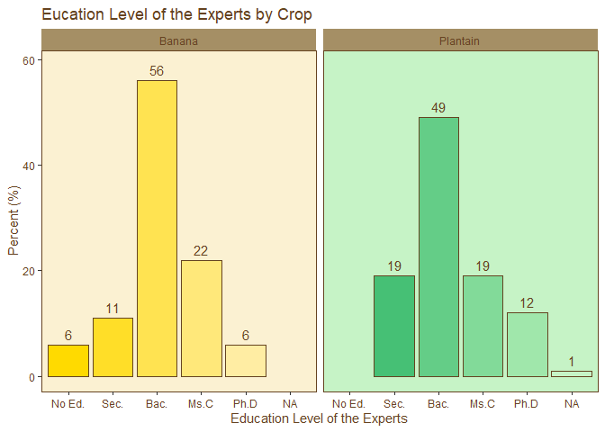<!-- -->

``` r
#Counts national
  question_4_frequencies_nal <- count_elements_by_group(question_4, "answer_in_english", c("answer_in_english"))
  #calculate the percentages by crop and question 
  question_4_frequencies_nal <- question_4_frequencies_nal %>%
     ungroup() %>%
    mutate(total = sum(n),          # Calculate total for each crop group
         percentage = (n / total) * 100) 
  #Plot
  #Add colors to each background
   question_4_frequencies_nal$answer_in_english <- factor(
  question_4_frequencies_nal$answer_in_english, 
  levels = c("No Formal Education", "Secondary Education", "Bachelor's Degree", "Master's Degree", "Doctorate"),
  labels = c("No Ed.", "Sec.", "Bac.", "Ms.C", "Ph.D")
)
  question_4_frequencies_nal$background_color<-"transparent"
   q_4_colors_soil_nal<- palette_soil(length(levels(question_4_frequencies_nal$answer_in_english)))
    names(q_4_colors_soil_nal)<- levels(question_4_frequencies_nal)
 # Modify the data_set to include the bar_color
question_4_frequencies_nal <- question_4_frequencies_nal %>%
  mutate(bar_color = q_4_colors_soil_nal[answer_in_english])
question_4_frequencies_nal$percentage<- round(question_4_frequencies_nal$percentage, 0)
  #custom plot 
question_4_plot_nal<- bar_plot_banana_plantain(
  data_set = question_4_frequencies_nal,
  x_lab = "Education Level of the Experts",
  y_lab = "Percent (%)",
  title = "Education Level of the Experts",
  x = "answer_in_english",
  y = "percentage",
  alpha = 1,
  background_color = "background_color",
  bar_color = "bar_color",
  proportional_limit= 1.05
)
question_4_plot_nal
```

<!-- -->

## Question 5: What are the most prevalent pests and diseases of bananas in the regions where you have experience? Please check all that apply.

``` r
question_5<- filter(individual_surveys,question_number==5)
question_5_frequencies <- count_elements_by_group(question_5, "answer_in_english", c("crop"))
question_5_frequencies$answer_in_english<- as.factor(question_5_frequencies$answer_in_english)
#finding the number of levels per crop (banana and plantain)
levels_per_crop_Q5<- tapply(question_5_frequencies$answer_in_english, question_5_frequencies$crop, function(x){length(unique(x))})
#generating a ramp palette according to the number of levels per crop
colors_banana_question5<- palette_banana(levels_per_crop_Q5["Banana"])
colors_plantain_question5<- palette_plantain(levels_per_crop_Q5["Plantain"])
#Assignig a color per factor by crop
question_5_frequencies <- question_5_frequencies %>%
  mutate(group_color = case_when(
    crop == "Banana" ~ colors_banana_question5[match(answer_in_english, c("Banana Mosaic Disease", "Black Sigatoka", 
"Black Weevil", "Elephantiasis", "Fusarium", "Moko or Madurabiche", 
"Nematodes", "Red Spider Mite", "Scale Insect", "Scarab Beetle", 
"Whiteflies", "Yellow Sigatoka"))],
    crop == "Plantain" ~ colors_plantain_question5[match(answer_in_english, c("Banana Mosaic Disease", "Black Sigatoka", 
"Black Weevil", "Elephantiasis", "Fusarium", "Moko or Madurabiche", 
"Nematodes", "Red Spider Mite", "Scale Insect", "Scarab Beetle", 
"Whiteflies", "Yellow Sigatoka"))]
  ))
#Make the abbreviations
question_5_frequencies <- question_5_frequencies %>%
  mutate(cat_abbreviations = case_when(
    answer_in_english == "Banana Mosaic Disease" ~ "BMD",
    answer_in_english == "Black Sigatoka" ~ "BS",
    answer_in_english == "Black Weevil" ~ "BW",
    answer_in_english == "Elephantiasis" ~ "ELE",
    answer_in_english == "Fusarium" ~ "FUS",
    answer_in_english == "Moko or Madurabiche" ~ "MOKO",
    answer_in_english == "Nematodes" ~ "NEM",
    answer_in_english == "Red Spider Mite" ~ "RSM",
    answer_in_english == "Scale Insect" ~ "SI",
    answer_in_english == "Scarab Beetle" ~ "SB",
    answer_in_english == "Whiteflies" ~ "WF",
    answer_in_english == "Yellow Sigatoka" ~ "YS",
    TRUE ~ NA_character_  # Default case if none of the above conditions are met
  ))

#formating the data set to make the visualization, voronoiTreemap was quite picky...  
colnames(question_5_frequencies)<- c('h2', "h3", "weight","color", "codes")
question_5_frequencies$h1<- "Total"
question_5_frequencies <- question_5_frequencies %>%
  select(h1, h2, h3, color, weight, codes)
question_5_frequencies$weight<- (question_5_frequencies$weight/sum(question_5_frequencies$weight))*100
question_5_frequencies$h1<- as.factor(question_5_frequencies$h1)
question_5_frequencies$h2<- as.factor(question_5_frequencies$h2)
question_5_frequencies<- data.frame(h1= question_5_frequencies$h1,
                                    h2= question_5_frequencies$h2,
                                    h3= question_5_frequencies$h3,
                                    color= question_5_frequencies$color,
                                    weight= question_5_frequencies$weight,
                                    codes= question_5_frequencies$codes)
gdp_json <- vt_export_json(vt_input_from_df(question_5_frequencies))
vt_d3(gdp_json, color_border = "#654321", size_border = "1.5px", label = T, color_label = "#654321", seed = 3)
```

<!-- -->

``` r
vt_d3(gdp_json, color_border = "#654321", size_border = "1.5px", label = F, color_label = "#654321", seed = 3)
```

<!-- -->

``` r
kable(question_5_frequencies)
```

| h1    | h2       | h3                    | color    |     weight | codes |
|:------|:---------|:----------------------|:---------|-----------:|:------|
| Total | Banana   | Banana Mosaic Disease | \#FFDA00 |  0.4376368 | BMD   |
| Total | Banana   | Black Sigatoka        | \#FFDC12 |  8.5339168 | BS    |
| Total | Banana   | Black Weevil          | \#FFDE25 |  6.3457330 | BW    |
| Total | Banana   | Elephantiasis         | \#FFE037 |  1.7505470 | ELE   |
| Total | Banana   | Fusarium              | \#FFE24A |  4.3763676 | FUS   |
| Total | Banana   | Moko or Madurabiche   | \#FFE45C |  7.8774617 | MOKO  |
| Total | Banana   | Nematodes             | \#FFE76F |  2.1881838 | NEM   |
| Total | Banana   | Red Spider Mite       | \#FFE981 |  2.4070022 | RSM   |
| Total | Banana   | Scale Insect          | \#FFEB94 |  3.9387309 | SI    |
| Total | Banana   | Scarab Beetle         | \#FFEDA6 |  1.3129103 | SB    |
| Total | Banana   | Whiteflies            | \#FFEFB9 |  0.4376368 | WF    |
| Total | Banana   | Yellow Sigatoka       | \#FFF2CC |  0.8752735 | YS    |
| Total | Plantain | Banana Mosaic Disease | \#28B463 |  2.1881838 | BMD   |
| Total | Plantain | Black Sigatoka        | \#35B96B |  9.4091904 | BS    |
| Total | Plantain | Black Weevil          | \#43BF73 |  7.8774617 | BW    |
| Total | Plantain | Elephantiasis         | \#50C57B |  5.2516411 | ELE   |
| Total | Plantain | Fusarium              | \#5ECB84 |  3.9387309 | FUS   |
| Total | Plantain | Moko or Madurabiche   | \#6CD18C | 10.2844639 | MOKO  |
| Total | Plantain | Nematodes             | \#79D694 |  7.6586433 | NEM   |
| Total | Plantain | Red Spider Mite       | \#87DC9C |  1.0940919 | RSM   |
| Total | Plantain | Scale Insect          | \#95E2A5 |  4.5951860 | SI    |
| Total | Plantain | Scarab Beetle         | \#A2E8AD |  0.2188184 | SB    |
| Total | Plantain | Whiteflies            | \#B0EEB5 |  1.7505470 | WF    |
| Total | Plantain | Yellow Sigatoka       | \#BEF4BE |  5.2516411 | YS    |

``` r
#select top 5
question_5_frequencies <- question_5_frequencies %>%
  group_by(h2) %>%
  slice_max(order_by = weight, n = 5) 
kable(question_5_frequencies, label = "TOP 5 pest and Diseases by Crop (banana and plantain")
```

| h1    | h2       | h3                  | color    |    weight | codes |
|:------|:---------|:--------------------|:---------|----------:|:------|
| Total | Banana   | Black Sigatoka      | \#FFDC12 |  8.533917 | BS    |
| Total | Banana   | Moko or Madurabiche | \#FFE45C |  7.877462 | MOKO  |
| Total | Banana   | Black Weevil        | \#FFDE25 |  6.345733 | BW    |
| Total | Banana   | Fusarium            | \#FFE24A |  4.376368 | FUS   |
| Total | Banana   | Scale Insect        | \#FFEB94 |  3.938731 | SI    |
| Total | Plantain | Moko or Madurabiche | \#6CD18C | 10.284464 | MOKO  |
| Total | Plantain | Black Sigatoka      | \#35B96B |  9.409190 | BS    |
| Total | Plantain | Black Weevil        | \#43BF73 |  7.877462 | BW    |
| Total | Plantain | Nematodes           | \#79D694 |  7.658643 | NEM   |
| Total | Plantain | Elephantiasis       | \#50C57B |  5.251641 | ELE   |
| Total | Plantain | Yellow Sigatoka     | \#BEF4BE |  5.251641 | YS    |

``` r
#Frequencies by department
question_5_frequencies_by_depto <- count_elements_by_group(question_5, "answer_in_english", c("crop", "expert_in"))
#colors by disease
question_5_frequencies_by_depto <- question_5_frequencies_by_depto %>%
  mutate(group_color = case_when(
    crop == "Banana" ~ colors_banana_question5[match(answer_in_english, c("Banana Mosaic Disease", "Black Sigatoka", 
"Black Weevil", "Elephantiasis", "Fusarium", "Moko or Madurabiche", 
"Nematodes", "Red Spider Mite", "Scale Insect", "Scarab Beetle", 
"Whiteflies", "Yellow Sigatoka"))],
    crop == "Plantain" ~ colors_plantain_question5[match(answer_in_english, c("Banana Mosaic Disease", "Black Sigatoka", 
"Black Weevil", "Elephantiasis", "Fusarium", "Moko or Madurabiche", 
"Nematodes", "Red Spider Mite", "Scale Insect", "Scarab Beetle", 
"Whiteflies", "Yellow Sigatoka"))]
  ))
#Make the abbreviations
question_5_frequencies_by_depto <- question_5_frequencies_by_depto %>%
  mutate(cat_abbreviations = case_when(
    answer_in_english == "Banana Mosaic Disease" ~ "BMD",
    answer_in_english == "Black Sigatoka" ~ "BS",
    answer_in_english == "Black Weevil" ~ "BW",
    answer_in_english == "Elephantiasis" ~ "ELE",
    answer_in_english == "Fusarium" ~ "FUS",
    answer_in_english == "Moko or Madurabiche" ~ "MOKO",
    answer_in_english == "Nematodes" ~ "NEM",
    answer_in_english == "Red Spider Mite" ~ "RSM",
    answer_in_english == "Scale Insect" ~ "SI",
    answer_in_english == "Scarab Beetle" ~ "SB",
    answer_in_english == "Whiteflies" ~ "WF",
    answer_in_english == "Yellow Sigatoka" ~ "YS",
    TRUE ~ NA_character_  # Default case if none of the above conditions are met
  ))
#tree map
question_5_frequencies_by_depto<- select(question_5_frequencies_by_depto,!answer_in_english)
question_5_frequencies_by_depto<- question_5_frequencies_by_depto %>%
  group_by(crop,expert_in) %>%
  mutate(total= sum(n),
         mean= round((n/total)*100,0))
question_5_frequencies_by_depto<- select(question_5_frequencies_by_depto,!n & !total)
#put it in long format
question_5_frequencies_by_depto <- question_5_frequencies_by_depto %>% 
  uncount(weights = mean, .id = "id")
#only select top 5 for the tree map
  #for banana
  question_5_frequencies_by_depto_banana<- filter(question_5_frequencies_by_depto, cat_abbreviations %in% question_5_frequencies$codes[which(question_5_frequencies$h2=="Banana")], crop=="Banana")
  #for plantain
  question_5_frequencies_by_depto_plantain<- filter(question_5_frequencies_by_depto, cat_abbreviations %in% question_5_frequencies$codes[which(question_5_frequencies$h2=="Plantain")], crop=="Plantain")
#merge both data set
question_5_frequencies_by_depto<- rbind(question_5_frequencies_by_depto_banana, question_5_frequencies_by_depto_plantain)
#tree map only plantain
tree_map_3(data = filter(question_5_frequencies_by_depto, crop=="Plantain"), "crop", "expert_in", "cat_abbreviations", "group_color", title="Top 5 Most Limiting Pests and Diseases in Plantains by Department")
```

    ## `summarise()` has grouped output by 'crop', 'expert_in', 'cat_abbreviations'.
    ## You can override using the `.groups` argument.

<!-- -->

    ## $tm
    ##         crop          expert_in cat_abbreviations vSize  vColor stdErr
    ## 1   Plantain          Antioquia                BS    12 #35B96B     12
    ## 2   Plantain          Antioquia                BW     6 #43BF73      6
    ## 3   Plantain          Antioquia              MOKO    12 #6CD18C     12
    ## 4   Plantain          Antioquia              <NA>    54 #35B96B     54
    ## 5   Plantain          Antioquia               NEM    12 #79D694     12
    ## 6   Plantain          Antioquia                YS    12 #BEF4BE     12
    ## 7   Plantain             Arauca                BS    15 #35B96B     15
    ## 8   Plantain             Arauca                BW    15 #43BF73     15
    ## 9   Plantain             Arauca              MOKO    15 #6CD18C     15
    ## 10  Plantain             Arauca              <NA>    60 #35B96B     60
    ## 11  Plantain             Arauca               NEM    15 #79D694     15
    ## 12  Plantain          Atlántico                BS    25 #35B96B     25
    ## 13  Plantain          Atlántico               ELE    25 #50C57B     25
    ## 14  Plantain          Atlántico              MOKO    25 #6CD18C     25
    ## 15  Plantain          Atlántico              <NA>   100 #35B96B    100
    ## 16  Plantain          Atlántico                YS    25 #BEF4BE     25
    ## 17  Plantain            Bolívar                BS    25 #35B96B     25
    ## 18  Plantain            Bolívar               ELE    25 #50C57B     25
    ## 19  Plantain            Bolívar              MOKO    25 #6CD18C     25
    ## 20  Plantain            Bolívar              <NA>   100 #35B96B    100
    ## 21  Plantain            Bolívar                YS    25 #BEF4BE     25
    ## 22  Plantain             Caldas                BS    12 #35B96B     12
    ## 23  Plantain             Caldas                BW    21 #43BF73     21
    ## 24  Plantain             Caldas               ELE    18 #50C57B     18
    ## 25  Plantain             Caldas              MOKO    12 #6CD18C     12
    ## 26  Plantain             Caldas              <NA>    90 #35B96B     90
    ## 27  Plantain             Caldas               NEM    15 #79D694     15
    ## 28  Plantain             Caldas                YS    12 #BEF4BE     12
    ## 29  Plantain           Casanare                BS    17 #35B96B     17
    ## 30  Plantain           Casanare                BW    17 #43BF73     17
    ## 31  Plantain           Casanare              MOKO    17 #6CD18C     17
    ## 32  Plantain           Casanare              <NA>    68 #35B96B     68
    ## 33  Plantain           Casanare               NEM    17 #79D694     17
    ## 34  Plantain              Chocó                BS    33 #35B96B     33
    ## 35  Plantain              Chocó              MOKO    33 #6CD18C     33
    ## 36  Plantain              Chocó              <NA>    99 #35B96B     99
    ## 37  Plantain              Chocó               NEM    33 #79D694     33
    ## 38  Plantain            Córdoba                BS    17 #35B96B     17
    ## 39  Plantain            Córdoba                BW    17 #43BF73     17
    ## 40  Plantain            Córdoba               ELE    17 #50C57B     17
    ## 41  Plantain            Córdoba              MOKO    17 #6CD18C     17
    ## 42  Plantain            Córdoba              <NA>    85 #35B96B     85
    ## 43  Plantain            Córdoba                YS    17 #BEF4BE     17
    ## 44  Plantain              Huila                BS    14 #35B96B     14
    ## 45  Plantain              Huila                BW    14 #43BF73     14
    ## 46  Plantain              Huila               ELE    14 #50C57B     14
    ## 47  Plantain              Huila              MOKO    14 #6CD18C     14
    ## 48  Plantain              Huila              <NA>    70 #35B96B     70
    ## 49  Plantain              Huila               NEM    14 #79D694     14
    ## 50  Plantain         La Guajira                BS    17 #35B96B     17
    ## 51  Plantain         La Guajira                BW    11 #43BF73     11
    ## 52  Plantain         La Guajira              MOKO    22 #6CD18C     22
    ## 53  Plantain         La Guajira              <NA>    67 #35B96B     67
    ## 54  Plantain         La Guajira               NEM    11 #79D694     11
    ## 55  Plantain         La Guajira                YS     6 #BEF4BE      6
    ## 56  Plantain          Magdalena                BS    20 #35B96B     20
    ## 57  Plantain          Magdalena                BW    10 #43BF73     10
    ## 58  Plantain          Magdalena              MOKO    30 #6CD18C     30
    ## 59  Plantain          Magdalena              <NA>    80 #35B96B     80
    ## 60  Plantain          Magdalena               NEM    10 #79D694     10
    ## 61  Plantain          Magdalena                YS    10 #BEF4BE     10
    ## 62  Plantain               Meta                BS    16 #35B96B     16
    ## 63  Plantain               Meta                BW    14 #43BF73     14
    ## 64  Plantain               Meta               ELE     2 #50C57B      2
    ## 65  Plantain               Meta              MOKO    16 #6CD18C     16
    ## 66  Plantain               Meta              <NA>    68 #35B96B     68
    ## 67  Plantain               Meta               NEM    14 #79D694     14
    ## 68  Plantain               Meta                YS     6 #BEF4BE      6
    ## 69  Plantain               <NA>              <NA>  1478 #35B96B   1478
    ## 70  Plantain Norte De Santander                BS    14 #35B96B     14
    ## 71  Plantain Norte De Santander                BW    14 #43BF73     14
    ## 72  Plantain Norte De Santander               ELE    14 #50C57B     14
    ## 73  Plantain Norte De Santander              MOKO    14 #6CD18C     14
    ## 74  Plantain Norte De Santander              <NA>    70 #35B96B     70
    ## 75  Plantain Norte De Santander               NEM    14 #79D694     14
    ## 76  Plantain            Quindío                BS    15 #35B96B     15
    ## 77  Plantain            Quindío                BW    15 #43BF73     15
    ## 78  Plantain            Quindío               ELE    15 #50C57B     15
    ## 79  Plantain            Quindío              MOKO    15 #6CD18C     15
    ## 80  Plantain            Quindío              <NA>    78 #35B96B     78
    ## 81  Plantain            Quindío               NEM    11 #79D694     11
    ## 82  Plantain            Quindío                YS     7 #BEF4BE      7
    ## 83  Plantain          Risaralda                BS    13 #35B96B     13
    ## 84  Plantain          Risaralda                BW    10 #43BF73     10
    ## 85  Plantain          Risaralda               ELE    18 #50C57B     18
    ## 86  Plantain          Risaralda              MOKO    21 #6CD18C     21
    ## 87  Plantain          Risaralda              <NA>    90 #35B96B     90
    ## 88  Plantain          Risaralda               NEM    15 #79D694     15
    ## 89  Plantain          Risaralda                YS    13 #BEF4BE     13
    ## 90  Plantain          Santander                BS    33 #35B96B     33
    ## 91  Plantain          Santander                BW    33 #43BF73     33
    ## 92  Plantain          Santander              MOKO    33 #6CD18C     33
    ## 93  Plantain          Santander              <NA>    99 #35B96B     99
    ## 94  Plantain              Sucre                BS    50 #35B96B     50
    ## 95  Plantain              Sucre              <NA>   100 #35B96B    100
    ## 96  Plantain              Sucre                YS    50 #BEF4BE     50
    ## 97  Plantain             Tolima                BS    25 #35B96B     25
    ## 98  Plantain             Tolima               ELE    25 #50C57B     25
    ## 99  Plantain             Tolima              MOKO    25 #6CD18C     25
    ## 100 Plantain             Tolima              <NA>   100 #35B96B    100
    ## 101 Plantain             Tolima                YS    25 #BEF4BE     25
    ##     vColorValue level        x0         y0          w          h   color
    ## 1            NA     3 0.8284662 0.10649758 0.07623722 0.10649758 #35B96B
    ## 2            NA     3 0.9682345 0.00000000 0.03176551 0.12779710 #43BF73
    ## 3            NA     3 0.8284662 0.00000000 0.07623722 0.10649758 #6CD18C
    ## 4            NA     2 0.8284662 0.00000000 0.17153375 0.21299516 #35B96B
    ## 5            NA     3 0.9047035 0.12779710 0.09529653 0.08519806 #79D694
    ## 6            NA     3 0.9047035 0.00000000 0.06353102 0.12779710 #BEF4BE
    ## 7            NA     3 0.8284662 0.33132580 0.08576688 0.11833064 #35B96B
    ## 8            NA     3 0.8284662 0.21299516 0.08576688 0.11833064 #43BF73
    ## 9            NA     3 0.9142331 0.33132580 0.08576688 0.11833064 #6CD18C
    ## 10           NA     2 0.8284662 0.21299516 0.17153375 0.23666129 #35B96B
    ## 11           NA     3 0.9142331 0.21299516 0.08576688 0.11833064 #79D694
    ## 12           NA     3 0.0000000 0.83333333 0.10148850 0.16666667 #35B96B
    ## 13           NA     3 0.1014885 0.83333333 0.10148850 0.16666667 #50C57B
    ## 14           NA     3 0.0000000 0.66666667 0.10148850 0.16666667 #6CD18C
    ## 15           NA     2 0.0000000 0.66666667 0.20297700 0.33333333 #35B96B
    ## 16           NA     3 0.1014885 0.66666667 0.10148850 0.16666667 #BEF4BE
    ## 17           NA     3 0.0000000 0.50000000 0.10148850 0.16666667 #35B96B
    ## 18           NA     3 0.1014885 0.50000000 0.10148850 0.16666667 #50C57B
    ## 19           NA     3 0.0000000 0.33333333 0.10148850 0.16666667 #6CD18C
    ## 20           NA     2 0.0000000 0.33333333 0.20297700 0.33333333 #35B96B
    ## 21           NA     3 0.1014885 0.33333333 0.10148850 0.16666667 #BEF4BE
    ## 22           NA     3 0.4046008 0.69886364 0.10705291 0.07584175 #35B96B
    ## 23           NA     3 0.4046008 0.86950758 0.10888287 0.13049242 #43BF73
    ## 24           NA     3 0.5134837 0.86950758 0.09332817 0.13049242 #50C57B
    ## 25           NA     3 0.5116537 0.78418561 0.09515814 0.08532197 #6CD18C
    ## 26           NA     2 0.4046008 0.69886364 0.20221105 0.30113636 #35B96B
    ## 27           NA     3 0.4046008 0.77470539 0.10705291 0.09480219 #79D694
    ## 28           NA     3 0.5116537 0.69886364 0.09515814 0.08532197 #BEF4BE
    ## 29           NA     3 0.8153821 0.57426004 0.09230897 0.12460359 #35B96B
    ## 30           NA     3 0.8153821 0.44965645 0.09230897 0.12460359 #43BF73
    ## 31           NA     3 0.9076910 0.57426004 0.09230897 0.12460359 #6CD18C
    ## 32           NA     2 0.8153821 0.44965645 0.18461795 0.24920719 #35B96B
    ## 33           NA     3 0.9076910 0.44965645 0.09230897 0.12460359 #79D694
    ## 34           NA     3 0.2029770 0.44295302 0.10081191 0.22147651 #35B96B
    ## 35           NA     3 0.3037889 0.44295302 0.10081191 0.22147651 #6CD18C
    ## 36           NA     2 0.2029770 0.33221477 0.20162382 0.33221477 #35B96B
    ## 37           NA     3 0.2029770 0.33221477 0.20162382 0.11073826 #79D694
    ## 38           NA     3 0.8090229 0.87954545 0.09548855 0.12045455 #35B96B
    ## 39           NA     3 0.9045115 0.87954545 0.09548855 0.12045455 #43BF73
    ## 40           NA     3 0.8090229 0.69886364 0.06365903 0.18068182 #50C57B
    ## 41           NA     3 0.8726819 0.69886364 0.06365903 0.18068182 #6CD18C
    ## 42           NA     2 0.8090229 0.69886364 0.19097710 0.30113636 #35B96B
    ## 43           NA     3 0.9363410 0.69886364 0.06365903 0.18068182 #BEF4BE
    ## 44           NA     3 0.4046008 0.10728170 0.08829334 0.10728170 #35B96B
    ## 45           NA     3 0.4046008 0.00000000 0.08829334 0.10728170 #43BF73
    ## 46           NA     3 0.4928942 0.07152113 0.06622001 0.14304226 #50C57B
    ## 47           NA     3 0.5591142 0.07152113 0.06622001 0.14304226 #6CD18C
    ## 48           NA     2 0.4046008 0.00000000 0.22073336 0.21456340 #35B96B
    ## 49           NA     3 0.4928942 0.00000000 0.13244001 0.07152113 #79D694
    ## 50           NA     3 0.6253342 0.00000000 0.11824106 0.09727611 #35B96B
    ## 51           NA     3 0.7435752 0.13549172 0.08489102 0.08767111 #43BF73
    ## 52           NA     3 0.6253342 0.09727611 0.11824106 0.12588672 #6CD18C
    ## 53           NA     2 0.6253342 0.00000000 0.20313208 0.22316283 #35B96B
    ## 54           NA     3 0.7435752 0.04782061 0.08489102 0.08767111 #79D694
    ## 55           NA     3 0.7435752 0.00000000 0.08489102 0.04782061 #BEF4BE
    ## 56           NA     3 0.4046008 0.45364833 0.13795835 0.09808612 #35B96B
    ## 57           NA     3 0.5425592 0.61712520 0.08277501 0.08173844 #43BF73
    ## 58           NA     3 0.4046008 0.55173445 0.13795835 0.14712919 #6CD18C
    ## 59           NA     2 0.4046008 0.45364833 0.22073336 0.24521531 #35B96B
    ## 60           NA     3 0.5425592 0.53538676 0.08277501 0.08173844 #79D694
    ## 61           NA     3 0.5425592 0.45364833 0.08277501 0.08173844 #BEF4BE
    ## 62           NA     3 0.6253342 0.33640964 0.09559157 0.11324681 #35B96B
    ## 63           NA     3 0.7209257 0.36157560 0.10754051 0.08808085 #43BF73
    ## 64           NA     3 0.7893606 0.22316283 0.03910564 0.03460319 #50C57B
    ## 65           NA     3 0.6253342 0.22316283 0.09559157 0.11324681 #6CD18C
    ## 66           NA     2 0.6253342 0.22316283 0.20313208 0.22649362 #35B96B
    ## 67           NA     3 0.7209257 0.22316283 0.06843487 0.13841277 #79D694
    ## 68           NA     3 0.7893606 0.25776602 0.03910564 0.10380958 #BEF4BE
    ## 69           NA     1 0.0000000 0.00000000 1.00000000 1.00000000 #35B96B
    ## 70           NA     3 0.6253342 0.57426004 0.07601915 0.12460359 #35B96B
    ## 71           NA     3 0.6253342 0.44965645 0.07601915 0.12460359 #43BF73
    ## 72           NA     3 0.7013533 0.53272551 0.05701437 0.16613813 #50C57B
    ## 73           NA     3 0.7583677 0.53272551 0.05701437 0.16613813 #6CD18C
    ## 74           NA     2 0.6253342 0.44965645 0.19004789 0.24920719 #35B96B
    ## 75           NA     3 0.7013533 0.44965645 0.11402873 0.08306906 #79D694
    ## 76           NA     3 0.4046008 0.33410586 0.08489745 0.11954246 #35B96B
    ## 77           NA     3 0.4046008 0.21456340 0.08489745 0.11954246 #43BF73
    ## 78           NA     3 0.4894983 0.30422025 0.06791796 0.14942808 #50C57B
    ## 79           NA     3 0.5574162 0.30422025 0.06791796 0.14942808 #6CD18C
    ## 80           NA     2 0.4046008 0.21456340 0.22073336 0.23908493 #35B96B
    ## 81           NA     3 0.4894983 0.21456340 0.08301084 0.08965685 #79D694
    ## 82           NA     3 0.5725091 0.21456340 0.05282508 0.08965685 #BEF4BE
    ## 83           NA     3 0.6068119 0.69886364 0.11101783 0.07922754 #35B96B
    ## 84           NA     3 0.7178297 0.69886364 0.09119322 0.07419302 #43BF73
    ## 85           NA     3 0.7156947 0.86950758 0.09332817 0.13049242 #50C57B
    ## 86           NA     3 0.6068119 0.86950758 0.10888287 0.13049242 #6CD18C
    ## 87           NA     2 0.6068119 0.69886364 0.20221105 0.30113636 #35B96B
    ## 88           NA     3 0.6068119 0.77809118 0.11101783 0.09141640 #79D694
    ## 89           NA     3 0.7178297 0.77305665 0.09119322 0.09645092 #BEF4BE
    ## 90           NA     3 0.2029770 0.11073826 0.10081191 0.22147651 #35B96B
    ## 91           NA     3 0.3037889 0.11073826 0.10081191 0.22147651 #43BF73
    ## 92           NA     3 0.2029770 0.00000000 0.20162382 0.11073826 #6CD18C
    ## 93           NA     2 0.2029770 0.00000000 0.20162382 0.33221477 #35B96B
    ## 94           NA     3 0.0000000 0.16666667 0.20297700 0.16666667 #35B96B
    ## 95           NA     2 0.0000000 0.00000000 0.20297700 0.33333333 #35B96B
    ## 96           NA     3 0.0000000 0.00000000 0.20297700 0.16666667 #BEF4BE
    ## 97           NA     3 0.2029770 0.83221477 0.10081191 0.16778523 #35B96B
    ## 98           NA     3 0.3037889 0.83221477 0.10081191 0.16778523 #50C57B
    ## 99           NA     3 0.2029770 0.66442953 0.10081191 0.16778523 #6CD18C
    ## 100          NA     2 0.2029770 0.66442953 0.20162382 0.33557047 #35B96B
    ## 101          NA     3 0.3037889 0.66442953 0.10081191 0.16778523 #BEF4BE
    ## 
    ## $type
    ## [1] "color"
    ## 
    ## $vSize
    ## [1] "frequency"
    ## 
    ## $vColor
    ## [1] "group_color"
    ## 
    ## $stdErr
    ## [1] "frequency"
    ## 
    ## $algorithm
    ## [1] "pivotSize"
    ## 
    ## $vpCoorX
    ## [1] 0.02812148 0.97187852
    ## 
    ## $vpCoorY
    ## [1] 0.01968504 0.91031496
    ## 
    ## $aspRatio
    ## [1] 1.483512
    ## 
    ## $range
    ## [1] NA NA
    ## 
    ## $mapping
    ## [1] NA NA NA
    ## 
    ## $draw
    ## [1] TRUE

``` r
#tree map only banana
tree_map_3(data = filter(question_5_frequencies_by_depto, crop=="Banana"), "crop", "expert_in", "cat_abbreviations", "group_color", title="Top 5 Most Limiting Pests and Diseases in Bananas by Department")
```

    ## `summarise()` has grouped output by 'crop', 'expert_in', 'cat_abbreviations'.
    ## You can override using the `.groups` argument.

<!-- -->

    ## $tm
    ##      crop  expert_in cat_abbreviations vSize  vColor stdErr vColorValue level
    ## 1  Banana  Antioquia                BS    17 #FFDC12     17          NA     3
    ## 2  Banana  Antioquia                BW    13 #FFDE25     13          NA     3
    ## 3  Banana  Antioquia               FUS     1 #FFE24A      1          NA     3
    ## 4  Banana  Antioquia              MOKO    17 #FFE45C     17          NA     3
    ## 5  Banana  Antioquia              <NA>    61 #FFDC12     61          NA     2
    ## 6  Banana  Antioquia                SI    13 #FFEB94     13          NA     3
    ## 7  Banana     Caldas                BS    20 #FFDC12     20          NA     3
    ## 8  Banana     Caldas                BW    20 #FFDE25     20          NA     3
    ## 9  Banana     Caldas               FUS    20 #FFE24A     20          NA     3
    ## 10 Banana     Caldas              MOKO    20 #FFE45C     20          NA     3
    ## 11 Banana     Caldas              <NA>    80 #FFDC12     80          NA     2
    ## 12 Banana      Cesar                BS   100 #FFDC12    100          NA     3
    ## 13 Banana      Cesar              <NA>   100 #FFDC12    100          NA     2
    ## 14 Banana      Chocó                BS    25 #FFDC12     25          NA     3
    ## 15 Banana      Chocó              MOKO    25 #FFE45C     25          NA     3
    ## 16 Banana      Chocó              <NA>    62 #FFDC12     62          NA     2
    ## 17 Banana      Chocó                SI    12 #FFEB94     12          NA     3
    ## 18 Banana    Córdoba                BS    25 #FFDC12     25          NA     3
    ## 19 Banana    Córdoba                BW    12 #FFDE25     12          NA     3
    ## 20 Banana    Córdoba              MOKO    25 #FFE45C     25          NA     3
    ## 21 Banana    Córdoba              <NA>    62 #FFDC12     62          NA     2
    ## 22 Banana      Huila                BS    20 #FFDC12     20          NA     3
    ## 23 Banana      Huila                BW    20 #FFDE25     20          NA     3
    ## 24 Banana      Huila               FUS    20 #FFE24A     20          NA     3
    ## 25 Banana      Huila              MOKO    20 #FFE45C     20          NA     3
    ## 26 Banana      Huila              <NA>    80 #FFDC12     80          NA     2
    ## 27 Banana La Guajira                BS    23 #FFDC12     23          NA     3
    ## 28 Banana La Guajira                BW    20 #FFDE25     20          NA     3
    ## 29 Banana La Guajira               FUS    23 #FFE24A     23          NA     3
    ## 30 Banana La Guajira              MOKO    17 #FFE45C     17          NA     3
    ## 31 Banana La Guajira              <NA>    93 #FFDC12     93          NA     2
    ## 32 Banana La Guajira                SI    10 #FFEB94     10          NA     3
    ## 33 Banana  Magdalena                BS    21 #FFDC12     21          NA     3
    ## 34 Banana  Magdalena                BW    19 #FFDE25     19          NA     3
    ## 35 Banana  Magdalena               FUS    17 #FFE24A     17          NA     3
    ## 36 Banana  Magdalena              MOKO    23 #FFE45C     23          NA     3
    ## 37 Banana  Magdalena              <NA>    90 #FFDC12     90          NA     2
    ## 38 Banana  Magdalena                SI    10 #FFEB94     10          NA     3
    ## 39 Banana       <NA>              <NA>   788 #FFDC12    788          NA     1
    ## 40 Banana    Quindío                BS    20 #FFDC12     20          NA     3
    ## 41 Banana    Quindío                BW    20 #FFDE25     20          NA     3
    ## 42 Banana    Quindío               FUS    20 #FFE24A     20          NA     3
    ## 43 Banana    Quindío              MOKO    20 #FFE45C     20          NA     3
    ## 44 Banana    Quindío              <NA>    80 #FFDC12     80          NA     2
    ## 45 Banana  Risaralda                BS    20 #FFDC12     20          NA     3
    ## 46 Banana  Risaralda                BW    20 #FFDE25     20          NA     3
    ## 47 Banana  Risaralda               FUS    20 #FFE24A     20          NA     3
    ## 48 Banana  Risaralda              MOKO    20 #FFE45C     20          NA     3
    ## 49 Banana  Risaralda              <NA>    80 #FFDC12     80          NA     2
    ##           x0         y0          w          h   color
    ## 1  0.8556386 0.38679021 0.14436137 0.14944167 #FFDC12
    ## 2  0.8556386 0.12306961 0.14436137 0.11427893 #FFDE25
    ## 3  0.9896885 0.00000000 0.01031153 0.12306961 #FFE24A
    ## 4  0.8556386 0.23734854 0.14436137 0.14944167 #FFE45C
    ## 5  0.8556386 0.00000000 0.14436137 0.53623188 #FFDC12
    ## 6  0.8556386 0.00000000 0.13404984 0.12306961 #FFEB94
    ## 7  0.2449239 0.48000000 0.15862944 0.16000000 #FFDC12
    ## 8  0.2449239 0.32000000 0.15862944 0.16000000 #FFDE25
    ## 9  0.4035533 0.48000000 0.15862944 0.16000000 #FFE24A
    ## 10 0.4035533 0.32000000 0.15862944 0.16000000 #FFE45C
    ## 11 0.2449239 0.32000000 0.31725888 0.32000000 #FFDC12
    ## 12 0.0000000 0.48186528 0.24492386 0.51813472 #FFDC12
    ## 13 0.0000000 0.48186528 0.24492386 0.51813472 #FFDC12
    ## 14 0.5621827 0.26811594 0.11832899 0.26811594 #FFDC12
    ## 15 0.6805117 0.35507246 0.17512690 0.18115942 #FFE45C
    ## 16 0.5621827 0.26811594 0.29345589 0.26811594 #FFDC12
    ## 17 0.6805117 0.26811594 0.17512690 0.08695652 #FFEB94
    ## 18 0.5621827 0.00000000 0.11832899 0.26811594 #FFDC12
    ## 19 0.6805117 0.00000000 0.17512690 0.08695652 #FFDE25
    ## 20 0.6805117 0.08695652 0.17512690 0.18115942 #FFE45C
    ## 21 0.5621827 0.00000000 0.29345589 0.26811594 #FFDC12
    ## 22 0.2449239 0.16000000 0.15862944 0.16000000 #FFDC12
    ## 23 0.2449239 0.00000000 0.15862944 0.16000000 #FFDE25
    ## 24 0.4035533 0.16000000 0.15862944 0.16000000 #FFE24A
    ## 25 0.4035533 0.00000000 0.15862944 0.16000000 #FFE45C
    ## 26 0.2449239 0.00000000 0.31725888 0.32000000 #FFDC12
    ## 27 0.0000000 0.24352332 0.12246193 0.23834197 #FFDC12
    ## 28 0.0000000 0.00000000 0.10422292 0.24352332 #FFDE25
    ## 29 0.1224619 0.24352332 0.12246193 0.23834197 #FFE24A
    ## 30 0.1042229 0.09019382 0.14070094 0.15332950 #FFE45C
    ## 31 0.0000000 0.00000000 0.24492386 0.48186528 #FFDC12
    ## 32 0.1042229 0.00000000 0.14070094 0.09019382 #FFEB94
    ## 33 0.2449239 0.64000000 0.15510434 0.17181818 #FFDC12
    ## 34 0.4000282 0.85130435 0.16215454 0.14869565 #FFDE25
    ## 35 0.4000282 0.64000000 0.10209730 0.21130435 #FFE24A
    ## 36 0.2449239 0.81181818 0.15510434 0.18818182 #FFE45C
    ## 37 0.2449239 0.64000000 0.31725888 0.36000000 #FFDC12
    ## 38 0.5021255 0.64000000 0.06005724 0.21130435 #FFEB94
    ## 39 0.0000000 0.00000000 1.00000000 1.00000000 #FFDC12
    ## 40 0.5621827 0.76811594 0.10945431 0.23188406 #FFDC12
    ## 41 0.6716371 0.76811594 0.10945431 0.23188406 #FFDE25
    ## 42 0.5621827 0.53623188 0.10945431 0.23188406 #FFE24A
    ## 43 0.6716371 0.53623188 0.10945431 0.23188406 #FFE45C
    ## 44 0.5621827 0.53623188 0.21890863 0.46376812 #FFDC12
    ## 45 0.7810914 0.76811594 0.10945431 0.23188406 #FFDC12
    ## 46 0.8905457 0.76811594 0.10945431 0.23188406 #FFDE25
    ## 47 0.7810914 0.53623188 0.10945431 0.23188406 #FFE24A
    ## 48 0.8905457 0.53623188 0.10945431 0.23188406 #FFE45C
    ## 49 0.7810914 0.53623188 0.21890863 0.46376812 #FFDC12
    ## 
    ## $type
    ## [1] "color"
    ## 
    ## $vSize
    ## [1] "frequency"
    ## 
    ## $vColor
    ## [1] "group_color"
    ## 
    ## $stdErr
    ## [1] "frequency"
    ## 
    ## $algorithm
    ## [1] "pivotSize"
    ## 
    ## $vpCoorX
    ## [1] 0.02812148 0.97187852
    ## 
    ## $vpCoorY
    ## [1] 0.01968504 0.91031496
    ## 
    ## $aspRatio
    ## [1] 1.483512
    ## 
    ## $range
    ## [1] NA NA
    ## 
    ## $mapping
    ## [1] NA NA NA
    ## 
    ## $draw
    ## [1] TRUE

``` r
#Additional top 5 diseases and pest in Colombia
q5_top_5Colobia<- count_elements_by_group(question_5, "answer_in_english", c("answer_in_english"))
q5_top_5Colobia$mean<-round((q5_top_5Colobia$n/sum(q5_top_5Colobia$n)*100),0)
q5_top_5Colobia$background_color<- "white"
q5_top_5Colobia$color<- palette_soil(length(unique(q5_top_5Colobia$answer_in_english)))
#Make abbreviations 
q5_top_5Colobia <- q5_top_5Colobia %>%
  mutate(cat_abbreviations = case_when(
    answer_in_english == "Banana Mosaic Disease" ~ "BMD",
    answer_in_english == "Black Sigatoka" ~ "BS",
    answer_in_english == "Black Weevil" ~ "BW",
    answer_in_english == "Elephantiasis" ~ "ELE",
    answer_in_english == "Fusarium" ~ "FUS",
    answer_in_english == "Moko or Madurabiche" ~ "MOKO",
    answer_in_english == "Nematodes" ~ "NEM",
    answer_in_english == "Red Spider Mite" ~ "RSM",
    answer_in_english == "Scale Insect" ~ "SI",
    answer_in_english == "Scarab Beetle" ~ "SB",
    answer_in_english == "Whiteflies" ~ "WF",
    answer_in_english == "Yellow Sigatoka" ~ "YS",
    TRUE ~ NA_character_  # Default case if none of the above conditions are met
  ))
#sort the results by mean
q5_top_5Colobia <- q5_top_5Colobia %>%
  arrange(desc(mean))
#Finding the order of the levels
q5_top_5Colobia$cat_abbreviations<- factor(q5_top_5Colobia$cat_abbreviations, levels = q5_top_5Colobia$cat_abbreviations)
#plot most important pest and diseases
bar_plot_banana_plantain(data_set = q5_top_5Colobia,x_lab = "Pest and Diseases", y_lab ="Proportion of Experts (%)", title = "
Important Pests and Diseases in Musaceae Identified by Experts" ,x = "cat_abbreviations", y = "mean", alpha = 0.3,background_color = "background_color", bar_color = "color",proportional_limit =1.10)
```

<!-- -->

## Question 6: What level of knowledge do producers have about the phytosanitary status of the banana planting material they use?

``` r
#selecting only question 6----
  question_6<- filter(individual_surveys, question_number==6)
#some experts selected more than one option in this question so an intermediate answer is chosen 
question_6 <- question_6 %>%
  mutate(answer_in_english = case_when(
    answer_in_english == "Very Low Knowledge,Low Knowledge,Moderate Knowledge" ~ "Low Knowledge",
    answer_in_english == "Very Low Knowledge,Low Knowledge" ~ "Low Knowledge",
    answer_in_english == "Moderate Knowledge,High Knowledge" ~ "Moderate Knowledge",
    TRUE ~ answer_in_english  # This keeps all other values as they are
  ))
#some experts selected more than one option in this question so an intermediate answer is chosen 
question_6 <- question_6 %>%
  mutate(numeric_answer = case_when(
    numeric_answer == "2,3,4" ~ "3",
    numeric_answer == "2,3" ~ "2.5",
    numeric_answer == "4,5" ~ "4.5",
    TRUE ~ numeric_answer  # This keeps all other values as they are
  ))
  #organizing the order of the levels
  question_6$answer_in_english<- factor(question_6$answer_in_english,levels = 
c("No Knowledge", "Very Low Knowledge", "Low Knowledge", "Moderate Knowledge", "High Knowledge", "Very High Knowledge"))
 #average by department (weighted and no weighted)
    #not weighted 
    avg_dept_no_weight<- question_6 %>%
      group_by(crop, expert_in) %>%
      mutate(numeric_answer=as.numeric(numeric_answer))%>%
      mutate(average= mean(numeric_answer)) %>%
      group_by(average)%>%
      mutate(ave_cat= category_by_mean_by_question(6, mean =average, language = "en"))
```

    ## Warning: There were 5 warnings in `mutate()`.
    ## The first warning was:
    ## ℹ In argument: `ave_cat = category_by_mean_by_question(6, mean = average,
    ##   language = "en")`.
    ## ℹ In group 0: .
    ## Caused by warning:
    ## ! There was 1 warning in `filter()`.
    ## ℹ In argument: `number == question & number_to_category == mean`.
    ## Caused by warning in `number_to_category == mean`:
    ## ! longer object length is not a multiple of shorter object length
    ## ℹ Run `dplyr::last_dplyr_warnings()` to see the 4 remaining warnings.

``` r
    #weighted 
    add_weights_question6<- inner_join(question_6, experience_of_each_expert)
```

    ## Joining with `by = join_by(crop, expert_ID, expert_in)`

``` r
    avg_dept_weight<- add_weights_question6 %>%
      group_by(crop, expert_in) %>%
      mutate(numeric_answer=as.numeric(numeric_answer))%>%
      mutate(average_weighted= weighted.mean(numeric_answer, weights)) %>% 
      group_by(average_weighted)%>%
      mutate(ave_cat_weighted= category_by_mean_by_question(6, mean =average_weighted, language = "en"))
```

    ## Warning: There were 7 warnings in `mutate()`.
    ## The first warning was:
    ## ℹ In argument: `ave_cat_weighted = category_by_mean_by_question(6, mean =
    ##   average_weighted, language = "en")`.
    ## ℹ In group 0: .
    ## Caused by warning:
    ## ! There was 1 warning in `filter()`.
    ## ℹ In argument: `number == question & number_to_category == mean`.
    ## Caused by warning in `number_to_category == mean`:
    ## ! longer object length is not a multiple of shorter object length
    ## ℹ Run `dplyr::last_dplyr_warnings()` to see the 6 remaining warnings.

``` r
    #finding the levels per crop (banana and plantain) no weighted
  levels_per_crop_Q6_no_weighted<- tapply(avg_dept_no_weight$ave_cat, avg_dept_no_weight$crop, function(x){(unique(x))})
  #generating a ramp palette according to the number of levels per crop
  colors_banana_question6_no_weighted<- palette_banana(length(levels_per_crop_Q6_no_weighted$Banana))
  colors_plantain_question6_no_weighted<- palette_plantain(length(levels_per_crop_Q6_no_weighted$Plantain))
  #Assigning the colors by crop and answer
    # Define the knowledge levels for each crop
    levels_by_crop_no_weighted <- list(
      Banana = levels_per_crop_Q6_no_weighted$Banana,
      Plantain = levels_per_crop_Q6_no_weighted$Plantain
    )
    # Define the colors for each crop
    colors_by_crop_no_weighted <- list(
      Banana = colors_banana_question6_no_weighted, # Replace with actual color vector for Banana
      Plantain = colors_plantain_question6_no_weighted # Replace with actual color vector for Plantain
      # Add more crops and their color vectors here if needed
    )
    # Now call the function
    avg_dept_no_weight <- assign_group_color(data = avg_dept_no_weight, levels_by_crop = levels_by_crop_no_weighted, colors_by_crop = colors_by_crop_no_weighted,answer_col =  "ave_cat")
    
    #finding the levels per crop (banana and plantain) weighted
  levels_per_crop_Q6_weighted<- tapply(avg_dept_weight$ave_cat_weighted, avg_dept_weight$crop, function(x){(unique(x))})
  #generating a ramp palette according to the number of levels per crop
  colors_banana_question6_weighted<- palette_banana(length(levels_per_crop_Q6_weighted$Banana))
  colors_plantain_question6_weighted<- palette_plantain(length(levels_per_crop_Q6_weighted$Plantain))
  #Assigning the colors by crop and answer
    # Define the knowledge levels for each crop
    levels_by_crop_weighted <- list(
      Banana = levels_per_crop_Q6_weighted$Banana,
      Plantain = levels_per_crop_Q6_weighted$Plantain
    )
    # Define the colors for each crop
    colors_by_crop_weighted <- list(
      Banana = colors_banana_question6_weighted, # Replace with actual color vector for Banana
      Plantain = colors_plantain_question6_weighted # Replace with actual color vector for Plantain
      # Add more crops and their color vectors here if needed
    )
    # Now call the function
    avg_dept_weight <- assign_group_color(data = avg_dept_weight, levels_by_crop = levels_by_crop_weighted, colors_by_crop = colors_by_crop_weighted,answer_col =  "ave_cat_weighted")

#tree map
tree_map_3(data = avg_dept_no_weight, "crop", "expert_in", "ave_cat", "group_color", title="No weighted")
```

    ## `summarise()` has grouped output by 'crop', 'expert_in', 'ave_cat'. You can
    ## override using the `.groups` argument.

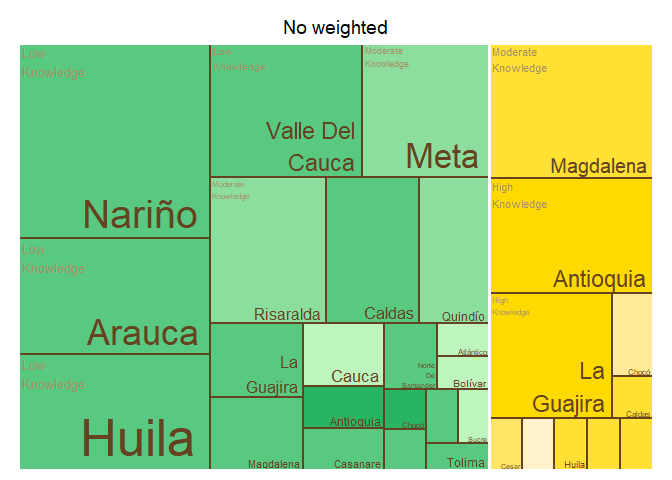<!-- -->

    ## $tm
    ##        crop          expert_in             ave_cat vSize  vColor stdErr
    ## 1    Banana          Antioquia      High Knowledge    11 #FFDA00     11
    ## 2    Banana          Antioquia                <NA>    11 #FFDA00     11
    ## 3    Banana             Caldas  Moderate Knowledge     1 #FFE033      1
    ## 4    Banana             Caldas                <NA>     1 #FFE033      1
    ## 5    Banana              Cesar                <NA>     1 #FFE566      1
    ## 6    Banana              Cesar Very High Knowledge     1 #FFE566      1
    ## 7    Banana              Chocó       Low Knowledge     2 #FFEB99      2
    ## 8    Banana              Chocó                <NA>     2 #FFEB99      2
    ## 9    Banana            Córdoba                <NA>     1 #FFF2CC      1
    ## 10   Banana            Córdoba  Very Low Knowledge     1 #FFF2CC      1
    ## 11   Banana              Huila  Moderate Knowledge     1 #FFE033      1
    ## 12   Banana              Huila                <NA>     1 #FFE033      1
    ## 13   Banana         La Guajira      High Knowledge     9 #FFDA00      9
    ## 14   Banana         La Guajira                <NA>     9 #FFDA00      9
    ## 15   Banana          Magdalena  Moderate Knowledge    13 #FFE033     13
    ## 16   Banana          Magdalena                <NA>    13 #FFE033     13
    ## 17   Banana               <NA>                <NA>    41 #FFE033     41
    ## 18   Banana            Quindío  Moderate Knowledge     1 #FFE033      1
    ## 19   Banana            Quindío                <NA>     1 #FFE033      1
    ## 20   Banana          Risaralda  Moderate Knowledge     1 #FFE033      1
    ## 21   Banana          Risaralda                <NA>     1 #FFE033      1
    ## 22 Plantain          Antioquia      High Knowledge     2 #28B463      2
    ## 23 Plantain          Antioquia                <NA>     2 #28B463      2
    ## 24 Plantain             Arauca       Low Knowledge     2 #59C981      2
    ## 25 Plantain             Arauca                <NA>     2 #59C981      2
    ## 26 Plantain          Atlántico                <NA>     1 #BEF4BE      1
    ## 27 Plantain          Atlántico  Very Low Knowledge     1 #BEF4BE      1
    ## 28 Plantain            Bolívar                <NA>     1 #BEF4BE      1
    ## 29 Plantain            Bolívar  Very Low Knowledge     1 #BEF4BE      1
    ## 30 Plantain             Caldas       Low Knowledge     7 #59C981      7
    ## 31 Plantain             Caldas                <NA>     7 #59C981      7
    ## 32 Plantain           Casanare       Low Knowledge     2 #59C981      2
    ## 33 Plantain           Casanare                <NA>     2 #59C981      2
    ## 34 Plantain              Chocó      High Knowledge     1 #28B463      1
    ## 35 Plantain              Chocó                <NA>     1 #28B463      1
    ## 36 Plantain            Córdoba       Low Knowledge     1 #59C981      1
    ## 37 Plantain            Córdoba                <NA>     1 #59C981      1
    ## 38 Plantain              Huila       Low Knowledge     1 #59C981      1
    ## 39 Plantain              Huila                <NA>     1 #59C981      1
    ## 40 Plantain         La Guajira       Low Knowledge     4 #59C981      4
    ## 41 Plantain         La Guajira                <NA>     4 #59C981      4
    ## 42 Plantain          Magdalena       Low Knowledge     3 #59C981      3
    ## 43 Plantain          Magdalena                <NA>     3 #59C981      3
    ## 44 Plantain               Meta  Moderate Knowledge    10 #8CDE9F     10
    ## 45 Plantain               Meta                <NA>    10 #8CDE9F     10
    ## 46 Plantain               <NA>                <NA>    55 #59C981     55
    ## 47 Plantain Norte De Santander  Moderate Knowledge     1 #8CDE9F      1
    ## 48 Plantain Norte De Santander                <NA>     1 #8CDE9F      1
    ## 49 Plantain            Quindío  Moderate Knowledge     6 #8CDE9F      6
    ## 50 Plantain            Quindío                <NA>     6 #8CDE9F      6
    ## 51 Plantain          Risaralda  Moderate Knowledge    10 #8CDE9F     10
    ## 52 Plantain          Risaralda                <NA>    10 #8CDE9F     10
    ## 53 Plantain          Santander       Low Knowledge     1 #59C981      1
    ## 54 Plantain          Santander                <NA>     1 #59C981      1
    ## 55 Plantain              Sucre                <NA>     1 #BEF4BE      1
    ## 56 Plantain              Sucre  Very Low Knowledge     1 #BEF4BE      1
    ## 57 Plantain             Tolima       Low Knowledge     1 #59C981      1
    ## 58 Plantain             Tolima                <NA>     1 #59C981      1
    ##    vColorValue level        x0         y0          w          h   color
    ## 1           NA     3 0.8042535 0.41463415 0.19574653 0.58536585 #FFDA00
    ## 2           NA     2 0.8042535 0.41463415 0.19574653 0.58536585 #FFDA00
    ## 3           NA     3 0.8492647 0.27642276 0.07536765 0.13821138 #FFE033
    ## 4           NA     2 0.8492647 0.27642276 0.07536765 0.13821138 #FFE033
    ## 5           NA     2 0.9246324 0.27642276 0.07536765 0.13821138 #FFE566
    ## 6           NA     3 0.9246324 0.27642276 0.07536765 0.13821138 #FFE566
    ## 7           NA     3 0.5729167 0.00000000 0.27634804 0.07538803 #FFEB99
    ## 8           NA     2 0.5729167 0.00000000 0.27634804 0.07538803 #FFEB99
    ## 9           NA     2 0.8492647 0.13821138 0.07536765 0.13821138 #FFF2CC
    ## 10          NA     3 0.8492647 0.13821138 0.07536765 0.13821138 #FFF2CC
    ## 11          NA     3 0.9246324 0.13821138 0.07536765 0.13821138 #FFE033
    ## 12          NA     2 0.9246324 0.13821138 0.07536765 0.13821138 #FFE033
    ## 13          NA     3 0.5729167 0.07538803 0.27634804 0.33924612 #FFDA00
    ## 14          NA     2 0.5729167 0.07538803 0.27634804 0.33924612 #FFDA00
    ## 15          NA     3 0.5729167 0.41463415 0.23133681 0.58536585 #FFE033
    ## 16          NA     2 0.5729167 0.41463415 0.23133681 0.58536585 #FFE033
    ## 17          NA     1 0.5729167 0.00000000 0.42708333 1.00000000 #FFE033
    ## 18          NA     3 0.8492647 0.00000000 0.07536765 0.13821138 #FFE033
    ## 19          NA     2 0.8492647 0.00000000 0.07536765 0.13821138 #FFE033
    ## 20          NA     3 0.9246324 0.00000000 0.07536765 0.13821138 #FFE033
    ## 21          NA     2 0.9246324 0.00000000 0.07536765 0.13821138 #FFE033
    ## 22          NA     3 0.4928902 0.37603306 0.08002646 0.26033058 #28B463
    ## 23          NA     2 0.4928902 0.37603306 0.08002646 0.26033058 #28B463
    ## 24          NA     3 0.2127976 0.18801653 0.11080586 0.18801653 #59C981
    ## 25          NA     2 0.2127976 0.18801653 0.11080586 0.18801653 #59C981
    ## 26          NA     2 0.3236035 0.25068871 0.08310440 0.12534435 #BEF4BE
    ## 27          NA     3 0.3236035 0.25068871 0.08310440 0.12534435 #BEF4BE
    ## 28          NA     2 0.4067079 0.25068871 0.08310440 0.12534435 #BEF4BE
    ## 29          NA     3 0.4067079 0.25068871 0.08310440 0.12534435 #BEF4BE
    ## 30          NA     3 0.0000000 0.29370629 0.21279762 0.34265734 #59C981
    ## 31          NA     2 0.0000000 0.29370629 0.21279762 0.34265734 #59C981
    ## 32          NA     3 0.2127976 0.00000000 0.11080586 0.18801653 #59C981
    ## 33          NA     2 0.2127976 0.00000000 0.11080586 0.18801653 #59C981
    ## 34          NA     3 0.4898123 0.25068871 0.08310440 0.12534435 #28B463
    ## 35          NA     2 0.4898123 0.25068871 0.08310440 0.12534435 #28B463
    ## 36          NA     3 0.3236035 0.12534435 0.08310440 0.12534435 #59C981
    ## 37          NA     2 0.3236035 0.12534435 0.08310440 0.12534435 #59C981
    ## 38          NA     3 0.3236035 0.00000000 0.08310440 0.12534435 #59C981
    ## 39          NA     2 0.3236035 0.00000000 0.08310440 0.12534435 #59C981
    ## 40          NA     3 0.2127976 0.37603306 0.16005291 0.26033058 #59C981
    ## 41          NA     2 0.2127976 0.37603306 0.16005291 0.26033058 #59C981
    ## 42          NA     3 0.3728505 0.37603306 0.12003968 0.26033058 #59C981
    ## 43          NA     2 0.3728505 0.37603306 0.12003968 0.26033058 #59C981
    ## 44          NA     3 0.0000000 0.63636364 0.28645833 0.36363636 #8CDE9F
    ## 45          NA     2 0.0000000 0.63636364 0.28645833 0.36363636 #8CDE9F
    ## 46          NA     1 0.0000000 0.00000000 0.57291667 1.00000000 #59C981
    ## 47          NA     3 0.4067079 0.12534435 0.08310440 0.12534435 #8CDE9F
    ## 48          NA     2 0.4067079 0.12534435 0.08310440 0.12534435 #8CDE9F
    ## 49          NA     3 0.0000000 0.00000000 0.21279762 0.29370629 #8CDE9F
    ## 50          NA     2 0.0000000 0.00000000 0.21279762 0.29370629 #8CDE9F
    ## 51          NA     3 0.2864583 0.63636364 0.28645833 0.36363636 #8CDE9F
    ## 52          NA     2 0.2864583 0.63636364 0.28645833 0.36363636 #8CDE9F
    ## 53          NA     3 0.4898123 0.12534435 0.08310440 0.12534435 #59C981
    ## 54          NA     2 0.4898123 0.12534435 0.08310440 0.12534435 #59C981
    ## 55          NA     2 0.4067079 0.00000000 0.08310440 0.12534435 #BEF4BE
    ## 56          NA     3 0.4067079 0.00000000 0.08310440 0.12534435 #BEF4BE
    ## 57          NA     3 0.4898123 0.00000000 0.08310440 0.12534435 #59C981
    ## 58          NA     2 0.4898123 0.00000000 0.08310440 0.12534435 #59C981
    ## 
    ## $type
    ## [1] "color"
    ## 
    ## $vSize
    ## [1] "frequency"
    ## 
    ## $vColor
    ## [1] "group_color"
    ## 
    ## $stdErr
    ## [1] "frequency"
    ## 
    ## $algorithm
    ## [1] "pivotSize"
    ## 
    ## $vpCoorX
    ## [1] 0.02812148 0.97187852
    ## 
    ## $vpCoorY
    ## [1] 0.01968504 0.91031496
    ## 
    ## $aspRatio
    ## [1] 1.483512
    ## 
    ## $range
    ## [1] NA NA
    ## 
    ## $mapping
    ## [1] NA NA NA
    ## 
    ## $draw
    ## [1] TRUE

``` r
tree_map_3(data = avg_dept_weight, "crop", "expert_in", "ave_cat_weighted", "group_color", title="weighted")
```

    ## `summarise()` has grouped output by 'crop', 'expert_in', 'ave_cat_weighted'.
    ## You can override using the `.groups` argument.

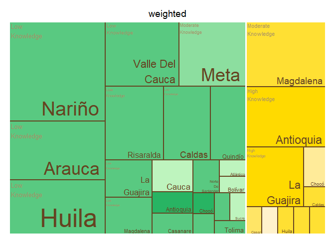<!-- -->

    ## $tm
    ##        crop          expert_in    ave_cat_weighted vSize  vColor stdErr
    ## 1    Banana          Antioquia      High Knowledge    11 #FFDA00     11
    ## 2    Banana          Antioquia                <NA>    11 #FFDA00     11
    ## 3    Banana             Caldas  Moderate Knowledge     1 #FFE033      1
    ## 4    Banana             Caldas                <NA>     1 #FFE033      1
    ## 5    Banana              Cesar                <NA>     1 #FFE566      1
    ## 6    Banana              Cesar Very High Knowledge     1 #FFE566      1
    ## 7    Banana              Chocó       Low Knowledge     2 #FFEB99      2
    ## 8    Banana              Chocó                <NA>     2 #FFEB99      2
    ## 9    Banana            Córdoba                <NA>     1 #FFF2CC      1
    ## 10   Banana            Córdoba  Very Low Knowledge     1 #FFF2CC      1
    ## 11   Banana              Huila  Moderate Knowledge     1 #FFE033      1
    ## 12   Banana              Huila                <NA>     1 #FFE033      1
    ## 13   Banana         La Guajira      High Knowledge     8 #FFDA00      8
    ## 14   Banana         La Guajira                <NA>     8 #FFDA00      8
    ## 15   Banana          Magdalena  Moderate Knowledge    12 #FFE033     12
    ## 16   Banana          Magdalena                <NA>    12 #FFE033     12
    ## 17   Banana               <NA>                <NA>    39 #FFE033     39
    ## 18   Banana            Quindío  Moderate Knowledge     1 #FFE033      1
    ## 19   Banana            Quindío                <NA>     1 #FFE033      1
    ## 20   Banana          Risaralda  Moderate Knowledge     1 #FFE033      1
    ## 21   Banana          Risaralda                <NA>     1 #FFE033      1
    ## 22 Plantain          Antioquia      High Knowledge     2 #28B463      2
    ## 23 Plantain          Antioquia                <NA>     2 #28B463      2
    ## 24 Plantain             Arauca       Low Knowledge     2 #59C981      2
    ## 25 Plantain             Arauca                <NA>     2 #59C981      2
    ## 26 Plantain          Atlántico                <NA>     1 #BEF4BE      1
    ## 27 Plantain          Atlántico  Very Low Knowledge     1 #BEF4BE      1
    ## 28 Plantain            Bolívar                <NA>     1 #BEF4BE      1
    ## 29 Plantain            Bolívar  Very Low Knowledge     1 #BEF4BE      1
    ## 30 Plantain             Caldas       Low Knowledge     7 #59C981      7
    ## 31 Plantain             Caldas                <NA>     7 #59C981      7
    ## 32 Plantain           Casanare       Low Knowledge     2 #59C981      2
    ## 33 Plantain           Casanare                <NA>     2 #59C981      2
    ## 34 Plantain              Chocó      High Knowledge     1 #28B463      1
    ## 35 Plantain              Chocó                <NA>     1 #28B463      1
    ## 36 Plantain            Córdoba       Low Knowledge     1 #59C981      1
    ## 37 Plantain            Córdoba                <NA>     1 #59C981      1
    ## 38 Plantain              Huila       Low Knowledge     1 #59C981      1
    ## 39 Plantain              Huila                <NA>     1 #59C981      1
    ## 40 Plantain         La Guajira       Low Knowledge     4 #59C981      4
    ## 41 Plantain         La Guajira                <NA>     4 #59C981      4
    ## 42 Plantain          Magdalena       Low Knowledge     3 #59C981      3
    ## 43 Plantain          Magdalena                <NA>     3 #59C981      3
    ## 44 Plantain               Meta  Moderate Knowledge    10 #8CDE9F     10
    ## 45 Plantain               Meta                <NA>    10 #8CDE9F     10
    ## 46 Plantain               <NA>                <NA>    55 #59C981     55
    ## 47 Plantain Norte De Santander  Moderate Knowledge     1 #8CDE9F      1
    ## 48 Plantain Norte De Santander                <NA>     1 #8CDE9F      1
    ## 49 Plantain            Quindío       Low Knowledge     6 #59C981      6
    ## 50 Plantain            Quindío                <NA>     6 #59C981      6
    ## 51 Plantain          Risaralda       Low Knowledge    10 #59C981     10
    ## 52 Plantain          Risaralda                <NA>    10 #59C981     10
    ## 53 Plantain          Santander       Low Knowledge     1 #59C981      1
    ## 54 Plantain          Santander                <NA>     1 #59C981      1
    ## 55 Plantain              Sucre                <NA>     1 #BEF4BE      1
    ## 56 Plantain              Sucre  Very Low Knowledge     1 #BEF4BE      1
    ## 57 Plantain             Tolima       Low Knowledge     1 #59C981      1
    ## 58 Plantain             Tolima                <NA>     1 #59C981      1
    ##    vColorValue level        x0         y0          w          h   color
    ## 1           NA     3 0.8015726 0.41025641 0.19842738 0.58974359 #FFDA00
    ## 2           NA     2 0.8015726 0.41025641 0.19842738 0.58974359 #FFDA00
    ## 3           NA     3 0.8444149 0.27350427 0.07779255 0.13675214 #FFE033
    ## 4           NA     2 0.8444149 0.27350427 0.07779255 0.13675214 #FFE033
    ## 5           NA     2 0.9222074 0.27350427 0.07779255 0.13675214 #FFE566
    ## 6           NA     3 0.9222074 0.27350427 0.07779255 0.13675214 #FFE566
    ## 7           NA     3 0.5851064 0.00000000 0.25930851 0.08205128 #FFEB99
    ## 8           NA     2 0.5851064 0.00000000 0.25930851 0.08205128 #FFEB99
    ## 9           NA     2 0.8444149 0.13675214 0.07779255 0.13675214 #FFF2CC
    ## 10          NA     3 0.8444149 0.13675214 0.07779255 0.13675214 #FFF2CC
    ## 11          NA     3 0.9222074 0.13675214 0.07779255 0.13675214 #FFE033
    ## 12          NA     2 0.9222074 0.13675214 0.07779255 0.13675214 #FFE033
    ## 13          NA     3 0.5851064 0.08205128 0.25930851 0.32820513 #FFDA00
    ## 14          NA     2 0.5851064 0.08205128 0.25930851 0.32820513 #FFDA00
    ## 15          NA     3 0.5851064 0.41025641 0.21646623 0.58974359 #FFE033
    ## 16          NA     2 0.5851064 0.41025641 0.21646623 0.58974359 #FFE033
    ## 17          NA     1 0.5851064 0.00000000 0.41489362 1.00000000 #FFE033
    ## 18          NA     3 0.8444149 0.00000000 0.07779255 0.13675214 #FFE033
    ## 19          NA     2 0.8444149 0.00000000 0.07779255 0.13675214 #FFE033
    ## 20          NA     3 0.9222074 0.00000000 0.07779255 0.13675214 #FFE033
    ## 21          NA     2 0.9222074 0.00000000 0.07779255 0.13675214 #FFE033
    ## 22          NA     3 0.5033772 0.37603306 0.08172915 0.26033058 #28B463
    ## 23          NA     2 0.5033772 0.37603306 0.08172915 0.26033058 #28B463
    ## 24          NA     3 0.2173252 0.18801653 0.11316343 0.18801653 #59C981
    ## 25          NA     2 0.2173252 0.18801653 0.11316343 0.18801653 #59C981
    ## 26          NA     2 0.3304887 0.25068871 0.08487257 0.12534435 #BEF4BE
    ## 27          NA     3 0.3304887 0.25068871 0.08487257 0.12534435 #BEF4BE
    ## 28          NA     2 0.3304887 0.12534435 0.08487257 0.12534435 #BEF4BE
    ## 29          NA     3 0.3304887 0.12534435 0.08487257 0.12534435 #BEF4BE
    ## 30          NA     3 0.0000000 0.29370629 0.21732523 0.34265734 #59C981
    ## 31          NA     2 0.0000000 0.29370629 0.21732523 0.34265734 #59C981
    ## 32          NA     3 0.2173252 0.00000000 0.11316343 0.18801653 #59C981
    ## 33          NA     2 0.2173252 0.00000000 0.11316343 0.18801653 #59C981
    ## 34          NA     3 0.3304887 0.00000000 0.08487257 0.12534435 #28B463
    ## 35          NA     2 0.3304887 0.00000000 0.08487257 0.12534435 #28B463
    ## 36          NA     3 0.4153612 0.25068871 0.08487257 0.12534435 #59C981
    ## 37          NA     2 0.4153612 0.25068871 0.08487257 0.12534435 #59C981
    ## 38          NA     3 0.5002338 0.25068871 0.08487257 0.12534435 #59C981
    ## 39          NA     2 0.5002338 0.25068871 0.08487257 0.12534435 #59C981
    ## 40          NA     3 0.2173252 0.37603306 0.16345829 0.26033058 #59C981
    ## 41          NA     2 0.2173252 0.37603306 0.16345829 0.26033058 #59C981
    ## 42          NA     3 0.3807835 0.37603306 0.12259372 0.26033058 #59C981
    ## 43          NA     2 0.3807835 0.37603306 0.12259372 0.26033058 #59C981
    ## 44          NA     3 0.0000000 0.63636364 0.29255319 0.36363636 #8CDE9F
    ## 45          NA     2 0.0000000 0.63636364 0.29255319 0.36363636 #8CDE9F
    ## 46          NA     1 0.0000000 0.00000000 0.58510638 1.00000000 #59C981
    ## 47          NA     3 0.4153612 0.12534435 0.08487257 0.12534435 #8CDE9F
    ## 48          NA     2 0.4153612 0.12534435 0.08487257 0.12534435 #8CDE9F
    ## 49          NA     3 0.0000000 0.00000000 0.21732523 0.29370629 #59C981
    ## 50          NA     2 0.0000000 0.00000000 0.21732523 0.29370629 #59C981
    ## 51          NA     3 0.2925532 0.63636364 0.29255319 0.36363636 #59C981
    ## 52          NA     2 0.2925532 0.63636364 0.29255319 0.36363636 #59C981
    ## 53          NA     3 0.4153612 0.00000000 0.08487257 0.12534435 #59C981
    ## 54          NA     2 0.4153612 0.00000000 0.08487257 0.12534435 #59C981
    ## 55          NA     2 0.5002338 0.12534435 0.08487257 0.12534435 #BEF4BE
    ## 56          NA     3 0.5002338 0.12534435 0.08487257 0.12534435 #BEF4BE
    ## 57          NA     3 0.5002338 0.00000000 0.08487257 0.12534435 #59C981
    ## 58          NA     2 0.5002338 0.00000000 0.08487257 0.12534435 #59C981
    ## 
    ## $type
    ## [1] "color"
    ## 
    ## $vSize
    ## [1] "frequency"
    ## 
    ## $vColor
    ## [1] "group_color"
    ## 
    ## $stdErr
    ## [1] "frequency"
    ## 
    ## $algorithm
    ## [1] "pivotSize"
    ## 
    ## $vpCoorX
    ## [1] 0.02812148 0.97187852
    ## 
    ## $vpCoorY
    ## [1] 0.01968504 0.91031496
    ## 
    ## $aspRatio
    ## [1] 1.483512
    ## 
    ## $range
    ## [1] NA NA
    ## 
    ## $mapping
    ## [1] NA NA NA
    ## 
    ## $draw
    ## [1] TRUE

``` r
#Map of Colombia  
  #non weighted
  nal_q6_no_weight<- question_6 %>%
  group_by(expert_in) %>%
  summarise(average= mean(as.numeric(numeric_answer))) %>% 
  group_by(average) %>%
  mutate(cat= category_by_mean_by_question(language = "en", mean = average, question =6)) %>%
  rename(EKE.expert.in=expert_in)
```

    ## Warning: There was 1 warning in `mutate()`.
    ## ℹ In argument: `cat = category_by_mean_by_question(...)`.
    ## ℹ In group 0: .
    ## Caused by warning:
    ## ! There was 1 warning in `filter()`.
    ## ℹ In argument: `number == question & number_to_category == mean`.
    ## Caused by warning in `number_to_category == mean`:
    ## ! longer object length is not a multiple of shorter object length

``` r
  nal_q6_no_weight<- full_join(codes_department, nal_q6_no_weight)
```

    ## Joining with `by = join_by(EKE.expert.in)`

``` r
  nal_q6_no_weight$cat<- factor(nal_q6_no_weight$cat, levels = c("Very Low Knowledge","Low Knowledge", "Moderate Knowledge", "High Knowledge", "Very High Knowledge", NA))
  colmap(departamentos, data = nal_q6_no_weight, data_id = "id_depto", var = "cat")+
    scale_fill_manual(values = palette_soil(length(unique(nal_q6_no_weight$cat))-1), na.value = "#eeeeee")
```

    ## Scale for fill is already present.
    ## Adding another scale for fill, which will replace the existing scale.

<!-- -->

``` r
# weighted
  nal_q6_weight<- inner_join(question_6, experience_of_each_expert)
```

    ## Joining with `by = join_by(crop, expert_ID, expert_in)`

``` r
  nal_q6_weight<- nal_q6_weight %>%
  group_by(expert_in) %>%
  mutate(numeric_answer=as.numeric(numeric_answer)) %>%
  summarise(average_weighted= weighted.mean(numeric_answer, weights)) %>% 
  group_by(average_weighted) %>%
  mutate(cat_weighted= category_by_mean_by_question(language = "en", mean = average_weighted, question =6)) %>%
  rename(EKE.expert.in=expert_in)
```

    ## Warning: There was 1 warning in `mutate()`.
    ## ℹ In argument: `cat_weighted = category_by_mean_by_question(...)`.
    ## ℹ In group 0: .
    ## Caused by warning:
    ## ! There was 1 warning in `filter()`.
    ## ℹ In argument: `number == question & number_to_category == mean`.
    ## Caused by warning in `number_to_category == mean`:
    ## ! longer object length is not a multiple of shorter object length

``` r
  nal_q6_weight<- full_join(codes_department, nal_q6_weight)
```

    ## Joining with `by = join_by(EKE.expert.in)`

``` r
  nal_q6_weight$cat_weighted<- factor(nal_q6_weight$cat_weighted, levels = c("Very Low Knowledge","Low Knowledge", "Moderate Knowledge", "High Knowledge", "Very High Knowledge", NA))
  colmap(departamentos, data = nal_q6_weight, data_id = "id_depto", var = "cat_weighted")+
    scale_fill_manual(values = palette_soil(length(unique(nal_q6_weight$cat))-1), na.value = "#eeeeee")
```

    ## Scale for fill is already present.
    ## Adding another scale for fill, which will replace the existing scale.

<!-- -->

## Question 7: What is the likelihood of each region reporting an outbreak of a pest or disease in banana plantations?

``` r
#selecting only question 7----
question_7<- filter(individual_surveys, question_number==7)
#some experts selected more than one option in this question so an intermediate answer is chosen 
question_7 <- question_7 %>%
  mutate(answer_in_english = case_when(
    answer_in_english == "Somewhat Likely,Likely" ~ "Likely",
    answer_in_english == "Extremely Unlikely,Unlikely" ~ "Very Unlikely",
    TRUE ~ answer_in_english  # This keeps all other values as they are
  ))
#some experts selected more than one option in this question so an intermediate answer is chosen 
question_7 <- question_7 %>%
  mutate(numeric_answer = case_when(
    numeric_answer == "1,3" ~ "2",
    numeric_answer == "6,7" ~ "6.5",
    TRUE ~ numeric_answer  # This keeps all other values as they are
  ))
#organizing the order of the levels
question_7$answer_in_english<- factor(question_7$answer_in_english,levels = c("Extremely Unlikely", "Very Unlikely", "Somewhat Unlikely", 
                                                                              "Unlikely", "Neutral", "Somewhat Likely", "Likely", 
                                                                              "Very Likely", "Extremely Likely"))
#average by department (weighted and no weighted)
#not weighted 
avg_dept_no_weight_7<- question_7 %>%
  group_by(crop, expert_in) %>%
  mutate(numeric_answer=as.numeric(numeric_answer))%>%
  mutate(average= mean(numeric_answer)) %>%
  group_by(average)%>%
  mutate(ave_cat= category_by_mean_by_question(7, mean =average, language = "en"))
```

    ## Warning: There were 12 warnings in `mutate()`.
    ## The first warning was:
    ## ℹ In argument: `ave_cat = category_by_mean_by_question(7, mean = average,
    ##   language = "en")`.
    ## ℹ In group 0: .
    ## Caused by warning:
    ## ! There was 1 warning in `filter()`.
    ## ℹ In argument: `number == question & number_to_category == mean`.
    ## Caused by warning in `number_to_category == mean`:
    ## ! longer object length is not a multiple of shorter object length
    ## ℹ Run `dplyr::last_dplyr_warnings()` to see the 11 remaining warnings.

``` r
#weighted 
add_weights_question_7<- inner_join(question_7, experience_of_each_expert)
```

    ## Joining with `by = join_by(crop, expert_ID, expert_in)`

``` r
avg_dept_weight_7<- add_weights_question_7 %>%
  group_by(crop, expert_in) %>%
  mutate(numeric_answer=as.numeric(numeric_answer))%>%
  mutate(average_weighted= weighted.mean(numeric_answer, weights)) %>% 
  group_by(average_weighted)%>%
  mutate(ave_cat_weighted= category_by_mean_by_question(7, mean =average_weighted, language = "en"))
```

    ## Warning: There were 9 warnings in `mutate()`.
    ## The first warning was:
    ## ℹ In argument: `ave_cat_weighted = category_by_mean_by_question(7, mean =
    ##   average_weighted, language = "en")`.
    ## ℹ In group 0: .
    ## Caused by warning:
    ## ! There was 1 warning in `filter()`.
    ## ℹ In argument: `number == question & number_to_category == mean`.
    ## Caused by warning in `number_to_category == mean`:
    ## ! longer object length is not a multiple of shorter object length
    ## ℹ Run `dplyr::last_dplyr_warnings()` to see the 8 remaining warnings.

``` r
#finding the levels per crop (banana and plantain) no weighted
levels_per_crop_Q7_no_weighted<- tapply(avg_dept_no_weight_7$ave_cat, avg_dept_no_weight_7$crop, function(x){(unique(x))})
#generating a ramp palette according to the number of levels per crop
colors_banana_question7_no_weighted<- palette_banana(length(levels_per_crop_Q7_no_weighted$Banana))
colors_plantain_question7_no_weighted<- palette_plantain(length(levels_per_crop_Q7_no_weighted$Plantain))
#Assigning the colors by crop and answer
# Define the knowledge levels for each crop
levels_by_crop_no_weighted_7 <- list(
  Banana = levels_per_crop_Q7_no_weighted$Banana,
  Plantain = levels_per_crop_Q7_no_weighted$Plantain
)
# Define the colors for each crop
colors_by_crop_no_weighted_7 <- list(
  Banana = colors_banana_question7_no_weighted, # Replace with actual color vector for Banana
  Plantain = colors_plantain_question7_no_weighted # Replace with actual color vector for Plantain
  # Add more crops and their color vectors here if needed
)
# Now call the function
avg_dept_no_weight_7 <- assign_group_color(data = avg_dept_no_weight_7, levels_by_crop = levels_by_crop_no_weighted_7, colors_by_crop = colors_by_crop_no_weighted_7,answer_col =  "ave_cat")

#finding the levels per crop (banana and plantain) weighted
levels_per_crop_Q7_weighted<- tapply(avg_dept_weight_7$ave_cat_weighted, avg_dept_weight_7$crop, function(x){(unique(x))})
#generating a ramp palette according to the number of levels per crop
colors_banana_question7_weighted<- palette_banana(length(levels_per_crop_Q7_weighted$Banana))
colors_plantain_question7_weighted<- palette_plantain(length(levels_per_crop_Q7_weighted$Plantain))
#Assigning the colors by crop and answer
# Define the knowledge levels for each crop
levels_by_crop_weighted_7 <- list(
  Banana = levels_per_crop_Q7_weighted$Banana,
  Plantain = levels_per_crop_Q7_weighted$Plantain
)
# Define the colors for each crop
colors_by_crop_weighted_7 <- list(
  Banana = colors_banana_question7_weighted, # Replace with actual color vector for Banana
  Plantain = colors_plantain_question7_weighted # Replace with actual color vector for Plantain
  # Add more crops and their color vectors here if needed
)
# Now call the function
avg_dept_weight_7 <- assign_group_color(data = avg_dept_weight_7, levels_by_crop = levels_by_crop_weighted_7, colors_by_crop = colors_by_crop_weighted_7,answer_col =  "ave_cat_weighted")

#tree map
tree_map_3(data = avg_dept_no_weight_7, "crop", "expert_in", "ave_cat", "group_color", title="No weighted")
```

    ## `summarise()` has grouped output by 'crop', 'expert_in', 'ave_cat'. You can
    ## override using the `.groups` argument.

<!-- -->

    ## $tm
    ##        crop          expert_in           ave_cat vSize  vColor stdErr
    ## 1    Banana          Antioquia              <NA>    11 #FFE033     11
    ## 2    Banana          Antioquia   Somewhat Likely    11 #FFE033     11
    ## 3    Banana             Arauca            Likely     1 #FFDA00      1
    ## 4    Banana             Arauca              <NA>     1 #FFDA00      1
    ## 5    Banana          Atlántico            Likely     1 #FFDA00      1
    ## 6    Banana          Atlántico              <NA>     1 #FFDA00      1
    ## 7    Banana            Bolívar            Likely     1 #FFDA00      1
    ## 8    Banana            Bolívar              <NA>     1 #FFDA00      1
    ## 9    Banana             Caldas              <NA>     2 #FFE033      2
    ## 10   Banana             Caldas   Somewhat Likely     2 #FFE033      2
    ## 11   Banana           Casanare            Likely     1 #FFDA00      1
    ## 12   Banana           Casanare              <NA>     1 #FFDA00      1
    ## 13   Banana              Cesar              <NA>     2 #FFE566      2
    ## 14   Banana              Cesar       Very Likely     2 #FFE566      2
    ## 15   Banana              Chocó              <NA>     3 #FFEB99      3
    ## 16   Banana              Chocó           Neutral     3 #FFEB99      3
    ## 17   Banana            Córdoba              <NA>     2 #FFEB99      2
    ## 18   Banana            Córdoba           Neutral     2 #FFEB99      2
    ## 19   Banana              Huila              <NA>     1 #FFF2CC      1
    ## 20   Banana              Huila Somewhat Unlikely     1 #FFF2CC      1
    ## 21   Banana         La Guajira            Likely    10 #FFDA00     10
    ## 22   Banana         La Guajira              <NA>    10 #FFDA00     10
    ## 23   Banana          Magdalena              <NA>    13 #FFE033     13
    ## 24   Banana          Magdalena   Somewhat Likely    13 #FFE033     13
    ## 25   Banana               Meta            Likely     1 #FFDA00      1
    ## 26   Banana               Meta              <NA>     1 #FFDA00      1
    ## 27   Banana               <NA>              <NA>    54 #FFDA00     54
    ## 28   Banana            Quindío              <NA>     2 #FFE033      2
    ## 29   Banana            Quindío   Somewhat Likely     2 #FFE033      2
    ## 30   Banana          Risaralda              <NA>     2 #FFE033      2
    ## 31   Banana          Risaralda   Somewhat Likely     2 #FFE033      2
    ## 32   Banana              Sucre            Likely     1 #FFDA00      1
    ## 33   Banana              Sucre              <NA>     1 #FFDA00      1
    ## 34 Plantain          Antioquia              <NA>     3 #28B463      3
    ## 35 Plantain          Antioquia   Somewhat Likely     3 #28B463      3
    ## 36 Plantain             Arauca              <NA>     2 #28B463      2
    ## 37 Plantain             Arauca   Somewhat Likely     2 #28B463      2
    ## 38 Plantain          Atlántico              <NA>     1 #82DA99      1
    ## 39 Plantain          Atlántico          Unlikely     1 #82DA99      1
    ## 40 Plantain            Bolívar              <NA>     1 #82DA99      1
    ## 41 Plantain            Bolívar          Unlikely     1 #82DA99      1
    ## 42 Plantain             Caldas              <NA>     7 #64CD87      7
    ## 43 Plantain             Caldas Somewhat Unlikely     7 #64CD87      7
    ## 44 Plantain           Casanare              <NA>     3 #A0E7AB      3
    ## 45 Plantain           Casanare           Neutral     3 #A0E7AB      3
    ## 46 Plantain              Chocó              <NA>     1 #82DA99      1
    ## 47 Plantain              Chocó          Unlikely     1 #82DA99      1
    ## 48 Plantain            Córdoba              <NA>     1 #82DA99      1
    ## 49 Plantain            Córdoba          Unlikely     1 #82DA99      1
    ## 50 Plantain              Huila              <NA>     1 #82DA99      1
    ## 51 Plantain              Huila          Unlikely     1 #82DA99      1
    ## 52 Plantain         La Guajira            Likely     4 #46C075      4
    ## 53 Plantain         La Guajira              <NA>     4 #46C075      4
    ## 54 Plantain          Magdalena            Likely     3 #46C075      3
    ## 55 Plantain          Magdalena              <NA>     3 #46C075      3
    ## 56 Plantain               Meta              <NA>    10 #A0E7AB     10
    ## 57 Plantain               Meta           Neutral    10 #A0E7AB     10
    ## 58 Plantain               <NA>              <NA>    55 #82DA99     55
    ## 59 Plantain Norte De Santander              <NA>     1 #82DA99      1
    ## 60 Plantain Norte De Santander          Unlikely     1 #82DA99      1
    ## 61 Plantain            Quindío              <NA>     5 #64CD87      5
    ## 62 Plantain            Quindío Somewhat Unlikely     5 #64CD87      5
    ## 63 Plantain          Risaralda              <NA>     9 #64CD87      9
    ## 64 Plantain          Risaralda Somewhat Unlikely     9 #64CD87      9
    ## 65 Plantain          Santander              <NA>     1 #82DA99      1
    ## 66 Plantain          Santander          Unlikely     1 #82DA99      1
    ## 67 Plantain              Sucre              <NA>     1 #BEF4BE      1
    ## 68 Plantain              Sucre     Very Unlikely     1 #BEF4BE      1
    ## 69 Plantain             Tolima              <NA>     1 #82DA99      1
    ## 70 Plantain             Tolima          Unlikely     1 #82DA99      1
    ##    vColorValue level        x0         y0          w          h   color
    ## 1           NA     2 0.7729358 0.55555556 0.22706422 0.44444444 #FFE033
    ## 2           NA     3 0.7729358 0.55555556 0.22706422 0.44444444 #FFE033
    ## 3           NA     3 0.7522936 0.12962963 0.07077326 0.12962963 #FFDA00
    ## 4           NA     2 0.7522936 0.12962963 0.07077326 0.12962963 #FFDA00
    ## 5           NA     3 0.7522936 0.00000000 0.07077326 0.12962963 #FFDA00
    ## 6           NA     2 0.7522936 0.00000000 0.07077326 0.12962963 #FFDA00
    ## 7           NA     3 0.8230668 0.12962963 0.07077326 0.12962963 #FFDA00
    ## 8           NA     2 0.8230668 0.12962963 0.07077326 0.12962963 #FFDA00
    ## 9           NA     2 0.6532110 0.00000000 0.09908257 0.18518519 #FFE033
    ## 10          NA     3 0.6532110 0.00000000 0.09908257 0.18518519 #FFE033
    ## 11          NA     3 0.8230668 0.00000000 0.07077326 0.12962963 #FFDA00
    ## 12          NA     2 0.8230668 0.00000000 0.07077326 0.12962963 #FFDA00
    ## 13          NA     2 0.7522936 0.40740741 0.12385321 0.14814815 #FFE566
    ## 14          NA     3 0.7522936 0.40740741 0.12385321 0.14814815 #FFE566
    ## 15          NA     2 0.5045872 0.00000000 0.14862385 0.18518519 #FFEB99
    ## 16          NA     3 0.5045872 0.00000000 0.14862385 0.18518519 #FFEB99
    ## 17          NA     2 0.8761468 0.40740741 0.12385321 0.14814815 #FFEB99
    ## 18          NA     3 0.8761468 0.40740741 0.12385321 0.14814815 #FFEB99
    ## 19          NA     2 0.8938401 0.17283951 0.10615990 0.08641975 #FFF2CC
    ## 20          NA     3 0.8938401 0.17283951 0.10615990 0.08641975 #FFF2CC
    ## 21          NA     3 0.5045872 0.18518519 0.24770642 0.37037037 #FFDA00
    ## 22          NA     2 0.5045872 0.18518519 0.24770642 0.37037037 #FFDA00
    ## 23          NA     2 0.5045872 0.55555556 0.26834862 0.44444444 #FFE033
    ## 24          NA     3 0.5045872 0.55555556 0.26834862 0.44444444 #FFE033
    ## 25          NA     3 0.8938401 0.08641975 0.10615990 0.08641975 #FFDA00
    ## 26          NA     2 0.8938401 0.08641975 0.10615990 0.08641975 #FFDA00
    ## 27          NA     1 0.5045872 0.00000000 0.49541284 1.00000000 #FFDA00
    ## 28          NA     2 0.7522936 0.25925926 0.12385321 0.14814815 #FFE033
    ## 29          NA     3 0.7522936 0.25925926 0.12385321 0.14814815 #FFE033
    ## 30          NA     2 0.8761468 0.25925926 0.12385321 0.14814815 #FFE033
    ## 31          NA     3 0.8761468 0.25925926 0.12385321 0.14814815 #FFE033
    ## 32          NA     3 0.8938401 0.00000000 0.10615990 0.08641975 #FFDA00
    ## 33          NA     2 0.8938401 0.00000000 0.10615990 0.08641975 #FFDA00
    ## 34          NA     2 0.2242610 0.45818182 0.14016310 0.19636364 #28B463
    ## 35          NA     3 0.2242610 0.45818182 0.14016310 0.19636364 #28B463
    ## 36          NA     2 0.3644241 0.26181818 0.09344207 0.19636364 #28B463
    ## 37          NA     3 0.3644241 0.26181818 0.09344207 0.19636364 #28B463
    ## 38          NA     2 0.4578661 0.26181818 0.04672103 0.19636364 #82DA99
    ## 39          NA     3 0.4578661 0.26181818 0.04672103 0.19636364 #82DA99
    ## 40          NA     2 0.2242610 0.13090909 0.07008155 0.13090909 #82DA99
    ## 41          NA     3 0.2242610 0.13090909 0.07008155 0.13090909 #82DA99
    ## 42          NA     2 0.0000000 0.36818182 0.22426096 0.28636364 #64CD87
    ## 43          NA     3 0.0000000 0.36818182 0.22426096 0.28636364 #64CD87
    ## 44          NA     2 0.3644241 0.45818182 0.14016310 0.19636364 #A0E7AB
    ## 45          NA     3 0.3644241 0.45818182 0.14016310 0.19636364 #A0E7AB
    ## 46          NA     2 0.2242610 0.00000000 0.07008155 0.13090909 #82DA99
    ## 47          NA     3 0.2242610 0.00000000 0.07008155 0.13090909 #82DA99
    ## 48          NA     2 0.2943425 0.13090909 0.07008155 0.13090909 #82DA99
    ## 49          NA     3 0.2943425 0.13090909 0.07008155 0.13090909 #82DA99
    ## 50          NA     2 0.2943425 0.00000000 0.07008155 0.13090909 #82DA99
    ## 51          NA     3 0.2943425 0.00000000 0.07008155 0.13090909 #82DA99
    ## 52          NA     3 0.0000000 0.00000000 0.22426096 0.16363636 #46C075
    ## 53          NA     2 0.0000000 0.00000000 0.22426096 0.16363636 #46C075
    ## 54          NA     3 0.2242610 0.26181818 0.14016310 0.19636364 #46C075
    ## 55          NA     2 0.2242610 0.26181818 0.14016310 0.19636364 #46C075
    ## 56          NA     2 0.0000000 0.65454545 0.26557219 0.34545455 #A0E7AB
    ## 57          NA     3 0.0000000 0.65454545 0.26557219 0.34545455 #A0E7AB
    ## 58          NA     1 0.0000000 0.00000000 0.50458716 1.00000000 #82DA99
    ## 59          NA     2 0.3644241 0.13090909 0.07008155 0.13090909 #82DA99
    ## 60          NA     3 0.3644241 0.13090909 0.07008155 0.13090909 #82DA99
    ## 61          NA     2 0.0000000 0.16363636 0.22426096 0.20454545 #64CD87
    ## 62          NA     3 0.0000000 0.16363636 0.22426096 0.20454545 #64CD87
    ## 63          NA     2 0.2655722 0.65454545 0.23901497 0.34545455 #64CD87
    ## 64          NA     3 0.2655722 0.65454545 0.23901497 0.34545455 #64CD87
    ## 65          NA     2 0.4345056 0.13090909 0.07008155 0.13090909 #82DA99
    ## 66          NA     3 0.4345056 0.13090909 0.07008155 0.13090909 #82DA99
    ## 67          NA     2 0.3644241 0.00000000 0.07008155 0.13090909 #BEF4BE
    ## 68          NA     3 0.3644241 0.00000000 0.07008155 0.13090909 #BEF4BE
    ## 69          NA     2 0.4345056 0.00000000 0.07008155 0.13090909 #82DA99
    ## 70          NA     3 0.4345056 0.00000000 0.07008155 0.13090909 #82DA99
    ## 
    ## $type
    ## [1] "color"
    ## 
    ## $vSize
    ## [1] "frequency"
    ## 
    ## $vColor
    ## [1] "group_color"
    ## 
    ## $stdErr
    ## [1] "frequency"
    ## 
    ## $algorithm
    ## [1] "pivotSize"
    ## 
    ## $vpCoorX
    ## [1] 0.02812148 0.97187852
    ## 
    ## $vpCoorY
    ## [1] 0.01968504 0.91031496
    ## 
    ## $aspRatio
    ## [1] 1.483512
    ## 
    ## $range
    ## [1] NA NA
    ## 
    ## $mapping
    ## [1] NA NA NA
    ## 
    ## $draw
    ## [1] TRUE

``` r
tree_map_3(data = avg_dept_weight_7, "crop", "expert_in", "ave_cat_weighted", "group_color", title="weighted")
```

    ## `summarise()` has grouped output by 'crop', 'expert_in', 'ave_cat_weighted'.
    ## You can override using the `.groups` argument.

<!-- -->

    ## $tm
    ##        crop          expert_in  ave_cat_weighted vSize  vColor stdErr
    ## 1    Banana          Antioquia            Likely    11 #FFDA00     11
    ## 2    Banana          Antioquia              <NA>    11 #FFDA00     11
    ## 3    Banana             Caldas              <NA>     1 #FFEB99      1
    ## 4    Banana             Caldas Somewhat Unlikely     1 #FFEB99      1
    ## 5    Banana              Cesar              <NA>     1 #FFE566      1
    ## 6    Banana              Cesar       Very Likely     1 #FFE566      1
    ## 7    Banana              Chocó              <NA>     2 #FFEB99      2
    ## 8    Banana              Chocó Somewhat Unlikely     2 #FFEB99      2
    ## 9    Banana            Córdoba              <NA>     1 #FFF2CC      1
    ## 10   Banana            Córdoba          Unlikely     1 #FFF2CC      1
    ## 11   Banana              Huila              <NA>     1 #FFEB99      1
    ## 12   Banana              Huila Somewhat Unlikely     1 #FFEB99      1
    ## 13   Banana         La Guajira            Likely     9 #FFDA00      9
    ## 14   Banana         La Guajira              <NA>     9 #FFDA00      9
    ## 15   Banana          Magdalena              <NA>    12 #FFE033     12
    ## 16   Banana          Magdalena   Somewhat Likely    12 #FFE033     12
    ## 17   Banana               <NA>              <NA>    40 #FFEB99     40
    ## 18   Banana            Quindío              <NA>     1 #FFEB99      1
    ## 19   Banana            Quindío Somewhat Unlikely     1 #FFEB99      1
    ## 20   Banana          Risaralda              <NA>     1 #FFEB99      1
    ## 21   Banana          Risaralda Somewhat Unlikely     1 #FFEB99      1
    ## 22 Plantain          Antioquia              <NA>     3 #28B463      3
    ## 23 Plantain          Antioquia   Somewhat Likely     3 #28B463      3
    ## 24 Plantain             Arauca              <NA>     2 #28B463      2
    ## 25 Plantain             Arauca   Somewhat Likely     2 #28B463      2
    ## 26 Plantain          Atlántico              <NA>     1 #82DA99      1
    ## 27 Plantain          Atlántico          Unlikely     1 #82DA99      1
    ## 28 Plantain            Bolívar              <NA>     1 #82DA99      1
    ## 29 Plantain            Bolívar          Unlikely     1 #82DA99      1
    ## 30 Plantain             Caldas              <NA>     7 #64CD87      7
    ## 31 Plantain             Caldas Somewhat Unlikely     7 #64CD87      7
    ## 32 Plantain           Casanare              <NA>     3 #A0E7AB      3
    ## 33 Plantain           Casanare           Neutral     3 #A0E7AB      3
    ## 34 Plantain              Chocó              <NA>     1 #82DA99      1
    ## 35 Plantain              Chocó          Unlikely     1 #82DA99      1
    ## 36 Plantain            Córdoba              <NA>     1 #82DA99      1
    ## 37 Plantain            Córdoba          Unlikely     1 #82DA99      1
    ## 38 Plantain              Huila              <NA>     1 #82DA99      1
    ## 39 Plantain              Huila          Unlikely     1 #82DA99      1
    ## 40 Plantain         La Guajira            Likely     4 #46C075      4
    ## 41 Plantain         La Guajira              <NA>     4 #46C075      4
    ## 42 Plantain          Magdalena            Likely     3 #46C075      3
    ## 43 Plantain          Magdalena              <NA>     3 #46C075      3
    ## 44 Plantain               Meta              <NA>    10 #28B463     10
    ## 45 Plantain               Meta   Somewhat Likely    10 #28B463     10
    ## 46 Plantain               <NA>              <NA>    55 #82DA99     55
    ## 47 Plantain Norte De Santander              <NA>     1 #82DA99      1
    ## 48 Plantain Norte De Santander          Unlikely     1 #82DA99      1
    ## 49 Plantain            Quindío              <NA>     5 #64CD87      5
    ## 50 Plantain            Quindío Somewhat Unlikely     5 #64CD87      5
    ## 51 Plantain          Risaralda              <NA>     9 #64CD87      9
    ## 52 Plantain          Risaralda Somewhat Unlikely     9 #64CD87      9
    ## 53 Plantain          Santander              <NA>     1 #82DA99      1
    ## 54 Plantain          Santander          Unlikely     1 #82DA99      1
    ## 55 Plantain              Sucre              <NA>     1 #BEF4BE      1
    ## 56 Plantain              Sucre     Very Unlikely     1 #BEF4BE      1
    ## 57 Plantain             Tolima              <NA>     1 #82DA99      1
    ## 58 Plantain             Tolima          Unlikely     1 #82DA99      1
    ##    vColorValue level        x0         y0          w          h   color
    ## 1           NA     3 0.7986270 0.42500000 0.20137300 0.57500000 #FFDA00
    ## 2           NA     2 0.7986270 0.42500000 0.20137300 0.57500000 #FFDA00
    ## 3           NA     2 0.8513932 0.28333333 0.07430341 0.14166667 #FFEB99
    ## 4           NA     3 0.8513932 0.28333333 0.07430341 0.14166667 #FFEB99
    ## 5           NA     2 0.9256966 0.28333333 0.07430341 0.14166667 #FFE566
    ## 6           NA     3 0.9256966 0.28333333 0.07430341 0.14166667 #FFE566
    ## 7           NA     2 0.5789474 0.00000000 0.27244582 0.07727273 #FFEB99
    ## 8           NA     3 0.5789474 0.00000000 0.27244582 0.07727273 #FFEB99
    ## 9           NA     2 0.8513932 0.14166667 0.07430341 0.14166667 #FFF2CC
    ## 10          NA     3 0.8513932 0.14166667 0.07430341 0.14166667 #FFF2CC
    ## 11          NA     2 0.9256966 0.14166667 0.07430341 0.14166667 #FFEB99
    ## 12          NA     3 0.9256966 0.14166667 0.07430341 0.14166667 #FFEB99
    ## 13          NA     3 0.5789474 0.07727273 0.27244582 0.34772727 #FFDA00
    ## 14          NA     2 0.5789474 0.07727273 0.27244582 0.34772727 #FFDA00
    ## 15          NA     2 0.5789474 0.42500000 0.21967963 0.57500000 #FFE033
    ## 16          NA     3 0.5789474 0.42500000 0.21967963 0.57500000 #FFE033
    ## 17          NA     1 0.5789474 0.00000000 0.42105263 1.00000000 #FFEB99
    ## 18          NA     2 0.8513932 0.00000000 0.07430341 0.14166667 #FFEB99
    ## 19          NA     3 0.8513932 0.00000000 0.07430341 0.14166667 #FFEB99
    ## 20          NA     2 0.9256966 0.00000000 0.07430341 0.14166667 #FFEB99
    ## 21          NA     3 0.9256966 0.00000000 0.07430341 0.14166667 #FFEB99
    ## 22          NA     2 0.2573099 0.45818182 0.16081871 0.19636364 #28B463
    ## 23          NA     3 0.2573099 0.45818182 0.16081871 0.19636364 #28B463
    ## 24          NA     2 0.2573099 0.07636364 0.13784461 0.15272727 #28B463
    ## 25          NA     3 0.2573099 0.07636364 0.13784461 0.15272727 #28B463
    ## 26          NA     2 0.2573099 0.00000000 0.13784461 0.07636364 #82DA99
    ## 27          NA     3 0.2573099 0.00000000 0.13784461 0.07636364 #82DA99
    ## 28          NA     2 0.3951546 0.34363636 0.09189641 0.11454545 #82DA99
    ## 29          NA     3 0.3951546 0.34363636 0.09189641 0.11454545 #82DA99
    ## 30          NA     2 0.0000000 0.36818182 0.25730994 0.28636364 #64CD87
    ## 31          NA     3 0.0000000 0.36818182 0.25730994 0.28636364 #64CD87
    ## 32          NA     2 0.4181287 0.45818182 0.16081871 0.19636364 #A0E7AB
    ## 33          NA     3 0.4181287 0.45818182 0.16081871 0.19636364 #A0E7AB
    ## 34          NA     2 0.4870510 0.34363636 0.09189641 0.11454545 #82DA99
    ## 35          NA     3 0.4870510 0.34363636 0.09189641 0.11454545 #82DA99
    ## 36          NA     2 0.3951546 0.22909091 0.09189641 0.11454545 #82DA99
    ## 37          NA     3 0.3951546 0.22909091 0.09189641 0.11454545 #82DA99
    ## 38          NA     2 0.4870510 0.22909091 0.09189641 0.11454545 #82DA99
    ## 39          NA     3 0.4870510 0.22909091 0.09189641 0.11454545 #82DA99
    ## 40          NA     3 0.1429500 0.00000000 0.11435997 0.36818182 #46C075
    ## 41          NA     2 0.1429500 0.00000000 0.11435997 0.36818182 #46C075
    ## 42          NA     3 0.2573099 0.22909091 0.13784461 0.22909091 #46C075
    ## 43          NA     2 0.2573099 0.22909091 0.13784461 0.22909091 #46C075
    ## 44          NA     2 0.0000000 0.65454545 0.30470914 0.34545455 #28B463
    ## 45          NA     3 0.0000000 0.65454545 0.30470914 0.34545455 #28B463
    ## 46          NA     1 0.0000000 0.00000000 0.57894737 1.00000000 #82DA99
    ## 47          NA     2 0.3951546 0.11454545 0.09189641 0.11454545 #82DA99
    ## 48          NA     3 0.3951546 0.11454545 0.09189641 0.11454545 #82DA99
    ## 49          NA     2 0.0000000 0.00000000 0.14294997 0.36818182 #64CD87
    ## 50          NA     3 0.0000000 0.00000000 0.14294997 0.36818182 #64CD87
    ## 51          NA     2 0.3047091 0.65454545 0.27423823 0.34545455 #64CD87
    ## 52          NA     3 0.3047091 0.65454545 0.27423823 0.34545455 #64CD87
    ## 53          NA     2 0.3951546 0.00000000 0.09189641 0.11454545 #82DA99
    ## 54          NA     3 0.3951546 0.00000000 0.09189641 0.11454545 #82DA99
    ## 55          NA     2 0.4870510 0.11454545 0.09189641 0.11454545 #BEF4BE
    ## 56          NA     3 0.4870510 0.11454545 0.09189641 0.11454545 #BEF4BE
    ## 57          NA     2 0.4870510 0.00000000 0.09189641 0.11454545 #82DA99
    ## 58          NA     3 0.4870510 0.00000000 0.09189641 0.11454545 #82DA99
    ## 
    ## $type
    ## [1] "color"
    ## 
    ## $vSize
    ## [1] "frequency"
    ## 
    ## $vColor
    ## [1] "group_color"
    ## 
    ## $stdErr
    ## [1] "frequency"
    ## 
    ## $algorithm
    ## [1] "pivotSize"
    ## 
    ## $vpCoorX
    ## [1] 0.02812148 0.97187852
    ## 
    ## $vpCoorY
    ## [1] 0.01968504 0.91031496
    ## 
    ## $aspRatio
    ## [1] 1.483512
    ## 
    ## $range
    ## [1] NA NA
    ## 
    ## $mapping
    ## [1] NA NA NA
    ## 
    ## $draw
    ## [1] TRUE

``` r
#Map of Colombia  
#non weighted
nal_q7_no_weight<- question_7 %>% group_by(expert_in) %>%
  summarise(average= mean(as.numeric(numeric_answer))) %>%
  group_by(average) %>% 
  mutate(cat= category_by_mean_by_question(language = "en", mean = average, question =7))%>%
  rename(EKE.expert.in = expert_in)
```

    ## Warning: There was 1 warning in `mutate()`.
    ## ℹ In argument: `cat = category_by_mean_by_question(...)`.
    ## ℹ In group 0: .
    ## Caused by warning:
    ## ! There was 1 warning in `filter()`.
    ## ℹ In argument: `number == question & number_to_category == mean`.
    ## Caused by warning in `number_to_category == mean`:
    ## ! longer object length is not a multiple of shorter object length

``` r
nal_q7_no_weight<- full_join(codes_department, nal_q7_no_weight)
```

    ## Joining with `by = join_by(EKE.expert.in)`

``` r
nal_q7_no_weight$cat<- factor(nal_q7_no_weight$cat, levels = c("Extremely Unlikely", "Very Unlikely", "Somewhat Unlikely", 
                                                                        "Unlikely", "Neutral", "Somewhat Likely", "Likely", 
                                                                        "Very Likely", "Extremely Likely"))
colmap(departamentos, data = nal_q7_no_weight, data_id = "id_depto", var = "cat")+
  scale_fill_manual(values = palette_soil(length(unique(nal_q7_no_weight$cat))-1), na.value = "#eeeeee")
```

    ## Scale for fill is already present.
    ## Adding another scale for fill, which will replace the existing scale.

<!-- -->

``` r
# weighted
nal_q7_weight<- inner_join(question_7, experience_of_each_expert)
```

    ## Joining with `by = join_by(crop, expert_ID, expert_in)`

``` r
nal_q7_weight<- nal_q7_weight %>%
  group_by(expert_in) %>%
  mutate(numeric_answer=as.numeric(numeric_answer)) %>%
  summarise(average_weighted= weighted.mean(numeric_answer, weights)) %>% 
  group_by(average_weighted) %>%
  mutate(cat_weighted= category_by_mean_by_question(language = "en", mean = average_weighted, question =7)) %>%
  rename(EKE.expert.in=expert_in)
```

    ## Warning: There was 1 warning in `mutate()`.
    ## ℹ In argument: `cat_weighted = category_by_mean_by_question(...)`.
    ## ℹ In group 0: .
    ## Caused by warning:
    ## ! There was 1 warning in `filter()`.
    ## ℹ In argument: `number == question & number_to_category == mean`.
    ## Caused by warning in `number_to_category == mean`:
    ## ! longer object length is not a multiple of shorter object length

``` r
nal_q7_weight<- full_join(codes_department, nal_q7_weight)
```

    ## Joining with `by = join_by(EKE.expert.in)`

``` r
nal_q7_weight$cat_weighted<- factor(nal_q7_weight$cat_weighted, levels = c("Extremely Unlikely", "Very Unlikely", "Somewhat Unlikely", 
                                                                           "Unlikely", "Neutral", "Somewhat Likely", "Likely", 
                                                                           "Very Likely", "Extremely Likely"))
colmap(departamentos, data = nal_q7_weight, data_id = "id_depto", var = "cat_weighted")+
  scale_fill_manual(values = palette_soil(length(unique(nal_q7_weight$cat))-1), na.value = "#eeeeee")
```

    ## Scale for fill is already present.
    ## Adding another scale for fill, which will replace the existing scale.

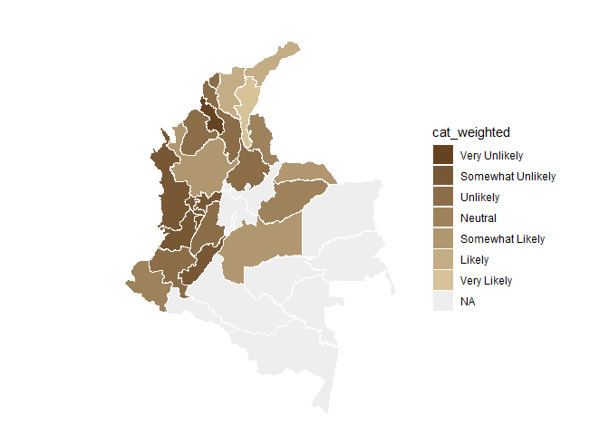<!-- -->

## Question 8: What is the perceived effectiveness of the policies implemented by the government to ensure phytosanitary safety in banana production systems?

``` r
#selecting only question 8----
question_8<- filter(individual_surveys, question_number==8)
#some experts selected more than one option in this question so an intermediate answer is chosen 
question_8 <- question_8 %>%
  mutate(answer_in_english = case_when(
    answer_in_english == "Slightly Effective,Moderately Effective" ~ "Moderately Effective",
    TRUE ~ answer_in_english  # This keeps all other values as they are
  ))
#some experts selected more than one option in this question so an intermediate answer is chosen 
question_8 <- question_8 %>%
  mutate(numeric_answer = case_when(
    numeric_answer == "2,3" ~ "2.5",
    TRUE ~ numeric_answer  # This keeps all other values as they are
  ))
#organizing the order of the levels
question_8$answer_in_english<- factor(question_8$answer_in_english,levels = c("Not Effective", "Slightly Effective", "Moderately Effective", "Very Effective", "Extremely Effective"))
#average by department (weighted and no weighted)
#not weighted 
avg_dept_no_weight_8<- question_8 %>%
  group_by(crop, expert_in) %>%
  mutate(numeric_answer=as.numeric(numeric_answer))%>%
  mutate(average= mean(numeric_answer)) %>%
  group_by(average)%>%
  mutate(ave_cat= category_by_mean_by_question(8, mean =average, language = "en"))
```

    ## Warning: There were 6 warnings in `mutate()`.
    ## The first warning was:
    ## ℹ In argument: `ave_cat = category_by_mean_by_question(8, mean = average,
    ##   language = "en")`.
    ## ℹ In group 0: .
    ## Caused by warning:
    ## ! There was 1 warning in `filter()`.
    ## ℹ In argument: `number == question & number_to_category == mean`.
    ## Caused by warning in `number_to_category == mean`:
    ## ! longer object length is not a multiple of shorter object length
    ## ℹ Run `dplyr::last_dplyr_warnings()` to see the 5 remaining warnings.

``` r
#weighted 
add_weights_question_8<- inner_join(question_8, experience_of_each_expert)
```

    ## Joining with `by = join_by(crop, expert_ID, expert_in)`

``` r
avg_dept_weight_8<- add_weights_question_8 %>%
  group_by(crop, expert_in) %>%
  mutate(numeric_answer=as.numeric(numeric_answer))%>%
  mutate(average_weighted= weighted.mean(numeric_answer, weights)) %>% 
  group_by(average_weighted)%>%
  mutate(ave_cat_weighted= category_by_mean_by_question(8, mean =average_weighted, language = "en"))
```

    ## Warning: There were 9 warnings in `mutate()`.
    ## The first warning was:
    ## ℹ In argument: `ave_cat_weighted = category_by_mean_by_question(8, mean =
    ##   average_weighted, language = "en")`.
    ## ℹ In group 0: .
    ## Caused by warning:
    ## ! There was 1 warning in `filter()`.
    ## ℹ In argument: `number == question & number_to_category == mean`.
    ## Caused by warning in `number_to_category == mean`:
    ## ! longer object length is not a multiple of shorter object length
    ## ℹ Run `dplyr::last_dplyr_warnings()` to see the 8 remaining warnings.

``` r
#finding the levels per crop (banana and plantain) no weighted
levels_per_crop_Q8_no_weighted<- tapply(avg_dept_no_weight_8$ave_cat, avg_dept_no_weight_8$crop, function(x){(unique(x))})
#generating a ramp palette according to the number of levels per crop
colors_banana_question8_no_weighted<- palette_banana(length(levels_per_crop_Q8_no_weighted$Banana))
colors_plantain_question8_no_weighted<- palette_plantain(length(levels_per_crop_Q8_no_weighted$Plantain))
#Assigning the colors by crop and answer
# Define the knowledge levels for each crop
levels_by_crop_no_weighted_8 <- list(
  Banana = levels_per_crop_Q8_no_weighted$Banana,
  Plantain = levels_per_crop_Q8_no_weighted$Plantain
)
# Define the colors for each crop
colors_by_crop_no_weighted_8 <- list(
  Banana = colors_banana_question8_no_weighted, # Replace with actual color vector for Banana
  Plantain = colors_plantain_question8_no_weighted # Replace with actual color vector for Plantain
  # Add more crops and their color vectors here if needed
)
# Now call the function
avg_dept_no_weight_8 <- assign_group_color(data = avg_dept_no_weight_8, levels_by_crop = levels_by_crop_no_weighted_8, colors_by_crop = colors_by_crop_no_weighted_8,answer_col =  "ave_cat")

#finding the levels per crop (banana and plantain) weighted
levels_per_crop_Q8_weighted<- tapply(avg_dept_weight_8$ave_cat_weighted, avg_dept_weight_8$crop, function(x){(unique(x))})
#generating a ramp palette according to the number of levels per crop
colors_banana_question8_weighted<- palette_banana(length(levels_per_crop_Q8_weighted$Banana))
colors_plantain_question8_weighted<- palette_plantain(length(levels_per_crop_Q8_weighted$Plantain))
#Assigning the colors by crop and answer
# Define the knowledge levels for each crop
levels_by_crop_weighted_8 <- list(
  Banana = levels_per_crop_Q8_weighted$Banana,
  Plantain = levels_per_crop_Q8_weighted$Plantain
)
# Define the colors for each crop
colors_by_crop_weighted_8 <- list(
  Banana = colors_banana_question8_weighted, # Replace with actual color vector for Banana
  Plantain = colors_plantain_question8_weighted # Replace with actual color vector for Plantain
  # Add more crops and their color vectors here if needed
)
# Now call the function
avg_dept_weight_8 <- assign_group_color(data = avg_dept_weight_8, levels_by_crop = levels_by_crop_weighted_8, colors_by_crop = colors_by_crop_weighted_8,answer_col =  "ave_cat_weighted")

#tree map
tree_map_3(data = avg_dept_no_weight_8, "crop", "expert_in", "ave_cat", "group_color", title="No weighted")
```

    ## `summarise()` has grouped output by 'crop', 'expert_in', 'ave_cat'. You can
    ## override using the `.groups` argument.

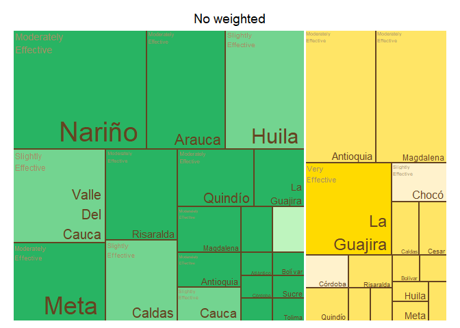<!-- -->

    ## $tm
    ##        crop          expert_in              ave_cat vSize  vColor stdErr
    ## 1    Banana          Antioquia Moderately Effective    13 #FFE566     13
    ## 2    Banana          Antioquia                 <NA>    13 #FFE566     13
    ## 3    Banana             Arauca Moderately Effective     1 #FFE566      1
    ## 4    Banana             Arauca                 <NA>     1 #FFE566      1
    ## 5    Banana          Atlántico Moderately Effective     1 #FFE566      1
    ## 6    Banana          Atlántico                 <NA>     1 #FFE566      1
    ## 7    Banana            Bolívar Moderately Effective     1 #FFE566      1
    ## 8    Banana            Bolívar                 <NA>     1 #FFE566      1
    ## 9    Banana             Caldas Moderately Effective     2 #FFE566      2
    ## 10   Banana             Caldas                 <NA>     2 #FFE566      2
    ## 11   Banana           Casanare Moderately Effective     1 #FFE566      1
    ## 12   Banana           Casanare                 <NA>     1 #FFE566      1
    ## 13   Banana              Cesar Moderately Effective     2 #FFE566      2
    ## 14   Banana              Cesar                 <NA>     2 #FFE566      2
    ## 15   Banana              Chocó                 <NA>     3 #FFF2CC      3
    ## 16   Banana              Chocó   Slightly Effective     3 #FFF2CC      3
    ## 17   Banana            Córdoba                 <NA>     2 #FFF2CC      2
    ## 18   Banana            Córdoba   Slightly Effective     2 #FFF2CC      2
    ## 19   Banana              Huila Moderately Effective     1 #FFE566      1
    ## 20   Banana              Huila                 <NA>     1 #FFE566      1
    ## 21   Banana         La Guajira                 <NA>    11 #FFDA00     11
    ## 22   Banana         La Guajira       Very Effective    11 #FFDA00     11
    ## 23   Banana          Magdalena Moderately Effective    13 #FFE566     13
    ## 24   Banana          Magdalena                 <NA>    13 #FFE566     13
    ## 25   Banana               Meta Moderately Effective     1 #FFE566      1
    ## 26   Banana               Meta                 <NA>     1 #FFE566      1
    ## 27   Banana               <NA>                 <NA>    57 #FFE566     57
    ## 28   Banana            Quindío Moderately Effective     2 #FFE566      2
    ## 29   Banana            Quindío                 <NA>     2 #FFE566      2
    ## 30   Banana          Risaralda Moderately Effective     2 #FFE566      2
    ## 31   Banana          Risaralda                 <NA>     2 #FFE566      2
    ## 32   Banana              Sucre Moderately Effective     1 #FFE566      1
    ## 33   Banana              Sucre                 <NA>     1 #FFE566      1
    ## 34 Plantain          Antioquia Moderately Effective     3 #28B463      3
    ## 35 Plantain          Antioquia                 <NA>     3 #28B463      3
    ## 36 Plantain             Arauca Moderately Effective     2 #28B463      2
    ## 37 Plantain             Arauca                 <NA>     2 #28B463      2
    ## 38 Plantain          Atlántico Moderately Effective     1 #28B463      1
    ## 39 Plantain          Atlántico                 <NA>     1 #28B463      1
    ## 40 Plantain            Bolívar Moderately Effective     1 #28B463      1
    ## 41 Plantain            Bolívar                 <NA>     1 #28B463      1
    ## 42 Plantain             Caldas                 <NA>     7 #BEF4BE      7
    ## 43 Plantain             Caldas   Slightly Effective     7 #BEF4BE      7
    ## 44 Plantain           Casanare Moderately Effective     2 #28B463      2
    ## 45 Plantain           Casanare                 <NA>     2 #28B463      2
    ## 46 Plantain            Córdoba Moderately Effective     1 #28B463      1
    ## 47 Plantain            Córdoba                 <NA>     1 #28B463      1
    ## 48 Plantain              Huila Moderately Effective     1 #28B463      1
    ## 49 Plantain              Huila                 <NA>     1 #28B463      1
    ## 50 Plantain         La Guajira Moderately Effective     4 #28B463      4
    ## 51 Plantain         La Guajira                 <NA>     4 #28B463      4
    ## 52 Plantain          Magdalena Moderately Effective     3 #28B463      3
    ## 53 Plantain          Magdalena                 <NA>     3 #28B463      3
    ## 54 Plantain               Meta Moderately Effective    10 #28B463     10
    ## 55 Plantain               Meta                 <NA>    10 #28B463     10
    ## 56 Plantain               <NA>                 <NA>    54 #28B463     54
    ## 57 Plantain Norte De Santander Moderately Effective     1 #28B463      1
    ## 58 Plantain Norte De Santander                 <NA>     1 #28B463      1
    ## 59 Plantain            Quindío Moderately Effective     6 #28B463      6
    ## 60 Plantain            Quindío                 <NA>     6 #28B463      6
    ## 61 Plantain          Risaralda Moderately Effective     9 #28B463      9
    ## 62 Plantain          Risaralda                 <NA>     9 #28B463      9
    ## 63 Plantain          Santander Moderately Effective     1 #28B463      1
    ## 64 Plantain          Santander                 <NA>     1 #28B463      1
    ## 65 Plantain              Sucre Moderately Effective     1 #28B463      1
    ## 66 Plantain              Sucre                 <NA>     1 #28B463      1
    ## 67 Plantain             Tolima Moderately Effective     1 #28B463      1
    ## 68 Plantain             Tolima                 <NA>     1 #28B463      1
    ##    vColorValue level        x0        y0          w         h   color
    ## 1           NA     3 0.0000000 0.5438596 0.25675676 0.4561404 #FFE566
    ## 2           NA     2 0.0000000 0.5438596 0.25675676 0.4561404 #FFE566
    ## 3           NA     3 0.4638187 0.2175439 0.04969486 0.1812865 #FFE566
    ## 4           NA     2 0.4638187 0.2175439 0.04969486 0.1812865 #FFE566
    ## 5           NA     3 0.2650392 0.1087719 0.08282476 0.1087719 #FFE566
    ## 6           NA     2 0.2650392 0.1087719 0.08282476 0.1087719 #FFE566
    ## 7           NA     3 0.2650392 0.0000000 0.08282476 0.1087719 #FFE566
    ## 8           NA     2 0.2650392 0.0000000 0.08282476 0.1087719 #FFE566
    ## 9           NA     3 0.1590235 0.0000000 0.10601569 0.1699561 #FFE566
    ## 10          NA     2 0.1590235 0.0000000 0.10601569 0.1699561 #FFE566
    ## 11          NA     3 0.3478640 0.1087719 0.08282476 0.1087719 #FFE566
    ## 12          NA     2 0.3478640 0.1087719 0.08282476 0.1087719 #FFE566
    ## 13          NA     3 0.2650392 0.3988304 0.12423714 0.1450292 #FFE566
    ## 14          NA     2 0.2650392 0.3988304 0.12423714 0.1450292 #FFE566
    ## 15          NA     2 0.0000000 0.0000000 0.15902354 0.1699561 #FFF2CC
    ## 16          NA     3 0.0000000 0.0000000 0.15902354 0.1699561 #FFF2CC
    ## 17          NA     2 0.3892764 0.3988304 0.12423714 0.1450292 #FFF2CC
    ## 18          NA     3 0.3892764 0.3988304 0.12423714 0.1450292 #FFF2CC
    ## 19          NA     3 0.3478640 0.0000000 0.08282476 0.1087719 #FFE566
    ## 20          NA     2 0.3478640 0.0000000 0.08282476 0.1087719 #FFE566
    ## 21          NA     2 0.0000000 0.1699561 0.26503923 0.3739035 #FFDA00
    ## 22          NA     3 0.0000000 0.1699561 0.26503923 0.3739035 #FFDA00
    ## 23          NA     3 0.2567568 0.5438596 0.25675676 0.4561404 #FFE566
    ## 24          NA     2 0.2567568 0.5438596 0.25675676 0.4561404 #FFE566
    ## 25          NA     3 0.4306888 0.1087719 0.08282476 0.1087719 #FFE566
    ## 26          NA     2 0.4306888 0.1087719 0.08282476 0.1087719 #FFE566
    ## 27          NA     1 0.0000000 0.0000000 0.51351351 1.0000000 #FFE566
    ## 28          NA     3 0.2650392 0.2175439 0.09938971 0.1812865 #FFE566
    ## 29          NA     2 0.2650392 0.2175439 0.09938971 0.1812865 #FFE566
    ## 30          NA     3 0.3644289 0.2175439 0.09938971 0.1812865 #FFE566
    ## 31          NA     2 0.3644289 0.2175439 0.09938971 0.1812865 #FFE566
    ## 32          NA     3 0.4306888 0.0000000 0.08282476 0.1087719 #FFE566
    ## 33          NA     2 0.4306888 0.0000000 0.08282476 0.1087719 #FFE566
    ## 34          NA     3 0.8689465 0.4419192 0.13105350 0.2062290 #28B463
    ## 35          NA     2 0.8689465 0.4419192 0.13105350 0.2062290 #28B463
    ## 36          NA     3 0.6942085 0.1262626 0.14270270 0.1262626 #28B463
    ## 37          NA     2 0.6942085 0.1262626 0.14270270 0.1262626 #28B463
    ## 38          NA     3 0.8369112 0.3314394 0.08154440 0.1104798 #28B463
    ## 39          NA     2 0.8369112 0.3314394 0.08154440 0.1104798 #28B463
    ## 40          NA     3 0.9184556 0.3314394 0.08154440 0.1104798 #28B463
    ## 41          NA     2 0.9184556 0.3314394 0.08154440 0.1104798 #28B463
    ## 42          NA     2 0.5135135 0.2991453 0.18069498 0.3490028 #BEF4BE
    ## 43          NA     3 0.5135135 0.2991453 0.18069498 0.3490028 #BEF4BE
    ## 44          NA     3 0.6942085 0.0000000 0.14270270 0.1262626 #28B463
    ## 45          NA     2 0.6942085 0.0000000 0.14270270 0.1262626 #28B463
    ## 46          NA     3 0.8369112 0.2209596 0.08154440 0.1104798 #28B463
    ## 47          NA     2 0.8369112 0.2209596 0.08154440 0.1104798 #28B463
    ## 48          NA     3 0.9184556 0.2209596 0.08154440 0.1104798 #28B463
    ## 49          NA     2 0.9184556 0.2209596 0.08154440 0.1104798 #28B463
    ## 50          NA     3 0.6942085 0.4419192 0.17473800 0.2062290 #28B463
    ## 51          NA     2 0.6942085 0.4419192 0.17473800 0.2062290 #28B463
    ## 52          NA     3 0.6942085 0.2525253 0.14270270 0.1893939 #28B463
    ## 53          NA     2 0.6942085 0.2525253 0.14270270 0.1893939 #28B463
    ## 54          NA     3 0.5135135 0.6481481 0.25604552 0.3518519 #28B463
    ## 55          NA     2 0.5135135 0.6481481 0.25604552 0.3518519 #28B463
    ## 56          NA     1 0.5135135 0.0000000 0.48648649 1.0000000 #28B463
    ## 57          NA     3 0.8369112 0.1104798 0.08154440 0.1104798 #28B463
    ## 58          NA     2 0.8369112 0.1104798 0.08154440 0.1104798 #28B463
    ## 59          NA     3 0.5135135 0.0000000 0.18069498 0.2991453 #28B463
    ## 60          NA     2 0.5135135 0.0000000 0.18069498 0.2991453 #28B463
    ## 61          NA     3 0.7695590 0.6481481 0.23044097 0.3518519 #28B463
    ## 62          NA     2 0.7695590 0.6481481 0.23044097 0.3518519 #28B463
    ## 63          NA     3 0.8369112 0.0000000 0.08154440 0.1104798 #28B463
    ## 64          NA     2 0.8369112 0.0000000 0.08154440 0.1104798 #28B463
    ## 65          NA     3 0.9184556 0.1104798 0.08154440 0.1104798 #28B463
    ## 66          NA     2 0.9184556 0.1104798 0.08154440 0.1104798 #28B463
    ## 67          NA     3 0.9184556 0.0000000 0.08154440 0.1104798 #28B463
    ## 68          NA     2 0.9184556 0.0000000 0.08154440 0.1104798 #28B463
    ## 
    ## $type
    ## [1] "color"
    ## 
    ## $vSize
    ## [1] "frequency"
    ## 
    ## $vColor
    ## [1] "group_color"
    ## 
    ## $stdErr
    ## [1] "frequency"
    ## 
    ## $algorithm
    ## [1] "pivotSize"
    ## 
    ## $vpCoorX
    ## [1] 0.02812148 0.97187852
    ## 
    ## $vpCoorY
    ## [1] 0.01968504 0.91031496
    ## 
    ## $aspRatio
    ## [1] 1.483512
    ## 
    ## $range
    ## [1] NA NA
    ## 
    ## $mapping
    ## [1] NA NA NA
    ## 
    ## $draw
    ## [1] TRUE

``` r
tree_map_3(data = avg_dept_weight_8, "crop", "expert_in", "ave_cat_weighted", "group_color", title="weighted")
```

    ## `summarise()` has grouped output by 'crop', 'expert_in', 'ave_cat_weighted'.
    ## You can override using the `.groups` argument.

<!-- -->

    ## $tm
    ##        crop          expert_in     ave_cat_weighted vSize  vColor stdErr
    ## 1    Banana          Antioquia Moderately Effective    12 #FFDA00     12
    ## 2    Banana          Antioquia                 <NA>    12 #FFDA00     12
    ## 3    Banana             Caldas Moderately Effective     1 #FFDA00      1
    ## 4    Banana             Caldas                 <NA>     1 #FFDA00      1
    ## 5    Banana              Cesar Moderately Effective     1 #FFDA00      1
    ## 6    Banana              Cesar                 <NA>     1 #FFDA00      1
    ## 7    Banana              Chocó                 <NA>     2 #FFF2CC      2
    ## 8    Banana              Chocó        Not Effective     2 #FFF2CC      2
    ## 9    Banana            Córdoba                 <NA>     1 #FFF2CC      1
    ## 10   Banana            Córdoba        Not Effective     1 #FFF2CC      1
    ## 11   Banana              Huila Moderately Effective     1 #FFDA00      1
    ## 12   Banana              Huila                 <NA>     1 #FFDA00      1
    ## 13   Banana         La Guajira Moderately Effective     9 #FFDA00      9
    ## 14   Banana         La Guajira                 <NA>     9 #FFDA00      9
    ## 15   Banana          Magdalena Moderately Effective    12 #FFDA00     12
    ## 16   Banana          Magdalena                 <NA>    12 #FFDA00     12
    ## 17   Banana               <NA>                 <NA>    41 #FFDA00     41
    ## 18   Banana            Quindío Moderately Effective     1 #FFDA00      1
    ## 19   Banana            Quindío                 <NA>     1 #FFDA00      1
    ## 20   Banana          Risaralda Moderately Effective     1 #FFDA00      1
    ## 21   Banana          Risaralda                 <NA>     1 #FFDA00      1
    ## 22 Plantain          Antioquia Moderately Effective     3 #28B463      3
    ## 23 Plantain          Antioquia                 <NA>     3 #28B463      3
    ## 24 Plantain             Arauca Moderately Effective     2 #28B463      2
    ## 25 Plantain             Arauca                 <NA>     2 #28B463      2
    ## 26 Plantain          Atlántico Moderately Effective     1 #28B463      1
    ## 27 Plantain          Atlántico                 <NA>     1 #28B463      1
    ## 28 Plantain            Bolívar Moderately Effective     1 #28B463      1
    ## 29 Plantain            Bolívar                 <NA>     1 #28B463      1
    ## 30 Plantain             Caldas                 <NA>     7 #BEF4BE      7
    ## 31 Plantain             Caldas   Slightly Effective     7 #BEF4BE      7
    ## 32 Plantain           Casanare Moderately Effective     2 #28B463      2
    ## 33 Plantain           Casanare                 <NA>     2 #28B463      2
    ## 34 Plantain            Córdoba Moderately Effective     1 #28B463      1
    ## 35 Plantain            Córdoba                 <NA>     1 #28B463      1
    ## 36 Plantain              Huila Moderately Effective     1 #28B463      1
    ## 37 Plantain              Huila                 <NA>     1 #28B463      1
    ## 38 Plantain         La Guajira Moderately Effective     4 #28B463      4
    ## 39 Plantain         La Guajira                 <NA>     4 #28B463      4
    ## 40 Plantain          Magdalena Moderately Effective     3 #28B463      3
    ## 41 Plantain          Magdalena                 <NA>     3 #28B463      3
    ## 42 Plantain               Meta Moderately Effective    10 #28B463     10
    ## 43 Plantain               Meta                 <NA>    10 #28B463     10
    ## 44 Plantain               <NA>                 <NA>    54 #28B463     54
    ## 45 Plantain Norte De Santander Moderately Effective     1 #28B463      1
    ## 46 Plantain Norte De Santander                 <NA>     1 #28B463      1
    ## 47 Plantain            Quindío Moderately Effective     6 #28B463      6
    ## 48 Plantain            Quindío                 <NA>     6 #28B463      6
    ## 49 Plantain          Risaralda Moderately Effective     9 #28B463      9
    ## 50 Plantain          Risaralda                 <NA>     9 #28B463      9
    ## 51 Plantain          Santander Moderately Effective     1 #28B463      1
    ## 52 Plantain          Santander                 <NA>     1 #28B463      1
    ## 53 Plantain              Sucre Moderately Effective     1 #28B463      1
    ## 54 Plantain              Sucre                 <NA>     1 #28B463      1
    ## 55 Plantain             Tolima Moderately Effective     1 #28B463      1
    ## 56 Plantain             Tolima                 <NA>     1 #28B463      1
    ##    vColorValue level        x0         y0          w          h   color
    ## 1           NA     3 0.5684211 0.41463415 0.21578947 0.58536585 #FFDA00
    ## 2           NA     2 0.5684211 0.41463415 0.21578947 0.58536585 #FFDA00
    ## 3           NA     3 0.8476780 0.27642276 0.07616099 0.13821138 #FFDA00
    ## 4           NA     2 0.8476780 0.27642276 0.07616099 0.13821138 #FFDA00
    ## 5           NA     3 0.9238390 0.27642276 0.07616099 0.13821138 #FFDA00
    ## 6           NA     2 0.9238390 0.27642276 0.07616099 0.13821138 #FFDA00
    ## 7           NA     2 0.5684211 0.00000000 0.27925697 0.07538803 #FFF2CC
    ## 8           NA     3 0.5684211 0.00000000 0.27925697 0.07538803 #FFF2CC
    ## 9           NA     2 0.8476780 0.13821138 0.07616099 0.13821138 #FFF2CC
    ## 10          NA     3 0.8476780 0.13821138 0.07616099 0.13821138 #FFF2CC
    ## 11          NA     3 0.9238390 0.13821138 0.07616099 0.13821138 #FFDA00
    ## 12          NA     2 0.9238390 0.13821138 0.07616099 0.13821138 #FFDA00
    ## 13          NA     3 0.5684211 0.07538803 0.27925697 0.33924612 #FFDA00
    ## 14          NA     2 0.5684211 0.07538803 0.27925697 0.33924612 #FFDA00
    ## 15          NA     3 0.7842105 0.41463415 0.21578947 0.58536585 #FFDA00
    ## 16          NA     2 0.7842105 0.41463415 0.21578947 0.58536585 #FFDA00
    ## 17          NA     1 0.5684211 0.00000000 0.43157895 1.00000000 #FFDA00
    ## 18          NA     3 0.8476780 0.00000000 0.07616099 0.13821138 #FFDA00
    ## 19          NA     2 0.8476780 0.00000000 0.07616099 0.13821138 #FFDA00
    ## 20          NA     3 0.9238390 0.00000000 0.07616099 0.13821138 #FFDA00
    ## 21          NA     2 0.9238390 0.00000000 0.07616099 0.13821138 #FFDA00
    ## 22          NA     3 0.3540451 0.35353535 0.10718797 0.29461279 #28B463
    ## 23          NA     2 0.3540451 0.35353535 0.10718797 0.29461279 #28B463
    ## 24          NA     3 0.2111278 0.17676768 0.11909774 0.17676768 #28B463
    ## 25          NA     2 0.2111278 0.17676768 0.11909774 0.17676768 #28B463
    ## 26          NA     3 0.3302256 0.22095960 0.07939850 0.13257576 #28B463
    ## 27          NA     2 0.3302256 0.22095960 0.07939850 0.13257576 #28B463
    ## 28          NA     3 0.4096241 0.22095960 0.07939850 0.13257576 #28B463
    ## 29          NA     2 0.4096241 0.22095960 0.07939850 0.13257576 #28B463
    ## 30          NA     2 0.0000000 0.29914530 0.21112782 0.34900285 #BEF4BE
    ## 31          NA     3 0.0000000 0.29914530 0.21112782 0.34900285 #BEF4BE
    ## 32          NA     3 0.2111278 0.00000000 0.11909774 0.17676768 #28B463
    ## 33          NA     2 0.2111278 0.00000000 0.11909774 0.17676768 #28B463
    ## 34          NA     3 0.4890226 0.22095960 0.07939850 0.13257576 #28B463
    ## 35          NA     2 0.4890226 0.22095960 0.07939850 0.13257576 #28B463
    ## 36          NA     3 0.3302256 0.11047980 0.09527820 0.11047980 #28B463
    ## 37          NA     2 0.3302256 0.11047980 0.09527820 0.11047980 #28B463
    ## 38          NA     3 0.2111278 0.35353535 0.14291729 0.29461279 #28B463
    ## 39          NA     2 0.2111278 0.35353535 0.14291729 0.29461279 #28B463
    ## 40          NA     3 0.4612331 0.35353535 0.10718797 0.29461279 #28B463
    ## 41          NA     2 0.4612331 0.35353535 0.10718797 0.29461279 #28B463
    ## 42          NA     3 0.0000000 0.64814815 0.29916898 0.35185185 #28B463
    ## 43          NA     2 0.0000000 0.64814815 0.29916898 0.35185185 #28B463
    ## 44          NA     1 0.0000000 0.00000000 0.56842105 1.00000000 #28B463
    ## 45          NA     3 0.3302256 0.00000000 0.09527820 0.11047980 #28B463
    ## 46          NA     2 0.3302256 0.00000000 0.09527820 0.11047980 #28B463
    ## 47          NA     3 0.0000000 0.00000000 0.21112782 0.29914530 #28B463
    ## 48          NA     2 0.0000000 0.00000000 0.21112782 0.29914530 #28B463
    ## 49          NA     3 0.2991690 0.64814815 0.26925208 0.35185185 #28B463
    ## 50          NA     2 0.2991690 0.64814815 0.26925208 0.35185185 #28B463
    ## 51          NA     3 0.4255038 0.07365320 0.07145865 0.14730640 #28B463
    ## 52          NA     2 0.4255038 0.07365320 0.07145865 0.14730640 #28B463
    ## 53          NA     3 0.4969624 0.07365320 0.07145865 0.14730640 #28B463
    ## 54          NA     2 0.4969624 0.07365320 0.07145865 0.14730640 #28B463
    ## 55          NA     3 0.4255038 0.00000000 0.14291729 0.07365320 #28B463
    ## 56          NA     2 0.4255038 0.00000000 0.14291729 0.07365320 #28B463
    ## 
    ## $type
    ## [1] "color"
    ## 
    ## $vSize
    ## [1] "frequency"
    ## 
    ## $vColor
    ## [1] "group_color"
    ## 
    ## $stdErr
    ## [1] "frequency"
    ## 
    ## $algorithm
    ## [1] "pivotSize"
    ## 
    ## $vpCoorX
    ## [1] 0.02812148 0.97187852
    ## 
    ## $vpCoorY
    ## [1] 0.01968504 0.91031496
    ## 
    ## $aspRatio
    ## [1] 1.483512
    ## 
    ## $range
    ## [1] NA NA
    ## 
    ## $mapping
    ## [1] NA NA NA
    ## 
    ## $draw
    ## [1] TRUE

``` r
#Map of Colombia  
#non weighted
nal_q8_no_weight<- question_8 %>% group_by(expert_in) %>%
  summarise(average= mean(as.numeric(numeric_answer))) %>%
  group_by(average) %>% 
  mutate(cat= category_by_mean_by_question(language = "en", mean = average, question =8))%>%
  rename(EKE.expert.in = expert_in)
  
nal_q8_no_weight<- full_join(codes_department, nal_q8_no_weight)
```

    ## Joining with `by = join_by(EKE.expert.in)`

``` r
nal_q8_no_weight$cat<- factor(nal_q8_no_weight$cat, levels = c("Not Effective", "Slightly Effective", "Moderately Effective", "Very Effective", "Extremely Effective"))
colmap(departamentos, data = nal_q8_no_weight, data_id = "id_depto", var = "cat")+
  scale_fill_manual(values = palette_soil(length(unique(nal_q8_no_weight$cat))-1), na.value = "#eeeeee")
```

    ## Scale for fill is already present.
    ## Adding another scale for fill, which will replace the existing scale.

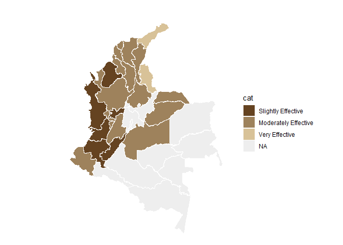<!-- -->

``` r
# weighted
nal_q8_weight<- inner_join(question_8, experience_of_each_expert)
```

    ## Joining with `by = join_by(crop, expert_ID, expert_in)`

``` r
nal_q8_weight<- nal_q8_weight %>%
  group_by(expert_in) %>%
  mutate(numeric_answer=as.numeric(numeric_answer)) %>%
  summarise(average_weighted= weighted.mean(numeric_answer, weights)) %>% 
  group_by(average_weighted) %>%
  mutate(cat_weighted= category_by_mean_by_question(language = "en", mean = average_weighted, question =8)) %>%
  rename(EKE.expert.in=expert_in)
```

    ## Warning: There was 1 warning in `mutate()`.
    ## ℹ In argument: `cat_weighted = category_by_mean_by_question(...)`.
    ## ℹ In group 0: .
    ## Caused by warning:
    ## ! There was 1 warning in `filter()`.
    ## ℹ In argument: `number == question & number_to_category == mean`.
    ## Caused by warning in `number_to_category == mean`:
    ## ! longer object length is not a multiple of shorter object length

``` r
nal_q8_weight<- full_join(codes_department, nal_q8_weight)
```

    ## Joining with `by = join_by(EKE.expert.in)`

``` r
nal_q8_weight$cat_weighted<- factor(nal_q8_weight$cat_weighted, levels = c("Not Effective", "Slightly Effective", "Moderately Effective", "Very Effective", "Extremely Effective"))
colmap(departamentos, data = nal_q8_weight, data_id = "id_depto", var = "cat_weighted")+
  scale_fill_manual(values = palette_soil(length(unique(nal_q8_weight$cat))-1), na.value = "#eeeeee")
```

    ## Scale for fill is already present.
    ## Adding another scale for fill, which will replace the existing scale.

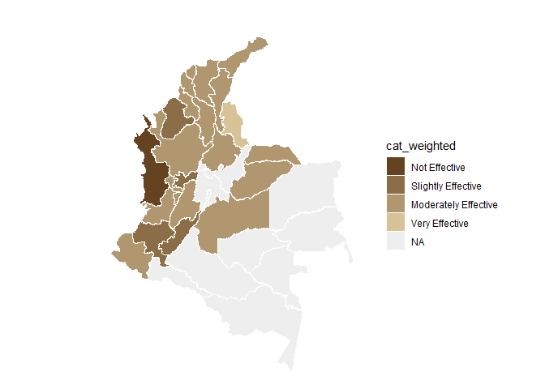<!-- -->

## Question 9: What is the level of training of producers on phytosanitary issues associated with banana production?

``` r
#selecting only question 9----
question_9<- filter(individual_surveys, question_number==9)
#some experts selected more than one option in this question so an intermediate answer is chosen 
question_9 <- question_9 %>%
  mutate(answer_in_english = case_when(
    answer_in_english == "Adequate,Good" ~ "Good",
    TRUE ~ answer_in_english  # This keeps all other values as they are
  ))
#some experts selected more than one option in this question so an intermediate answer is chosen 
question_9 <- question_9 %>%
  mutate(numeric_answer = case_when(
    numeric_answer == "4,5" ~ "4.5",
    TRUE ~ numeric_answer  # This keeps all other values as they are
  ))
#organizing the order of the levels
question_9$answer_in_english<- factor(question_9$answer_in_english,levels = c("No Training or Information Available", "Poor", "Fair", "Adequate", "Good", "Excellent", "Unsure"))
question_9<- filter(question_9, answer_in_english!="Unsure")
#average by department (weighted and no weighted)
#not weighted 
avg_dept_no_weight_9<- question_9 %>%
  group_by(crop, expert_in) %>%
  mutate(numeric_answer=as.numeric(numeric_answer))%>%
  mutate(average= mean(numeric_answer)) %>%
  group_by(average)%>%
  mutate(ave_cat= category_by_mean_by_question(9, mean =average, language = "en"))
```

    ## Warning: There were 9 warnings in `mutate()`.
    ## The first warning was:
    ## ℹ In argument: `ave_cat = category_by_mean_by_question(9, mean = average,
    ##   language = "en")`.
    ## ℹ In group 0: .
    ## Caused by warning:
    ## ! There was 1 warning in `filter()`.
    ## ℹ In argument: `number == question & number_to_category == mean`.
    ## Caused by warning in `number_to_category == mean`:
    ## ! longer object length is not a multiple of shorter object length
    ## ℹ Run `dplyr::last_dplyr_warnings()` to see the 8 remaining warnings.

``` r
#weighted 
add_weights_question_9<- inner_join(question_9, experience_of_each_expert)
```

    ## Joining with `by = join_by(crop, expert_ID, expert_in)`

``` r
avg_dept_weight_9<- add_weights_question_9 %>%
  group_by(crop, expert_in) %>%
  mutate(numeric_answer=as.numeric(numeric_answer))%>%
  mutate(average_weighted= weighted.mean(numeric_answer, weights)) %>% 
  group_by(average_weighted)%>%
  mutate(ave_cat_weighted= category_by_mean_by_question(9, mean =average_weighted, language = "en"))
```

    ## Warning: There were 10 warnings in `mutate()`.
    ## The first warning was:
    ## ℹ In argument: `ave_cat_weighted = category_by_mean_by_question(9, mean =
    ##   average_weighted, language = "en")`.
    ## ℹ In group 0: .
    ## Caused by warning:
    ## ! There was 1 warning in `filter()`.
    ## ℹ In argument: `number == question & number_to_category == mean`.
    ## Caused by warning in `number_to_category == mean`:
    ## ! longer object length is not a multiple of shorter object length
    ## ℹ Run `dplyr::last_dplyr_warnings()` to see the 9 remaining warnings.

``` r
#finding the levels per crop (banana and plantain) no weighted
levels_per_crop_Q9_no_weighted<- tapply(avg_dept_no_weight_9$ave_cat, avg_dept_no_weight_9$crop, function(x){(unique(x))})
#generating a ramp palette according to the number of levels per crop
colors_banana_question9_no_weighted<- palette_banana(length(levels_per_crop_Q9_no_weighted$Banana))
colors_plantain_question9_no_weighted<- palette_plantain(length(levels_per_crop_Q9_no_weighted$Plantain))
#Assigning the colors by crop and answer
# Define the knowledge levels for each crop
levels_by_crop_no_weighted_9 <- list(
  Banana = levels_per_crop_Q9_no_weighted$Banana,
  Plantain = levels_per_crop_Q9_no_weighted$Plantain
)
# Define the colors for each crop
colors_by_crop_no_weighted_9 <- list(
  Banana = colors_banana_question9_no_weighted, # Replace with actual color vector for Banana
  Plantain = colors_plantain_question9_no_weighted # Replace with actual color vector for Plantain
  # Add more crops and their color vectors here if needed
)
# Now call the function
avg_dept_no_weight_9 <- assign_group_color(data = avg_dept_no_weight_9, levels_by_crop = levels_by_crop_no_weighted_9, colors_by_crop = colors_by_crop_no_weighted_9,answer_col =  "ave_cat")

#finding the levels per crop (banana and plantain) weighted
levels_per_crop_Q9_weighted<- tapply(avg_dept_weight_9$ave_cat_weighted, avg_dept_weight_9$crop, function(x){(unique(x))})
#generating a ramp palette according to the number of levels per crop
colors_banana_question9_weighted<- palette_banana(length(levels_per_crop_Q9_weighted$Banana))
colors_plantain_question9_weighted<- palette_plantain(length(levels_per_crop_Q9_weighted$Plantain))
#Assigning the colors by crop and answer
# Define the knowledge levels for each crop
levels_by_crop_weighted_9 <- list(
  Banana = levels_per_crop_Q9_weighted$Banana,
  Plantain = levels_per_crop_Q9_weighted$Plantain
)
# Define the colors for each crop
colors_by_crop_weighted_9 <- list(
  Banana = colors_banana_question9_weighted, # Replace with actual color vector for Banana
  Plantain = colors_plantain_question9_weighted # Replace with actual color vector for Plantain
  # Add more crops and their color vectors here if needed
)
# Now call the function
avg_dept_weight_9 <- assign_group_color(data = avg_dept_weight_9, levels_by_crop = levels_by_crop_weighted_9, colors_by_crop = colors_by_crop_weighted_9,answer_col =  "ave_cat_weighted")

#tree map
tree_map_3(data = avg_dept_no_weight_9, "crop", "expert_in", "ave_cat", "group_color", title="No weighted")
```

    ## `summarise()` has grouped output by 'crop', 'expert_in', 'ave_cat'. You can
    ## override using the `.groups` argument.

<!-- -->

    ## $tm
    ##        crop          expert_in                              ave_cat vSize
    ## 1    Banana          Antioquia                                 Good    12
    ## 2    Banana          Antioquia                                 <NA>    12
    ## 3    Banana             Caldas                             Adequate     2
    ## 4    Banana             Caldas                                 <NA>     2
    ## 5    Banana              Cesar                             Adequate     2
    ## 6    Banana              Cesar                                 <NA>     2
    ## 7    Banana              Chocó                                 Fair     2
    ## 8    Banana              Chocó                                 <NA>     2
    ## 9    Banana            Córdoba                                 <NA>     1
    ## 10   Banana            Córdoba No Training or Information Available     1
    ## 11   Banana              Huila                                 Fair     1
    ## 12   Banana              Huila                                 <NA>     1
    ## 13   Banana         La Guajira                                 Good    11
    ## 14   Banana         La Guajira                                 <NA>    11
    ## 15   Banana          Magdalena                                 Good    13
    ## 16   Banana          Magdalena                                 <NA>    13
    ## 17   Banana               Meta                                 Good     1
    ## 18   Banana               Meta                                 <NA>     1
    ## 19   Banana               <NA>                                 <NA>    47
    ## 20   Banana            Quindío                                 Fair     1
    ## 21   Banana            Quindío                                 <NA>     1
    ## 22   Banana          Risaralda                                 Fair     1
    ## 23   Banana          Risaralda                                 <NA>     1
    ## 24 Plantain          Antioquia                            Excellent     2
    ## 25 Plantain          Antioquia                                 <NA>     2
    ## 26 Plantain             Arauca                                 Fair     2
    ## 27 Plantain             Arauca                                 <NA>     2
    ## 28 Plantain          Atlántico                                 <NA>     1
    ## 29 Plantain          Atlántico                                 Poor     1
    ## 30 Plantain            Bolívar                                 <NA>     1
    ## 31 Plantain            Bolívar                                 Poor     1
    ## 32 Plantain             Caldas                                 Fair     7
    ## 33 Plantain             Caldas                                 <NA>     7
    ## 34 Plantain           Casanare                                 Fair     3
    ## 35 Plantain           Casanare                                 <NA>     3
    ## 36 Plantain              Chocó                                 Fair     1
    ## 37 Plantain              Chocó                                 <NA>     1
    ## 38 Plantain            Córdoba                                 Fair     1
    ## 39 Plantain            Córdoba                                 <NA>     1
    ## 40 Plantain              Huila                                 <NA>     1
    ## 41 Plantain              Huila                                 Poor     1
    ## 42 Plantain         La Guajira                             Adequate     4
    ## 43 Plantain         La Guajira                                 <NA>     4
    ## 44 Plantain          Magdalena                                 Fair     3
    ## 45 Plantain          Magdalena                                 <NA>     3
    ## 46 Plantain               Meta                             Adequate    10
    ## 47 Plantain               Meta                                 <NA>    10
    ## 48 Plantain               <NA>                                 <NA>    56
    ## 49 Plantain Norte De Santander                                 <NA>     1
    ## 50 Plantain Norte De Santander                                 Poor     1
    ## 51 Plantain            Quindío                             Adequate     6
    ## 52 Plantain            Quindío                                 <NA>     6
    ## 53 Plantain          Risaralda                             Adequate    10
    ## 54 Plantain          Risaralda                                 <NA>    10
    ## 55 Plantain          Santander                                 <NA>     1
    ## 56 Plantain          Santander                                 Poor     1
    ## 57 Plantain              Sucre                                 <NA>     1
    ## 58 Plantain              Sucre                                 Poor     1
    ## 59 Plantain             Tolima                                 <NA>     1
    ## 60 Plantain             Tolima                                 Poor     1
    ##     vColor stdErr vColorValue level        x0         y0          w          h
    ## 1  #FFDA00     12          NA     3 0.7809709 0.46808511 0.21902913 0.53191489
    ## 2  #FFDA00     12          NA     2 0.7809709 0.46808511 0.21902913 0.53191489
    ## 3  #FFE244      2          NA     3 0.5436893 0.00000000 0.26963813 0.07201309
    ## 4  #FFE244      2          NA     2 0.5436893 0.00000000 0.26963813 0.07201309
    ## 5  #FFE244      2          NA     3 0.8133274 0.26004728 0.09333628 0.20803783
    ## 6  #FFE244      2          NA     2 0.8133274 0.26004728 0.09333628 0.20803783
    ## 7  #FFEA88      2          NA     3 0.9066637 0.26004728 0.09333628 0.20803783
    ## 8  #FFEA88      2          NA     2 0.9066637 0.26004728 0.09333628 0.20803783
    ## 9  #FFF2CC      1          NA     2 0.8133274 0.13002364 0.07466902 0.13002364
    ## 10 #FFF2CC      1          NA     3 0.8133274 0.13002364 0.07466902 0.13002364
    ## 11 #FFEA88      1          NA     3 0.8133274 0.00000000 0.07466902 0.13002364
    ## 12 #FFEA88      1          NA     2 0.8133274 0.00000000 0.07466902 0.13002364
    ## 13 #FFDA00     11          NA     3 0.5436893 0.07201309 0.26963813 0.39607201
    ## 14 #FFDA00     11          NA     2 0.5436893 0.07201309 0.26963813 0.39607201
    ## 15 #FFDA00     13          NA     3 0.5436893 0.46808511 0.23728155 0.53191489
    ## 16 #FFDA00     13          NA     2 0.5436893 0.46808511 0.23728155 0.53191489
    ## 17 #FFDA00      1          NA     3 0.8879965 0.17336485 0.11200353 0.08668243
    ## 18 #FFDA00      1          NA     2 0.8879965 0.17336485 0.11200353 0.08668243
    ## 19 #FFDA00     47          NA     1 0.5436893 0.00000000 0.45631068 1.00000000
    ## 20 #FFEA88      1          NA     3 0.8879965 0.08668243 0.11200353 0.08668243
    ## 21 #FFEA88      1          NA     2 0.8879965 0.08668243 0.11200353 0.08668243
    ## 22 #FFEA88      1          NA     3 0.8879965 0.00000000 0.11200353 0.08668243
    ## 23 #FFEA88      1          NA     2 0.8879965 0.00000000 0.11200353 0.08668243
    ## 24 #28B463      2          NA     3 0.1963323 0.18167702 0.10687910 0.18167702
    ## 25 #28B463      2          NA     2 0.1963323 0.18167702 0.10687910 0.18167702
    ## 26 #8CDE9F      2          NA     3 0.1963323 0.00000000 0.10687910 0.18167702
    ## 27 #8CDE9F      2          NA     2 0.1963323 0.00000000 0.10687910 0.18167702
    ## 28 #BEF4BE      1          NA     2 0.3032114 0.24223602 0.08015932 0.12111801
    ## 29 #BEF4BE      1          NA     3 0.3032114 0.24223602 0.08015932 0.12111801
    ## 30 #BEF4BE      1          NA     2 0.3833707 0.24223602 0.08015932 0.12111801
    ## 31 #BEF4BE      1          NA     3 0.3833707 0.24223602 0.08015932 0.12111801
    ## 32 #8CDE9F      7          NA     3 0.0000000 0.29670330 0.19633225 0.34615385
    ## 33 #8CDE9F      7          NA     2 0.0000000 0.29670330 0.19633225 0.34615385
    ## 34 #8CDE9F      3          NA     3 0.3352751 0.36335404 0.10420712 0.27950311
    ## 35 #8CDE9F      3          NA     2 0.3352751 0.36335404 0.10420712 0.27950311
    ## 36 #8CDE9F      1          NA     3 0.4635300 0.24223602 0.08015932 0.12111801
    ## 37 #8CDE9F      1          NA     2 0.4635300 0.24223602 0.08015932 0.12111801
    ## 38 #8CDE9F      1          NA     3 0.3032114 0.12111801 0.08015932 0.12111801
    ## 39 #8CDE9F      1          NA     2 0.3032114 0.12111801 0.08015932 0.12111801
    ## 40 #BEF4BE      1          NA     2 0.3032114 0.00000000 0.08015932 0.12111801
    ## 41 #BEF4BE      1          NA     3 0.3032114 0.00000000 0.08015932 0.12111801
    ## 42 #59C981      4          NA     3 0.1963323 0.36335404 0.13894283 0.27950311
    ## 43 #59C981      4          NA     2 0.1963323 0.36335404 0.13894283 0.27950311
    ## 44 #8CDE9F      3          NA     3 0.4394822 0.36335404 0.10420712 0.27950311
    ## 45 #8CDE9F      3          NA     2 0.4394822 0.36335404 0.10420712 0.27950311
    ## 46 #59C981     10          NA     3 0.0000000 0.64285714 0.27184466 0.35714286
    ## 47 #59C981     10          NA     2 0.0000000 0.64285714 0.27184466 0.35714286
    ## 48 #BEF4BE     56          NA     1 0.0000000 0.00000000 0.54368932 1.00000000
    ## 49 #BEF4BE      1          NA     2 0.3833707 0.12111801 0.08015932 0.12111801
    ## 50 #BEF4BE      1          NA     3 0.3833707 0.12111801 0.08015932 0.12111801
    ## 51 #59C981      6          NA     3 0.0000000 0.00000000 0.19633225 0.29670330
    ## 52 #59C981      6          NA     2 0.0000000 0.00000000 0.19633225 0.29670330
    ## 53 #59C981     10          NA     3 0.2718447 0.64285714 0.27184466 0.35714286
    ## 54 #59C981     10          NA     2 0.2718447 0.64285714 0.27184466 0.35714286
    ## 55 #BEF4BE      1          NA     2 0.4635300 0.12111801 0.08015932 0.12111801
    ## 56 #BEF4BE      1          NA     3 0.4635300 0.12111801 0.08015932 0.12111801
    ## 57 #BEF4BE      1          NA     2 0.3833707 0.00000000 0.08015932 0.12111801
    ## 58 #BEF4BE      1          NA     3 0.3833707 0.00000000 0.08015932 0.12111801
    ## 59 #BEF4BE      1          NA     2 0.4635300 0.00000000 0.08015932 0.12111801
    ## 60 #BEF4BE      1          NA     3 0.4635300 0.00000000 0.08015932 0.12111801
    ##      color
    ## 1  #FFDA00
    ## 2  #FFDA00
    ## 3  #FFE244
    ## 4  #FFE244
    ## 5  #FFE244
    ## 6  #FFE244
    ## 7  #FFEA88
    ## 8  #FFEA88
    ## 9  #FFF2CC
    ## 10 #FFF2CC
    ## 11 #FFEA88
    ## 12 #FFEA88
    ## 13 #FFDA00
    ## 14 #FFDA00
    ## 15 #FFDA00
    ## 16 #FFDA00
    ## 17 #FFDA00
    ## 18 #FFDA00
    ## 19 #FFDA00
    ## 20 #FFEA88
    ## 21 #FFEA88
    ## 22 #FFEA88
    ## 23 #FFEA88
    ## 24 #28B463
    ## 25 #28B463
    ## 26 #8CDE9F
    ## 27 #8CDE9F
    ## 28 #BEF4BE
    ## 29 #BEF4BE
    ## 30 #BEF4BE
    ## 31 #BEF4BE
    ## 32 #8CDE9F
    ## 33 #8CDE9F
    ## 34 #8CDE9F
    ## 35 #8CDE9F
    ## 36 #8CDE9F
    ## 37 #8CDE9F
    ## 38 #8CDE9F
    ## 39 #8CDE9F
    ## 40 #BEF4BE
    ## 41 #BEF4BE
    ## 42 #59C981
    ## 43 #59C981
    ## 44 #8CDE9F
    ## 45 #8CDE9F
    ## 46 #59C981
    ## 47 #59C981
    ## 48 #BEF4BE
    ## 49 #BEF4BE
    ## 50 #BEF4BE
    ## 51 #59C981
    ## 52 #59C981
    ## 53 #59C981
    ## 54 #59C981
    ## 55 #BEF4BE
    ## 56 #BEF4BE
    ## 57 #BEF4BE
    ## 58 #BEF4BE
    ## 59 #BEF4BE
    ## 60 #BEF4BE
    ## 
    ## $type
    ## [1] "color"
    ## 
    ## $vSize
    ## [1] "frequency"
    ## 
    ## $vColor
    ## [1] "group_color"
    ## 
    ## $stdErr
    ## [1] "frequency"
    ## 
    ## $algorithm
    ## [1] "pivotSize"
    ## 
    ## $vpCoorX
    ## [1] 0.02812148 0.97187852
    ## 
    ## $vpCoorY
    ## [1] 0.01968504 0.91031496
    ## 
    ## $aspRatio
    ## [1] 1.483512
    ## 
    ## $range
    ## [1] NA NA
    ## 
    ## $mapping
    ## [1] NA NA NA
    ## 
    ## $draw
    ## [1] TRUE

``` r
tree_map_3(data = avg_dept_weight_9, "crop", "expert_in", "ave_cat_weighted", "group_color", title="weighted")
```

    ## `summarise()` has grouped output by 'crop', 'expert_in', 'ave_cat_weighted'.
    ## You can override using the `.groups` argument.

<!-- -->

    ## $tm
    ##        crop          expert_in                     ave_cat_weighted vSize
    ## 1    Banana          Antioquia                                 Good    12
    ## 2    Banana          Antioquia                                 <NA>    12
    ## 3    Banana             Caldas                                 Fair     1
    ## 4    Banana             Caldas                                 <NA>     1
    ## 5    Banana              Cesar                                 Fair     1
    ## 6    Banana              Cesar                                 <NA>     1
    ## 7    Banana              Chocó                                 Fair     2
    ## 8    Banana              Chocó                                 <NA>     2
    ## 9    Banana            Córdoba                                 <NA>     1
    ## 10   Banana            Córdoba No Training or Information Available     1
    ## 11   Banana              Huila                                 Fair     1
    ## 12   Banana              Huila                                 <NA>     1
    ## 13   Banana         La Guajira                                 Good     9
    ## 14   Banana         La Guajira                                 <NA>     9
    ## 15   Banana          Magdalena                                 Good    12
    ## 16   Banana          Magdalena                                 <NA>    12
    ## 17   Banana               <NA>                                 <NA>    41
    ## 18   Banana            Quindío                                 Fair     1
    ## 19   Banana            Quindío                                 <NA>     1
    ## 20   Banana          Risaralda                                 Fair     1
    ## 21   Banana          Risaralda                                 <NA>     1
    ## 22 Plantain          Antioquia                            Excellent     2
    ## 23 Plantain          Antioquia                                 <NA>     2
    ## 24 Plantain             Arauca                                 Fair     2
    ## 25 Plantain             Arauca                                 <NA>     2
    ## 26 Plantain          Atlántico                                 <NA>     1
    ## 27 Plantain          Atlántico                                 Poor     1
    ## 28 Plantain            Bolívar                                 <NA>     1
    ## 29 Plantain            Bolívar                                 Poor     1
    ## 30 Plantain             Caldas                                 Fair     7
    ## 31 Plantain             Caldas                                 <NA>     7
    ## 32 Plantain           Casanare                                 Fair     3
    ## 33 Plantain           Casanare                                 <NA>     3
    ## 34 Plantain              Chocó                                 Fair     1
    ## 35 Plantain              Chocó                                 <NA>     1
    ## 36 Plantain            Córdoba                                 Fair     1
    ## 37 Plantain            Córdoba                                 <NA>     1
    ## 38 Plantain              Huila                                 <NA>     1
    ## 39 Plantain              Huila                                 Poor     1
    ## 40 Plantain         La Guajira                                 Fair     4
    ## 41 Plantain         La Guajira                                 <NA>     4
    ## 42 Plantain          Magdalena                                 Fair     3
    ## 43 Plantain          Magdalena                                 <NA>     3
    ## 44 Plantain               Meta                             Adequate    10
    ## 45 Plantain               Meta                                 <NA>    10
    ## 46 Plantain               <NA>                                 <NA>    56
    ## 47 Plantain Norte De Santander                                 <NA>     1
    ## 48 Plantain Norte De Santander                                 Poor     1
    ## 49 Plantain            Quindío                             Adequate     6
    ## 50 Plantain            Quindío                                 <NA>     6
    ## 51 Plantain          Risaralda                                 Fair    10
    ## 52 Plantain          Risaralda                                 <NA>    10
    ## 53 Plantain          Santander                                 <NA>     1
    ## 54 Plantain          Santander                                 Poor     1
    ## 55 Plantain              Sucre                                 <NA>     1
    ## 56 Plantain              Sucre                                 Poor     1
    ## 57 Plantain             Tolima                                 <NA>     1
    ## 58 Plantain             Tolima                                 Poor     1
    ##     vColor stdErr vColorValue level        x0         y0          w          h
    ## 1  #FFDA00     12          NA     3 0.5773196 0.41463415 0.21134021 0.58536585
    ## 2  #FFDA00     12          NA     2 0.5773196 0.41463415 0.21134021 0.58536585
    ## 3  #FFE566      1          NA     3 0.8508187 0.27642276 0.07459066 0.13821138
    ## 4  #FFE566      1          NA     2 0.8508187 0.27642276 0.07459066 0.13821138
    ## 5  #FFE566      1          NA     3 0.9254093 0.27642276 0.07459066 0.13821138
    ## 6  #FFE566      1          NA     2 0.9254093 0.27642276 0.07459066 0.13821138
    ## 7  #FFE566      2          NA     3 0.5773196 0.00000000 0.27349909 0.07538803
    ## 8  #FFE566      2          NA     2 0.5773196 0.00000000 0.27349909 0.07538803
    ## 9  #FFF2CC      1          NA     2 0.8508187 0.13821138 0.07459066 0.13821138
    ## 10 #FFF2CC      1          NA     3 0.8508187 0.13821138 0.07459066 0.13821138
    ## 11 #FFE566      1          NA     3 0.9254093 0.13821138 0.07459066 0.13821138
    ## 12 #FFE566      1          NA     2 0.9254093 0.13821138 0.07459066 0.13821138
    ## 13 #FFDA00      9          NA     3 0.5773196 0.07538803 0.27349909 0.33924612
    ## 14 #FFDA00      9          NA     2 0.5773196 0.07538803 0.27349909 0.33924612
    ## 15 #FFDA00     12          NA     3 0.7886598 0.41463415 0.21134021 0.58536585
    ## 16 #FFDA00     12          NA     2 0.7886598 0.41463415 0.21134021 0.58536585
    ## 17 #FFE566     41          NA     1 0.5773196 0.00000000 0.42268041 1.00000000
    ## 18 #FFE566      1          NA     3 0.8508187 0.00000000 0.07459066 0.13821138
    ## 19 #FFE566      1          NA     2 0.8508187 0.00000000 0.07459066 0.13821138
    ## 20 #FFE566      1          NA     3 0.9254093 0.00000000 0.07459066 0.13821138
    ## 21 #FFE566      1          NA     2 0.9254093 0.00000000 0.07459066 0.13821138
    ## 22 #28B463      2          NA     3 0.2084765 0.18167702 0.11349018 0.18167702
    ## 23 #28B463      2          NA     2 0.2084765 0.18167702 0.11349018 0.18167702
    ## 24 #59C981      2          NA     3 0.2084765 0.00000000 0.11349018 0.18167702
    ## 25 #59C981      2          NA     2 0.2084765 0.00000000 0.11349018 0.18167702
    ## 26 #BEF4BE      1          NA     2 0.3219667 0.24223602 0.08511763 0.12111801
    ## 27 #BEF4BE      1          NA     3 0.3219667 0.24223602 0.08511763 0.12111801
    ## 28 #BEF4BE      1          NA     2 0.3219667 0.12111801 0.08511763 0.12111801
    ## 29 #BEF4BE      1          NA     3 0.3219667 0.12111801 0.08511763 0.12111801
    ## 30 #59C981      7          NA     3 0.0000000 0.29670330 0.20847652 0.34615385
    ## 31 #59C981      7          NA     2 0.0000000 0.29670330 0.20847652 0.34615385
    ## 32 #59C981      3          NA     3 0.3560137 0.36335404 0.11065292 0.27950311
    ## 33 #59C981      3          NA     2 0.3560137 0.36335404 0.11065292 0.27950311
    ## 34 #59C981      1          NA     3 0.3219667 0.00000000 0.08511763 0.12111801
    ## 35 #59C981      1          NA     2 0.3219667 0.00000000 0.08511763 0.12111801
    ## 36 #59C981      1          NA     3 0.4070843 0.24223602 0.08511763 0.12111801
    ## 37 #59C981      1          NA     2 0.4070843 0.24223602 0.08511763 0.12111801
    ## 38 #BEF4BE      1          NA     2 0.4922020 0.24223602 0.08511763 0.12111801
    ## 39 #BEF4BE      1          NA     3 0.4922020 0.24223602 0.08511763 0.12111801
    ## 40 #59C981      4          NA     3 0.2084765 0.36335404 0.14753723 0.27950311
    ## 41 #59C981      4          NA     2 0.2084765 0.36335404 0.14753723 0.27950311
    ## 42 #59C981      3          NA     3 0.4666667 0.36335404 0.11065292 0.27950311
    ## 43 #59C981      3          NA     2 0.4666667 0.36335404 0.11065292 0.27950311
    ## 44 #8CDE9F     10          NA     3 0.0000000 0.64285714 0.28865979 0.35714286
    ## 45 #8CDE9F     10          NA     2 0.0000000 0.64285714 0.28865979 0.35714286
    ## 46 #59C981     56          NA     1 0.0000000 0.00000000 0.57731959 1.00000000
    ## 47 #BEF4BE      1          NA     2 0.4070843 0.12111801 0.08511763 0.12111801
    ## 48 #BEF4BE      1          NA     3 0.4070843 0.12111801 0.08511763 0.12111801
    ## 49 #8CDE9F      6          NA     3 0.0000000 0.00000000 0.20847652 0.29670330
    ## 50 #8CDE9F      6          NA     2 0.0000000 0.00000000 0.20847652 0.29670330
    ## 51 #59C981     10          NA     3 0.2886598 0.64285714 0.28865979 0.35714286
    ## 52 #59C981     10          NA     2 0.2886598 0.64285714 0.28865979 0.35714286
    ## 53 #BEF4BE      1          NA     2 0.4070843 0.00000000 0.08511763 0.12111801
    ## 54 #BEF4BE      1          NA     3 0.4070843 0.00000000 0.08511763 0.12111801
    ## 55 #BEF4BE      1          NA     2 0.4922020 0.12111801 0.08511763 0.12111801
    ## 56 #BEF4BE      1          NA     3 0.4922020 0.12111801 0.08511763 0.12111801
    ## 57 #BEF4BE      1          NA     2 0.4922020 0.00000000 0.08511763 0.12111801
    ## 58 #BEF4BE      1          NA     3 0.4922020 0.00000000 0.08511763 0.12111801
    ##      color
    ## 1  #FFDA00
    ## 2  #FFDA00
    ## 3  #FFE566
    ## 4  #FFE566
    ## 5  #FFE566
    ## 6  #FFE566
    ## 7  #FFE566
    ## 8  #FFE566
    ## 9  #FFF2CC
    ## 10 #FFF2CC
    ## 11 #FFE566
    ## 12 #FFE566
    ## 13 #FFDA00
    ## 14 #FFDA00
    ## 15 #FFDA00
    ## 16 #FFDA00
    ## 17 #FFE566
    ## 18 #FFE566
    ## 19 #FFE566
    ## 20 #FFE566
    ## 21 #FFE566
    ## 22 #28B463
    ## 23 #28B463
    ## 24 #59C981
    ## 25 #59C981
    ## 26 #BEF4BE
    ## 27 #BEF4BE
    ## 28 #BEF4BE
    ## 29 #BEF4BE
    ## 30 #59C981
    ## 31 #59C981
    ## 32 #59C981
    ## 33 #59C981
    ## 34 #59C981
    ## 35 #59C981
    ## 36 #59C981
    ## 37 #59C981
    ## 38 #BEF4BE
    ## 39 #BEF4BE
    ## 40 #59C981
    ## 41 #59C981
    ## 42 #59C981
    ## 43 #59C981
    ## 44 #8CDE9F
    ## 45 #8CDE9F
    ## 46 #59C981
    ## 47 #BEF4BE
    ## 48 #BEF4BE
    ## 49 #8CDE9F
    ## 50 #8CDE9F
    ## 51 #59C981
    ## 52 #59C981
    ## 53 #BEF4BE
    ## 54 #BEF4BE
    ## 55 #BEF4BE
    ## 56 #BEF4BE
    ## 57 #BEF4BE
    ## 58 #BEF4BE
    ## 
    ## $type
    ## [1] "color"
    ## 
    ## $vSize
    ## [1] "frequency"
    ## 
    ## $vColor
    ## [1] "group_color"
    ## 
    ## $stdErr
    ## [1] "frequency"
    ## 
    ## $algorithm
    ## [1] "pivotSize"
    ## 
    ## $vpCoorX
    ## [1] 0.02812148 0.97187852
    ## 
    ## $vpCoorY
    ## [1] 0.01968504 0.91031496
    ## 
    ## $aspRatio
    ## [1] 1.483512
    ## 
    ## $range
    ## [1] NA NA
    ## 
    ## $mapping
    ## [1] NA NA NA
    ## 
    ## $draw
    ## [1] TRUE

``` r
#Map of Colombia  
#non weighted
nal_q9_no_weight<- question_9 %>% group_by(expert_in) %>%
  summarise(average= mean(as.numeric(numeric_answer))) %>%
  group_by(average) %>% 
  mutate(cat= category_by_mean_by_question(language = "en", mean = average, question =9))%>%
  rename(EKE.expert.in = expert_in)
```

    ## Warning: There were 2 warnings in `mutate()`.
    ## The first warning was:
    ## ℹ In argument: `cat = category_by_mean_by_question(...)`.
    ## ℹ In group 0: .
    ## Caused by warning:
    ## ! There was 1 warning in `filter()`.
    ## ℹ In argument: `number == question & number_to_category == mean`.
    ## Caused by warning in `number_to_category == mean`:
    ## ! longer object length is not a multiple of shorter object length
    ## ℹ Run `dplyr::last_dplyr_warnings()` to see the 1 remaining warning.

``` r
nal_q9_no_weight<- full_join(codes_department, nal_q9_no_weight)
```

    ## Joining with `by = join_by(EKE.expert.in)`

``` r
nal_q9_no_weight$cat<- factor(nal_q9_no_weight$cat, levels = c("No Training or Information Available", "Poor", "Fair", "Adequate", "Good", "Excellent", "Unsure"))
colmap(departamentos, data = nal_q9_no_weight, data_id = "id_depto", var = "cat")+
  scale_fill_manual(values = palette_soil(length(unique(nal_q9_no_weight$cat))-1), na.value = "#eeeeee")
```

    ## Scale for fill is already present.
    ## Adding another scale for fill, which will replace the existing scale.

<!-- -->

``` r
# weighted
nal_q9_weight<- inner_join(question_9, experience_of_each_expert)
```

    ## Joining with `by = join_by(crop, expert_ID, expert_in)`

``` r
nal_q9_weight<- nal_q9_weight %>%
  group_by(expert_in) %>%
  mutate(numeric_answer=as.numeric(numeric_answer)) %>%
  summarise(average_weighted= weighted.mean(numeric_answer, weights)) %>% 
  group_by(average_weighted) %>%
  mutate(cat_weighted= category_by_mean_by_question(language = "en", mean = average_weighted, question =9)) %>%
  rename(EKE.expert.in=expert_in)
```

    ## Warning: There was 1 warning in `mutate()`.
    ## ℹ In argument: `cat_weighted = category_by_mean_by_question(...)`.
    ## ℹ In group 0: .
    ## Caused by warning:
    ## ! There was 1 warning in `filter()`.
    ## ℹ In argument: `number == question & number_to_category == mean`.
    ## Caused by warning in `number_to_category == mean`:
    ## ! longer object length is not a multiple of shorter object length

``` r
nal_q9_weight<- full_join(codes_department, nal_q9_weight)
```

    ## Joining with `by = join_by(EKE.expert.in)`

``` r
nal_q9_weight$cat_weighted<- factor(nal_q9_weight$cat_weighted, levels = c("No Training or Information Available", "Poor", "Fair", "Adequate", "Good", "Excellent", "Unsure"))
colmap(departamentos, data = nal_q9_weight, data_id = "id_depto", var = "cat_weighted")+
  scale_fill_manual(values = palette_soil(length(unique(nal_q9_weight$cat))-1), na.value = "#eeeeee")
```

    ## Scale for fill is already present.
    ## Adding another scale for fill, which will replace the existing scale.

<!-- -->

## Question 13: How frequent is the use of new planting material to renew the production system?

``` r
#selecting only question 13----
question_13<- filter(individual_surveys, question_number==13)
#organizing the order of the levels
question_13$answer_in_english<- factor(question_13$answer_in_english,levels = c("Every 1 or 2 cycles", "Every 3 to 4 cycles", "Every 5 to 6 cycles",  "Every 7 or more cycles", "Not Sure"))
question_13<- filter(question_13, answer_in_english!="Not Sure")
#average by department (weighted and no weighted)
#not weighted 
avg_dept_no_weight_13<- question_13 %>%
  group_by(crop, expert_in) %>%
  mutate(numeric_answer=as.numeric(numeric_answer))%>%
  mutate(average= mean(numeric_answer)) %>%
  group_by(average)%>%
  mutate(ave_cat= category_by_mean_by_question(13, mean =average, language = "en"))
```

    ## Warning: There were 7 warnings in `mutate()`.
    ## The first warning was:
    ## ℹ In argument: `ave_cat = category_by_mean_by_question(13, mean = average,
    ##   language = "en")`.
    ## ℹ In group 0: .
    ## Caused by warning:
    ## ! There was 1 warning in `filter()`.
    ## ℹ In argument: `number == question & number_to_category == mean`.
    ## Caused by warning in `number_to_category == mean`:
    ## ! longer object length is not a multiple of shorter object length
    ## ℹ Run `dplyr::last_dplyr_warnings()` to see the 6 remaining warnings.

``` r
#weighted 
add_weights_question_13<- inner_join(question_13, experience_of_each_expert)
```

    ## Joining with `by = join_by(crop, expert_ID, expert_in)`

``` r
avg_dept_weight_13<- add_weights_question_13 %>%
  group_by(crop, expert_in) %>%
  mutate(numeric_answer=as.numeric(numeric_answer))%>%
  mutate(average_weighted= weighted.mean(numeric_answer, weights)) %>% 
  group_by(average_weighted)%>%
  mutate(ave_cat_weighted= category_by_mean_by_question(13, mean =average_weighted, language = "en"))
```

    ## Warning: There were 8 warnings in `mutate()`.
    ## The first warning was:
    ## ℹ In argument: `ave_cat_weighted = category_by_mean_by_question(13, mean =
    ##   average_weighted, language = "en")`.
    ## ℹ In group 0: .
    ## Caused by warning:
    ## ! There was 1 warning in `filter()`.
    ## ℹ In argument: `number == question & number_to_category == mean`.
    ## Caused by warning in `number_to_category == mean`:
    ## ! longer object length is not a multiple of shorter object length
    ## ℹ Run `dplyr::last_dplyr_warnings()` to see the 7 remaining warnings.

``` r
#finding the levels per crop (banana and plantain) no weighted
levels_per_crop_Q13_no_weighted<- tapply(avg_dept_no_weight_13$ave_cat, avg_dept_no_weight_13$crop, function(x){(unique(x))})
#generating a ramp palette according to the number of levels per crop
colors_banana_question13_no_weighted<- palette_banana(length(levels_per_crop_Q13_no_weighted$Banana))
colors_plantain_question13_no_weighted<- palette_plantain(length(levels_per_crop_Q13_no_weighted$Plantain))
#Assigning the colors by crop and answer
# Define the knowledge levels for each crop
levels_by_crop_no_weighted_13 <- list(
  Banana = levels_per_crop_Q13_no_weighted$Banana,
  Plantain = levels_per_crop_Q13_no_weighted$Plantain
)
# Define the colors for each crop
colors_by_crop_no_weighted_13 <- list(
  Banana = colors_banana_question13_no_weighted, # Replace with actual color vector for Banana
  Plantain = colors_plantain_question13_no_weighted # Replace with actual color vector for Plantain
  # Add more crops and their color vectors here if needed
)
# Now call the function
avg_dept_no_weight_13 <- assign_group_color(data = avg_dept_no_weight_13, levels_by_crop = levels_by_crop_no_weighted_13, colors_by_crop = colors_by_crop_no_weighted_13,answer_col =  "ave_cat")

#finding the levels per crop (banana and plantain) weighted
levels_per_crop_Q13_weighted<- tapply(avg_dept_weight_13$ave_cat_weighted, avg_dept_weight_13$crop, function(x){(unique(x))})
#generating a ramp palette according to the number of levels per crop
colors_banana_question13_weighted<- palette_banana(length(levels_per_crop_Q13_weighted$Banana))
colors_plantain_question13_weighted<- palette_plantain(length(levels_per_crop_Q13_weighted$Plantain))
#Assigning the colors by crop and answer
# Define the knowledge levels for each crop
levels_by_crop_weighted_13 <- list(
  Banana = levels_per_crop_Q13_weighted$Banana,
  Plantain = levels_per_crop_Q13_weighted$Plantain
)
# Define the colors for each crop
colors_by_crop_weighted_13 <- list(
  Banana = colors_banana_question13_weighted, # Replace with actual color vector for Banana
  Plantain = colors_plantain_question13_weighted # Replace with actual color vector for Plantain
  # Add more crops and their color vectors here if needed
)
# Now call the function
avg_dept_weight_13 <- assign_group_color(data = avg_dept_weight_13, levels_by_crop = levels_by_crop_weighted_13, colors_by_crop = colors_by_crop_weighted_13,answer_col =  "ave_cat_weighted")

#tree map
tree_map_3(data = avg_dept_no_weight_13, "crop", "expert_in", "ave_cat", "group_color", title="No weighted")
```

    ## `summarise()` has grouped output by 'crop', 'expert_in', 'ave_cat'. You can
    ## override using the `.groups` argument.

<!-- -->

    ## $tm
    ##        crop          expert_in                ave_cat vSize  vColor stdErr
    ## 1    Banana          Antioquia    Every 5 to 6 cycles    10 #FFF2CC     10
    ## 2    Banana          Antioquia                   <NA>    10 #FFF2CC     10
    ## 3    Banana             Caldas Every 7 or more cycles     1 #FFDA00      1
    ## 4    Banana             Caldas                   <NA>     1 #FFDA00      1
    ## 5    Banana              Cesar Every 7 or more cycles     2 #FFDA00      2
    ## 6    Banana              Cesar                   <NA>     2 #FFDA00      2
    ## 7    Banana              Chocó Every 7 or more cycles     1 #FFDA00      1
    ## 8    Banana              Chocó                   <NA>     1 #FFDA00      1
    ## 9    Banana              Huila Every 7 or more cycles     1 #FFDA00      1
    ## 10   Banana              Huila                   <NA>     1 #FFDA00      1
    ## 11   Banana         La Guajira Every 7 or more cycles     9 #FFDA00      9
    ## 12   Banana         La Guajira                   <NA>     9 #FFDA00      9
    ## 13   Banana          Magdalena    Every 5 to 6 cycles    11 #FFF2CC     11
    ## 14   Banana          Magdalena                   <NA>    11 #FFF2CC     11
    ## 15   Banana               <NA>                   <NA>    37 #FFDA00     37
    ## 16   Banana            Quindío Every 7 or more cycles     1 #FFDA00      1
    ## 17   Banana            Quindío                   <NA>     1 #FFDA00      1
    ## 18   Banana          Risaralda Every 7 or more cycles     1 #FFDA00      1
    ## 19   Banana          Risaralda                   <NA>     1 #FFDA00      1
    ## 20 Plantain          Antioquia Every 7 or more cycles     2 #28B463      2
    ## 21 Plantain          Antioquia                   <NA>     2 #28B463      2
    ## 22 Plantain             Arauca    Every 3 to 4 cycles     2 #BEF4BE      2
    ## 23 Plantain             Arauca                   <NA>     2 #BEF4BE      2
    ## 24 Plantain          Atlántico Every 7 or more cycles     1 #28B463      1
    ## 25 Plantain          Atlántico                   <NA>     1 #28B463      1
    ## 26 Plantain            Bolívar Every 7 or more cycles     1 #28B463      1
    ## 27 Plantain            Bolívar                   <NA>     1 #28B463      1
    ## 28 Plantain             Caldas    Every 5 to 6 cycles     6 #59C981      6
    ## 29 Plantain             Caldas                   <NA>     6 #59C981      6
    ## 30 Plantain           Casanare    Every 3 to 4 cycles     2 #BEF4BE      2
    ## 31 Plantain           Casanare                   <NA>     2 #BEF4BE      2
    ## 32 Plantain              Chocó Every 7 or more cycles     1 #28B463      1
    ## 33 Plantain              Chocó                   <NA>     1 #28B463      1
    ## 34 Plantain            Córdoba Every 7 or more cycles     1 #28B463      1
    ## 35 Plantain            Córdoba                   <NA>     1 #28B463      1
    ## 36 Plantain              Huila Every 7 or more cycles     1 #28B463      1
    ## 37 Plantain              Huila                   <NA>     1 #28B463      1
    ## 38 Plantain         La Guajira Every 7 or more cycles     3 #28B463      3
    ## 39 Plantain         La Guajira                   <NA>     3 #28B463      3
    ## 40 Plantain          Magdalena Every 7 or more cycles     3 #28B463      3
    ## 41 Plantain          Magdalena                   <NA>     3 #28B463      3
    ## 42 Plantain               Meta    Every 1 or 2 cycles    10 #8CDE9F     10
    ## 43 Plantain               Meta                   <NA>    10 #8CDE9F     10
    ## 44 Plantain               <NA>                   <NA>    51 #28B463     51
    ## 45 Plantain Norte De Santander Every 7 or more cycles     1 #28B463      1
    ## 46 Plantain Norte De Santander                   <NA>     1 #28B463      1
    ## 47 Plantain            Quindío    Every 5 to 6 cycles     6 #59C981      6
    ## 48 Plantain            Quindío                   <NA>     6 #59C981      6
    ## 49 Plantain          Risaralda Every 7 or more cycles     8 #28B463      8
    ## 50 Plantain          Risaralda                   <NA>     8 #28B463      8
    ## 51 Plantain          Santander Every 7 or more cycles     1 #28B463      1
    ## 52 Plantain          Santander                   <NA>     1 #28B463      1
    ## 53 Plantain              Sucre Every 7 or more cycles     1 #28B463      1
    ## 54 Plantain              Sucre                   <NA>     1 #28B463      1
    ## 55 Plantain             Tolima Every 7 or more cycles     1 #28B463      1
    ## 56 Plantain             Tolima                   <NA>     1 #28B463      1
    ##    vColorValue level        x0         y0          w          h   color
    ## 1           NA     3 0.7997835 0.43243243 0.20021645 0.56756757 #FFF2CC
    ## 2           NA     2 0.7997835 0.43243243 0.20021645 0.56756757 #FFF2CC
    ## 3           NA     3 0.8686080 0.25945946 0.06569602 0.17297297 #FFDA00
    ## 4           NA     2 0.8686080 0.25945946 0.06569602 0.17297297 #FFDA00
    ## 5           NA     3 0.5795455 0.00000000 0.28906250 0.07862408 #FFDA00
    ## 6           NA     2 0.5795455 0.00000000 0.28906250 0.07862408 #FFDA00
    ## 7           NA     3 0.9343040 0.25945946 0.06569602 0.17297297 #FFDA00
    ## 8           NA     2 0.9343040 0.25945946 0.06569602 0.17297297 #FFDA00
    ## 9           NA     3 0.8686080 0.08648649 0.06569602 0.17297297 #FFDA00
    ## 10          NA     2 0.8686080 0.08648649 0.06569602 0.17297297 #FFDA00
    ## 11          NA     3 0.5795455 0.07862408 0.28906250 0.35380835 #FFDA00
    ## 12          NA     2 0.5795455 0.07862408 0.28906250 0.35380835 #FFDA00
    ## 13          NA     3 0.5795455 0.43243243 0.22023810 0.56756757 #FFF2CC
    ## 14          NA     2 0.5795455 0.43243243 0.22023810 0.56756757 #FFF2CC
    ## 15          NA     1 0.5795455 0.00000000 0.42045455 1.00000000 #FFDA00
    ## 16          NA     3 0.9343040 0.08648649 0.06569602 0.17297297 #FFDA00
    ## 17          NA     2 0.9343040 0.08648649 0.06569602 0.17297297 #FFDA00
    ## 18          NA     3 0.8686080 0.00000000 0.13139205 0.08648649 #FFDA00
    ## 19          NA     2 0.8686080 0.00000000 0.13139205 0.08648649 #FFDA00
    ## 20          NA     3 0.1931818 0.15126050 0.15025253 0.15126050 #28B463
    ## 21          NA     2 0.1931818 0.15126050 0.15025253 0.15126050 #28B463
    ## 22          NA     3 0.1931818 0.00000000 0.15025253 0.15126050 #BEF4BE
    ## 23          NA     2 0.1931818 0.00000000 0.15025253 0.15126050 #BEF4BE
    ## 24          NA     3 0.4614899 0.43315508 0.11805556 0.09625668 #28B463
    ## 25          NA     2 0.4614899 0.43315508 0.11805556 0.09625668 #28B463
    ## 26          NA     3 0.4614899 0.33689840 0.11805556 0.09625668 #28B463
    ## 27          NA     2 0.4614899 0.33689840 0.11805556 0.09625668 #28B463
    ## 28          NA     3 0.4346591 0.52941176 0.14488636 0.47058824 #59C981
    ## 29          NA     2 0.4346591 0.52941176 0.14488636 0.47058824 #59C981
    ## 30          NA     3 0.3434343 0.33689840 0.11805556 0.19251337 #BEF4BE
    ## 31          NA     2 0.3434343 0.33689840 0.11805556 0.19251337 #BEF4BE
    ## 32          NA     3 0.3434343 0.22459893 0.10119048 0.11229947 #28B463
    ## 33          NA     2 0.3434343 0.22459893 0.10119048 0.11229947 #28B463
    ## 34          NA     3 0.3434343 0.11229947 0.10119048 0.11229947 #28B463
    ## 35          NA     2 0.3434343 0.11229947 0.10119048 0.11229947 #28B463
    ## 36          NA     3 0.3434343 0.00000000 0.10119048 0.11229947 #28B463
    ## 37          NA     2 0.3434343 0.00000000 0.10119048 0.11229947 #28B463
    ## 38          NA     3 0.0000000 0.00000000 0.19318182 0.17647059 #28B463
    ## 39          NA     2 0.0000000 0.00000000 0.19318182 0.17647059 #28B463
    ## 40          NA     3 0.1931818 0.30252101 0.15025253 0.22689076 #28B463
    ## 41          NA     2 0.1931818 0.30252101 0.15025253 0.22689076 #28B463
    ## 42          NA     3 0.0000000 0.52941176 0.24147727 0.47058824 #8CDE9F
    ## 43          NA     2 0.0000000 0.52941176 0.24147727 0.47058824 #8CDE9F
    ## 44          NA     1 0.0000000 0.00000000 0.57954545 1.00000000 #28B463
    ## 45          NA     3 0.4446248 0.16844920 0.06746032 0.16844920 #28B463
    ## 46          NA     2 0.4446248 0.16844920 0.06746032 0.16844920 #28B463
    ## 47          NA     3 0.0000000 0.17647059 0.19318182 0.35294118 #59C981
    ## 48          NA     2 0.0000000 0.17647059 0.19318182 0.35294118 #59C981
    ## 49          NA     3 0.2414773 0.52941176 0.19318182 0.47058824 #28B463
    ## 50          NA     2 0.2414773 0.52941176 0.19318182 0.47058824 #28B463
    ## 51          NA     3 0.5120851 0.16844920 0.06746032 0.16844920 #28B463
    ## 52          NA     2 0.5120851 0.16844920 0.06746032 0.16844920 #28B463
    ## 53          NA     3 0.4446248 0.00000000 0.06746032 0.16844920 #28B463
    ## 54          NA     2 0.4446248 0.00000000 0.06746032 0.16844920 #28B463
    ## 55          NA     3 0.5120851 0.00000000 0.06746032 0.16844920 #28B463
    ## 56          NA     2 0.5120851 0.00000000 0.06746032 0.16844920 #28B463
    ## 
    ## $type
    ## [1] "color"
    ## 
    ## $vSize
    ## [1] "frequency"
    ## 
    ## $vColor
    ## [1] "group_color"
    ## 
    ## $stdErr
    ## [1] "frequency"
    ## 
    ## $algorithm
    ## [1] "pivotSize"
    ## 
    ## $vpCoorX
    ## [1] 0.02812148 0.97187852
    ## 
    ## $vpCoorY
    ## [1] 0.01968504 0.91031496
    ## 
    ## $aspRatio
    ## [1] 1.483512
    ## 
    ## $range
    ## [1] NA NA
    ## 
    ## $mapping
    ## [1] NA NA NA
    ## 
    ## $draw
    ## [1] TRUE

``` r
tree_map_3(data = avg_dept_weight_13, "crop", "expert_in", "ave_cat_weighted", "group_color", title="weighted")
```

    ## `summarise()` has grouped output by 'crop', 'expert_in', 'ave_cat_weighted'.
    ## You can override using the `.groups` argument.

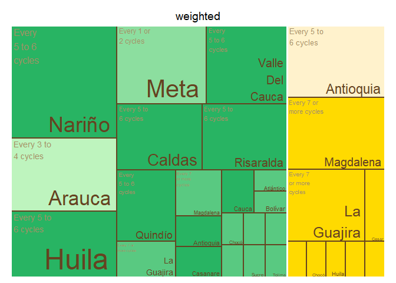<!-- -->

    ## $tm
    ##        crop          expert_in       ave_cat_weighted vSize  vColor stdErr
    ## 1    Banana          Antioquia    Every 5 to 6 cycles    10 #FFF2CC     10
    ## 2    Banana          Antioquia                   <NA>    10 #FFF2CC     10
    ## 3    Banana             Caldas Every 7 or more cycles     1 #FFDA00      1
    ## 4    Banana             Caldas                   <NA>     1 #FFDA00      1
    ## 5    Banana              Cesar Every 7 or more cycles     2 #FFDA00      2
    ## 6    Banana              Cesar                   <NA>     2 #FFDA00      2
    ## 7    Banana              Chocó Every 7 or more cycles     1 #FFDA00      1
    ## 8    Banana              Chocó                   <NA>     1 #FFDA00      1
    ## 9    Banana              Huila Every 7 or more cycles     1 #FFDA00      1
    ## 10   Banana              Huila                   <NA>     1 #FFDA00      1
    ## 11   Banana         La Guajira Every 7 or more cycles     8 #FFDA00      8
    ## 12   Banana         La Guajira                   <NA>     8 #FFDA00      8
    ## 13   Banana          Magdalena Every 7 or more cycles    10 #FFDA00     10
    ## 14   Banana          Magdalena                   <NA>    10 #FFDA00     10
    ## 15   Banana               <NA>                   <NA>    35 #FFDA00     35
    ## 16   Banana            Quindío Every 7 or more cycles     1 #FFDA00      1
    ## 17   Banana            Quindío                   <NA>     1 #FFDA00      1
    ## 18   Banana          Risaralda Every 7 or more cycles     1 #FFDA00      1
    ## 19   Banana          Risaralda                   <NA>     1 #FFDA00      1
    ## 20 Plantain          Antioquia    Every 5 to 6 cycles     2 #28B463      2
    ## 21 Plantain          Antioquia                   <NA>     2 #28B463      2
    ## 22 Plantain             Arauca    Every 3 to 4 cycles     2 #BEF4BE      2
    ## 23 Plantain             Arauca                   <NA>     2 #BEF4BE      2
    ## 24 Plantain          Atlántico Every 7 or more cycles     1 #59C981      1
    ## 25 Plantain          Atlántico                   <NA>     1 #59C981      1
    ## 26 Plantain            Bolívar Every 7 or more cycles     1 #59C981      1
    ## 27 Plantain            Bolívar                   <NA>     1 #59C981      1
    ## 28 Plantain             Caldas    Every 5 to 6 cycles     6 #28B463      6
    ## 29 Plantain             Caldas                   <NA>     6 #28B463      6
    ## 30 Plantain           Casanare    Every 5 to 6 cycles     2 #28B463      2
    ## 31 Plantain           Casanare                   <NA>     2 #28B463      2
    ## 32 Plantain              Chocó Every 7 or more cycles     1 #59C981      1
    ## 33 Plantain              Chocó                   <NA>     1 #59C981      1
    ## 34 Plantain            Córdoba Every 7 or more cycles     1 #59C981      1
    ## 35 Plantain            Córdoba                   <NA>     1 #59C981      1
    ## 36 Plantain              Huila Every 7 or more cycles     1 #59C981      1
    ## 37 Plantain              Huila                   <NA>     1 #59C981      1
    ## 38 Plantain         La Guajira Every 7 or more cycles     3 #59C981      3
    ## 39 Plantain         La Guajira                   <NA>     3 #59C981      3
    ## 40 Plantain          Magdalena Every 7 or more cycles     3 #59C981      3
    ## 41 Plantain          Magdalena                   <NA>     3 #59C981      3
    ## 42 Plantain               Meta    Every 1 or 2 cycles    10 #8CDE9F     10
    ## 43 Plantain               Meta                   <NA>    10 #8CDE9F     10
    ## 44 Plantain               <NA>                   <NA>    51 #59C981     51
    ## 45 Plantain Norte De Santander Every 7 or more cycles     1 #59C981      1
    ## 46 Plantain Norte De Santander                   <NA>     1 #59C981      1
    ## 47 Plantain            Quindío    Every 5 to 6 cycles     6 #28B463      6
    ## 48 Plantain            Quindío                   <NA>     6 #28B463      6
    ## 49 Plantain          Risaralda    Every 5 to 6 cycles     8 #28B463      8
    ## 50 Plantain          Risaralda                   <NA>     8 #28B463      8
    ## 51 Plantain          Santander Every 7 or more cycles     1 #59C981      1
    ## 52 Plantain          Santander                   <NA>     1 #59C981      1
    ## 53 Plantain              Sucre Every 7 or more cycles     1 #59C981      1
    ## 54 Plantain              Sucre                   <NA>     1 #59C981      1
    ## 55 Plantain             Tolima Every 7 or more cycles     1 #59C981      1
    ## 56 Plantain             Tolima                   <NA>     1 #59C981      1
    ##    vColorValue level        x0         y0          w          h   color
    ## 1           NA     3 0.5930233 0.42857143 0.20348837 0.57142857 #FFF2CC
    ## 2           NA     2 0.5930233 0.42857143 0.20348837 0.57142857 #FFF2CC
    ## 3           NA     3 0.8643411 0.25714286 0.06782946 0.17142857 #FFDA00
    ## 4           NA     2 0.8643411 0.25714286 0.06782946 0.17142857 #FFDA00
    ## 5           NA     3 0.5930233 0.00000000 0.27131783 0.08571429 #FFDA00
    ## 6           NA     2 0.5930233 0.00000000 0.27131783 0.08571429 #FFDA00
    ## 7           NA     3 0.9321705 0.25714286 0.06782946 0.17142857 #FFDA00
    ## 8           NA     2 0.9321705 0.25714286 0.06782946 0.17142857 #FFDA00
    ## 9           NA     3 0.8643411 0.08571429 0.06782946 0.17142857 #FFDA00
    ## 10          NA     2 0.8643411 0.08571429 0.06782946 0.17142857 #FFDA00
    ## 11          NA     3 0.5930233 0.08571429 0.27131783 0.34285714 #FFDA00
    ## 12          NA     2 0.5930233 0.08571429 0.27131783 0.34285714 #FFDA00
    ## 13          NA     3 0.7965116 0.42857143 0.20348837 0.57142857 #FFDA00
    ## 14          NA     2 0.7965116 0.42857143 0.20348837 0.57142857 #FFDA00
    ## 15          NA     1 0.5930233 0.00000000 0.40697674 1.00000000 #FFDA00
    ## 16          NA     3 0.9321705 0.08571429 0.06782946 0.17142857 #FFDA00
    ## 17          NA     2 0.9321705 0.08571429 0.06782946 0.17142857 #FFDA00
    ## 18          NA     3 0.8643411 0.00000000 0.13565891 0.08571429 #FFDA00
    ## 19          NA     2 0.8643411 0.00000000 0.13565891 0.08571429 #FFDA00
    ## 20          NA     3 0.1976744 0.15126050 0.15374677 0.15126050 #28B463
    ## 21          NA     2 0.1976744 0.15126050 0.15374677 0.15126050 #28B463
    ## 22          NA     3 0.1976744 0.00000000 0.15374677 0.15126050 #BEF4BE
    ## 23          NA     2 0.1976744 0.00000000 0.15374677 0.15126050 #BEF4BE
    ## 24          NA     3 0.4722222 0.43315508 0.12080103 0.09625668 #59C981
    ## 25          NA     2 0.4722222 0.43315508 0.12080103 0.09625668 #59C981
    ## 26          NA     3 0.4722222 0.33689840 0.12080103 0.09625668 #59C981
    ## 27          NA     2 0.4722222 0.33689840 0.12080103 0.09625668 #59C981
    ## 28          NA     3 0.4447674 0.52941176 0.14825581 0.47058824 #28B463
    ## 29          NA     2 0.4447674 0.52941176 0.14825581 0.47058824 #28B463
    ## 30          NA     3 0.3514212 0.33689840 0.12080103 0.19251337 #28B463
    ## 31          NA     2 0.3514212 0.33689840 0.12080103 0.19251337 #28B463
    ## 32          NA     3 0.3514212 0.22459893 0.10354374 0.11229947 #59C981
    ## 33          NA     2 0.3514212 0.22459893 0.10354374 0.11229947 #59C981
    ## 34          NA     3 0.3514212 0.11229947 0.10354374 0.11229947 #59C981
    ## 35          NA     2 0.3514212 0.11229947 0.10354374 0.11229947 #59C981
    ## 36          NA     3 0.3514212 0.00000000 0.10354374 0.11229947 #59C981
    ## 37          NA     2 0.3514212 0.00000000 0.10354374 0.11229947 #59C981
    ## 38          NA     3 0.0000000 0.00000000 0.19767442 0.17647059 #59C981
    ## 39          NA     2 0.0000000 0.00000000 0.19767442 0.17647059 #59C981
    ## 40          NA     3 0.1976744 0.30252101 0.15374677 0.22689076 #59C981
    ## 41          NA     2 0.1976744 0.30252101 0.15374677 0.22689076 #59C981
    ## 42          NA     3 0.0000000 0.52941176 0.24709302 0.47058824 #8CDE9F
    ## 43          NA     2 0.0000000 0.52941176 0.24709302 0.47058824 #8CDE9F
    ## 44          NA     1 0.0000000 0.00000000 0.59302326 1.00000000 #59C981
    ## 45          NA     3 0.4549649 0.16844920 0.06902916 0.16844920 #59C981
    ## 46          NA     2 0.4549649 0.16844920 0.06902916 0.16844920 #59C981
    ## 47          NA     3 0.0000000 0.17647059 0.19767442 0.35294118 #28B463
    ## 48          NA     2 0.0000000 0.17647059 0.19767442 0.35294118 #28B463
    ## 49          NA     3 0.2470930 0.52941176 0.19767442 0.47058824 #28B463
    ## 50          NA     2 0.2470930 0.52941176 0.19767442 0.47058824 #28B463
    ## 51          NA     3 0.5239941 0.16844920 0.06902916 0.16844920 #59C981
    ## 52          NA     2 0.5239941 0.16844920 0.06902916 0.16844920 #59C981
    ## 53          NA     3 0.4549649 0.00000000 0.06902916 0.16844920 #59C981
    ## 54          NA     2 0.4549649 0.00000000 0.06902916 0.16844920 #59C981
    ## 55          NA     3 0.5239941 0.00000000 0.06902916 0.16844920 #59C981
    ## 56          NA     2 0.5239941 0.00000000 0.06902916 0.16844920 #59C981
    ## 
    ## $type
    ## [1] "color"
    ## 
    ## $vSize
    ## [1] "frequency"
    ## 
    ## $vColor
    ## [1] "group_color"
    ## 
    ## $stdErr
    ## [1] "frequency"
    ## 
    ## $algorithm
    ## [1] "pivotSize"
    ## 
    ## $vpCoorX
    ## [1] 0.02812148 0.97187852
    ## 
    ## $vpCoorY
    ## [1] 0.01968504 0.91031496
    ## 
    ## $aspRatio
    ## [1] 1.483512
    ## 
    ## $range
    ## [1] NA NA
    ## 
    ## $mapping
    ## [1] NA NA NA
    ## 
    ## $draw
    ## [1] TRUE

``` r
#Map of Colombia  
#non weighted
nal_q13_no_weight<- question_13 %>% group_by(expert_in) %>%
  summarise(average= mean(as.numeric(numeric_answer))) %>%
  group_by(average) %>% 
  mutate(cat= category_by_mean_by_question(language = "en", mean = average, question =13))%>%
  rename(EKE.expert.in = expert_in)
```

    ## Warning: There was 1 warning in `mutate()`.
    ## ℹ In argument: `cat = category_by_mean_by_question(...)`.
    ## ℹ In group 0: .
    ## Caused by warning:
    ## ! There was 1 warning in `filter()`.
    ## ℹ In argument: `number == question & number_to_category == mean`.
    ## Caused by warning in `number_to_category == mean`:
    ## ! longer object length is not a multiple of shorter object length

``` r
nal_q13_no_weight<- full_join(codes_department, nal_q13_no_weight)
```

    ## Joining with `by = join_by(EKE.expert.in)`

``` r
nal_q13_no_weight$cat<- factor(nal_q13_no_weight$cat, levels = c("Every 1 or 2 cycles", "Every 3 to 4 cycles", "Every 5 to 6 cycles",  "Every 7 or more cycles", "Not Sure"))
colmap(departamentos, data = nal_q13_no_weight, data_id = "id_depto", var = "cat")+
  scale_fill_manual(values = palette_soil(length(unique(nal_q13_no_weight$cat))-1), na.value = "#eeeeee")
```

    ## Scale for fill is already present.
    ## Adding another scale for fill, which will replace the existing scale.

<!-- -->

``` r
# weighted
nal_q13_weight<- inner_join(question_13, experience_of_each_expert)
```

    ## Joining with `by = join_by(crop, expert_ID, expert_in)`

``` r
nal_q13_weight<- nal_q13_weight %>%
  group_by(expert_in) %>%
  mutate(numeric_answer=as.numeric(numeric_answer)) %>%
  summarise(average_weighted= weighted.mean(numeric_answer, weights)) %>% 
  group_by(average_weighted) %>%
  mutate(cat_weighted= category_by_mean_by_question(language = "en", mean = average_weighted, question =13)) %>%
  rename(EKE.expert.in=expert_in)
```

    ## Warning: There was 1 warning in `mutate()`.
    ## ℹ In argument: `cat_weighted = category_by_mean_by_question(...)`.
    ## ℹ In group 0: .
    ## Caused by warning:
    ## ! There was 1 warning in `filter()`.
    ## ℹ In argument: `number == question & number_to_category == mean`.
    ## Caused by warning in `number_to_category == mean`:
    ## ! longer object length is not a multiple of shorter object length

``` r
nal_q13_weight<- full_join(codes_department, nal_q13_weight)
```

    ## Joining with `by = join_by(EKE.expert.in)`

``` r
nal_q13_weight$cat_weighted<- factor(nal_q13_weight$cat_weighted, levels = c("Every 1 or 2 cycles", "Every 3 to 4 cycles", "Every 5 to 6 cycles",  "Every 7 or more cycles", "Not Sure"))
colmap(departamentos, data = nal_q13_weight, data_id = "id_depto", var = "cat_weighted")+
  scale_fill_manual(values = palette_soil(length(unique(nal_q13_weight$cat))-1), na.value = "#eeeeee")
```

    ## Scale for fill is already present.
    ## Adding another scale for fill, which will replace the existing scale.

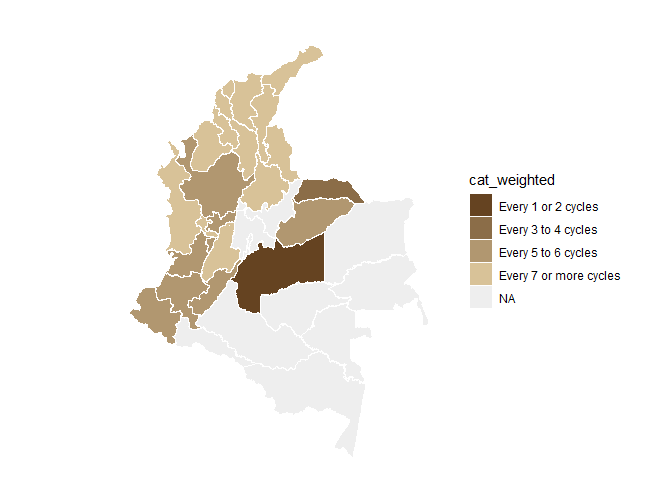<!-- -->

## Question 16: What percentage of chemical control practices (insecticides, fungicides, etc.) are implemented correctly in banana production systems in the places where you are an expert?

``` r
#selecting only question 16----
question_16<- filter(individual_surveys, question_number==16)
#unique(question_16$numeric_answer)
#dput(unique(question_16$answer_in_english))
#organizing the order of the levels
level_16<- c("0%", "1%-10%", "11%-20%", "21%-30%", "31%-40%", "41%-50%","51%-60%", "61%-70%", "71%-80%", "81%-90%", "91%-100%", "Not Sure")
question_16$answer_in_english<- factor(question_16$answer_in_english,levels = level_16)
question_16<- filter(question_16, answer_in_english!="Not Sure")
#average by department (weighted and no weighted)
#not weighted 
avg_dept_no_weight_16<- question_16 %>%
  group_by(crop, expert_in) %>%
  mutate(numeric_answer=as.numeric(numeric_answer))%>%
  mutate(average= mean(numeric_answer)) %>%
  group_by(average)%>%
  mutate(ave_cat= category_by_mean_by_question(16, mean =average, language = "en"))
```

    ## Warning: There were 6 warnings in `mutate()`.
    ## The first warning was:
    ## ℹ In argument: `ave_cat = category_by_mean_by_question(16, mean = average,
    ##   language = "en")`.
    ## ℹ In group 0: .
    ## Caused by warning:
    ## ! There was 1 warning in `filter()`.
    ## ℹ In argument: `number == question & number_to_category == mean`.
    ## Caused by warning in `number_to_category == mean`:
    ## ! longer object length is not a multiple of shorter object length
    ## ℹ Run `dplyr::last_dplyr_warnings()` to see the 5 remaining warnings.

``` r
#weighted 
add_weights_question_16<- inner_join(question_16, experience_of_each_expert)
```

    ## Joining with `by = join_by(crop, expert_ID, expert_in)`

``` r
avg_dept_weight_16<- add_weights_question_16 %>%
  group_by(crop, expert_in) %>%
  mutate(numeric_answer=as.numeric(numeric_answer))%>%
  mutate(average_weighted= weighted.mean(numeric_answer, weights)) %>% 
  group_by(average_weighted)%>%
  mutate(ave_cat_weighted= category_by_mean_by_question(16, mean =average_weighted, language = "en"))
```

    ## Warning: There were 5 warnings in `mutate()`.
    ## The first warning was:
    ## ℹ In argument: `ave_cat_weighted = category_by_mean_by_question(16, mean =
    ##   average_weighted, language = "en")`.
    ## ℹ In group 0: .
    ## Caused by warning:
    ## ! There was 1 warning in `filter()`.
    ## ℹ In argument: `number == question & number_to_category == mean`.
    ## Caused by warning in `number_to_category == mean`:
    ## ! longer object length is not a multiple of shorter object length
    ## ℹ Run `dplyr::last_dplyr_warnings()` to see the 4 remaining warnings.

``` r
#finding the levels per crop (banana and plantain) no weighted
levels_per_crop_Q16_no_weighted<- tapply(avg_dept_no_weight_16$ave_cat, avg_dept_no_weight_16$crop, function(x){(unique(x))})
#generating a ramp palette according to the number of levels per crop
colors_banana_question16_no_weighted<- palette_banana(length(levels_per_crop_Q16_no_weighted$Banana))
colors_plantain_question16_no_weighted<- palette_plantain(length(levels_per_crop_Q16_no_weighted$Plantain))
#Assigning the colors by crop and answer
# Define the knowledge levels for each crop
levels_by_crop_no_weighted_16 <- list(
  Banana = levels_per_crop_Q16_no_weighted$Banana,
  Plantain = levels_per_crop_Q16_no_weighted$Plantain
)
# Define the colors for each crop
colors_by_crop_no_weighted_16 <- list(
  Banana = colors_banana_question16_no_weighted, # Replace with actual color vector for Banana
  Plantain = colors_plantain_question16_no_weighted # Replace with actual color vector for Plantain
  # Add more crops and their color vectors here if needed
)
# Now call the function
avg_dept_no_weight_16 <- assign_group_color(data = avg_dept_no_weight_16, levels_by_crop = levels_by_crop_no_weighted_16, colors_by_crop = colors_by_crop_no_weighted_16,answer_col =  "ave_cat")

#finding the levels per crop (banana and plantain) weighted
levels_per_crop_Q16_weighted<- tapply(avg_dept_weight_16$ave_cat_weighted, avg_dept_weight_16$crop, function(x){(unique(x))})
#generating a ramp palette according to the number of levels per crop
colors_banana_question16_weighted<- palette_banana(length(levels_per_crop_Q16_weighted$Banana))
colors_plantain_question16_weighted<- palette_plantain(length(levels_per_crop_Q16_weighted$Plantain))
#Assigning the colors by crop and answer
# Define the knowledge levels for each crop
levels_by_crop_weighted_16 <- list(
  Banana = levels_per_crop_Q16_weighted$Banana,
  Plantain = levels_per_crop_Q16_weighted$Plantain
)
# Define the colors for each crop
colors_by_crop_weighted_16 <- list(
  Banana = colors_banana_question16_weighted, # Replace with actual color vector for Banana
  Plantain = colors_plantain_question16_weighted # Replace with actual color vector for Plantain
  # Add more crops and their color vectors here if needed
)
# Now call the function
avg_dept_weight_16 <- assign_group_color(data = avg_dept_weight_16, levels_by_crop = levels_by_crop_weighted_16, colors_by_crop = colors_by_crop_weighted_16,answer_col =  "ave_cat_weighted")

#tree map
tree_map_3(data = avg_dept_no_weight_16, "crop", "expert_in", "ave_cat", "group_color", title="No weighted")
```

    ## `summarise()` has grouped output by 'crop', 'expert_in', 'ave_cat'. You can
    ## override using the `.groups` argument.

<!-- -->

    ## $tm
    ##        crop          expert_in ave_cat vSize  vColor stdErr vColorValue level
    ## 1    Banana          Antioquia 71%-80%    11 #FFF2CC     11          NA     3
    ## 2    Banana          Antioquia    <NA>    11 #FFF2CC     11          NA     2
    ## 3    Banana             Caldas 51%-60%     1 #FFDA00      1          NA     3
    ## 4    Banana             Caldas    <NA>     1 #FFDA00      1          NA     2
    ## 5    Banana              Cesar 21%-30%     1 #FFEA88      1          NA     3
    ## 6    Banana              Cesar    <NA>     1 #FFEA88      1          NA     2
    ## 7    Banana              Chocó 51%-60%     2 #FFDA00      2          NA     3
    ## 8    Banana              Chocó    <NA>     2 #FFDA00      2          NA     2
    ## 9    Banana            Córdoba 21%-30%     1 #FFEA88      1          NA     3
    ## 10   Banana            Córdoba    <NA>     1 #FFEA88      1          NA     2
    ## 11   Banana              Huila 51%-60%     1 #FFDA00      1          NA     3
    ## 12   Banana              Huila    <NA>     1 #FFDA00      1          NA     2
    ## 13   Banana         La Guajira 51%-60%    10 #FFDA00     10          NA     3
    ## 14   Banana         La Guajira    <NA>    10 #FFDA00     10          NA     2
    ## 15   Banana          Magdalena 61%-70%    13 #FFE244     13          NA     3
    ## 16   Banana          Magdalena    <NA>    13 #FFE244     13          NA     2
    ## 17   Banana               <NA>    <NA>    42 #FFDA00     42          NA     1
    ## 18   Banana            Quindío 51%-60%     1 #FFDA00      1          NA     3
    ## 19   Banana            Quindío    <NA>     1 #FFDA00      1          NA     2
    ## 20   Banana          Risaralda 51%-60%     1 #FFDA00      1          NA     3
    ## 21   Banana          Risaralda    <NA>     1 #FFDA00      1          NA     2
    ## 22 Plantain          Antioquia 41%-50%     2 #28B463      2          NA     3
    ## 23 Plantain          Antioquia    <NA>     2 #28B463      2          NA     2
    ## 24 Plantain             Arauca 41%-50%     2 #28B463      2          NA     3
    ## 25 Plantain             Arauca    <NA>     2 #28B463      2          NA     2
    ## 26 Plantain          Atlántico 21%-30%     1 #BEF4BE      1          NA     3
    ## 27 Plantain          Atlántico    <NA>     1 #BEF4BE      1          NA     2
    ## 28 Plantain            Bolívar 21%-30%     1 #BEF4BE      1          NA     3
    ## 29 Plantain            Bolívar    <NA>     1 #BEF4BE      1          NA     2
    ## 30 Plantain             Caldas 41%-50%     7 #28B463      7          NA     3
    ## 31 Plantain             Caldas    <NA>     7 #28B463      7          NA     2
    ## 32 Plantain           Casanare 31%-40%     2 #59C981      2          NA     3
    ## 33 Plantain           Casanare    <NA>     2 #59C981      2          NA     2
    ## 34 Plantain            Córdoba 21%-30%     1 #BEF4BE      1          NA     3
    ## 35 Plantain            Córdoba    <NA>     1 #BEF4BE      1          NA     2
    ## 36 Plantain              Huila 31%-40%     1 #59C981      1          NA     3
    ## 37 Plantain              Huila    <NA>     1 #59C981      1          NA     2
    ## 38 Plantain         La Guajira 41%-50%     4 #28B463      4          NA     3
    ## 39 Plantain         La Guajira    <NA>     4 #28B463      4          NA     2
    ## 40 Plantain          Magdalena 31%-40%     3 #59C981      3          NA     3
    ## 41 Plantain          Magdalena    <NA>     3 #59C981      3          NA     2
    ## 42 Plantain               Meta 71%-80%    11 #8CDE9F     11          NA     3
    ## 43 Plantain               Meta    <NA>    11 #8CDE9F     11          NA     2
    ## 44 Plantain               <NA>    <NA>    55 #59C981     55          NA     1
    ## 45 Plantain Norte De Santander 21%-30%     1 #BEF4BE      1          NA     3
    ## 46 Plantain Norte De Santander    <NA>     1 #BEF4BE      1          NA     2
    ## 47 Plantain            Quindío 41%-50%     6 #28B463      6          NA     3
    ## 48 Plantain            Quindío    <NA>     6 #28B463      6          NA     2
    ## 49 Plantain          Risaralda 31%-40%    10 #59C981     10          NA     3
    ## 50 Plantain          Risaralda    <NA>    10 #59C981     10          NA     2
    ## 51 Plantain          Santander 31%-40%     1 #59C981      1          NA     3
    ## 52 Plantain          Santander    <NA>     1 #59C981      1          NA     2
    ## 53 Plantain              Sucre 21%-30%     1 #BEF4BE      1          NA     3
    ## 54 Plantain              Sucre    <NA>     1 #BEF4BE      1          NA     2
    ## 55 Plantain             Tolima 31%-40%     1 #59C981      1          NA     3
    ## 56 Plantain             Tolima    <NA>     1 #59C981      1          NA     2
    ##           x0         y0          w          h   color
    ## 1  0.8015464 0.42857143 0.19845361 0.57142857 #FFF2CC
    ## 2  0.8015464 0.42857143 0.19845361 0.57142857 #FFF2CC
    ## 3  0.8556701 0.28571429 0.07216495 0.14285714 #FFDA00
    ## 4  0.8556701 0.28571429 0.07216495 0.14285714 #FFDA00
    ## 5  0.9278351 0.28571429 0.07216495 0.14285714 #FFEA88
    ## 6  0.9278351 0.28571429 0.07216495 0.14285714 #FFEA88
    ## 7  0.5670103 0.00000000 0.28865979 0.07142857 #FFDA00
    ## 8  0.5670103 0.00000000 0.28865979 0.07142857 #FFDA00
    ## 9  0.8556701 0.14285714 0.07216495 0.14285714 #FFEA88
    ## 10 0.8556701 0.14285714 0.07216495 0.14285714 #FFEA88
    ## 11 0.9278351 0.14285714 0.07216495 0.14285714 #FFDA00
    ## 12 0.9278351 0.14285714 0.07216495 0.14285714 #FFDA00
    ## 13 0.5670103 0.07142857 0.28865979 0.35714286 #FFDA00
    ## 14 0.5670103 0.07142857 0.28865979 0.35714286 #FFDA00
    ## 15 0.5670103 0.42857143 0.23453608 0.57142857 #FFE244
    ## 16 0.5670103 0.42857143 0.23453608 0.57142857 #FFE244
    ## 17 0.5670103 0.00000000 0.43298969 1.00000000 #FFDA00
    ## 18 0.8556701 0.00000000 0.07216495 0.14285714 #FFDA00
    ## 19 0.8556701 0.00000000 0.07216495 0.14285714 #FFDA00
    ## 20 0.9278351 0.00000000 0.07216495 0.14285714 #FFDA00
    ## 21 0.9278351 0.00000000 0.07216495 0.14285714 #FFDA00
    ## 22 0.4891854 0.35324675 0.07782494 0.26493506 #28B463
    ## 23 0.4891854 0.35324675 0.07782494 0.26493506 #28B463
    ## 24 0.2167981 0.17662338 0.11673742 0.17662338 #28B463
    ## 25 0.2167981 0.17662338 0.11673742 0.17662338 #28B463
    ## 26 0.3335355 0.22077922 0.07782494 0.13246753 #BEF4BE
    ## 27 0.3335355 0.22077922 0.07782494 0.13246753 #BEF4BE
    ## 28 0.4113604 0.22077922 0.07782494 0.13246753 #BEF4BE
    ## 29 0.4113604 0.22077922 0.07782494 0.13246753 #BEF4BE
    ## 30 0.0000000 0.28531469 0.21679806 0.33286713 #28B463
    ## 31 0.0000000 0.28531469 0.21679806 0.33286713 #28B463
    ## 32 0.2167981 0.00000000 0.11673742 0.17662338 #59C981
    ## 33 0.2167981 0.00000000 0.11673742 0.17662338 #59C981
    ## 34 0.4891854 0.22077922 0.07782494 0.13246753 #BEF4BE
    ## 35 0.4891854 0.22077922 0.07782494 0.13246753 #BEF4BE
    ## 36 0.3335355 0.11038961 0.09338993 0.11038961 #59C981
    ## 37 0.3335355 0.11038961 0.09338993 0.11038961 #59C981
    ## 38 0.2167981 0.35324675 0.15564989 0.26493506 #28B463
    ## 39 0.2167981 0.35324675 0.15564989 0.26493506 #28B463
    ## 40 0.3724479 0.35324675 0.11673742 0.26493506 #59C981
    ## 41 0.3724479 0.35324675 0.11673742 0.26493506 #59C981
    ## 42 0.0000000 0.61818182 0.29700540 0.38181818 #8CDE9F
    ## 43 0.0000000 0.61818182 0.29700540 0.38181818 #8CDE9F
    ## 44 0.0000000 0.00000000 0.56701031 1.00000000 #59C981
    ## 45 0.3335355 0.00000000 0.09338993 0.11038961 #BEF4BE
    ## 46 0.3335355 0.00000000 0.09338993 0.11038961 #BEF4BE
    ## 47 0.0000000 0.00000000 0.21679806 0.28531469 #28B463
    ## 48 0.0000000 0.00000000 0.21679806 0.28531469 #28B463
    ## 49 0.2970054 0.61818182 0.27000491 0.38181818 #59C981
    ## 50 0.2970054 0.61818182 0.27000491 0.38181818 #59C981
    ## 51 0.4269254 0.07359307 0.07004245 0.14718615 #59C981
    ## 52 0.4269254 0.07359307 0.07004245 0.14718615 #59C981
    ## 53 0.4969679 0.07359307 0.07004245 0.14718615 #BEF4BE
    ## 54 0.4969679 0.07359307 0.07004245 0.14718615 #BEF4BE
    ## 55 0.4269254 0.00000000 0.14008490 0.07359307 #59C981
    ## 56 0.4269254 0.00000000 0.14008490 0.07359307 #59C981
    ## 
    ## $type
    ## [1] "color"
    ## 
    ## $vSize
    ## [1] "frequency"
    ## 
    ## $vColor
    ## [1] "group_color"
    ## 
    ## $stdErr
    ## [1] "frequency"
    ## 
    ## $algorithm
    ## [1] "pivotSize"
    ## 
    ## $vpCoorX
    ## [1] 0.02812148 0.97187852
    ## 
    ## $vpCoorY
    ## [1] 0.01968504 0.91031496
    ## 
    ## $aspRatio
    ## [1] 1.483512
    ## 
    ## $range
    ## [1] NA NA
    ## 
    ## $mapping
    ## [1] NA NA NA
    ## 
    ## $draw
    ## [1] TRUE

``` r
tree_map_3(data = avg_dept_weight_16, "crop", "expert_in", "ave_cat_weighted", "group_color", title="weighted")
```

    ## `summarise()` has grouped output by 'crop', 'expert_in', 'ave_cat_weighted'.
    ## You can override using the `.groups` argument.

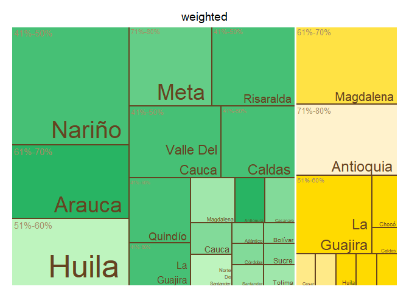<!-- -->

    ## $tm
    ##        crop          expert_in ave_cat_weighted vSize  vColor stdErr
    ## 1    Banana          Antioquia          71%-80%    11 #FFF2CC     11
    ## 2    Banana          Antioquia             <NA>    11 #FFF2CC     11
    ## 3    Banana             Caldas          51%-60%     1 #FFDA00      1
    ## 4    Banana             Caldas             <NA>     1 #FFDA00      1
    ## 5    Banana              Cesar          21%-30%     1 #FFEA88      1
    ## 6    Banana              Cesar             <NA>     1 #FFEA88      1
    ## 7    Banana              Chocó          51%-60%     2 #FFDA00      2
    ## 8    Banana              Chocó             <NA>     2 #FFDA00      2
    ## 9    Banana            Córdoba          21%-30%     1 #FFEA88      1
    ## 10   Banana            Córdoba             <NA>     1 #FFEA88      1
    ## 11   Banana              Huila          51%-60%     1 #FFDA00      1
    ## 12   Banana              Huila             <NA>     1 #FFDA00      1
    ## 13   Banana         La Guajira          51%-60%     9 #FFDA00      9
    ## 14   Banana         La Guajira             <NA>     9 #FFDA00      9
    ## 15   Banana          Magdalena          61%-70%    12 #FFE244     12
    ## 16   Banana          Magdalena             <NA>    12 #FFE244     12
    ## 17   Banana               <NA>             <NA>    40 #FFDA00     40
    ## 18   Banana            Quindío          51%-60%     1 #FFDA00      1
    ## 19   Banana            Quindío             <NA>     1 #FFDA00      1
    ## 20   Banana          Risaralda          51%-60%     1 #FFDA00      1
    ## 21   Banana          Risaralda             <NA>     1 #FFDA00      1
    ## 22 Plantain          Antioquia          61%-70%     2 #28B463      2
    ## 23 Plantain          Antioquia             <NA>     2 #28B463      2
    ## 24 Plantain             Arauca          41%-50%     2 #4DC479      2
    ## 25 Plantain             Arauca             <NA>     2 #4DC479      2
    ## 26 Plantain          Atlántico          21%-30%     1 #98E4A7      1
    ## 27 Plantain          Atlántico             <NA>     1 #98E4A7      1
    ## 28 Plantain            Bolívar          21%-30%     1 #98E4A7      1
    ## 29 Plantain            Bolívar             <NA>     1 #98E4A7      1
    ## 30 Plantain             Caldas          41%-50%     7 #4DC479      7
    ## 31 Plantain             Caldas             <NA>     7 #4DC479      7
    ## 32 Plantain           Casanare          21%-30%     2 #98E4A7      2
    ## 33 Plantain           Casanare             <NA>     2 #98E4A7      2
    ## 34 Plantain            Córdoba          21%-30%     1 #98E4A7      1
    ## 35 Plantain            Córdoba             <NA>     1 #98E4A7      1
    ## 36 Plantain              Huila          31%-40%     1 #BEF4BE      1
    ## 37 Plantain              Huila             <NA>     1 #BEF4BE      1
    ## 38 Plantain         La Guajira          41%-50%     4 #4DC479      4
    ## 39 Plantain         La Guajira             <NA>     4 #4DC479      4
    ## 40 Plantain          Magdalena          31%-40%     3 #BEF4BE      3
    ## 41 Plantain          Magdalena             <NA>     3 #BEF4BE      3
    ## 42 Plantain               Meta          71%-80%    10 #73D490     10
    ## 43 Plantain               Meta             <NA>    10 #73D490     10
    ## 44 Plantain               <NA>             <NA>    54 #98E4A7     54
    ## 45 Plantain Norte De Santander          21%-30%     1 #98E4A7      1
    ## 46 Plantain Norte De Santander             <NA>     1 #98E4A7      1
    ## 47 Plantain            Quindío          41%-50%     6 #4DC479      6
    ## 48 Plantain            Quindío             <NA>     6 #4DC479      6
    ## 49 Plantain          Risaralda          41%-50%    10 #4DC479     10
    ## 50 Plantain          Risaralda             <NA>    10 #4DC479     10
    ## 51 Plantain          Santander          31%-40%     1 #BEF4BE      1
    ## 52 Plantain          Santander             <NA>     1 #BEF4BE      1
    ## 53 Plantain              Sucre          21%-30%     1 #98E4A7      1
    ## 54 Plantain              Sucre             <NA>     1 #98E4A7      1
    ## 55 Plantain             Tolima          31%-40%     1 #BEF4BE      1
    ## 56 Plantain             Tolima             <NA>     1 #BEF4BE      1
    ##    vColorValue level        x0         y0          w          h   color
    ## 1           NA     3 0.7964847 0.42500000 0.20351526 0.57500000 #FFF2CC
    ## 2           NA     2 0.7964847 0.42500000 0.20351526 0.57500000 #FFF2CC
    ## 3           NA     3 0.8498123 0.28333333 0.07509387 0.14166667 #FFDA00
    ## 4           NA     2 0.8498123 0.28333333 0.07509387 0.14166667 #FFDA00
    ## 5           NA     3 0.9249061 0.28333333 0.07509387 0.14166667 #FFEA88
    ## 6           NA     2 0.9249061 0.28333333 0.07509387 0.14166667 #FFEA88
    ## 7           NA     3 0.5744681 0.00000000 0.27534418 0.07727273 #FFDA00
    ## 8           NA     2 0.5744681 0.00000000 0.27534418 0.07727273 #FFDA00
    ## 9           NA     3 0.8498123 0.14166667 0.07509387 0.14166667 #FFEA88
    ## 10          NA     2 0.8498123 0.14166667 0.07509387 0.14166667 #FFEA88
    ## 11          NA     3 0.9249061 0.14166667 0.07509387 0.14166667 #FFDA00
    ## 12          NA     2 0.9249061 0.14166667 0.07509387 0.14166667 #FFDA00
    ## 13          NA     3 0.5744681 0.07727273 0.27534418 0.34772727 #FFDA00
    ## 14          NA     2 0.5744681 0.07727273 0.27534418 0.34772727 #FFDA00
    ## 15          NA     3 0.5744681 0.42500000 0.22201665 0.57500000 #FFE244
    ## 16          NA     2 0.5744681 0.42500000 0.22201665 0.57500000 #FFE244
    ## 17          NA     1 0.5744681 0.00000000 0.42553191 1.00000000 #FFDA00
    ## 18          NA     3 0.8498123 0.00000000 0.07509387 0.14166667 #FFDA00
    ## 19          NA     2 0.8498123 0.00000000 0.07509387 0.14166667 #FFDA00
    ## 20          NA     3 0.9249061 0.00000000 0.07509387 0.14166667 #FFDA00
    ## 21          NA     2 0.9249061 0.00000000 0.07509387 0.14166667 #FFDA00
    ## 22          NA     3 0.4956195 0.35978836 0.07884856 0.26984127 #28B463
    ## 23          NA     2 0.4956195 0.35978836 0.07884856 0.26984127 #28B463
    ## 24          NA     3 0.2196496 0.17989418 0.11827284 0.17989418 #4DC479
    ## 25          NA     2 0.2196496 0.17989418 0.11827284 0.17989418 #4DC479
    ## 26          NA     3 0.3379224 0.22486772 0.07884856 0.13492063 #98E4A7
    ## 27          NA     2 0.3379224 0.22486772 0.07884856 0.13492063 #98E4A7
    ## 28          NA     3 0.4167710 0.22486772 0.07884856 0.13492063 #98E4A7
    ## 29          NA     2 0.4167710 0.22486772 0.07884856 0.13492063 #98E4A7
    ## 30          NA     3 0.0000000 0.29059829 0.21964956 0.33903134 #4DC479
    ## 31          NA     2 0.0000000 0.29059829 0.21964956 0.33903134 #4DC479
    ## 32          NA     3 0.2196496 0.00000000 0.11827284 0.17989418 #98E4A7
    ## 33          NA     2 0.2196496 0.00000000 0.11827284 0.17989418 #98E4A7
    ## 34          NA     3 0.4956195 0.22486772 0.07884856 0.13492063 #98E4A7
    ## 35          NA     2 0.4956195 0.22486772 0.07884856 0.13492063 #98E4A7
    ## 36          NA     3 0.3379224 0.11243386 0.09461827 0.11243386 #BEF4BE
    ## 37          NA     2 0.3379224 0.11243386 0.09461827 0.11243386 #BEF4BE
    ## 38          NA     3 0.2196496 0.35978836 0.15769712 0.26984127 #4DC479
    ## 39          NA     2 0.2196496 0.35978836 0.15769712 0.26984127 #4DC479
    ## 40          NA     3 0.3773467 0.35978836 0.11827284 0.26984127 #BEF4BE
    ## 41          NA     2 0.3773467 0.35978836 0.11827284 0.26984127 #BEF4BE
    ## 42          NA     3 0.0000000 0.62962963 0.28723404 0.37037037 #73D490
    ## 43          NA     2 0.0000000 0.62962963 0.28723404 0.37037037 #73D490
    ## 44          NA     1 0.0000000 0.00000000 0.57446809 1.00000000 #98E4A7
    ## 45          NA     3 0.3379224 0.00000000 0.09461827 0.11243386 #98E4A7
    ## 46          NA     2 0.3379224 0.00000000 0.09461827 0.11243386 #98E4A7
    ## 47          NA     3 0.0000000 0.00000000 0.21964956 0.29059829 #4DC479
    ## 48          NA     2 0.0000000 0.00000000 0.21964956 0.29059829 #4DC479
    ## 49          NA     3 0.2872340 0.62962963 0.28723404 0.37037037 #4DC479
    ## 50          NA     2 0.2872340 0.62962963 0.28723404 0.37037037 #4DC479
    ## 51          NA     3 0.4325407 0.07495591 0.07096370 0.14991182 #BEF4BE
    ## 52          NA     2 0.4325407 0.07495591 0.07096370 0.14991182 #BEF4BE
    ## 53          NA     3 0.5035044 0.07495591 0.07096370 0.14991182 #98E4A7
    ## 54          NA     2 0.5035044 0.07495591 0.07096370 0.14991182 #98E4A7
    ## 55          NA     3 0.4325407 0.00000000 0.14192741 0.07495591 #BEF4BE
    ## 56          NA     2 0.4325407 0.00000000 0.14192741 0.07495591 #BEF4BE
    ## 
    ## $type
    ## [1] "color"
    ## 
    ## $vSize
    ## [1] "frequency"
    ## 
    ## $vColor
    ## [1] "group_color"
    ## 
    ## $stdErr
    ## [1] "frequency"
    ## 
    ## $algorithm
    ## [1] "pivotSize"
    ## 
    ## $vpCoorX
    ## [1] 0.02812148 0.97187852
    ## 
    ## $vpCoorY
    ## [1] 0.01968504 0.91031496
    ## 
    ## $aspRatio
    ## [1] 1.483512
    ## 
    ## $range
    ## [1] NA NA
    ## 
    ## $mapping
    ## [1] NA NA NA
    ## 
    ## $draw
    ## [1] TRUE

``` r
#Map of Colombia  
#non weighted
nal_q16_no_weight<- question_16 %>% group_by(expert_in) %>%
  summarise(average= mean(as.numeric(numeric_answer))) %>%
  group_by(average) %>% 
  mutate(cat= category_by_mean_by_question(language = "en", mean = average, question =16))%>%
  rename(EKE.expert.in = expert_in)
```

    ## Warning: There was 1 warning in `mutate()`.
    ## ℹ In argument: `cat = category_by_mean_by_question(...)`.
    ## ℹ In group 0: .
    ## Caused by warning:
    ## ! There was 1 warning in `filter()`.
    ## ℹ In argument: `number == question & number_to_category == mean`.
    ## Caused by warning in `number_to_category == mean`:
    ## ! longer object length is not a multiple of shorter object length

``` r
nal_q16_no_weight<- full_join(codes_department, nal_q16_no_weight)
```

    ## Joining with `by = join_by(EKE.expert.in)`

``` r
nal_q16_no_weight$cat<- factor(nal_q16_no_weight$cat, levels = level_16)
colmap(departamentos, data = nal_q16_no_weight, data_id = "id_depto", var = "cat")+
  scale_fill_manual(values = palette_soil(length(unique(nal_q16_no_weight$cat))-1), na.value = "#eeeeee")
```

    ## Scale for fill is already present.
    ## Adding another scale for fill, which will replace the existing scale.

<!-- -->

``` r
# weighted
nal_q16_weight<- inner_join(question_16, experience_of_each_expert)
```

    ## Joining with `by = join_by(crop, expert_ID, expert_in)`

``` r
nal_q16_weight<- nal_q16_weight %>%
  group_by(expert_in) %>%
  mutate(numeric_answer=as.numeric(numeric_answer)) %>%
  summarise(average_weighted= weighted.mean(numeric_answer, weights)) %>% 
  group_by(average_weighted) %>%
  mutate(cat_weighted= category_by_mean_by_question(language = "en", mean = average_weighted, question =16)) %>%
  rename(EKE.expert.in=expert_in)
```

    ## Warning: There was 1 warning in `mutate()`.
    ## ℹ In argument: `cat_weighted = category_by_mean_by_question(...)`.
    ## ℹ In group 0: .
    ## Caused by warning:
    ## ! There was 1 warning in `filter()`.
    ## ℹ In argument: `number == question & number_to_category == mean`.
    ## Caused by warning in `number_to_category == mean`:
    ## ! longer object length is not a multiple of shorter object length

``` r
nal_q16_weight<- full_join(codes_department, nal_q16_weight)
```

    ## Joining with `by = join_by(EKE.expert.in)`

``` r
nal_q16_weight$cat_weighted<- factor(nal_q16_weight$cat_weighted, levels = level_16)
colmap(departamentos, data = nal_q16_weight, data_id = "id_depto", var = "cat_weighted")+
  scale_fill_manual(values = palette_soil(length(unique(nal_q16_weight$cat))-1), na.value = "#eeeeee")
```

    ## Scale for fill is already present.
    ## Adding another scale for fill, which will replace the existing scale.

<!-- -->

## Question 17: What percentage of biological control practices (beneficial insects, microbial controls) are implemented correctly in banana production systems where you have experience?

``` r
#selecting only question 17----
question_17<- filter(individual_surveys, question_number==17)
#unique(question_17$numeric_answer)
#dput(unique(question_17$answer_in_english))
#some experts selected more than one option in this question so an intermediate answer is chosen 
question_17 <- question_17 %>%
  mutate(answer_in_english = case_when(
    answer_in_english == "71%-80%,81%-90%" ~ "81%-90%",
    TRUE ~ answer_in_english  # This keeps all other values as they are
  ))
#some experts selected more than one option in this question so an intermediate answer is chosen 
question_17 <- question_17 %>%
  mutate(numeric_answer = case_when(
    numeric_answer == "9,10" ~ "10.5",
    TRUE ~ numeric_answer  # This keeps all other values as they are
  ))
#organizing the order of the levels
level_17<- c("0%", "1%-10%", "11%-20%", "21%-30%", "31%-40%", "41%-50%","51%-60%", "61%-70%", "71%-80%", "81%-90%", "91%-100%", "Not Sure")
question_17$answer_in_english<- factor(question_17$answer_in_english,levels = level_17)
question_17<- filter(question_17, answer_in_english!="Not Sure")
#average by department (weighted and no weighted)
#not weighted 
avg_dept_no_weight_17<- question_17 %>%
  group_by(crop, expert_in) %>%
  mutate(numeric_answer=as.numeric(numeric_answer))%>%
  mutate(average= mean(numeric_answer)) %>%
  group_by(average)%>%
  mutate(ave_cat= category_by_mean_by_question(17, mean =average, language = "en"))
```

    ## Warning: There were 8 warnings in `mutate()`.
    ## The first warning was:
    ## ℹ In argument: `ave_cat = category_by_mean_by_question(17, mean = average,
    ##   language = "en")`.
    ## ℹ In group 0: .
    ## Caused by warning:
    ## ! There was 1 warning in `filter()`.
    ## ℹ In argument: `number == question & number_to_category == mean`.
    ## Caused by warning in `number_to_category == mean`:
    ## ! longer object length is not a multiple of shorter object length
    ## ℹ Run `dplyr::last_dplyr_warnings()` to see the 7 remaining warnings.

``` r
#weighted 
add_weights_question_17<- inner_join(question_17, experience_of_each_expert)
```

    ## Joining with `by = join_by(crop, expert_ID, expert_in)`

``` r
avg_dept_weight_17<- add_weights_question_17 %>%
  group_by(crop, expert_in) %>%
  mutate(numeric_answer=as.numeric(numeric_answer))%>%
  mutate(average_weighted= weighted.mean(numeric_answer, weights)) %>% 
  group_by(average_weighted)%>%
  mutate(ave_cat_weighted= category_by_mean_by_question(17, mean =average_weighted, language = "en"))
```

    ## Warning: There were 6 warnings in `mutate()`.
    ## The first warning was:
    ## ℹ In argument: `ave_cat_weighted = category_by_mean_by_question(17, mean =
    ##   average_weighted, language = "en")`.
    ## ℹ In group 0: .
    ## Caused by warning:
    ## ! There was 1 warning in `filter()`.
    ## ℹ In argument: `number == question & number_to_category == mean`.
    ## Caused by warning in `number_to_category == mean`:
    ## ! longer object length is not a multiple of shorter object length
    ## ℹ Run `dplyr::last_dplyr_warnings()` to see the 5 remaining warnings.

``` r
#finding the levels per crop (banana and plantain) no weighted
levels_per_crop_Q17_no_weighted<- tapply(avg_dept_no_weight_17$ave_cat, avg_dept_no_weight_17$crop, function(x){(unique(x))})
#generating a ramp palette according to the number of levels per crop
colors_banana_question17_no_weighted<- palette_banana(length(levels_per_crop_Q17_no_weighted$Banana))
colors_plantain_question17_no_weighted<- palette_plantain(length(levels_per_crop_Q17_no_weighted$Plantain))
#Assigning the colors by crop and answer
# Define the knowledge levels for each crop
levels_by_crop_no_weighted_17 <- list(
  Banana = levels_per_crop_Q17_no_weighted$Banana,
  Plantain = levels_per_crop_Q17_no_weighted$Plantain
)
# Define the colors for each crop
colors_by_crop_no_weighted_17 <- list(
  Banana = colors_banana_question17_no_weighted, # Replace with actual color vector for Banana
  Plantain = colors_plantain_question17_no_weighted # Replace with actual color vector for Plantain
  # Add more crops and their color vectors here if needed
)
# Now call the function
avg_dept_no_weight_17 <- assign_group_color(data = avg_dept_no_weight_17, levels_by_crop = levels_by_crop_no_weighted_17, colors_by_crop = colors_by_crop_no_weighted_17,answer_col =  "ave_cat")

#finding the levels per crop (banana and plantain) weighted
levels_per_crop_Q17_weighted<- tapply(avg_dept_weight_17$ave_cat_weighted, avg_dept_weight_17$crop, function(x){(unique(x))})
#generating a ramp palette according to the number of levels per crop
colors_banana_question17_weighted<- palette_banana(length(levels_per_crop_Q17_weighted$Banana))
colors_plantain_question17_weighted<- palette_plantain(length(levels_per_crop_Q17_weighted$Plantain))
#Assigning the colors by crop and answer
# Define the knowledge levels for each crop
levels_by_crop_weighted_17 <- list(
  Banana = levels_per_crop_Q17_weighted$Banana,
  Plantain = levels_per_crop_Q17_weighted$Plantain
)
# Define the colors for each crop
colors_by_crop_weighted_17 <- list(
  Banana = colors_banana_question17_weighted, # Replace with actual color vector for Banana
  Plantain = colors_plantain_question17_weighted # Replace with actual color vector for Plantain
  # Add more crops and their color vectors here if needed
)
# Now call the function
avg_dept_weight_17 <- assign_group_color(data = avg_dept_weight_17, levels_by_crop = levels_by_crop_weighted_17, colors_by_crop = colors_by_crop_weighted_17,answer_col =  "ave_cat_weighted")

#tree map
tree_map_3(data = avg_dept_no_weight_17, "crop", "expert_in", "ave_cat", "group_color", title="No weighted")
```

    ## `summarise()` has grouped output by 'crop', 'expert_in', 'ave_cat'. You can
    ## override using the `.groups` argument.

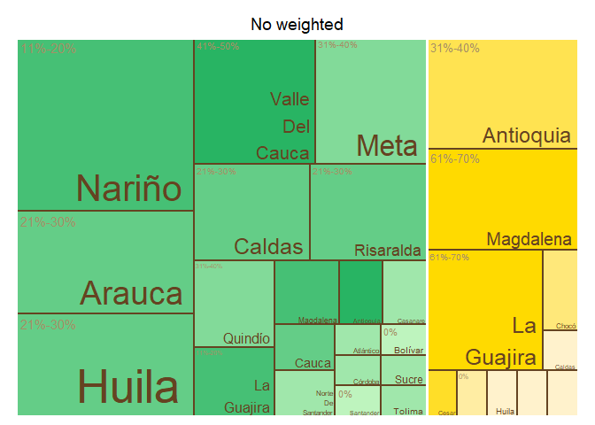<!-- -->

    ## $tm
    ##        crop          expert_in  ave_cat vSize  vColor stdErr vColorValue level
    ## 1    Banana          Antioquia  31%-40%    12 #FFE351     12          NA     3
    ## 2    Banana          Antioquia     <NA>    12 #FFE351     12          NA     2
    ## 3    Banana             Caldas  51%-60%     1 #FFF2CC      1          NA     3
    ## 4    Banana             Caldas     <NA>     1 #FFF2CC      1          NA     2
    ## 5    Banana              Cesar 91%-100%     1 #FFDE28      1          NA     3
    ## 6    Banana              Cesar     <NA>     1 #FFDE28      1          NA     2
    ## 7    Banana              Chocó   1%-10%     2 #FFE87A      2          NA     3
    ## 8    Banana              Chocó     <NA>     2 #FFE87A      2          NA     2
    ## 9    Banana            Córdoba       0%     1 #FFEDA3      1          NA     3
    ## 10   Banana            Córdoba     <NA>     1 #FFEDA3      1          NA     2
    ## 11   Banana              Huila  51%-60%     1 #FFF2CC      1          NA     3
    ## 12   Banana              Huila     <NA>     1 #FFF2CC      1          NA     2
    ## 13   Banana         La Guajira  61%-70%    10 #FFDA00     10          NA     3
    ## 14   Banana         La Guajira     <NA>    10 #FFDA00     10          NA     2
    ## 15   Banana          Magdalena  61%-70%    11 #FFDA00     11          NA     3
    ## 16   Banana          Magdalena     <NA>    11 #FFDA00     11          NA     2
    ## 17   Banana               <NA>     <NA>    41 #FFF2CC     41          NA     1
    ## 18   Banana            Quindío  51%-60%     1 #FFF2CC      1          NA     3
    ## 19   Banana            Quindío     <NA>     1 #FFF2CC      1          NA     2
    ## 20   Banana          Risaralda  51%-60%     1 #FFF2CC      1          NA     3
    ## 21   Banana          Risaralda     <NA>     1 #FFF2CC      1          NA     2
    ## 22 Plantain          Antioquia  41%-50%     2 #28B463      2          NA     3
    ## 23 Plantain          Antioquia     <NA>     2 #28B463      2          NA     2
    ## 24 Plantain             Arauca   1%-10%     2 #A0E7AB      2          NA     3
    ## 25 Plantain             Arauca     <NA>     2 #A0E7AB      2          NA     2
    ## 26 Plantain          Atlántico   1%-10%     1 #A0E7AB      1          NA     3
    ## 27 Plantain          Atlántico     <NA>     1 #A0E7AB      1          NA     2
    ## 28 Plantain            Bolívar       0%     1 #BEF4BE      1          NA     3
    ## 29 Plantain            Bolívar     <NA>     1 #BEF4BE      1          NA     2
    ## 30 Plantain             Caldas  21%-30%     7 #64CD87      7          NA     3
    ## 31 Plantain             Caldas     <NA>     7 #64CD87      7          NA     2
    ## 32 Plantain           Casanare   1%-10%     2 #A0E7AB      2          NA     3
    ## 33 Plantain           Casanare     <NA>     2 #A0E7AB      2          NA     2
    ## 34 Plantain            Córdoba   1%-10%     1 #A0E7AB      1          NA     3
    ## 35 Plantain            Córdoba     <NA>     1 #A0E7AB      1          NA     2
    ## 36 Plantain              Huila   1%-10%     1 #A0E7AB      1          NA     3
    ## 37 Plantain              Huila     <NA>     1 #A0E7AB      1          NA     2
    ## 38 Plantain         La Guajira  11%-20%     4 #46C075      4          NA     3
    ## 39 Plantain         La Guajira     <NA>     4 #46C075      4          NA     2
    ## 40 Plantain          Magdalena  11%-20%     3 #46C075      3          NA     3
    ## 41 Plantain          Magdalena     <NA>     3 #46C075      3          NA     2
    ## 42 Plantain               Meta  31%-40%    10 #82DA99     10          NA     3
    ## 43 Plantain               Meta     <NA>    10 #82DA99     10          NA     2
    ## 44 Plantain               <NA>     <NA>    51 #A0E7AB     51          NA     1
    ## 45 Plantain Norte De Santander       0%     1 #BEF4BE      1          NA     3
    ## 46 Plantain Norte De Santander     <NA>     1 #BEF4BE      1          NA     2
    ## 47 Plantain            Quindío  31%-40%     5 #82DA99      5          NA     3
    ## 48 Plantain            Quindío     <NA>     5 #82DA99      5          NA     2
    ## 49 Plantain          Risaralda  21%-30%     8 #64CD87      8          NA     3
    ## 50 Plantain          Risaralda     <NA>     8 #64CD87      8          NA     2
    ## 51 Plantain          Santander       0%     1 #BEF4BE      1          NA     3
    ## 52 Plantain          Santander     <NA>     1 #BEF4BE      1          NA     2
    ## 53 Plantain              Sucre   1%-10%     1 #A0E7AB      1          NA     3
    ## 54 Plantain              Sucre     <NA>     1 #A0E7AB      1          NA     2
    ## 55 Plantain             Tolima   1%-10%     1 #A0E7AB      1          NA     3
    ## 56 Plantain             Tolima     <NA>     1 #A0E7AB      1          NA     2
    ##           x0         y0          w          h   color
    ## 1  0.5543478 0.43902439 0.23251418 0.56097561 #FFE351
    ## 2  0.5543478 0.43902439 0.23251418 0.56097561 #FFE351
    ## 3  0.9339775 0.27439024 0.06602254 0.16463415 #FFF2CC
    ## 4  0.9339775 0.27439024 0.06602254 0.16463415 #FFF2CC
    ## 5  0.8019324 0.13719512 0.07922705 0.13719512 #FFDE28
    ## 6  0.8019324 0.13719512 0.07922705 0.13719512 #FFDE28
    ## 7  0.8019324 0.27439024 0.13204509 0.16463415 #FFE87A
    ## 8  0.8019324 0.27439024 0.13204509 0.16463415 #FFE87A
    ## 9  0.8019324 0.00000000 0.07922705 0.13719512 #FFEDA3
    ## 10 0.8019324 0.00000000 0.07922705 0.13719512 #FFEDA3
    ## 11 0.8811594 0.18292683 0.11884058 0.09146341 #FFF2CC
    ## 12 0.8811594 0.18292683 0.11884058 0.09146341 #FFF2CC
    ## 13 0.5543478 0.00000000 0.24758454 0.43902439 #FFDA00
    ## 14 0.5543478 0.00000000 0.24758454 0.43902439 #FFDA00
    ## 15 0.7868620 0.43902439 0.21313800 0.56097561 #FFDA00
    ## 16 0.7868620 0.43902439 0.21313800 0.56097561 #FFDA00
    ## 17 0.5543478 0.00000000 0.44565217 1.00000000 #FFF2CC
    ## 18 0.8811594 0.09146341 0.11884058 0.09146341 #FFF2CC
    ## 19 0.8811594 0.09146341 0.11884058 0.09146341 #FFF2CC
    ## 20 0.8811594 0.00000000 0.11884058 0.09146341 #FFF2CC
    ## 21 0.8811594 0.00000000 0.11884058 0.09146341 #FFF2CC
    ## 22 0.4759552 0.36974790 0.07839262 0.27731092 #28B463
    ## 23 0.4759552 0.36974790 0.07839262 0.27731092 #28B463
    ## 24 0.2015810 0.18487395 0.11758893 0.18487395 #A0E7AB
    ## 25 0.2015810 0.18487395 0.11758893 0.18487395 #A0E7AB
    ## 26 0.3191700 0.23109244 0.07839262 0.13865546 #A0E7AB
    ## 27 0.3191700 0.23109244 0.07839262 0.13865546 #A0E7AB
    ## 28 0.3975626 0.23109244 0.07839262 0.13865546 #BEF4BE
    ## 29 0.3975626 0.23109244 0.07839262 0.13865546 #BEF4BE
    ## 30 0.0000000 0.26960784 0.20158103 0.37745098 #64CD87
    ## 31 0.0000000 0.26960784 0.20158103 0.37745098 #64CD87
    ## 32 0.2015810 0.00000000 0.11758893 0.18487395 #A0E7AB
    ## 33 0.2015810 0.00000000 0.11758893 0.18487395 #A0E7AB
    ## 34 0.4759552 0.23109244 0.07839262 0.13865546 #A0E7AB
    ## 35 0.4759552 0.23109244 0.07839262 0.13865546 #A0E7AB
    ## 36 0.3191700 0.11554622 0.09407115 0.11554622 #A0E7AB
    ## 37 0.3191700 0.11554622 0.09407115 0.11554622 #A0E7AB
    ## 38 0.2015810 0.36974790 0.15678524 0.27731092 #46C075
    ## 39 0.2015810 0.36974790 0.15678524 0.27731092 #46C075
    ## 40 0.3583663 0.36974790 0.11758893 0.27731092 #46C075
    ## 41 0.3583663 0.36974790 0.11758893 0.27731092 #46C075
    ## 42 0.0000000 0.64705882 0.30797101 0.35294118 #82DA99
    ## 43 0.0000000 0.64705882 0.30797101 0.35294118 #82DA99
    ## 44 0.0000000 0.00000000 0.55434783 1.00000000 #A0E7AB
    ## 45 0.3191700 0.00000000 0.09407115 0.11554622 #BEF4BE
    ## 46 0.3191700 0.00000000 0.09407115 0.11554622 #BEF4BE
    ## 47 0.0000000 0.00000000 0.20158103 0.26960784 #82DA99
    ## 48 0.0000000 0.00000000 0.20158103 0.26960784 #82DA99
    ## 49 0.3079710 0.64705882 0.24637681 0.35294118 #64CD87
    ## 50 0.3079710 0.64705882 0.24637681 0.35294118 #64CD87
    ## 51 0.4132411 0.07703081 0.07055336 0.15406162 #BEF4BE
    ## 52 0.4132411 0.07703081 0.07055336 0.15406162 #BEF4BE
    ## 53 0.4837945 0.07703081 0.07055336 0.15406162 #A0E7AB
    ## 54 0.4837945 0.07703081 0.07055336 0.15406162 #A0E7AB
    ## 55 0.4132411 0.00000000 0.14110672 0.07703081 #A0E7AB
    ## 56 0.4132411 0.00000000 0.14110672 0.07703081 #A0E7AB
    ## 
    ## $type
    ## [1] "color"
    ## 
    ## $vSize
    ## [1] "frequency"
    ## 
    ## $vColor
    ## [1] "group_color"
    ## 
    ## $stdErr
    ## [1] "frequency"
    ## 
    ## $algorithm
    ## [1] "pivotSize"
    ## 
    ## $vpCoorX
    ## [1] 0.02812148 0.97187852
    ## 
    ## $vpCoorY
    ## [1] 0.01968504 0.91031496
    ## 
    ## $aspRatio
    ## [1] 1.483512
    ## 
    ## $range
    ## [1] NA NA
    ## 
    ## $mapping
    ## [1] NA NA NA
    ## 
    ## $draw
    ## [1] TRUE

``` r
tree_map_3(data = avg_dept_weight_17, "crop", "expert_in", "ave_cat_weighted", "group_color", title="weighted")
```

    ## `summarise()` has grouped output by 'crop', 'expert_in', 'ave_cat_weighted'.
    ## You can override using the `.groups` argument.

<!-- -->

    ## $tm
    ##        crop          expert_in ave_cat_weighted vSize  vColor stdErr
    ## 1    Banana          Antioquia          31%-40%    11 #FFE351     11
    ## 2    Banana          Antioquia             <NA>    11 #FFE351     11
    ## 3    Banana             Caldas          51%-60%     1 #FFF2CC      1
    ## 4    Banana             Caldas             <NA>     1 #FFF2CC      1
    ## 5    Banana              Cesar         91%-100%     1 #FFDE28      1
    ## 6    Banana              Cesar             <NA>     1 #FFDE28      1
    ## 7    Banana              Chocó           1%-10%     2 #FFE87A      2
    ## 8    Banana              Chocó             <NA>     2 #FFE87A      2
    ## 9    Banana            Córdoba               0%     1 #FFEDA3      1
    ## 10   Banana            Córdoba             <NA>     1 #FFEDA3      1
    ## 11   Banana              Huila          51%-60%     1 #FFF2CC      1
    ## 12   Banana              Huila             <NA>     1 #FFF2CC      1
    ## 13   Banana         La Guajira          61%-70%     9 #FFDA00      9
    ## 14   Banana         La Guajira             <NA>     9 #FFDA00      9
    ## 15   Banana          Magdalena          61%-70%    11 #FFDA00     11
    ## 16   Banana          Magdalena             <NA>    11 #FFDA00     11
    ## 17   Banana               <NA>             <NA>    39 #FFF2CC     39
    ## 18   Banana            Quindío          51%-60%     1 #FFF2CC      1
    ## 19   Banana            Quindío             <NA>     1 #FFF2CC      1
    ## 20   Banana          Risaralda          51%-60%     1 #FFF2CC      1
    ## 21   Banana          Risaralda             <NA>     1 #FFF2CC      1
    ## 22 Plantain          Antioquia          21%-30%     2 #28B463      2
    ## 23 Plantain          Antioquia             <NA>     2 #28B463      2
    ## 24 Plantain             Arauca           1%-10%     2 #98E4A7      2
    ## 25 Plantain             Arauca             <NA>     2 #98E4A7      2
    ## 26 Plantain          Atlántico           1%-10%     1 #98E4A7      1
    ## 27 Plantain          Atlántico             <NA>     1 #98E4A7      1
    ## 28 Plantain            Bolívar               0%     1 #BEF4BE      1
    ## 29 Plantain            Bolívar             <NA>     1 #BEF4BE      1
    ## 30 Plantain             Caldas          21%-30%     7 #28B463      7
    ## 31 Plantain             Caldas             <NA>     7 #28B463      7
    ## 32 Plantain           Casanare               0%     2 #BEF4BE      2
    ## 33 Plantain           Casanare             <NA>     2 #BEF4BE      2
    ## 34 Plantain            Córdoba           1%-10%     1 #98E4A7      1
    ## 35 Plantain            Córdoba             <NA>     1 #98E4A7      1
    ## 36 Plantain              Huila           1%-10%     1 #98E4A7      1
    ## 37 Plantain              Huila             <NA>     1 #98E4A7      1
    ## 38 Plantain         La Guajira          11%-20%     4 #4DC479      4
    ## 39 Plantain         La Guajira             <NA>     4 #4DC479      4
    ## 40 Plantain          Magdalena          11%-20%     3 #4DC479      3
    ## 41 Plantain          Magdalena             <NA>     3 #4DC479      3
    ## 42 Plantain               Meta          21%-30%    10 #28B463     10
    ## 43 Plantain               Meta             <NA>    10 #28B463     10
    ## 44 Plantain               <NA>             <NA>    51 #98E4A7     51
    ## 45 Plantain Norte De Santander               0%     1 #BEF4BE      1
    ## 46 Plantain Norte De Santander             <NA>     1 #BEF4BE      1
    ## 47 Plantain            Quindío          31%-40%     5 #73D490      5
    ## 48 Plantain            Quindío             <NA>     5 #73D490      5
    ## 49 Plantain          Risaralda          21%-30%     8 #28B463      8
    ## 50 Plantain          Risaralda             <NA>     8 #28B463      8
    ## 51 Plantain          Santander               0%     1 #BEF4BE      1
    ## 52 Plantain          Santander             <NA>     1 #BEF4BE      1
    ## 53 Plantain              Sucre           1%-10%     1 #98E4A7      1
    ## 54 Plantain              Sucre             <NA>     1 #98E4A7      1
    ## 55 Plantain             Tolima           1%-10%     1 #98E4A7      1
    ## 56 Plantain             Tolima             <NA>     1 #98E4A7      1
    ##    vColorValue level        x0         y0          w          h   color
    ## 1           NA     3 0.5666667 0.43589744 0.21666667 0.56410256 #FFE351
    ## 2           NA     2 0.5666667 0.43589744 0.21666667 0.56410256 #FFE351
    ## 3           NA     3 0.8470588 0.29059829 0.07647059 0.14529915 #FFF2CC
    ## 4           NA     2 0.8470588 0.29059829 0.07647059 0.14529915 #FFF2CC
    ## 5           NA     3 0.9235294 0.29059829 0.07647059 0.14529915 #FFDE28
    ## 6           NA     2 0.9235294 0.29059829 0.07647059 0.14529915 #FFDE28
    ## 7           NA     3 0.5666667 0.00000000 0.28039216 0.07925408 #FFE87A
    ## 8           NA     2 0.5666667 0.00000000 0.28039216 0.07925408 #FFE87A
    ## 9           NA     3 0.8470588 0.14529915 0.07647059 0.14529915 #FFEDA3
    ## 10          NA     2 0.8470588 0.14529915 0.07647059 0.14529915 #FFEDA3
    ## 11          NA     3 0.9235294 0.14529915 0.07647059 0.14529915 #FFF2CC
    ## 12          NA     2 0.9235294 0.14529915 0.07647059 0.14529915 #FFF2CC
    ## 13          NA     3 0.5666667 0.07925408 0.28039216 0.35664336 #FFDA00
    ## 14          NA     2 0.5666667 0.07925408 0.28039216 0.35664336 #FFDA00
    ## 15          NA     3 0.7833333 0.43589744 0.21666667 0.56410256 #FFDA00
    ## 16          NA     2 0.7833333 0.43589744 0.21666667 0.56410256 #FFDA00
    ## 17          NA     1 0.5666667 0.00000000 0.43333333 1.00000000 #FFF2CC
    ## 18          NA     3 0.8470588 0.00000000 0.07647059 0.14529915 #FFF2CC
    ## 19          NA     2 0.8470588 0.00000000 0.07647059 0.14529915 #FFF2CC
    ## 20          NA     3 0.9235294 0.00000000 0.07647059 0.14529915 #FFF2CC
    ## 21          NA     2 0.9235294 0.00000000 0.07647059 0.14529915 #FFF2CC
    ## 22          NA     3 0.4865320 0.36974790 0.08013468 0.27731092 #28B463
    ## 23          NA     2 0.4865320 0.36974790 0.08013468 0.27731092 #28B463
    ## 24          NA     3 0.2060606 0.18487395 0.12020202 0.18487395 #98E4A7
    ## 25          NA     2 0.2060606 0.18487395 0.12020202 0.18487395 #98E4A7
    ## 26          NA     3 0.3262626 0.23109244 0.08013468 0.13865546 #98E4A7
    ## 27          NA     2 0.3262626 0.23109244 0.08013468 0.13865546 #98E4A7
    ## 28          NA     3 0.4063973 0.23109244 0.08013468 0.13865546 #BEF4BE
    ## 29          NA     2 0.4063973 0.23109244 0.08013468 0.13865546 #BEF4BE
    ## 30          NA     3 0.0000000 0.26960784 0.20606061 0.37745098 #28B463
    ## 31          NA     2 0.0000000 0.26960784 0.20606061 0.37745098 #28B463
    ## 32          NA     3 0.2060606 0.00000000 0.12020202 0.18487395 #BEF4BE
    ## 33          NA     2 0.2060606 0.00000000 0.12020202 0.18487395 #BEF4BE
    ## 34          NA     3 0.4865320 0.23109244 0.08013468 0.13865546 #98E4A7
    ## 35          NA     2 0.4865320 0.23109244 0.08013468 0.13865546 #98E4A7
    ## 36          NA     3 0.3262626 0.11554622 0.09616162 0.11554622 #98E4A7
    ## 37          NA     2 0.3262626 0.11554622 0.09616162 0.11554622 #98E4A7
    ## 38          NA     3 0.2060606 0.36974790 0.16026936 0.27731092 #4DC479
    ## 39          NA     2 0.2060606 0.36974790 0.16026936 0.27731092 #4DC479
    ## 40          NA     3 0.3663300 0.36974790 0.12020202 0.27731092 #4DC479
    ## 41          NA     2 0.3663300 0.36974790 0.12020202 0.27731092 #4DC479
    ## 42          NA     3 0.0000000 0.64705882 0.31481481 0.35294118 #28B463
    ## 43          NA     2 0.0000000 0.64705882 0.31481481 0.35294118 #28B463
    ## 44          NA     1 0.0000000 0.00000000 0.56666667 1.00000000 #98E4A7
    ## 45          NA     3 0.3262626 0.00000000 0.09616162 0.11554622 #BEF4BE
    ## 46          NA     2 0.3262626 0.00000000 0.09616162 0.11554622 #BEF4BE
    ## 47          NA     3 0.0000000 0.00000000 0.20606061 0.26960784 #73D490
    ## 48          NA     2 0.0000000 0.00000000 0.20606061 0.26960784 #73D490
    ## 49          NA     3 0.3148148 0.64705882 0.25185185 0.35294118 #28B463
    ## 50          NA     2 0.3148148 0.64705882 0.25185185 0.35294118 #28B463
    ## 51          NA     3 0.4224242 0.07703081 0.07212121 0.15406162 #BEF4BE
    ## 52          NA     2 0.4224242 0.07703081 0.07212121 0.15406162 #BEF4BE
    ## 53          NA     3 0.4945455 0.07703081 0.07212121 0.15406162 #98E4A7
    ## 54          NA     2 0.4945455 0.07703081 0.07212121 0.15406162 #98E4A7
    ## 55          NA     3 0.4224242 0.00000000 0.14424242 0.07703081 #98E4A7
    ## 56          NA     2 0.4224242 0.00000000 0.14424242 0.07703081 #98E4A7
    ## 
    ## $type
    ## [1] "color"
    ## 
    ## $vSize
    ## [1] "frequency"
    ## 
    ## $vColor
    ## [1] "group_color"
    ## 
    ## $stdErr
    ## [1] "frequency"
    ## 
    ## $algorithm
    ## [1] "pivotSize"
    ## 
    ## $vpCoorX
    ## [1] 0.02812148 0.97187852
    ## 
    ## $vpCoorY
    ## [1] 0.01968504 0.91031496
    ## 
    ## $aspRatio
    ## [1] 1.483512
    ## 
    ## $range
    ## [1] NA NA
    ## 
    ## $mapping
    ## [1] NA NA NA
    ## 
    ## $draw
    ## [1] TRUE

``` r
#Map of Colombia  
#non weighted
nal_q17_no_weight<- question_17 %>% group_by(expert_in) %>%
  summarise(average= mean(as.numeric(numeric_answer))) %>%
  group_by(average) %>% 
  mutate(cat= category_by_mean_by_question(language = "en", mean = average, question =17))%>%
  rename(EKE.expert.in = expert_in)
```

    ## Warning: There were 2 warnings in `mutate()`.
    ## The first warning was:
    ## ℹ In argument: `cat = category_by_mean_by_question(...)`.
    ## ℹ In group 0: .
    ## Caused by warning:
    ## ! There was 1 warning in `filter()`.
    ## ℹ In argument: `number == question & number_to_category == mean`.
    ## Caused by warning in `number_to_category == mean`:
    ## ! longer object length is not a multiple of shorter object length
    ## ℹ Run `dplyr::last_dplyr_warnings()` to see the 1 remaining warning.

``` r
nal_q17_no_weight<- full_join(codes_department, nal_q17_no_weight)
```

    ## Joining with `by = join_by(EKE.expert.in)`

``` r
nal_q17_no_weight$cat<- factor(nal_q17_no_weight$cat, levels = level_17)
colmap(departamentos, data = nal_q17_no_weight, data_id = "id_depto", var = "cat")+
  scale_fill_manual(values = palette_soil(length(unique(nal_q17_no_weight$cat))-1), na.value = "#eeeeee")
```

    ## Scale for fill is already present.
    ## Adding another scale for fill, which will replace the existing scale.

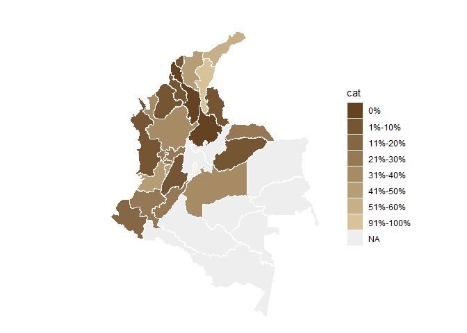<!-- -->

``` r
# weighted
nal_q17_weight<- inner_join(question_17, experience_of_each_expert)
```

    ## Joining with `by = join_by(crop, expert_ID, expert_in)`

``` r
nal_q17_weight<- nal_q17_weight %>%
  group_by(expert_in) %>%
  mutate(numeric_answer=as.numeric(numeric_answer)) %>%
  summarise(average_weighted= weighted.mean(numeric_answer, weights)) %>% 
  group_by(average_weighted) %>%
  mutate(cat_weighted= category_by_mean_by_question(language = "en", mean = average_weighted, question =17)) %>%
  rename(EKE.expert.in=expert_in)
```

    ## Warning: There was 1 warning in `mutate()`.
    ## ℹ In argument: `cat_weighted = category_by_mean_by_question(...)`.
    ## ℹ In group 0: .
    ## Caused by warning:
    ## ! There was 1 warning in `filter()`.
    ## ℹ In argument: `number == question & number_to_category == mean`.
    ## Caused by warning in `number_to_category == mean`:
    ## ! longer object length is not a multiple of shorter object length

``` r
nal_q17_weight<- full_join(codes_department, nal_q17_weight)
```

    ## Joining with `by = join_by(EKE.expert.in)`

``` r
nal_q17_weight$cat_weighted<- factor(nal_q17_weight$cat_weighted, levels = level_17)
colmap(departamentos, data = nal_q17_weight, data_id = "id_depto", var = "cat_weighted")+
  scale_fill_manual(values = palette_soil(length(unique(nal_q17_weight$cat))-1), na.value = "#eeeeee")
```

    ## Scale for fill is already present.
    ## Adding another scale for fill, which will replace the existing scale.

<!-- -->

## Question 18: What percentage of cultural control practices (crop rotation, sanitation) are implemented correctly in banana production systems in the areas where you are an expert?

``` r
#selecting only question 18----
question_18<- filter(individual_surveys, question_number==18)
#unique(question_18$numeric_answer)
#dput(unique(question_18$answer_in_english))
#organizing the order of the levels
level_18<- c("0%", "1%-10%", "11%-20%", "21%-30%", "31%-40%", "41%-50%","51%-60%", "61%-70%", "71%-80%", "81%-90%", "91%-100%", "Not Sure")
question_18$answer_in_english<- factor(question_18$answer_in_english,levels = level_18)
question_18<- filter(question_18, answer_in_english!="Not Sure")
#average by department (weighted and no weighted)
#not weighted 
avg_dept_no_weight_18<- question_18 %>%
  group_by(crop, expert_in) %>%
  mutate(numeric_answer=as.numeric(numeric_answer))%>%
  mutate(average= mean(numeric_answer)) %>%
  group_by(average)%>%
  mutate(ave_cat= category_by_mean_by_question(18, mean =average, language = "en"))
```

    ## Warning: There were 7 warnings in `mutate()`.
    ## The first warning was:
    ## ℹ In argument: `ave_cat = category_by_mean_by_question(18, mean = average,
    ##   language = "en")`.
    ## ℹ In group 0: .
    ## Caused by warning:
    ## ! There was 1 warning in `filter()`.
    ## ℹ In argument: `number == question & number_to_category == mean`.
    ## Caused by warning in `number_to_category == mean`:
    ## ! longer object length is not a multiple of shorter object length
    ## ℹ Run `dplyr::last_dplyr_warnings()` to see the 6 remaining warnings.

``` r
#weighted 
add_weights_question_18<- inner_join(question_18, experience_of_each_expert)
```

    ## Joining with `by = join_by(crop, expert_ID, expert_in)`

``` r
avg_dept_weight_18<- add_weights_question_18 %>%
  group_by(crop, expert_in) %>%
  mutate(numeric_answer=as.numeric(numeric_answer))%>%
  mutate(average_weighted= weighted.mean(numeric_answer, weights)) %>% 
  group_by(average_weighted)%>%
  mutate(ave_cat_weighted= category_by_mean_by_question(18, mean =average_weighted, language = "en"))
```

    ## Warning: There were 5 warnings in `mutate()`.
    ## The first warning was:
    ## ℹ In argument: `ave_cat_weighted = category_by_mean_by_question(18, mean =
    ##   average_weighted, language = "en")`.
    ## ℹ In group 0: .
    ## Caused by warning:
    ## ! There was 1 warning in `filter()`.
    ## ℹ In argument: `number == question & number_to_category == mean`.
    ## Caused by warning in `number_to_category == mean`:
    ## ! longer object length is not a multiple of shorter object length
    ## ℹ Run `dplyr::last_dplyr_warnings()` to see the 4 remaining warnings.

``` r
#finding the levels per crop (banana and plantain) no weighted
levels_per_crop_Q18_no_weighted<- tapply(avg_dept_no_weight_18$ave_cat, avg_dept_no_weight_18$crop, function(x){(unique(x))})
#generating a ramp palette according to the number of levels per crop
colors_banana_question18_no_weighted<- palette_banana(length(levels_per_crop_Q18_no_weighted$Banana))
colors_plantain_question18_no_weighted<- palette_plantain(length(levels_per_crop_Q18_no_weighted$Plantain))
#Assigning the colors by crop and answer
# Define the knowledge levels for each crop
levels_by_crop_no_weighted_18 <- list(
  Banana = levels_per_crop_Q18_no_weighted$Banana,
  Plantain = levels_per_crop_Q18_no_weighted$Plantain
)
# Define the colors for each crop
colors_by_crop_no_weighted_18 <- list(
  Banana = colors_banana_question18_no_weighted, # Replace with actual color vector for Banana
  Plantain = colors_plantain_question18_no_weighted # Replace with actual color vector for Plantain
  # Add more crops and their color vectors here if needed
)
# Now call the function
avg_dept_no_weight_18 <- assign_group_color(data = avg_dept_no_weight_18, levels_by_crop = levels_by_crop_no_weighted_18, colors_by_crop = colors_by_crop_no_weighted_18,answer_col =  "ave_cat")

#finding the levels per crop (banana and plantain) weighted
levels_per_crop_Q18_weighted<- tapply(avg_dept_weight_18$ave_cat_weighted, avg_dept_weight_18$crop, function(x){(unique(x))})
#generating a ramp palette according to the number of levels per crop
colors_banana_question18_weighted<- palette_banana(length(levels_per_crop_Q18_weighted$Banana))
colors_plantain_question18_weighted<- palette_plantain(length(levels_per_crop_Q18_weighted$Plantain))
#Assigning the colors by crop and answer
# Define the knowledge levels for each crop
levels_by_crop_weighted_18 <- list(
  Banana = levels_per_crop_Q18_weighted$Banana,
  Plantain = levels_per_crop_Q18_weighted$Plantain
)
# Define the colors for each crop
colors_by_crop_weighted_18 <- list(
  Banana = colors_banana_question18_weighted, # Replace with actual color vector for Banana
  Plantain = colors_plantain_question18_weighted # Replace with actual color vector for Plantain
  # Add more crops and their color vectors here if needed
)
# Now call the function
avg_dept_weight_18 <- assign_group_color(data = avg_dept_weight_18, levels_by_crop = levels_by_crop_weighted_18, colors_by_crop = colors_by_crop_weighted_18,answer_col =  "ave_cat_weighted")

#tree map
tree_map_3(data = avg_dept_no_weight_18, "crop", "expert_in", "ave_cat", "group_color", title="No weighted")
```

    ## `summarise()` has grouped output by 'crop', 'expert_in', 'ave_cat'. You can
    ## override using the `.groups` argument.

<!-- -->

    ## $tm
    ##        crop          expert_in ave_cat vSize  vColor stdErr vColorValue level
    ## 1    Banana          Antioquia 51%-60%    11 #FFDE28     11          NA     3
    ## 2    Banana          Antioquia    <NA>    11 #FFDE28     11          NA     2
    ## 3    Banana             Caldas 61%-70%     1 #FFDA00      1          NA     3
    ## 4    Banana             Caldas    <NA>     1 #FFDA00      1          NA     2
    ## 5    Banana              Cesar      0%     1 #FFE351      1          NA     3
    ## 6    Banana              Cesar    <NA>     1 #FFE351      1          NA     2
    ## 7    Banana              Chocó 21%-30%     2 #FFEDA3      2          NA     3
    ## 8    Banana              Chocó    <NA>     2 #FFEDA3      2          NA     2
    ## 9    Banana            Córdoba  1%-10%     1 #FFF2CC      1          NA     3
    ## 10   Banana            Córdoba    <NA>     1 #FFF2CC      1          NA     2
    ## 11   Banana              Huila 61%-70%     1 #FFDA00      1          NA     3
    ## 12   Banana              Huila    <NA>     1 #FFDA00      1          NA     2
    ## 13   Banana         La Guajira 61%-70%     9 #FFDA00      9          NA     3
    ## 14   Banana         La Guajira    <NA>     9 #FFDA00      9          NA     2
    ## 15   Banana          Magdalena 51%-60%    12 #FFDE28     12          NA     3
    ## 16   Banana          Magdalena    <NA>    12 #FFDE28     12          NA     2
    ## 17   Banana               <NA>    <NA>    41 #FFDA00     41          NA     1
    ## 18   Banana            Quindío 61%-70%     1 #FFDA00      1          NA     3
    ## 19   Banana            Quindío    <NA>     1 #FFDA00      1          NA     2
    ## 20   Banana          Risaralda 81%-90%     2 #FFE87A      2          NA     3
    ## 21   Banana          Risaralda    <NA>     2 #FFE87A      2          NA     2
    ## 22 Plantain          Antioquia 21%-30%     2 #28B463      2          NA     3
    ## 23 Plantain          Antioquia    <NA>     2 #28B463      2          NA     2
    ## 24 Plantain             Arauca 21%-30%     2 #28B463      2          NA     3
    ## 25 Plantain             Arauca    <NA>     2 #28B463      2          NA     2
    ## 26 Plantain          Atlántico 31%-40%     1 #73D490      1          NA     3
    ## 27 Plantain          Atlántico    <NA>     1 #73D490      1          NA     2
    ## 28 Plantain            Bolívar 31%-40%     1 #73D490      1          NA     3
    ## 29 Plantain            Bolívar    <NA>     1 #73D490      1          NA     2
    ## 30 Plantain             Caldas 31%-40%     7 #73D490      7          NA     3
    ## 31 Plantain             Caldas    <NA>     7 #73D490      7          NA     2
    ## 32 Plantain           Casanare 21%-30%     2 #28B463      2          NA     3
    ## 33 Plantain           Casanare    <NA>     2 #28B463      2          NA     2
    ## 34 Plantain            Córdoba 41%-50%     1 #BEF4BE      1          NA     3
    ## 35 Plantain            Córdoba    <NA>     1 #BEF4BE      1          NA     2
    ## 36 Plantain              Huila 31%-40%     1 #73D490      1          NA     3
    ## 37 Plantain              Huila    <NA>     1 #73D490      1          NA     2
    ## 38 Plantain         La Guajira 11%-20%     3 #4DC479      3          NA     3
    ## 39 Plantain         La Guajira    <NA>     3 #4DC479      3          NA     2
    ## 40 Plantain          Magdalena 21%-30%     2 #28B463      2          NA     3
    ## 41 Plantain          Magdalena    <NA>     2 #28B463      2          NA     2
    ## 42 Plantain               Meta 61%-70%    11 #98E4A7     11          NA     3
    ## 43 Plantain               Meta    <NA>    11 #98E4A7     11          NA     2
    ## 44 Plantain               <NA>    <NA>    52 #73D490     52          NA     1
    ## 45 Plantain Norte De Santander 31%-40%     1 #73D490      1          NA     3
    ## 46 Plantain Norte De Santander    <NA>     1 #73D490      1          NA     2
    ## 47 Plantain            Quindío 31%-40%     6 #73D490      6          NA     3
    ## 48 Plantain            Quindío    <NA>     6 #73D490      6          NA     2
    ## 49 Plantain          Risaralda 21%-30%     9 #28B463      9          NA     3
    ## 50 Plantain          Risaralda    <NA>     9 #28B463      9          NA     2
    ## 51 Plantain          Santander 31%-40%     1 #73D490      1          NA     3
    ## 52 Plantain          Santander    <NA>     1 #73D490      1          NA     2
    ## 53 Plantain              Sucre 31%-40%     1 #73D490      1          NA     3
    ## 54 Plantain              Sucre    <NA>     1 #73D490      1          NA     2
    ## 55 Plantain             Tolima 31%-40%     1 #73D490      1          NA     3
    ## 56 Plantain             Tolima    <NA>     1 #73D490      1          NA     2
    ##           x0         y0          w          h   color
    ## 1  0.7891538 0.43902439 0.21084619 0.56097561 #FFDE28
    ## 2  0.7891538 0.43902439 0.21084619 0.56097561 #FFDE28
    ## 3  0.9428515 0.25087108 0.05714855 0.18815331 #FFDA00
    ## 4  0.9428515 0.25087108 0.05714855 0.18815331 #FFDA00
    ## 5  0.8285544 0.12543554 0.08572282 0.12543554 #FFE351
    ## 6  0.8285544 0.12543554 0.08572282 0.12543554 #FFE351
    ## 7  0.5591398 0.00000000 0.26941458 0.07982262 #FFEDA3
    ## 8  0.5591398 0.00000000 0.26941458 0.07982262 #FFEDA3
    ## 9  0.8285544 0.00000000 0.08572282 0.12543554 #FFF2CC
    ## 10 0.8285544 0.00000000 0.08572282 0.12543554 #FFF2CC
    ## 11 0.9142772 0.12543554 0.08572282 0.12543554 #FFDA00
    ## 12 0.9142772 0.12543554 0.08572282 0.12543554 #FFDA00
    ## 13 0.5591398 0.07982262 0.26941458 0.35920177 #FFDA00
    ## 14 0.5591398 0.07982262 0.26941458 0.35920177 #FFDA00
    ## 15 0.5591398 0.43902439 0.23001403 0.56097561 #FFDE28
    ## 16 0.5591398 0.43902439 0.23001403 0.56097561 #FFDE28
    ## 17 0.5591398 0.00000000 0.44086022 1.00000000 #FFDA00
    ## 18 0.9142772 0.00000000 0.08572282 0.12543554 #FFDA00
    ## 19 0.9142772 0.00000000 0.08572282 0.12543554 #FFDA00
    ## 20 0.8285544 0.25087108 0.11429709 0.18815331 #FFE87A
    ## 21 0.8285544 0.25087108 0.11429709 0.18815331 #FFE87A
    ## 22 0.3694316 0.38866397 0.09485407 0.22672065 #28B463
    ## 23 0.3694316 0.38866397 0.09485407 0.22672065 #28B463
    ## 24 0.4642857 0.38866397 0.09485407 0.22672065 #28B463
    ## 25 0.4642857 0.38866397 0.09485407 0.22672065 #28B463
    ## 26 0.3378136 0.24291498 0.07377539 0.14574899 #73D490
    ## 27 0.3378136 0.24291498 0.07377539 0.14574899 #73D490
    ## 28 0.4115890 0.24291498 0.07377539 0.14574899 #73D490
    ## 29 0.4115890 0.24291498 0.07377539 0.14574899 #73D490
    ## 30 0.0000000 0.28402367 0.22715054 0.33136095 #73D490
    ## 31 0.0000000 0.28402367 0.22715054 0.33136095 #73D490
    ## 32 0.2271505 0.19433198 0.11066308 0.19433198 #28B463
    ## 33 0.2271505 0.19433198 0.11066308 0.19433198 #28B463
    ## 34 0.4853644 0.24291498 0.07377539 0.14574899 #BEF4BE
    ## 35 0.4853644 0.24291498 0.07377539 0.14574899 #BEF4BE
    ## 36 0.3378136 0.12145749 0.08853047 0.12145749 #73D490
    ## 37 0.3378136 0.12145749 0.08853047 0.12145749 #73D490
    ## 38 0.2271505 0.38866397 0.14228111 0.22672065 #4DC479
    ## 39 0.2271505 0.38866397 0.14228111 0.22672065 #4DC479
    ## 40 0.2271505 0.00000000 0.11066308 0.19433198 #28B463
    ## 41 0.2271505 0.00000000 0.11066308 0.19433198 #28B463
    ## 42 0.0000000 0.61538462 0.30752688 0.38461538 #98E4A7
    ## 43 0.0000000 0.61538462 0.30752688 0.38461538 #98E4A7
    ## 44 0.0000000 0.00000000 0.55913978 1.00000000 #73D490
    ## 45 0.3378136 0.00000000 0.08853047 0.12145749 #73D490
    ## 46 0.3378136 0.00000000 0.08853047 0.12145749 #73D490
    ## 47 0.0000000 0.00000000 0.22715054 0.28402367 #73D490
    ## 48 0.0000000 0.00000000 0.22715054 0.28402367 #73D490
    ## 49 0.3075269 0.61538462 0.25161290 0.38461538 #28B463
    ## 50 0.3075269 0.61538462 0.25161290 0.38461538 #28B463
    ## 51 0.4263441 0.08097166 0.06639785 0.16194332 #73D490
    ## 52 0.4263441 0.08097166 0.06639785 0.16194332 #73D490
    ## 53 0.4927419 0.08097166 0.06639785 0.16194332 #73D490
    ## 54 0.4927419 0.08097166 0.06639785 0.16194332 #73D490
    ## 55 0.4263441 0.00000000 0.13279570 0.08097166 #73D490
    ## 56 0.4263441 0.00000000 0.13279570 0.08097166 #73D490
    ## 
    ## $type
    ## [1] "color"
    ## 
    ## $vSize
    ## [1] "frequency"
    ## 
    ## $vColor
    ## [1] "group_color"
    ## 
    ## $stdErr
    ## [1] "frequency"
    ## 
    ## $algorithm
    ## [1] "pivotSize"
    ## 
    ## $vpCoorX
    ## [1] 0.02812148 0.97187852
    ## 
    ## $vpCoorY
    ## [1] 0.01968504 0.91031496
    ## 
    ## $aspRatio
    ## [1] 1.483512
    ## 
    ## $range
    ## [1] NA NA
    ## 
    ## $mapping
    ## [1] NA NA NA
    ## 
    ## $draw
    ## [1] TRUE

``` r
tree_map_3(data = avg_dept_weight_18, "crop", "expert_in", "ave_cat_weighted", "group_color", title="weighted")
```

    ## `summarise()` has grouped output by 'crop', 'expert_in', 'ave_cat_weighted'.
    ## You can override using the `.groups` argument.

<!-- -->

    ## $tm
    ##        crop          expert_in ave_cat_weighted vSize  vColor stdErr
    ## 1    Banana          Antioquia          51%-60%    11 #FFDA00     11
    ## 2    Banana          Antioquia             <NA>    11 #FFDA00     11
    ## 3    Banana             Caldas          61%-70%     1 #FFE033      1
    ## 4    Banana             Caldas             <NA>     1 #FFE033      1
    ## 5    Banana              Cesar               0%     1 #FFE566      1
    ## 6    Banana              Cesar             <NA>     1 #FFE566      1
    ## 7    Banana              Chocó          21%-30%     2 #FFEB99      2
    ## 8    Banana              Chocó             <NA>     2 #FFEB99      2
    ## 9    Banana            Córdoba           1%-10%     1 #FFF2CC      1
    ## 10   Banana            Córdoba             <NA>     1 #FFF2CC      1
    ## 11   Banana              Huila          61%-70%     1 #FFE033      1
    ## 12   Banana              Huila             <NA>     1 #FFE033      1
    ## 13   Banana         La Guajira          51%-60%     8 #FFDA00      8
    ## 14   Banana         La Guajira             <NA>     8 #FFDA00      8
    ## 15   Banana          Magdalena          61%-70%    11 #FFE033     11
    ## 16   Banana          Magdalena             <NA>    11 #FFE033     11
    ## 17   Banana               <NA>             <NA>    38 #FFE033     38
    ## 18   Banana            Quindío          61%-70%     1 #FFE033      1
    ## 19   Banana            Quindío             <NA>     1 #FFE033      1
    ## 20   Banana          Risaralda          61%-70%     1 #FFE033      1
    ## 21   Banana          Risaralda             <NA>     1 #FFE033      1
    ## 22 Plantain          Antioquia          11%-20%     2 #28B463      2
    ## 23 Plantain          Antioquia             <NA>     2 #28B463      2
    ## 24 Plantain             Arauca          11%-20%     2 #28B463      2
    ## 25 Plantain             Arauca             <NA>     2 #28B463      2
    ## 26 Plantain          Atlántico          31%-40%     1 #73D490      1
    ## 27 Plantain          Atlántico             <NA>     1 #73D490      1
    ## 28 Plantain            Bolívar          31%-40%     1 #73D490      1
    ## 29 Plantain            Bolívar             <NA>     1 #73D490      1
    ## 30 Plantain             Caldas          31%-40%     7 #73D490      7
    ## 31 Plantain             Caldas             <NA>     7 #73D490      7
    ## 32 Plantain           Casanare          11%-20%     2 #28B463      2
    ## 33 Plantain           Casanare             <NA>     2 #28B463      2
    ## 34 Plantain            Córdoba          41%-50%     1 #BEF4BE      1
    ## 35 Plantain            Córdoba             <NA>     1 #BEF4BE      1
    ## 36 Plantain              Huila          31%-40%     1 #73D490      1
    ## 37 Plantain              Huila             <NA>     1 #73D490      1
    ## 38 Plantain         La Guajira          21%-30%     3 #4DC479      3
    ## 39 Plantain         La Guajira             <NA>     3 #4DC479      3
    ## 40 Plantain          Magdalena          21%-30%     2 #4DC479      2
    ## 41 Plantain          Magdalena             <NA>     2 #4DC479      2
    ## 42 Plantain               Meta          61%-70%    10 #98E4A7     10
    ## 43 Plantain               Meta             <NA>    10 #98E4A7     10
    ## 44 Plantain               <NA>             <NA>    51 #73D490     51
    ## 45 Plantain Norte De Santander          31%-40%     1 #73D490      1
    ## 46 Plantain Norte De Santander             <NA>     1 #73D490      1
    ## 47 Plantain            Quindío          31%-40%     6 #73D490      6
    ## 48 Plantain            Quindío             <NA>     6 #73D490      6
    ## 49 Plantain          Risaralda          21%-30%     9 #4DC479      9
    ## 50 Plantain          Risaralda             <NA>     9 #4DC479      9
    ## 51 Plantain          Santander          31%-40%     1 #73D490      1
    ## 52 Plantain          Santander             <NA>     1 #73D490      1
    ## 53 Plantain              Sucre          31%-40%     1 #73D490      1
    ## 54 Plantain              Sucre             <NA>     1 #73D490      1
    ## 55 Plantain             Tolima          31%-40%     1 #73D490      1
    ## 56 Plantain             Tolima             <NA>     1 #73D490      1
    ##    vColorValue level        x0         y0          w          h   color
    ## 1           NA     3 0.5730337 0.42105263 0.21348315 0.57894737 #FFDA00
    ## 2           NA     2 0.5730337 0.42105263 0.21348315 0.57894737 #FFDA00
    ## 3           NA     3 0.8398876 0.28070175 0.08005618 0.14035088 #FFE033
    ## 4           NA     2 0.8398876 0.28070175 0.08005618 0.14035088 #FFE033
    ## 5           NA     3 0.9199438 0.28070175 0.08005618 0.14035088 #FFE566
    ## 6           NA     2 0.9199438 0.28070175 0.08005618 0.14035088 #FFE566
    ## 7           NA     3 0.5730337 0.00000000 0.26685393 0.08421053 #FFEB99
    ## 8           NA     2 0.5730337 0.00000000 0.26685393 0.08421053 #FFEB99
    ## 9           NA     3 0.8398876 0.14035088 0.08005618 0.14035088 #FFF2CC
    ## 10          NA     2 0.8398876 0.14035088 0.08005618 0.14035088 #FFF2CC
    ## 11          NA     3 0.9199438 0.14035088 0.08005618 0.14035088 #FFE033
    ## 12          NA     2 0.9199438 0.14035088 0.08005618 0.14035088 #FFE033
    ## 13          NA     3 0.5730337 0.08421053 0.26685393 0.33684211 #FFDA00
    ## 14          NA     2 0.5730337 0.08421053 0.26685393 0.33684211 #FFDA00
    ## 15          NA     3 0.7865169 0.42105263 0.21348315 0.57894737 #FFE033
    ## 16          NA     2 0.7865169 0.42105263 0.21348315 0.57894737 #FFE033
    ## 17          NA     1 0.5730337 0.00000000 0.42696629 1.00000000 #FFE033
    ## 18          NA     3 0.8398876 0.00000000 0.08005618 0.14035088 #FFE033
    ## 19          NA     2 0.8398876 0.00000000 0.08005618 0.14035088 #FFE033
    ## 20          NA     3 0.9199438 0.00000000 0.08005618 0.14035088 #FFE033
    ## 21          NA     2 0.9199438 0.00000000 0.08005618 0.14035088 #FFE033
    ## 22          NA     3 0.3786116 0.39628483 0.09721108 0.23116615 #28B463
    ## 23          NA     2 0.3786116 0.39628483 0.09721108 0.23116615 #28B463
    ## 24          NA     3 0.4758226 0.39628483 0.09721108 0.23116615 #28B463
    ## 25          NA     2 0.4758226 0.39628483 0.09721108 0.23116615 #28B463
    ## 26          NA     3 0.3462079 0.24767802 0.07560861 0.14860681 #73D490
    ## 27          NA     2 0.3462079 0.24767802 0.07560861 0.14860681 #73D490
    ## 28          NA     3 0.4218165 0.24767802 0.07560861 0.14860681 #73D490
    ## 29          NA     2 0.4218165 0.24767802 0.07560861 0.14860681 #73D490
    ## 30          NA     3 0.0000000 0.28959276 0.23279494 0.33785822 #73D490
    ## 31          NA     2 0.0000000 0.28959276 0.23279494 0.33785822 #73D490
    ## 32          NA     3 0.2327949 0.19814241 0.11341292 0.19814241 #28B463
    ## 33          NA     2 0.2327949 0.19814241 0.11341292 0.19814241 #28B463
    ## 34          NA     3 0.4974251 0.24767802 0.07560861 0.14860681 #BEF4BE
    ## 35          NA     2 0.4974251 0.24767802 0.07560861 0.14860681 #BEF4BE
    ## 36          NA     3 0.3462079 0.12383901 0.09073034 0.12383901 #73D490
    ## 37          NA     2 0.3462079 0.12383901 0.09073034 0.12383901 #73D490
    ## 38          NA     3 0.2327949 0.39628483 0.14581661 0.23116615 #4DC479
    ## 39          NA     2 0.2327949 0.39628483 0.14581661 0.23116615 #4DC479
    ## 40          NA     3 0.2327949 0.00000000 0.11341292 0.19814241 #4DC479
    ## 41          NA     2 0.2327949 0.00000000 0.11341292 0.19814241 #4DC479
    ## 42          NA     3 0.0000000 0.62745098 0.30159669 0.37254902 #98E4A7
    ## 43          NA     2 0.0000000 0.62745098 0.30159669 0.37254902 #98E4A7
    ## 44          NA     1 0.0000000 0.00000000 0.57303371 1.00000000 #73D490
    ## 45          NA     3 0.3462079 0.00000000 0.09073034 0.12383901 #73D490
    ## 46          NA     2 0.3462079 0.00000000 0.09073034 0.12383901 #73D490
    ## 47          NA     3 0.0000000 0.00000000 0.23279494 0.28959276 #73D490
    ## 48          NA     2 0.0000000 0.00000000 0.23279494 0.28959276 #73D490
    ## 49          NA     3 0.3015967 0.62745098 0.27143702 0.37254902 #4DC479
    ## 50          NA     2 0.3015967 0.62745098 0.27143702 0.37254902 #4DC479
    ## 51          NA     3 0.4369382 0.08255934 0.06804775 0.16511868 #73D490
    ## 52          NA     2 0.4369382 0.08255934 0.06804775 0.16511868 #73D490
    ## 53          NA     3 0.5049860 0.08255934 0.06804775 0.16511868 #73D490
    ## 54          NA     2 0.5049860 0.08255934 0.06804775 0.16511868 #73D490
    ## 55          NA     3 0.4369382 0.00000000 0.13609551 0.08255934 #73D490
    ## 56          NA     2 0.4369382 0.00000000 0.13609551 0.08255934 #73D490
    ## 
    ## $type
    ## [1] "color"
    ## 
    ## $vSize
    ## [1] "frequency"
    ## 
    ## $vColor
    ## [1] "group_color"
    ## 
    ## $stdErr
    ## [1] "frequency"
    ## 
    ## $algorithm
    ## [1] "pivotSize"
    ## 
    ## $vpCoorX
    ## [1] 0.02812148 0.97187852
    ## 
    ## $vpCoorY
    ## [1] 0.01968504 0.91031496
    ## 
    ## $aspRatio
    ## [1] 1.483512
    ## 
    ## $range
    ## [1] NA NA
    ## 
    ## $mapping
    ## [1] NA NA NA
    ## 
    ## $draw
    ## [1] TRUE

``` r
#Map of Colombia  
#non weighted
nal_q18_no_weight<- question_18 %>% group_by(expert_in) %>%
  summarise(average= mean(as.numeric(numeric_answer))) %>%
  group_by(average) %>% 
  mutate(cat= category_by_mean_by_question(language = "en", mean = average, question =18))%>%
  rename(EKE.expert.in = expert_in)
```

    ## Warning: There was 1 warning in `mutate()`.
    ## ℹ In argument: `cat = category_by_mean_by_question(...)`.
    ## ℹ In group 0: .
    ## Caused by warning:
    ## ! There was 1 warning in `filter()`.
    ## ℹ In argument: `number == question & number_to_category == mean`.
    ## Caused by warning in `number_to_category == mean`:
    ## ! longer object length is not a multiple of shorter object length

``` r
nal_q18_no_weight<- full_join(codes_department, nal_q18_no_weight)
```

    ## Joining with `by = join_by(EKE.expert.in)`

``` r
nal_q18_no_weight$cat<- factor(nal_q18_no_weight$cat, levels = level_18)
colmap(departamentos, data = nal_q18_no_weight, data_id = "id_depto", var = "cat")+
  scale_fill_manual(values = palette_soil(length(unique(nal_q18_no_weight$cat))-1), na.value = "#eeeeee")
```

    ## Scale for fill is already present.
    ## Adding another scale for fill, which will replace the existing scale.

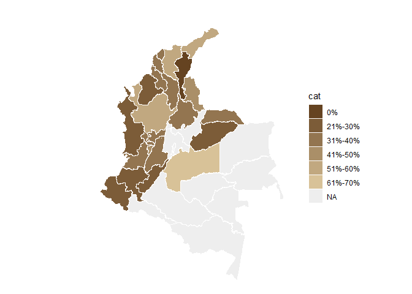<!-- -->

``` r
# weighted
nal_q18_weight<- inner_join(question_18, experience_of_each_expert)
```

    ## Joining with `by = join_by(crop, expert_ID, expert_in)`

``` r
nal_q18_weight<- nal_q18_weight %>%
  group_by(expert_in) %>%
  mutate(numeric_answer=as.numeric(numeric_answer)) %>%
  summarise(average_weighted= weighted.mean(numeric_answer, weights)) %>% 
  group_by(average_weighted) %>%
  mutate(cat_weighted= category_by_mean_by_question(language = "en", mean = average_weighted, question =18)) %>%
  rename(EKE.expert.in=expert_in)
```

    ## Warning: There was 1 warning in `mutate()`.
    ## ℹ In argument: `cat_weighted = category_by_mean_by_question(...)`.
    ## ℹ In group 0: .
    ## Caused by warning:
    ## ! There was 1 warning in `filter()`.
    ## ℹ In argument: `number == question & number_to_category == mean`.
    ## Caused by warning in `number_to_category == mean`:
    ## ! longer object length is not a multiple of shorter object length

``` r
nal_q18_weight<- full_join(codes_department, nal_q18_weight)
```

    ## Joining with `by = join_by(EKE.expert.in)`

``` r
nal_q18_weight$cat_weighted<- factor(nal_q18_weight$cat_weighted, levels = level_18)
colmap(departamentos, data = nal_q18_weight, data_id = "id_depto", var = "cat_weighted")+
  scale_fill_manual(values = palette_soil(length(unique(nal_q18_weight$cat))-1), na.value = "#eeeeee")
```

    ## Scale for fill is already present.
    ## Adding another scale for fill, which will replace the existing scale.

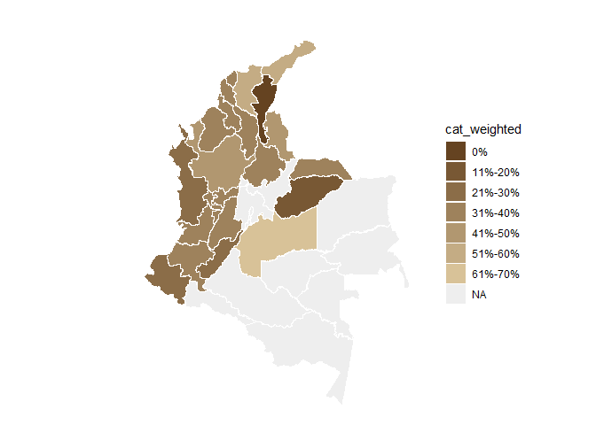<!-- -->

## Question 19: What percentage of physical control practices (traps, barriers) are implemented correctly in banana production systems in the areas where you are an expert?

``` r
#selecting only question 19----
question_19<- filter(individual_surveys, question_number==19)
#unique(question_19$numeric_answer)
#dput(unique(question_19$answer_in_english))
#organizing the order of the levels
level_19<- c("0%", "1%-10%", "11%-20%", "21%-30%", "31%-40%", "41%-50%","51%-60%", "61%-70%", "71%-80%", "81%-90%", "91%-100%", "Not Sure")
question_19$answer_in_english<- factor(question_19$answer_in_english,levels = level_19)
question_19<- filter(question_19, answer_in_english!="Not Sure")
#average by department (weighted and no weighted)
#not weighted 
avg_dept_no_weight_19<- question_19 %>%
  group_by(crop, expert_in) %>%
  mutate(numeric_answer=as.numeric(numeric_answer))%>%
  mutate(average= mean(numeric_answer)) %>%
  group_by(average)%>%
  mutate(ave_cat= category_by_mean_by_question(19, mean =average, language = "en"))
```

    ## Warning: There were 7 warnings in `mutate()`.
    ## The first warning was:
    ## ℹ In argument: `ave_cat = category_by_mean_by_question(19, mean = average,
    ##   language = "en")`.
    ## ℹ In group 0: .
    ## Caused by warning:
    ## ! There was 1 warning in `filter()`.
    ## ℹ In argument: `number == question & number_to_category == mean`.
    ## Caused by warning in `number_to_category == mean`:
    ## ! longer object length is not a multiple of shorter object length
    ## ℹ Run `dplyr::last_dplyr_warnings()` to see the 6 remaining warnings.

``` r
#weighted 
add_weights_question_19<- inner_join(question_19, experience_of_each_expert)
```

    ## Joining with `by = join_by(crop, expert_ID, expert_in)`

``` r
avg_dept_weight_19<- add_weights_question_19 %>%
  group_by(crop, expert_in) %>%
  mutate(numeric_answer=as.numeric(numeric_answer))%>%
  mutate(average_weighted= weighted.mean(numeric_answer, weights)) %>% 
  group_by(average_weighted)%>%
  mutate(ave_cat_weighted= category_by_mean_by_question(19, mean =average_weighted, language = "en"))
```

    ## Warning: There were 7 warnings in `mutate()`.
    ## The first warning was:
    ## ℹ In argument: `ave_cat_weighted = category_by_mean_by_question(19, mean =
    ##   average_weighted, language = "en")`.
    ## ℹ In group 0: .
    ## Caused by warning:
    ## ! There was 1 warning in `filter()`.
    ## ℹ In argument: `number == question & number_to_category == mean`.
    ## Caused by warning in `number_to_category == mean`:
    ## ! longer object length is not a multiple of shorter object length
    ## ℹ Run `dplyr::last_dplyr_warnings()` to see the 6 remaining warnings.

``` r
#finding the levels per crop (banana and plantain) no weighted
levels_per_crop_Q19_no_weighted<- tapply(avg_dept_no_weight_19$ave_cat, avg_dept_no_weight_19$crop, function(x){(unique(x))})
#generating a ramp palette according to the number of levels per crop
colors_banana_question19_no_weighted<- palette_banana(length(levels_per_crop_Q19_no_weighted$Banana))
colors_plantain_question19_no_weighted<- palette_plantain(length(levels_per_crop_Q19_no_weighted$Plantain))
#Assigning the colors by crop and answer
# Define the knowledge levels for each crop
levels_by_crop_no_weighted_19 <- list(
  Banana = levels_per_crop_Q19_no_weighted$Banana,
  Plantain = levels_per_crop_Q19_no_weighted$Plantain
)
# Define the colors for each crop
colors_by_crop_no_weighted_19 <- list(
  Banana = colors_banana_question19_no_weighted, # Replace with actual color vector for Banana
  Plantain = colors_plantain_question19_no_weighted # Replace with actual color vector for Plantain
  # Add more crops and their color vectors here if needed
)
# Now call the function
avg_dept_no_weight_19 <- assign_group_color(data = avg_dept_no_weight_19, levels_by_crop = levels_by_crop_no_weighted_19, colors_by_crop = colors_by_crop_no_weighted_19,answer_col =  "ave_cat")

#finding the levels per crop (banana and plantain) weighted
levels_per_crop_Q19_weighted<- tapply(avg_dept_weight_19$ave_cat_weighted, avg_dept_weight_19$crop, function(x){(unique(x))})
#generating a ramp palette according to the number of levels per crop
colors_banana_question19_weighted<- palette_banana(length(levels_per_crop_Q19_weighted$Banana))
colors_plantain_question19_weighted<- palette_plantain(length(levels_per_crop_Q19_weighted$Plantain))
#Assigning the colors by crop and answer
# Define the knowledge levels for each crop
levels_by_crop_weighted_19 <- list(
  Banana = levels_per_crop_Q19_weighted$Banana,
  Plantain = levels_per_crop_Q19_weighted$Plantain
)
# Define the colors for each crop
colors_by_crop_weighted_19 <- list(
  Banana = colors_banana_question19_weighted, # Replace with actual color vector for Banana
  Plantain = colors_plantain_question19_weighted # Replace with actual color vector for Plantain
  # Add more crops and their color vectors here if needed
)
# Now call the function
avg_dept_weight_19 <- assign_group_color(data = avg_dept_weight_19, levels_by_crop = levels_by_crop_weighted_19, colors_by_crop = colors_by_crop_weighted_19,answer_col =  "ave_cat_weighted")

#tree map
tree_map_3(data = avg_dept_no_weight_19, "crop", "expert_in", "ave_cat", "group_color", title="No weighted")
```

    ## `summarise()` has grouped output by 'crop', 'expert_in', 'ave_cat'. You can
    ## override using the `.groups` argument.

<!-- -->

    ## $tm
    ##        crop          expert_in ave_cat vSize  vColor stdErr vColorValue level
    ## 1    Banana          Antioquia 41%-50%    11 #FFE033     11          NA     3
    ## 2    Banana          Antioquia    <NA>    11 #FFE033     11          NA     2
    ## 3    Banana             Caldas      0%     1 #FFF2CC      1          NA     3
    ## 4    Banana             Caldas    <NA>     1 #FFF2CC      1          NA     2
    ## 5    Banana              Cesar 31%-40%     1 #FFE566      1          NA     3
    ## 6    Banana              Cesar    <NA>     1 #FFE566      1          NA     2
    ## 7    Banana              Chocó 11%-20%     2 #FFEB99      2          NA     3
    ## 8    Banana              Chocó    <NA>     2 #FFEB99      2          NA     2
    ## 9    Banana            Córdoba      0%     1 #FFF2CC      1          NA     3
    ## 10   Banana            Córdoba    <NA>     1 #FFF2CC      1          NA     2
    ## 11   Banana              Huila      0%     1 #FFF2CC      1          NA     3
    ## 12   Banana              Huila    <NA>     1 #FFF2CC      1          NA     2
    ## 13   Banana         La Guajira 51%-60%    10 #FFDA00     10          NA     3
    ## 14   Banana         La Guajira    <NA>    10 #FFDA00     10          NA     2
    ## 15   Banana          Magdalena 41%-50%    13 #FFE033     13          NA     3
    ## 16   Banana          Magdalena    <NA>    13 #FFE033     13          NA     2
    ## 17   Banana               <NA>    <NA>    42 #FFF2CC     42          NA     1
    ## 18   Banana            Quindío      0%     1 #FFF2CC      1          NA     3
    ## 19   Banana            Quindío    <NA>     1 #FFF2CC      1          NA     2
    ## 20   Banana          Risaralda      0%     1 #FFF2CC      1          NA     3
    ## 21   Banana          Risaralda    <NA>     1 #FFF2CC      1          NA     2
    ## 22 Plantain          Antioquia 61%-70%     2 #28B463      2          NA     3
    ## 23 Plantain          Antioquia    <NA>     2 #28B463      2          NA     2
    ## 24 Plantain             Arauca  1%-10%     2 #A0E7AB      2          NA     3
    ## 25 Plantain             Arauca    <NA>     2 #A0E7AB      2          NA     2
    ## 26 Plantain          Atlántico      0%     1 #BEF4BE      1          NA     3
    ## 27 Plantain          Atlántico    <NA>     1 #BEF4BE      1          NA     2
    ## 28 Plantain            Bolívar      0%     1 #BEF4BE      1          NA     3
    ## 29 Plantain            Bolívar    <NA>     1 #BEF4BE      1          NA     2
    ## 30 Plantain             Caldas 31%-40%     7 #64CD87      7          NA     3
    ## 31 Plantain             Caldas    <NA>     7 #64CD87      7          NA     2
    ## 32 Plantain           Casanare      0%     2 #BEF4BE      2          NA     3
    ## 33 Plantain           Casanare    <NA>     2 #BEF4BE      2          NA     2
    ## 34 Plantain            Córdoba      0%     1 #BEF4BE      1          NA     3
    ## 35 Plantain            Córdoba    <NA>     1 #BEF4BE      1          NA     2
    ## 36 Plantain              Huila      0%     1 #BEF4BE      1          NA     3
    ## 37 Plantain              Huila    <NA>     1 #BEF4BE      1          NA     2
    ## 38 Plantain         La Guajira 11%-20%     4 #46C075      4          NA     3
    ## 39 Plantain         La Guajira    <NA>     4 #46C075      4          NA     2
    ## 40 Plantain          Magdalena 21%-30%     3 #82DA99      3          NA     3
    ## 41 Plantain          Magdalena    <NA>     3 #82DA99      3          NA     2
    ## 42 Plantain               Meta 21%-30%    10 #82DA99     10          NA     3
    ## 43 Plantain               Meta    <NA>    10 #82DA99     10          NA     2
    ## 44 Plantain               <NA>    <NA>    52 #BEF4BE     52          NA     1
    ## 45 Plantain Norte De Santander      0%     1 #BEF4BE      1          NA     3
    ## 46 Plantain Norte De Santander    <NA>     1 #BEF4BE      1          NA     2
    ## 47 Plantain            Quindío 31%-40%     5 #64CD87      5          NA     3
    ## 48 Plantain            Quindío    <NA>     5 #64CD87      5          NA     2
    ## 49 Plantain          Risaralda 31%-40%     9 #64CD87      9          NA     3
    ## 50 Plantain          Risaralda    <NA>     9 #64CD87      9          NA     2
    ## 51 Plantain          Santander      0%     1 #BEF4BE      1          NA     3
    ## 52 Plantain          Santander    <NA>     1 #BEF4BE      1          NA     2
    ## 53 Plantain              Sucre      0%     1 #BEF4BE      1          NA     3
    ## 54 Plantain              Sucre    <NA>     1 #BEF4BE      1          NA     2
    ## 55 Plantain             Tolima      0%     1 #BEF4BE      1          NA     3
    ## 56 Plantain             Tolima    <NA>     1 #BEF4BE      1          NA     2
    ##           x0         y0          w          h   color
    ## 1  0.7952128 0.42857143 0.20478723 0.57142857 #FFE033
    ## 2  0.7952128 0.42857143 0.20478723 0.57142857 #FFE033
    ## 3  0.9338061 0.26785714 0.06619385 0.16071429 #FFF2CC
    ## 4  0.9338061 0.26785714 0.06619385 0.16071429 #FFF2CC
    ## 5  0.8014184 0.13392857 0.07943262 0.13392857 #FFE566
    ## 6  0.8014184 0.13392857 0.07943262 0.13392857 #FFE566
    ## 7  0.8014184 0.26785714 0.13238771 0.16071429 #FFEB99
    ## 8  0.8014184 0.26785714 0.13238771 0.16071429 #FFEB99
    ## 9  0.8014184 0.00000000 0.07943262 0.13392857 #FFF2CC
    ## 10 0.8014184 0.00000000 0.07943262 0.13392857 #FFF2CC
    ## 11 0.8808511 0.17857143 0.11914894 0.08928571 #FFF2CC
    ## 12 0.8808511 0.17857143 0.11914894 0.08928571 #FFF2CC
    ## 13 0.5531915 0.00000000 0.24822695 0.42857143 #FFDA00
    ## 14 0.5531915 0.00000000 0.24822695 0.42857143 #FFDA00
    ## 15 0.5531915 0.42857143 0.24202128 0.57142857 #FFE033
    ## 16 0.5531915 0.42857143 0.24202128 0.57142857 #FFE033
    ## 17 0.5531915 0.00000000 0.44680851 1.00000000 #FFF2CC
    ## 18 0.8808511 0.08928571 0.11914894 0.08928571 #FFF2CC
    ## 19 0.8808511 0.08928571 0.11914894 0.08928571 #FFF2CC
    ## 20 0.8808511 0.00000000 0.11914894 0.08928571 #FFF2CC
    ## 21 0.8808511 0.00000000 0.11914894 0.08928571 #FFF2CC
    ## 22 0.4749624 0.36263736 0.07822910 0.27197802 #28B463
    ## 23 0.4749624 0.36263736 0.07822910 0.27197802 #28B463
    ## 24 0.2011605 0.18131868 0.11734365 0.18131868 #A0E7AB
    ## 25 0.2011605 0.18131868 0.11734365 0.18131868 #A0E7AB
    ## 26 0.3185042 0.22664835 0.07822910 0.13598901 #BEF4BE
    ## 27 0.3185042 0.22664835 0.07822910 0.13598901 #BEF4BE
    ## 28 0.3967333 0.22664835 0.07822910 0.13598901 #BEF4BE
    ## 29 0.3967333 0.22664835 0.07822910 0.13598901 #BEF4BE
    ## 30 0.0000000 0.26442308 0.20116054 0.37019231 #64CD87
    ## 31 0.0000000 0.26442308 0.20116054 0.37019231 #64CD87
    ## 32 0.2011605 0.00000000 0.11734365 0.18131868 #BEF4BE
    ## 33 0.2011605 0.00000000 0.11734365 0.18131868 #BEF4BE
    ## 34 0.4749624 0.22664835 0.07822910 0.13598901 #BEF4BE
    ## 35 0.4749624 0.22664835 0.07822910 0.13598901 #BEF4BE
    ## 36 0.3185042 0.11332418 0.09387492 0.11332418 #BEF4BE
    ## 37 0.3185042 0.11332418 0.09387492 0.11332418 #BEF4BE
    ## 38 0.2011605 0.36263736 0.15645820 0.27197802 #46C075
    ## 39 0.2011605 0.36263736 0.15645820 0.27197802 #46C075
    ## 40 0.3576187 0.36263736 0.11734365 0.27197802 #82DA99
    ## 41 0.3576187 0.36263736 0.11734365 0.27197802 #82DA99
    ## 42 0.0000000 0.63461538 0.29115342 0.36538462 #82DA99
    ## 43 0.0000000 0.63461538 0.29115342 0.36538462 #82DA99
    ## 44 0.0000000 0.00000000 0.55319149 1.00000000 #BEF4BE
    ## 45 0.3185042 0.00000000 0.09387492 0.11332418 #BEF4BE
    ## 46 0.3185042 0.00000000 0.09387492 0.11332418 #BEF4BE
    ## 47 0.0000000 0.00000000 0.20116054 0.26442308 #64CD87
    ## 48 0.0000000 0.00000000 0.20116054 0.26442308 #64CD87
    ## 49 0.2911534 0.63461538 0.26203807 0.36538462 #64CD87
    ## 50 0.2911534 0.63461538 0.26203807 0.36538462 #64CD87
    ## 51 0.4123791 0.07554945 0.07040619 0.15109890 #BEF4BE
    ## 52 0.4123791 0.07554945 0.07040619 0.15109890 #BEF4BE
    ## 53 0.4827853 0.07554945 0.07040619 0.15109890 #BEF4BE
    ## 54 0.4827853 0.07554945 0.07040619 0.15109890 #BEF4BE
    ## 55 0.4123791 0.00000000 0.14081238 0.07554945 #BEF4BE
    ## 56 0.4123791 0.00000000 0.14081238 0.07554945 #BEF4BE
    ## 
    ## $type
    ## [1] "color"
    ## 
    ## $vSize
    ## [1] "frequency"
    ## 
    ## $vColor
    ## [1] "group_color"
    ## 
    ## $stdErr
    ## [1] "frequency"
    ## 
    ## $algorithm
    ## [1] "pivotSize"
    ## 
    ## $vpCoorX
    ## [1] 0.02812148 0.97187852
    ## 
    ## $vpCoorY
    ## [1] 0.01968504 0.91031496
    ## 
    ## $aspRatio
    ## [1] 1.483512
    ## 
    ## $range
    ## [1] NA NA
    ## 
    ## $mapping
    ## [1] NA NA NA
    ## 
    ## $draw
    ## [1] TRUE

``` r
tree_map_3(data = avg_dept_weight_19, "crop", "expert_in", "ave_cat_weighted", "group_color", title="weighted")
```

    ## `summarise()` has grouped output by 'crop', 'expert_in', 'ave_cat_weighted'.
    ## You can override using the `.groups` argument.

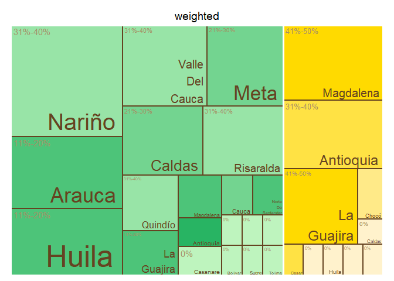<!-- -->

    ## $tm
    ##        crop          expert_in ave_cat_weighted vSize  vColor stdErr
    ## 1    Banana          Antioquia          31%-40%    11 #FFE244     11
    ## 2    Banana          Antioquia             <NA>    11 #FFE244     11
    ## 3    Banana             Caldas               0%     1 #FFF2CC      1
    ## 4    Banana             Caldas             <NA>     1 #FFF2CC      1
    ## 5    Banana              Cesar          31%-40%     1 #FFE244      1
    ## 6    Banana              Cesar             <NA>     1 #FFE244      1
    ## 7    Banana              Chocó          11%-20%     2 #FFEA88      2
    ## 8    Banana              Chocó             <NA>     2 #FFEA88      2
    ## 9    Banana            Córdoba               0%     1 #FFF2CC      1
    ## 10   Banana            Córdoba             <NA>     1 #FFF2CC      1
    ## 11   Banana              Huila               0%     1 #FFF2CC      1
    ## 12   Banana              Huila             <NA>     1 #FFF2CC      1
    ## 13   Banana         La Guajira          41%-50%     9 #FFDA00      9
    ## 14   Banana         La Guajira             <NA>     9 #FFDA00      9
    ## 15   Banana          Magdalena          41%-50%    12 #FFDA00     12
    ## 16   Banana          Magdalena             <NA>    12 #FFDA00     12
    ## 17   Banana               <NA>             <NA>    40 #FFF2CC     40
    ## 18   Banana            Quindío               0%     1 #FFF2CC      1
    ## 19   Banana            Quindío             <NA>     1 #FFF2CC      1
    ## 20   Banana          Risaralda               0%     1 #FFF2CC      1
    ## 21   Banana          Risaralda             <NA>     1 #FFF2CC      1
    ## 22 Plantain          Antioquia          61%-70%     2 #28B463      2
    ## 23 Plantain          Antioquia             <NA>     2 #28B463      2
    ## 24 Plantain             Arauca           1%-10%     2 #A0E7AB      2
    ## 25 Plantain             Arauca             <NA>     2 #A0E7AB      2
    ## 26 Plantain          Atlántico               0%     1 #BEF4BE      1
    ## 27 Plantain          Atlántico             <NA>     1 #BEF4BE      1
    ## 28 Plantain            Bolívar               0%     1 #BEF4BE      1
    ## 29 Plantain            Bolívar             <NA>     1 #BEF4BE      1
    ## 30 Plantain             Caldas          31%-40%     7 #64CD87      7
    ## 31 Plantain             Caldas             <NA>     7 #64CD87      7
    ## 32 Plantain           Casanare               0%     2 #BEF4BE      2
    ## 33 Plantain           Casanare             <NA>     2 #BEF4BE      2
    ## 34 Plantain            Córdoba               0%     1 #BEF4BE      1
    ## 35 Plantain            Córdoba             <NA>     1 #BEF4BE      1
    ## 36 Plantain              Huila               0%     1 #BEF4BE      1
    ## 37 Plantain              Huila             <NA>     1 #BEF4BE      1
    ## 38 Plantain         La Guajira          11%-20%     4 #46C075      4
    ## 39 Plantain         La Guajira             <NA>     4 #46C075      4
    ## 40 Plantain          Magdalena          11%-20%     3 #46C075      3
    ## 41 Plantain          Magdalena             <NA>     3 #46C075      3
    ## 42 Plantain               Meta          21%-30%    10 #82DA99     10
    ## 43 Plantain               Meta             <NA>    10 #82DA99     10
    ## 44 Plantain               <NA>             <NA>    52 #BEF4BE     52
    ## 45 Plantain Norte De Santander               0%     1 #BEF4BE      1
    ## 46 Plantain Norte De Santander             <NA>     1 #BEF4BE      1
    ## 47 Plantain            Quindío          31%-40%     5 #64CD87      5
    ## 48 Plantain            Quindío             <NA>     5 #64CD87      5
    ## 49 Plantain          Risaralda          31%-40%     9 #64CD87      9
    ## 50 Plantain          Risaralda             <NA>     9 #64CD87      9
    ## 51 Plantain          Santander               0%     1 #BEF4BE      1
    ## 52 Plantain          Santander             <NA>     1 #BEF4BE      1
    ## 53 Plantain              Sucre               0%     1 #BEF4BE      1
    ## 54 Plantain              Sucre             <NA>     1 #BEF4BE      1
    ## 55 Plantain             Tolima               0%     1 #BEF4BE      1
    ## 56 Plantain             Tolima             <NA>     1 #BEF4BE      1
    ##    vColorValue level        x0         y0          w          h   color
    ## 1           NA     3 0.7920605 0.42500000 0.20793951 0.57500000 #FFE244
    ## 2           NA     2 0.7920605 0.42500000 0.20793951 0.57500000 #FFE244
    ## 3           NA     3 0.8465473 0.28333333 0.07672634 0.14166667 #FFF2CC
    ## 4           NA     2 0.8465473 0.28333333 0.07672634 0.14166667 #FFF2CC
    ## 5           NA     3 0.9232737 0.28333333 0.07672634 0.14166667 #FFE244
    ## 6           NA     2 0.9232737 0.28333333 0.07672634 0.14166667 #FFE244
    ## 7           NA     3 0.5652174 0.00000000 0.28132992 0.07727273 #FFEA88
    ## 8           NA     2 0.5652174 0.00000000 0.28132992 0.07727273 #FFEA88
    ## 9           NA     3 0.8465473 0.14166667 0.07672634 0.14166667 #FFF2CC
    ## 10          NA     2 0.8465473 0.14166667 0.07672634 0.14166667 #FFF2CC
    ## 11          NA     3 0.9232737 0.14166667 0.07672634 0.14166667 #FFF2CC
    ## 12          NA     2 0.9232737 0.14166667 0.07672634 0.14166667 #FFF2CC
    ## 13          NA     3 0.5652174 0.07727273 0.28132992 0.34772727 #FFDA00
    ## 14          NA     2 0.5652174 0.07727273 0.28132992 0.34772727 #FFDA00
    ## 15          NA     3 0.5652174 0.42500000 0.22684310 0.57500000 #FFDA00
    ## 16          NA     2 0.5652174 0.42500000 0.22684310 0.57500000 #FFDA00
    ## 17          NA     1 0.5652174 0.00000000 0.43478261 1.00000000 #FFF2CC
    ## 18          NA     3 0.8465473 0.00000000 0.07672634 0.14166667 #FFF2CC
    ## 19          NA     2 0.8465473 0.00000000 0.07672634 0.14166667 #FFF2CC
    ## 20          NA     3 0.9232737 0.00000000 0.07672634 0.14166667 #FFF2CC
    ## 21          NA     2 0.9232737 0.00000000 0.07672634 0.14166667 #FFF2CC
    ## 22          NA     3 0.4852877 0.36263736 0.07992973 0.27197802 #28B463
    ## 23          NA     2 0.4852877 0.36263736 0.07992973 0.27197802 #28B463
    ## 24          NA     3 0.2055336 0.18131868 0.11989460 0.18131868 #A0E7AB
    ## 25          NA     2 0.2055336 0.18131868 0.11989460 0.18131868 #A0E7AB
    ## 26          NA     3 0.3254282 0.22664835 0.07992973 0.13598901 #BEF4BE
    ## 27          NA     2 0.3254282 0.22664835 0.07992973 0.13598901 #BEF4BE
    ## 28          NA     3 0.4053579 0.22664835 0.07992973 0.13598901 #BEF4BE
    ## 29          NA     2 0.4053579 0.22664835 0.07992973 0.13598901 #BEF4BE
    ## 30          NA     3 0.0000000 0.26442308 0.20553360 0.37019231 #64CD87
    ## 31          NA     2 0.0000000 0.26442308 0.20553360 0.37019231 #64CD87
    ## 32          NA     3 0.2055336 0.00000000 0.11989460 0.18131868 #BEF4BE
    ## 33          NA     2 0.2055336 0.00000000 0.11989460 0.18131868 #BEF4BE
    ## 34          NA     3 0.4852877 0.22664835 0.07992973 0.13598901 #BEF4BE
    ## 35          NA     2 0.4852877 0.22664835 0.07992973 0.13598901 #BEF4BE
    ## 36          NA     3 0.3254282 0.11332418 0.09591568 0.11332418 #BEF4BE
    ## 37          NA     2 0.3254282 0.11332418 0.09591568 0.11332418 #BEF4BE
    ## 38          NA     3 0.2055336 0.36263736 0.15985946 0.27197802 #46C075
    ## 39          NA     2 0.2055336 0.36263736 0.15985946 0.27197802 #46C075
    ## 40          NA     3 0.3653931 0.36263736 0.11989460 0.27197802 #46C075
    ## 41          NA     2 0.3653931 0.36263736 0.11989460 0.27197802 #46C075
    ## 42          NA     3 0.0000000 0.63461538 0.29748284 0.36538462 #82DA99
    ## 43          NA     2 0.0000000 0.63461538 0.29748284 0.36538462 #82DA99
    ## 44          NA     1 0.0000000 0.00000000 0.56521739 1.00000000 #BEF4BE
    ## 45          NA     3 0.3254282 0.00000000 0.09591568 0.11332418 #BEF4BE
    ## 46          NA     2 0.3254282 0.00000000 0.09591568 0.11332418 #BEF4BE
    ## 47          NA     3 0.0000000 0.00000000 0.20553360 0.26442308 #64CD87
    ## 48          NA     2 0.0000000 0.00000000 0.20553360 0.26442308 #64CD87
    ## 49          NA     3 0.2974828 0.63461538 0.26773455 0.36538462 #64CD87
    ## 50          NA     2 0.2974828 0.63461538 0.26773455 0.36538462 #64CD87
    ## 51          NA     3 0.4213439 0.07554945 0.07193676 0.15109890 #BEF4BE
    ## 52          NA     2 0.4213439 0.07554945 0.07193676 0.15109890 #BEF4BE
    ## 53          NA     3 0.4932806 0.07554945 0.07193676 0.15109890 #BEF4BE
    ## 54          NA     2 0.4932806 0.07554945 0.07193676 0.15109890 #BEF4BE
    ## 55          NA     3 0.4213439 0.00000000 0.14387352 0.07554945 #BEF4BE
    ## 56          NA     2 0.4213439 0.00000000 0.14387352 0.07554945 #BEF4BE
    ## 
    ## $type
    ## [1] "color"
    ## 
    ## $vSize
    ## [1] "frequency"
    ## 
    ## $vColor
    ## [1] "group_color"
    ## 
    ## $stdErr
    ## [1] "frequency"
    ## 
    ## $algorithm
    ## [1] "pivotSize"
    ## 
    ## $vpCoorX
    ## [1] 0.02812148 0.97187852
    ## 
    ## $vpCoorY
    ## [1] 0.01968504 0.91031496
    ## 
    ## $aspRatio
    ## [1] 1.483512
    ## 
    ## $range
    ## [1] NA NA
    ## 
    ## $mapping
    ## [1] NA NA NA
    ## 
    ## $draw
    ## [1] TRUE

``` r
#Map of Colombia  
#non weighted
nal_q19_no_weight<- question_19 %>% group_by(expert_in) %>%
  summarise(average= mean(as.numeric(numeric_answer))) %>%
  group_by(average) %>% 
  mutate(cat= category_by_mean_by_question(language = "en", mean = average, question =19))%>%
  rename(EKE.expert.in = expert_in)
```

    ## Warning: There was 1 warning in `mutate()`.
    ## ℹ In argument: `cat = category_by_mean_by_question(...)`.
    ## ℹ In group 0: .
    ## Caused by warning:
    ## ! There was 1 warning in `filter()`.
    ## ℹ In argument: `number == question & number_to_category == mean`.
    ## Caused by warning in `number_to_category == mean`:
    ## ! longer object length is not a multiple of shorter object length

``` r
nal_q19_no_weight<- full_join(codes_department, nal_q19_no_weight)
```

    ## Joining with `by = join_by(EKE.expert.in)`

``` r
nal_q19_no_weight$cat<- factor(nal_q19_no_weight$cat, levels = level_19)
colmap(departamentos, data = nal_q19_no_weight, data_id = "id_depto", var = "cat")+
  scale_fill_manual(values = palette_soil(length(unique(nal_q19_no_weight$cat))-1), na.value = "#eeeeee")
```

    ## Scale for fill is already present.
    ## Adding another scale for fill, which will replace the existing scale.

<!-- -->

``` r
# weighted
nal_q19_weight<- inner_join(question_19, experience_of_each_expert)
```

    ## Joining with `by = join_by(crop, expert_ID, expert_in)`

``` r
nal_q19_weight<- nal_q19_weight %>%
  group_by(expert_in) %>%
  mutate(numeric_answer=as.numeric(numeric_answer)) %>%
  summarise(average_weighted= weighted.mean(numeric_answer, weights)) %>% 
  group_by(average_weighted) %>%
  mutate(cat_weighted= category_by_mean_by_question(language = "en", mean = average_weighted, question =19)) %>%
  rename(EKE.expert.in=expert_in)
```

    ## Warning: There was 1 warning in `mutate()`.
    ## ℹ In argument: `cat_weighted = category_by_mean_by_question(...)`.
    ## ℹ In group 0: .
    ## Caused by warning:
    ## ! There was 1 warning in `filter()`.
    ## ℹ In argument: `number == question & number_to_category == mean`.
    ## Caused by warning in `number_to_category == mean`:
    ## ! longer object length is not a multiple of shorter object length

``` r
nal_q19_weight<- full_join(codes_department, nal_q19_weight)
```

    ## Joining with `by = join_by(EKE.expert.in)`

``` r
nal_q19_weight$cat_weighted<- factor(nal_q19_weight$cat_weighted, levels = level_19)
colmap(departamentos, data = nal_q19_weight, data_id = "id_depto", var = "cat_weighted")+
  scale_fill_manual(values = palette_soil(length(unique(nal_q19_weight$cat))-1), na.value = "#eeeeee")
```

    ## Scale for fill is already present.
    ## Adding another scale for fill, which will replace the existing scale.

<!-- -->

## Question 20: What percentage of biosecurity management practices (quarantine, disinfection) are implemented correctly in banana production systems in the areas where you are an expert?

``` r
#selecting only question 20----
question_20<- filter(individual_surveys, question_number==20)
#unique(question_20$numeric_answer)
#dput(unique(question_20$answer_in_english))
#organizing the order of the levels
level_20<- c("0%", "1%-10%", "11%-20%", "21%-30%", "31%-40%", "41%-50%","51%-60%", "61%-70%", "71%-80%", "81%-90%", "91%-100%", "Not Sure")
question_20$answer_in_english<- factor(question_20$answer_in_english,levels = level_20)
question_20<- filter(question_20, answer_in_english!="Not Sure")
#average by department (weighted and no weighted)
#not weighted 
avg_dept_no_weight_20<- question_20 %>%
  group_by(crop, expert_in) %>%
  mutate(numeric_answer=as.numeric(numeric_answer))%>%
  mutate(average= mean(numeric_answer)) %>%
  group_by(average)%>%
  mutate(ave_cat= category_by_mean_by_question(20, mean =average, language = "en"))
```

    ## Warning: There were 7 warnings in `mutate()`.
    ## The first warning was:
    ## ℹ In argument: `ave_cat = category_by_mean_by_question(20, mean = average,
    ##   language = "en")`.
    ## ℹ In group 0: .
    ## Caused by warning:
    ## ! There was 1 warning in `filter()`.
    ## ℹ In argument: `number == question & number_to_category == mean`.
    ## Caused by warning in `number_to_category == mean`:
    ## ! longer object length is not a multiple of shorter object length
    ## ℹ Run `dplyr::last_dplyr_warnings()` to see the 6 remaining warnings.

``` r
#weighted 
add_weights_question_20<- inner_join(question_20, experience_of_each_expert)
```

    ## Joining with `by = join_by(crop, expert_ID, expert_in)`

``` r
avg_dept_weight_20<- add_weights_question_20 %>%
  group_by(crop, expert_in) %>%
  mutate(numeric_answer=as.numeric(numeric_answer))%>%
  mutate(average_weighted= weighted.mean(numeric_answer, weights)) %>% 
  group_by(average_weighted)%>%
  mutate(ave_cat_weighted= category_by_mean_by_question(20, mean =average_weighted, language = "en"))
```

    ## Warning: There were 6 warnings in `mutate()`.
    ## The first warning was:
    ## ℹ In argument: `ave_cat_weighted = category_by_mean_by_question(20, mean =
    ##   average_weighted, language = "en")`.
    ## ℹ In group 0: .
    ## Caused by warning:
    ## ! There was 1 warning in `filter()`.
    ## ℹ In argument: `number == question & number_to_category == mean`.
    ## Caused by warning in `number_to_category == mean`:
    ## ! longer object length is not a multiple of shorter object length
    ## ℹ Run `dplyr::last_dplyr_warnings()` to see the 5 remaining warnings.

``` r
#finding the levels per crop (banana and plantain) no weighted
levels_per_crop_Q20_no_weighted<- tapply(avg_dept_no_weight_20$ave_cat, avg_dept_no_weight_20$crop, function(x){(unique(x))})
#generating a ramp palette according to the number of levels per crop
colors_banana_question20_no_weighted<- palette_banana(length(levels_per_crop_Q20_no_weighted$Banana))
colors_plantain_question20_no_weighted<- palette_plantain(length(levels_per_crop_Q20_no_weighted$Plantain))
#Assigning the colors by crop and answer
# Define the knowledge levels for each crop
levels_by_crop_no_weighted_20 <- list(
  Banana = levels_per_crop_Q20_no_weighted$Banana,
  Plantain = levels_per_crop_Q20_no_weighted$Plantain
)
# Define the colors for each crop
colors_by_crop_no_weighted_20 <- list(
  Banana = colors_banana_question20_no_weighted, # Replace with actual color vector for Banana
  Plantain = colors_plantain_question20_no_weighted # Replace with actual color vector for Plantain
  # Add more crops and their color vectors here if needed
)
# Now call the function
avg_dept_no_weight_20 <- assign_group_color(data = avg_dept_no_weight_20, levels_by_crop = levels_by_crop_no_weighted_20, colors_by_crop = colors_by_crop_no_weighted_20,answer_col =  "ave_cat")

#finding the levels per crop (banana and plantain) weighted
levels_per_crop_Q20_weighted<- tapply(avg_dept_weight_20$ave_cat_weighted, avg_dept_weight_20$crop, function(x){(unique(x))})
#generating a ramp palette according to the number of levels per crop
colors_banana_question20_weighted<- palette_banana(length(levels_per_crop_Q20_weighted$Banana))
colors_plantain_question20_weighted<- palette_plantain(length(levels_per_crop_Q20_weighted$Plantain))
#Assigning the colors by crop and answer
# Define the knowledge levels for each crop
levels_by_crop_weighted_20 <- list(
  Banana = levels_per_crop_Q20_weighted$Banana,
  Plantain = levels_per_crop_Q20_weighted$Plantain
)
# Define the colors for each crop
colors_by_crop_weighted_20 <- list(
  Banana = colors_banana_question20_weighted, # Replace with actual color vector for Banana
  Plantain = colors_plantain_question20_weighted # Replace with actual color vector for Plantain
  # Add more crops and their color vectors here if needed
)
# Now call the function
avg_dept_weight_20 <- assign_group_color(data = avg_dept_weight_20, levels_by_crop = levels_by_crop_weighted_20, colors_by_crop = colors_by_crop_weighted_20,answer_col =  "ave_cat_weighted")

#tree map
tree_map_3(data = avg_dept_no_weight_20, "crop", "expert_in", "ave_cat", "group_color", title="No weighted")
```

    ## `summarise()` has grouped output by 'crop', 'expert_in', 'ave_cat'. You can
    ## override using the `.groups` argument.

<!-- -->

    ## $tm
    ##        crop          expert_in ave_cat vSize  vColor stdErr vColorValue level
    ## 1    Banana          Antioquia 51%-60%    11 #FFE566     11          NA     3
    ## 2    Banana          Antioquia    <NA>    11 #FFE566     11          NA     2
    ## 3    Banana             Caldas  1%-10%     1 #FFEB99      1          NA     3
    ## 4    Banana             Caldas    <NA>     1 #FFEB99      1          NA     2
    ## 5    Banana              Cesar 61%-70%     2 #FFE033      2          NA     3
    ## 6    Banana              Cesar    <NA>     2 #FFE033      2          NA     2
    ## 7    Banana              Chocó  1%-10%     2 #FFEB99      2          NA     3
    ## 8    Banana              Chocó    <NA>     2 #FFEB99      2          NA     2
    ## 9    Banana            Córdoba      0%     1 #FFF2CC      1          NA     3
    ## 10   Banana            Córdoba    <NA>     1 #FFF2CC      1          NA     2
    ## 11   Banana              Huila  1%-10%     1 #FFEB99      1          NA     3
    ## 12   Banana              Huila    <NA>     1 #FFEB99      1          NA     2
    ## 13   Banana         La Guajira 71%-80%    11 #FFDA00     11          NA     3
    ## 14   Banana         La Guajira    <NA>    11 #FFDA00     11          NA     2
    ## 15   Banana          Magdalena 71%-80%    12 #FFDA00     12          NA     3
    ## 16   Banana          Magdalena    <NA>    12 #FFDA00     12          NA     2
    ## 17   Banana               <NA>    <NA>    43 #FFEB99     43          NA     1
    ## 18   Banana            Quindío  1%-10%     1 #FFEB99      1          NA     3
    ## 19   Banana            Quindío    <NA>     1 #FFEB99      1          NA     2
    ## 20   Banana          Risaralda  1%-10%     1 #FFEB99      1          NA     3
    ## 21   Banana          Risaralda    <NA>     1 #FFEB99      1          NA     2
    ## 22 Plantain          Antioquia 61%-70%     2 #28B463      2          NA     3
    ## 23 Plantain          Antioquia    <NA>     2 #28B463      2          NA     2
    ## 24 Plantain             Arauca  1%-10%     2 #64CD87      2          NA     3
    ## 25 Plantain             Arauca    <NA>     2 #64CD87      2          NA     2
    ## 26 Plantain          Atlántico      0%     1 #BEF4BE      1          NA     3
    ## 27 Plantain          Atlántico    <NA>     1 #BEF4BE      1          NA     2
    ## 28 Plantain            Bolívar      0%     1 #BEF4BE      1          NA     3
    ## 29 Plantain            Bolívar    <NA>     1 #BEF4BE      1          NA     2
    ## 30 Plantain             Caldas  1%-10%     7 #64CD87      7          NA     3
    ## 31 Plantain             Caldas    <NA>     7 #64CD87      7          NA     2
    ## 32 Plantain           Casanare  1%-10%     2 #64CD87      2          NA     3
    ## 33 Plantain           Casanare    <NA>     2 #64CD87      2          NA     2
    ## 34 Plantain            Córdoba      0%     1 #BEF4BE      1          NA     3
    ## 35 Plantain            Córdoba    <NA>     1 #BEF4BE      1          NA     2
    ## 36 Plantain              Huila      0%     1 #BEF4BE      1          NA     3
    ## 37 Plantain              Huila    <NA>     1 #BEF4BE      1          NA     2
    ## 38 Plantain         La Guajira 31%-40%     4 #46C075      4          NA     3
    ## 39 Plantain         La Guajira    <NA>     4 #46C075      4          NA     2
    ## 40 Plantain          Magdalena 41%-50%     3 #A0E7AB      3          NA     3
    ## 41 Plantain          Magdalena    <NA>     3 #A0E7AB      3          NA     2
    ## 42 Plantain               Meta 21%-30%    10 #82DA99     10          NA     3
    ## 43 Plantain               Meta    <NA>    10 #82DA99     10          NA     2
    ## 44 Plantain               <NA>    <NA>    54 #BEF4BE     54          NA     1
    ## 45 Plantain Norte De Santander      0%     1 #BEF4BE      1          NA     3
    ## 46 Plantain Norte De Santander    <NA>     1 #BEF4BE      1          NA     2
    ## 47 Plantain            Quindío 21%-30%     6 #82DA99      6          NA     3
    ## 48 Plantain            Quindío    <NA>     6 #82DA99      6          NA     2
    ## 49 Plantain          Risaralda 21%-30%    10 #82DA99     10          NA     3
    ## 50 Plantain          Risaralda    <NA>    10 #82DA99     10          NA     2
    ## 51 Plantain          Santander      0%     1 #BEF4BE      1          NA     3
    ## 52 Plantain          Santander    <NA>     1 #BEF4BE      1          NA     2
    ## 53 Plantain              Sucre      0%     1 #BEF4BE      1          NA     3
    ## 54 Plantain              Sucre    <NA>     1 #BEF4BE      1          NA     2
    ## 55 Plantain             Tolima      0%     1 #BEF4BE      1          NA     3
    ## 56 Plantain             Tolima    <NA>     1 #BEF4BE      1          NA     2
    ##           x0         y0          w          h   color
    ## 1  0.7879874 0.46511628 0.21201255 0.53488372 #FFE566
    ## 2  0.7879874 0.46511628 0.21201255 0.53488372 #FFE566
    ## 3  0.9482818 0.26578073 0.05171821 0.19933555 #FFEB99
    ## 4  0.9482818 0.26578073 0.05171821 0.19933555 #FFEB99
    ## 5  0.5567010 0.00000000 0.28814433 0.07155635 #FFE033
    ## 6  0.5567010 0.00000000 0.28814433 0.07155635 #FFE033
    ## 7  0.8448454 0.26578073 0.10343643 0.19933555 #FFEB99
    ## 8  0.8448454 0.26578073 0.10343643 0.19933555 #FFEB99
    ## 9  0.8448454 0.13289037 0.07757732 0.13289037 #FFF2CC
    ## 10 0.8448454 0.13289037 0.07757732 0.13289037 #FFF2CC
    ## 11 0.9224227 0.13289037 0.07757732 0.13289037 #FFEB99
    ## 12 0.9224227 0.13289037 0.07757732 0.13289037 #FFEB99
    ## 13 0.5567010 0.07155635 0.28814433 0.39355993 #FFDA00
    ## 14 0.5567010 0.07155635 0.28814433 0.39355993 #FFDA00
    ## 15 0.5567010 0.46511628 0.23128642 0.53488372 #FFDA00
    ## 16 0.5567010 0.46511628 0.23128642 0.53488372 #FFDA00
    ## 17 0.5567010 0.00000000 0.44329897 1.00000000 #FFEB99
    ## 18 0.8448454 0.00000000 0.07757732 0.13289037 #FFEB99
    ## 19 0.8448454 0.00000000 0.07757732 0.13289037 #FFEB99
    ## 20 0.9224227 0.00000000 0.07757732 0.13289037 #FFEB99
    ## 21 0.9224227 0.00000000 0.07757732 0.13289037 #FFEB99
    ## 22 0.4802911 0.35978836 0.07640995 0.26984127 #28B463
    ## 23 0.4802911 0.35978836 0.07640995 0.26984127 #28B463
    ## 24 0.2128563 0.17989418 0.11461492 0.17989418 #64CD87
    ## 25 0.2128563 0.17989418 0.11461492 0.17989418 #64CD87
    ## 26 0.3274712 0.22486772 0.07640995 0.13492063 #BEF4BE
    ## 27 0.3274712 0.22486772 0.07640995 0.13492063 #BEF4BE
    ## 28 0.4038811 0.22486772 0.07640995 0.13492063 #BEF4BE
    ## 29 0.4038811 0.22486772 0.07640995 0.13492063 #BEF4BE
    ## 30 0.0000000 0.29059829 0.21285628 0.33903134 #64CD87
    ## 31 0.0000000 0.29059829 0.21285628 0.33903134 #64CD87
    ## 32 0.2128563 0.00000000 0.11461492 0.17989418 #64CD87
    ## 33 0.2128563 0.00000000 0.11461492 0.17989418 #64CD87
    ## 34 0.4802911 0.22486772 0.07640995 0.13492063 #BEF4BE
    ## 35 0.4802911 0.22486772 0.07640995 0.13492063 #BEF4BE
    ## 36 0.3274712 0.11243386 0.09169193 0.11243386 #BEF4BE
    ## 37 0.3274712 0.11243386 0.09169193 0.11243386 #BEF4BE
    ## 38 0.2128563 0.35978836 0.15281989 0.26984127 #46C075
    ## 39 0.2128563 0.35978836 0.15281989 0.26984127 #46C075
    ## 40 0.3656762 0.35978836 0.11461492 0.26984127 #A0E7AB
    ## 41 0.3656762 0.35978836 0.11461492 0.26984127 #A0E7AB
    ## 42 0.0000000 0.62962963 0.27835052 0.37037037 #82DA99
    ## 43 0.0000000 0.62962963 0.27835052 0.37037037 #82DA99
    ## 44 0.0000000 0.00000000 0.55670103 1.00000000 #BEF4BE
    ## 45 0.3274712 0.00000000 0.09169193 0.11243386 #BEF4BE
    ## 46 0.3274712 0.00000000 0.09169193 0.11243386 #BEF4BE
    ## 47 0.0000000 0.00000000 0.21285628 0.29059829 #82DA99
    ## 48 0.0000000 0.00000000 0.21285628 0.29059829 #82DA99
    ## 49 0.2783505 0.62962963 0.27835052 0.37037037 #82DA99
    ## 50 0.2783505 0.62962963 0.27835052 0.37037037 #82DA99
    ## 51 0.4191631 0.07495591 0.06876895 0.14991182 #BEF4BE
    ## 52 0.4191631 0.07495591 0.06876895 0.14991182 #BEF4BE
    ## 53 0.4879321 0.07495591 0.06876895 0.14991182 #BEF4BE
    ## 54 0.4879321 0.07495591 0.06876895 0.14991182 #BEF4BE
    ## 55 0.4191631 0.00000000 0.13753790 0.07495591 #BEF4BE
    ## 56 0.4191631 0.00000000 0.13753790 0.07495591 #BEF4BE
    ## 
    ## $type
    ## [1] "color"
    ## 
    ## $vSize
    ## [1] "frequency"
    ## 
    ## $vColor
    ## [1] "group_color"
    ## 
    ## $stdErr
    ## [1] "frequency"
    ## 
    ## $algorithm
    ## [1] "pivotSize"
    ## 
    ## $vpCoorX
    ## [1] 0.02812148 0.97187852
    ## 
    ## $vpCoorY
    ## [1] 0.01968504 0.91031496
    ## 
    ## $aspRatio
    ## [1] 1.483512
    ## 
    ## $range
    ## [1] NA NA
    ## 
    ## $mapping
    ## [1] NA NA NA
    ## 
    ## $draw
    ## [1] TRUE

``` r
tree_map_3(data = avg_dept_weight_20, "crop", "expert_in", "ave_cat_weighted", "group_color", title="weighted")
```

    ## `summarise()` has grouped output by 'crop', 'expert_in', 'ave_cat_weighted'.
    ## You can override using the `.groups` argument.

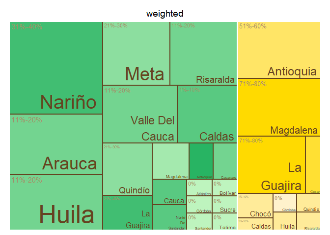<!-- -->

    ## $tm
    ##        crop          expert_in ave_cat_weighted vSize  vColor stdErr
    ## 1    Banana          Antioquia          51%-60%    11 #FFE566     11
    ## 2    Banana          Antioquia             <NA>    11 #FFE566     11
    ## 3    Banana             Caldas           1%-10%     1 #FFEB99      1
    ## 4    Banana             Caldas             <NA>     1 #FFEB99      1
    ## 5    Banana              Cesar          61%-70%     2 #FFE033      2
    ## 6    Banana              Cesar             <NA>     2 #FFE033      2
    ## 7    Banana              Chocó           1%-10%     2 #FFEB99      2
    ## 8    Banana              Chocó             <NA>     2 #FFEB99      2
    ## 9    Banana            Córdoba               0%     1 #FFF2CC      1
    ## 10   Banana            Córdoba             <NA>     1 #FFF2CC      1
    ## 11   Banana              Huila           1%-10%     1 #FFEB99      1
    ## 12   Banana              Huila             <NA>     1 #FFEB99      1
    ## 13   Banana         La Guajira          71%-80%     9 #FFDA00      9
    ## 14   Banana         La Guajira             <NA>     9 #FFDA00      9
    ## 15   Banana          Magdalena          71%-80%    11 #FFDA00     11
    ## 16   Banana          Magdalena             <NA>    11 #FFDA00     11
    ## 17   Banana               <NA>             <NA>    40 #FFEB99     40
    ## 18   Banana            Quindío           1%-10%     1 #FFEB99      1
    ## 19   Banana            Quindío             <NA>     1 #FFEB99      1
    ## 20   Banana          Risaralda           1%-10%     1 #FFEB99      1
    ## 21   Banana          Risaralda             <NA>     1 #FFEB99      1
    ## 22 Plantain          Antioquia          51%-60%     2 #28B463      2
    ## 23 Plantain          Antioquia             <NA>     2 #28B463      2
    ## 24 Plantain             Arauca          11%-20%     2 #73D490      2
    ## 25 Plantain             Arauca             <NA>     2 #73D490      2
    ## 26 Plantain          Atlántico               0%     1 #BEF4BE      1
    ## 27 Plantain          Atlántico             <NA>     1 #BEF4BE      1
    ## 28 Plantain            Bolívar               0%     1 #BEF4BE      1
    ## 29 Plantain            Bolívar             <NA>     1 #BEF4BE      1
    ## 30 Plantain             Caldas           1%-10%     7 #59C981      7
    ## 31 Plantain             Caldas             <NA>     7 #59C981      7
    ## 32 Plantain           Casanare          11%-20%     2 #73D490      2
    ## 33 Plantain           Casanare             <NA>     2 #73D490      2
    ## 34 Plantain            Córdoba               0%     1 #BEF4BE      1
    ## 35 Plantain            Córdoba             <NA>     1 #BEF4BE      1
    ## 36 Plantain              Huila               0%     1 #BEF4BE      1
    ## 37 Plantain              Huila             <NA>     1 #BEF4BE      1
    ## 38 Plantain         La Guajira          31%-40%     4 #41BE72      4
    ## 39 Plantain         La Guajira             <NA>     4 #41BE72      4
    ## 40 Plantain          Magdalena          41%-50%     3 #A4E9AE      3
    ## 41 Plantain          Magdalena             <NA>     3 #A4E9AE      3
    ## 42 Plantain               Meta          21%-30%    10 #8CDE9F     10
    ## 43 Plantain               Meta             <NA>    10 #8CDE9F     10
    ## 44 Plantain               <NA>             <NA>    54 #BEF4BE     54
    ## 45 Plantain Norte De Santander               0%     1 #BEF4BE      1
    ## 46 Plantain Norte De Santander             <NA>     1 #BEF4BE      1
    ## 47 Plantain            Quindío          21%-30%     6 #8CDE9F      6
    ## 48 Plantain            Quindío             <NA>     6 #8CDE9F      6
    ## 49 Plantain          Risaralda          11%-20%    10 #73D490     10
    ## 50 Plantain          Risaralda             <NA>    10 #73D490     10
    ## 51 Plantain          Santander               0%     1 #BEF4BE      1
    ## 52 Plantain          Santander             <NA>     1 #BEF4BE      1
    ## 53 Plantain              Sucre               0%     1 #BEF4BE      1
    ## 54 Plantain              Sucre             <NA>     1 #BEF4BE      1
    ## 55 Plantain             Tolima               0%     1 #BEF4BE      1
    ## 56 Plantain             Tolima             <NA>     1 #BEF4BE      1
    ##    vColorValue level        x0         y0          w          h   color
    ## 1           NA     3 0.5744681 0.45000000 0.21276596 0.55000000 #FFE566
    ## 2           NA     2 0.5744681 0.45000000 0.21276596 0.55000000 #FFE566
    ## 3           NA     3 0.9448385 0.25714286 0.05516154 0.19285714 #FFEB99
    ## 4           NA     2 0.9448385 0.25714286 0.05516154 0.19285714 #FFEB99
    ## 5           NA     3 0.5744681 0.00000000 0.26004728 0.08181818 #FFE033
    ## 6           NA     2 0.5744681 0.00000000 0.26004728 0.08181818 #FFE033
    ## 7           NA     3 0.8345154 0.25714286 0.11032309 0.19285714 #FFEB99
    ## 8           NA     2 0.8345154 0.25714286 0.11032309 0.19285714 #FFEB99
    ## 9           NA     3 0.8345154 0.12857143 0.08274232 0.12857143 #FFF2CC
    ## 10          NA     2 0.8345154 0.12857143 0.08274232 0.12857143 #FFF2CC
    ## 11          NA     3 0.9172577 0.12857143 0.08274232 0.12857143 #FFEB99
    ## 12          NA     2 0.9172577 0.12857143 0.08274232 0.12857143 #FFEB99
    ## 13          NA     3 0.5744681 0.08181818 0.26004728 0.36818182 #FFDA00
    ## 14          NA     2 0.5744681 0.08181818 0.26004728 0.36818182 #FFDA00
    ## 15          NA     3 0.7872340 0.45000000 0.21276596 0.55000000 #FFDA00
    ## 16          NA     2 0.7872340 0.45000000 0.21276596 0.55000000 #FFDA00
    ## 17          NA     1 0.5744681 0.00000000 0.42553191 1.00000000 #FFEB99
    ## 18          NA     3 0.8345154 0.00000000 0.08274232 0.12857143 #FFEB99
    ## 19          NA     2 0.8345154 0.00000000 0.08274232 0.12857143 #FFEB99
    ## 20          NA     3 0.9172577 0.00000000 0.08274232 0.12857143 #FFEB99
    ## 21          NA     2 0.9172577 0.00000000 0.08274232 0.12857143 #FFEB99
    ## 22          NA     3 0.4956195 0.35978836 0.07884856 0.26984127 #28B463
    ## 23          NA     2 0.4956195 0.35978836 0.07884856 0.26984127 #28B463
    ## 24          NA     3 0.2196496 0.17989418 0.11827284 0.17989418 #73D490
    ## 25          NA     2 0.2196496 0.17989418 0.11827284 0.17989418 #73D490
    ## 26          NA     3 0.3379224 0.22486772 0.07884856 0.13492063 #BEF4BE
    ## 27          NA     2 0.3379224 0.22486772 0.07884856 0.13492063 #BEF4BE
    ## 28          NA     3 0.4167710 0.22486772 0.07884856 0.13492063 #BEF4BE
    ## 29          NA     2 0.4167710 0.22486772 0.07884856 0.13492063 #BEF4BE
    ## 30          NA     3 0.0000000 0.29059829 0.21964956 0.33903134 #59C981
    ## 31          NA     2 0.0000000 0.29059829 0.21964956 0.33903134 #59C981
    ## 32          NA     3 0.2196496 0.00000000 0.11827284 0.17989418 #73D490
    ## 33          NA     2 0.2196496 0.00000000 0.11827284 0.17989418 #73D490
    ## 34          NA     3 0.4956195 0.22486772 0.07884856 0.13492063 #BEF4BE
    ## 35          NA     2 0.4956195 0.22486772 0.07884856 0.13492063 #BEF4BE
    ## 36          NA     3 0.3379224 0.11243386 0.09461827 0.11243386 #BEF4BE
    ## 37          NA     2 0.3379224 0.11243386 0.09461827 0.11243386 #BEF4BE
    ## 38          NA     3 0.2196496 0.35978836 0.15769712 0.26984127 #41BE72
    ## 39          NA     2 0.2196496 0.35978836 0.15769712 0.26984127 #41BE72
    ## 40          NA     3 0.3773467 0.35978836 0.11827284 0.26984127 #A4E9AE
    ## 41          NA     2 0.3773467 0.35978836 0.11827284 0.26984127 #A4E9AE
    ## 42          NA     3 0.0000000 0.62962963 0.28723404 0.37037037 #8CDE9F
    ## 43          NA     2 0.0000000 0.62962963 0.28723404 0.37037037 #8CDE9F
    ## 44          NA     1 0.0000000 0.00000000 0.57446809 1.00000000 #BEF4BE
    ## 45          NA     3 0.3379224 0.00000000 0.09461827 0.11243386 #BEF4BE
    ## 46          NA     2 0.3379224 0.00000000 0.09461827 0.11243386 #BEF4BE
    ## 47          NA     3 0.0000000 0.00000000 0.21964956 0.29059829 #8CDE9F
    ## 48          NA     2 0.0000000 0.00000000 0.21964956 0.29059829 #8CDE9F
    ## 49          NA     3 0.2872340 0.62962963 0.28723404 0.37037037 #73D490
    ## 50          NA     2 0.2872340 0.62962963 0.28723404 0.37037037 #73D490
    ## 51          NA     3 0.4325407 0.07495591 0.07096370 0.14991182 #BEF4BE
    ## 52          NA     2 0.4325407 0.07495591 0.07096370 0.14991182 #BEF4BE
    ## 53          NA     3 0.5035044 0.07495591 0.07096370 0.14991182 #BEF4BE
    ## 54          NA     2 0.5035044 0.07495591 0.07096370 0.14991182 #BEF4BE
    ## 55          NA     3 0.4325407 0.00000000 0.14192741 0.07495591 #BEF4BE
    ## 56          NA     2 0.4325407 0.00000000 0.14192741 0.07495591 #BEF4BE
    ## 
    ## $type
    ## [1] "color"
    ## 
    ## $vSize
    ## [1] "frequency"
    ## 
    ## $vColor
    ## [1] "group_color"
    ## 
    ## $stdErr
    ## [1] "frequency"
    ## 
    ## $algorithm
    ## [1] "pivotSize"
    ## 
    ## $vpCoorX
    ## [1] 0.02812148 0.97187852
    ## 
    ## $vpCoorY
    ## [1] 0.01968504 0.91031496
    ## 
    ## $aspRatio
    ## [1] 1.483512
    ## 
    ## $range
    ## [1] NA NA
    ## 
    ## $mapping
    ## [1] NA NA NA
    ## 
    ## $draw
    ## [1] TRUE

``` r
#Map of Colombia  
#non weighted
nal_q20_no_weight<- question_20 %>% group_by(expert_in) %>%
  summarise(average= mean(as.numeric(numeric_answer))) %>%
  group_by(average) %>% 
  mutate(cat= category_by_mean_by_question(language = "en", mean = average, question =20))%>%
  rename(EKE.expert.in = expert_in)

nal_q20_no_weight<- full_join(codes_department, nal_q20_no_weight)
```

    ## Joining with `by = join_by(EKE.expert.in)`

``` r
nal_q20_no_weight$cat<- factor(nal_q20_no_weight$cat, levels = level_20)
colmap(departamentos, data = nal_q20_no_weight, data_id = "id_depto", var = "cat")+
  scale_fill_manual(values = palette_soil(length(unique(nal_q20_no_weight$cat))-1), na.value = "#eeeeee")
```

    ## Scale for fill is already present.
    ## Adding another scale for fill, which will replace the existing scale.

<!-- -->

``` r
# weighted
nal_q20_weight<- inner_join(question_20, experience_of_each_expert)
```

    ## Joining with `by = join_by(crop, expert_ID, expert_in)`

``` r
nal_q20_weight<- nal_q20_weight %>%
  group_by(expert_in) %>%
  mutate(numeric_answer=as.numeric(numeric_answer)) %>%
  summarise(average_weighted= weighted.mean(numeric_answer, weights)) %>% 
  group_by(average_weighted) %>%
  mutate(cat_weighted= category_by_mean_by_question(language = "en", mean = average_weighted, question =20)) %>%
  rename(EKE.expert.in=expert_in)

nal_q20_weight<- full_join(codes_department, nal_q20_weight)
```

    ## Joining with `by = join_by(EKE.expert.in)`

``` r
nal_q20_weight$cat_weighted<- factor(nal_q20_weight$cat_weighted, levels = level_20)
colmap(departamentos, data = nal_q20_weight, data_id = "id_depto", var = "cat_weighted")+
  scale_fill_manual(values = palette_soil(length(unique(nal_q20_weight$cat))-1), na.value = "#eeeeee")
```

    ## Scale for fill is already present.
    ## Adding another scale for fill, which will replace the existing scale.

<!-- -->

## Question 21: What is the average frequency of monitoring for pests and diseases in banana production systems in the areas where you have experience?

``` r
#selecting only question 21----
question_21<- filter(individual_surveys, question_number==21)
#unique(question_21$numeric_answer)
#dput(unique(question_21$answer_in_english))
#some experts selected more than one option in this question so an intermediate answer is chosen 
question_21 <- question_21 %>%
  mutate(answer_in_english = case_when(
    answer_in_english == "Daily,Weekly,Biweekly,Monthly,Quarterly,As Needed" ~ "As Needed",
    answer_in_english == "Bimonthly,Quarterly" ~ "Quarterly",
    answer_in_english == "Biweekly,Monthly" ~ "Monthly",
    answer_in_english == "Weekly,Biweekly" ~ "Biweekly",
    TRUE ~ answer_in_english  # This keeps all other values as they are
  ))
#some experts selected more than one option in this question so an intermediate answer is chosen 
question_21 <- question_21 %>%
  mutate(numeric_answer = case_when(
    numeric_answer == "1,2,3,4,6,9" ~ "9",
    numeric_answer == "5,6" ~ "5.5",
    numeric_answer == "3,4" ~ "3.5",
    numeric_answer == "2,3" ~ "2.5",
    TRUE ~ numeric_answer  # This keeps all other values as they are
  ))
#organizing the order of the levels
level_21<- c("Daily", "Weekly", "Biweekly", "Monthly", "Bimonthly", "Quarterly", "Semiannually", "Annually", "As Needed", "Unsupervised", "Not Sure")
question_21$answer_in_english<- factor(question_21$answer_in_english,levels = level_21)
question_21<- filter(question_21, answer_in_english!="Not Sure")
#average by department (weighted and no weighted)
#not weighted 
avg_dept_no_weight_21<- question_21 %>%
  group_by(crop, expert_in) %>%
  mutate(numeric_answer=as.numeric(numeric_answer))%>%
  mutate(average= mean(numeric_answer)) %>%
  group_by(average)%>%
  mutate(ave_cat= category_by_mean_by_question(21, mean =average, language = "en"))
```

    ## Warning: There were 7 warnings in `mutate()`.
    ## The first warning was:
    ## ℹ In argument: `ave_cat = category_by_mean_by_question(21, mean = average,
    ##   language = "en")`.
    ## ℹ In group 0: .
    ## Caused by warning:
    ## ! There was 1 warning in `filter()`.
    ## ℹ In argument: `number == question & number_to_category == mean`.
    ## Caused by warning in `number_to_category == mean`:
    ## ! longer object length is not a multiple of shorter object length
    ## ℹ Run `dplyr::last_dplyr_warnings()` to see the 6 remaining warnings.

``` r
#weighted 
add_weights_question_21<- inner_join(question_21, experience_of_each_expert)
```

    ## Joining with `by = join_by(crop, expert_ID, expert_in)`

``` r
avg_dept_weight_21<- add_weights_question_21 %>%
  group_by(crop, expert_in) %>%
  mutate(numeric_answer=as.numeric(numeric_answer))%>%
  mutate(average_weighted= weighted.mean(numeric_answer, weights)) %>% 
  group_by(average_weighted)%>%
  mutate(ave_cat_weighted= category_by_mean_by_question(21, mean =average_weighted, language = "en"))
```

    ## Warning: There were 8 warnings in `mutate()`.
    ## The first warning was:
    ## ℹ In argument: `ave_cat_weighted = category_by_mean_by_question(21, mean =
    ##   average_weighted, language = "en")`.
    ## ℹ In group 0: .
    ## Caused by warning:
    ## ! There was 1 warning in `filter()`.
    ## ℹ In argument: `number == question & number_to_category == mean`.
    ## Caused by warning in `number_to_category == mean`:
    ## ! longer object length is not a multiple of shorter object length
    ## ℹ Run `dplyr::last_dplyr_warnings()` to see the 7 remaining warnings.

``` r
#finding the levels per crop (banana and plantain) no weighted
levels_per_crop_Q21_no_weighted<- tapply(avg_dept_no_weight_21$ave_cat, avg_dept_no_weight_21$crop, function(x){(unique(x))})
#generating a ramp palette according to the number of levels per crop
colors_banana_question21_no_weighted<- palette_banana(length(levels_per_crop_Q21_no_weighted$Banana))
colors_plantain_question21_no_weighted<- palette_plantain(length(levels_per_crop_Q21_no_weighted$Plantain))
#Assigning the colors by crop and answer
# Define the knowledge levels for each crop
levels_by_crop_no_weighted_21 <- list(
  Banana = levels_per_crop_Q21_no_weighted$Banana,
  Plantain = levels_per_crop_Q21_no_weighted$Plantain
)
# Define the colors for each crop
colors_by_crop_no_weighted_21 <- list(
  Banana = colors_banana_question21_no_weighted, # Replace with actual color vector for Banana
  Plantain = colors_plantain_question21_no_weighted # Replace with actual color vector for Plantain
  # Add more crops and their color vectors here if needed
)
# Now call the function
avg_dept_no_weight_21 <- assign_group_color(data = avg_dept_no_weight_21, levels_by_crop = levels_by_crop_no_weighted_21, colors_by_crop = colors_by_crop_no_weighted_21,answer_col =  "ave_cat")

#finding the levels per crop (banana and plantain) weighted
levels_per_crop_Q21_weighted<- tapply(avg_dept_weight_21$ave_cat_weighted, avg_dept_weight_21$crop, function(x){(unique(x))})
#generating a ramp palette according to the number of levels per crop
colors_banana_question21_weighted<- palette_banana(length(levels_per_crop_Q21_weighted$Banana))
colors_plantain_question21_weighted<- palette_plantain(length(levels_per_crop_Q21_weighted$Plantain))
#Assigning the colors by crop and answer
# Define the knowledge levels for each crop
levels_by_crop_weighted_21 <- list(
  Banana = levels_per_crop_Q21_weighted$Banana,
  Plantain = levels_per_crop_Q21_weighted$Plantain
)
# Define the colors for each crop
colors_by_crop_weighted_21 <- list(
  Banana = colors_banana_question21_weighted, # Replace with actual color vector for Banana
  Plantain = colors_plantain_question21_weighted # Replace with actual color vector for Plantain
  # Add more crops and their color vectors here if needed
)
# Now call the function
avg_dept_weight_21 <- assign_group_color(data = avg_dept_weight_21, levels_by_crop = levels_by_crop_weighted_21, colors_by_crop = colors_by_crop_weighted_21,answer_col =  "ave_cat_weighted")

#tree map
tree_map_3(data = avg_dept_no_weight_21, "crop", "expert_in", "ave_cat", "group_color", title="No weighted")
```

    ## `summarise()` has grouped output by 'crop', 'expert_in', 'ave_cat'. You can
    ## override using the `.groups` argument.

<!-- -->

    ## $tm
    ##        crop          expert_in   ave_cat vSize  vColor stdErr vColorValue level
    ## 1    Banana          Antioquia  Biweekly    12 #FFDA00     12          NA     3
    ## 2    Banana          Antioquia      <NA>    12 #FFDA00     12          NA     2
    ## 3    Banana             Caldas   Monthly     1 #FFF2CC      1          NA     3
    ## 4    Banana             Caldas      <NA>     1 #FFF2CC      1          NA     2
    ## 5    Banana              Cesar      <NA>     1 #FFE566      1          NA     2
    ## 6    Banana              Cesar    Weekly     1 #FFE566      1          NA     3
    ## 7    Banana              Huila   Monthly     1 #FFF2CC      1          NA     3
    ## 8    Banana              Huila      <NA>     1 #FFF2CC      1          NA     2
    ## 9    Banana         La Guajira  Biweekly    11 #FFDA00     11          NA     3
    ## 10   Banana         La Guajira      <NA>    11 #FFDA00     11          NA     2
    ## 11   Banana          Magdalena  Biweekly    12 #FFDA00     12          NA     3
    ## 12   Banana          Magdalena      <NA>    12 #FFDA00     12          NA     2
    ## 13   Banana               <NA>      <NA>    40 #FFF2CC     40          NA     1
    ## 14   Banana            Quindío   Monthly     1 #FFF2CC      1          NA     3
    ## 15   Banana            Quindío      <NA>     1 #FFF2CC      1          NA     2
    ## 16   Banana          Risaralda   Monthly     1 #FFF2CC      1          NA     3
    ## 17   Banana          Risaralda      <NA>     1 #FFF2CC      1          NA     2
    ## 18 Plantain          Antioquia      <NA>     2 #28B463      2          NA     2
    ## 19 Plantain          Antioquia    Weekly     2 #28B463      2          NA     3
    ## 20 Plantain             Arauca   Monthly     2 #4DC479      2          NA     3
    ## 21 Plantain             Arauca      <NA>     2 #4DC479      2          NA     2
    ## 22 Plantain          Atlántico Bimonthly     1 #98E4A7      1          NA     3
    ## 23 Plantain          Atlántico      <NA>     1 #98E4A7      1          NA     2
    ## 24 Plantain            Bolívar Bimonthly     1 #98E4A7      1          NA     3
    ## 25 Plantain            Bolívar      <NA>     1 #98E4A7      1          NA     2
    ## 26 Plantain             Caldas      <NA>     7 #73D490      7          NA     2
    ## 27 Plantain             Caldas Quarterly     7 #73D490      7          NA     3
    ## 28 Plantain           Casanare   Monthly     2 #4DC479      2          NA     3
    ## 29 Plantain           Casanare      <NA>     2 #4DC479      2          NA     2
    ## 30 Plantain            Córdoba   Monthly     1 #4DC479      1          NA     3
    ## 31 Plantain            Córdoba      <NA>     1 #4DC479      1          NA     2
    ## 32 Plantain              Huila Bimonthly     1 #98E4A7      1          NA     3
    ## 33 Plantain              Huila      <NA>     1 #98E4A7      1          NA     2
    ## 34 Plantain         La Guajira   Monthly     4 #4DC479      4          NA     3
    ## 35 Plantain         La Guajira      <NA>     4 #4DC479      4          NA     2
    ## 36 Plantain          Magdalena Bimonthly     3 #98E4A7      3          NA     3
    ## 37 Plantain          Magdalena      <NA>     3 #98E4A7      3          NA     2
    ## 38 Plantain               Meta  Biweekly    11 #BEF4BE     11          NA     3
    ## 39 Plantain               Meta      <NA>    11 #BEF4BE     11          NA     2
    ## 40 Plantain               <NA>      <NA>    54 #98E4A7     54          NA     1
    ## 41 Plantain Norte De Santander Bimonthly     1 #98E4A7      1          NA     3
    ## 42 Plantain Norte De Santander      <NA>     1 #98E4A7      1          NA     2
    ## 43 Plantain            Quindío Bimonthly     6 #98E4A7      6          NA     3
    ## 44 Plantain            Quindío      <NA>     6 #98E4A7      6          NA     2
    ## 45 Plantain          Risaralda Bimonthly     9 #98E4A7      9          NA     3
    ## 46 Plantain          Risaralda      <NA>     9 #98E4A7      9          NA     2
    ## 47 Plantain          Santander Bimonthly     1 #98E4A7      1          NA     3
    ## 48 Plantain          Santander      <NA>     1 #98E4A7      1          NA     2
    ## 49 Plantain              Sucre      <NA>     1 #73D490      1          NA     2
    ## 50 Plantain              Sucre Quarterly     1 #73D490      1          NA     3
    ## 51 Plantain             Tolima Bimonthly     1 #98E4A7      1          NA     3
    ## 52 Plantain             Tolima      <NA>     1 #98E4A7      1          NA     2
    ##           x0         y0          w          h   color
    ## 1  0.5744681 0.40000000 0.21276596 0.60000000 #FFDA00
    ## 2  0.5744681 0.40000000 0.21276596 0.60000000 #FFDA00
    ## 3  0.8670213 0.24000000 0.06648936 0.16000000 #FFF2CC
    ## 4  0.8670213 0.24000000 0.06648936 0.16000000 #FFF2CC
    ## 5  0.9335106 0.24000000 0.06648936 0.16000000 #FFE566
    ## 6  0.9335106 0.24000000 0.06648936 0.16000000 #FFE566
    ## 7  0.8670213 0.08000000 0.06648936 0.16000000 #FFF2CC
    ## 8  0.8670213 0.08000000 0.06648936 0.16000000 #FFF2CC
    ## 9  0.5744681 0.00000000 0.29255319 0.40000000 #FFDA00
    ## 10 0.5744681 0.00000000 0.29255319 0.40000000 #FFDA00
    ## 11 0.7872340 0.40000000 0.21276596 0.60000000 #FFDA00
    ## 12 0.7872340 0.40000000 0.21276596 0.60000000 #FFDA00
    ## 13 0.5744681 0.00000000 0.42553191 1.00000000 #FFF2CC
    ## 14 0.9335106 0.08000000 0.06648936 0.16000000 #FFF2CC
    ## 15 0.9335106 0.08000000 0.06648936 0.16000000 #FFF2CC
    ## 16 0.8670213 0.00000000 0.13297872 0.08000000 #FFF2CC
    ## 17 0.8670213 0.00000000 0.13297872 0.08000000 #FFF2CC
    ## 18 0.4956195 0.35978836 0.07884856 0.26984127 #28B463
    ## 19 0.4956195 0.35978836 0.07884856 0.26984127 #28B463
    ## 20 0.2196496 0.17989418 0.11827284 0.17989418 #4DC479
    ## 21 0.2196496 0.17989418 0.11827284 0.17989418 #4DC479
    ## 22 0.3379224 0.22486772 0.07884856 0.13492063 #98E4A7
    ## 23 0.3379224 0.22486772 0.07884856 0.13492063 #98E4A7
    ## 24 0.4167710 0.22486772 0.07884856 0.13492063 #98E4A7
    ## 25 0.4167710 0.22486772 0.07884856 0.13492063 #98E4A7
    ## 26 0.0000000 0.29059829 0.21964956 0.33903134 #73D490
    ## 27 0.0000000 0.29059829 0.21964956 0.33903134 #73D490
    ## 28 0.2196496 0.00000000 0.11827284 0.17989418 #4DC479
    ## 29 0.2196496 0.00000000 0.11827284 0.17989418 #4DC479
    ## 30 0.4956195 0.22486772 0.07884856 0.13492063 #4DC479
    ## 31 0.4956195 0.22486772 0.07884856 0.13492063 #4DC479
    ## 32 0.3379224 0.11243386 0.09461827 0.11243386 #98E4A7
    ## 33 0.3379224 0.11243386 0.09461827 0.11243386 #98E4A7
    ## 34 0.2196496 0.35978836 0.15769712 0.26984127 #4DC479
    ## 35 0.2196496 0.35978836 0.15769712 0.26984127 #4DC479
    ## 36 0.3773467 0.35978836 0.11827284 0.26984127 #98E4A7
    ## 37 0.3773467 0.35978836 0.11827284 0.26984127 #98E4A7
    ## 38 0.0000000 0.62962963 0.31595745 0.37037037 #BEF4BE
    ## 39 0.0000000 0.62962963 0.31595745 0.37037037 #BEF4BE
    ## 40 0.0000000 0.00000000 0.57446809 1.00000000 #98E4A7
    ## 41 0.3379224 0.00000000 0.09461827 0.11243386 #98E4A7
    ## 42 0.3379224 0.00000000 0.09461827 0.11243386 #98E4A7
    ## 43 0.0000000 0.00000000 0.21964956 0.29059829 #98E4A7
    ## 44 0.0000000 0.00000000 0.21964956 0.29059829 #98E4A7
    ## 45 0.3159574 0.62962963 0.25851064 0.37037037 #98E4A7
    ## 46 0.3159574 0.62962963 0.25851064 0.37037037 #98E4A7
    ## 47 0.4325407 0.07495591 0.07096370 0.14991182 #98E4A7
    ## 48 0.4325407 0.07495591 0.07096370 0.14991182 #98E4A7
    ## 49 0.5035044 0.07495591 0.07096370 0.14991182 #73D490
    ## 50 0.5035044 0.07495591 0.07096370 0.14991182 #73D490
    ## 51 0.4325407 0.00000000 0.14192741 0.07495591 #98E4A7
    ## 52 0.4325407 0.00000000 0.14192741 0.07495591 #98E4A7
    ## 
    ## $type
    ## [1] "color"
    ## 
    ## $vSize
    ## [1] "frequency"
    ## 
    ## $vColor
    ## [1] "group_color"
    ## 
    ## $stdErr
    ## [1] "frequency"
    ## 
    ## $algorithm
    ## [1] "pivotSize"
    ## 
    ## $vpCoorX
    ## [1] 0.02812148 0.97187852
    ## 
    ## $vpCoorY
    ## [1] 0.01968504 0.91031496
    ## 
    ## $aspRatio
    ## [1] 1.483512
    ## 
    ## $range
    ## [1] NA NA
    ## 
    ## $mapping
    ## [1] NA NA NA
    ## 
    ## $draw
    ## [1] TRUE

``` r
tree_map_3(data = avg_dept_weight_21, "crop", "expert_in", "ave_cat_weighted", "group_color", title="weighted")
```

    ## `summarise()` has grouped output by 'crop', 'expert_in', 'ave_cat_weighted'.
    ## You can override using the `.groups` argument.

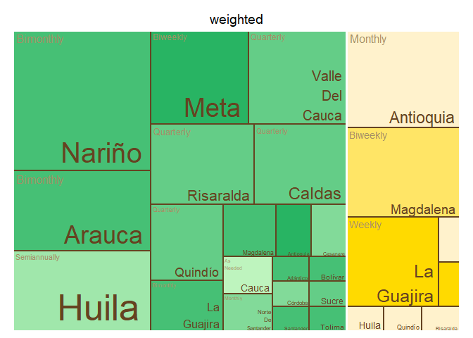<!-- -->

    ## $tm
    ##        crop          expert_in ave_cat_weighted vSize  vColor stdErr
    ## 1    Banana          Antioquia          Monthly    12 #FFF2CC     12
    ## 2    Banana          Antioquia             <NA>    12 #FFF2CC     12
    ## 3    Banana             Caldas          Monthly     1 #FFF2CC      1
    ## 4    Banana             Caldas             <NA>     1 #FFF2CC      1
    ## 5    Banana              Cesar             <NA>     1 #FFDA00      1
    ## 6    Banana              Cesar           Weekly     1 #FFDA00      1
    ## 7    Banana              Huila          Monthly     1 #FFF2CC      1
    ## 8    Banana              Huila             <NA>     1 #FFF2CC      1
    ## 9    Banana         La Guajira             <NA>     9 #FFDA00      9
    ## 10   Banana         La Guajira           Weekly     9 #FFDA00      9
    ## 11   Banana          Magdalena         Biweekly    11 #FFE566     11
    ## 12   Banana          Magdalena             <NA>    11 #FFE566     11
    ## 13   Banana               <NA>             <NA>    37 #FFF2CC     37
    ## 14   Banana            Quindío          Monthly     1 #FFF2CC      1
    ## 15   Banana            Quindío             <NA>     1 #FFF2CC      1
    ## 16   Banana          Risaralda          Monthly     1 #FFF2CC      1
    ## 17   Banana          Risaralda             <NA>     1 #FFF2CC      1
    ## 18 Plantain          Antioquia         Biweekly     2 #28B463      2
    ## 19 Plantain          Antioquia             <NA>     2 #28B463      2
    ## 20 Plantain             Arauca          Monthly     2 #BEF4BE      2
    ## 21 Plantain             Arauca             <NA>     2 #BEF4BE      2
    ## 22 Plantain          Atlántico        Bimonthly     1 #4DC479      1
    ## 23 Plantain          Atlántico             <NA>     1 #4DC479      1
    ## 24 Plantain            Bolívar        Bimonthly     1 #4DC479      1
    ## 25 Plantain            Bolívar             <NA>     1 #4DC479      1
    ## 26 Plantain             Caldas             <NA>     7 #73D490      7
    ## 27 Plantain             Caldas     Semiannually     7 #73D490      7
    ## 28 Plantain           Casanare          Monthly     2 #BEF4BE      2
    ## 29 Plantain           Casanare             <NA>     2 #BEF4BE      2
    ## 30 Plantain            Córdoba          Monthly     1 #BEF4BE      1
    ## 31 Plantain            Córdoba             <NA>     1 #BEF4BE      1
    ## 32 Plantain              Huila        Bimonthly     1 #4DC479      1
    ## 33 Plantain              Huila             <NA>     1 #4DC479      1
    ## 34 Plantain         La Guajira        Bimonthly     4 #4DC479      4
    ## 35 Plantain         La Guajira             <NA>     4 #4DC479      4
    ## 36 Plantain          Magdalena        Bimonthly     3 #4DC479      3
    ## 37 Plantain          Magdalena             <NA>     3 #4DC479      3
    ## 38 Plantain               Meta         Biweekly    10 #28B463     10
    ## 39 Plantain               Meta             <NA>    10 #28B463     10
    ## 40 Plantain               <NA>             <NA>    53 #4DC479     53
    ## 41 Plantain Norte De Santander        Bimonthly     1 #4DC479      1
    ## 42 Plantain Norte De Santander             <NA>     1 #4DC479      1
    ## 43 Plantain            Quindío             <NA>     6 #98E4A7      6
    ## 44 Plantain            Quindío        Quarterly     6 #98E4A7      6
    ## 45 Plantain          Risaralda             <NA>     9 #98E4A7      9
    ## 46 Plantain          Risaralda        Quarterly     9 #98E4A7      9
    ## 47 Plantain          Santander        Bimonthly     1 #4DC479      1
    ## 48 Plantain          Santander             <NA>     1 #4DC479      1
    ## 49 Plantain              Sucre             <NA>     1 #98E4A7      1
    ## 50 Plantain              Sucre        Quarterly     1 #98E4A7      1
    ## 51 Plantain             Tolima        Bimonthly     1 #4DC479      1
    ## 52 Plantain             Tolima             <NA>     1 #4DC479      1
    ##    vColorValue level        x0         y0          w          h   color
    ## 1           NA     3 0.5888889 0.67567568 0.41111111 0.32432432 #FFF2CC
    ## 2           NA     2 0.5888889 0.67567568 0.41111111 0.32432432 #FFF2CC
    ## 3           NA     3 0.5888889 0.00000000 0.08222222 0.13513514 #FFF2CC
    ## 4           NA     2 0.5888889 0.00000000 0.08222222 0.13513514 #FFF2CC
    ## 5           NA     2 0.6711111 0.00000000 0.08222222 0.13513514 #FFDA00
    ## 6           NA     3 0.6711111 0.00000000 0.08222222 0.13513514 #FFDA00
    ## 7           NA     3 0.7533333 0.00000000 0.08222222 0.13513514 #FFF2CC
    ## 8           NA     2 0.7533333 0.00000000 0.08222222 0.13513514 #FFF2CC
    ## 9           NA     2 0.8150000 0.13513514 0.18500000 0.54054054 #FFDA00
    ## 10          NA     3 0.8150000 0.13513514 0.18500000 0.54054054 #FFDA00
    ## 11          NA     3 0.5888889 0.13513514 0.22611111 0.54054054 #FFE566
    ## 12          NA     2 0.5888889 0.13513514 0.22611111 0.54054054 #FFE566
    ## 13          NA     1 0.5888889 0.00000000 0.41111111 1.00000000 #FFF2CC
    ## 14          NA     3 0.8355556 0.00000000 0.08222222 0.13513514 #FFF2CC
    ## 15          NA     2 0.8355556 0.00000000 0.08222222 0.13513514 #FFF2CC
    ## 16          NA     3 0.9177778 0.00000000 0.08222222 0.13513514 #FFF2CC
    ## 17          NA     2 0.9177778 0.00000000 0.08222222 0.13513514 #FFF2CC
    ## 18          NA     3 0.5080610 0.36657682 0.08082789 0.27493261 #28B463
    ## 19          NA     2 0.5080610 0.36657682 0.08082789 0.27493261 #28B463
    ## 20          NA     3 0.2251634 0.18328841 0.12124183 0.18328841 #BEF4BE
    ## 21          NA     2 0.2251634 0.18328841 0.12124183 0.18328841 #BEF4BE
    ## 22          NA     3 0.3464052 0.22911051 0.08082789 0.13746631 #4DC479
    ## 23          NA     2 0.3464052 0.22911051 0.08082789 0.13746631 #4DC479
    ## 24          NA     3 0.4272331 0.22911051 0.08082789 0.13746631 #4DC479
    ## 25          NA     2 0.4272331 0.22911051 0.08082789 0.13746631 #4DC479
    ## 26          NA     2 0.0000000 0.29608128 0.22516340 0.34542816 #73D490
    ## 27          NA     3 0.0000000 0.29608128 0.22516340 0.34542816 #73D490
    ## 28          NA     3 0.2251634 0.00000000 0.12124183 0.18328841 #BEF4BE
    ## 29          NA     2 0.2251634 0.00000000 0.12124183 0.18328841 #BEF4BE
    ## 30          NA     3 0.5080610 0.22911051 0.08082789 0.13746631 #BEF4BE
    ## 31          NA     2 0.5080610 0.22911051 0.08082789 0.13746631 #BEF4BE
    ## 32          NA     3 0.3464052 0.11455526 0.09699346 0.11455526 #4DC479
    ## 33          NA     2 0.3464052 0.11455526 0.09699346 0.11455526 #4DC479
    ## 34          NA     3 0.2251634 0.36657682 0.16165577 0.27493261 #4DC479
    ## 35          NA     2 0.2251634 0.36657682 0.16165577 0.27493261 #4DC479
    ## 36          NA     3 0.3868192 0.36657682 0.12124183 0.27493261 #4DC479
    ## 37          NA     2 0.3868192 0.36657682 0.12124183 0.27493261 #4DC479
    ## 38          NA     3 0.0000000 0.64150943 0.30994152 0.35849057 #28B463
    ## 39          NA     2 0.0000000 0.64150943 0.30994152 0.35849057 #28B463
    ## 40          NA     1 0.0000000 0.00000000 0.58888889 1.00000000 #4DC479
    ## 41          NA     3 0.3464052 0.00000000 0.09699346 0.11455526 #4DC479
    ## 42          NA     2 0.3464052 0.00000000 0.09699346 0.11455526 #4DC479
    ## 43          NA     2 0.0000000 0.00000000 0.22516340 0.29608128 #98E4A7
    ## 44          NA     3 0.0000000 0.00000000 0.22516340 0.29608128 #98E4A7
    ## 45          NA     2 0.3099415 0.64150943 0.27894737 0.35849057 #98E4A7
    ## 46          NA     3 0.3099415 0.64150943 0.27894737 0.35849057 #98E4A7
    ## 47          NA     3 0.4433987 0.07637017 0.07274510 0.15274034 #4DC479
    ## 48          NA     2 0.4433987 0.07637017 0.07274510 0.15274034 #4DC479
    ## 49          NA     2 0.5161438 0.07637017 0.07274510 0.15274034 #98E4A7
    ## 50          NA     3 0.5161438 0.07637017 0.07274510 0.15274034 #98E4A7
    ## 51          NA     3 0.4433987 0.00000000 0.14549020 0.07637017 #4DC479
    ## 52          NA     2 0.4433987 0.00000000 0.14549020 0.07637017 #4DC479
    ## 
    ## $type
    ## [1] "color"
    ## 
    ## $vSize
    ## [1] "frequency"
    ## 
    ## $vColor
    ## [1] "group_color"
    ## 
    ## $stdErr
    ## [1] "frequency"
    ## 
    ## $algorithm
    ## [1] "pivotSize"
    ## 
    ## $vpCoorX
    ## [1] 0.02812148 0.97187852
    ## 
    ## $vpCoorY
    ## [1] 0.01968504 0.91031496
    ## 
    ## $aspRatio
    ## [1] 1.483512
    ## 
    ## $range
    ## [1] NA NA
    ## 
    ## $mapping
    ## [1] NA NA NA
    ## 
    ## $draw
    ## [1] TRUE

``` r
#Map of Colombia  
#non weighted
nal_q21_no_weight<- question_21 %>% group_by(expert_in) %>%
  summarise(average= mean(as.numeric(numeric_answer))) %>%
  group_by(average) %>% 
  mutate(cat= category_by_mean_by_question(language = "en", mean = average, question =21))%>%
  rename(EKE.expert.in = expert_in)
```

    ## Warning: There were 2 warnings in `mutate()`.
    ## The first warning was:
    ## ℹ In argument: `cat = category_by_mean_by_question(...)`.
    ## ℹ In group 0: .
    ## Caused by warning:
    ## ! There was 1 warning in `filter()`.
    ## ℹ In argument: `number == question & number_to_category == mean`.
    ## Caused by warning in `number_to_category == mean`:
    ## ! longer object length is not a multiple of shorter object length
    ## ℹ Run `dplyr::last_dplyr_warnings()` to see the 1 remaining warning.

``` r
nal_q21_no_weight<- full_join(codes_department, nal_q21_no_weight)
```

    ## Joining with `by = join_by(EKE.expert.in)`

``` r
nal_q21_no_weight$cat<- factor(nal_q21_no_weight$cat, levels = level_21)
colmap(departamentos, data = nal_q21_no_weight, data_id = "id_depto", var = "cat")+
  scale_fill_manual(values = palette_soil(length(unique(nal_q21_no_weight$cat))-1), na.value = "#eeeeee")
```

    ## Scale for fill is already present.
    ## Adding another scale for fill, which will replace the existing scale.

<!-- -->

``` r
# weighted
nal_q21_weight<- inner_join(question_21, experience_of_each_expert)
```

    ## Joining with `by = join_by(crop, expert_ID, expert_in)`

``` r
nal_q21_weight<- nal_q21_weight %>%
  group_by(expert_in) %>%
  mutate(numeric_answer=as.numeric(numeric_answer)) %>%
  summarise(average_weighted= weighted.mean(numeric_answer, weights)) %>% 
  group_by(average_weighted) %>%
  mutate(cat_weighted= category_by_mean_by_question(language = "en", mean = average_weighted, question =21)) %>%
  rename(EKE.expert.in=expert_in)
```

    ## Warning: There were 2 warnings in `mutate()`.
    ## The first warning was:
    ## ℹ In argument: `cat_weighted = category_by_mean_by_question(...)`.
    ## ℹ In group 0: .
    ## Caused by warning:
    ## ! There was 1 warning in `filter()`.
    ## ℹ In argument: `number == question & number_to_category == mean`.
    ## Caused by warning in `number_to_category == mean`:
    ## ! longer object length is not a multiple of shorter object length
    ## ℹ Run `dplyr::last_dplyr_warnings()` to see the 1 remaining warning.

``` r
nal_q21_weight<- full_join(codes_department, nal_q21_weight)
```

    ## Joining with `by = join_by(EKE.expert.in)`

``` r
nal_q21_weight$cat_weighted<- factor(nal_q21_weight$cat_weighted, levels = level_21)
colmap(departamentos, data = nal_q21_weight, data_id = "id_depto", var = "cat_weighted")+
  scale_fill_manual(values = palette_soil(length(unique(nal_q21_weight$cat))-1), na.value = "#eeeeee")
```

    ## Scale for fill is already present.
    ## Adding another scale for fill, which will replace the existing scale.

<!-- -->

## Question 22: What is the efficacy perceived by producers of chemical control (pesticides, fungicides) in the prevention or management of banana diseases in the areas where you have experience?

``` r
#selecting only question 22----
question_22<- filter(individual_surveys, question_number==22)
#unique(question_22$numeric_answer)
#dput(unique(question_22$answer_in_english))

#organizing the order of the levels
level_22<- c("Slightly Effective", "Moderately Effective", "Very Effective","Extremely Effective", "Unsure")
question_22$answer_in_english<- factor(question_22$answer_in_english,levels = level_22)
question_22<- filter(question_22, answer_in_english!="Unsure")
#average by department (weighted and no weighted)
#not weighted 
avg_dept_no_weight_22<- question_22 %>%
  group_by(crop, expert_in) %>%
  mutate(numeric_answer=as.numeric(numeric_answer))%>%
  mutate(average= mean(numeric_answer)) %>%
  group_by(average)%>%
  mutate(ave_cat= category_by_mean_by_question(22, mean =average, language = "en"))
```

    ## Warning: There were 6 warnings in `mutate()`.
    ## The first warning was:
    ## ℹ In argument: `ave_cat = category_by_mean_by_question(22, mean = average,
    ##   language = "en")`.
    ## ℹ In group 0: .
    ## Caused by warning:
    ## ! There was 1 warning in `filter()`.
    ## ℹ In argument: `number == question & number_to_category == mean`.
    ## Caused by warning in `number_to_category == mean`:
    ## ! longer object length is not a multiple of shorter object length
    ## ℹ Run `dplyr::last_dplyr_warnings()` to see the 5 remaining warnings.

``` r
#weighted 
add_weights_question_22<- inner_join(question_22, experience_of_each_expert)
```

    ## Joining with `by = join_by(crop, expert_ID, expert_in)`

``` r
avg_dept_weight_22<- add_weights_question_22 %>%
  group_by(crop, expert_in) %>%
  mutate(numeric_answer=as.numeric(numeric_answer))%>%
  mutate(average_weighted= weighted.mean(numeric_answer, weights)) %>% 
  group_by(average_weighted)%>%
  mutate(ave_cat_weighted= category_by_mean_by_question(22, mean =average_weighted, language = "en"))
```

    ## Warning: There were 8 warnings in `mutate()`.
    ## The first warning was:
    ## ℹ In argument: `ave_cat_weighted = category_by_mean_by_question(22, mean =
    ##   average_weighted, language = "en")`.
    ## ℹ In group 0: .
    ## Caused by warning:
    ## ! There was 1 warning in `filter()`.
    ## ℹ In argument: `number == question & number_to_category == mean`.
    ## Caused by warning in `number_to_category == mean`:
    ## ! longer object length is not a multiple of shorter object length
    ## ℹ Run `dplyr::last_dplyr_warnings()` to see the 7 remaining warnings.

``` r
#finding the levels per crop (banana and plantain) no weighted
levels_per_crop_Q22_no_weighted<- tapply(avg_dept_no_weight_22$ave_cat, avg_dept_no_weight_22$crop, function(x){(unique(x))})
#generating a ramp palette according to the number of levels per crop
colors_banana_question22_no_weighted<- palette_banana(length(levels_per_crop_Q22_no_weighted$Banana))
colors_plantain_question22_no_weighted<- palette_plantain(length(levels_per_crop_Q22_no_weighted$Plantain))
#Assigning the colors by crop and answer
# Define the knowledge levels for each crop
levels_by_crop_no_weighted_22 <- list(
  Banana = levels_per_crop_Q22_no_weighted$Banana,
  Plantain = levels_per_crop_Q22_no_weighted$Plantain
)
# Define the colors for each crop
colors_by_crop_no_weighted_22 <- list(
  Banana = colors_banana_question22_no_weighted, # Replace with actual color vector for Banana
  Plantain = colors_plantain_question22_no_weighted # Replace with actual color vector for Plantain
  # Add more crops and their color vectors here if needed
)
# Now call the function
avg_dept_no_weight_22 <- assign_group_color(data = avg_dept_no_weight_22, levels_by_crop = levels_by_crop_no_weighted_22, colors_by_crop = colors_by_crop_no_weighted_22,answer_col =  "ave_cat")

#finding the levels per crop (banana and plantain) weighted
levels_per_crop_Q22_weighted<- tapply(avg_dept_weight_22$ave_cat_weighted, avg_dept_weight_22$crop, function(x){(unique(x))})
#generating a ramp palette according to the number of levels per crop
colors_banana_question22_weighted<- palette_banana(length(levels_per_crop_Q22_weighted$Banana))
colors_plantain_question22_weighted<- palette_plantain(length(levels_per_crop_Q22_weighted$Plantain))
#Assigning the colors by crop and answer
# Define the knowledge levels for each crop
levels_by_crop_weighted_22 <- list(
  Banana = levels_per_crop_Q22_weighted$Banana,
  Plantain = levels_per_crop_Q22_weighted$Plantain
)
# Define the colors for each crop
colors_by_crop_weighted_22 <- list(
  Banana = colors_banana_question22_weighted, # Replace with actual color vector for Banana
  Plantain = colors_plantain_question22_weighted # Replace with actual color vector for Plantain
  # Add more crops and their color vectors here if needed
)
# Now call the function
avg_dept_weight_22 <- assign_group_color(data = avg_dept_weight_22, levels_by_crop = levels_by_crop_weighted_22, colors_by_crop = colors_by_crop_weighted_22,answer_col =  "ave_cat_weighted")

#tree map
tree_map_3(data = avg_dept_no_weight_22, "crop", "expert_in", "ave_cat", "group_color", title="No weighted")
```

    ## `summarise()` has grouped output by 'crop', 'expert_in', 'ave_cat'. You can
    ## override using the `.groups` argument.

<!-- -->

    ## $tm
    ##        crop          expert_in              ave_cat vSize  vColor stdErr
    ## 1    Banana          Antioquia                 <NA>    10 #FFDA00     10
    ## 2    Banana          Antioquia       Very Effective    10 #FFDA00     10
    ## 3    Banana             Caldas Moderately Effective     1 #FFF2CC      1
    ## 4    Banana             Caldas                 <NA>     1 #FFF2CC      1
    ## 5    Banana              Cesar Moderately Effective     1 #FFF2CC      1
    ## 6    Banana              Cesar                 <NA>     1 #FFF2CC      1
    ## 7    Banana              Chocó                 <NA>     2 #FFDA00      2
    ## 8    Banana              Chocó       Very Effective     2 #FFDA00      2
    ## 9    Banana            Córdoba Moderately Effective     1 #FFF2CC      1
    ## 10   Banana            Córdoba                 <NA>     1 #FFF2CC      1
    ## 11   Banana              Huila Moderately Effective     1 #FFF2CC      1
    ## 12   Banana              Huila                 <NA>     1 #FFF2CC      1
    ## 13   Banana         La Guajira                 <NA>    11 #FFDA00     11
    ## 14   Banana         La Guajira       Very Effective    11 #FFDA00     11
    ## 15   Banana          Magdalena Moderately Effective    13 #FFF2CC     13
    ## 16   Banana          Magdalena                 <NA>    13 #FFF2CC     13
    ## 17   Banana               <NA>                 <NA>    42 #FFF2CC     42
    ## 18   Banana            Quindío Moderately Effective     1 #FFF2CC      1
    ## 19   Banana            Quindío                 <NA>     1 #FFF2CC      1
    ## 20   Banana          Risaralda Moderately Effective     1 #FFF2CC      1
    ## 21   Banana          Risaralda                 <NA>     1 #FFF2CC      1
    ## 22 Plantain          Antioquia                 <NA>     2 #28B463      2
    ## 23 Plantain          Antioquia       Very Effective     2 #28B463      2
    ## 24 Plantain             Arauca Moderately Effective     2 #BEF4BE      2
    ## 25 Plantain             Arauca                 <NA>     2 #BEF4BE      2
    ## 26 Plantain          Atlántico                 <NA>     1 #28B463      1
    ## 27 Plantain          Atlántico       Very Effective     1 #28B463      1
    ## 28 Plantain            Bolívar                 <NA>     1 #28B463      1
    ## 29 Plantain            Bolívar       Very Effective     1 #28B463      1
    ## 30 Plantain             Caldas Moderately Effective     7 #BEF4BE      7
    ## 31 Plantain             Caldas                 <NA>     7 #BEF4BE      7
    ## 32 Plantain           Casanare Moderately Effective     2 #BEF4BE      2
    ## 33 Plantain           Casanare                 <NA>     2 #BEF4BE      2
    ## 34 Plantain            Córdoba                 <NA>     1 #28B463      1
    ## 35 Plantain            Córdoba       Very Effective     1 #28B463      1
    ## 36 Plantain              Huila                 <NA>     1 #28B463      1
    ## 37 Plantain              Huila       Very Effective     1 #28B463      1
    ## 38 Plantain         La Guajira Moderately Effective     4 #BEF4BE      4
    ## 39 Plantain         La Guajira                 <NA>     4 #BEF4BE      4
    ## 40 Plantain          Magdalena Moderately Effective     3 #BEF4BE      3
    ## 41 Plantain          Magdalena                 <NA>     3 #BEF4BE      3
    ## 42 Plantain               Meta Moderately Effective    11 #BEF4BE     11
    ## 43 Plantain               Meta                 <NA>    11 #BEF4BE     11
    ## 44 Plantain               <NA>                 <NA>    54 #28B463     54
    ## 45 Plantain Norte De Santander                 <NA>     1 #28B463      1
    ## 46 Plantain Norte De Santander       Very Effective     1 #28B463      1
    ## 47 Plantain            Quindío                 <NA>     6 #28B463      6
    ## 48 Plantain            Quindío       Very Effective     6 #28B463      6
    ## 49 Plantain          Risaralda Moderately Effective     9 #BEF4BE      9
    ## 50 Plantain          Risaralda                 <NA>     9 #BEF4BE      9
    ## 51 Plantain          Santander                 <NA>     1 #28B463      1
    ## 52 Plantain          Santander       Very Effective     1 #28B463      1
    ## 53 Plantain              Sucre                 <NA>     1 #28B463      1
    ## 54 Plantain              Sucre       Very Effective     1 #28B463      1
    ## 55 Plantain             Tolima                 <NA>     1 #28B463      1
    ## 56 Plantain             Tolima       Very Effective     1 #28B463      1
    ##    vColorValue level        x0         y0          w          h   color
    ## 1           NA     2 0.5625000 0.00000000 0.24305556 0.42857143 #FFDA00
    ## 2           NA     3 0.5625000 0.00000000 0.24305556 0.42857143 #FFDA00
    ## 3           NA     3 0.9351852 0.26785714 0.06481481 0.16071429 #FFF2CC
    ## 4           NA     2 0.9351852 0.26785714 0.06481481 0.16071429 #FFF2CC
    ## 5           NA     3 0.8055556 0.13392857 0.07777778 0.13392857 #FFF2CC
    ## 6           NA     2 0.8055556 0.13392857 0.07777778 0.13392857 #FFF2CC
    ## 7           NA     2 0.8055556 0.26785714 0.12962963 0.16071429 #FFDA00
    ## 8           NA     3 0.8055556 0.26785714 0.12962963 0.16071429 #FFDA00
    ## 9           NA     3 0.8055556 0.00000000 0.07777778 0.13392857 #FFF2CC
    ## 10          NA     2 0.8055556 0.00000000 0.07777778 0.13392857 #FFF2CC
    ## 11          NA     3 0.8833333 0.17857143 0.11666667 0.08928571 #FFF2CC
    ## 12          NA     2 0.8833333 0.17857143 0.11666667 0.08928571 #FFF2CC
    ## 13          NA     2 0.7994792 0.42857143 0.20052083 0.57142857 #FFDA00
    ## 14          NA     3 0.7994792 0.42857143 0.20052083 0.57142857 #FFDA00
    ## 15          NA     3 0.5625000 0.42857143 0.23697917 0.57142857 #FFF2CC
    ## 16          NA     2 0.5625000 0.42857143 0.23697917 0.57142857 #FFF2CC
    ## 17          NA     1 0.5625000 0.00000000 0.43750000 1.00000000 #FFF2CC
    ## 18          NA     3 0.8833333 0.08928571 0.11666667 0.08928571 #FFF2CC
    ## 19          NA     2 0.8833333 0.08928571 0.11666667 0.08928571 #FFF2CC
    ## 20          NA     3 0.8833333 0.00000000 0.11666667 0.08928571 #FFF2CC
    ## 21          NA     2 0.8833333 0.00000000 0.11666667 0.08928571 #FFF2CC
    ## 22          NA     2 0.4852941 0.35978836 0.07720588 0.26984127 #28B463
    ## 23          NA     3 0.4852941 0.35978836 0.07720588 0.26984127 #28B463
    ## 24          NA     3 0.2150735 0.17989418 0.11580882 0.17989418 #BEF4BE
    ## 25          NA     2 0.2150735 0.17989418 0.11580882 0.17989418 #BEF4BE
    ## 26          NA     2 0.3308824 0.22486772 0.07720588 0.13492063 #28B463
    ## 27          NA     3 0.3308824 0.22486772 0.07720588 0.13492063 #28B463
    ## 28          NA     2 0.4080882 0.22486772 0.07720588 0.13492063 #28B463
    ## 29          NA     3 0.4080882 0.22486772 0.07720588 0.13492063 #28B463
    ## 30          NA     3 0.0000000 0.29059829 0.21507353 0.33903134 #BEF4BE
    ## 31          NA     2 0.0000000 0.29059829 0.21507353 0.33903134 #BEF4BE
    ## 32          NA     3 0.2150735 0.00000000 0.11580882 0.17989418 #BEF4BE
    ## 33          NA     2 0.2150735 0.00000000 0.11580882 0.17989418 #BEF4BE
    ## 34          NA     2 0.4852941 0.22486772 0.07720588 0.13492063 #28B463
    ## 35          NA     3 0.4852941 0.22486772 0.07720588 0.13492063 #28B463
    ## 36          NA     2 0.3308824 0.11243386 0.09264706 0.11243386 #28B463
    ## 37          NA     3 0.3308824 0.11243386 0.09264706 0.11243386 #28B463
    ## 38          NA     3 0.2150735 0.35978836 0.15441176 0.26984127 #BEF4BE
    ## 39          NA     2 0.2150735 0.35978836 0.15441176 0.26984127 #BEF4BE
    ## 40          NA     3 0.3694853 0.35978836 0.11580882 0.26984127 #BEF4BE
    ## 41          NA     2 0.3694853 0.35978836 0.11580882 0.26984127 #BEF4BE
    ## 42          NA     3 0.0000000 0.62962963 0.30937500 0.37037037 #BEF4BE
    ## 43          NA     2 0.0000000 0.62962963 0.30937500 0.37037037 #BEF4BE
    ## 44          NA     1 0.0000000 0.00000000 0.56250000 1.00000000 #28B463
    ## 45          NA     2 0.3308824 0.00000000 0.09264706 0.11243386 #28B463
    ## 46          NA     3 0.3308824 0.00000000 0.09264706 0.11243386 #28B463
    ## 47          NA     2 0.0000000 0.00000000 0.21507353 0.29059829 #28B463
    ## 48          NA     3 0.0000000 0.00000000 0.21507353 0.29059829 #28B463
    ## 49          NA     3 0.3093750 0.62962963 0.25312500 0.37037037 #BEF4BE
    ## 50          NA     2 0.3093750 0.62962963 0.25312500 0.37037037 #BEF4BE
    ## 51          NA     2 0.4235294 0.07495591 0.06948529 0.14991182 #28B463
    ## 52          NA     3 0.4235294 0.07495591 0.06948529 0.14991182 #28B463
    ## 53          NA     2 0.4930147 0.07495591 0.06948529 0.14991182 #28B463
    ## 54          NA     3 0.4930147 0.07495591 0.06948529 0.14991182 #28B463
    ## 55          NA     2 0.4235294 0.00000000 0.13897059 0.07495591 #28B463
    ## 56          NA     3 0.4235294 0.00000000 0.13897059 0.07495591 #28B463
    ## 
    ## $type
    ## [1] "color"
    ## 
    ## $vSize
    ## [1] "frequency"
    ## 
    ## $vColor
    ## [1] "group_color"
    ## 
    ## $stdErr
    ## [1] "frequency"
    ## 
    ## $algorithm
    ## [1] "pivotSize"
    ## 
    ## $vpCoorX
    ## [1] 0.02812148 0.97187852
    ## 
    ## $vpCoorY
    ## [1] 0.01968504 0.91031496
    ## 
    ## $aspRatio
    ## [1] 1.483512
    ## 
    ## $range
    ## [1] NA NA
    ## 
    ## $mapping
    ## [1] NA NA NA
    ## 
    ## $draw
    ## [1] TRUE

``` r
tree_map_3(data = avg_dept_weight_22, "crop", "expert_in", "ave_cat_weighted", "group_color", title="weighted")
```

    ## `summarise()` has grouped output by 'crop', 'expert_in', 'ave_cat_weighted'.
    ## You can override using the `.groups` argument.

<!-- -->

    ## $tm
    ##        crop          expert_in     ave_cat_weighted vSize  vColor stdErr
    ## 1    Banana          Antioquia                 <NA>    10 #FFF2CC     10
    ## 2    Banana          Antioquia       Very Effective    10 #FFF2CC     10
    ## 3    Banana             Caldas Moderately Effective     1 #FFDA00      1
    ## 4    Banana             Caldas                 <NA>     1 #FFDA00      1
    ## 5    Banana              Cesar Moderately Effective     1 #FFDA00      1
    ## 6    Banana              Cesar                 <NA>     1 #FFDA00      1
    ## 7    Banana              Chocó                 <NA>     2 #FFF2CC      2
    ## 8    Banana              Chocó       Very Effective     2 #FFF2CC      2
    ## 9    Banana            Córdoba Moderately Effective     1 #FFDA00      1
    ## 10   Banana            Córdoba                 <NA>     1 #FFDA00      1
    ## 11   Banana              Huila Moderately Effective     1 #FFDA00      1
    ## 12   Banana              Huila                 <NA>     1 #FFDA00      1
    ## 13   Banana         La Guajira Moderately Effective     9 #FFDA00      9
    ## 14   Banana         La Guajira                 <NA>     9 #FFDA00      9
    ## 15   Banana          Magdalena Moderately Effective    12 #FFDA00     12
    ## 16   Banana          Magdalena                 <NA>    12 #FFDA00     12
    ## 17   Banana               <NA>                 <NA>    39 #FFDA00     39
    ## 18   Banana            Quindío Moderately Effective     1 #FFDA00      1
    ## 19   Banana            Quindío                 <NA>     1 #FFDA00      1
    ## 20   Banana          Risaralda Moderately Effective     1 #FFDA00      1
    ## 21   Banana          Risaralda                 <NA>     1 #FFDA00      1
    ## 22 Plantain          Antioquia  Extremely Effective     2 #28B463      2
    ## 23 Plantain          Antioquia                 <NA>     2 #28B463      2
    ## 24 Plantain             Arauca Moderately Effective     2 #73D490      2
    ## 25 Plantain             Arauca                 <NA>     2 #73D490      2
    ## 26 Plantain          Atlántico                 <NA>     1 #BEF4BE      1
    ## 27 Plantain          Atlántico       Very Effective     1 #BEF4BE      1
    ## 28 Plantain            Bolívar                 <NA>     1 #BEF4BE      1
    ## 29 Plantain            Bolívar       Very Effective     1 #BEF4BE      1
    ## 30 Plantain             Caldas Moderately Effective     7 #73D490      7
    ## 31 Plantain             Caldas                 <NA>     7 #73D490      7
    ## 32 Plantain           Casanare Moderately Effective     2 #73D490      2
    ## 33 Plantain           Casanare                 <NA>     2 #73D490      2
    ## 34 Plantain            Córdoba                 <NA>     1 #BEF4BE      1
    ## 35 Plantain            Córdoba       Very Effective     1 #BEF4BE      1
    ## 36 Plantain              Huila                 <NA>     1 #BEF4BE      1
    ## 37 Plantain              Huila       Very Effective     1 #BEF4BE      1
    ## 38 Plantain         La Guajira Moderately Effective     4 #73D490      4
    ## 39 Plantain         La Guajira                 <NA>     4 #73D490      4
    ## 40 Plantain          Magdalena Moderately Effective     3 #73D490      3
    ## 41 Plantain          Magdalena                 <NA>     3 #73D490      3
    ## 42 Plantain               Meta Moderately Effective    10 #73D490     10
    ## 43 Plantain               Meta                 <NA>    10 #73D490     10
    ## 44 Plantain               <NA>                 <NA>    53 #73D490     53
    ## 45 Plantain Norte De Santander                 <NA>     1 #BEF4BE      1
    ## 46 Plantain Norte De Santander       Very Effective     1 #BEF4BE      1
    ## 47 Plantain            Quindío Moderately Effective     6 #73D490      6
    ## 48 Plantain            Quindío                 <NA>     6 #73D490      6
    ## 49 Plantain          Risaralda Moderately Effective     9 #73D490      9
    ## 50 Plantain          Risaralda                 <NA>     9 #73D490      9
    ## 51 Plantain          Santander                 <NA>     1 #BEF4BE      1
    ## 52 Plantain          Santander       Very Effective     1 #BEF4BE      1
    ## 53 Plantain              Sucre                 <NA>     1 #BEF4BE      1
    ## 54 Plantain              Sucre       Very Effective     1 #BEF4BE      1
    ## 55 Plantain             Tolima                 <NA>     1 #BEF4BE      1
    ## 56 Plantain             Tolima       Very Effective     1 #BEF4BE      1
    ##    vColorValue level        x0         y0          w          h   color
    ## 1           NA     2 0.8073123 0.43589744 0.19268775 0.56410256 #FFF2CC
    ## 2           NA     3 0.8073123 0.43589744 0.19268775 0.56410256 #FFF2CC
    ## 3           NA     3 0.8503836 0.29059829 0.07480818 0.14529915 #FFDA00
    ## 4           NA     2 0.8503836 0.29059829 0.07480818 0.14529915 #FFDA00
    ## 5           NA     3 0.9251918 0.29059829 0.07480818 0.14529915 #FFDA00
    ## 6           NA     2 0.9251918 0.29059829 0.07480818 0.14529915 #FFDA00
    ## 7           NA     2 0.5760870 0.00000000 0.27429668 0.07925408 #FFF2CC
    ## 8           NA     3 0.5760870 0.00000000 0.27429668 0.07925408 #FFF2CC
    ## 9           NA     3 0.8503836 0.14529915 0.07480818 0.14529915 #FFDA00
    ## 10          NA     2 0.8503836 0.14529915 0.07480818 0.14529915 #FFDA00
    ## 11          NA     3 0.9251918 0.14529915 0.07480818 0.14529915 #FFDA00
    ## 12          NA     2 0.9251918 0.14529915 0.07480818 0.14529915 #FFDA00
    ## 13          NA     3 0.5760870 0.07925408 0.27429668 0.35664336 #FFDA00
    ## 14          NA     2 0.5760870 0.07925408 0.27429668 0.35664336 #FFDA00
    ## 15          NA     3 0.5760870 0.43589744 0.23122530 0.56410256 #FFDA00
    ## 16          NA     2 0.5760870 0.43589744 0.23122530 0.56410256 #FFDA00
    ## 17          NA     1 0.5760870 0.00000000 0.42391304 1.00000000 #FFDA00
    ## 18          NA     3 0.8503836 0.00000000 0.07480818 0.14529915 #FFDA00
    ## 19          NA     2 0.8503836 0.00000000 0.07480818 0.14529915 #FFDA00
    ## 20          NA     3 0.9251918 0.00000000 0.07480818 0.14529915 #FFDA00
    ## 21          NA     2 0.9251918 0.00000000 0.07480818 0.14529915 #FFDA00
    ## 22          NA     3 0.4970162 0.36657682 0.07907076 0.27493261 #28B463
    ## 23          NA     2 0.4970162 0.36657682 0.07907076 0.27493261 #28B463
    ## 24          NA     3 0.2202685 0.18328841 0.11860614 0.18328841 #73D490
    ## 25          NA     2 0.2202685 0.18328841 0.11860614 0.18328841 #73D490
    ## 26          NA     2 0.3388747 0.22911051 0.07907076 0.13746631 #BEF4BE
    ## 27          NA     3 0.3388747 0.22911051 0.07907076 0.13746631 #BEF4BE
    ## 28          NA     2 0.4179454 0.22911051 0.07907076 0.13746631 #BEF4BE
    ## 29          NA     3 0.4179454 0.22911051 0.07907076 0.13746631 #BEF4BE
    ## 30          NA     3 0.0000000 0.29608128 0.22026854 0.34542816 #73D490
    ## 31          NA     2 0.0000000 0.29608128 0.22026854 0.34542816 #73D490
    ## 32          NA     3 0.2202685 0.00000000 0.11860614 0.18328841 #73D490
    ## 33          NA     2 0.2202685 0.00000000 0.11860614 0.18328841 #73D490
    ## 34          NA     2 0.4970162 0.22911051 0.07907076 0.13746631 #BEF4BE
    ## 35          NA     3 0.4970162 0.22911051 0.07907076 0.13746631 #BEF4BE
    ## 36          NA     2 0.3388747 0.11455526 0.09488491 0.11455526 #BEF4BE
    ## 37          NA     3 0.3388747 0.11455526 0.09488491 0.11455526 #BEF4BE
    ## 38          NA     3 0.2202685 0.36657682 0.15814152 0.27493261 #73D490
    ## 39          NA     2 0.2202685 0.36657682 0.15814152 0.27493261 #73D490
    ## 40          NA     3 0.3784101 0.36657682 0.11860614 0.27493261 #73D490
    ## 41          NA     2 0.3784101 0.36657682 0.11860614 0.27493261 #73D490
    ## 42          NA     3 0.0000000 0.64150943 0.30320366 0.35849057 #73D490
    ## 43          NA     2 0.0000000 0.64150943 0.30320366 0.35849057 #73D490
    ## 44          NA     1 0.0000000 0.00000000 0.57608696 1.00000000 #73D490
    ## 45          NA     2 0.3388747 0.00000000 0.09488491 0.11455526 #BEF4BE
    ## 46          NA     3 0.3388747 0.00000000 0.09488491 0.11455526 #BEF4BE
    ## 47          NA     3 0.0000000 0.00000000 0.22026854 0.29608128 #73D490
    ## 48          NA     2 0.0000000 0.00000000 0.22026854 0.29608128 #73D490
    ## 49          NA     3 0.3032037 0.64150943 0.27288330 0.35849057 #73D490
    ## 50          NA     2 0.3032037 0.64150943 0.27288330 0.35849057 #73D490
    ## 51          NA     2 0.4337596 0.07637017 0.07116368 0.15274034 #BEF4BE
    ## 52          NA     3 0.4337596 0.07637017 0.07116368 0.15274034 #BEF4BE
    ## 53          NA     2 0.5049233 0.07637017 0.07116368 0.15274034 #BEF4BE
    ## 54          NA     3 0.5049233 0.07637017 0.07116368 0.15274034 #BEF4BE
    ## 55          NA     2 0.4337596 0.00000000 0.14232737 0.07637017 #BEF4BE
    ## 56          NA     3 0.4337596 0.00000000 0.14232737 0.07637017 #BEF4BE
    ## 
    ## $type
    ## [1] "color"
    ## 
    ## $vSize
    ## [1] "frequency"
    ## 
    ## $vColor
    ## [1] "group_color"
    ## 
    ## $stdErr
    ## [1] "frequency"
    ## 
    ## $algorithm
    ## [1] "pivotSize"
    ## 
    ## $vpCoorX
    ## [1] 0.02812148 0.97187852
    ## 
    ## $vpCoorY
    ## [1] 0.01968504 0.91031496
    ## 
    ## $aspRatio
    ## [1] 1.483512
    ## 
    ## $range
    ## [1] NA NA
    ## 
    ## $mapping
    ## [1] NA NA NA
    ## 
    ## $draw
    ## [1] TRUE

``` r
#Map of Colombia  
#non weighted
nal_q22_no_weight<- question_22 %>% group_by(expert_in) %>%
  summarise(average= mean(as.numeric(numeric_answer))) %>%
  group_by(average) %>% 
  mutate(cat= category_by_mean_by_question(language = "en", mean = average, question =22))%>%
  rename(EKE.expert.in = expert_in)
```

    ## Warning: There was 1 warning in `mutate()`.
    ## ℹ In argument: `cat = category_by_mean_by_question(...)`.
    ## ℹ In group 0: .
    ## Caused by warning:
    ## ! There was 1 warning in `filter()`.
    ## ℹ In argument: `number == question & number_to_category == mean`.
    ## Caused by warning in `number_to_category == mean`:
    ## ! longer object length is not a multiple of shorter object length

``` r
nal_q22_no_weight<- full_join(codes_department, nal_q22_no_weight)
```

    ## Joining with `by = join_by(EKE.expert.in)`

``` r
nal_q22_no_weight$cat<- factor(nal_q22_no_weight$cat, levels = level_22)
colmap(departamentos, data = nal_q22_no_weight, data_id = "id_depto", var = "cat")+
  scale_fill_manual(values = palette_soil(length(unique(nal_q22_no_weight$cat))-1), na.value = "#eeeeee")
```

    ## Scale for fill is already present.
    ## Adding another scale for fill, which will replace the existing scale.

<!-- -->

``` r
# weighted
nal_q22_weight<- inner_join(question_22, experience_of_each_expert)
```

    ## Joining with `by = join_by(crop, expert_ID, expert_in)`

``` r
nal_q22_weight<- nal_q22_weight %>%
  group_by(expert_in) %>%
  mutate(numeric_answer=as.numeric(numeric_answer)) %>%
  summarise(average_weighted= weighted.mean(numeric_answer, weights)) %>% 
  group_by(average_weighted) %>%
  mutate(cat_weighted= category_by_mean_by_question(language = "en", mean = average_weighted, question =22)) %>%
  rename(EKE.expert.in=expert_in)
```

    ## Warning: There were 2 warnings in `mutate()`.
    ## The first warning was:
    ## ℹ In argument: `cat_weighted = category_by_mean_by_question(...)`.
    ## ℹ In group 0: .
    ## Caused by warning:
    ## ! There was 1 warning in `filter()`.
    ## ℹ In argument: `number == question & number_to_category == mean`.
    ## Caused by warning in `number_to_category == mean`:
    ## ! longer object length is not a multiple of shorter object length
    ## ℹ Run `dplyr::last_dplyr_warnings()` to see the 1 remaining warning.

``` r
nal_q22_weight<- full_join(codes_department, nal_q22_weight)
```

    ## Joining with `by = join_by(EKE.expert.in)`

``` r
nal_q22_weight$cat_weighted<- factor(nal_q22_weight$cat_weighted, levels = level_22)
colmap(departamentos, data = nal_q22_weight, data_id = "id_depto", var = "cat_weighted")+
  scale_fill_manual(values = palette_soil(length(unique(nal_q22_weight$cat))-1), na.value = "#eeeeee")
```

    ## Scale for fill is already present.
    ## Adding another scale for fill, which will replace the existing scale.

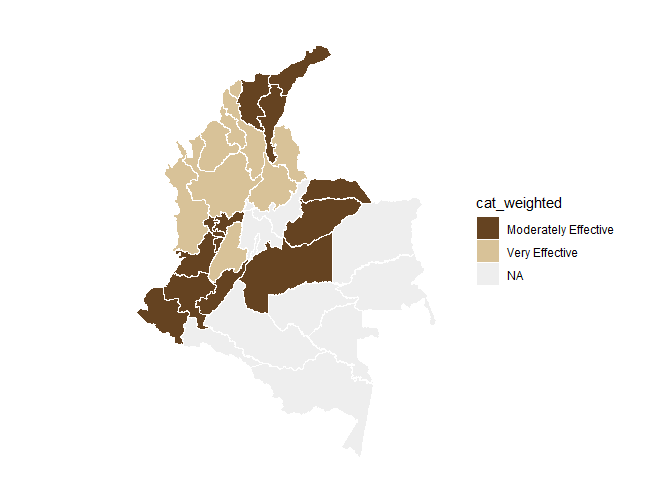<!-- -->

## Question 23: What is the efficacy perceived by producers of biological control (beneficial insects, microbial controls) in the prevention or management of banana diseases in the areas where you are an expert?

``` r
#selecting only question 23----
question_23<- filter(individual_surveys, question_number==23)
#unique(question_23$numeric_answer)
#dput(unique(question_23$answer_in_english))
#some experts selected more than one option in this question so an intermediate answer is chosen 
question_23 <- question_23 %>%
  mutate(answer_in_english = case_when(
    answer_in_english == "Extremely Effective,Unsure" ~ "Unsure",
    TRUE ~ answer_in_english  # This keeps all other values as they are
  ))
#some experts selected more than one option in this question so an intermediate answer is chosen 
question_23 <- question_23 %>%
  mutate(numeric_answer = case_when(
    numeric_answer == "5,6" ~ "6",
    TRUE ~ numeric_answer  # This keeps all other values as they are
  ))
#organizing the order of the levels
level_23<- c("Not Effective", "Slightly Effective", "Moderately Effective", "Very Effective","Extremely Effective", "Unsure")
question_23$answer_in_english<- factor(question_23$answer_in_english,levels = level_23)
question_23<- filter(question_23, answer_in_english!="Unsure")
#average by department (weighted and no weighted)
#not weighted 
avg_dept_no_weight_23<- question_23 %>%
  group_by(crop, expert_in) %>%
  mutate(numeric_answer=as.numeric(numeric_answer))%>%
  mutate(average= mean(numeric_answer)) %>%
  group_by(average)%>%
  mutate(ave_cat= category_by_mean_by_question(23, mean =average, language = "en"))
```

    ## Warning: There were 8 warnings in `mutate()`.
    ## The first warning was:
    ## ℹ In argument: `ave_cat = category_by_mean_by_question(23, mean = average,
    ##   language = "en")`.
    ## ℹ In group 0: .
    ## Caused by warning:
    ## ! There was 1 warning in `filter()`.
    ## ℹ In argument: `number == question & number_to_category == mean`.
    ## Caused by warning in `number_to_category == mean`:
    ## ! longer object length is not a multiple of shorter object length
    ## ℹ Run `dplyr::last_dplyr_warnings()` to see the 7 remaining warnings.

``` r
#weighted 
add_weights_question_23<- inner_join(question_23, experience_of_each_expert)
```

    ## Joining with `by = join_by(crop, expert_ID, expert_in)`

``` r
avg_dept_weight_23<- add_weights_question_23 %>%
  group_by(crop, expert_in) %>%
  mutate(numeric_answer=as.numeric(numeric_answer))%>%
  mutate(average_weighted= weighted.mean(numeric_answer, weights)) %>% 
  group_by(average_weighted)%>%
  mutate(ave_cat_weighted= category_by_mean_by_question(23, mean =average_weighted, language = "en"))
```

    ## Warning: There were 8 warnings in `mutate()`.
    ## The first warning was:
    ## ℹ In argument: `ave_cat_weighted = category_by_mean_by_question(23, mean =
    ##   average_weighted, language = "en")`.
    ## ℹ In group 0: .
    ## Caused by warning:
    ## ! There was 1 warning in `filter()`.
    ## ℹ In argument: `number == question & number_to_category == mean`.
    ## Caused by warning in `number_to_category == mean`:
    ## ! longer object length is not a multiple of shorter object length
    ## ℹ Run `dplyr::last_dplyr_warnings()` to see the 7 remaining warnings.

``` r
#finding the levels per crop (banana and plantain) no weighted
levels_per_crop_Q23_no_weighted<- tapply(avg_dept_no_weight_23$ave_cat, avg_dept_no_weight_23$crop, function(x){(unique(x))})
#generating a ramp palette according to the number of levels per crop
colors_banana_question23_no_weighted<- palette_banana(length(levels_per_crop_Q23_no_weighted$Banana))
colors_plantain_question23_no_weighted<- palette_plantain(length(levels_per_crop_Q23_no_weighted$Plantain))
#Assigning the colors by crop and answer
# Define the knowledge levels for each crop
levels_by_crop_no_weighted_23 <- list(
  Banana = levels_per_crop_Q23_no_weighted$Banana,
  Plantain = levels_per_crop_Q23_no_weighted$Plantain
)
# Define the colors for each crop
colors_by_crop_no_weighted_23 <- list(
  Banana = colors_banana_question23_no_weighted, # Replace with actual color vector for Banana
  Plantain = colors_plantain_question23_no_weighted # Replace with actual color vector for Plantain
  # Add more crops and their color vectors here if needed
)
# Now call the function
avg_dept_no_weight_23 <- assign_group_color(data = avg_dept_no_weight_23, levels_by_crop = levels_by_crop_no_weighted_23, colors_by_crop = colors_by_crop_no_weighted_23,answer_col =  "ave_cat")

#finding the levels per crop (banana and plantain) weighted
levels_per_crop_Q23_weighted<- tapply(avg_dept_weight_23$ave_cat_weighted, avg_dept_weight_23$crop, function(x){(unique(x))})
#generating a ramp palette according to the number of levels per crop
colors_banana_question23_weighted<- palette_banana(length(levels_per_crop_Q23_weighted$Banana))
colors_plantain_question23_weighted<- palette_plantain(length(levels_per_crop_Q23_weighted$Plantain))
#Assigning the colors by crop and answer
# Define the knowledge levels for each crop
levels_by_crop_weighted_23 <- list(
  Banana = levels_per_crop_Q23_weighted$Banana,
  Plantain = levels_per_crop_Q23_weighted$Plantain
)
# Define the colors for each crop
colors_by_crop_weighted_23 <- list(
  Banana = colors_banana_question23_weighted, # Replace with actual color vector for Banana
  Plantain = colors_plantain_question23_weighted # Replace with actual color vector for Plantain
  # Add more crops and their color vectors here if needed
)
# Now call the function
avg_dept_weight_23 <- assign_group_color(data = avg_dept_weight_23, levels_by_crop = levels_by_crop_weighted_23, colors_by_crop = colors_by_crop_weighted_23,answer_col =  "ave_cat_weighted")

#tree map
tree_map_3(data = avg_dept_no_weight_23, "crop", "expert_in", "ave_cat", "group_color", title="No weighted")
```

    ## `summarise()` has grouped output by 'crop', 'expert_in', 'ave_cat'. You can
    ## override using the `.groups` argument.

<!-- -->

    ## $tm
    ##        crop          expert_in              ave_cat vSize  vColor stdErr
    ## 1    Banana          Antioquia Moderately Effective    10 #FFDA00     10
    ## 2    Banana          Antioquia                 <NA>    10 #FFDA00     10
    ## 3    Banana             Caldas Moderately Effective     1 #FFDA00      1
    ## 4    Banana             Caldas                 <NA>     1 #FFDA00      1
    ## 5    Banana              Cesar                 <NA>     1 #FFE244      1
    ## 6    Banana              Cesar       Very Effective     1 #FFE244      1
    ## 7    Banana              Chocó                 <NA>     2 #FFEA88      2
    ## 8    Banana              Chocó   Slightly Effective     2 #FFEA88      2
    ## 9    Banana            Córdoba                 <NA>     1 #FFF2CC      1
    ## 10   Banana            Córdoba        Not Effective     1 #FFF2CC      1
    ## 11   Banana              Huila Moderately Effective     1 #FFDA00      1
    ## 12   Banana              Huila                 <NA>     1 #FFDA00      1
    ## 13   Banana         La Guajira Moderately Effective    10 #FFDA00     10
    ## 14   Banana         La Guajira                 <NA>    10 #FFDA00     10
    ## 15   Banana          Magdalena Moderately Effective    13 #FFDA00     13
    ## 16   Banana          Magdalena                 <NA>    13 #FFDA00     13
    ## 17   Banana               <NA>                 <NA>    41 #FFDA00     41
    ## 18   Banana            Quindío Moderately Effective     1 #FFDA00      1
    ## 19   Banana            Quindío                 <NA>     1 #FFDA00      1
    ## 20   Banana          Risaralda Moderately Effective     1 #FFDA00      1
    ## 21   Banana          Risaralda                 <NA>     1 #FFDA00      1
    ## 22 Plantain          Antioquia                 <NA>     2 #28B463      2
    ## 23 Plantain          Antioquia       Very Effective     2 #28B463      2
    ## 24 Plantain             Arauca                 <NA>     2 #BEF4BE      2
    ## 25 Plantain             Arauca   Slightly Effective     2 #BEF4BE      2
    ## 26 Plantain          Atlántico                 <NA>     1 #BEF4BE      1
    ## 27 Plantain          Atlántico   Slightly Effective     1 #BEF4BE      1
    ## 28 Plantain            Bolívar                 <NA>     1 #BEF4BE      1
    ## 29 Plantain            Bolívar   Slightly Effective     1 #BEF4BE      1
    ## 30 Plantain             Caldas Moderately Effective     7 #73D490      7
    ## 31 Plantain             Caldas                 <NA>     7 #73D490      7
    ## 32 Plantain           Casanare                 <NA>     2 #BEF4BE      2
    ## 33 Plantain           Casanare   Slightly Effective     2 #BEF4BE      2
    ## 34 Plantain            Córdoba                 <NA>     1 #BEF4BE      1
    ## 35 Plantain            Córdoba   Slightly Effective     1 #BEF4BE      1
    ## 36 Plantain              Huila Moderately Effective     1 #73D490      1
    ## 37 Plantain              Huila                 <NA>     1 #73D490      1
    ## 38 Plantain         La Guajira Moderately Effective     4 #73D490      4
    ## 39 Plantain         La Guajira                 <NA>     4 #73D490      4
    ## 40 Plantain          Magdalena                 <NA>     3 #BEF4BE      3
    ## 41 Plantain          Magdalena   Slightly Effective     3 #BEF4BE      3
    ## 42 Plantain               Meta Moderately Effective    10 #73D490     10
    ## 43 Plantain               Meta                 <NA>    10 #73D490     10
    ## 44 Plantain               <NA>                 <NA>    50 #BEF4BE     50
    ## 45 Plantain Norte De Santander                 <NA>     1 #BEF4BE      1
    ## 46 Plantain Norte De Santander   Slightly Effective     1 #BEF4BE      1
    ## 47 Plantain            Quindío Moderately Effective     5 #73D490      5
    ## 48 Plantain            Quindío                 <NA>     5 #73D490      5
    ## 49 Plantain          Risaralda Moderately Effective     7 #73D490      7
    ## 50 Plantain          Risaralda                 <NA>     7 #73D490      7
    ## 51 Plantain          Santander                 <NA>     1 #BEF4BE      1
    ## 52 Plantain          Santander   Slightly Effective     1 #BEF4BE      1
    ## 53 Plantain              Sucre                 <NA>     1 #BEF4BE      1
    ## 54 Plantain              Sucre   Slightly Effective     1 #BEF4BE      1
    ## 55 Plantain             Tolima                 <NA>     1 #BEF4BE      1
    ## 56 Plantain             Tolima   Slightly Effective     1 #BEF4BE      1
    ##    vColorValue level        x0         y0          w          h   color
    ## 1           NA     3 0.8041089 0.43902439 0.19589107 0.56097561 #FFDA00
    ## 2           NA     2 0.8041089 0.43902439 0.19589107 0.56097561 #FFDA00
    ## 3           NA     3 0.9332519 0.27439024 0.06674807 0.16463415 #FFDA00
    ## 4           NA     2 0.9332519 0.27439024 0.06674807 0.16463415 #FFDA00
    ## 5           NA     2 0.7997558 0.13719512 0.08009768 0.13719512 #FFE244
    ## 6           NA     3 0.7997558 0.13719512 0.08009768 0.13719512 #FFE244
    ## 7           NA     2 0.7997558 0.27439024 0.13349613 0.16463415 #FFEA88
    ## 8           NA     3 0.7997558 0.27439024 0.13349613 0.16463415 #FFEA88
    ## 9           NA     2 0.7997558 0.00000000 0.08009768 0.13719512 #FFF2CC
    ## 10          NA     3 0.7997558 0.00000000 0.08009768 0.13719512 #FFF2CC
    ## 11          NA     3 0.8798535 0.18292683 0.12014652 0.09146341 #FFDA00
    ## 12          NA     2 0.8798535 0.18292683 0.12014652 0.09146341 #FFDA00
    ## 13          NA     3 0.5494505 0.00000000 0.25030525 0.43902439 #FFDA00
    ## 14          NA     2 0.5494505 0.00000000 0.25030525 0.43902439 #FFDA00
    ## 15          NA     3 0.5494505 0.43902439 0.25465839 0.56097561 #FFDA00
    ## 16          NA     2 0.5494505 0.43902439 0.25465839 0.56097561 #FFDA00
    ## 17          NA     1 0.5494505 0.00000000 0.45054945 1.00000000 #FFDA00
    ## 18          NA     3 0.8798535 0.09146341 0.12014652 0.09146341 #FFDA00
    ## 19          NA     2 0.8798535 0.09146341 0.12014652 0.09146341 #FFDA00
    ## 20          NA     3 0.8798535 0.00000000 0.12014652 0.09146341 #FFDA00
    ## 21          NA     2 0.8798535 0.00000000 0.12014652 0.09146341 #FFDA00
    ## 22          NA     2 0.4717505 0.37714286 0.07770008 0.28285714 #28B463
    ## 23          NA     3 0.4717505 0.37714286 0.07770008 0.28285714 #28B463
    ## 24          NA     2 0.1998002 0.18857143 0.11655012 0.18857143 #BEF4BE
    ## 25          NA     3 0.1998002 0.18857143 0.11655012 0.18857143 #BEF4BE
    ## 26          NA     2 0.3163503 0.23571429 0.07770008 0.14142857 #BEF4BE
    ## 27          NA     3 0.3163503 0.23571429 0.07770008 0.14142857 #BEF4BE
    ## 28          NA     2 0.3940504 0.23571429 0.07770008 0.14142857 #BEF4BE
    ## 29          NA     3 0.3940504 0.23571429 0.07770008 0.14142857 #BEF4BE
    ## 30          NA     3 0.3232062 0.66000000 0.22624434 0.34000000 #73D490
    ## 31          NA     2 0.3232062 0.66000000 0.22624434 0.34000000 #73D490
    ## 32          NA     2 0.1998002 0.00000000 0.11655012 0.18857143 #BEF4BE
    ## 33          NA     3 0.1998002 0.00000000 0.11655012 0.18857143 #BEF4BE
    ## 34          NA     2 0.4717505 0.23571429 0.07770008 0.14142857 #BEF4BE
    ## 35          NA     3 0.4717505 0.23571429 0.07770008 0.14142857 #BEF4BE
    ## 36          NA     3 0.3163503 0.11785714 0.09324009 0.11785714 #73D490
    ## 37          NA     2 0.3163503 0.11785714 0.09324009 0.11785714 #73D490
    ## 38          NA     3 0.1998002 0.37714286 0.15540016 0.28285714 #73D490
    ## 39          NA     2 0.1998002 0.37714286 0.15540016 0.28285714 #73D490
    ## 40          NA     2 0.3552004 0.37714286 0.11655012 0.28285714 #BEF4BE
    ## 41          NA     3 0.3552004 0.37714286 0.11655012 0.28285714 #BEF4BE
    ## 42          NA     3 0.0000000 0.66000000 0.32320621 0.34000000 #73D490
    ## 43          NA     2 0.0000000 0.66000000 0.32320621 0.34000000 #73D490
    ## 44          NA     1 0.0000000 0.00000000 0.54945055 1.00000000 #BEF4BE
    ## 45          NA     2 0.3163503 0.00000000 0.09324009 0.11785714 #BEF4BE
    ## 46          NA     3 0.3163503 0.00000000 0.09324009 0.11785714 #BEF4BE
    ## 47          NA     3 0.0000000 0.00000000 0.19980020 0.27500000 #73D490
    ## 48          NA     2 0.0000000 0.00000000 0.19980020 0.27500000 #73D490
    ## 49          NA     3 0.0000000 0.27500000 0.19980020 0.38500000 #73D490
    ## 50          NA     2 0.0000000 0.27500000 0.19980020 0.38500000 #73D490
    ## 51          NA     2 0.4095904 0.07857143 0.06993007 0.15714286 #BEF4BE
    ## 52          NA     3 0.4095904 0.07857143 0.06993007 0.15714286 #BEF4BE
    ## 53          NA     2 0.4795205 0.07857143 0.06993007 0.15714286 #BEF4BE
    ## 54          NA     3 0.4795205 0.07857143 0.06993007 0.15714286 #BEF4BE
    ## 55          NA     2 0.4095904 0.00000000 0.13986014 0.07857143 #BEF4BE
    ## 56          NA     3 0.4095904 0.00000000 0.13986014 0.07857143 #BEF4BE
    ## 
    ## $type
    ## [1] "color"
    ## 
    ## $vSize
    ## [1] "frequency"
    ## 
    ## $vColor
    ## [1] "group_color"
    ## 
    ## $stdErr
    ## [1] "frequency"
    ## 
    ## $algorithm
    ## [1] "pivotSize"
    ## 
    ## $vpCoorX
    ## [1] 0.02812148 0.97187852
    ## 
    ## $vpCoorY
    ## [1] 0.01968504 0.91031496
    ## 
    ## $aspRatio
    ## [1] 1.483512
    ## 
    ## $range
    ## [1] NA NA
    ## 
    ## $mapping
    ## [1] NA NA NA
    ## 
    ## $draw
    ## [1] TRUE

``` r
tree_map_3(data = avg_dept_weight_23, "crop", "expert_in", "ave_cat_weighted", "group_color", title="weighted")
```

    ## `summarise()` has grouped output by 'crop', 'expert_in', 'ave_cat_weighted'.
    ## You can override using the `.groups` argument.

<!-- -->

    ## $tm
    ##        crop          expert_in     ave_cat_weighted vSize  vColor stdErr
    ## 1    Banana          Antioquia Moderately Effective    10 #FFDA00     10
    ## 2    Banana          Antioquia                 <NA>    10 #FFDA00     10
    ## 3    Banana             Caldas Moderately Effective     1 #FFDA00      1
    ## 4    Banana             Caldas                 <NA>     1 #FFDA00      1
    ## 5    Banana              Cesar                 <NA>     1 #FFE566      1
    ## 6    Banana              Cesar       Very Effective     1 #FFE566      1
    ## 7    Banana              Chocó                 <NA>     2 #FFF2CC      2
    ## 8    Banana              Chocó        Not Effective     2 #FFF2CC      2
    ## 9    Banana            Córdoba                 <NA>     1 #FFF2CC      1
    ## 10   Banana            Córdoba        Not Effective     1 #FFF2CC      1
    ## 11   Banana              Huila Moderately Effective     1 #FFDA00      1
    ## 12   Banana              Huila                 <NA>     1 #FFDA00      1
    ## 13   Banana         La Guajira Moderately Effective     9 #FFDA00      9
    ## 14   Banana         La Guajira                 <NA>     9 #FFDA00      9
    ## 15   Banana          Magdalena Moderately Effective    12 #FFDA00     12
    ## 16   Banana          Magdalena                 <NA>    12 #FFDA00     12
    ## 17   Banana               <NA>                 <NA>    39 #FFDA00     39
    ## 18   Banana            Quindío Moderately Effective     1 #FFDA00      1
    ## 19   Banana            Quindío                 <NA>     1 #FFDA00      1
    ## 20   Banana          Risaralda Moderately Effective     1 #FFDA00      1
    ## 21   Banana          Risaralda                 <NA>     1 #FFDA00      1
    ## 22 Plantain          Antioquia Moderately Effective     2 #28B463      2
    ## 23 Plantain          Antioquia                 <NA>     2 #28B463      2
    ## 24 Plantain             Arauca Moderately Effective     2 #28B463      2
    ## 25 Plantain             Arauca                 <NA>     2 #28B463      2
    ## 26 Plantain          Atlántico                 <NA>     1 #BEF4BE      1
    ## 27 Plantain          Atlántico   Slightly Effective     1 #BEF4BE      1
    ## 28 Plantain            Bolívar                 <NA>     1 #BEF4BE      1
    ## 29 Plantain            Bolívar   Slightly Effective     1 #BEF4BE      1
    ## 30 Plantain             Caldas Moderately Effective     7 #28B463      7
    ## 31 Plantain             Caldas                 <NA>     7 #28B463      7
    ## 32 Plantain           Casanare                 <NA>     2 #BEF4BE      2
    ## 33 Plantain           Casanare   Slightly Effective     2 #BEF4BE      2
    ## 34 Plantain            Córdoba                 <NA>     1 #BEF4BE      1
    ## 35 Plantain            Córdoba   Slightly Effective     1 #BEF4BE      1
    ## 36 Plantain              Huila Moderately Effective     1 #28B463      1
    ## 37 Plantain              Huila                 <NA>     1 #28B463      1
    ## 38 Plantain         La Guajira Moderately Effective     4 #28B463      4
    ## 39 Plantain         La Guajira                 <NA>     4 #28B463      4
    ## 40 Plantain          Magdalena                 <NA>     3 #BEF4BE      3
    ## 41 Plantain          Magdalena   Slightly Effective     3 #BEF4BE      3
    ## 42 Plantain               Meta Moderately Effective    10 #28B463     10
    ## 43 Plantain               Meta                 <NA>    10 #28B463     10
    ## 44 Plantain               <NA>                 <NA>    50 #BEF4BE     50
    ## 45 Plantain Norte De Santander                 <NA>     1 #BEF4BE      1
    ## 46 Plantain Norte De Santander   Slightly Effective     1 #BEF4BE      1
    ## 47 Plantain            Quindío Moderately Effective     5 #28B463      5
    ## 48 Plantain            Quindío                 <NA>     5 #28B463      5
    ## 49 Plantain          Risaralda Moderately Effective     7 #28B463      7
    ## 50 Plantain          Risaralda                 <NA>     7 #28B463      7
    ## 51 Plantain          Santander                 <NA>     1 #BEF4BE      1
    ## 52 Plantain          Santander   Slightly Effective     1 #BEF4BE      1
    ## 53 Plantain              Sucre                 <NA>     1 #BEF4BE      1
    ## 54 Plantain              Sucre   Slightly Effective     1 #BEF4BE      1
    ## 55 Plantain             Tolima                 <NA>     1 #BEF4BE      1
    ## 56 Plantain             Tolima   Slightly Effective     1 #BEF4BE      1
    ##    vColorValue level        x0         y0          w          h   color
    ## 1           NA     3 0.8008172 0.43589744 0.19918284 0.56410256 #FFDA00
    ## 2           NA     2 0.8008172 0.43589744 0.19918284 0.56410256 #FFDA00
    ## 3           NA     3 0.8453404 0.29059829 0.07732981 0.14529915 #FFDA00
    ## 4           NA     2 0.8453404 0.29059829 0.07732981 0.14529915 #FFDA00
    ## 5           NA     2 0.9226702 0.29059829 0.07732981 0.14529915 #FFE566
    ## 6           NA     3 0.9226702 0.29059829 0.07732981 0.14529915 #FFE566
    ## 7           NA     2 0.5617978 0.00000000 0.28354263 0.07925408 #FFF2CC
    ## 8           NA     3 0.5617978 0.00000000 0.28354263 0.07925408 #FFF2CC
    ## 9           NA     2 0.8453404 0.14529915 0.07732981 0.14529915 #FFF2CC
    ## 10          NA     3 0.8453404 0.14529915 0.07732981 0.14529915 #FFF2CC
    ## 11          NA     3 0.9226702 0.14529915 0.07732981 0.14529915 #FFDA00
    ## 12          NA     2 0.9226702 0.14529915 0.07732981 0.14529915 #FFDA00
    ## 13          NA     3 0.5617978 0.07925408 0.28354263 0.35664336 #FFDA00
    ## 14          NA     2 0.5617978 0.07925408 0.28354263 0.35664336 #FFDA00
    ## 15          NA     3 0.5617978 0.43589744 0.23901941 0.56410256 #FFDA00
    ## 16          NA     2 0.5617978 0.43589744 0.23901941 0.56410256 #FFDA00
    ## 17          NA     1 0.5617978 0.00000000 0.43820225 1.00000000 #FFDA00
    ## 18          NA     3 0.8453404 0.00000000 0.07732981 0.14529915 #FFDA00
    ## 19          NA     2 0.8453404 0.00000000 0.07732981 0.14529915 #FFDA00
    ## 20          NA     3 0.9226702 0.00000000 0.07732981 0.14529915 #FFDA00
    ## 21          NA     2 0.9226702 0.00000000 0.07732981 0.14529915 #FFDA00
    ## 22          NA     3 0.1944685 0.14857143 0.15125324 0.14857143 #28B463
    ## 23          NA     2 0.1944685 0.14857143 0.15125324 0.14857143 #28B463
    ## 24          NA     3 0.1944685 0.00000000 0.15125324 0.14857143 #28B463
    ## 25          NA     2 0.1944685 0.00000000 0.15125324 0.14857143 #28B463
    ## 26          NA     2 0.4537597 0.41600000 0.10803803 0.10400000 #BEF4BE
    ## 27          NA     3 0.4537597 0.41600000 0.10803803 0.10400000 #BEF4BE
    ## 28          NA     2 0.4537597 0.31200000 0.10803803 0.10400000 #BEF4BE
    ## 29          NA     3 0.4537597 0.31200000 0.10803803 0.10400000 #BEF4BE
    ## 30          NA     3 0.2340824 0.52000000 0.16385768 0.48000000 #28B463
    ## 31          NA     2 0.2340824 0.52000000 0.16385768 0.48000000 #28B463
    ## 32          NA     2 0.3457217 0.31200000 0.10803803 0.20800000 #BEF4BE
    ## 33          NA     3 0.3457217 0.31200000 0.10803803 0.20800000 #BEF4BE
    ## 34          NA     2 0.3457217 0.15600000 0.07202535 0.15600000 #BEF4BE
    ## 35          NA     3 0.3457217 0.15600000 0.07202535 0.15600000 #BEF4BE
    ## 36          NA     3 0.3457217 0.00000000 0.07202535 0.15600000 #28B463
    ## 37          NA     2 0.3457217 0.00000000 0.07202535 0.15600000 #28B463
    ## 38          NA     3 0.0000000 0.00000000 0.19446845 0.23111111 #28B463
    ## 39          NA     2 0.0000000 0.00000000 0.19446845 0.23111111 #28B463
    ## 40          NA     2 0.1944685 0.29714286 0.15125324 0.22285714 #BEF4BE
    ## 41          NA     3 0.1944685 0.29714286 0.15125324 0.22285714 #BEF4BE
    ## 42          NA     3 0.0000000 0.52000000 0.23408240 0.48000000 #28B463
    ## 43          NA     2 0.0000000 0.52000000 0.23408240 0.48000000 #28B463
    ## 44          NA     1 0.0000000 0.00000000 0.56179775 1.00000000 #BEF4BE
    ## 45          NA     2 0.4177470 0.15600000 0.07202535 0.15600000 #BEF4BE
    ## 46          NA     3 0.4177470 0.15600000 0.07202535 0.15600000 #BEF4BE
    ## 47          NA     3 0.0000000 0.23111111 0.19446845 0.28888889 #28B463
    ## 48          NA     2 0.0000000 0.23111111 0.19446845 0.28888889 #28B463
    ## 49          NA     3 0.3979401 0.52000000 0.16385768 0.48000000 #28B463
    ## 50          NA     2 0.3979401 0.52000000 0.16385768 0.48000000 #28B463
    ## 51          NA     2 0.4897724 0.15600000 0.07202535 0.15600000 #BEF4BE
    ## 52          NA     3 0.4897724 0.15600000 0.07202535 0.15600000 #BEF4BE
    ## 53          NA     2 0.4177470 0.00000000 0.07202535 0.15600000 #BEF4BE
    ## 54          NA     3 0.4177470 0.00000000 0.07202535 0.15600000 #BEF4BE
    ## 55          NA     2 0.4897724 0.00000000 0.07202535 0.15600000 #BEF4BE
    ## 56          NA     3 0.4897724 0.00000000 0.07202535 0.15600000 #BEF4BE
    ## 
    ## $type
    ## [1] "color"
    ## 
    ## $vSize
    ## [1] "frequency"
    ## 
    ## $vColor
    ## [1] "group_color"
    ## 
    ## $stdErr
    ## [1] "frequency"
    ## 
    ## $algorithm
    ## [1] "pivotSize"
    ## 
    ## $vpCoorX
    ## [1] 0.02812148 0.97187852
    ## 
    ## $vpCoorY
    ## [1] 0.01968504 0.91031496
    ## 
    ## $aspRatio
    ## [1] 1.483512
    ## 
    ## $range
    ## [1] NA NA
    ## 
    ## $mapping
    ## [1] NA NA NA
    ## 
    ## $draw
    ## [1] TRUE

``` r
#Map of Colombia  
#non weighted
nal_q23_no_weight<- question_23 %>% group_by(expert_in) %>%
  summarise(average= mean(as.numeric(numeric_answer))) %>%
  group_by(average) %>% 
  mutate(cat= category_by_mean_by_question(language = "en", mean = average, question =23))%>%
  rename(EKE.expert.in = expert_in)
```

    ## Warning: There was 1 warning in `mutate()`.
    ## ℹ In argument: `cat = category_by_mean_by_question(...)`.
    ## ℹ In group 0: .
    ## Caused by warning:
    ## ! There was 1 warning in `filter()`.
    ## ℹ In argument: `number == question & number_to_category == mean`.
    ## Caused by warning in `number_to_category == mean`:
    ## ! longer object length is not a multiple of shorter object length

``` r
nal_q23_no_weight<- full_join(codes_department, nal_q23_no_weight)
```

    ## Joining with `by = join_by(EKE.expert.in)`

``` r
nal_q23_no_weight$cat<- factor(nal_q23_no_weight$cat, levels = level_23)
colmap(departamentos, data = nal_q23_no_weight, data_id = "id_depto", var = "cat")+
  scale_fill_manual(values = palette_soil(length(unique(nal_q23_no_weight$cat))-1), na.value = "#eeeeee")
```

    ## Scale for fill is already present.
    ## Adding another scale for fill, which will replace the existing scale.

<!-- -->

``` r
# weighted
nal_q23_weight<- inner_join(question_23, experience_of_each_expert)
```

    ## Joining with `by = join_by(crop, expert_ID, expert_in)`

``` r
nal_q23_weight<- nal_q23_weight %>%
  group_by(expert_in) %>%
  mutate(numeric_answer=as.numeric(numeric_answer)) %>%
  summarise(average_weighted= weighted.mean(numeric_answer, weights)) %>% 
  group_by(average_weighted) %>%
  mutate(cat_weighted= category_by_mean_by_question(language = "en", mean = average_weighted, question =23)) %>%
  rename(EKE.expert.in=expert_in)

nal_q23_weight<- full_join(codes_department, nal_q23_weight)
```

    ## Joining with `by = join_by(EKE.expert.in)`

``` r
nal_q23_weight$cat_weighted<- factor(nal_q23_weight$cat_weighted, levels = level_23)
colmap(departamentos, data = nal_q23_weight, data_id = "id_depto", var = "cat_weighted")+
  scale_fill_manual(values = palette_soil(length(unique(nal_q23_weight$cat))-1), na.value = "#eeeeee")
```

    ## Scale for fill is already present.
    ## Adding another scale for fill, which will replace the existing scale.

<!-- -->

## Question 24: What is the efficacy perceived by producers of cultural control (crop rotation, sanitation) in the prevention or management of banana diseases in the areas where you are an expert?

``` r
#selecting only question 24----
question_24<- filter(individual_surveys, question_number==24)
#unique(question_24$numeric_answer)
#dput(unique(question_24$answer_in_english))
#organizing the order of the levels
level_24<- c("Not Effective", "Slightly Effective", "Moderately Effective", "Very Effective","Extremely Effective", "Unsure")
question_24$answer_in_english<- factor(question_24$answer_in_english,levels = level_24)
question_24<- filter(question_24, answer_in_english!="Unsure")
#average by department (weighted and no weighted)
#not weighted 
avg_dept_no_weight_24<- question_24 %>%
  group_by(crop, expert_in) %>%
  mutate(numeric_answer=as.numeric(numeric_answer))%>%
  mutate(average= mean(numeric_answer)) %>%
  group_by(average)%>%
  mutate(ave_cat= category_by_mean_by_question(24, mean =average, language = "en"))
```

    ## Warning: There were 6 warnings in `mutate()`.
    ## The first warning was:
    ## ℹ In argument: `ave_cat = category_by_mean_by_question(24, mean = average,
    ##   language = "en")`.
    ## ℹ In group 0: .
    ## Caused by warning:
    ## ! There was 1 warning in `filter()`.
    ## ℹ In argument: `number == question & number_to_category == mean`.
    ## Caused by warning in `number_to_category == mean`:
    ## ! longer object length is not a multiple of shorter object length
    ## ℹ Run `dplyr::last_dplyr_warnings()` to see the 5 remaining warnings.

``` r
#weighted 
add_weights_question_24<- inner_join(question_24, experience_of_each_expert)
```

    ## Joining with `by = join_by(crop, expert_ID, expert_in)`

``` r
avg_dept_weight_24<- add_weights_question_24 %>%
  group_by(crop, expert_in) %>%
  mutate(numeric_answer=as.numeric(numeric_answer))%>%
  mutate(average_weighted= weighted.mean(numeric_answer, weights)) %>% 
  group_by(average_weighted)%>%
  mutate(ave_cat_weighted= category_by_mean_by_question(24, mean =average_weighted, language = "en"))
```

    ## Warning: There were 9 warnings in `mutate()`.
    ## The first warning was:
    ## ℹ In argument: `ave_cat_weighted = category_by_mean_by_question(24, mean =
    ##   average_weighted, language = "en")`.
    ## ℹ In group 0: .
    ## Caused by warning:
    ## ! There was 1 warning in `filter()`.
    ## ℹ In argument: `number == question & number_to_category == mean`.
    ## Caused by warning in `number_to_category == mean`:
    ## ! longer object length is not a multiple of shorter object length
    ## ℹ Run `dplyr::last_dplyr_warnings()` to see the 8 remaining warnings.

``` r
#finding the levels per crop (banana and plantain) no weighted
levels_per_crop_Q24_no_weighted<- tapply(avg_dept_no_weight_24$ave_cat, avg_dept_no_weight_24$crop, function(x){(unique(x))})
#generating a ramp palette according to the number of levels per crop
colors_banana_question24_no_weighted<- palette_banana(length(levels_per_crop_Q24_no_weighted$Banana))
colors_plantain_question24_no_weighted<- palette_plantain(length(levels_per_crop_Q24_no_weighted$Plantain))
#Assigning the colors by crop and answer
# Define the knowledge levels for each crop
levels_by_crop_no_weighted_24 <- list(
  Banana = levels_per_crop_Q24_no_weighted$Banana,
  Plantain = levels_per_crop_Q24_no_weighted$Plantain
)
# Define the colors for each crop
colors_by_crop_no_weighted_24 <- list(
  Banana = colors_banana_question24_no_weighted, # Replace with actual color vector for Banana
  Plantain = colors_plantain_question24_no_weighted # Replace with actual color vector for Plantain
  # Add more crops and their color vectors here if needed
)
# Now call the function
avg_dept_no_weight_24 <- assign_group_color(data = avg_dept_no_weight_24, levels_by_crop = levels_by_crop_no_weighted_24, colors_by_crop = colors_by_crop_no_weighted_24,answer_col =  "ave_cat")

#finding the levels per crop (banana and plantain) weighted
levels_per_crop_Q24_weighted<- tapply(avg_dept_weight_24$ave_cat_weighted, avg_dept_weight_24$crop, function(x){(unique(x))})
#generating a ramp palette according to the number of levels per crop
colors_banana_question24_weighted<- palette_banana(length(levels_per_crop_Q24_weighted$Banana))
colors_plantain_question24_weighted<- palette_plantain(length(levels_per_crop_Q24_weighted$Plantain))
#Assigning the colors by crop and answer
# Define the knowledge levels for each crop
levels_by_crop_weighted_24 <- list(
  Banana = levels_per_crop_Q24_weighted$Banana,
  Plantain = levels_per_crop_Q24_weighted$Plantain
)
# Define the colors for each crop
colors_by_crop_weighted_24 <- list(
  Banana = colors_banana_question24_weighted, # Replace with actual color vector for Banana
  Plantain = colors_plantain_question24_weighted # Replace with actual color vector for Plantain
  # Add more crops and their color vectors here if needed
)
# Now call the function
avg_dept_weight_24 <- assign_group_color(data = avg_dept_weight_24, levels_by_crop = levels_by_crop_weighted_24, colors_by_crop = colors_by_crop_weighted_24,answer_col =  "ave_cat_weighted")

#tree map
tree_map_3(data = avg_dept_no_weight_24, "crop", "expert_in", "ave_cat", "group_color", title="No weighted")
```

    ## `summarise()` has grouped output by 'crop', 'expert_in', 'ave_cat'. You can
    ## override using the `.groups` argument.

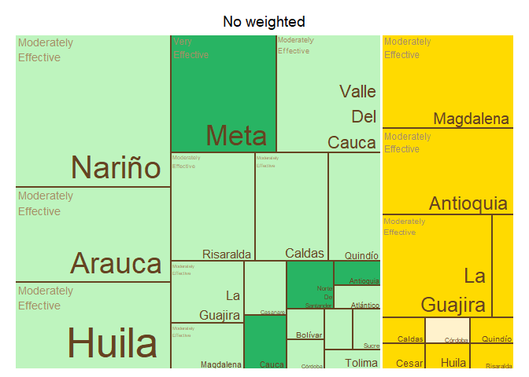<!-- -->

    ## $tm
    ##        crop          expert_in              ave_cat vSize  vColor stdErr
    ## 1    Banana          Antioquia Moderately Effective    10 #FFDA00     10
    ## 2    Banana          Antioquia                 <NA>    10 #FFDA00     10
    ## 3    Banana             Caldas Moderately Effective     1 #FFDA00      1
    ## 4    Banana             Caldas                 <NA>     1 #FFDA00      1
    ## 5    Banana              Cesar Moderately Effective     1 #FFDA00      1
    ## 6    Banana              Cesar                 <NA>     1 #FFDA00      1
    ## 7    Banana              Chocó Moderately Effective     2 #FFDA00      2
    ## 8    Banana              Chocó                 <NA>     2 #FFDA00      2
    ## 9    Banana            Córdoba                 <NA>     1 #FFF2CC      1
    ## 10   Banana            Córdoba   Slightly Effective     1 #FFF2CC      1
    ## 11   Banana              Huila Moderately Effective     1 #FFDA00      1
    ## 12   Banana              Huila                 <NA>     1 #FFDA00      1
    ## 13   Banana         La Guajira Moderately Effective    10 #FFDA00     10
    ## 14   Banana         La Guajira                 <NA>    10 #FFDA00     10
    ## 15   Banana          Magdalena Moderately Effective    11 #FFDA00     11
    ## 16   Banana          Magdalena                 <NA>    11 #FFDA00     11
    ## 17   Banana               <NA>                 <NA>    39 #FFDA00     39
    ## 18   Banana            Quindío Moderately Effective     1 #FFDA00      1
    ## 19   Banana            Quindío                 <NA>     1 #FFDA00      1
    ## 20   Banana          Risaralda Moderately Effective     1 #FFDA00      1
    ## 21   Banana          Risaralda                 <NA>     1 #FFDA00      1
    ## 22 Plantain          Antioquia                 <NA>     1 #28B463      1
    ## 23 Plantain          Antioquia       Very Effective     1 #28B463      1
    ## 24 Plantain             Arauca                 <NA>     2 #28B463      2
    ## 25 Plantain             Arauca       Very Effective     2 #28B463      2
    ## 26 Plantain          Atlántico Moderately Effective     1 #BEF4BE      1
    ## 27 Plantain          Atlántico                 <NA>     1 #BEF4BE      1
    ## 28 Plantain            Bolívar Moderately Effective     1 #BEF4BE      1
    ## 29 Plantain            Bolívar                 <NA>     1 #BEF4BE      1
    ## 30 Plantain             Caldas Moderately Effective     6 #BEF4BE      6
    ## 31 Plantain             Caldas                 <NA>     6 #BEF4BE      6
    ## 32 Plantain           Casanare Moderately Effective     2 #BEF4BE      2
    ## 33 Plantain           Casanare                 <NA>     2 #BEF4BE      2
    ## 34 Plantain            Córdoba Moderately Effective     1 #BEF4BE      1
    ## 35 Plantain            Córdoba                 <NA>     1 #BEF4BE      1
    ## 36 Plantain              Huila Moderately Effective     1 #BEF4BE      1
    ## 37 Plantain              Huila                 <NA>     1 #BEF4BE      1
    ## 38 Plantain         La Guajira Moderately Effective     4 #BEF4BE      4
    ## 39 Plantain         La Guajira                 <NA>     4 #BEF4BE      4
    ## 40 Plantain          Magdalena Moderately Effective     3 #BEF4BE      3
    ## 41 Plantain          Magdalena                 <NA>     3 #BEF4BE      3
    ## 42 Plantain               Meta                 <NA>    11 #28B463     11
    ## 43 Plantain               Meta       Very Effective    11 #28B463     11
    ## 44 Plantain               <NA>                 <NA>    50 #BEF4BE     50
    ## 45 Plantain Norte De Santander                 <NA>     1 #28B463      1
    ## 46 Plantain Norte De Santander       Very Effective     1 #28B463      1
    ## 47 Plantain            Quindío Moderately Effective     5 #BEF4BE      5
    ## 48 Plantain            Quindío                 <NA>     5 #BEF4BE      5
    ## 49 Plantain          Risaralda Moderately Effective     8 #BEF4BE      8
    ## 50 Plantain          Risaralda                 <NA>     8 #BEF4BE      8
    ## 51 Plantain          Santander Moderately Effective     1 #BEF4BE      1
    ## 52 Plantain          Santander                 <NA>     1 #BEF4BE      1
    ## 53 Plantain              Sucre Moderately Effective     1 #BEF4BE      1
    ## 54 Plantain              Sucre                 <NA>     1 #BEF4BE      1
    ## 55 Plantain             Tolima Moderately Effective     1 #BEF4BE      1
    ## 56 Plantain             Tolima                 <NA>     1 #BEF4BE      1
    ##    vColorValue level        x0         y0          w          h   color
    ## 1           NA     3 0.7913323 0.46153846 0.20866774 0.53846154 #FFDA00
    ## 2           NA     2 0.7913323 0.46153846 0.20866774 0.53846154 #FFDA00
    ## 3           NA     3 0.8539326 0.30769231 0.07303371 0.15384615 #FFDA00
    ## 4           NA     2 0.8539326 0.30769231 0.07303371 0.15384615 #FFDA00
    ## 5           NA     3 0.9269663 0.30769231 0.07303371 0.15384615 #FFDA00
    ## 6           NA     2 0.9269663 0.30769231 0.07303371 0.15384615 #FFDA00
    ## 7           NA     3 0.5617978 0.00000000 0.29213483 0.07692308 #FFDA00
    ## 8           NA     2 0.5617978 0.00000000 0.29213483 0.07692308 #FFDA00
    ## 9           NA     2 0.8539326 0.15384615 0.07303371 0.15384615 #FFF2CC
    ## 10          NA     3 0.8539326 0.15384615 0.07303371 0.15384615 #FFF2CC
    ## 11          NA     3 0.9269663 0.15384615 0.07303371 0.15384615 #FFDA00
    ## 12          NA     2 0.9269663 0.15384615 0.07303371 0.15384615 #FFDA00
    ## 13          NA     3 0.5617978 0.07692308 0.29213483 0.38461538 #FFDA00
    ## 14          NA     2 0.5617978 0.07692308 0.29213483 0.38461538 #FFDA00
    ## 15          NA     3 0.5617978 0.46153846 0.22953451 0.53846154 #FFDA00
    ## 16          NA     2 0.5617978 0.46153846 0.22953451 0.53846154 #FFDA00
    ## 17          NA     1 0.5617978 0.00000000 0.43820225 1.00000000 #FFDA00
    ## 18          NA     3 0.8539326 0.00000000 0.07303371 0.15384615 #FFDA00
    ## 19          NA     2 0.8539326 0.00000000 0.07303371 0.15384615 #FFDA00
    ## 20          NA     3 0.9269663 0.00000000 0.07303371 0.15384615 #FFDA00
    ## 21          NA     2 0.9269663 0.00000000 0.07303371 0.15384615 #FFDA00
    ## 22          NA     2 0.1993476 0.00000000 0.06590003 0.17050000 #28B463
    ## 23          NA     3 0.1993476 0.00000000 0.06590003 0.17050000 #28B463
    ## 24          NA     2 0.4812533 0.34100000 0.08054448 0.27900000 #28B463
    ## 25          NA     3 0.4812533 0.34100000 0.08054448 0.27900000 #28B463
    ## 26          NA     3 0.2652476 0.00000000 0.06590003 0.17050000 #BEF4BE
    ## 27          NA     2 0.2652476 0.00000000 0.06590003 0.17050000 #BEF4BE
    ## 28          NA     3 0.3311476 0.22733333 0.09885004 0.11366667 #BEF4BE
    ## 29          NA     2 0.3311476 0.22733333 0.09885004 0.11366667 #BEF4BE
    ## 30          NA     3 0.0000000 0.28181818 0.19934759 0.33818182 #BEF4BE
    ## 31          NA     2 0.0000000 0.28181818 0.19934759 0.33818182 #BEF4BE
    ## 32          NA     3 0.1993476 0.17050000 0.13180006 0.17050000 #BEF4BE
    ## 33          NA     2 0.1993476 0.17050000 0.13180006 0.17050000 #BEF4BE
    ## 34          NA     3 0.3311476 0.11366667 0.09885004 0.11366667 #BEF4BE
    ## 35          NA     2 0.3311476 0.11366667 0.09885004 0.11366667 #BEF4BE
    ## 36          NA     3 0.3311476 0.00000000 0.09885004 0.11366667 #BEF4BE
    ## 37          NA     2 0.3311476 0.00000000 0.09885004 0.11366667 #BEF4BE
    ## 38          NA     3 0.1993476 0.34100000 0.16108896 0.27900000 #BEF4BE
    ## 39          NA     2 0.1993476 0.34100000 0.16108896 0.27900000 #BEF4BE
    ## 40          NA     3 0.3604366 0.34100000 0.12081672 0.27900000 #BEF4BE
    ## 41          NA     2 0.3604366 0.34100000 0.12081672 0.27900000 #BEF4BE
    ## 42          NA     2 0.0000000 0.62000000 0.32525133 0.38000000 #28B463
    ## 43          NA     3 0.0000000 0.62000000 0.32525133 0.38000000 #28B463
    ## 44          NA     1 0.0000000 0.00000000 0.56179775 1.00000000 #BEF4BE
    ## 45          NA     2 0.4299977 0.17050000 0.06590003 0.17050000 #28B463
    ## 46          NA     3 0.4299977 0.17050000 0.06590003 0.17050000 #28B463
    ## 47          NA     3 0.0000000 0.00000000 0.19934759 0.28181818 #BEF4BE
    ## 48          NA     2 0.0000000 0.00000000 0.19934759 0.28181818 #BEF4BE
    ## 49          NA     3 0.3252513 0.62000000 0.23654642 0.38000000 #BEF4BE
    ## 50          NA     2 0.3252513 0.62000000 0.23654642 0.38000000 #BEF4BE
    ## 51          NA     3 0.4958977 0.17050000 0.06590003 0.17050000 #BEF4BE
    ## 52          NA     2 0.4958977 0.17050000 0.06590003 0.17050000 #BEF4BE
    ## 53          NA     3 0.4299977 0.00000000 0.06590003 0.17050000 #BEF4BE
    ## 54          NA     2 0.4299977 0.00000000 0.06590003 0.17050000 #BEF4BE
    ## 55          NA     3 0.4958977 0.00000000 0.06590003 0.17050000 #BEF4BE
    ## 56          NA     2 0.4958977 0.00000000 0.06590003 0.17050000 #BEF4BE
    ## 
    ## $type
    ## [1] "color"
    ## 
    ## $vSize
    ## [1] "frequency"
    ## 
    ## $vColor
    ## [1] "group_color"
    ## 
    ## $stdErr
    ## [1] "frequency"
    ## 
    ## $algorithm
    ## [1] "pivotSize"
    ## 
    ## $vpCoorX
    ## [1] 0.02812148 0.97187852
    ## 
    ## $vpCoorY
    ## [1] 0.01968504 0.91031496
    ## 
    ## $aspRatio
    ## [1] 1.483512
    ## 
    ## $range
    ## [1] NA NA
    ## 
    ## $mapping
    ## [1] NA NA NA
    ## 
    ## $draw
    ## [1] TRUE

``` r
tree_map_3(data = avg_dept_weight_24, "crop", "expert_in", "ave_cat_weighted", "group_color", title="weighted")
```

    ## `summarise()` has grouped output by 'crop', 'expert_in', 'ave_cat_weighted'.
    ## You can override using the `.groups` argument.

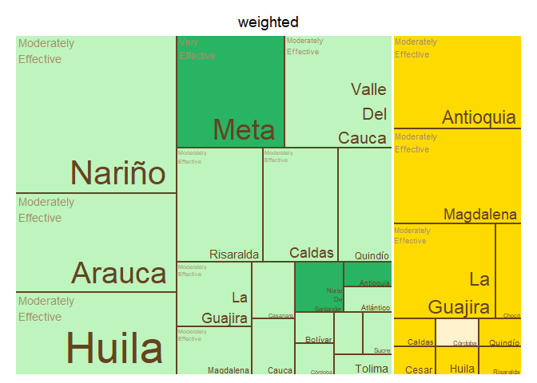<!-- -->

    ## $tm
    ##        crop          expert_in     ave_cat_weighted vSize  vColor stdErr
    ## 1    Banana          Antioquia Moderately Effective    10 #FFDA00     10
    ## 2    Banana          Antioquia                 <NA>    10 #FFDA00     10
    ## 3    Banana             Caldas Moderately Effective     1 #FFDA00      1
    ## 4    Banana             Caldas                 <NA>     1 #FFDA00      1
    ## 5    Banana              Cesar Moderately Effective     1 #FFDA00      1
    ## 6    Banana              Cesar                 <NA>     1 #FFDA00      1
    ## 7    Banana              Chocó Moderately Effective     2 #FFDA00      2
    ## 8    Banana              Chocó                 <NA>     2 #FFDA00      2
    ## 9    Banana            Córdoba                 <NA>     1 #FFF2CC      1
    ## 10   Banana            Córdoba   Slightly Effective     1 #FFF2CC      1
    ## 11   Banana              Huila Moderately Effective     1 #FFDA00      1
    ## 12   Banana              Huila                 <NA>     1 #FFDA00      1
    ## 13   Banana         La Guajira Moderately Effective     8 #FFDA00      8
    ## 14   Banana         La Guajira                 <NA>     8 #FFDA00      8
    ## 15   Banana          Magdalena Moderately Effective    10 #FFDA00     10
    ## 16   Banana          Magdalena                 <NA>    10 #FFDA00     10
    ## 17   Banana               <NA>                 <NA>    36 #FFDA00     36
    ## 18   Banana            Quindío Moderately Effective     1 #FFDA00      1
    ## 19   Banana            Quindío                 <NA>     1 #FFDA00      1
    ## 20   Banana          Risaralda Moderately Effective     1 #FFDA00      1
    ## 21   Banana          Risaralda                 <NA>     1 #FFDA00      1
    ## 22 Plantain          Antioquia                 <NA>     1 #28B463      1
    ## 23 Plantain          Antioquia       Very Effective     1 #28B463      1
    ## 24 Plantain             Arauca Moderately Effective     2 #BEF4BE      2
    ## 25 Plantain             Arauca                 <NA>     2 #BEF4BE      2
    ## 26 Plantain          Atlántico Moderately Effective     1 #BEF4BE      1
    ## 27 Plantain          Atlántico                 <NA>     1 #BEF4BE      1
    ## 28 Plantain            Bolívar Moderately Effective     1 #BEF4BE      1
    ## 29 Plantain            Bolívar                 <NA>     1 #BEF4BE      1
    ## 30 Plantain             Caldas Moderately Effective     6 #BEF4BE      6
    ## 31 Plantain             Caldas                 <NA>     6 #BEF4BE      6
    ## 32 Plantain           Casanare Moderately Effective     2 #BEF4BE      2
    ## 33 Plantain           Casanare                 <NA>     2 #BEF4BE      2
    ## 34 Plantain            Córdoba Moderately Effective     1 #BEF4BE      1
    ## 35 Plantain            Córdoba                 <NA>     1 #BEF4BE      1
    ## 36 Plantain              Huila Moderately Effective     1 #BEF4BE      1
    ## 37 Plantain              Huila                 <NA>     1 #BEF4BE      1
    ## 38 Plantain         La Guajira Moderately Effective     4 #BEF4BE      4
    ## 39 Plantain         La Guajira                 <NA>     4 #BEF4BE      4
    ## 40 Plantain          Magdalena Moderately Effective     3 #BEF4BE      3
    ## 41 Plantain          Magdalena                 <NA>     3 #BEF4BE      3
    ## 42 Plantain               Meta                 <NA>    10 #28B463     10
    ## 43 Plantain               Meta       Very Effective    10 #28B463     10
    ## 44 Plantain               <NA>                 <NA>    49 #BEF4BE     49
    ## 45 Plantain Norte De Santander                 <NA>     1 #28B463      1
    ## 46 Plantain Norte De Santander       Very Effective     1 #28B463      1
    ## 47 Plantain            Quindío Moderately Effective     5 #BEF4BE      5
    ## 48 Plantain            Quindío                 <NA>     5 #BEF4BE      5
    ## 49 Plantain          Risaralda Moderately Effective     8 #BEF4BE      8
    ## 50 Plantain          Risaralda                 <NA>     8 #BEF4BE      8
    ## 51 Plantain          Santander Moderately Effective     1 #BEF4BE      1
    ## 52 Plantain          Santander                 <NA>     1 #BEF4BE      1
    ## 53 Plantain              Sucre Moderately Effective     1 #BEF4BE      1
    ## 54 Plantain              Sucre                 <NA>     1 #BEF4BE      1
    ## 55 Plantain             Tolima Moderately Effective     1 #BEF4BE      1
    ## 56 Plantain             Tolima                 <NA>     1 #BEF4BE      1
    ##    vColorValue level        x0         y0          w          h   color
    ## 1           NA     3 0.5764706 0.44444444 0.21176471 0.55555556 #FFDA00
    ## 2           NA     2 0.5764706 0.44444444 0.21176471 0.55555556 #FFDA00
    ## 3           NA     3 0.8411765 0.29629630 0.07941176 0.14814815 #FFDA00
    ## 4           NA     2 0.8411765 0.29629630 0.07941176 0.14814815 #FFDA00
    ## 5           NA     3 0.9205882 0.29629630 0.07941176 0.14814815 #FFDA00
    ## 6           NA     2 0.9205882 0.29629630 0.07941176 0.14814815 #FFDA00
    ## 7           NA     3 0.5764706 0.00000000 0.26470588 0.08888889 #FFDA00
    ## 8           NA     2 0.5764706 0.00000000 0.26470588 0.08888889 #FFDA00
    ## 9           NA     2 0.8411765 0.14814815 0.07941176 0.14814815 #FFF2CC
    ## 10          NA     3 0.8411765 0.14814815 0.07941176 0.14814815 #FFF2CC
    ## 11          NA     3 0.9205882 0.14814815 0.07941176 0.14814815 #FFDA00
    ## 12          NA     2 0.9205882 0.14814815 0.07941176 0.14814815 #FFDA00
    ## 13          NA     3 0.5764706 0.08888889 0.26470588 0.35555556 #FFDA00
    ## 14          NA     2 0.5764706 0.08888889 0.26470588 0.35555556 #FFDA00
    ## 15          NA     3 0.7882353 0.44444444 0.21176471 0.55555556 #FFDA00
    ## 16          NA     2 0.7882353 0.44444444 0.21176471 0.55555556 #FFDA00
    ## 17          NA     1 0.5764706 0.00000000 0.42352941 1.00000000 #FFDA00
    ## 18          NA     3 0.8411765 0.00000000 0.07941176 0.14814815 #FFDA00
    ## 19          NA     2 0.8411765 0.00000000 0.07941176 0.14814815 #FFDA00
    ## 20          NA     3 0.9205882 0.00000000 0.07941176 0.14814815 #FFDA00
    ## 21          NA     2 0.9205882 0.00000000 0.07941176 0.14814815 #FFDA00
    ## 22          NA     2 0.2045541 0.00000000 0.06762118 0.17397959 #28B463
    ## 23          NA     3 0.2045541 0.00000000 0.06762118 0.17397959 #28B463
    ## 24          NA     3 0.4938225 0.34795918 0.08264811 0.28469388 #BEF4BE
    ## 25          NA     2 0.4938225 0.34795918 0.08264811 0.28469388 #BEF4BE
    ## 26          NA     3 0.2721753 0.00000000 0.06762118 0.17397959 #BEF4BE
    ## 27          NA     2 0.2721753 0.00000000 0.06762118 0.17397959 #BEF4BE
    ## 28          NA     3 0.3397964 0.23197279 0.10143178 0.11598639 #BEF4BE
    ## 29          NA     2 0.3397964 0.23197279 0.10143178 0.11598639 #BEF4BE
    ## 30          NA     3 0.0000000 0.28756957 0.20455408 0.34508349 #BEF4BE
    ## 31          NA     2 0.0000000 0.28756957 0.20455408 0.34508349 #BEF4BE
    ## 32          NA     3 0.2045541 0.17397959 0.13524237 0.17397959 #BEF4BE
    ## 33          NA     2 0.2045541 0.17397959 0.13524237 0.17397959 #BEF4BE
    ## 34          NA     3 0.3397964 0.11598639 0.10143178 0.11598639 #BEF4BE
    ## 35          NA     2 0.3397964 0.11598639 0.10143178 0.11598639 #BEF4BE
    ## 36          NA     3 0.3397964 0.00000000 0.10143178 0.11598639 #BEF4BE
    ## 37          NA     2 0.3397964 0.00000000 0.10143178 0.11598639 #BEF4BE
    ## 38          NA     3 0.2045541 0.34795918 0.16529623 0.28469388 #BEF4BE
    ## 39          NA     2 0.2045541 0.34795918 0.16529623 0.28469388 #BEF4BE
    ## 40          NA     3 0.3698503 0.34795918 0.12397217 0.28469388 #BEF4BE
    ## 41          NA     2 0.3698503 0.34795918 0.12397217 0.28469388 #BEF4BE
    ## 42          NA     2 0.0000000 0.63265306 0.32026144 0.36734694 #28B463
    ## 43          NA     3 0.0000000 0.63265306 0.32026144 0.36734694 #28B463
    ## 44          NA     1 0.0000000 0.00000000 0.57647059 1.00000000 #BEF4BE
    ## 45          NA     2 0.4412282 0.17397959 0.06762118 0.17397959 #28B463
    ## 46          NA     3 0.4412282 0.17397959 0.06762118 0.17397959 #28B463
    ## 47          NA     3 0.0000000 0.00000000 0.20455408 0.28756957 #BEF4BE
    ## 48          NA     2 0.0000000 0.00000000 0.20455408 0.28756957 #BEF4BE
    ## 49          NA     3 0.3202614 0.63265306 0.25620915 0.36734694 #BEF4BE
    ## 50          NA     2 0.3202614 0.63265306 0.25620915 0.36734694 #BEF4BE
    ## 51          NA     3 0.5088494 0.17397959 0.06762118 0.17397959 #BEF4BE
    ## 52          NA     2 0.5088494 0.17397959 0.06762118 0.17397959 #BEF4BE
    ## 53          NA     3 0.4412282 0.00000000 0.06762118 0.17397959 #BEF4BE
    ## 54          NA     2 0.4412282 0.00000000 0.06762118 0.17397959 #BEF4BE
    ## 55          NA     3 0.5088494 0.00000000 0.06762118 0.17397959 #BEF4BE
    ## 56          NA     2 0.5088494 0.00000000 0.06762118 0.17397959 #BEF4BE
    ## 
    ## $type
    ## [1] "color"
    ## 
    ## $vSize
    ## [1] "frequency"
    ## 
    ## $vColor
    ## [1] "group_color"
    ## 
    ## $stdErr
    ## [1] "frequency"
    ## 
    ## $algorithm
    ## [1] "pivotSize"
    ## 
    ## $vpCoorX
    ## [1] 0.02812148 0.97187852
    ## 
    ## $vpCoorY
    ## [1] 0.01968504 0.91031496
    ## 
    ## $aspRatio
    ## [1] 1.483512
    ## 
    ## $range
    ## [1] NA NA
    ## 
    ## $mapping
    ## [1] NA NA NA
    ## 
    ## $draw
    ## [1] TRUE

``` r
#Map of Colombia  
#non weighted
nal_q24_no_weight<- question_24 %>% group_by(expert_in) %>%
  summarise(average= mean(as.numeric(numeric_answer))) %>%
  group_by(average) %>% 
  mutate(cat= category_by_mean_by_question(language = "en", mean = average, question =24))%>%
  rename(EKE.expert.in = expert_in)
```

    ## Warning: There was 1 warning in `mutate()`.
    ## ℹ In argument: `cat = category_by_mean_by_question(...)`.
    ## ℹ In group 0: .
    ## Caused by warning:
    ## ! There was 1 warning in `filter()`.
    ## ℹ In argument: `number == question & number_to_category == mean`.
    ## Caused by warning in `number_to_category == mean`:
    ## ! longer object length is not a multiple of shorter object length

``` r
nal_q24_no_weight<- full_join(codes_department, nal_q24_no_weight)
```

    ## Joining with `by = join_by(EKE.expert.in)`

``` r
nal_q24_no_weight$cat<- factor(nal_q24_no_weight$cat, levels = level_24)
colmap(departamentos, data = nal_q24_no_weight, data_id = "id_depto", var = "cat")+
  scale_fill_manual(values = palette_soil(length(unique(nal_q24_no_weight$cat))-1), na.value = "#eeeeee")
```

    ## Scale for fill is already present.
    ## Adding another scale for fill, which will replace the existing scale.

<!-- -->

``` r
# weighted
nal_q24_weight<- inner_join(question_24, experience_of_each_expert)
```

    ## Joining with `by = join_by(crop, expert_ID, expert_in)`

``` r
nal_q24_weight<- nal_q24_weight %>%
  group_by(expert_in) %>%
  mutate(numeric_answer=as.numeric(numeric_answer)) %>%
  summarise(average_weighted= weighted.mean(numeric_answer, weights)) %>% 
  group_by(average_weighted) %>%
  mutate(cat_weighted= category_by_mean_by_question(language = "en", mean = average_weighted, question =24)) %>%
  rename(EKE.expert.in=expert_in)
```

    ## Warning: There was 1 warning in `mutate()`.
    ## ℹ In argument: `cat_weighted = category_by_mean_by_question(...)`.
    ## ℹ In group 0: .
    ## Caused by warning:
    ## ! There was 1 warning in `filter()`.
    ## ℹ In argument: `number == question & number_to_category == mean`.
    ## Caused by warning in `number_to_category == mean`:
    ## ! longer object length is not a multiple of shorter object length

``` r
nal_q24_weight<- full_join(codes_department, nal_q24_weight)
```

    ## Joining with `by = join_by(EKE.expert.in)`

``` r
nal_q24_weight$cat_weighted<- factor(nal_q24_weight$cat_weighted, levels = level_24)
colmap(departamentos, data = nal_q24_weight, data_id = "id_depto", var = "cat_weighted")+
  scale_fill_manual(values = palette_soil(length(unique(nal_q24_weight$cat))-1), na.value = "#eeeeee")
```

    ## Scale for fill is already present.
    ## Adding another scale for fill, which will replace the existing scale.

<!-- -->

## Question 25: What is the efficacy perceived by producers of biosecurity measures (quarantine, disinfection) in the prevention or management of banana diseases in the areas where you are an expert?

``` r
#selecting only question 25----
question_25<- filter(individual_surveys, question_number==25)
#unique(question_25$numeric_answer)
#dput(unique(question_25$answer_in_english))
#organizing the order of the levels
level_25<- c("Not Effective", "Slightly Effective", "Moderately Effective", "Very Effective","Extremely Effective", "Unsure")
question_25$answer_in_english<- factor(question_25$answer_in_english,levels = level_25)
question_25<- filter(question_25, answer_in_english!="Unsure")
#average by department (weighted and no weighted)
#not weighted 
avg_dept_no_weight_25<- question_25 %>%
  group_by(crop, expert_in) %>%
  mutate(numeric_answer=as.numeric(numeric_answer))%>%
  mutate(average= mean(numeric_answer)) %>%
  group_by(average)%>%
  mutate(ave_cat= category_by_mean_by_question(25, mean =average, language = "en"))
```

    ## Warning: There were 6 warnings in `mutate()`.
    ## The first warning was:
    ## ℹ In argument: `ave_cat = category_by_mean_by_question(25, mean = average,
    ##   language = "en")`.
    ## ℹ In group 0: .
    ## Caused by warning:
    ## ! There was 1 warning in `filter()`.
    ## ℹ In argument: `number == question & number_to_category == mean`.
    ## Caused by warning in `number_to_category == mean`:
    ## ! longer object length is not a multiple of shorter object length
    ## ℹ Run `dplyr::last_dplyr_warnings()` to see the 5 remaining warnings.

``` r
#weighted 
add_weights_question_25<- inner_join(question_25, experience_of_each_expert)
```

    ## Joining with `by = join_by(crop, expert_ID, expert_in)`

``` r
avg_dept_weight_25<- add_weights_question_25 %>%
  group_by(crop, expert_in) %>%
  mutate(numeric_answer=as.numeric(numeric_answer))%>%
  mutate(average_weighted= weighted.mean(numeric_answer, weights)) %>% 
  group_by(average_weighted)%>%
  mutate(ave_cat_weighted= category_by_mean_by_question(25, mean =average_weighted, language = "en"))
```

    ## Warning: There were 7 warnings in `mutate()`.
    ## The first warning was:
    ## ℹ In argument: `ave_cat_weighted = category_by_mean_by_question(25, mean =
    ##   average_weighted, language = "en")`.
    ## ℹ In group 0: .
    ## Caused by warning:
    ## ! There was 1 warning in `filter()`.
    ## ℹ In argument: `number == question & number_to_category == mean`.
    ## Caused by warning in `number_to_category == mean`:
    ## ! longer object length is not a multiple of shorter object length
    ## ℹ Run `dplyr::last_dplyr_warnings()` to see the 6 remaining warnings.

``` r
#finding the levels per crop (banana and plantain) no weighted
levels_per_crop_Q25_no_weighted<- tapply(avg_dept_no_weight_25$ave_cat, avg_dept_no_weight_25$crop, function(x){(unique(x))})
#generating a ramp palette according to the number of levels per crop
colors_banana_question25_no_weighted<- palette_banana(length(levels_per_crop_Q25_no_weighted$Banana))
colors_plantain_question25_no_weighted<- palette_plantain(length(levels_per_crop_Q25_no_weighted$Plantain))
#Assigning the colors by crop and answer
# Define the knowledge levels for each crop
levels_by_crop_no_weighted_25 <- list(
  Banana = levels_per_crop_Q25_no_weighted$Banana,
  Plantain = levels_per_crop_Q25_no_weighted$Plantain
)
# Define the colors for each crop
colors_by_crop_no_weighted_25 <- list(
  Banana = colors_banana_question25_no_weighted, # Replace with actual color vector for Banana
  Plantain = colors_plantain_question25_no_weighted # Replace with actual color vector for Plantain
  # Add more crops and their color vectors here if needed
)
# Now call the function
avg_dept_no_weight_25 <- assign_group_color(data = avg_dept_no_weight_25, levels_by_crop = levels_by_crop_no_weighted_25, colors_by_crop = colors_by_crop_no_weighted_25,answer_col =  "ave_cat")

#finding the levels per crop (banana and plantain) weighted
levels_per_crop_Q25_weighted<- tapply(avg_dept_weight_25$ave_cat_weighted, avg_dept_weight_25$crop, function(x){(unique(x))})
#generating a ramp palette according to the number of levels per crop
colors_banana_question25_weighted<- palette_banana(length(levels_per_crop_Q25_weighted$Banana))
colors_plantain_question25_weighted<- palette_plantain(length(levels_per_crop_Q25_weighted$Plantain))
#Assigning the colors by crop and answer
# Define the knowledge levels for each crop
levels_by_crop_weighted_25 <- list(
  Banana = levels_per_crop_Q25_weighted$Banana,
  Plantain = levels_per_crop_Q25_weighted$Plantain
)
# Define the colors for each crop
colors_by_crop_weighted_25 <- list(
  Banana = colors_banana_question25_weighted, # Replace with actual color vector for Banana
  Plantain = colors_plantain_question25_weighted # Replace with actual color vector for Plantain
  # Add more crops and their color vectors here if needed
)
# Now call the function
avg_dept_weight_25 <- assign_group_color(data = avg_dept_weight_25, levels_by_crop = levels_by_crop_weighted_25, colors_by_crop = colors_by_crop_weighted_25,answer_col =  "ave_cat_weighted")

#tree map
tree_map_3(data = avg_dept_no_weight_25, "crop", "expert_in", "ave_cat", "group_color", title="No weighted")
```

    ## `summarise()` has grouped output by 'crop', 'expert_in', 'ave_cat'. You can
    ## override using the `.groups` argument.

<!-- -->

    ## $tm
    ##        crop          expert_in              ave_cat vSize  vColor stdErr
    ## 1    Banana          Antioquia Moderately Effective    11 #FFE244     11
    ## 2    Banana          Antioquia                 <NA>    11 #FFE244     11
    ## 3    Banana             Caldas Moderately Effective     1 #FFE244      1
    ## 4    Banana             Caldas                 <NA>     1 #FFE244      1
    ## 5    Banana              Cesar                 <NA>     1 #FFDA00      1
    ## 6    Banana              Cesar       Very Effective     1 #FFDA00      1
    ## 7    Banana              Chocó                 <NA>     2 #FFEA88      2
    ## 8    Banana              Chocó   Slightly Effective     2 #FFEA88      2
    ## 9    Banana            Córdoba                 <NA>     1 #FFF2CC      1
    ## 10   Banana            Córdoba        Not Effective     1 #FFF2CC      1
    ## 11   Banana              Huila Moderately Effective     1 #FFE244      1
    ## 12   Banana              Huila                 <NA>     1 #FFE244      1
    ## 13   Banana         La Guajira                 <NA>    11 #FFDA00     11
    ## 14   Banana         La Guajira       Very Effective    11 #FFDA00     11
    ## 15   Banana          Magdalena                 <NA>    13 #FFDA00     13
    ## 16   Banana          Magdalena       Very Effective    13 #FFDA00     13
    ## 17   Banana               <NA>                 <NA>    43 #FFE244     43
    ## 18   Banana            Quindío Moderately Effective     1 #FFE244      1
    ## 19   Banana            Quindío                 <NA>     1 #FFE244      1
    ## 20   Banana          Risaralda Moderately Effective     1 #FFE244      1
    ## 21   Banana          Risaralda                 <NA>     1 #FFE244      1
    ## 22 Plantain          Antioquia  Extremely Effective     2 #28B463      2
    ## 23 Plantain          Antioquia                 <NA>     2 #28B463      2
    ## 24 Plantain             Arauca Moderately Effective     2 #8CDE9F      2
    ## 25 Plantain             Arauca                 <NA>     2 #8CDE9F      2
    ## 26 Plantain          Atlántico                 <NA>     1 #BEF4BE      1
    ## 27 Plantain          Atlántico   Slightly Effective     1 #BEF4BE      1
    ## 28 Plantain            Bolívar                 <NA>     1 #BEF4BE      1
    ## 29 Plantain            Bolívar   Slightly Effective     1 #BEF4BE      1
    ## 30 Plantain             Caldas Moderately Effective     7 #8CDE9F      7
    ## 31 Plantain             Caldas                 <NA>     7 #8CDE9F      7
    ## 32 Plantain           Casanare                 <NA>     2 #BEF4BE      2
    ## 33 Plantain           Casanare   Slightly Effective     2 #BEF4BE      2
    ## 34 Plantain            Córdoba                 <NA>     1 #BEF4BE      1
    ## 35 Plantain            Córdoba   Slightly Effective     1 #BEF4BE      1
    ## 36 Plantain              Huila Moderately Effective     1 #8CDE9F      1
    ## 37 Plantain              Huila                 <NA>     1 #8CDE9F      1
    ## 38 Plantain         La Guajira                 <NA>     4 #59C981      4
    ## 39 Plantain         La Guajira       Very Effective     4 #59C981      4
    ## 40 Plantain          Magdalena Moderately Effective     3 #8CDE9F      3
    ## 41 Plantain          Magdalena                 <NA>     3 #8CDE9F      3
    ## 42 Plantain               Meta Moderately Effective    11 #8CDE9F     11
    ## 43 Plantain               Meta                 <NA>    11 #8CDE9F     11
    ## 44 Plantain               <NA>                 <NA>    54 #BEF4BE     54
    ## 45 Plantain Norte De Santander                 <NA>     1 #BEF4BE      1
    ## 46 Plantain Norte De Santander   Slightly Effective     1 #BEF4BE      1
    ## 47 Plantain            Quindío Moderately Effective     5 #8CDE9F      5
    ## 48 Plantain            Quindío                 <NA>     5 #8CDE9F      5
    ## 49 Plantain          Risaralda Moderately Effective    10 #8CDE9F     10
    ## 50 Plantain          Risaralda                 <NA>    10 #8CDE9F     10
    ## 51 Plantain          Santander                 <NA>     1 #BEF4BE      1
    ## 52 Plantain          Santander   Slightly Effective     1 #BEF4BE      1
    ## 53 Plantain              Sucre                 <NA>     1 #BEF4BE      1
    ## 54 Plantain              Sucre   Slightly Effective     1 #BEF4BE      1
    ## 55 Plantain             Tolima                 <NA>     1 #BEF4BE      1
    ## 56 Plantain             Tolima   Slightly Effective     1 #BEF4BE      1
    ##    vColorValue level        x0         y0          w          h   color
    ## 1           NA     3 0.7968213 0.44186047 0.20317869 0.55813953 #FFE244
    ## 2           NA     2 0.7968213 0.44186047 0.20317869 0.55813953 #FFE244
    ## 3           NA     3 0.9377826 0.27616279 0.06221740 0.16569767 #FFE244
    ## 4           NA     2 0.9377826 0.27616279 0.06221740 0.16569767 #FFE244
    ## 5           NA     2 0.8133478 0.13808140 0.07466088 0.13808140 #FFDA00
    ## 6           NA     3 0.8133478 0.13808140 0.07466088 0.13808140 #FFDA00
    ## 7           NA     2 0.8133478 0.27616279 0.12443480 0.16569767 #FFEA88
    ## 8           NA     3 0.8133478 0.27616279 0.12443480 0.16569767 #FFEA88
    ## 9           NA     2 0.8133478 0.00000000 0.07466088 0.13808140 #FFF2CC
    ## 10          NA     3 0.8133478 0.00000000 0.07466088 0.13808140 #FFF2CC
    ## 11          NA     3 0.8880087 0.18410853 0.11199132 0.09205426 #FFE244
    ## 12          NA     2 0.8880087 0.18410853 0.11199132 0.09205426 #FFE244
    ## 13          NA     2 0.5567010 0.00000000 0.25664677 0.44186047 #FFDA00
    ## 14          NA     3 0.5567010 0.00000000 0.25664677 0.44186047 #FFDA00
    ## 15          NA     2 0.5567010 0.44186047 0.24012027 0.55813953 #FFDA00
    ## 16          NA     3 0.5567010 0.44186047 0.24012027 0.55813953 #FFDA00
    ## 17          NA     1 0.5567010 0.00000000 0.44329897 1.00000000 #FFE244
    ## 18          NA     3 0.8880087 0.09205426 0.11199132 0.09205426 #FFE244
    ## 19          NA     2 0.8880087 0.09205426 0.11199132 0.09205426 #FFE244
    ## 20          NA     3 0.8880087 0.00000000 0.11199132 0.09205426 #FFE244
    ## 21          NA     2 0.8880087 0.00000000 0.11199132 0.09205426 #FFE244
    ## 22          NA     3 0.4779756 0.34920635 0.07872540 0.26190476 #28B463
    ## 23          NA     2 0.4779756 0.34920635 0.07872540 0.26190476 #28B463
    ## 24          NA     3 0.2024367 0.17460317 0.11808810 0.17460317 #8CDE9F
    ## 25          NA     2 0.2024367 0.17460317 0.11808810 0.17460317 #8CDE9F
    ## 26          NA     2 0.3205248 0.23280423 0.08856607 0.11640212 #BEF4BE
    ## 27          NA     3 0.3205248 0.23280423 0.08856607 0.11640212 #BEF4BE
    ## 28          NA     2 0.3205248 0.11640212 0.08856607 0.11640212 #BEF4BE
    ## 29          NA     3 0.3205248 0.11640212 0.08856607 0.11640212 #BEF4BE
    ## 30          NA     3 0.0000000 0.25462963 0.20243674 0.35648148 #8CDE9F
    ## 31          NA     2 0.0000000 0.25462963 0.20243674 0.35648148 #8CDE9F
    ## 32          NA     2 0.2024367 0.00000000 0.11808810 0.17460317 #BEF4BE
    ## 33          NA     3 0.2024367 0.00000000 0.11808810 0.17460317 #BEF4BE
    ## 34          NA     2 0.3205248 0.00000000 0.08856607 0.11640212 #BEF4BE
    ## 35          NA     3 0.3205248 0.00000000 0.08856607 0.11640212 #BEF4BE
    ## 36          NA     3 0.4090909 0.20952381 0.07380506 0.13968254 #8CDE9F
    ## 37          NA     2 0.4090909 0.20952381 0.07380506 0.13968254 #8CDE9F
    ## 38          NA     2 0.2024367 0.34920635 0.15745080 0.26190476 #59C981
    ## 39          NA     3 0.2024367 0.34920635 0.15745080 0.26190476 #59C981
    ## 40          NA     3 0.3598875 0.34920635 0.11808810 0.26190476 #8CDE9F
    ## 41          NA     2 0.3598875 0.34920635 0.11808810 0.26190476 #8CDE9F
    ## 42          NA     3 0.0000000 0.61111111 0.29160530 0.38888889 #8CDE9F
    ## 43          NA     2 0.0000000 0.61111111 0.29160530 0.38888889 #8CDE9F
    ## 44          NA     1 0.0000000 0.00000000 0.55670103 1.00000000 #BEF4BE
    ## 45          NA     2 0.4828960 0.20952381 0.07380506 0.13968254 #BEF4BE
    ## 46          NA     3 0.4828960 0.20952381 0.07380506 0.13968254 #BEF4BE
    ## 47          NA     3 0.0000000 0.00000000 0.20243674 0.25462963 #8CDE9F
    ## 48          NA     2 0.0000000 0.00000000 0.20243674 0.25462963 #8CDE9F
    ## 49          NA     3 0.2916053 0.61111111 0.26509573 0.38888889 #8CDE9F
    ## 50          NA     2 0.2916053 0.61111111 0.26509573 0.38888889 #8CDE9F
    ## 51          NA     2 0.4090909 0.10476190 0.09840675 0.10476190 #BEF4BE
    ## 52          NA     3 0.4090909 0.10476190 0.09840675 0.10476190 #BEF4BE
    ## 53          NA     2 0.4090909 0.00000000 0.09840675 0.10476190 #BEF4BE
    ## 54          NA     3 0.4090909 0.00000000 0.09840675 0.10476190 #BEF4BE
    ## 55          NA     2 0.5074977 0.00000000 0.04920337 0.20952381 #BEF4BE
    ## 56          NA     3 0.5074977 0.00000000 0.04920337 0.20952381 #BEF4BE
    ## 
    ## $type
    ## [1] "color"
    ## 
    ## $vSize
    ## [1] "frequency"
    ## 
    ## $vColor
    ## [1] "group_color"
    ## 
    ## $stdErr
    ## [1] "frequency"
    ## 
    ## $algorithm
    ## [1] "pivotSize"
    ## 
    ## $vpCoorX
    ## [1] 0.02812148 0.97187852
    ## 
    ## $vpCoorY
    ## [1] 0.01968504 0.91031496
    ## 
    ## $aspRatio
    ## [1] 1.483512
    ## 
    ## $range
    ## [1] NA NA
    ## 
    ## $mapping
    ## [1] NA NA NA
    ## 
    ## $draw
    ## [1] TRUE

``` r
tree_map_3(data = avg_dept_weight_25, "crop", "expert_in", "ave_cat_weighted", "group_color", title="weighted")
```

    ## `summarise()` has grouped output by 'crop', 'expert_in', 'ave_cat_weighted'.
    ## You can override using the `.groups` argument.

<!-- -->

    ## $tm
    ##        crop          expert_in     ave_cat_weighted vSize  vColor stdErr
    ## 1    Banana          Antioquia Moderately Effective    11 #FFDA00     11
    ## 2    Banana          Antioquia                 <NA>    11 #FFDA00     11
    ## 3    Banana             Caldas Moderately Effective     1 #FFDA00      1
    ## 4    Banana             Caldas                 <NA>     1 #FFDA00      1
    ## 5    Banana              Cesar                 <NA>     1 #FFE566      1
    ## 6    Banana              Cesar       Very Effective     1 #FFE566      1
    ## 7    Banana              Chocó                 <NA>     2 #FFF2CC      2
    ## 8    Banana              Chocó        Not Effective     2 #FFF2CC      2
    ## 9    Banana            Córdoba                 <NA>     1 #FFF2CC      1
    ## 10   Banana            Córdoba        Not Effective     1 #FFF2CC      1
    ## 11   Banana              Huila Moderately Effective     1 #FFDA00      1
    ## 12   Banana              Huila                 <NA>     1 #FFDA00      1
    ## 13   Banana         La Guajira Moderately Effective     9 #FFDA00      9
    ## 14   Banana         La Guajira                 <NA>     9 #FFDA00      9
    ## 15   Banana          Magdalena                 <NA>    12 #FFE566     12
    ## 16   Banana          Magdalena       Very Effective    12 #FFE566     12
    ## 17   Banana               <NA>                 <NA>    40 #FFDA00     40
    ## 18   Banana            Quindío Moderately Effective     1 #FFDA00      1
    ## 19   Banana            Quindío                 <NA>     1 #FFDA00      1
    ## 20   Banana          Risaralda Moderately Effective     1 #FFDA00      1
    ## 21   Banana          Risaralda                 <NA>     1 #FFDA00      1
    ## 22 Plantain          Antioquia  Extremely Effective     2 #28B463      2
    ## 23 Plantain          Antioquia                 <NA>     2 #28B463      2
    ## 24 Plantain             Arauca Moderately Effective     2 #8CDE9F      2
    ## 25 Plantain             Arauca                 <NA>     2 #8CDE9F      2
    ## 26 Plantain          Atlántico                 <NA>     1 #BEF4BE      1
    ## 27 Plantain          Atlántico   Slightly Effective     1 #BEF4BE      1
    ## 28 Plantain            Bolívar                 <NA>     1 #BEF4BE      1
    ## 29 Plantain            Bolívar   Slightly Effective     1 #BEF4BE      1
    ## 30 Plantain             Caldas Moderately Effective     7 #8CDE9F      7
    ## 31 Plantain             Caldas                 <NA>     7 #8CDE9F      7
    ## 32 Plantain           Casanare Moderately Effective     2 #8CDE9F      2
    ## 33 Plantain           Casanare                 <NA>     2 #8CDE9F      2
    ## 34 Plantain            Córdoba                 <NA>     1 #BEF4BE      1
    ## 35 Plantain            Córdoba   Slightly Effective     1 #BEF4BE      1
    ## 36 Plantain              Huila Moderately Effective     1 #8CDE9F      1
    ## 37 Plantain              Huila                 <NA>     1 #8CDE9F      1
    ## 38 Plantain         La Guajira                 <NA>     4 #59C981      4
    ## 39 Plantain         La Guajira       Very Effective     4 #59C981      4
    ## 40 Plantain          Magdalena                 <NA>     3 #59C981      3
    ## 41 Plantain          Magdalena       Very Effective     3 #59C981      3
    ## 42 Plantain               Meta Moderately Effective    10 #8CDE9F     10
    ## 43 Plantain               Meta                 <NA>    10 #8CDE9F     10
    ## 44 Plantain               <NA>                 <NA>    53 #8CDE9F     53
    ## 45 Plantain Norte De Santander                 <NA>     1 #BEF4BE      1
    ## 46 Plantain Norte De Santander   Slightly Effective     1 #BEF4BE      1
    ## 47 Plantain            Quindío Moderately Effective     5 #8CDE9F      5
    ## 48 Plantain            Quindío                 <NA>     5 #8CDE9F      5
    ## 49 Plantain          Risaralda Moderately Effective    10 #8CDE9F     10
    ## 50 Plantain          Risaralda                 <NA>    10 #8CDE9F     10
    ## 51 Plantain          Santander                 <NA>     1 #BEF4BE      1
    ## 52 Plantain          Santander   Slightly Effective     1 #BEF4BE      1
    ## 53 Plantain              Sucre                 <NA>     1 #BEF4BE      1
    ## 54 Plantain              Sucre   Slightly Effective     1 #BEF4BE      1
    ## 55 Plantain             Tolima                 <NA>     1 #BEF4BE      1
    ## 56 Plantain             Tolima   Slightly Effective     1 #BEF4BE      1
    ##    vColorValue level        x0         y0          w          h   color
    ## 1           NA     3 0.7942964 0.42500000 0.20570360 0.57500000 #FFDA00
    ## 2           NA     2 0.7942964 0.42500000 0.20570360 0.57500000 #FFDA00
    ## 3           NA     3 0.8481973 0.28333333 0.07590133 0.14166667 #FFDA00
    ## 4           NA     2 0.8481973 0.28333333 0.07590133 0.14166667 #FFDA00
    ## 5           NA     2 0.9240987 0.28333333 0.07590133 0.14166667 #FFE566
    ## 6           NA     3 0.9240987 0.28333333 0.07590133 0.14166667 #FFE566
    ## 7           NA     2 0.5698925 0.00000000 0.27830487 0.07727273 #FFF2CC
    ## 8           NA     3 0.5698925 0.00000000 0.27830487 0.07727273 #FFF2CC
    ## 9           NA     2 0.8481973 0.14166667 0.07590133 0.14166667 #FFF2CC
    ## 10          NA     3 0.8481973 0.14166667 0.07590133 0.14166667 #FFF2CC
    ## 11          NA     3 0.9240987 0.14166667 0.07590133 0.14166667 #FFDA00
    ## 12          NA     2 0.9240987 0.14166667 0.07590133 0.14166667 #FFDA00
    ## 13          NA     3 0.5698925 0.07727273 0.27830487 0.34772727 #FFDA00
    ## 14          NA     2 0.5698925 0.07727273 0.27830487 0.34772727 #FFDA00
    ## 15          NA     2 0.5698925 0.42500000 0.22440393 0.57500000 #FFE566
    ## 16          NA     3 0.5698925 0.42500000 0.22440393 0.57500000 #FFE566
    ## 17          NA     1 0.5698925 0.00000000 0.43010753 1.00000000 #FFDA00
    ## 18          NA     3 0.8481973 0.00000000 0.07590133 0.14166667 #FFDA00
    ## 19          NA     2 0.8481973 0.00000000 0.07590133 0.14166667 #FFDA00
    ## 20          NA     3 0.9240987 0.00000000 0.07590133 0.14166667 #FFDA00
    ## 21          NA     2 0.9240987 0.00000000 0.07590133 0.14166667 #FFDA00
    ## 22          NA     3 0.4893016 0.35579515 0.08059085 0.26684636 #28B463
    ## 23          NA     2 0.4893016 0.35579515 0.08059085 0.26684636 #28B463
    ## 24          NA     3 0.2072336 0.17789757 0.12088628 0.17789757 #8CDE9F
    ## 25          NA     2 0.2072336 0.17789757 0.12088628 0.17789757 #8CDE9F
    ## 26          NA     2 0.3281199 0.23719677 0.09066471 0.11859838 #BEF4BE
    ## 27          NA     3 0.3281199 0.23719677 0.09066471 0.11859838 #BEF4BE
    ## 28          NA     2 0.3281199 0.11859838 0.09066471 0.11859838 #BEF4BE
    ## 29          NA     3 0.3281199 0.11859838 0.09066471 0.11859838 #BEF4BE
    ## 30          NA     3 0.0000000 0.25943396 0.20723363 0.36320755 #8CDE9F
    ## 31          NA     2 0.0000000 0.25943396 0.20723363 0.36320755 #8CDE9F
    ## 32          NA     3 0.2072336 0.00000000 0.12088628 0.17789757 #8CDE9F
    ## 33          NA     2 0.2072336 0.00000000 0.12088628 0.17789757 #8CDE9F
    ## 34          NA     2 0.3281199 0.00000000 0.09066471 0.11859838 #BEF4BE
    ## 35          NA     3 0.3281199 0.00000000 0.09066471 0.11859838 #BEF4BE
    ## 36          NA     3 0.4187846 0.21347709 0.07555393 0.14231806 #8CDE9F
    ## 37          NA     2 0.4187846 0.21347709 0.07555393 0.14231806 #8CDE9F
    ## 38          NA     2 0.2072336 0.35579515 0.16118171 0.26684636 #59C981
    ## 39          NA     3 0.2072336 0.35579515 0.16118171 0.26684636 #59C981
    ## 40          NA     2 0.3684153 0.35579515 0.12088628 0.26684636 #59C981
    ## 41          NA     3 0.3684153 0.35579515 0.12088628 0.26684636 #59C981
    ## 42          NA     3 0.0000000 0.62264151 0.28494624 0.37735849 #8CDE9F
    ## 43          NA     2 0.0000000 0.62264151 0.28494624 0.37735849 #8CDE9F
    ## 44          NA     1 0.0000000 0.00000000 0.56989247 1.00000000 #8CDE9F
    ## 45          NA     2 0.4943385 0.21347709 0.07555393 0.14231806 #BEF4BE
    ## 46          NA     3 0.4943385 0.21347709 0.07555393 0.14231806 #BEF4BE
    ## 47          NA     3 0.0000000 0.00000000 0.20723363 0.25943396 #8CDE9F
    ## 48          NA     2 0.0000000 0.00000000 0.20723363 0.25943396 #8CDE9F
    ## 49          NA     3 0.2849462 0.62264151 0.28494624 0.37735849 #8CDE9F
    ## 50          NA     2 0.2849462 0.62264151 0.28494624 0.37735849 #8CDE9F
    ## 51          NA     2 0.4187846 0.10673854 0.10073857 0.10673854 #BEF4BE
    ## 52          NA     3 0.4187846 0.10673854 0.10073857 0.10673854 #BEF4BE
    ## 53          NA     2 0.4187846 0.00000000 0.10073857 0.10673854 #BEF4BE
    ## 54          NA     3 0.4187846 0.00000000 0.10073857 0.10673854 #BEF4BE
    ## 55          NA     2 0.5195232 0.00000000 0.05036928 0.21347709 #BEF4BE
    ## 56          NA     3 0.5195232 0.00000000 0.05036928 0.21347709 #BEF4BE
    ## 
    ## $type
    ## [1] "color"
    ## 
    ## $vSize
    ## [1] "frequency"
    ## 
    ## $vColor
    ## [1] "group_color"
    ## 
    ## $stdErr
    ## [1] "frequency"
    ## 
    ## $algorithm
    ## [1] "pivotSize"
    ## 
    ## $vpCoorX
    ## [1] 0.02812148 0.97187852
    ## 
    ## $vpCoorY
    ## [1] 0.01968504 0.91031496
    ## 
    ## $aspRatio
    ## [1] 1.483512
    ## 
    ## $range
    ## [1] NA NA
    ## 
    ## $mapping
    ## [1] NA NA NA
    ## 
    ## $draw
    ## [1] TRUE

``` r
#Map of Colombia  
#non weighted
nal_q25_no_weight<- question_25 %>% group_by(expert_in) %>%
  summarise(average= mean(as.numeric(numeric_answer))) %>%
  group_by(average) %>% 
  mutate(cat= category_by_mean_by_question(language = "en", mean = average, question =25))%>%
  rename(EKE.expert.in = expert_in)
```

    ## Warning: There was 1 warning in `mutate()`.
    ## ℹ In argument: `cat = category_by_mean_by_question(...)`.
    ## ℹ In group 0: .
    ## Caused by warning:
    ## ! There was 1 warning in `filter()`.
    ## ℹ In argument: `number == question & number_to_category == mean`.
    ## Caused by warning in `number_to_category == mean`:
    ## ! longer object length is not a multiple of shorter object length

``` r
nal_q25_no_weight<- full_join(codes_department, nal_q25_no_weight)
```

    ## Joining with `by = join_by(EKE.expert.in)`

``` r
nal_q25_no_weight$cat<- factor(nal_q25_no_weight$cat, levels = level_25)
colmap(departamentos, data = nal_q25_no_weight, data_id = "id_depto", var = "cat")+
  scale_fill_manual(values = palette_soil(length(unique(nal_q25_no_weight$cat))-1), na.value = "#eeeeee")
```

    ## Scale for fill is already present.
    ## Adding another scale for fill, which will replace the existing scale.

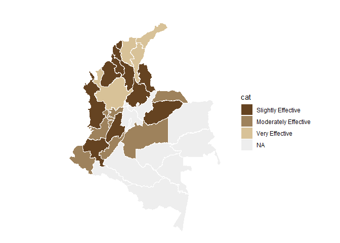<!-- -->

``` r
# weighted
nal_q25_weight<- inner_join(question_25, experience_of_each_expert)
```

    ## Joining with `by = join_by(crop, expert_ID, expert_in)`

``` r
nal_q25_weight<- nal_q25_weight %>%
  group_by(expert_in) %>%
  mutate(numeric_answer=as.numeric(numeric_answer)) %>%
  summarise(average_weighted= weighted.mean(numeric_answer, weights)) %>% 
  group_by(average_weighted) %>%
  mutate(cat_weighted= category_by_mean_by_question(language = "en", mean = average_weighted, question =25)) %>%
  rename(EKE.expert.in=expert_in)
```

    ## Warning: There was 1 warning in `mutate()`.
    ## ℹ In argument: `cat_weighted = category_by_mean_by_question(...)`.
    ## ℹ In group 0: .
    ## Caused by warning:
    ## ! There was 1 warning in `filter()`.
    ## ℹ In argument: `number == question & number_to_category == mean`.
    ## Caused by warning in `number_to_category == mean`:
    ## ! longer object length is not a multiple of shorter object length

``` r
nal_q25_weight<- full_join(codes_department, nal_q25_weight)
```

    ## Joining with `by = join_by(EKE.expert.in)`

``` r
nal_q25_weight$cat_weighted<- factor(nal_q25_weight$cat_weighted, levels = level_25)
colmap(departamentos, data = nal_q25_weight, data_id = "id_depto", var = "cat_weighted")+
  scale_fill_manual(values = palette_soil(length(unique(nal_q25_weight$cat))-1), na.value = "#eeeeee")
```

    ## Scale for fill is already present.
    ## Adding another scale for fill, which will replace the existing scale.

<!-- -->

## Question 26: What is the efficacy perceived by producers about surveillance and reporting in the prevention or management of banana diseases in the areas where you are an expert?

``` r
#selecting only question 26----
question_26<- filter(individual_surveys, question_number==26)
#unique(question_26$numeric_answer)
#dput(unique(question_26$answer_in_english))
#organizing the order of the levels
level_26<- c("Not Effective", "Slightly Effective", "Moderately Effective", "Very Effective","Extremely Effective", "Unsure")
question_26$answer_in_english<- factor(question_26$answer_in_english,levels = level_26)
question_26<- filter(question_26, answer_in_english!="Unsure")
#average by department (weighted and no weighted)
#not weighted 
avg_dept_no_weight_26<- question_26 %>%
  group_by(crop, expert_in) %>%
  mutate(numeric_answer=as.numeric(numeric_answer))%>%
  mutate(average= mean(numeric_answer)) %>%
  group_by(average)%>%
  mutate(ave_cat= category_by_mean_by_question(26, mean =average, language = "en"))
```

    ## Warning: There were 6 warnings in `mutate()`.
    ## The first warning was:
    ## ℹ In argument: `ave_cat = category_by_mean_by_question(26, mean = average,
    ##   language = "en")`.
    ## ℹ In group 0: .
    ## Caused by warning:
    ## ! There was 1 warning in `filter()`.
    ## ℹ In argument: `number == question & number_to_category == mean`.
    ## Caused by warning in `number_to_category == mean`:
    ## ! longer object length is not a multiple of shorter object length
    ## ℹ Run `dplyr::last_dplyr_warnings()` to see the 5 remaining warnings.

``` r
#weighted 
add_weights_question_26<- inner_join(question_26, experience_of_each_expert)
```

    ## Joining with `by = join_by(crop, expert_ID, expert_in)`

``` r
avg_dept_weight_26<- add_weights_question_26 %>%
  group_by(crop, expert_in) %>%
  mutate(numeric_answer=as.numeric(numeric_answer))%>%
  mutate(average_weighted= weighted.mean(numeric_answer, weights)) %>% 
  group_by(average_weighted)%>%
  mutate(ave_cat_weighted= category_by_mean_by_question(26, mean =average_weighted, language = "en"))
```

    ## Warning: There were 5 warnings in `mutate()`.
    ## The first warning was:
    ## ℹ In argument: `ave_cat_weighted = category_by_mean_by_question(26, mean =
    ##   average_weighted, language = "en")`.
    ## ℹ In group 0: .
    ## Caused by warning:
    ## ! There was 1 warning in `filter()`.
    ## ℹ In argument: `number == question & number_to_category == mean`.
    ## Caused by warning in `number_to_category == mean`:
    ## ! longer object length is not a multiple of shorter object length
    ## ℹ Run `dplyr::last_dplyr_warnings()` to see the 4 remaining warnings.

``` r
#finding the levels per crop (banana and plantain) no weighted
levels_per_crop_Q26_no_weighted<- tapply(avg_dept_no_weight_26$ave_cat, avg_dept_no_weight_26$crop, function(x){(unique(x))})
#generating a ramp palette according to the number of levels per crop
colors_banana_question26_no_weighted<- palette_banana(length(levels_per_crop_Q26_no_weighted$Banana))
colors_plantain_question26_no_weighted<- palette_plantain(length(levels_per_crop_Q26_no_weighted$Plantain))
#Assigning the colors by crop and answer
# Define the knowledge levels for each crop
levels_by_crop_no_weighted_26 <- list(
  Banana = levels_per_crop_Q26_no_weighted$Banana,
  Plantain = levels_per_crop_Q26_no_weighted$Plantain
)
# Define the colors for each crop
colors_by_crop_no_weighted_26 <- list(
  Banana = colors_banana_question26_no_weighted, # Replace with actual color vector for Banana
  Plantain = colors_plantain_question26_no_weighted # Replace with actual color vector for Plantain
  # Add more crops and their color vectors here if needed
)
# Now call the function
avg_dept_no_weight_26 <- assign_group_color(data = avg_dept_no_weight_26, levels_by_crop = levels_by_crop_no_weighted_26, colors_by_crop = colors_by_crop_no_weighted_26,answer_col =  "ave_cat")

#finding the levels per crop (banana and plantain) weighted
levels_per_crop_Q26_weighted<- tapply(avg_dept_weight_26$ave_cat_weighted, avg_dept_weight_26$crop, function(x){(unique(x))})
#generating a ramp palette according to the number of levels per crop
colors_banana_question26_weighted<- palette_banana(length(levels_per_crop_Q26_weighted$Banana))
colors_plantain_question26_weighted<- palette_plantain(length(levels_per_crop_Q26_weighted$Plantain))
#Assigning the colors by crop and answer
# Define the knowledge levels for each crop
levels_by_crop_weighted_26 <- list(
  Banana = levels_per_crop_Q26_weighted$Banana,
  Plantain = levels_per_crop_Q26_weighted$Plantain
)
# Define the colors for each crop
colors_by_crop_weighted_26 <- list(
  Banana = colors_banana_question26_weighted, # Replace with actual color vector for Banana
  Plantain = colors_plantain_question26_weighted # Replace with actual color vector for Plantain
  # Add more crops and their color vectors here if needed
)
# Now call the function
avg_dept_weight_26 <- assign_group_color(data = avg_dept_weight_26, levels_by_crop = levels_by_crop_weighted_26, colors_by_crop = colors_by_crop_weighted_26,answer_col =  "ave_cat_weighted")

#tree map
tree_map_3(data = avg_dept_no_weight_26, "crop", "expert_in", "ave_cat", "group_color", title="No weighted")
```

    ## `summarise()` has grouped output by 'crop', 'expert_in', 'ave_cat'. You can
    ## override using the `.groups` argument.

<!-- -->

    ## $tm
    ##        crop          expert_in              ave_cat vSize  vColor stdErr
    ## 1    Banana          Antioquia                 <NA>    11 #FFDA00     11
    ## 2    Banana          Antioquia       Very Effective    11 #FFDA00     11
    ## 3    Banana             Caldas Moderately Effective     1 #FFF2CC      1
    ## 4    Banana             Caldas                 <NA>     1 #FFF2CC      1
    ## 5    Banana              Cesar                 <NA>     1 #FFDA00      1
    ## 6    Banana              Cesar       Very Effective     1 #FFDA00      1
    ## 7    Banana              Chocó                 <NA>     2 #FFE244      2
    ## 8    Banana              Chocó   Slightly Effective     2 #FFE244      2
    ## 9    Banana            Córdoba                 <NA>     1 #FFEA88      1
    ## 10   Banana            Córdoba        Not Effective     1 #FFEA88      1
    ## 11   Banana              Huila Moderately Effective     1 #FFF2CC      1
    ## 12   Banana              Huila                 <NA>     1 #FFF2CC      1
    ## 13   Banana         La Guajira                 <NA>    10 #FFDA00     10
    ## 14   Banana         La Guajira       Very Effective    10 #FFDA00     10
    ## 15   Banana          Magdalena                 <NA>    12 #FFDA00     12
    ## 16   Banana          Magdalena       Very Effective    12 #FFDA00     12
    ## 17   Banana               <NA>                 <NA>    41 #FFDA00     41
    ## 18   Banana            Quindío Moderately Effective     1 #FFF2CC      1
    ## 19   Banana            Quindío                 <NA>     1 #FFF2CC      1
    ## 20   Banana          Risaralda Moderately Effective     1 #FFF2CC      1
    ## 21   Banana          Risaralda                 <NA>     1 #FFF2CC      1
    ## 22 Plantain          Antioquia                 <NA>     2 #28B463      2
    ## 23 Plantain          Antioquia       Very Effective     2 #28B463      2
    ## 24 Plantain             Arauca                 <NA>     1 #BEF4BE      1
    ## 25 Plantain             Arauca        Not Effective     1 #BEF4BE      1
    ## 26 Plantain          Atlántico                 <NA>     1 #BEF4BE      1
    ## 27 Plantain          Atlántico        Not Effective     1 #BEF4BE      1
    ## 28 Plantain            Bolívar                 <NA>     1 #BEF4BE      1
    ## 29 Plantain            Bolívar        Not Effective     1 #BEF4BE      1
    ## 30 Plantain             Caldas                 <NA>     6 #8CDE9F      6
    ## 31 Plantain             Caldas   Slightly Effective     6 #8CDE9F      6
    ## 32 Plantain           Casanare                 <NA>     1 #BEF4BE      1
    ## 33 Plantain           Casanare        Not Effective     1 #BEF4BE      1
    ## 34 Plantain            Córdoba                 <NA>     1 #BEF4BE      1
    ## 35 Plantain            Córdoba        Not Effective     1 #BEF4BE      1
    ## 36 Plantain              Huila                 <NA>     1 #BEF4BE      1
    ## 37 Plantain              Huila        Not Effective     1 #BEF4BE      1
    ## 38 Plantain         La Guajira Moderately Effective     4 #59C981      4
    ## 39 Plantain         La Guajira                 <NA>     4 #59C981      4
    ## 40 Plantain          Magdalena Moderately Effective     3 #59C981      3
    ## 41 Plantain          Magdalena                 <NA>     3 #59C981      3
    ## 42 Plantain               Meta Moderately Effective     8 #59C981      8
    ## 43 Plantain               Meta                 <NA>     8 #59C981      8
    ## 44 Plantain               <NA>                 <NA>    46 #BEF4BE     46
    ## 45 Plantain Norte De Santander                 <NA>     1 #BEF4BE      1
    ## 46 Plantain Norte De Santander        Not Effective     1 #BEF4BE      1
    ## 47 Plantain            Quindío                 <NA>     5 #8CDE9F      5
    ## 48 Plantain            Quindío   Slightly Effective     5 #8CDE9F      5
    ## 49 Plantain          Risaralda Moderately Effective     8 #59C981      8
    ## 50 Plantain          Risaralda                 <NA>     8 #59C981      8
    ## 51 Plantain          Santander                 <NA>     1 #BEF4BE      1
    ## 52 Plantain          Santander        Not Effective     1 #BEF4BE      1
    ## 53 Plantain              Sucre                 <NA>     1 #BEF4BE      1
    ## 54 Plantain              Sucre        Not Effective     1 #BEF4BE      1
    ## 55 Plantain             Tolima                 <NA>     1 #BEF4BE      1
    ## 56 Plantain             Tolima        Not Effective     1 #BEF4BE      1
    ##    vColorValue level        x0         y0          w          h   color
    ## 1           NA     2 0.7746127 0.43902439 0.22538731 0.56097561 #FFDA00
    ## 2           NA     3 0.7746127 0.43902439 0.22538731 0.56097561 #FFDA00
    ## 3           NA     3 0.9301831 0.27439024 0.06981694 0.16463415 #FFF2CC
    ## 4           NA     2 0.9301831 0.27439024 0.06981694 0.16463415 #FFF2CC
    ## 5           NA     2 0.7905492 0.13719512 0.08378033 0.13719512 #FFDA00
    ## 6           NA     3 0.7905492 0.13719512 0.08378033 0.13719512 #FFDA00
    ## 7           NA     2 0.7905492 0.27439024 0.13963389 0.16463415 #FFE244
    ## 8           NA     3 0.7905492 0.27439024 0.13963389 0.16463415 #FFE244
    ## 9           NA     2 0.7905492 0.00000000 0.08378033 0.13719512 #FFEA88
    ## 10          NA     3 0.7905492 0.00000000 0.08378033 0.13719512 #FFEA88
    ## 11          NA     3 0.8743295 0.09146341 0.06283525 0.18292683 #FFF2CC
    ## 12          NA     2 0.8743295 0.09146341 0.06283525 0.18292683 #FFF2CC
    ## 13          NA     2 0.5287356 0.00000000 0.26181354 0.43902439 #FFDA00
    ## 14          NA     3 0.5287356 0.00000000 0.26181354 0.43902439 #FFDA00
    ## 15          NA     2 0.5287356 0.43902439 0.24587706 0.56097561 #FFDA00
    ## 16          NA     3 0.5287356 0.43902439 0.24587706 0.56097561 #FFDA00
    ## 17          NA     1 0.5287356 0.00000000 0.47126437 1.00000000 #FFDA00
    ## 18          NA     3 0.9371648 0.09146341 0.06283525 0.18292683 #FFF2CC
    ## 19          NA     2 0.9371648 0.09146341 0.06283525 0.18292683 #FFF2CC
    ## 20          NA     3 0.8743295 0.00000000 0.12567050 0.09146341 #FFF2CC
    ## 21          NA     2 0.8743295 0.00000000 0.12567050 0.09146341 #FFF2CC
    ## 22          NA     2 0.1938697 0.20594966 0.11162197 0.20594966 #28B463
    ## 23          NA     3 0.1938697 0.20594966 0.11162197 0.20594966 #28B463
    ## 24          NA     2 0.1938697 0.10297483 0.11162197 0.10297483 #BEF4BE
    ## 25          NA     3 0.1938697 0.10297483 0.11162197 0.10297483 #BEF4BE
    ## 26          NA     2 0.1938697 0.00000000 0.11162197 0.10297483 #BEF4BE
    ## 27          NA     3 0.1938697 0.00000000 0.11162197 0.10297483 #BEF4BE
    ## 28          NA     2 0.3054917 0.25743707 0.07441464 0.15446224 #BEF4BE
    ## 29          NA     3 0.3054917 0.25743707 0.07441464 0.15446224 #BEF4BE
    ## 30          NA     2 0.0000000 0.29644269 0.19386973 0.35573123 #8CDE9F
    ## 31          NA     3 0.0000000 0.29644269 0.19386973 0.35573123 #8CDE9F
    ## 32          NA     2 0.3799063 0.25743707 0.07441464 0.15446224 #BEF4BE
    ## 33          NA     3 0.3799063 0.25743707 0.07441464 0.15446224 #BEF4BE
    ## 34          NA     2 0.4543210 0.25743707 0.07441464 0.15446224 #BEF4BE
    ## 35          NA     3 0.4543210 0.25743707 0.07441464 0.15446224 #BEF4BE
    ## 36          NA     2 0.3054917 0.12871854 0.08929757 0.12871854 #BEF4BE
    ## 37          NA     3 0.3054917 0.12871854 0.08929757 0.12871854 #BEF4BE
    ## 38          NA     3 0.1938697 0.41189931 0.19135194 0.24027460 #59C981
    ## 39          NA     2 0.1938697 0.41189931 0.19135194 0.24027460 #59C981
    ## 40          NA     3 0.3852217 0.41189931 0.14351396 0.24027460 #59C981
    ## 41          NA     2 0.3852217 0.41189931 0.14351396 0.24027460 #59C981
    ## 42          NA     3 0.0000000 0.65217391 0.26436782 0.34782609 #59C981
    ## 43          NA     2 0.0000000 0.65217391 0.26436782 0.34782609 #59C981
    ## 44          NA     1 0.0000000 0.00000000 0.52873563 1.00000000 #BEF4BE
    ## 45          NA     2 0.3054917 0.00000000 0.08929757 0.12871854 #BEF4BE
    ## 46          NA     3 0.3054917 0.00000000 0.08929757 0.12871854 #BEF4BE
    ## 47          NA     2 0.0000000 0.00000000 0.19386973 0.29644269 #8CDE9F
    ## 48          NA     3 0.0000000 0.00000000 0.19386973 0.29644269 #8CDE9F
    ## 49          NA     3 0.2643678 0.65217391 0.26436782 0.34782609 #59C981
    ## 50          NA     2 0.2643678 0.65217391 0.26436782 0.34782609 #59C981
    ## 51          NA     2 0.3947893 0.08581236 0.06697318 0.17162471 #BEF4BE
    ## 52          NA     3 0.3947893 0.08581236 0.06697318 0.17162471 #BEF4BE
    ## 53          NA     2 0.4617625 0.08581236 0.06697318 0.17162471 #BEF4BE
    ## 54          NA     3 0.4617625 0.08581236 0.06697318 0.17162471 #BEF4BE
    ## 55          NA     2 0.3947893 0.00000000 0.13394636 0.08581236 #BEF4BE
    ## 56          NA     3 0.3947893 0.00000000 0.13394636 0.08581236 #BEF4BE
    ## 
    ## $type
    ## [1] "color"
    ## 
    ## $vSize
    ## [1] "frequency"
    ## 
    ## $vColor
    ## [1] "group_color"
    ## 
    ## $stdErr
    ## [1] "frequency"
    ## 
    ## $algorithm
    ## [1] "pivotSize"
    ## 
    ## $vpCoorX
    ## [1] 0.02812148 0.97187852
    ## 
    ## $vpCoorY
    ## [1] 0.01968504 0.91031496
    ## 
    ## $aspRatio
    ## [1] 1.483512
    ## 
    ## $range
    ## [1] NA NA
    ## 
    ## $mapping
    ## [1] NA NA NA
    ## 
    ## $draw
    ## [1] TRUE

``` r
tree_map_3(data = avg_dept_weight_26, "crop", "expert_in", "ave_cat_weighted", "group_color", title="weighted")
```

    ## `summarise()` has grouped output by 'crop', 'expert_in', 'ave_cat_weighted'.
    ## You can override using the `.groups` argument.

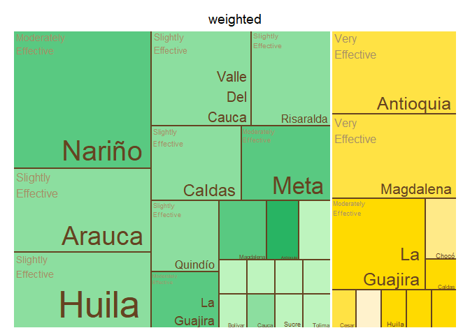<!-- -->

    ## $tm
    ##        crop          expert_in     ave_cat_weighted vSize  vColor stdErr
    ## 1    Banana          Antioquia                 <NA>    11 #FFE244     11
    ## 2    Banana          Antioquia       Very Effective    11 #FFE244     11
    ## 3    Banana             Caldas Moderately Effective     1 #FFDA00      1
    ## 4    Banana             Caldas                 <NA>     1 #FFDA00      1
    ## 5    Banana              Cesar                 <NA>     1 #FFE244      1
    ## 6    Banana              Cesar       Very Effective     1 #FFE244      1
    ## 7    Banana              Chocó                 <NA>     2 #FFEA88      2
    ## 8    Banana              Chocó   Slightly Effective     2 #FFEA88      2
    ## 9    Banana            Córdoba                 <NA>     1 #FFF2CC      1
    ## 10   Banana            Córdoba        Not Effective     1 #FFF2CC      1
    ## 11   Banana              Huila Moderately Effective     1 #FFDA00      1
    ## 12   Banana              Huila                 <NA>     1 #FFDA00      1
    ## 13   Banana         La Guajira Moderately Effective     9 #FFDA00      9
    ## 14   Banana         La Guajira                 <NA>     9 #FFDA00      9
    ## 15   Banana          Magdalena                 <NA>    11 #FFE244     11
    ## 16   Banana          Magdalena       Very Effective    11 #FFE244     11
    ## 17   Banana               <NA>                 <NA>    39 #FFDA00     39
    ## 18   Banana            Quindío Moderately Effective     1 #FFDA00      1
    ## 19   Banana            Quindío                 <NA>     1 #FFDA00      1
    ## 20   Banana          Risaralda Moderately Effective     1 #FFDA00      1
    ## 21   Banana          Risaralda                 <NA>     1 #FFDA00      1
    ## 22 Plantain          Antioquia  Extremely Effective     2 #28B463      2
    ## 23 Plantain          Antioquia                 <NA>     2 #28B463      2
    ## 24 Plantain             Arauca                 <NA>     1 #BEF4BE      1
    ## 25 Plantain             Arauca        Not Effective     1 #BEF4BE      1
    ## 26 Plantain          Atlántico                 <NA>     1 #BEF4BE      1
    ## 27 Plantain          Atlántico        Not Effective     1 #BEF4BE      1
    ## 28 Plantain            Bolívar                 <NA>     1 #BEF4BE      1
    ## 29 Plantain            Bolívar        Not Effective     1 #BEF4BE      1
    ## 30 Plantain             Caldas                 <NA>     6 #8CDE9F      6
    ## 31 Plantain             Caldas   Slightly Effective     6 #8CDE9F      6
    ## 32 Plantain           Casanare                 <NA>     1 #BEF4BE      1
    ## 33 Plantain           Casanare        Not Effective     1 #BEF4BE      1
    ## 34 Plantain            Córdoba                 <NA>     1 #BEF4BE      1
    ## 35 Plantain            Córdoba        Not Effective     1 #BEF4BE      1
    ## 36 Plantain              Huila                 <NA>     1 #BEF4BE      1
    ## 37 Plantain              Huila        Not Effective     1 #BEF4BE      1
    ## 38 Plantain         La Guajira Moderately Effective     4 #59C981      4
    ## 39 Plantain         La Guajira                 <NA>     4 #59C981      4
    ## 40 Plantain          Magdalena Moderately Effective     3 #59C981      3
    ## 41 Plantain          Magdalena                 <NA>     3 #59C981      3
    ## 42 Plantain               Meta Moderately Effective     7 #59C981      7
    ## 43 Plantain               Meta                 <NA>     7 #59C981      7
    ## 44 Plantain               <NA>                 <NA>    45 #BEF4BE     45
    ## 45 Plantain Norte De Santander                 <NA>     1 #BEF4BE      1
    ## 46 Plantain Norte De Santander        Not Effective     1 #BEF4BE      1
    ## 47 Plantain            Quindío                 <NA>     5 #8CDE9F      5
    ## 48 Plantain            Quindío   Slightly Effective     5 #8CDE9F      5
    ## 49 Plantain          Risaralda                 <NA>     8 #8CDE9F      8
    ## 50 Plantain          Risaralda   Slightly Effective     8 #8CDE9F      8
    ## 51 Plantain          Santander                 <NA>     1 #BEF4BE      1
    ## 52 Plantain          Santander        Not Effective     1 #BEF4BE      1
    ## 53 Plantain              Sucre                 <NA>     1 #BEF4BE      1
    ## 54 Plantain              Sucre        Not Effective     1 #BEF4BE      1
    ## 55 Plantain             Tolima                 <NA>     1 #BEF4BE      1
    ## 56 Plantain             Tolima        Not Effective     1 #BEF4BE      1
    ##    vColorValue level        x0         y0          w          h   color
    ## 1           NA     2 0.5357143 0.43589744 0.23214286 0.56410256 #FFE244
    ## 2           NA     3 0.5357143 0.43589744 0.23214286 0.56410256 #FFE244
    ## 3           NA     3 0.9271709 0.27243590 0.07282913 0.16346154 #FFDA00
    ## 4           NA     2 0.9271709 0.27243590 0.07282913 0.16346154 #FFDA00
    ## 5           NA     2 0.7815126 0.13621795 0.08739496 0.13621795 #FFE244
    ## 6           NA     3 0.7815126 0.13621795 0.08739496 0.13621795 #FFE244
    ## 7           NA     2 0.7815126 0.27243590 0.14565826 0.16346154 #FFEA88
    ## 8           NA     3 0.7815126 0.27243590 0.14565826 0.16346154 #FFEA88
    ## 9           NA     2 0.7815126 0.00000000 0.08739496 0.13621795 #FFF2CC
    ## 10          NA     3 0.7815126 0.00000000 0.08739496 0.13621795 #FFF2CC
    ## 11          NA     3 0.8689076 0.09081197 0.06554622 0.18162393 #FFDA00
    ## 12          NA     2 0.8689076 0.09081197 0.06554622 0.18162393 #FFDA00
    ## 13          NA     3 0.5357143 0.00000000 0.24579832 0.43589744 #FFDA00
    ## 14          NA     2 0.5357143 0.00000000 0.24579832 0.43589744 #FFDA00
    ## 15          NA     2 0.7678571 0.43589744 0.23214286 0.56410256 #FFE244
    ## 16          NA     3 0.7678571 0.43589744 0.23214286 0.56410256 #FFE244
    ## 17          NA     1 0.5357143 0.00000000 0.46428571 1.00000000 #FFDA00
    ## 18          NA     3 0.9344538 0.09081197 0.06554622 0.18162393 #FFDA00
    ## 19          NA     2 0.9344538 0.09081197 0.06554622 0.18162393 #FFDA00
    ## 20          NA     3 0.8689076 0.00000000 0.13109244 0.09081197 #FFDA00
    ## 21          NA     2 0.8689076 0.00000000 0.13109244 0.09081197 #FFDA00
    ## 22          NA     3 0.1964286 0.25263158 0.14136905 0.16842105 #28B463
    ## 23          NA     2 0.1964286 0.25263158 0.14136905 0.16842105 #28B463
    ## 24          NA     2 0.1964286 0.08421053 0.07068452 0.16842105 #BEF4BE
    ## 25          NA     3 0.1964286 0.08421053 0.07068452 0.16842105 #BEF4BE
    ## 26          NA     2 0.2671131 0.08421053 0.07068452 0.16842105 #BEF4BE
    ## 27          NA     3 0.2671131 0.08421053 0.07068452 0.16842105 #BEF4BE
    ## 28          NA     2 0.1964286 0.00000000 0.14136905 0.08421053 #BEF4BE
    ## 29          NA     3 0.1964286 0.00000000 0.14136905 0.08421053 #BEF4BE
    ## 30          NA     2 0.0000000 0.30303030 0.19642857 0.36363636 #8CDE9F
    ## 31          NA     3 0.0000000 0.30303030 0.19642857 0.36363636 #8CDE9F
    ## 32          NA     2 0.3377976 0.30075188 0.09895833 0.12030075 #BEF4BE
    ## 33          NA     3 0.3377976 0.30075188 0.09895833 0.12030075 #BEF4BE
    ## 34          NA     2 0.4367560 0.30075188 0.09895833 0.12030075 #BEF4BE
    ## 35          NA     3 0.4367560 0.30075188 0.09895833 0.12030075 #BEF4BE
    ## 36          NA     2 0.3377976 0.18045113 0.09895833 0.12030075 #BEF4BE
    ## 37          NA     3 0.3377976 0.18045113 0.09895833 0.12030075 #BEF4BE
    ## 38          NA     3 0.1964286 0.42105263 0.19387755 0.24561404 #59C981
    ## 39          NA     2 0.1964286 0.42105263 0.19387755 0.24561404 #59C981
    ## 40          NA     3 0.3903061 0.42105263 0.14540816 0.24561404 #59C981
    ## 41          NA     2 0.3903061 0.42105263 0.14540816 0.24561404 #59C981
    ## 42          NA     3 0.2857143 0.66666667 0.25000000 0.33333333 #59C981
    ## 43          NA     2 0.2857143 0.66666667 0.25000000 0.33333333 #59C981
    ## 44          NA     1 0.0000000 0.00000000 0.53571429 1.00000000 #BEF4BE
    ## 45          NA     2 0.4367560 0.18045113 0.09895833 0.12030075 #BEF4BE
    ## 46          NA     3 0.4367560 0.18045113 0.09895833 0.12030075 #BEF4BE
    ## 47          NA     2 0.0000000 0.00000000 0.19642857 0.30303030 #8CDE9F
    ## 48          NA     3 0.0000000 0.00000000 0.19642857 0.30303030 #8CDE9F
    ## 49          NA     2 0.0000000 0.66666667 0.28571429 0.33333333 #8CDE9F
    ## 50          NA     3 0.0000000 0.66666667 0.28571429 0.33333333 #8CDE9F
    ## 51          NA     2 0.3377976 0.00000000 0.06597222 0.18045113 #BEF4BE
    ## 52          NA     3 0.3377976 0.00000000 0.06597222 0.18045113 #BEF4BE
    ## 53          NA     2 0.4037698 0.00000000 0.06597222 0.18045113 #BEF4BE
    ## 54          NA     3 0.4037698 0.00000000 0.06597222 0.18045113 #BEF4BE
    ## 55          NA     2 0.4697421 0.00000000 0.06597222 0.18045113 #BEF4BE
    ## 56          NA     3 0.4697421 0.00000000 0.06597222 0.18045113 #BEF4BE
    ## 
    ## $type
    ## [1] "color"
    ## 
    ## $vSize
    ## [1] "frequency"
    ## 
    ## $vColor
    ## [1] "group_color"
    ## 
    ## $stdErr
    ## [1] "frequency"
    ## 
    ## $algorithm
    ## [1] "pivotSize"
    ## 
    ## $vpCoorX
    ## [1] 0.02812148 0.97187852
    ## 
    ## $vpCoorY
    ## [1] 0.01968504 0.91031496
    ## 
    ## $aspRatio
    ## [1] 1.483512
    ## 
    ## $range
    ## [1] NA NA
    ## 
    ## $mapping
    ## [1] NA NA NA
    ## 
    ## $draw
    ## [1] TRUE

``` r
#Map of Colombia  
#non weighted
nal_q26_no_weight<- question_26 %>% group_by(expert_in) %>%
  summarise(average= mean(as.numeric(numeric_answer))) %>%
  group_by(average) %>% 
  mutate(cat= category_by_mean_by_question(language = "en", mean = average, question =26))%>%
  rename(EKE.expert.in = expert_in)
```

    ## Warning: There were 2 warnings in `mutate()`.
    ## The first warning was:
    ## ℹ In argument: `cat = category_by_mean_by_question(...)`.
    ## ℹ In group 0: .
    ## Caused by warning:
    ## ! There was 1 warning in `filter()`.
    ## ℹ In argument: `number == question & number_to_category == mean`.
    ## Caused by warning in `number_to_category == mean`:
    ## ! longer object length is not a multiple of shorter object length
    ## ℹ Run `dplyr::last_dplyr_warnings()` to see the 1 remaining warning.

``` r
nal_q26_no_weight<- full_join(codes_department, nal_q26_no_weight)
```

    ## Joining with `by = join_by(EKE.expert.in)`

``` r
nal_q26_no_weight$cat<- factor(nal_q26_no_weight$cat, levels = level_26)
colmap(departamentos, data = nal_q26_no_weight, data_id = "id_depto", var = "cat")+
  scale_fill_manual(values = palette_soil(length(unique(nal_q26_no_weight$cat))-1), na.value = "#eeeeee")
```

    ## Scale for fill is already present.
    ## Adding another scale for fill, which will replace the existing scale.

<!-- -->

``` r
# weighted
nal_q26_weight<- inner_join(question_26, experience_of_each_expert)
```

    ## Joining with `by = join_by(crop, expert_ID, expert_in)`

``` r
nal_q26_weight<- nal_q26_weight %>%
  group_by(expert_in) %>%
  mutate(numeric_answer=as.numeric(numeric_answer)) %>%
  summarise(average_weighted= weighted.mean(numeric_answer, weights)) %>% 
  group_by(average_weighted) %>%
  mutate(cat_weighted= category_by_mean_by_question(language = "en", mean = average_weighted, question =26)) %>%
  rename(EKE.expert.in=expert_in)
```

    ## Warning: There was 1 warning in `mutate()`.
    ## ℹ In argument: `cat_weighted = category_by_mean_by_question(...)`.
    ## ℹ In group 0: .
    ## Caused by warning:
    ## ! There was 1 warning in `filter()`.
    ## ℹ In argument: `number == question & number_to_category == mean`.
    ## Caused by warning in `number_to_category == mean`:
    ## ! longer object length is not a multiple of shorter object length

``` r
nal_q26_weight<- full_join(codes_department, nal_q26_weight)
```

    ## Joining with `by = join_by(EKE.expert.in)`

``` r
nal_q26_weight$cat_weighted<- factor(nal_q26_weight$cat_weighted, levels = level_26)
colmap(departamentos, data = nal_q26_weight, data_id = "id_depto", var = "cat_weighted")+
  scale_fill_manual(values = palette_soil(length(unique(nal_q26_weight$cat))-1), na.value = "#eeeeee")
```

    ## Scale for fill is already present.
    ## Adding another scale for fill, which will replace the existing scale.

<!-- -->

## Question 28: How important do you believe the role of migrant or itinerant workers is in the spread of pests and diseases in banana plantations in your areas of specialization?

``` r
#selecting only question 28----
question_28<- filter(individual_surveys, question_number==28)
#unique(question_28$numeric_answer)
#dput(unique(question_28$answer_in_english))

#organizing the order of the levels
level_28<- c("Not Significant", "Somewhat Significant", "Very Significant","Not Sure")
question_28$answer_in_english<- factor(question_28$answer_in_english,levels = level_28)
question_28<- filter(question_28, answer_in_english!="Not Sure")
#average by department (weighted and no weighted)
#not weighted 
avg_dept_no_weight_28<- question_28 %>%
  group_by(crop, expert_in) %>%
  mutate(numeric_answer=as.numeric(numeric_answer))%>%
  mutate(average= mean(numeric_answer)) %>%
  group_by(average)%>%
  mutate(ave_cat= category_by_mean_by_question(28, mean =average, language = "en"))
```

    ## Warning: There were 5 warnings in `mutate()`.
    ## The first warning was:
    ## ℹ In argument: `ave_cat = category_by_mean_by_question(28, mean = average,
    ##   language = "en")`.
    ## ℹ In group 0: .
    ## Caused by warning:
    ## ! There was 1 warning in `filter()`.
    ## ℹ In argument: `number == question & number_to_category == mean`.
    ## Caused by warning in `number_to_category == mean`:
    ## ! longer object length is not a multiple of shorter object length
    ## ℹ Run `dplyr::last_dplyr_warnings()` to see the 4 remaining warnings.

``` r
#weighted 
add_weights_question_28<- inner_join(question_28, experience_of_each_expert)
```

    ## Joining with `by = join_by(crop, expert_ID, expert_in)`

``` r
avg_dept_weight_28<- add_weights_question_28 %>%
  group_by(crop, expert_in) %>%
  mutate(numeric_answer=as.numeric(numeric_answer))%>%
  mutate(average_weighted= weighted.mean(numeric_answer, weights)) %>% 
  group_by(average_weighted)%>%
  mutate(ave_cat_weighted= category_by_mean_by_question(28, mean =average_weighted, language = "en"))
```

    ## Warning: There were 8 warnings in `mutate()`.
    ## The first warning was:
    ## ℹ In argument: `ave_cat_weighted = category_by_mean_by_question(28, mean =
    ##   average_weighted, language = "en")`.
    ## ℹ In group 0: .
    ## Caused by warning:
    ## ! There was 1 warning in `filter()`.
    ## ℹ In argument: `number == question & number_to_category == mean`.
    ## Caused by warning in `number_to_category == mean`:
    ## ! longer object length is not a multiple of shorter object length
    ## ℹ Run `dplyr::last_dplyr_warnings()` to see the 7 remaining warnings.

``` r
#finding the levels per crop (banana and plantain) no weighted
levels_per_crop_Q28_no_weighted<- tapply(avg_dept_no_weight_28$ave_cat, avg_dept_no_weight_28$crop, function(x){(unique(x))})
#generating a ramp palette according to the number of levels per crop
colors_banana_question28_no_weighted<- palette_banana(length(levels_per_crop_Q28_no_weighted$Banana))
colors_plantain_question28_no_weighted<- palette_plantain(length(levels_per_crop_Q28_no_weighted$Plantain))
#Assigning the colors by crop and answer
# Define the knowledge levels for each crop
levels_by_crop_no_weighted_28 <- list(
  Banana = levels_per_crop_Q28_no_weighted$Banana,
  Plantain = levels_per_crop_Q28_no_weighted$Plantain
)
# Define the colors for each crop
colors_by_crop_no_weighted_28 <- list(
  Banana = colors_banana_question28_no_weighted, # Replace with actual color vector for Banana
  Plantain = colors_plantain_question28_no_weighted # Replace with actual color vector for Plantain
  # Add more crops and their color vectors here if needed
)
# Now call the function
avg_dept_no_weight_28 <- assign_group_color(data = avg_dept_no_weight_28, levels_by_crop = levels_by_crop_no_weighted_28, colors_by_crop = colors_by_crop_no_weighted_28,answer_col =  "ave_cat")

#finding the levels per crop (banana and plantain) weighted
levels_per_crop_Q28_weighted<- tapply(avg_dept_weight_28$ave_cat_weighted, avg_dept_weight_28$crop, function(x){(unique(x))})
#generating a ramp palette according to the number of levels per crop
colors_banana_question28_weighted<- palette_banana(length(levels_per_crop_Q28_weighted$Banana))
colors_plantain_question28_weighted<- palette_plantain(length(levels_per_crop_Q28_weighted$Plantain))
#Assigning the colors by crop and answer
# Define the knowledge levels for each crop
levels_by_crop_weighted_28 <- list(
  Banana = levels_per_crop_Q28_weighted$Banana,
  Plantain = levels_per_crop_Q28_weighted$Plantain
)
# Define the colors for each crop
colors_by_crop_weighted_28 <- list(
  Banana = colors_banana_question28_weighted, # Replace with actual color vector for Banana
  Plantain = colors_plantain_question28_weighted # Replace with actual color vector for Plantain
  # Add more crops and their color vectors here if needed
)
# Now call the function
avg_dept_weight_28 <- assign_group_color(data = avg_dept_weight_28, levels_by_crop = levels_by_crop_weighted_28, colors_by_crop = colors_by_crop_weighted_28,answer_col =  "ave_cat_weighted")

#tree map
tree_map_3(data = avg_dept_no_weight_28, "crop", "expert_in", "ave_cat", "group_color", title="No weighted")
```

    ## `summarise()` has grouped output by 'crop', 'expert_in', 'ave_cat'. You can
    ## override using the `.groups` argument.

<!-- -->

    ## $tm
    ##        crop          expert_in              ave_cat vSize  vColor stdErr
    ## 1    Banana          Antioquia                 <NA>    11 #FFDA00     11
    ## 2    Banana          Antioquia     Very Significant    11 #FFDA00     11
    ## 3    Banana             Caldas                 <NA>     1 #FFF2CC      1
    ## 4    Banana             Caldas      Not Significant     1 #FFF2CC      1
    ## 5    Banana              Cesar                 <NA>     2 #FFDA00      2
    ## 6    Banana              Cesar     Very Significant     2 #FFDA00      2
    ## 7    Banana              Chocó                 <NA>     1 #FFE566      1
    ## 8    Banana              Chocó Somewhat Significant     1 #FFE566      1
    ## 9    Banana            Córdoba                 <NA>     1 #FFDA00      1
    ## 10   Banana            Córdoba     Very Significant     1 #FFDA00      1
    ## 11   Banana              Huila                 <NA>     1 #FFF2CC      1
    ## 12   Banana              Huila      Not Significant     1 #FFF2CC      1
    ## 13   Banana         La Guajira                 <NA>     9 #FFDA00      9
    ## 14   Banana         La Guajira     Very Significant     9 #FFDA00      9
    ## 15   Banana          Magdalena                 <NA>    11 #FFDA00     11
    ## 16   Banana          Magdalena     Very Significant    11 #FFDA00     11
    ## 17   Banana               <NA>                 <NA>    39 #FFDA00     39
    ## 18   Banana            Quindío                 <NA>     1 #FFF2CC      1
    ## 19   Banana            Quindío      Not Significant     1 #FFF2CC      1
    ## 20   Banana          Risaralda                 <NA>     1 #FFF2CC      1
    ## 21   Banana          Risaralda      Not Significant     1 #FFF2CC      1
    ## 22 Plantain          Antioquia                 <NA>     2 #28B463      2
    ## 23 Plantain          Antioquia Somewhat Significant     2 #28B463      2
    ## 24 Plantain             Arauca                 <NA>     2 #28B463      2
    ## 25 Plantain             Arauca Somewhat Significant     2 #28B463      2
    ## 26 Plantain          Atlántico                 <NA>     1 #BEF4BE      1
    ## 27 Plantain          Atlántico      Not Significant     1 #BEF4BE      1
    ## 28 Plantain            Bolívar                 <NA>     1 #BEF4BE      1
    ## 29 Plantain            Bolívar      Not Significant     1 #BEF4BE      1
    ## 30 Plantain             Caldas                 <NA>     7 #28B463      7
    ## 31 Plantain             Caldas Somewhat Significant     7 #28B463      7
    ## 32 Plantain           Casanare                 <NA>     2 #28B463      2
    ## 33 Plantain           Casanare Somewhat Significant     2 #28B463      2
    ## 34 Plantain              Chocó                 <NA>     1 #BEF4BE      1
    ## 35 Plantain              Chocó      Not Significant     1 #BEF4BE      1
    ## 36 Plantain            Córdoba                 <NA>     1 #BEF4BE      1
    ## 37 Plantain            Córdoba      Not Significant     1 #BEF4BE      1
    ## 38 Plantain              Huila                 <NA>     1 #BEF4BE      1
    ## 39 Plantain              Huila      Not Significant     1 #BEF4BE      1
    ## 40 Plantain         La Guajira                 <NA>     3 #28B463      3
    ## 41 Plantain         La Guajira Somewhat Significant     3 #28B463      3
    ## 42 Plantain          Magdalena                 <NA>     2 #28B463      2
    ## 43 Plantain          Magdalena Somewhat Significant     2 #28B463      2
    ## 44 Plantain               Meta                 <NA>    11 #28B463     11
    ## 45 Plantain               Meta Somewhat Significant    11 #28B463     11
    ## 46 Plantain               <NA>                 <NA>    54 #28B463     54
    ## 47 Plantain Norte De Santander                 <NA>     1 #BEF4BE      1
    ## 48 Plantain Norte De Santander      Not Significant     1 #BEF4BE      1
    ## 49 Plantain            Quindío                 <NA>     6 #28B463      6
    ## 50 Plantain            Quindío Somewhat Significant     6 #28B463      6
    ## 51 Plantain          Risaralda                 <NA>    10 #28B463     10
    ## 52 Plantain          Risaralda Somewhat Significant    10 #28B463     10
    ## 53 Plantain          Santander                 <NA>     1 #BEF4BE      1
    ## 54 Plantain          Santander      Not Significant     1 #BEF4BE      1
    ## 55 Plantain              Sucre                 <NA>     1 #BEF4BE      1
    ## 56 Plantain              Sucre      Not Significant     1 #BEF4BE      1
    ## 57 Plantain             Tolima                 <NA>     1 #BEF4BE      1
    ## 58 Plantain             Tolima      Not Significant     1 #BEF4BE      1
    ##    vColorValue level        x0         y0          w          h   color
    ## 1           NA     2 0.5806452 0.43589744 0.20967742 0.56410256 #FFDA00
    ## 2           NA     3 0.5806452 0.43589744 0.20967742 0.56410256 #FFDA00
    ## 3           NA     2 0.8519924 0.29059829 0.07400380 0.14529915 #FFF2CC
    ## 4           NA     3 0.8519924 0.29059829 0.07400380 0.14529915 #FFF2CC
    ## 5           NA     2 0.5806452 0.00000000 0.27134725 0.07925408 #FFDA00
    ## 6           NA     3 0.5806452 0.00000000 0.27134725 0.07925408 #FFDA00
    ## 7           NA     2 0.9259962 0.29059829 0.07400380 0.14529915 #FFE566
    ## 8           NA     3 0.9259962 0.29059829 0.07400380 0.14529915 #FFE566
    ## 9           NA     2 0.8519924 0.14529915 0.07400380 0.14529915 #FFDA00
    ## 10          NA     3 0.8519924 0.14529915 0.07400380 0.14529915 #FFDA00
    ## 11          NA     2 0.9259962 0.14529915 0.07400380 0.14529915 #FFF2CC
    ## 12          NA     3 0.9259962 0.14529915 0.07400380 0.14529915 #FFF2CC
    ## 13          NA     2 0.5806452 0.07925408 0.27134725 0.35664336 #FFDA00
    ## 14          NA     3 0.5806452 0.07925408 0.27134725 0.35664336 #FFDA00
    ## 15          NA     2 0.7903226 0.43589744 0.20967742 0.56410256 #FFDA00
    ## 16          NA     3 0.7903226 0.43589744 0.20967742 0.56410256 #FFDA00
    ## 17          NA     1 0.5806452 0.00000000 0.41935484 1.00000000 #FFDA00
    ## 18          NA     2 0.8519924 0.00000000 0.07400380 0.14529915 #FFF2CC
    ## 19          NA     3 0.8519924 0.00000000 0.07400380 0.14529915 #FFF2CC
    ## 20          NA     2 0.9259962 0.00000000 0.07400380 0.14529915 #FFF2CC
    ## 21          NA     3 0.9259962 0.00000000 0.07400380 0.14529915 #FFF2CC
    ## 22          NA     2 0.3795559 0.39722222 0.10054462 0.21388889 #28B463
    ## 23          NA     3 0.3795559 0.39722222 0.10054462 0.21388889 #28B463
    ## 24          NA     2 0.4801005 0.39722222 0.10054462 0.21388889 #28B463
    ## 25          NA     3 0.4801005 0.39722222 0.10054462 0.21388889 #28B463
    ## 26          NA     2 0.3370178 0.26481481 0.08120911 0.13240741 #BEF4BE
    ## 27          NA     3 0.3370178 0.26481481 0.08120911 0.13240741 #BEF4BE
    ## 28          NA     2 0.4182269 0.26481481 0.08120911 0.13240741 #BEF4BE
    ## 29          NA     3 0.4182269 0.26481481 0.08120911 0.13240741 #BEF4BE
    ## 30          NA     2 0.0000000 0.28205128 0.22873900 0.32905983 #28B463
    ## 31          NA     3 0.0000000 0.28205128 0.22873900 0.32905983 #28B463
    ## 32          NA     2 0.2287390 0.19861111 0.10827882 0.19861111 #28B463
    ## 33          NA     3 0.2287390 0.19861111 0.10827882 0.19861111 #28B463
    ## 34          NA     2 0.4994360 0.26481481 0.08120911 0.13240741 #BEF4BE
    ## 35          NA     3 0.4994360 0.26481481 0.08120911 0.13240741 #BEF4BE
    ## 36          NA     2 0.3370178 0.13240741 0.08120911 0.13240741 #BEF4BE
    ## 37          NA     3 0.3370178 0.13240741 0.08120911 0.13240741 #BEF4BE
    ## 38          NA     2 0.3370178 0.00000000 0.08120911 0.13240741 #BEF4BE
    ## 39          NA     3 0.3370178 0.00000000 0.08120911 0.13240741 #BEF4BE
    ## 40          NA     2 0.2287390 0.39722222 0.15081693 0.21388889 #28B463
    ## 41          NA     3 0.2287390 0.39722222 0.15081693 0.21388889 #28B463
    ## 42          NA     2 0.2287390 0.00000000 0.10827882 0.19861111 #28B463
    ## 43          NA     3 0.2287390 0.00000000 0.10827882 0.19861111 #28B463
    ## 44          NA     2 0.0000000 0.61111111 0.30414747 0.38888889 #28B463
    ## 45          NA     3 0.0000000 0.61111111 0.30414747 0.38888889 #28B463
    ## 46          NA     1 0.0000000 0.00000000 0.58064516 1.00000000 #28B463
    ## 47          NA     2 0.4182269 0.13240741 0.08120911 0.13240741 #BEF4BE
    ## 48          NA     3 0.4182269 0.13240741 0.08120911 0.13240741 #BEF4BE
    ## 49          NA     2 0.0000000 0.00000000 0.22873900 0.28205128 #28B463
    ## 50          NA     3 0.0000000 0.00000000 0.22873900 0.28205128 #28B463
    ## 51          NA     2 0.3041475 0.61111111 0.27649770 0.38888889 #28B463
    ## 52          NA     3 0.3041475 0.61111111 0.27649770 0.38888889 #28B463
    ## 53          NA     2 0.4994360 0.13240741 0.08120911 0.13240741 #BEF4BE
    ## 54          NA     3 0.4994360 0.13240741 0.08120911 0.13240741 #BEF4BE
    ## 55          NA     2 0.4182269 0.00000000 0.08120911 0.13240741 #BEF4BE
    ## 56          NA     3 0.4182269 0.00000000 0.08120911 0.13240741 #BEF4BE
    ## 57          NA     2 0.4994360 0.00000000 0.08120911 0.13240741 #BEF4BE
    ## 58          NA     3 0.4994360 0.00000000 0.08120911 0.13240741 #BEF4BE
    ## 
    ## $type
    ## [1] "color"
    ## 
    ## $vSize
    ## [1] "frequency"
    ## 
    ## $vColor
    ## [1] "group_color"
    ## 
    ## $stdErr
    ## [1] "frequency"
    ## 
    ## $algorithm
    ## [1] "pivotSize"
    ## 
    ## $vpCoorX
    ## [1] 0.02812148 0.97187852
    ## 
    ## $vpCoorY
    ## [1] 0.01968504 0.91031496
    ## 
    ## $aspRatio
    ## [1] 1.483512
    ## 
    ## $range
    ## [1] NA NA
    ## 
    ## $mapping
    ## [1] NA NA NA
    ## 
    ## $draw
    ## [1] TRUE

``` r
tree_map_3(data = avg_dept_weight_28, "crop", "expert_in", "ave_cat_weighted", "group_color", title="weighted")
```

    ## `summarise()` has grouped output by 'crop', 'expert_in', 'ave_cat_weighted'.
    ## You can override using the `.groups` argument.

<!-- -->

    ## $tm
    ##        crop          expert_in     ave_cat_weighted vSize  vColor stdErr
    ## 1    Banana          Antioquia                 <NA>    11 #FFDA00     11
    ## 2    Banana          Antioquia     Very Significant    11 #FFDA00     11
    ## 3    Banana             Caldas                 <NA>     1 #FFF2CC      1
    ## 4    Banana             Caldas      Not Significant     1 #FFF2CC      1
    ## 5    Banana              Cesar                 <NA>     2 #FFDA00      2
    ## 6    Banana              Cesar     Very Significant     2 #FFDA00      2
    ## 7    Banana              Chocó                 <NA>     1 #FFE566      1
    ## 8    Banana              Chocó Somewhat Significant     1 #FFE566      1
    ## 9    Banana            Córdoba                 <NA>     1 #FFDA00      1
    ## 10   Banana            Córdoba     Very Significant     1 #FFDA00      1
    ## 11   Banana              Huila                 <NA>     1 #FFF2CC      1
    ## 12   Banana              Huila      Not Significant     1 #FFF2CC      1
    ## 13   Banana         La Guajira                 <NA>     8 #FFDA00      8
    ## 14   Banana         La Guajira     Very Significant     8 #FFDA00      8
    ## 15   Banana          Magdalena                 <NA>    10 #FFDA00     10
    ## 16   Banana          Magdalena     Very Significant    10 #FFDA00     10
    ## 17   Banana               <NA>                 <NA>    37 #FFDA00     37
    ## 18   Banana            Quindío                 <NA>     1 #FFF2CC      1
    ## 19   Banana            Quindío      Not Significant     1 #FFF2CC      1
    ## 20   Banana          Risaralda                 <NA>     1 #FFF2CC      1
    ## 21   Banana          Risaralda      Not Significant     1 #FFF2CC      1
    ## 22 Plantain          Antioquia                 <NA>     2 #28B463      2
    ## 23 Plantain          Antioquia Somewhat Significant     2 #28B463      2
    ## 24 Plantain             Arauca                 <NA>     2 #28B463      2
    ## 25 Plantain             Arauca Somewhat Significant     2 #28B463      2
    ## 26 Plantain          Atlántico                 <NA>     1 #BEF4BE      1
    ## 27 Plantain          Atlántico      Not Significant     1 #BEF4BE      1
    ## 28 Plantain            Bolívar                 <NA>     1 #BEF4BE      1
    ## 29 Plantain            Bolívar      Not Significant     1 #BEF4BE      1
    ## 30 Plantain             Caldas                 <NA>     7 #28B463      7
    ## 31 Plantain             Caldas Somewhat Significant     7 #28B463      7
    ## 32 Plantain           Casanare                 <NA>     2 #28B463      2
    ## 33 Plantain           Casanare Somewhat Significant     2 #28B463      2
    ## 34 Plantain              Chocó                 <NA>     1 #BEF4BE      1
    ## 35 Plantain              Chocó      Not Significant     1 #BEF4BE      1
    ## 36 Plantain            Córdoba                 <NA>     1 #BEF4BE      1
    ## 37 Plantain            Córdoba      Not Significant     1 #BEF4BE      1
    ## 38 Plantain              Huila                 <NA>     1 #BEF4BE      1
    ## 39 Plantain              Huila      Not Significant     1 #BEF4BE      1
    ## 40 Plantain         La Guajira                 <NA>     3 #28B463      3
    ## 41 Plantain         La Guajira Somewhat Significant     3 #28B463      3
    ## 42 Plantain          Magdalena                 <NA>     2 #28B463      2
    ## 43 Plantain          Magdalena Somewhat Significant     2 #28B463      2
    ## 44 Plantain               Meta                 <NA>    10 #28B463     10
    ## 45 Plantain               Meta Somewhat Significant    10 #28B463     10
    ## 46 Plantain               <NA>                 <NA>    53 #28B463     53
    ## 47 Plantain Norte De Santander                 <NA>     1 #BEF4BE      1
    ## 48 Plantain Norte De Santander      Not Significant     1 #BEF4BE      1
    ## 49 Plantain            Quindío                 <NA>     6 #28B463      6
    ## 50 Plantain            Quindío Somewhat Significant     6 #28B463      6
    ## 51 Plantain          Risaralda                 <NA>    10 #28B463     10
    ## 52 Plantain          Risaralda Somewhat Significant    10 #28B463     10
    ## 53 Plantain          Santander                 <NA>     1 #BEF4BE      1
    ## 54 Plantain          Santander      Not Significant     1 #BEF4BE      1
    ## 55 Plantain              Sucre                 <NA>     1 #BEF4BE      1
    ## 56 Plantain              Sucre      Not Significant     1 #BEF4BE      1
    ## 57 Plantain             Tolima                 <NA>     1 #BEF4BE      1
    ## 58 Plantain             Tolima      Not Significant     1 #BEF4BE      1
    ##    vColorValue level        x0         y0          w          h   color
    ## 1           NA     2 0.5888889 0.43243243 0.21534392 0.56756757 #FFDA00
    ## 2           NA     3 0.5888889 0.43243243 0.21534392 0.56756757 #FFDA00
    ## 3           NA     2 0.8458333 0.28828829 0.07708333 0.14414414 #FFF2CC
    ## 4           NA     3 0.8458333 0.28828829 0.07708333 0.14414414 #FFF2CC
    ## 5           NA     2 0.5888889 0.00000000 0.25694444 0.08648649 #FFDA00
    ## 6           NA     3 0.5888889 0.00000000 0.25694444 0.08648649 #FFDA00
    ## 7           NA     2 0.9229167 0.28828829 0.07708333 0.14414414 #FFE566
    ## 8           NA     3 0.9229167 0.28828829 0.07708333 0.14414414 #FFE566
    ## 9           NA     2 0.8458333 0.14414414 0.07708333 0.14414414 #FFDA00
    ## 10          NA     3 0.8458333 0.14414414 0.07708333 0.14414414 #FFDA00
    ## 11          NA     2 0.9229167 0.14414414 0.07708333 0.14414414 #FFF2CC
    ## 12          NA     3 0.9229167 0.14414414 0.07708333 0.14414414 #FFF2CC
    ## 13          NA     2 0.5888889 0.08648649 0.25694444 0.34594595 #FFDA00
    ## 14          NA     3 0.5888889 0.08648649 0.25694444 0.34594595 #FFDA00
    ## 15          NA     2 0.8042328 0.43243243 0.19576720 0.56756757 #FFDA00
    ## 16          NA     3 0.8042328 0.43243243 0.19576720 0.56756757 #FFDA00
    ## 17          NA     1 0.5888889 0.00000000 0.41111111 1.00000000 #FFDA00
    ## 18          NA     2 0.8458333 0.00000000 0.07708333 0.14414414 #FFF2CC
    ## 19          NA     3 0.8458333 0.00000000 0.07708333 0.14414414 #FFF2CC
    ## 20          NA     2 0.9229167 0.00000000 0.07708333 0.14414414 #FFF2CC
    ## 21          NA     3 0.9229167 0.00000000 0.07708333 0.14414414 #FFF2CC
    ## 22          NA     2 0.3849447 0.40471698 0.10197210 0.21792453 #28B463
    ## 23          NA     3 0.3849447 0.40471698 0.10197210 0.21792453 #28B463
    ## 24          NA     2 0.4869168 0.40471698 0.10197210 0.21792453 #28B463
    ## 25          NA     3 0.4869168 0.40471698 0.10197210 0.21792453 #28B463
    ## 26          NA     2 0.3418026 0.26981132 0.08236208 0.13490566 #BEF4BE
    ## 27          NA     3 0.3418026 0.26981132 0.08236208 0.13490566 #BEF4BE
    ## 28          NA     2 0.4241647 0.26981132 0.08236208 0.13490566 #BEF4BE
    ## 29          NA     3 0.4241647 0.26981132 0.08236208 0.13490566 #BEF4BE
    ## 30          NA     2 0.0000000 0.28737300 0.23198653 0.33526851 #28B463
    ## 31          NA     3 0.0000000 0.28737300 0.23198653 0.33526851 #28B463
    ## 32          NA     2 0.2319865 0.20235849 0.10981611 0.20235849 #28B463
    ## 33          NA     3 0.2319865 0.20235849 0.10981611 0.20235849 #28B463
    ## 34          NA     2 0.5065268 0.26981132 0.08236208 0.13490566 #BEF4BE
    ## 35          NA     3 0.5065268 0.26981132 0.08236208 0.13490566 #BEF4BE
    ## 36          NA     2 0.3418026 0.13490566 0.08236208 0.13490566 #BEF4BE
    ## 37          NA     3 0.3418026 0.13490566 0.08236208 0.13490566 #BEF4BE
    ## 38          NA     2 0.3418026 0.00000000 0.08236208 0.13490566 #BEF4BE
    ## 39          NA     3 0.3418026 0.00000000 0.08236208 0.13490566 #BEF4BE
    ## 40          NA     2 0.2319865 0.40471698 0.15295815 0.21792453 #28B463
    ## 41          NA     3 0.2319865 0.40471698 0.15295815 0.21792453 #28B463
    ## 42          NA     2 0.2319865 0.00000000 0.10981611 0.20235849 #28B463
    ## 43          NA     3 0.2319865 0.00000000 0.10981611 0.20235849 #28B463
    ## 44          NA     2 0.0000000 0.62264151 0.29444444 0.37735849 #28B463
    ## 45          NA     3 0.0000000 0.62264151 0.29444444 0.37735849 #28B463
    ## 46          NA     1 0.0000000 0.00000000 0.58888889 1.00000000 #28B463
    ## 47          NA     2 0.4241647 0.13490566 0.08236208 0.13490566 #BEF4BE
    ## 48          NA     3 0.4241647 0.13490566 0.08236208 0.13490566 #BEF4BE
    ## 49          NA     2 0.0000000 0.00000000 0.23198653 0.28737300 #28B463
    ## 50          NA     3 0.0000000 0.00000000 0.23198653 0.28737300 #28B463
    ## 51          NA     2 0.2944444 0.62264151 0.29444444 0.37735849 #28B463
    ## 52          NA     3 0.2944444 0.62264151 0.29444444 0.37735849 #28B463
    ## 53          NA     2 0.5065268 0.13490566 0.08236208 0.13490566 #BEF4BE
    ## 54          NA     3 0.5065268 0.13490566 0.08236208 0.13490566 #BEF4BE
    ## 55          NA     2 0.4241647 0.00000000 0.08236208 0.13490566 #BEF4BE
    ## 56          NA     3 0.4241647 0.00000000 0.08236208 0.13490566 #BEF4BE
    ## 57          NA     2 0.5065268 0.00000000 0.08236208 0.13490566 #BEF4BE
    ## 58          NA     3 0.5065268 0.00000000 0.08236208 0.13490566 #BEF4BE
    ## 
    ## $type
    ## [1] "color"
    ## 
    ## $vSize
    ## [1] "frequency"
    ## 
    ## $vColor
    ## [1] "group_color"
    ## 
    ## $stdErr
    ## [1] "frequency"
    ## 
    ## $algorithm
    ## [1] "pivotSize"
    ## 
    ## $vpCoorX
    ## [1] 0.02812148 0.97187852
    ## 
    ## $vpCoorY
    ## [1] 0.01968504 0.91031496
    ## 
    ## $aspRatio
    ## [1] 1.483512
    ## 
    ## $range
    ## [1] NA NA
    ## 
    ## $mapping
    ## [1] NA NA NA
    ## 
    ## $draw
    ## [1] TRUE

``` r
#Map of Colombia  
#non weighted
nal_q28_no_weight<- question_28 %>% group_by(expert_in) %>%
  summarise(average= mean(as.numeric(numeric_answer))) %>%
  group_by(average) %>% 
  mutate(cat= category_by_mean_by_question(language = "en", mean = average, question =28))%>%
  rename(EKE.expert.in = expert_in)
```

    ## Warning: There was 1 warning in `mutate()`.
    ## ℹ In argument: `cat = category_by_mean_by_question(...)`.
    ## ℹ In group 0: .
    ## Caused by warning:
    ## ! There was 1 warning in `filter()`.
    ## ℹ In argument: `number == question & number_to_category == mean`.
    ## Caused by warning in `number_to_category == mean`:
    ## ! longer object length is not a multiple of shorter object length

``` r
nal_q28_no_weight<- full_join(codes_department, nal_q28_no_weight)
```

    ## Joining with `by = join_by(EKE.expert.in)`

``` r
nal_q28_no_weight$cat<- factor(nal_q28_no_weight$cat, levels = level_28)
colmap(departamentos, data = nal_q28_no_weight, data_id = "id_depto", var = "cat")+
  scale_fill_manual(values = palette_soil(length(unique(nal_q28_no_weight$cat))-1), na.value = "#eeeeee")
```

    ## Scale for fill is already present.
    ## Adding another scale for fill, which will replace the existing scale.

<!-- -->

``` r
# weighted
nal_q28_weight<- inner_join(question_28, experience_of_each_expert)
```

    ## Joining with `by = join_by(crop, expert_ID, expert_in)`

``` r
nal_q28_weight<- nal_q28_weight %>%
  group_by(expert_in) %>%
  mutate(numeric_answer=as.numeric(numeric_answer)) %>%
  summarise(average_weighted= weighted.mean(numeric_answer, weights)) %>% 
  group_by(average_weighted) %>%
  mutate(cat_weighted= category_by_mean_by_question(language = "en", mean = average_weighted, question =28)) %>%
  rename(EKE.expert.in=expert_in)

nal_q28_weight<- full_join(codes_department, nal_q28_weight)
```

    ## Joining with `by = join_by(EKE.expert.in)`

``` r
nal_q28_weight$cat_weighted<- factor(nal_q28_weight$cat_weighted, levels = level_28)
colmap(departamentos, data = nal_q28_weight, data_id = "id_depto", var = "cat_weighted")+
  scale_fill_manual(values = palette_soil(length(unique(nal_q28_weight$cat))-1), na.value = "#eeeeee")
```

    ## Scale for fill is already present.
    ## Adding another scale for fill, which will replace the existing scale.

<!-- -->

## Question 29: To what extent are migrant or itinerant workers implementing biosecurity measures to reduce the possible spread of pests and diseases in the areas where you are an expert?

``` r
#selecting only question 29----
question_29<- filter(individual_surveys, question_number==29)
#unique(question_29$numeric_answer)
#dput(unique(question_29$answer_in_english))

#organizing the order of the levels
level_29<- c("No Measures", "Some Measures", "Significant Measures","Not Sure")
question_29$answer_in_english<- factor(question_29$answer_in_english,levels = level_29)
question_29<- filter(question_29, answer_in_english!="Not Sure")
#average by department (weighted and no weighted)
#not weighted 
avg_dept_no_weight_29<- question_29 %>%
  group_by(crop, expert_in) %>%
  mutate(numeric_answer=as.numeric(numeric_answer))%>%
  mutate(average= mean(numeric_answer)) %>%
  group_by(average)%>%
  mutate(ave_cat= category_by_mean_by_question(29, mean =average, language = "en"))
```

    ## Warning: There were 8 warnings in `mutate()`.
    ## The first warning was:
    ## ℹ In argument: `ave_cat = category_by_mean_by_question(29, mean = average,
    ##   language = "en")`.
    ## ℹ In group 0: .
    ## Caused by warning:
    ## ! There was 1 warning in `filter()`.
    ## ℹ In argument: `number == question & number_to_category == mean`.
    ## Caused by warning in `number_to_category == mean`:
    ## ! longer object length is not a multiple of shorter object length
    ## ℹ Run `dplyr::last_dplyr_warnings()` to see the 7 remaining warnings.

``` r
#weighted 
add_weights_question_29<- inner_join(question_29, experience_of_each_expert)
```

    ## Joining with `by = join_by(crop, expert_ID, expert_in)`

``` r
avg_dept_weight_29<- add_weights_question_29 %>%
  group_by(crop, expert_in) %>%
  mutate(numeric_answer=as.numeric(numeric_answer))%>%
  mutate(average_weighted= weighted.mean(numeric_answer, weights)) %>% 
  group_by(average_weighted)%>%
  mutate(ave_cat_weighted= category_by_mean_by_question(29, mean =average_weighted, language = "en"))
```

    ## Warning: There were 8 warnings in `mutate()`.
    ## The first warning was:
    ## ℹ In argument: `ave_cat_weighted = category_by_mean_by_question(29, mean =
    ##   average_weighted, language = "en")`.
    ## ℹ In group 0: .
    ## Caused by warning:
    ## ! There was 1 warning in `filter()`.
    ## ℹ In argument: `number == question & number_to_category == mean`.
    ## Caused by warning in `number_to_category == mean`:
    ## ! longer object length is not a multiple of shorter object length
    ## ℹ Run `dplyr::last_dplyr_warnings()` to see the 7 remaining warnings.

``` r
#finding the levels per crop (banana and plantain) no weighted
levels_per_crop_Q29_no_weighted<- tapply(avg_dept_no_weight_29$ave_cat, avg_dept_no_weight_29$crop, function(x){(unique(x))})
#generating a ramp palette according to the number of levels per crop
colors_banana_question29_no_weighted<- palette_banana(length(levels_per_crop_Q29_no_weighted$Banana))
colors_plantain_question29_no_weighted<- palette_plantain(length(levels_per_crop_Q29_no_weighted$Plantain))
#Assigning the colors by crop and answer
# Define the knowledge levels for each crop
levels_by_crop_no_weighted_29 <- list(
  Banana = levels_per_crop_Q29_no_weighted$Banana,
  Plantain = levels_per_crop_Q29_no_weighted$Plantain
)
# Define the colors for each crop
colors_by_crop_no_weighted_29 <- list(
  Banana = colors_banana_question29_no_weighted, # Replace with actual color vector for Banana
  Plantain = colors_plantain_question29_no_weighted # Replace with actual color vector for Plantain
  # Add more crops and their color vectors here if needed
)
# Now call the function
avg_dept_no_weight_29 <- assign_group_color(data = avg_dept_no_weight_29, levels_by_crop = levels_by_crop_no_weighted_29, colors_by_crop = colors_by_crop_no_weighted_29,answer_col =  "ave_cat")

#finding the levels per crop (banana and plantain) weighted
levels_per_crop_Q29_weighted<- tapply(avg_dept_weight_29$ave_cat_weighted, avg_dept_weight_29$crop, function(x){(unique(x))})
#generating a ramp palette according to the number of levels per crop
colors_banana_question29_weighted<- palette_banana(length(levels_per_crop_Q29_weighted$Banana))
colors_plantain_question29_weighted<- palette_plantain(length(levels_per_crop_Q29_weighted$Plantain))
#Assigning the colors by crop and answer
# Define the knowledge levels for each crop
levels_by_crop_weighted_29 <- list(
  Banana = levels_per_crop_Q29_weighted$Banana,
  Plantain = levels_per_crop_Q29_weighted$Plantain
)
# Define the colors for each crop
colors_by_crop_weighted_29 <- list(
  Banana = colors_banana_question29_weighted, # Replace with actual color vector for Banana
  Plantain = colors_plantain_question29_weighted # Replace with actual color vector for Plantain
  # Add more crops and their color vectors here if needed
)
# Now call the function
avg_dept_weight_29 <- assign_group_color(data = avg_dept_weight_29, levels_by_crop = levels_by_crop_weighted_29, colors_by_crop = colors_by_crop_weighted_29,answer_col =  "ave_cat_weighted")

#tree map
tree_map_3(data = avg_dept_no_weight_29, "crop", "expert_in", "ave_cat", "group_color", title="No weighted")
```

    ## `summarise()` has grouped output by 'crop', 'expert_in', 'ave_cat'. You can
    ## override using the `.groups` argument.

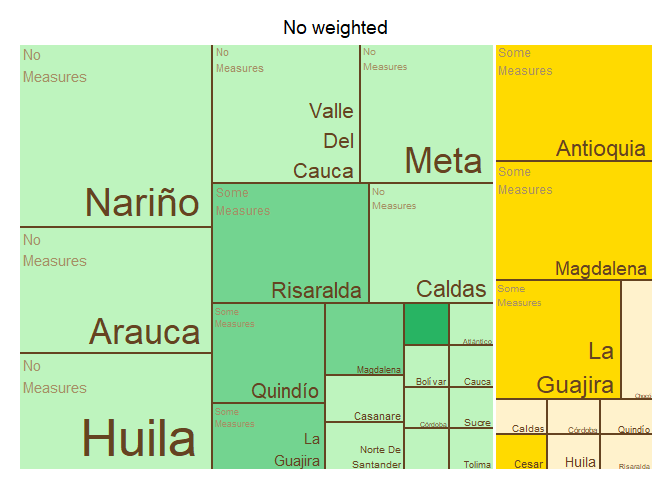<!-- -->

    ## $tm
    ##        crop          expert_in              ave_cat vSize  vColor stdErr
    ## 1    Banana          Antioquia                 <NA>    10 #FFDA00     10
    ## 2    Banana          Antioquia        Some Measures    10 #FFDA00     10
    ## 3    Banana             Caldas                 <NA>     1 #FFF2CC      1
    ## 4    Banana             Caldas          No Measures     1 #FFF2CC      1
    ## 5    Banana              Cesar                 <NA>     1 #FFDA00      1
    ## 6    Banana              Cesar        Some Measures     1 #FFDA00      1
    ## 7    Banana              Chocó                 <NA>     2 #FFF2CC      2
    ## 8    Banana              Chocó          No Measures     2 #FFF2CC      2
    ## 9    Banana            Córdoba                 <NA>     1 #FFF2CC      1
    ## 10   Banana            Córdoba          No Measures     1 #FFF2CC      1
    ## 11   Banana              Huila                 <NA>     1 #FFF2CC      1
    ## 12   Banana              Huila          No Measures     1 #FFF2CC      1
    ## 13   Banana         La Guajira                 <NA>     8 #FFDA00      8
    ## 14   Banana         La Guajira        Some Measures     8 #FFDA00      8
    ## 15   Banana          Magdalena                 <NA>    10 #FFDA00     10
    ## 16   Banana          Magdalena        Some Measures    10 #FFDA00     10
    ## 17   Banana               <NA>                 <NA>    36 #FFF2CC     36
    ## 18   Banana            Quindío                 <NA>     1 #FFF2CC      1
    ## 19   Banana            Quindío          No Measures     1 #FFF2CC      1
    ## 20   Banana          Risaralda                 <NA>     1 #FFF2CC      1
    ## 21   Banana          Risaralda          No Measures     1 #FFF2CC      1
    ## 22 Plantain          Antioquia                 <NA>     1 #28B463      1
    ## 23 Plantain          Antioquia Significant Measures     1 #28B463      1
    ## 24 Plantain             Arauca                 <NA>     2 #BEF4BE      2
    ## 25 Plantain             Arauca          No Measures     2 #BEF4BE      2
    ## 26 Plantain          Atlántico                 <NA>     1 #BEF4BE      1
    ## 27 Plantain          Atlántico          No Measures     1 #BEF4BE      1
    ## 28 Plantain            Bolívar                 <NA>     1 #BEF4BE      1
    ## 29 Plantain            Bolívar          No Measures     1 #BEF4BE      1
    ## 30 Plantain             Caldas                 <NA>     7 #BEF4BE      7
    ## 31 Plantain             Caldas          No Measures     7 #BEF4BE      7
    ## 32 Plantain           Casanare                 <NA>     2 #BEF4BE      2
    ## 33 Plantain           Casanare          No Measures     2 #BEF4BE      2
    ## 34 Plantain            Córdoba                 <NA>     1 #BEF4BE      1
    ## 35 Plantain            Córdoba          No Measures     1 #BEF4BE      1
    ## 36 Plantain              Huila                 <NA>     1 #BEF4BE      1
    ## 37 Plantain              Huila          No Measures     1 #BEF4BE      1
    ## 38 Plantain         La Guajira                 <NA>     4 #73D490      4
    ## 39 Plantain         La Guajira        Some Measures     4 #73D490      4
    ## 40 Plantain          Magdalena                 <NA>     3 #73D490      3
    ## 41 Plantain          Magdalena        Some Measures     3 #73D490      3
    ## 42 Plantain               Meta                 <NA>    10 #BEF4BE     10
    ## 43 Plantain               Meta          No Measures    10 #BEF4BE     10
    ## 44 Plantain               <NA>                 <NA>    53 #BEF4BE     53
    ## 45 Plantain Norte De Santander                 <NA>     1 #BEF4BE      1
    ## 46 Plantain Norte De Santander          No Measures     1 #BEF4BE      1
    ## 47 Plantain            Quindío                 <NA>     6 #73D490      6
    ## 48 Plantain            Quindío        Some Measures     6 #73D490      6
    ## 49 Plantain          Risaralda                 <NA>    10 #73D490     10
    ## 50 Plantain          Risaralda        Some Measures    10 #73D490     10
    ## 51 Plantain          Santander                 <NA>     1 #BEF4BE      1
    ## 52 Plantain          Santander          No Measures     1 #BEF4BE      1
    ## 53 Plantain              Sucre                 <NA>     1 #BEF4BE      1
    ## 54 Plantain              Sucre          No Measures     1 #BEF4BE      1
    ## 55 Plantain             Tolima                 <NA>     1 #BEF4BE      1
    ## 56 Plantain             Tolima          No Measures     1 #BEF4BE      1
    ##    vColorValue level        x0         y0          w          h   color
    ## 1           NA     2 0.5955056 0.44444444 0.20224719 0.55555556 #FFDA00
    ## 2           NA     3 0.5955056 0.44444444 0.20224719 0.55555556 #FFDA00
    ## 3           NA     2 0.8483146 0.29629630 0.07584270 0.14814815 #FFF2CC
    ## 4           NA     3 0.8483146 0.29629630 0.07584270 0.14814815 #FFF2CC
    ## 5           NA     2 0.9241573 0.29629630 0.07584270 0.14814815 #FFDA00
    ## 6           NA     3 0.9241573 0.29629630 0.07584270 0.14814815 #FFDA00
    ## 7           NA     2 0.5955056 0.00000000 0.25280899 0.08888889 #FFF2CC
    ## 8           NA     3 0.5955056 0.00000000 0.25280899 0.08888889 #FFF2CC
    ## 9           NA     2 0.8483146 0.14814815 0.07584270 0.14814815 #FFF2CC
    ## 10          NA     3 0.8483146 0.14814815 0.07584270 0.14814815 #FFF2CC
    ## 11          NA     2 0.9241573 0.14814815 0.07584270 0.14814815 #FFF2CC
    ## 12          NA     3 0.9241573 0.14814815 0.07584270 0.14814815 #FFF2CC
    ## 13          NA     2 0.5955056 0.08888889 0.25280899 0.35555556 #FFDA00
    ## 14          NA     3 0.5955056 0.08888889 0.25280899 0.35555556 #FFDA00
    ## 15          NA     2 0.7977528 0.44444444 0.20224719 0.55555556 #FFDA00
    ## 16          NA     3 0.7977528 0.44444444 0.20224719 0.55555556 #FFDA00
    ## 17          NA     1 0.5955056 0.00000000 0.40449438 1.00000000 #FFF2CC
    ## 18          NA     2 0.8483146 0.00000000 0.07584270 0.14814815 #FFF2CC
    ## 19          NA     3 0.8483146 0.00000000 0.07584270 0.14814815 #FFF2CC
    ## 20          NA     2 0.9241573 0.00000000 0.07584270 0.14814815 #FFF2CC
    ## 21          NA     3 0.9241573 0.00000000 0.07584270 0.14814815 #FFF2CC
    ## 22          NA     2 0.2345931 0.00000000 0.06562045 0.17122642 #28B463
    ## 23          NA     3 0.2345931 0.00000000 0.06562045 0.17122642 #28B463
    ## 24          NA     2 0.5153028 0.34245283 0.08020278 0.28018868 #BEF4BE
    ## 25          NA     3 0.5153028 0.34245283 0.08020278 0.28018868 #BEF4BE
    ## 26          NA     2 0.3002136 0.00000000 0.06562045 0.17122642 #BEF4BE
    ## 27          NA     3 0.3002136 0.00000000 0.06562045 0.17122642 #BEF4BE
    ## 28          NA     2 0.3658340 0.19568733 0.07655720 0.14676550 #BEF4BE
    ## 29          NA     3 0.3658340 0.19568733 0.07655720 0.14676550 #BEF4BE
    ## 30          NA     2 0.0000000 0.28737300 0.23459312 0.33526851 #BEF4BE
    ## 31          NA     3 0.0000000 0.28737300 0.23459312 0.33526851 #BEF4BE
    ## 32          NA     2 0.2345931 0.17122642 0.13124091 0.17122642 #BEF4BE
    ## 33          NA     3 0.2345931 0.17122642 0.13124091 0.17122642 #BEF4BE
    ## 34          NA     2 0.4423912 0.19568733 0.07655720 0.14676550 #BEF4BE
    ## 35          NA     3 0.4423912 0.19568733 0.07655720 0.14676550 #BEF4BE
    ## 36          NA     2 0.5189484 0.19568733 0.07655720 0.14676550 #BEF4BE
    ## 37          NA     3 0.5189484 0.19568733 0.07655720 0.14676550 #BEF4BE
    ## 38          NA     2 0.2345931 0.34245283 0.16040555 0.28018868 #73D490
    ## 39          NA     3 0.2345931 0.34245283 0.16040555 0.28018868 #73D490
    ## 40          NA     2 0.3949987 0.34245283 0.12030417 0.28018868 #73D490
    ## 41          NA     3 0.3949987 0.34245283 0.12030417 0.28018868 #73D490
    ## 42          NA     2 0.0000000 0.62264151 0.29775281 0.37735849 #BEF4BE
    ## 43          NA     3 0.0000000 0.62264151 0.29775281 0.37735849 #BEF4BE
    ## 44          NA     1 0.0000000 0.00000000 0.59550562 1.00000000 #BEF4BE
    ## 45          NA     2 0.3658340 0.09784367 0.11483579 0.09784367 #BEF4BE
    ## 46          NA     3 0.3658340 0.09784367 0.11483579 0.09784367 #BEF4BE
    ## 47          NA     2 0.0000000 0.00000000 0.23459312 0.28737300 #73D490
    ## 48          NA     3 0.0000000 0.00000000 0.23459312 0.28737300 #73D490
    ## 49          NA     2 0.2977528 0.62264151 0.29775281 0.37735849 #73D490
    ## 50          NA     3 0.2977528 0.62264151 0.29775281 0.37735849 #73D490
    ## 51          NA     2 0.3658340 0.00000000 0.11483579 0.09784367 #BEF4BE
    ## 52          NA     3 0.3658340 0.00000000 0.11483579 0.09784367 #BEF4BE
    ## 53          NA     2 0.4806698 0.09784367 0.11483579 0.09784367 #BEF4BE
    ## 54          NA     3 0.4806698 0.09784367 0.11483579 0.09784367 #BEF4BE
    ## 55          NA     2 0.4806698 0.00000000 0.11483579 0.09784367 #BEF4BE
    ## 56          NA     3 0.4806698 0.00000000 0.11483579 0.09784367 #BEF4BE
    ## 
    ## $type
    ## [1] "color"
    ## 
    ## $vSize
    ## [1] "frequency"
    ## 
    ## $vColor
    ## [1] "group_color"
    ## 
    ## $stdErr
    ## [1] "frequency"
    ## 
    ## $algorithm
    ## [1] "pivotSize"
    ## 
    ## $vpCoorX
    ## [1] 0.02812148 0.97187852
    ## 
    ## $vpCoorY
    ## [1] 0.01968504 0.91031496
    ## 
    ## $aspRatio
    ## [1] 1.483512
    ## 
    ## $range
    ## [1] NA NA
    ## 
    ## $mapping
    ## [1] NA NA NA
    ## 
    ## $draw
    ## [1] TRUE

``` r
tree_map_3(data = avg_dept_weight_29, "crop", "expert_in", "ave_cat_weighted", "group_color", title="weighted")
```

    ## `summarise()` has grouped output by 'crop', 'expert_in', 'ave_cat_weighted'.
    ## You can override using the `.groups` argument.

<!-- -->

    ## $tm
    ##        crop          expert_in     ave_cat_weighted vSize  vColor stdErr
    ## 1    Banana          Antioquia                 <NA>    10 #FFDA00     10
    ## 2    Banana          Antioquia        Some Measures    10 #FFDA00     10
    ## 3    Banana             Caldas                 <NA>     1 #FFF2CC      1
    ## 4    Banana             Caldas          No Measures     1 #FFF2CC      1
    ## 5    Banana              Cesar                 <NA>     1 #FFDA00      1
    ## 6    Banana              Cesar        Some Measures     1 #FFDA00      1
    ## 7    Banana              Chocó                 <NA>     2 #FFF2CC      2
    ## 8    Banana              Chocó          No Measures     2 #FFF2CC      2
    ## 9    Banana            Córdoba                 <NA>     1 #FFF2CC      1
    ## 10   Banana            Córdoba          No Measures     1 #FFF2CC      1
    ## 11   Banana              Huila                 <NA>     1 #FFF2CC      1
    ## 12   Banana              Huila          No Measures     1 #FFF2CC      1
    ## 13   Banana         La Guajira                 <NA>     8 #FFDA00      8
    ## 14   Banana         La Guajira        Some Measures     8 #FFDA00      8
    ## 15   Banana          Magdalena                 <NA>     9 #FFDA00      9
    ## 16   Banana          Magdalena        Some Measures     9 #FFDA00      9
    ## 17   Banana               <NA>                 <NA>    35 #FFF2CC     35
    ## 18   Banana            Quindío                 <NA>     1 #FFF2CC      1
    ## 19   Banana            Quindío          No Measures     1 #FFF2CC      1
    ## 20   Banana          Risaralda                 <NA>     1 #FFF2CC      1
    ## 21   Banana          Risaralda          No Measures     1 #FFF2CC      1
    ## 22 Plantain          Antioquia                 <NA>     1 #28B463      1
    ## 23 Plantain          Antioquia Significant Measures     1 #28B463      1
    ## 24 Plantain             Arauca                 <NA>     2 #BEF4BE      2
    ## 25 Plantain             Arauca          No Measures     2 #BEF4BE      2
    ## 26 Plantain          Atlántico                 <NA>     1 #BEF4BE      1
    ## 27 Plantain          Atlántico          No Measures     1 #BEF4BE      1
    ## 28 Plantain            Bolívar                 <NA>     1 #BEF4BE      1
    ## 29 Plantain            Bolívar          No Measures     1 #BEF4BE      1
    ## 30 Plantain             Caldas                 <NA>     7 #BEF4BE      7
    ## 31 Plantain             Caldas          No Measures     7 #BEF4BE      7
    ## 32 Plantain           Casanare                 <NA>     2 #BEF4BE      2
    ## 33 Plantain           Casanare          No Measures     2 #BEF4BE      2
    ## 34 Plantain            Córdoba                 <NA>     1 #BEF4BE      1
    ## 35 Plantain            Córdoba          No Measures     1 #BEF4BE      1
    ## 36 Plantain              Huila                 <NA>     1 #BEF4BE      1
    ## 37 Plantain              Huila          No Measures     1 #BEF4BE      1
    ## 38 Plantain         La Guajira                 <NA>     4 #73D490      4
    ## 39 Plantain         La Guajira        Some Measures     4 #73D490      4
    ## 40 Plantain          Magdalena                 <NA>     3 #73D490      3
    ## 41 Plantain          Magdalena        Some Measures     3 #73D490      3
    ## 42 Plantain               Meta                 <NA>     9 #BEF4BE      9
    ## 43 Plantain               Meta          No Measures     9 #BEF4BE      9
    ## 44 Plantain               <NA>                 <NA>    52 #BEF4BE     52
    ## 45 Plantain Norte De Santander                 <NA>     1 #BEF4BE      1
    ## 46 Plantain Norte De Santander          No Measures     1 #BEF4BE      1
    ## 47 Plantain            Quindío                 <NA>     6 #73D490      6
    ## 48 Plantain            Quindío        Some Measures     6 #73D490      6
    ## 49 Plantain          Risaralda                 <NA>    10 #73D490     10
    ## 50 Plantain          Risaralda        Some Measures    10 #73D490     10
    ## 51 Plantain          Santander                 <NA>     1 #BEF4BE      1
    ## 52 Plantain          Santander          No Measures     1 #BEF4BE      1
    ## 53 Plantain              Sucre                 <NA>     1 #BEF4BE      1
    ## 54 Plantain              Sucre          No Measures     1 #BEF4BE      1
    ## 55 Plantain             Tolima                 <NA>     1 #BEF4BE      1
    ## 56 Plantain             Tolima          No Measures     1 #BEF4BE      1
    ##    vColorValue level        x0         y0          w          h   color
    ## 1           NA     2 0.5977011 0.45714286 0.21173624 0.54285714 #FFDA00
    ## 2           NA     3 0.5977011 0.45714286 0.21173624 0.54285714 #FFDA00
    ## 3           NA     2 0.8491379 0.30476190 0.07543103 0.15238095 #FFF2CC
    ## 4           NA     3 0.8491379 0.30476190 0.07543103 0.15238095 #FFF2CC
    ## 5           NA     2 0.9245690 0.30476190 0.07543103 0.15238095 #FFDA00
    ## 6           NA     3 0.9245690 0.30476190 0.07543103 0.15238095 #FFDA00
    ## 7           NA     2 0.5977011 0.00000000 0.25143678 0.09142857 #FFF2CC
    ## 8           NA     3 0.5977011 0.00000000 0.25143678 0.09142857 #FFF2CC
    ## 9           NA     2 0.8491379 0.15238095 0.07543103 0.15238095 #FFF2CC
    ## 10          NA     3 0.8491379 0.15238095 0.07543103 0.15238095 #FFF2CC
    ## 11          NA     2 0.9245690 0.15238095 0.07543103 0.15238095 #FFF2CC
    ## 12          NA     3 0.9245690 0.15238095 0.07543103 0.15238095 #FFF2CC
    ## 13          NA     2 0.5977011 0.09142857 0.25143678 0.36571429 #FFDA00
    ## 14          NA     3 0.5977011 0.09142857 0.25143678 0.36571429 #FFDA00
    ## 15          NA     2 0.8094374 0.45714286 0.19056261 0.54285714 #FFDA00
    ## 16          NA     3 0.8094374 0.45714286 0.19056261 0.54285714 #FFDA00
    ## 17          NA     1 0.5977011 0.00000000 0.40229885 1.00000000 #FFF2CC
    ## 18          NA     2 0.8491379 0.00000000 0.07543103 0.15238095 #FFF2CC
    ## 19          NA     3 0.8491379 0.00000000 0.07543103 0.15238095 #FFF2CC
    ## 20          NA     2 0.9245690 0.00000000 0.07543103 0.15238095 #FFF2CC
    ## 21          NA     3 0.9245690 0.00000000 0.07543103 0.15238095 #FFF2CC
    ## 22          NA     2 0.2354580 0.00000000 0.06586239 0.17451923 #28B463
    ## 23          NA     3 0.2354580 0.00000000 0.06586239 0.17451923 #28B463
    ## 24          NA     2 0.5172027 0.34903846 0.08049847 0.28557692 #BEF4BE
    ## 25          NA     3 0.5172027 0.34903846 0.08049847 0.28557692 #BEF4BE
    ## 26          NA     2 0.3013204 0.00000000 0.06586239 0.17451923 #BEF4BE
    ## 27          NA     3 0.3013204 0.00000000 0.06586239 0.17451923 #BEF4BE
    ## 28          NA     2 0.3671828 0.19945055 0.07683945 0.14958791 #BEF4BE
    ## 29          NA     3 0.3671828 0.19945055 0.07683945 0.14958791 #BEF4BE
    ## 30          NA     2 0.0000000 0.29289941 0.23545803 0.34171598 #BEF4BE
    ## 31          NA     3 0.0000000 0.29289941 0.23545803 0.34171598 #BEF4BE
    ## 32          NA     2 0.2354580 0.17451923 0.13172477 0.17451923 #BEF4BE
    ## 33          NA     3 0.2354580 0.17451923 0.13172477 0.17451923 #BEF4BE
    ## 34          NA     2 0.4440222 0.19945055 0.07683945 0.14958791 #BEF4BE
    ## 35          NA     3 0.4440222 0.19945055 0.07683945 0.14958791 #BEF4BE
    ## 36          NA     2 0.5208617 0.19945055 0.07683945 0.14958791 #BEF4BE
    ## 37          NA     3 0.5208617 0.19945055 0.07683945 0.14958791 #BEF4BE
    ## 38          NA     2 0.2354580 0.34903846 0.16099694 0.28557692 #73D490
    ## 39          NA     3 0.2354580 0.34903846 0.16099694 0.28557692 #73D490
    ## 40          NA     2 0.3964550 0.34903846 0.12074771 0.28557692 #73D490
    ## 41          NA     3 0.3964550 0.34903846 0.12074771 0.28557692 #73D490
    ## 42          NA     2 0.3145796 0.63461538 0.28312160 0.36538462 #BEF4BE
    ## 43          NA     3 0.3145796 0.63461538 0.28312160 0.36538462 #BEF4BE
    ## 44          NA     1 0.0000000 0.00000000 0.59770115 1.00000000 #BEF4BE
    ## 45          NA     2 0.3671828 0.09972527 0.11525917 0.09972527 #BEF4BE
    ## 46          NA     3 0.3671828 0.09972527 0.11525917 0.09972527 #BEF4BE
    ## 47          NA     2 0.0000000 0.00000000 0.23545803 0.29289941 #73D490
    ## 48          NA     3 0.0000000 0.00000000 0.23545803 0.29289941 #73D490
    ## 49          NA     2 0.0000000 0.63461538 0.31457955 0.36538462 #73D490
    ## 50          NA     3 0.0000000 0.63461538 0.31457955 0.36538462 #73D490
    ## 51          NA     2 0.3671828 0.00000000 0.11525917 0.09972527 #BEF4BE
    ## 52          NA     3 0.3671828 0.00000000 0.11525917 0.09972527 #BEF4BE
    ## 53          NA     2 0.4824420 0.09972527 0.11525917 0.09972527 #BEF4BE
    ## 54          NA     3 0.4824420 0.09972527 0.11525917 0.09972527 #BEF4BE
    ## 55          NA     2 0.4824420 0.00000000 0.11525917 0.09972527 #BEF4BE
    ## 56          NA     3 0.4824420 0.00000000 0.11525917 0.09972527 #BEF4BE
    ## 
    ## $type
    ## [1] "color"
    ## 
    ## $vSize
    ## [1] "frequency"
    ## 
    ## $vColor
    ## [1] "group_color"
    ## 
    ## $stdErr
    ## [1] "frequency"
    ## 
    ## $algorithm
    ## [1] "pivotSize"
    ## 
    ## $vpCoorX
    ## [1] 0.02812148 0.97187852
    ## 
    ## $vpCoorY
    ## [1] 0.01968504 0.91031496
    ## 
    ## $aspRatio
    ## [1] 1.483512
    ## 
    ## $range
    ## [1] NA NA
    ## 
    ## $mapping
    ## [1] NA NA NA
    ## 
    ## $draw
    ## [1] TRUE

``` r
#Map of Colombia  
#non weighted
nal_q29_no_weight<- question_29 %>% group_by(expert_in) %>%
  summarise(average= mean(as.numeric(numeric_answer))) %>%
  group_by(average) %>% 
  mutate(cat= category_by_mean_by_question(language = "en", mean = average, question =29))%>%
  rename(EKE.expert.in = expert_in)

nal_q29_no_weight<- full_join(codes_department, nal_q29_no_weight)
```

    ## Joining with `by = join_by(EKE.expert.in)`

``` r
nal_q29_no_weight$cat<- factor(nal_q29_no_weight$cat, levels = level_29)
colmap(departamentos, data = nal_q29_no_weight, data_id = "id_depto", var = "cat")+
  scale_fill_manual(values = palette_soil(length(unique(nal_q29_no_weight$cat))-1), na.value = "#eeeeee")
```

    ## Scale for fill is already present.
    ## Adding another scale for fill, which will replace the existing scale.

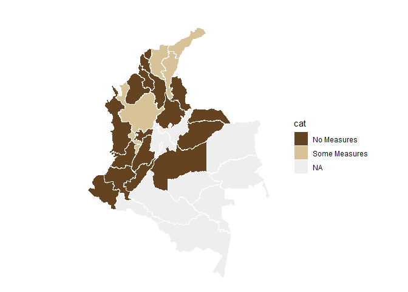<!-- -->

``` r
# weighted
nal_q29_weight<- inner_join(question_29, experience_of_each_expert)
```

    ## Joining with `by = join_by(crop, expert_ID, expert_in)`

``` r
nal_q29_weight<- nal_q29_weight %>%
  group_by(expert_in) %>%
  mutate(numeric_answer=as.numeric(numeric_answer)) %>%
  summarise(average_weighted= weighted.mean(numeric_answer, weights)) %>% 
  group_by(average_weighted) %>%
  mutate(cat_weighted= category_by_mean_by_question(language = "en", mean = average_weighted, question =29)) %>%
  rename(EKE.expert.in=expert_in)

nal_q29_weight<- full_join(codes_department, nal_q29_weight)
```

    ## Joining with `by = join_by(EKE.expert.in)`

``` r
nal_q29_weight$cat_weighted<- factor(nal_q29_weight$cat_weighted, levels = level_29)
colmap(departamentos, data = nal_q29_weight, data_id = "id_depto", var = "cat_weighted")+
  scale_fill_manual(values = palette_soil(length(unique(nal_q29_weight$cat))-1), na.value = "#eeeeee")
```

    ## Scale for fill is already present.
    ## Adding another scale for fill, which will replace the existing scale.

<!-- -->

## Question 30: What degree of restriction does each area successfully apply to the movement of personnel and visitors within and between plantations?

``` r
#selecting only question 30----
question_30<- filter(individual_surveys, question_number==30)
#unique(question_30$numeric_answer)
#dput(unique(question_30$answer_in_english))

#organizing the order of the levels
level_30<- c("No Limitation", "Little Limitation",  "Moderate Limitation", "Extreme Limitation", "Unsure")
question_30$answer_in_english<- factor(question_30$answer_in_english,levels = level_30)
question_30<- filter(question_30, answer_in_english!="Unsure")
#average by department (weighted and no weighted)
#not weighted 
avg_dept_no_weight_30<- question_30 %>%
  group_by(crop, expert_in) %>%
  mutate(numeric_answer=as.numeric(numeric_answer))%>%
  mutate(average= mean(numeric_answer)) %>%
  group_by(average)%>%
  mutate(ave_cat= category_by_mean_by_question(30, mean =average, language = "en"))
```

    ## Warning: There were 8 warnings in `mutate()`.
    ## The first warning was:
    ## ℹ In argument: `ave_cat = category_by_mean_by_question(30, mean = average,
    ##   language = "en")`.
    ## ℹ In group 0: .
    ## Caused by warning:
    ## ! There was 1 warning in `filter()`.
    ## ℹ In argument: `number == question & number_to_category == mean`.
    ## Caused by warning in `number_to_category == mean`:
    ## ! longer object length is not a multiple of shorter object length
    ## ℹ Run `dplyr::last_dplyr_warnings()` to see the 7 remaining warnings.

``` r
#weighted 
add_weights_question_30<- inner_join(question_30, experience_of_each_expert)
```

    ## Joining with `by = join_by(crop, expert_ID, expert_in)`

``` r
avg_dept_weight_30<- add_weights_question_30 %>%
  group_by(crop, expert_in) %>%
  mutate(numeric_answer=as.numeric(numeric_answer))%>%
  mutate(average_weighted= weighted.mean(numeric_answer, weights)) %>% 
  group_by(average_weighted)%>%
  mutate(ave_cat_weighted= category_by_mean_by_question(30, mean =average_weighted, language = "en"))
```

    ## Warning: There were 8 warnings in `mutate()`.
    ## The first warning was:
    ## ℹ In argument: `ave_cat_weighted = category_by_mean_by_question(30, mean =
    ##   average_weighted, language = "en")`.
    ## ℹ In group 0: .
    ## Caused by warning:
    ## ! There was 1 warning in `filter()`.
    ## ℹ In argument: `number == question & number_to_category == mean`.
    ## Caused by warning in `number_to_category == mean`:
    ## ! longer object length is not a multiple of shorter object length
    ## ℹ Run `dplyr::last_dplyr_warnings()` to see the 7 remaining warnings.

``` r
#finding the levels per crop (banana and plantain) no weighted
levels_per_crop_Q30_no_weighted<- tapply(avg_dept_no_weight_30$ave_cat, avg_dept_no_weight_30$crop, function(x){(unique(x))})
#generating a ramp palette according to the number of levels per crop
colors_banana_question30_no_weighted<- palette_banana(length(levels_per_crop_Q30_no_weighted$Banana))
colors_plantain_question30_no_weighted<- palette_plantain(length(levels_per_crop_Q30_no_weighted$Plantain))
#Assigning the colors by crop and answer
# Define the knowledge levels for each crop
levels_by_crop_no_weighted_30 <- list(
  Banana = levels_per_crop_Q30_no_weighted$Banana,
  Plantain = levels_per_crop_Q30_no_weighted$Plantain
)
# Define the colors for each crop
colors_by_crop_no_weighted_30 <- list(
  Banana = colors_banana_question30_no_weighted, # Replace with actual color vector for Banana
  Plantain = colors_plantain_question30_no_weighted # Replace with actual color vector for Plantain
  # Add more crops and their color vectors here if needed
)
# Now call the function
avg_dept_no_weight_30 <- assign_group_color(data = avg_dept_no_weight_30, levels_by_crop = levels_by_crop_no_weighted_30, colors_by_crop = colors_by_crop_no_weighted_30,answer_col =  "ave_cat")

#finding the levels per crop (banana and plantain) weighted
levels_per_crop_Q30_weighted<- tapply(avg_dept_weight_30$ave_cat_weighted, avg_dept_weight_30$crop, function(x){(unique(x))})
#generating a ramp palette according to the number of levels per crop
colors_banana_question30_weighted<- palette_banana(length(levels_per_crop_Q30_weighted$Banana))
colors_plantain_question30_weighted<- palette_plantain(length(levels_per_crop_Q30_weighted$Plantain))
#Assigning the colors by crop and answer
# Define the knowledge levels for each crop
levels_by_crop_weighted_30 <- list(
  Banana = levels_per_crop_Q30_weighted$Banana,
  Plantain = levels_per_crop_Q30_weighted$Plantain
)
# Define the colors for each crop
colors_by_crop_weighted_30 <- list(
  Banana = colors_banana_question30_weighted, # Replace with actual color vector for Banana
  Plantain = colors_plantain_question30_weighted # Replace with actual color vector for Plantain
  # Add more crops and their color vectors here if needed
)
# Now call the function
avg_dept_weight_30 <- assign_group_color(data = avg_dept_weight_30, levels_by_crop = levels_by_crop_weighted_30, colors_by_crop = colors_by_crop_weighted_30,answer_col =  "ave_cat_weighted")

#tree map
tree_map_3(data = avg_dept_no_weight_30, "crop", "expert_in", "ave_cat", "group_color", title="No weighted")
```

    ## `summarise()` has grouped output by 'crop', 'expert_in', 'ave_cat'. You can
    ## override using the `.groups` argument.

<!-- -->

    ## $tm
    ##        crop          expert_in             ave_cat vSize  vColor stdErr
    ## 1    Banana          Antioquia Moderate Limitation    11 #FFDA00     11
    ## 2    Banana          Antioquia                <NA>    11 #FFDA00     11
    ## 3    Banana             Caldas Moderate Limitation     1 #FFDA00      1
    ## 4    Banana             Caldas                <NA>     1 #FFDA00      1
    ## 5    Banana              Cesar  Extreme Limitation     2 #FFE566      2
    ## 6    Banana              Cesar                <NA>     2 #FFE566      2
    ## 7    Banana              Chocó                <NA>     2 #FFF2CC      2
    ## 8    Banana              Chocó       No Limitation     2 #FFF2CC      2
    ## 9    Banana            Córdoba                <NA>     1 #FFF2CC      1
    ## 10   Banana            Córdoba       No Limitation     1 #FFF2CC      1
    ## 11   Banana              Huila Moderate Limitation     1 #FFDA00      1
    ## 12   Banana              Huila                <NA>     1 #FFDA00      1
    ## 13   Banana         La Guajira Moderate Limitation    10 #FFDA00     10
    ## 14   Banana         La Guajira                <NA>    10 #FFDA00     10
    ## 15   Banana          Magdalena Moderate Limitation    12 #FFDA00     12
    ## 16   Banana          Magdalena                <NA>    12 #FFDA00     12
    ## 17   Banana               <NA>                <NA>    42 #FFDA00     42
    ## 18   Banana            Quindío Moderate Limitation     1 #FFDA00      1
    ## 19   Banana            Quindío                <NA>     1 #FFDA00      1
    ## 20   Banana          Risaralda Moderate Limitation     1 #FFDA00      1
    ## 21   Banana          Risaralda                <NA>     1 #FFDA00      1
    ## 22 Plantain          Antioquia  Extreme Limitation     2 #28B463      2
    ## 23 Plantain          Antioquia                <NA>     2 #28B463      2
    ## 24 Plantain             Arauca   Little Limitation     2 #BEF4BE      2
    ## 25 Plantain             Arauca                <NA>     2 #BEF4BE      2
    ## 26 Plantain          Atlántico Moderate Limitation     1 #73D490      1
    ## 27 Plantain          Atlántico                <NA>     1 #73D490      1
    ## 28 Plantain            Bolívar Moderate Limitation     1 #73D490      1
    ## 29 Plantain            Bolívar                <NA>     1 #73D490      1
    ## 30 Plantain             Caldas   Little Limitation     7 #BEF4BE      7
    ## 31 Plantain             Caldas                <NA>     7 #BEF4BE      7
    ## 32 Plantain           Casanare   Little Limitation     2 #BEF4BE      2
    ## 33 Plantain           Casanare                <NA>     2 #BEF4BE      2
    ## 34 Plantain            Córdoba Moderate Limitation     1 #73D490      1
    ## 35 Plantain            Córdoba                <NA>     1 #73D490      1
    ## 36 Plantain              Huila Moderate Limitation     1 #73D490      1
    ## 37 Plantain              Huila                <NA>     1 #73D490      1
    ## 38 Plantain         La Guajira Moderate Limitation     4 #73D490      4
    ## 39 Plantain         La Guajira                <NA>     4 #73D490      4
    ## 40 Plantain          Magdalena  Extreme Limitation     3 #28B463      3
    ## 41 Plantain          Magdalena                <NA>     3 #28B463      3
    ## 42 Plantain               Meta   Little Limitation    11 #BEF4BE     11
    ## 43 Plantain               Meta                <NA>    11 #BEF4BE     11
    ## 44 Plantain               <NA>                <NA>    55 #73D490     55
    ## 45 Plantain Norte De Santander  Extreme Limitation     1 #28B463      1
    ## 46 Plantain Norte De Santander                <NA>     1 #28B463      1
    ## 47 Plantain            Quindío   Little Limitation     6 #BEF4BE      6
    ## 48 Plantain            Quindío                <NA>     6 #BEF4BE      6
    ## 49 Plantain          Risaralda   Little Limitation    10 #BEF4BE     10
    ## 50 Plantain          Risaralda                <NA>    10 #BEF4BE     10
    ## 51 Plantain          Santander  Extreme Limitation     1 #28B463      1
    ## 52 Plantain          Santander                <NA>     1 #28B463      1
    ## 53 Plantain              Sucre  Extreme Limitation     1 #28B463      1
    ## 54 Plantain              Sucre                <NA>     1 #28B463      1
    ## 55 Plantain             Tolima Moderate Limitation     1 #73D490      1
    ## 56 Plantain             Tolima                <NA>     1 #73D490      1
    ##    vColorValue level        x0         y0          w          h   color
    ## 1           NA     3 0.7929180 0.45238095 0.20708203 0.54761905 #FFDA00
    ## 2           NA     2 0.7929180 0.45238095 0.20708203 0.54761905 #FFDA00
    ## 3           NA     3 0.9468258 0.25850340 0.05317417 0.19387755 #FFDA00
    ## 4           NA     2 0.9468258 0.25850340 0.05317417 0.19387755 #FFDA00
    ## 5           NA     3 0.5670103 0.00000000 0.27346717 0.07539683 #FFE566
    ## 6           NA     2 0.5670103 0.00000000 0.27346717 0.07539683 #FFE566
    ## 7           NA     2 0.8404775 0.25850340 0.10634835 0.19387755 #FFF2CC
    ## 8           NA     3 0.8404775 0.25850340 0.10634835 0.19387755 #FFF2CC
    ## 9           NA     2 0.8404775 0.12925170 0.07976126 0.12925170 #FFF2CC
    ## 10          NA     3 0.8404775 0.12925170 0.07976126 0.12925170 #FFF2CC
    ## 11          NA     3 0.9202387 0.12925170 0.07976126 0.12925170 #FFDA00
    ## 12          NA     2 0.9202387 0.12925170 0.07976126 0.12925170 #FFDA00
    ## 13          NA     3 0.5670103 0.07539683 0.27346717 0.37698413 #FFDA00
    ## 14          NA     2 0.5670103 0.07539683 0.27346717 0.37698413 #FFDA00
    ## 15          NA     3 0.5670103 0.45238095 0.22590766 0.54761905 #FFDA00
    ## 16          NA     2 0.5670103 0.45238095 0.22590766 0.54761905 #FFDA00
    ## 17          NA     1 0.5670103 0.00000000 0.43298969 1.00000000 #FFDA00
    ## 18          NA     3 0.8404775 0.00000000 0.07976126 0.12925170 #FFDA00
    ## 19          NA     2 0.8404775 0.00000000 0.07976126 0.12925170 #FFDA00
    ## 20          NA     3 0.9202387 0.00000000 0.07976126 0.12925170 #FFDA00
    ## 21          NA     2 0.9202387 0.00000000 0.07976126 0.12925170 #FFDA00
    ## 22          NA     3 0.4891854 0.35324675 0.07782494 0.26493506 #28B463
    ## 23          NA     2 0.4891854 0.35324675 0.07782494 0.26493506 #28B463
    ## 24          NA     3 0.2167981 0.17662338 0.11673742 0.17662338 #BEF4BE
    ## 25          NA     2 0.2167981 0.17662338 0.11673742 0.17662338 #BEF4BE
    ## 26          NA     3 0.3335355 0.22077922 0.07782494 0.13246753 #73D490
    ## 27          NA     2 0.3335355 0.22077922 0.07782494 0.13246753 #73D490
    ## 28          NA     3 0.4113604 0.22077922 0.07782494 0.13246753 #73D490
    ## 29          NA     2 0.4113604 0.22077922 0.07782494 0.13246753 #73D490
    ## 30          NA     3 0.0000000 0.28531469 0.21679806 0.33286713 #BEF4BE
    ## 31          NA     2 0.0000000 0.28531469 0.21679806 0.33286713 #BEF4BE
    ## 32          NA     3 0.2167981 0.00000000 0.11673742 0.17662338 #BEF4BE
    ## 33          NA     2 0.2167981 0.00000000 0.11673742 0.17662338 #BEF4BE
    ## 34          NA     3 0.4891854 0.22077922 0.07782494 0.13246753 #73D490
    ## 35          NA     2 0.4891854 0.22077922 0.07782494 0.13246753 #73D490
    ## 36          NA     3 0.3335355 0.11038961 0.09338993 0.11038961 #73D490
    ## 37          NA     2 0.3335355 0.11038961 0.09338993 0.11038961 #73D490
    ## 38          NA     3 0.2167981 0.35324675 0.15564989 0.26493506 #73D490
    ## 39          NA     2 0.2167981 0.35324675 0.15564989 0.26493506 #73D490
    ## 40          NA     3 0.3724479 0.35324675 0.11673742 0.26493506 #28B463
    ## 41          NA     2 0.3724479 0.35324675 0.11673742 0.26493506 #28B463
    ## 42          NA     3 0.0000000 0.61818182 0.29700540 0.38181818 #BEF4BE
    ## 43          NA     2 0.0000000 0.61818182 0.29700540 0.38181818 #BEF4BE
    ## 44          NA     1 0.0000000 0.00000000 0.56701031 1.00000000 #73D490
    ## 45          NA     3 0.3335355 0.00000000 0.09338993 0.11038961 #28B463
    ## 46          NA     2 0.3335355 0.00000000 0.09338993 0.11038961 #28B463
    ## 47          NA     3 0.0000000 0.00000000 0.21679806 0.28531469 #BEF4BE
    ## 48          NA     2 0.0000000 0.00000000 0.21679806 0.28531469 #BEF4BE
    ## 49          NA     3 0.2970054 0.61818182 0.27000491 0.38181818 #BEF4BE
    ## 50          NA     2 0.2970054 0.61818182 0.27000491 0.38181818 #BEF4BE
    ## 51          NA     3 0.4269254 0.07359307 0.07004245 0.14718615 #28B463
    ## 52          NA     2 0.4269254 0.07359307 0.07004245 0.14718615 #28B463
    ## 53          NA     3 0.4969679 0.07359307 0.07004245 0.14718615 #28B463
    ## 54          NA     2 0.4969679 0.07359307 0.07004245 0.14718615 #28B463
    ## 55          NA     3 0.4269254 0.00000000 0.14008490 0.07359307 #73D490
    ## 56          NA     2 0.4269254 0.00000000 0.14008490 0.07359307 #73D490
    ## 
    ## $type
    ## [1] "color"
    ## 
    ## $vSize
    ## [1] "frequency"
    ## 
    ## $vColor
    ## [1] "group_color"
    ## 
    ## $stdErr
    ## [1] "frequency"
    ## 
    ## $algorithm
    ## [1] "pivotSize"
    ## 
    ## $vpCoorX
    ## [1] 0.02812148 0.97187852
    ## 
    ## $vpCoorY
    ## [1] 0.01968504 0.91031496
    ## 
    ## $aspRatio
    ## [1] 1.483512
    ## 
    ## $range
    ## [1] NA NA
    ## 
    ## $mapping
    ## [1] NA NA NA
    ## 
    ## $draw
    ## [1] TRUE

``` r
tree_map_3(data = avg_dept_weight_30, "crop", "expert_in", "ave_cat_weighted", "group_color", title="weighted")
```

    ## `summarise()` has grouped output by 'crop', 'expert_in', 'ave_cat_weighted'.
    ## You can override using the `.groups` argument.

<!-- -->

    ## $tm
    ##        crop          expert_in    ave_cat_weighted vSize  vColor stdErr
    ## 1    Banana          Antioquia Moderate Limitation    11 #FFDA00     11
    ## 2    Banana          Antioquia                <NA>    11 #FFDA00     11
    ## 3    Banana             Caldas Moderate Limitation     1 #FFDA00      1
    ## 4    Banana             Caldas                <NA>     1 #FFDA00      1
    ## 5    Banana              Cesar  Extreme Limitation     2 #FFE566      2
    ## 6    Banana              Cesar                <NA>     2 #FFE566      2
    ## 7    Banana              Chocó                <NA>     2 #FFF2CC      2
    ## 8    Banana              Chocó       No Limitation     2 #FFF2CC      2
    ## 9    Banana            Córdoba                <NA>     1 #FFF2CC      1
    ## 10   Banana            Córdoba       No Limitation     1 #FFF2CC      1
    ## 11   Banana              Huila Moderate Limitation     1 #FFDA00      1
    ## 12   Banana              Huila                <NA>     1 #FFDA00      1
    ## 13   Banana         La Guajira Moderate Limitation     9 #FFDA00      9
    ## 14   Banana         La Guajira                <NA>     9 #FFDA00      9
    ## 15   Banana          Magdalena Moderate Limitation    11 #FFDA00     11
    ## 16   Banana          Magdalena                <NA>    11 #FFDA00     11
    ## 17   Banana               <NA>                <NA>    40 #FFDA00     40
    ## 18   Banana            Quindío Moderate Limitation     1 #FFDA00      1
    ## 19   Banana            Quindío                <NA>     1 #FFDA00      1
    ## 20   Banana          Risaralda Moderate Limitation     1 #FFDA00      1
    ## 21   Banana          Risaralda                <NA>     1 #FFDA00      1
    ## 22 Plantain          Antioquia Moderate Limitation     2 #28B463      2
    ## 23 Plantain          Antioquia                <NA>     2 #28B463      2
    ## 24 Plantain             Arauca   Little Limitation     2 #73D490      2
    ## 25 Plantain             Arauca                <NA>     2 #73D490      2
    ## 26 Plantain          Atlántico Moderate Limitation     1 #28B463      1
    ## 27 Plantain          Atlántico                <NA>     1 #28B463      1
    ## 28 Plantain            Bolívar Moderate Limitation     1 #28B463      1
    ## 29 Plantain            Bolívar                <NA>     1 #28B463      1
    ## 30 Plantain             Caldas   Little Limitation     7 #73D490      7
    ## 31 Plantain             Caldas                <NA>     7 #73D490      7
    ## 32 Plantain           Casanare   Little Limitation     2 #73D490      2
    ## 33 Plantain           Casanare                <NA>     2 #73D490      2
    ## 34 Plantain            Córdoba Moderate Limitation     1 #28B463      1
    ## 35 Plantain            Córdoba                <NA>     1 #28B463      1
    ## 36 Plantain              Huila Moderate Limitation     1 #28B463      1
    ## 37 Plantain              Huila                <NA>     1 #28B463      1
    ## 38 Plantain         La Guajira Moderate Limitation     4 #28B463      4
    ## 39 Plantain         La Guajira                <NA>     4 #28B463      4
    ## 40 Plantain          Magdalena  Extreme Limitation     3 #BEF4BE      3
    ## 41 Plantain          Magdalena                <NA>     3 #BEF4BE      3
    ## 42 Plantain               Meta   Little Limitation    10 #73D490     10
    ## 43 Plantain               Meta                <NA>    10 #73D490     10
    ## 44 Plantain               <NA>                <NA>    54 #28B463     54
    ## 45 Plantain Norte De Santander  Extreme Limitation     1 #BEF4BE      1
    ## 46 Plantain Norte De Santander                <NA>     1 #BEF4BE      1
    ## 47 Plantain            Quindío   Little Limitation     6 #73D490      6
    ## 48 Plantain            Quindío                <NA>     6 #73D490      6
    ## 49 Plantain          Risaralda   Little Limitation    10 #73D490     10
    ## 50 Plantain          Risaralda                <NA>    10 #73D490     10
    ## 51 Plantain          Santander  Extreme Limitation     1 #BEF4BE      1
    ## 52 Plantain          Santander                <NA>     1 #BEF4BE      1
    ## 53 Plantain              Sucre  Extreme Limitation     1 #BEF4BE      1
    ## 54 Plantain              Sucre                <NA>     1 #BEF4BE      1
    ## 55 Plantain             Tolima Moderate Limitation     1 #28B463      1
    ## 56 Plantain             Tolima                <NA>     1 #28B463      1
    ##    vColorValue level        x0         y0          w          h   color
    ## 1           NA     3 0.5744681 0.45000000 0.21276596 0.55000000 #FFDA00
    ## 2           NA     2 0.5744681 0.45000000 0.21276596 0.55000000 #FFDA00
    ## 3           NA     3 0.9448385 0.25714286 0.05516154 0.19285714 #FFDA00
    ## 4           NA     2 0.9448385 0.25714286 0.05516154 0.19285714 #FFDA00
    ## 5           NA     3 0.5744681 0.00000000 0.26004728 0.08181818 #FFE566
    ## 6           NA     2 0.5744681 0.00000000 0.26004728 0.08181818 #FFE566
    ## 7           NA     2 0.8345154 0.25714286 0.11032309 0.19285714 #FFF2CC
    ## 8           NA     3 0.8345154 0.25714286 0.11032309 0.19285714 #FFF2CC
    ## 9           NA     2 0.8345154 0.12857143 0.08274232 0.12857143 #FFF2CC
    ## 10          NA     3 0.8345154 0.12857143 0.08274232 0.12857143 #FFF2CC
    ## 11          NA     3 0.9172577 0.12857143 0.08274232 0.12857143 #FFDA00
    ## 12          NA     2 0.9172577 0.12857143 0.08274232 0.12857143 #FFDA00
    ## 13          NA     3 0.5744681 0.08181818 0.26004728 0.36818182 #FFDA00
    ## 14          NA     2 0.5744681 0.08181818 0.26004728 0.36818182 #FFDA00
    ## 15          NA     3 0.7872340 0.45000000 0.21276596 0.55000000 #FFDA00
    ## 16          NA     2 0.7872340 0.45000000 0.21276596 0.55000000 #FFDA00
    ## 17          NA     1 0.5744681 0.00000000 0.42553191 1.00000000 #FFDA00
    ## 18          NA     3 0.8345154 0.00000000 0.08274232 0.12857143 #FFDA00
    ## 19          NA     2 0.8345154 0.00000000 0.08274232 0.12857143 #FFDA00
    ## 20          NA     3 0.9172577 0.00000000 0.08274232 0.12857143 #FFDA00
    ## 21          NA     2 0.9172577 0.00000000 0.08274232 0.12857143 #FFDA00
    ## 22          NA     3 0.4956195 0.35978836 0.07884856 0.26984127 #28B463
    ## 23          NA     2 0.4956195 0.35978836 0.07884856 0.26984127 #28B463
    ## 24          NA     3 0.2196496 0.17989418 0.11827284 0.17989418 #73D490
    ## 25          NA     2 0.2196496 0.17989418 0.11827284 0.17989418 #73D490
    ## 26          NA     3 0.3379224 0.22486772 0.07884856 0.13492063 #28B463
    ## 27          NA     2 0.3379224 0.22486772 0.07884856 0.13492063 #28B463
    ## 28          NA     3 0.4167710 0.22486772 0.07884856 0.13492063 #28B463
    ## 29          NA     2 0.4167710 0.22486772 0.07884856 0.13492063 #28B463
    ## 30          NA     3 0.0000000 0.29059829 0.21964956 0.33903134 #73D490
    ## 31          NA     2 0.0000000 0.29059829 0.21964956 0.33903134 #73D490
    ## 32          NA     3 0.2196496 0.00000000 0.11827284 0.17989418 #73D490
    ## 33          NA     2 0.2196496 0.00000000 0.11827284 0.17989418 #73D490
    ## 34          NA     3 0.4956195 0.22486772 0.07884856 0.13492063 #28B463
    ## 35          NA     2 0.4956195 0.22486772 0.07884856 0.13492063 #28B463
    ## 36          NA     3 0.3379224 0.11243386 0.09461827 0.11243386 #28B463
    ## 37          NA     2 0.3379224 0.11243386 0.09461827 0.11243386 #28B463
    ## 38          NA     3 0.2196496 0.35978836 0.15769712 0.26984127 #28B463
    ## 39          NA     2 0.2196496 0.35978836 0.15769712 0.26984127 #28B463
    ## 40          NA     3 0.3773467 0.35978836 0.11827284 0.26984127 #BEF4BE
    ## 41          NA     2 0.3773467 0.35978836 0.11827284 0.26984127 #BEF4BE
    ## 42          NA     3 0.0000000 0.62962963 0.28723404 0.37037037 #73D490
    ## 43          NA     2 0.0000000 0.62962963 0.28723404 0.37037037 #73D490
    ## 44          NA     1 0.0000000 0.00000000 0.57446809 1.00000000 #28B463
    ## 45          NA     3 0.3379224 0.00000000 0.09461827 0.11243386 #BEF4BE
    ## 46          NA     2 0.3379224 0.00000000 0.09461827 0.11243386 #BEF4BE
    ## 47          NA     3 0.0000000 0.00000000 0.21964956 0.29059829 #73D490
    ## 48          NA     2 0.0000000 0.00000000 0.21964956 0.29059829 #73D490
    ## 49          NA     3 0.2872340 0.62962963 0.28723404 0.37037037 #73D490
    ## 50          NA     2 0.2872340 0.62962963 0.28723404 0.37037037 #73D490
    ## 51          NA     3 0.4325407 0.07495591 0.07096370 0.14991182 #BEF4BE
    ## 52          NA     2 0.4325407 0.07495591 0.07096370 0.14991182 #BEF4BE
    ## 53          NA     3 0.5035044 0.07495591 0.07096370 0.14991182 #BEF4BE
    ## 54          NA     2 0.5035044 0.07495591 0.07096370 0.14991182 #BEF4BE
    ## 55          NA     3 0.4325407 0.00000000 0.14192741 0.07495591 #28B463
    ## 56          NA     2 0.4325407 0.00000000 0.14192741 0.07495591 #28B463
    ## 
    ## $type
    ## [1] "color"
    ## 
    ## $vSize
    ## [1] "frequency"
    ## 
    ## $vColor
    ## [1] "group_color"
    ## 
    ## $stdErr
    ## [1] "frequency"
    ## 
    ## $algorithm
    ## [1] "pivotSize"
    ## 
    ## $vpCoorX
    ## [1] 0.02812148 0.97187852
    ## 
    ## $vpCoorY
    ## [1] 0.01968504 0.91031496
    ## 
    ## $aspRatio
    ## [1] 1.483512
    ## 
    ## $range
    ## [1] NA NA
    ## 
    ## $mapping
    ## [1] NA NA NA
    ## 
    ## $draw
    ## [1] TRUE

``` r
#Map of Colombia  
#non weighted
nal_q30_no_weight<- question_30 %>% group_by(expert_in) %>%
  summarise(average= mean(as.numeric(numeric_answer))) %>%
  group_by(average) %>% 
  mutate(cat= category_by_mean_by_question(language = "en", mean = average, question =30))%>%
  rename(EKE.expert.in = expert_in)
```

    ## Warning: There were 2 warnings in `mutate()`.
    ## The first warning was:
    ## ℹ In argument: `cat = category_by_mean_by_question(...)`.
    ## ℹ In group 0: .
    ## Caused by warning:
    ## ! There was 1 warning in `filter()`.
    ## ℹ In argument: `number == question & number_to_category == mean`.
    ## Caused by warning in `number_to_category == mean`:
    ## ! longer object length is not a multiple of shorter object length
    ## ℹ Run `dplyr::last_dplyr_warnings()` to see the 1 remaining warning.

``` r
nal_q30_no_weight<- full_join(codes_department, nal_q30_no_weight)
```

    ## Joining with `by = join_by(EKE.expert.in)`

``` r
nal_q30_no_weight$cat<- factor(nal_q30_no_weight$cat, levels = level_30)
colmap(departamentos, data = nal_q30_no_weight, data_id = "id_depto", var = "cat")+
  scale_fill_manual(values = palette_soil(length(unique(nal_q30_no_weight$cat))-1), na.value = "#eeeeee")
```

    ## Scale for fill is already present.
    ## Adding another scale for fill, which will replace the existing scale.

<!-- -->

``` r
# weighted
nal_q30_weight<- inner_join(question_30, experience_of_each_expert)
```

    ## Joining with `by = join_by(crop, expert_ID, expert_in)`

``` r
nal_q30_weight<- nal_q30_weight %>%
  group_by(expert_in) %>%
  mutate(numeric_answer=as.numeric(numeric_answer)) %>%
  summarise(average_weighted= weighted.mean(numeric_answer, weights)) %>% 
  group_by(average_weighted) %>%
  mutate(cat_weighted= category_by_mean_by_question(language = "en", mean = average_weighted, question =30)) %>%
  rename(EKE.expert.in=expert_in)
```

    ## Warning: There was 1 warning in `mutate()`.
    ## ℹ In argument: `cat_weighted = category_by_mean_by_question(...)`.
    ## ℹ In group 0: .
    ## Caused by warning:
    ## ! There was 1 warning in `filter()`.
    ## ℹ In argument: `number == question & number_to_category == mean`.
    ## Caused by warning in `number_to_category == mean`:
    ## ! longer object length is not a multiple of shorter object length

``` r
nal_q30_weight<- full_join(codes_department, nal_q30_weight)
```

    ## Joining with `by = join_by(EKE.expert.in)`

``` r
nal_q30_weight$cat_weighted<- factor(nal_q30_weight$cat_weighted, levels = level_30)
colmap(departamentos, data = nal_q30_weight, data_id = "id_depto", var = "cat_weighted")+
  scale_fill_manual(values = palette_soil(length(unique(nal_q30_weight$cat))-1), na.value = "#eeeeee")
```

    ## Scale for fill is already present.
    ## Adding another scale for fill, which will replace the existing scale.

<!-- -->

## Question 31: What degree of limitation does each area successfully apply to the movement of vehicles and equipment within and between plantations?

``` r
#selecting only question 31----
question_31<- filter(individual_surveys, question_number==31)
#unique(question_31$numeric_answer)
#dput(unique(question_31$answer_in_english))
#some experts selected more than one option in this question so an intermediate answer is chosen 
question_31 <- question_31 %>%
  mutate(answer_in_english = case_when(
    answer_in_english == "No Limitation,Little Limitation" ~ "Little Limitation",
    TRUE ~ answer_in_english  # This keeps all other values as they are
  ))
#some experts selected more than one option in this question so an intermediate answer is chosen 
question_31 <- question_31 %>%
  mutate(numeric_answer = case_when(
    numeric_answer == "1,2" ~ "1.5",
    TRUE ~ numeric_answer  # This keeps all other values as they are
  ))
#organizing the order of the levels
level_31<- c("No Limitation","Little Limitation", "Moderate Limitation", "Extreme Limitation")
question_31$answer_in_english<- factor(question_31$answer_in_english,levels = level_31)
#question_31<- filter(question_31, answer_in_english!="Unsure")
#average by department (weighted and no weighted)
#not weighted 
avg_dept_no_weight_31<- question_31 %>%
  group_by(crop, expert_in) %>%
  mutate(numeric_answer=as.numeric(numeric_answer))%>%
  mutate(average= mean(numeric_answer)) %>%
  group_by(average)%>%
  mutate(ave_cat= category_by_mean_by_question(31, mean =average, language = "en"))
```

    ## Warning: There were 4 warnings in `mutate()`.
    ## The first warning was:
    ## ℹ In argument: `ave_cat = category_by_mean_by_question(31, mean = average,
    ##   language = "en")`.
    ## ℹ In group 0: .
    ## Caused by warning:
    ## ! There was 1 warning in `filter()`.
    ## ℹ In argument: `number == question & number_to_category == mean`.
    ## Caused by warning in `number_to_category == mean`:
    ## ! longer object length is not a multiple of shorter object length
    ## ℹ Run `dplyr::last_dplyr_warnings()` to see the 3 remaining warnings.

``` r
#weighted 
add_weights_question_31<- inner_join(question_31, experience_of_each_expert)
```

    ## Joining with `by = join_by(crop, expert_ID, expert_in)`

``` r
avg_dept_weight_31<- add_weights_question_31 %>%
  group_by(crop, expert_in) %>%
  mutate(numeric_answer=as.numeric(numeric_answer))%>%
  mutate(average_weighted= weighted.mean(numeric_answer, weights)) %>% 
  group_by(average_weighted)%>%
  mutate(ave_cat_weighted= category_by_mean_by_question(31, mean =average_weighted, language = "en"))
```

    ## Warning: There were 7 warnings in `mutate()`.
    ## The first warning was:
    ## ℹ In argument: `ave_cat_weighted = category_by_mean_by_question(31, mean =
    ##   average_weighted, language = "en")`.
    ## ℹ In group 0: .
    ## Caused by warning:
    ## ! There was 1 warning in `filter()`.
    ## ℹ In argument: `number == question & number_to_category == mean`.
    ## Caused by warning in `number_to_category == mean`:
    ## ! longer object length is not a multiple of shorter object length
    ## ℹ Run `dplyr::last_dplyr_warnings()` to see the 6 remaining warnings.

``` r
#finding the levels per crop (banana and plantain) no weighted
levels_per_crop_Q31_no_weighted<- tapply(avg_dept_no_weight_31$ave_cat, avg_dept_no_weight_31$crop, function(x){(unique(x))})
#generating a ramp palette according to the number of levels per crop
colors_banana_question31_no_weighted<- palette_banana(length(levels_per_crop_Q31_no_weighted$Banana))
colors_plantain_question31_no_weighted<- palette_plantain(length(levels_per_crop_Q31_no_weighted$Plantain))
#Assigning the colors by crop and answer
# Define the knowledge levels for each crop
levels_by_crop_no_weighted_31 <- list(
  Banana = levels_per_crop_Q31_no_weighted$Banana,
  Plantain = levels_per_crop_Q31_no_weighted$Plantain
)
# Define the colors for each crop
colors_by_crop_no_weighted_31 <- list(
  Banana = colors_banana_question31_no_weighted, # Replace with actual color vector for Banana
  Plantain = colors_plantain_question31_no_weighted # Replace with actual color vector for Plantain
  # Add more crops and their color vectors here if needed
)
# Now call the function
avg_dept_no_weight_31 <- assign_group_color(data = avg_dept_no_weight_31, levels_by_crop = levels_by_crop_no_weighted_31, colors_by_crop = colors_by_crop_no_weighted_31,answer_col =  "ave_cat")

#finding the levels per crop (banana and plantain) weighted
levels_per_crop_Q31_weighted<- tapply(avg_dept_weight_31$ave_cat_weighted, avg_dept_weight_31$crop, function(x){(unique(x))})
#generating a ramp palette according to the number of levels per crop
colors_banana_question31_weighted<- palette_banana(length(levels_per_crop_Q31_weighted$Banana))
colors_plantain_question31_weighted<- palette_plantain(length(levels_per_crop_Q31_weighted$Plantain))
#Assigning the colors by crop and answer
# Define the knowledge levels for each crop
levels_by_crop_weighted_31 <- list(
  Banana = levels_per_crop_Q31_weighted$Banana,
  Plantain = levels_per_crop_Q31_weighted$Plantain
)
# Define the colors for each crop
colors_by_crop_weighted_31 <- list(
  Banana = colors_banana_question31_weighted, # Replace with actual color vector for Banana
  Plantain = colors_plantain_question31_weighted # Replace with actual color vector for Plantain
  # Add more crops and their color vectors here if needed
)
# Now call the function
avg_dept_weight_31 <- assign_group_color(data = avg_dept_weight_31, levels_by_crop = levels_by_crop_weighted_31, colors_by_crop = colors_by_crop_weighted_31,answer_col =  "ave_cat_weighted")

#tree map
tree_map_3(data = avg_dept_no_weight_31, "crop", "expert_in", "ave_cat", "group_color", title="No weighted")
```

    ## `summarise()` has grouped output by 'crop', 'expert_in', 'ave_cat'. You can
    ## override using the `.groups` argument.

<!-- -->

    ## $tm
    ##        crop          expert_in             ave_cat vSize  vColor stdErr
    ## 1    Banana          Antioquia Moderate Limitation    11 #FFDA00     11
    ## 2    Banana          Antioquia                <NA>    11 #FFDA00     11
    ## 3    Banana             Caldas Moderate Limitation     1 #FFDA00      1
    ## 4    Banana             Caldas                <NA>     1 #FFDA00      1
    ## 5    Banana              Cesar Moderate Limitation     1 #FFDA00      1
    ## 6    Banana              Cesar                <NA>     1 #FFDA00      1
    ## 7    Banana              Chocó   Little Limitation     2 #FFE566      2
    ## 8    Banana              Chocó                <NA>     2 #FFE566      2
    ## 9    Banana            Córdoba                <NA>     1 #FFF2CC      1
    ## 10   Banana            Córdoba       No Limitation     1 #FFF2CC      1
    ## 11   Banana              Huila Moderate Limitation     1 #FFDA00      1
    ## 12   Banana              Huila                <NA>     1 #FFDA00      1
    ## 13   Banana         La Guajira Moderate Limitation    11 #FFDA00     11
    ## 14   Banana         La Guajira                <NA>    11 #FFDA00     11
    ## 15   Banana          Magdalena Moderate Limitation    13 #FFDA00     13
    ## 16   Banana          Magdalena                <NA>    13 #FFDA00     13
    ## 17   Banana               <NA>                <NA>    43 #FFDA00     43
    ## 18   Banana            Quindío Moderate Limitation     1 #FFDA00      1
    ## 19   Banana            Quindío                <NA>     1 #FFDA00      1
    ## 20   Banana          Risaralda Moderate Limitation     1 #FFDA00      1
    ## 21   Banana          Risaralda                <NA>     1 #FFDA00      1
    ## 22 Plantain          Antioquia  Extreme Limitation     2 #28B463      2
    ## 23 Plantain          Antioquia                <NA>     2 #28B463      2
    ## 24 Plantain             Arauca Moderate Limitation     2 #59C981      2
    ## 25 Plantain             Arauca                <NA>     2 #59C981      2
    ## 26 Plantain          Atlántico Moderate Limitation     1 #59C981      1
    ## 27 Plantain          Atlántico                <NA>     1 #59C981      1
    ## 28 Plantain            Bolívar Moderate Limitation     1 #59C981      1
    ## 29 Plantain            Bolívar                <NA>     1 #59C981      1
    ## 30 Plantain             Caldas   Little Limitation     7 #8CDE9F      7
    ## 31 Plantain             Caldas                <NA>     7 #8CDE9F      7
    ## 32 Plantain           Casanare   Little Limitation     2 #8CDE9F      2
    ## 33 Plantain           Casanare                <NA>     2 #8CDE9F      2
    ## 34 Plantain              Chocó                <NA>     1 #BEF4BE      1
    ## 35 Plantain              Chocó       No Limitation     1 #BEF4BE      1
    ## 36 Plantain            Córdoba Moderate Limitation     1 #59C981      1
    ## 37 Plantain            Córdoba                <NA>     1 #59C981      1
    ## 38 Plantain              Huila Moderate Limitation     1 #59C981      1
    ## 39 Plantain              Huila                <NA>     1 #59C981      1
    ## 40 Plantain         La Guajira Moderate Limitation     4 #59C981      4
    ## 41 Plantain         La Guajira                <NA>     4 #59C981      4
    ## 42 Plantain          Magdalena Moderate Limitation     3 #59C981      3
    ## 43 Plantain          Magdalena                <NA>     3 #59C981      3
    ## 44 Plantain               Meta   Little Limitation    11 #8CDE9F     11
    ## 45 Plantain               Meta                <NA>    11 #8CDE9F     11
    ## 46 Plantain               <NA>                <NA>    56 #59C981     56
    ## 47 Plantain Norte De Santander  Extreme Limitation     1 #28B463      1
    ## 48 Plantain Norte De Santander                <NA>     1 #28B463      1
    ## 49 Plantain            Quindío   Little Limitation     6 #8CDE9F      6
    ## 50 Plantain            Quindío                <NA>     6 #8CDE9F      6
    ## 51 Plantain          Risaralda   Little Limitation    10 #8CDE9F     10
    ## 52 Plantain          Risaralda                <NA>    10 #8CDE9F     10
    ## 53 Plantain          Santander Moderate Limitation     1 #59C981      1
    ## 54 Plantain          Santander                <NA>     1 #59C981      1
    ## 55 Plantain              Sucre Moderate Limitation     1 #59C981      1
    ## 56 Plantain              Sucre                <NA>     1 #59C981      1
    ## 57 Plantain             Tolima Moderate Limitation     1 #59C981      1
    ## 58 Plantain             Tolima                <NA>     1 #59C981      1
    ##    vColorValue level        x0         y0          w          h   color
    ## 1           NA     3 0.8009259 0.44186047 0.19907407 0.55813953 #FFDA00
    ## 2           NA     2 0.8009259 0.44186047 0.19907407 0.55813953 #FFDA00
    ## 3           NA     3 0.8628389 0.29457364 0.06858054 0.14728682 #FFDA00
    ## 4           NA     2 0.8628389 0.29457364 0.06858054 0.14728682 #FFDA00
    ## 5           NA     3 0.9314195 0.29457364 0.06858054 0.14728682 #FFDA00
    ## 6           NA     2 0.9314195 0.29457364 0.06858054 0.14728682 #FFDA00
    ## 7           NA     3 0.5656566 0.00000000 0.29718235 0.06797853 #FFE566
    ## 8           NA     2 0.5656566 0.00000000 0.29718235 0.06797853 #FFE566
    ## 9           NA     2 0.8628389 0.14728682 0.06858054 0.14728682 #FFF2CC
    ## 10          NA     3 0.8628389 0.14728682 0.06858054 0.14728682 #FFF2CC
    ## 11          NA     3 0.9314195 0.14728682 0.06858054 0.14728682 #FFDA00
    ## 12          NA     2 0.9314195 0.14728682 0.06858054 0.14728682 #FFDA00
    ## 13          NA     3 0.5656566 0.06797853 0.29718235 0.37388193 #FFDA00
    ## 14          NA     2 0.5656566 0.06797853 0.29718235 0.37388193 #FFDA00
    ## 15          NA     3 0.5656566 0.44186047 0.23526936 0.55813953 #FFDA00
    ## 16          NA     2 0.5656566 0.44186047 0.23526936 0.55813953 #FFDA00
    ## 17          NA     1 0.5656566 0.00000000 0.43434343 1.00000000 #FFDA00
    ## 18          NA     3 0.8628389 0.00000000 0.06858054 0.14728682 #FFDA00
    ## 19          NA     2 0.8628389 0.00000000 0.06858054 0.14728682 #FFDA00
    ## 20          NA     3 0.9314195 0.00000000 0.06858054 0.14728682 #FFDA00
    ## 21          NA     2 0.9314195 0.00000000 0.06858054 0.14728682 #FFDA00
    ## 22          NA     3 0.4866442 0.36931818 0.07901235 0.25568182 #28B463
    ## 23          NA     2 0.4866442 0.36931818 0.07901235 0.25568182 #28B463
    ## 24          NA     3 0.2101010 0.18465909 0.10940171 0.18465909 #59C981
    ## 25          NA     2 0.2101010 0.18465909 0.10940171 0.18465909 #59C981
    ## 26          NA     3 0.3195027 0.24621212 0.08205128 0.12310606 #59C981
    ## 27          NA     2 0.3195027 0.24621212 0.08205128 0.12310606 #59C981
    ## 28          NA     3 0.4015540 0.24621212 0.08205128 0.12310606 #59C981
    ## 29          NA     2 0.4015540 0.24621212 0.08205128 0.12310606 #59C981
    ## 30          NA     3 0.0000000 0.28846154 0.21010101 0.33653846 #8CDE9F
    ## 31          NA     2 0.0000000 0.28846154 0.21010101 0.33653846 #8CDE9F
    ## 32          NA     3 0.2101010 0.00000000 0.10940171 0.18465909 #8CDE9F
    ## 33          NA     2 0.2101010 0.00000000 0.10940171 0.18465909 #8CDE9F
    ## 34          NA     2 0.4836053 0.24621212 0.08205128 0.12310606 #BEF4BE
    ## 35          NA     3 0.4836053 0.24621212 0.08205128 0.12310606 #BEF4BE
    ## 36          NA     3 0.3195027 0.12310606 0.08205128 0.12310606 #59C981
    ## 37          NA     2 0.3195027 0.12310606 0.08205128 0.12310606 #59C981
    ## 38          NA     3 0.3195027 0.00000000 0.08205128 0.12310606 #59C981
    ## 39          NA     2 0.3195027 0.00000000 0.08205128 0.12310606 #59C981
    ## 40          NA     3 0.2101010 0.36931818 0.15802469 0.25568182 #59C981
    ## 41          NA     2 0.2101010 0.36931818 0.15802469 0.25568182 #59C981
    ## 42          NA     3 0.3681257 0.36931818 0.11851852 0.25568182 #59C981
    ## 43          NA     2 0.3681257 0.36931818 0.11851852 0.25568182 #59C981
    ## 44          NA     3 0.0000000 0.62500000 0.29629630 0.37500000 #8CDE9F
    ## 45          NA     2 0.0000000 0.62500000 0.29629630 0.37500000 #8CDE9F
    ## 46          NA     1 0.0000000 0.00000000 0.56565657 1.00000000 #59C981
    ## 47          NA     3 0.4015540 0.12310606 0.08205128 0.12310606 #28B463
    ## 48          NA     2 0.4015540 0.12310606 0.08205128 0.12310606 #28B463
    ## 49          NA     3 0.0000000 0.00000000 0.21010101 0.28846154 #8CDE9F
    ## 50          NA     2 0.0000000 0.00000000 0.21010101 0.28846154 #8CDE9F
    ## 51          NA     3 0.2962963 0.62500000 0.26936027 0.37500000 #8CDE9F
    ## 52          NA     2 0.2962963 0.62500000 0.26936027 0.37500000 #8CDE9F
    ## 53          NA     3 0.4836053 0.12310606 0.08205128 0.12310606 #59C981
    ## 54          NA     2 0.4836053 0.12310606 0.08205128 0.12310606 #59C981
    ## 55          NA     3 0.4015540 0.00000000 0.08205128 0.12310606 #59C981
    ## 56          NA     2 0.4015540 0.00000000 0.08205128 0.12310606 #59C981
    ## 57          NA     3 0.4836053 0.00000000 0.08205128 0.12310606 #59C981
    ## 58          NA     2 0.4836053 0.00000000 0.08205128 0.12310606 #59C981
    ## 
    ## $type
    ## [1] "color"
    ## 
    ## $vSize
    ## [1] "frequency"
    ## 
    ## $vColor
    ## [1] "group_color"
    ## 
    ## $stdErr
    ## [1] "frequency"
    ## 
    ## $algorithm
    ## [1] "pivotSize"
    ## 
    ## $vpCoorX
    ## [1] 0.02812148 0.97187852
    ## 
    ## $vpCoorY
    ## [1] 0.01968504 0.91031496
    ## 
    ## $aspRatio
    ## [1] 1.483512
    ## 
    ## $range
    ## [1] NA NA
    ## 
    ## $mapping
    ## [1] NA NA NA
    ## 
    ## $draw
    ## [1] TRUE

``` r
tree_map_3(data = avg_dept_weight_31, "crop", "expert_in", "ave_cat_weighted", "group_color", title="weighted")
```

    ## `summarise()` has grouped output by 'crop', 'expert_in', 'ave_cat_weighted'.
    ## You can override using the `.groups` argument.

<!-- -->

    ## $tm
    ##        crop          expert_in    ave_cat_weighted vSize  vColor stdErr
    ## 1    Banana          Antioquia Moderate Limitation    11 #FFDA00     11
    ## 2    Banana          Antioquia                <NA>    11 #FFDA00     11
    ## 3    Banana             Caldas Moderate Limitation     1 #FFDA00      1
    ## 4    Banana             Caldas                <NA>     1 #FFDA00      1
    ## 5    Banana              Cesar Moderate Limitation     1 #FFDA00      1
    ## 6    Banana              Cesar                <NA>     1 #FFDA00      1
    ## 7    Banana              Chocó                <NA>     2 #FFF2CC      2
    ## 8    Banana              Chocó       No Limitation     2 #FFF2CC      2
    ## 9    Banana            Córdoba                <NA>     1 #FFF2CC      1
    ## 10   Banana            Córdoba       No Limitation     1 #FFF2CC      1
    ## 11   Banana              Huila Moderate Limitation     1 #FFDA00      1
    ## 12   Banana              Huila                <NA>     1 #FFDA00      1
    ## 13   Banana         La Guajira Moderate Limitation     9 #FFDA00      9
    ## 14   Banana         La Guajira                <NA>     9 #FFDA00      9
    ## 15   Banana          Magdalena Moderate Limitation    12 #FFDA00     12
    ## 16   Banana          Magdalena                <NA>    12 #FFDA00     12
    ## 17   Banana               <NA>                <NA>    40 #FFDA00     40
    ## 18   Banana            Quindío Moderate Limitation     1 #FFDA00      1
    ## 19   Banana            Quindío                <NA>     1 #FFDA00      1
    ## 20   Banana          Risaralda Moderate Limitation     1 #FFDA00      1
    ## 21   Banana          Risaralda                <NA>     1 #FFDA00      1
    ## 22 Plantain          Antioquia Moderate Limitation     2 #28B463      2
    ## 23 Plantain          Antioquia                <NA>     2 #28B463      2
    ## 24 Plantain             Arauca Moderate Limitation     2 #28B463      2
    ## 25 Plantain             Arauca                <NA>     2 #28B463      2
    ## 26 Plantain          Atlántico Moderate Limitation     1 #28B463      1
    ## 27 Plantain          Atlántico                <NA>     1 #28B463      1
    ## 28 Plantain            Bolívar Moderate Limitation     1 #28B463      1
    ## 29 Plantain            Bolívar                <NA>     1 #28B463      1
    ## 30 Plantain             Caldas   Little Limitation     7 #59C981      7
    ## 31 Plantain             Caldas                <NA>     7 #59C981      7
    ## 32 Plantain           Casanare   Little Limitation     2 #59C981      2
    ## 33 Plantain           Casanare                <NA>     2 #59C981      2
    ## 34 Plantain              Chocó                <NA>     1 #8CDE9F      1
    ## 35 Plantain              Chocó       No Limitation     1 #8CDE9F      1
    ## 36 Plantain            Córdoba Moderate Limitation     1 #28B463      1
    ## 37 Plantain            Córdoba                <NA>     1 #28B463      1
    ## 38 Plantain              Huila Moderate Limitation     1 #28B463      1
    ## 39 Plantain              Huila                <NA>     1 #28B463      1
    ## 40 Plantain         La Guajira Moderate Limitation     4 #28B463      4
    ## 41 Plantain         La Guajira                <NA>     4 #28B463      4
    ## 42 Plantain          Magdalena Moderate Limitation     3 #28B463      3
    ## 43 Plantain          Magdalena                <NA>     3 #28B463      3
    ## 44 Plantain               Meta   Little Limitation    10 #59C981     10
    ## 45 Plantain               Meta                <NA>    10 #59C981     10
    ## 46 Plantain               <NA>                <NA>    55 #28B463     55
    ## 47 Plantain Norte De Santander  Extreme Limitation     1 #BEF4BE      1
    ## 48 Plantain Norte De Santander                <NA>     1 #BEF4BE      1
    ## 49 Plantain            Quindío   Little Limitation     6 #59C981      6
    ## 50 Plantain            Quindío                <NA>     6 #59C981      6
    ## 51 Plantain          Risaralda   Little Limitation    10 #59C981     10
    ## 52 Plantain          Risaralda                <NA>    10 #59C981     10
    ## 53 Plantain          Santander Moderate Limitation     1 #28B463      1
    ## 54 Plantain          Santander                <NA>     1 #28B463      1
    ## 55 Plantain              Sucre Moderate Limitation     1 #28B463      1
    ## 56 Plantain              Sucre                <NA>     1 #28B463      1
    ## 57 Plantain             Tolima Moderate Limitation     1 #28B463      1
    ## 58 Plantain             Tolima                <NA>     1 #28B463      1
    ##    vColorValue level        x0         y0          w          h   color
    ## 1           NA     3 0.7986270 0.42500000 0.20137300 0.57500000 #FFDA00
    ## 2           NA     2 0.7986270 0.42500000 0.20137300 0.57500000 #FFDA00
    ## 3           NA     3 0.8513932 0.28333333 0.07430341 0.14166667 #FFDA00
    ## 4           NA     2 0.8513932 0.28333333 0.07430341 0.14166667 #FFDA00
    ## 5           NA     3 0.9256966 0.28333333 0.07430341 0.14166667 #FFDA00
    ## 6           NA     2 0.9256966 0.28333333 0.07430341 0.14166667 #FFDA00
    ## 7           NA     2 0.5789474 0.00000000 0.27244582 0.07727273 #FFF2CC
    ## 8           NA     3 0.5789474 0.00000000 0.27244582 0.07727273 #FFF2CC
    ## 9           NA     2 0.8513932 0.14166667 0.07430341 0.14166667 #FFF2CC
    ## 10          NA     3 0.8513932 0.14166667 0.07430341 0.14166667 #FFF2CC
    ## 11          NA     3 0.9256966 0.14166667 0.07430341 0.14166667 #FFDA00
    ## 12          NA     2 0.9256966 0.14166667 0.07430341 0.14166667 #FFDA00
    ## 13          NA     3 0.5789474 0.07727273 0.27244582 0.34772727 #FFDA00
    ## 14          NA     2 0.5789474 0.07727273 0.27244582 0.34772727 #FFDA00
    ## 15          NA     3 0.5789474 0.42500000 0.21967963 0.57500000 #FFDA00
    ## 16          NA     2 0.5789474 0.42500000 0.21967963 0.57500000 #FFDA00
    ## 17          NA     1 0.5789474 0.00000000 0.42105263 1.00000000 #FFDA00
    ## 18          NA     3 0.8513932 0.00000000 0.07430341 0.14166667 #FFDA00
    ## 19          NA     2 0.8513932 0.00000000 0.07430341 0.14166667 #FFDA00
    ## 20          NA     3 0.9256966 0.00000000 0.07430341 0.14166667 #FFDA00
    ## 21          NA     2 0.9256966 0.00000000 0.07430341 0.14166667 #FFDA00
    ## 22          NA     3 0.4980785 0.37603306 0.08086884 0.26033058 #28B463
    ## 23          NA     2 0.4980785 0.37603306 0.08086884 0.26033058 #28B463
    ## 24          NA     3 0.2150376 0.18801653 0.11197224 0.18801653 #28B463
    ## 25          NA     2 0.2150376 0.18801653 0.11197224 0.18801653 #28B463
    ## 26          NA     3 0.3270098 0.25068871 0.08397918 0.12534435 #28B463
    ## 27          NA     2 0.3270098 0.25068871 0.08397918 0.12534435 #28B463
    ## 28          NA     3 0.4109890 0.25068871 0.08397918 0.12534435 #28B463
    ## 29          NA     2 0.4109890 0.25068871 0.08397918 0.12534435 #28B463
    ## 30          NA     3 0.0000000 0.29370629 0.21503759 0.34265734 #59C981
    ## 31          NA     2 0.0000000 0.29370629 0.21503759 0.34265734 #59C981
    ## 32          NA     3 0.2150376 0.00000000 0.11197224 0.18801653 #59C981
    ## 33          NA     2 0.2150376 0.00000000 0.11197224 0.18801653 #59C981
    ## 34          NA     2 0.4949682 0.25068871 0.08397918 0.12534435 #8CDE9F
    ## 35          NA     3 0.4949682 0.25068871 0.08397918 0.12534435 #8CDE9F
    ## 36          NA     3 0.3270098 0.12534435 0.08397918 0.12534435 #28B463
    ## 37          NA     2 0.3270098 0.12534435 0.08397918 0.12534435 #28B463
    ## 38          NA     3 0.3270098 0.00000000 0.08397918 0.12534435 #28B463
    ## 39          NA     2 0.3270098 0.00000000 0.08397918 0.12534435 #28B463
    ## 40          NA     3 0.2150376 0.37603306 0.16173768 0.26033058 #28B463
    ## 41          NA     2 0.2150376 0.37603306 0.16173768 0.26033058 #28B463
    ## 42          NA     3 0.3767753 0.37603306 0.12130326 0.26033058 #28B463
    ## 43          NA     2 0.3767753 0.37603306 0.12130326 0.26033058 #28B463
    ## 44          NA     3 0.0000000 0.63636364 0.28947368 0.36363636 #59C981
    ## 45          NA     2 0.0000000 0.63636364 0.28947368 0.36363636 #59C981
    ## 46          NA     1 0.0000000 0.00000000 0.57894737 1.00000000 #28B463
    ## 47          NA     3 0.4109890 0.12534435 0.08397918 0.12534435 #BEF4BE
    ## 48          NA     2 0.4109890 0.12534435 0.08397918 0.12534435 #BEF4BE
    ## 49          NA     3 0.0000000 0.00000000 0.21503759 0.29370629 #59C981
    ## 50          NA     2 0.0000000 0.00000000 0.21503759 0.29370629 #59C981
    ## 51          NA     3 0.2894737 0.63636364 0.28947368 0.36363636 #59C981
    ## 52          NA     2 0.2894737 0.63636364 0.28947368 0.36363636 #59C981
    ## 53          NA     3 0.4949682 0.12534435 0.08397918 0.12534435 #28B463
    ## 54          NA     2 0.4949682 0.12534435 0.08397918 0.12534435 #28B463
    ## 55          NA     3 0.4109890 0.00000000 0.08397918 0.12534435 #28B463
    ## 56          NA     2 0.4109890 0.00000000 0.08397918 0.12534435 #28B463
    ## 57          NA     3 0.4949682 0.00000000 0.08397918 0.12534435 #28B463
    ## 58          NA     2 0.4949682 0.00000000 0.08397918 0.12534435 #28B463
    ## 
    ## $type
    ## [1] "color"
    ## 
    ## $vSize
    ## [1] "frequency"
    ## 
    ## $vColor
    ## [1] "group_color"
    ## 
    ## $stdErr
    ## [1] "frequency"
    ## 
    ## $algorithm
    ## [1] "pivotSize"
    ## 
    ## $vpCoorX
    ## [1] 0.02812148 0.97187852
    ## 
    ## $vpCoorY
    ## [1] 0.01968504 0.91031496
    ## 
    ## $aspRatio
    ## [1] 1.483512
    ## 
    ## $range
    ## [1] NA NA
    ## 
    ## $mapping
    ## [1] NA NA NA
    ## 
    ## $draw
    ## [1] TRUE

``` r
#Map of Colombia  
#non weighted
nal_q31_no_weight<- question_31 %>% group_by(expert_in) %>%
  summarise(average= mean(as.numeric(numeric_answer))) %>%
  group_by(average) %>% 
  mutate(cat= category_by_mean_by_question(language = "en", mean = average, question =31))%>%
  rename(EKE.expert.in = expert_in)
```

    ## Warning: There was 1 warning in `mutate()`.
    ## ℹ In argument: `cat = category_by_mean_by_question(...)`.
    ## ℹ In group 0: .
    ## Caused by warning:
    ## ! There was 1 warning in `filter()`.
    ## ℹ In argument: `number == question & number_to_category == mean`.
    ## Caused by warning in `number_to_category == mean`:
    ## ! longer object length is not a multiple of shorter object length

``` r
nal_q31_no_weight<- full_join(codes_department, nal_q31_no_weight)
```

    ## Joining with `by = join_by(EKE.expert.in)`

``` r
nal_q31_no_weight$cat<- factor(nal_q31_no_weight$cat, levels = level_31)
colmap(departamentos, data = nal_q31_no_weight, data_id = "id_depto", var = "cat")+
  scale_fill_manual(values = palette_soil(length(unique(nal_q31_no_weight$cat))-1), na.value = "#eeeeee")
```

    ## Scale for fill is already present.
    ## Adding another scale for fill, which will replace the existing scale.

<!-- -->

``` r
# weighted
nal_q31_weight<- inner_join(question_31, experience_of_each_expert)
```

    ## Joining with `by = join_by(crop, expert_ID, expert_in)`

``` r
nal_q31_weight<- nal_q31_weight %>%
  group_by(expert_in) %>%
  mutate(numeric_answer=as.numeric(numeric_answer)) %>%
  summarise(average_weighted= weighted.mean(numeric_answer, weights)) %>% 
  group_by(average_weighted) %>%
  mutate(cat_weighted= category_by_mean_by_question(language = "en", mean = average_weighted, question =31)) %>%
  rename(EKE.expert.in=expert_in)

nal_q31_weight<- full_join(codes_department, nal_q31_weight)
```

    ## Joining with `by = join_by(EKE.expert.in)`

``` r
nal_q31_weight$cat_weighted<- factor(nal_q31_weight$cat_weighted, levels = level_31)
colmap(departamentos, data = nal_q31_weight, data_id = "id_depto", var = "cat_weighted")+
  scale_fill_manual(values = palette_soil(length(unique(nal_q31_weight$cat))-1), na.value = "#eeeeee")
```

    ## Scale for fill is already present.
    ## Adding another scale for fill, which will replace the existing scale.

<!-- -->

## Question 36: What percentage of banana producers are engaged in the production of their own planting material?

``` r
#selecting only question 36----
question_36<- filter(individual_surveys, question_number==36)
#unique(question_36$numeric_answer)
#dput(unique(question_36$answer_in_english))
#organizing the order of the levels
level_36<- c("0%", "1%-10%", "11%-20%", "21%-30%", "31%-40%", "41%-50%","51%-60%", "61%-70%", "71%-80%", "81%-90%", "91%-100%", "Not Sure")
question_36$answer_in_english<- factor(question_36$answer_in_english,levels = level_36)
question_36<- filter(question_36, answer_in_english!="Not Sure")
#average by department (weighted and no weighted)
#not weighted 
avg_dept_no_weight_36<- question_36 %>%
  group_by(crop, expert_in) %>%
  mutate(numeric_answer=as.numeric(numeric_answer))%>%
  mutate(average= mean(numeric_answer)) %>%
  group_by(average)%>%
  mutate(ave_cat= category_by_mean_by_question(36, mean =average, language = "en"))
```

    ## Warning: There were 4 warnings in `mutate()`.
    ## The first warning was:
    ## ℹ In argument: `ave_cat = category_by_mean_by_question(36, mean = average,
    ##   language = "en")`.
    ## ℹ In group 0: .
    ## Caused by warning:
    ## ! There was 1 warning in `filter()`.
    ## ℹ In argument: `number == question & number_to_category == mean`.
    ## Caused by warning in `number_to_category == mean`:
    ## ! longer object length is not a multiple of shorter object length
    ## ℹ Run `dplyr::last_dplyr_warnings()` to see the 3 remaining warnings.

``` r
#weighted 
add_weights_question_36<- inner_join(question_36, experience_of_each_expert)
```

    ## Joining with `by = join_by(crop, expert_ID, expert_in)`

``` r
avg_dept_weight_36<- add_weights_question_36 %>%
  group_by(crop, expert_in) %>%
  mutate(numeric_answer=as.numeric(numeric_answer))%>%
  mutate(average_weighted= weighted.mean(numeric_answer, weights)) %>% 
  group_by(average_weighted)%>%
  mutate(ave_cat_weighted= category_by_mean_by_question(36, mean =average_weighted, language = "en"))
```

    ## Warning: There were 6 warnings in `mutate()`.
    ## The first warning was:
    ## ℹ In argument: `ave_cat_weighted = category_by_mean_by_question(36, mean =
    ##   average_weighted, language = "en")`.
    ## ℹ In group 0: .
    ## Caused by warning:
    ## ! There was 1 warning in `filter()`.
    ## ℹ In argument: `number == question & number_to_category == mean`.
    ## Caused by warning in `number_to_category == mean`:
    ## ! longer object length is not a multiple of shorter object length
    ## ℹ Run `dplyr::last_dplyr_warnings()` to see the 5 remaining warnings.

``` r
#finding the levels per crop (banana and plantain) no weighted
levels_per_crop_Q36_no_weighted<- tapply(avg_dept_no_weight_36$ave_cat, avg_dept_no_weight_36$crop, function(x){(unique(x))})
#generating a ramp palette according to the number of levels per crop
colors_banana_question36_no_weighted<- palette_banana(length(levels_per_crop_Q36_no_weighted$Banana))
colors_plantain_question36_no_weighted<- palette_plantain(length(levels_per_crop_Q36_no_weighted$Plantain))
#Assigning the colors by crop and answer
# Define the knowledge levels for each crop
levels_by_crop_no_weighted_36 <- list(
  Banana = levels_per_crop_Q36_no_weighted$Banana,
  Plantain = levels_per_crop_Q36_no_weighted$Plantain
)
# Define the colors for each crop
colors_by_crop_no_weighted_36 <- list(
  Banana = colors_banana_question36_no_weighted, # Replace with actual color vector for Banana
  Plantain = colors_plantain_question36_no_weighted # Replace with actual color vector for Plantain
  # Add more crops and their color vectors here if needed
)
# Now call the function
avg_dept_no_weight_36 <- assign_group_color(data = avg_dept_no_weight_36, levels_by_crop = levels_by_crop_no_weighted_36, colors_by_crop = colors_by_crop_no_weighted_36,answer_col =  "ave_cat")

#finding the levels per crop (banana and plantain) weighted
levels_per_crop_Q36_weighted<- tapply(avg_dept_weight_36$ave_cat_weighted, avg_dept_weight_36$crop, function(x){(unique(x))})
#generating a ramp palette according to the number of levels per crop
colors_banana_question36_weighted<- palette_banana(length(levels_per_crop_Q36_weighted$Banana))
colors_plantain_question36_weighted<- palette_plantain(length(levels_per_crop_Q36_weighted$Plantain))
#Assigning the colors by crop and answer
# Define the knowledge levels for each crop
levels_by_crop_weighted_36 <- list(
  Banana = levels_per_crop_Q36_weighted$Banana,
  Plantain = levels_per_crop_Q36_weighted$Plantain
)
# Define the colors for each crop
colors_by_crop_weighted_36 <- list(
  Banana = colors_banana_question36_weighted, # Replace with actual color vector for Banana
  Plantain = colors_plantain_question36_weighted # Replace with actual color vector for Plantain
  # Add more crops and their color vectors here if needed
)
# Now call the function
avg_dept_weight_36 <- assign_group_color(data = avg_dept_weight_36, levels_by_crop = levels_by_crop_weighted_36, colors_by_crop = colors_by_crop_weighted_36,answer_col =  "ave_cat_weighted")

#tree map
tree_map_3(data = avg_dept_no_weight_36, "crop", "expert_in", "ave_cat", "group_color", title="No weighted")
```

    ## `summarise()` has grouped output by 'crop', 'expert_in', 'ave_cat'. You can
    ## override using the `.groups` argument.

<!-- -->

    ## $tm
    ##        crop          expert_in ave_cat vSize  vColor stdErr vColorValue level
    ## 1    Banana          Antioquia 41%-50%    11 #FFE566     11          NA     3
    ## 2    Banana          Antioquia    <NA>    11 #FFE566     11          NA     2
    ## 3    Banana             Caldas 71%-80%     1 #FFF2CC      1          NA     3
    ## 4    Banana             Caldas    <NA>     1 #FFF2CC      1          NA     2
    ## 5    Banana              Cesar 11%-20%     1 #FFE033      1          NA     3
    ## 6    Banana              Cesar    <NA>     1 #FFE033      1          NA     2
    ## 7    Banana              Chocó 41%-50%     2 #FFE566      2          NA     3
    ## 8    Banana              Chocó    <NA>     2 #FFE566      2          NA     2
    ## 9    Banana            Córdoba      0%     1 #FFEB99      1          NA     3
    ## 10   Banana            Córdoba    <NA>     1 #FFEB99      1          NA     2
    ## 11   Banana              Huila 71%-80%     1 #FFF2CC      1          NA     3
    ## 12   Banana              Huila    <NA>     1 #FFF2CC      1          NA     2
    ## 13   Banana         La Guajira 21%-30%    10 #FFDA00     10          NA     3
    ## 14   Banana         La Guajira    <NA>    10 #FFDA00     10          NA     2
    ## 15   Banana          Magdalena 21%-30%    11 #FFDA00     11          NA     3
    ## 16   Banana          Magdalena    <NA>    11 #FFDA00     11          NA     2
    ## 17   Banana               <NA>    <NA>    40 #FFF2CC     40          NA     1
    ## 18   Banana            Quindío 71%-80%     1 #FFF2CC      1          NA     3
    ## 19   Banana            Quindío    <NA>     1 #FFF2CC      1          NA     2
    ## 20   Banana          Risaralda 71%-80%     1 #FFF2CC      1          NA     3
    ## 21   Banana          Risaralda    <NA>     1 #FFF2CC      1          NA     2
    ## 22 Plantain          Antioquia 51%-60%     2 #28B463      2          NA     3
    ## 23 Plantain          Antioquia    <NA>     2 #28B463      2          NA     2
    ## 24 Plantain             Arauca  1%-10%     2 #BEF4BE      2          NA     3
    ## 25 Plantain             Arauca    <NA>     2 #BEF4BE      2          NA     2
    ## 26 Plantain          Atlántico  1%-10%     1 #BEF4BE      1          NA     3
    ## 27 Plantain          Atlántico    <NA>     1 #BEF4BE      1          NA     2
    ## 28 Plantain            Bolívar  1%-10%     1 #BEF4BE      1          NA     3
    ## 29 Plantain            Bolívar    <NA>     1 #BEF4BE      1          NA     2
    ## 30 Plantain             Caldas 31%-40%     7 #8CDE9F      7          NA     3
    ## 31 Plantain             Caldas    <NA>     7 #8CDE9F      7          NA     2
    ## 32 Plantain           Casanare  1%-10%     2 #BEF4BE      2          NA     3
    ## 33 Plantain           Casanare    <NA>     2 #BEF4BE      2          NA     2
    ## 34 Plantain            Córdoba  1%-10%     1 #BEF4BE      1          NA     3
    ## 35 Plantain            Córdoba    <NA>     1 #BEF4BE      1          NA     2
    ## 36 Plantain              Huila  1%-10%     1 #BEF4BE      1          NA     3
    ## 37 Plantain              Huila    <NA>     1 #BEF4BE      1          NA     2
    ## 38 Plantain         La Guajira 41%-50%     4 #59C981      4          NA     3
    ## 39 Plantain         La Guajira    <NA>     4 #59C981      4          NA     2
    ## 40 Plantain          Magdalena 31%-40%     3 #8CDE9F      3          NA     3
    ## 41 Plantain          Magdalena    <NA>     3 #8CDE9F      3          NA     2
    ## 42 Plantain               Meta 41%-50%    11 #59C981     11          NA     3
    ## 43 Plantain               Meta    <NA>    11 #59C981     11          NA     2
    ## 44 Plantain               <NA>    <NA>    56 #BEF4BE     56          NA     1
    ## 45 Plantain Norte De Santander  1%-10%     1 #BEF4BE      1          NA     3
    ## 46 Plantain Norte De Santander    <NA>     1 #BEF4BE      1          NA     2
    ## 47 Plantain            Quindío 41%-50%     6 #59C981      6          NA     3
    ## 48 Plantain            Quindío    <NA>     6 #59C981      6          NA     2
    ## 49 Plantain          Risaralda 41%-50%    11 #59C981     11          NA     3
    ## 50 Plantain          Risaralda    <NA>    11 #59C981     11          NA     2
    ## 51 Plantain          Santander  1%-10%     1 #BEF4BE      1          NA     3
    ## 52 Plantain          Santander    <NA>     1 #BEF4BE      1          NA     2
    ## 53 Plantain              Sucre  1%-10%     1 #BEF4BE      1          NA     3
    ## 54 Plantain              Sucre    <NA>     1 #BEF4BE      1          NA     2
    ## 55 Plantain             Tolima  1%-10%     1 #BEF4BE      1          NA     3
    ## 56 Plantain             Tolima    <NA>     1 #BEF4BE      1          NA     2
    ##           x0        y0          w         h   color
    ## 1  0.5833333 0.4500000 0.20833333 0.5500000 #FFE566
    ## 2  0.5833333 0.4500000 0.20833333 0.5500000 #FFE566
    ## 3  0.8611111 0.3000000 0.06944444 0.1500000 #FFF2CC
    ## 4  0.8611111 0.3000000 0.06944444 0.1500000 #FFF2CC
    ## 5  0.9305556 0.3000000 0.06944444 0.1500000 #FFE033
    ## 6  0.9305556 0.3000000 0.06944444 0.1500000 #FFE033
    ## 7  0.5833333 0.0000000 0.27777778 0.0750000 #FFE566
    ## 8  0.5833333 0.0000000 0.27777778 0.0750000 #FFE566
    ## 9  0.8611111 0.1500000 0.06944444 0.1500000 #FFEB99
    ## 10 0.8611111 0.1500000 0.06944444 0.1500000 #FFEB99
    ## 11 0.9305556 0.1500000 0.06944444 0.1500000 #FFF2CC
    ## 12 0.9305556 0.1500000 0.06944444 0.1500000 #FFF2CC
    ## 13 0.5833333 0.0750000 0.27777778 0.3750000 #FFDA00
    ## 14 0.5833333 0.0750000 0.27777778 0.3750000 #FFDA00
    ## 15 0.7916667 0.4500000 0.20833333 0.5500000 #FFDA00
    ## 16 0.7916667 0.4500000 0.20833333 0.5500000 #FFDA00
    ## 17 0.5833333 0.0000000 0.41666667 1.0000000 #FFF2CC
    ## 18 0.8611111 0.0000000 0.06944444 0.1500000 #FFF2CC
    ## 19 0.8611111 0.0000000 0.06944444 0.1500000 #FFF2CC
    ## 20 0.9305556 0.0000000 0.06944444 0.1500000 #FFF2CC
    ## 21 0.9305556 0.0000000 0.06944444 0.1500000 #FFF2CC
    ## 22 0.5032680 0.3469388 0.08006536 0.2602041 #28B463
    ## 23 0.5032680 0.3469388 0.08006536 0.2602041 #28B463
    ## 24 0.2230392 0.1734694 0.12009804 0.1734694 #BEF4BE
    ## 25 0.2230392 0.1734694 0.12009804 0.1734694 #BEF4BE
    ## 26 0.3431373 0.2312925 0.09007353 0.1156463 #BEF4BE
    ## 27 0.3431373 0.2312925 0.09007353 0.1156463 #BEF4BE
    ## 28 0.3431373 0.1156463 0.09007353 0.1156463 #BEF4BE
    ## 29 0.3431373 0.1156463 0.09007353 0.1156463 #BEF4BE
    ## 30 0.0000000 0.2802198 0.22303922 0.3269231 #8CDE9F
    ## 31 0.0000000 0.2802198 0.22303922 0.3269231 #8CDE9F
    ## 32 0.2230392 0.0000000 0.12009804 0.1734694 #BEF4BE
    ## 33 0.2230392 0.0000000 0.12009804 0.1734694 #BEF4BE
    ## 34 0.3431373 0.0000000 0.09007353 0.1156463 #BEF4BE
    ## 35 0.3431373 0.0000000 0.09007353 0.1156463 #BEF4BE
    ## 36 0.4332108 0.2081633 0.07506127 0.1387755 #BEF4BE
    ## 37 0.4332108 0.2081633 0.07506127 0.1387755 #BEF4BE
    ## 38 0.2230392 0.3469388 0.16013072 0.2602041 #59C981
    ## 39 0.2230392 0.3469388 0.16013072 0.2602041 #59C981
    ## 40 0.3831699 0.3469388 0.12009804 0.2602041 #8CDE9F
    ## 41 0.3831699 0.3469388 0.12009804 0.2602041 #8CDE9F
    ## 42 0.0000000 0.6071429 0.29166667 0.3928571 #59C981
    ## 43 0.0000000 0.6071429 0.29166667 0.3928571 #59C981
    ## 44 0.0000000 0.0000000 0.58333333 1.0000000 #BEF4BE
    ## 45 0.5082721 0.2081633 0.07506127 0.1387755 #BEF4BE
    ## 46 0.5082721 0.2081633 0.07506127 0.1387755 #BEF4BE
    ## 47 0.0000000 0.0000000 0.22303922 0.2802198 #59C981
    ## 48 0.0000000 0.0000000 0.22303922 0.2802198 #59C981
    ## 49 0.2916667 0.6071429 0.29166667 0.3928571 #59C981
    ## 50 0.2916667 0.6071429 0.29166667 0.3928571 #59C981
    ## 51 0.4332108 0.1040816 0.10008170 0.1040816 #BEF4BE
    ## 52 0.4332108 0.1040816 0.10008170 0.1040816 #BEF4BE
    ## 53 0.4332108 0.0000000 0.10008170 0.1040816 #BEF4BE
    ## 54 0.4332108 0.0000000 0.10008170 0.1040816 #BEF4BE
    ## 55 0.5332925 0.0000000 0.05004085 0.2081633 #BEF4BE
    ## 56 0.5332925 0.0000000 0.05004085 0.2081633 #BEF4BE
    ## 
    ## $type
    ## [1] "color"
    ## 
    ## $vSize
    ## [1] "frequency"
    ## 
    ## $vColor
    ## [1] "group_color"
    ## 
    ## $stdErr
    ## [1] "frequency"
    ## 
    ## $algorithm
    ## [1] "pivotSize"
    ## 
    ## $vpCoorX
    ## [1] 0.02812148 0.97187852
    ## 
    ## $vpCoorY
    ## [1] 0.01968504 0.91031496
    ## 
    ## $aspRatio
    ## [1] 1.483512
    ## 
    ## $range
    ## [1] NA NA
    ## 
    ## $mapping
    ## [1] NA NA NA
    ## 
    ## $draw
    ## [1] TRUE

``` r
tree_map_3(data = avg_dept_weight_36, "crop", "expert_in", "ave_cat_weighted", "group_color", title="weighted")
```

    ## `summarise()` has grouped output by 'crop', 'expert_in', 'ave_cat_weighted'.
    ## You can override using the `.groups` argument.

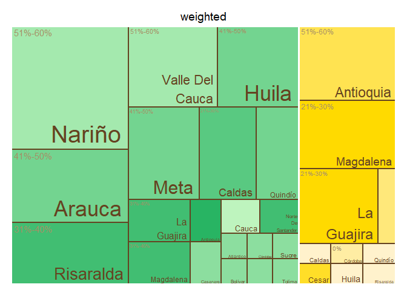<!-- -->

    ## $tm
    ##        crop          expert_in ave_cat_weighted vSize  vColor stdErr
    ## 1    Banana          Antioquia          51%-60%    11 #FFE351     11
    ## 2    Banana          Antioquia             <NA>    11 #FFE351     11
    ## 3    Banana             Caldas          71%-80%     1 #FFF2CC      1
    ## 4    Banana             Caldas             <NA>     1 #FFF2CC      1
    ## 5    Banana              Cesar          11%-20%     1 #FFDE28      1
    ## 6    Banana              Cesar             <NA>     1 #FFDE28      1
    ## 7    Banana              Chocó          31%-40%     2 #FFE87A      2
    ## 8    Banana              Chocó             <NA>     2 #FFE87A      2
    ## 9    Banana            Córdoba               0%     1 #FFEDA3      1
    ## 10   Banana            Córdoba             <NA>     1 #FFEDA3      1
    ## 11   Banana              Huila          71%-80%     1 #FFF2CC      1
    ## 12   Banana              Huila             <NA>     1 #FFF2CC      1
    ## 13   Banana         La Guajira          21%-30%     9 #FFDA00      9
    ## 14   Banana         La Guajira             <NA>     9 #FFDA00      9
    ## 15   Banana          Magdalena          21%-30%    10 #FFDA00     10
    ## 16   Banana          Magdalena             <NA>    10 #FFDA00     10
    ## 17   Banana               <NA>             <NA>    38 #FFF2CC     38
    ## 18   Banana            Quindío          71%-80%     1 #FFF2CC      1
    ## 19   Banana            Quindío             <NA>     1 #FFF2CC      1
    ## 20   Banana          Risaralda          71%-80%     1 #FFF2CC      1
    ## 21   Banana          Risaralda             <NA>     1 #FFF2CC      1
    ## 22 Plantain          Antioquia          61%-70%     2 #28B463      2
    ## 23 Plantain          Antioquia             <NA>     2 #28B463      2
    ## 24 Plantain             Arauca           1%-10%     2 #98E4A7      2
    ## 25 Plantain             Arauca             <NA>     2 #98E4A7      2
    ## 26 Plantain          Atlántico           1%-10%     1 #98E4A7      1
    ## 27 Plantain          Atlántico             <NA>     1 #98E4A7      1
    ## 28 Plantain            Bolívar           1%-10%     1 #98E4A7      1
    ## 29 Plantain            Bolívar             <NA>     1 #98E4A7      1
    ## 30 Plantain             Caldas          31%-40%     7 #4DC479      7
    ## 31 Plantain             Caldas             <NA>     7 #4DC479      7
    ## 32 Plantain           Casanare           1%-10%     2 #98E4A7      2
    ## 33 Plantain           Casanare             <NA>     2 #98E4A7      2
    ## 34 Plantain            Córdoba           1%-10%     1 #98E4A7      1
    ## 35 Plantain            Córdoba             <NA>     1 #98E4A7      1
    ## 36 Plantain              Huila           1%-10%     1 #98E4A7      1
    ## 37 Plantain              Huila             <NA>     1 #98E4A7      1
    ## 38 Plantain         La Guajira          31%-40%     4 #4DC479      4
    ## 39 Plantain         La Guajira             <NA>     4 #4DC479      4
    ## 40 Plantain          Magdalena          21%-30%     3 #BEF4BE      3
    ## 41 Plantain          Magdalena             <NA>     3 #BEF4BE      3
    ## 42 Plantain               Meta          41%-50%    10 #73D490     10
    ## 43 Plantain               Meta             <NA>    10 #73D490     10
    ## 44 Plantain               <NA>             <NA>    55 #98E4A7     55
    ## 45 Plantain Norte De Santander           1%-10%     1 #98E4A7      1
    ## 46 Plantain Norte De Santander             <NA>     1 #98E4A7      1
    ## 47 Plantain            Quindío          41%-50%     6 #73D490      6
    ## 48 Plantain            Quindío             <NA>     6 #73D490      6
    ## 49 Plantain          Risaralda          31%-40%    11 #4DC479     11
    ## 50 Plantain          Risaralda             <NA>    11 #4DC479     11
    ## 51 Plantain          Santander           1%-10%     1 #98E4A7      1
    ## 52 Plantain          Santander             <NA>     1 #98E4A7      1
    ## 53 Plantain              Sucre           1%-10%     1 #98E4A7      1
    ## 54 Plantain              Sucre             <NA>     1 #98E4A7      1
    ## 55 Plantain             Tolima           1%-10%     1 #98E4A7      1
    ## 56 Plantain             Tolima             <NA>     1 #98E4A7      1
    ##    vColorValue level        x0         y0          w          h   color
    ## 1           NA     3 0.5913978 0.44736842 0.21402970 0.55263158 #FFE351
    ## 2           NA     2 0.5913978 0.44736842 0.21402970 0.55263158 #FFE351
    ## 3           NA     3 0.8557875 0.29824561 0.07210626 0.14912281 #FFF2CC
    ## 4           NA     2 0.8557875 0.29824561 0.07210626 0.14912281 #FFF2CC
    ## 5           NA     3 0.9278937 0.29824561 0.07210626 0.14912281 #FFDE28
    ## 6           NA     2 0.9278937 0.29824561 0.07210626 0.14912281 #FFDE28
    ## 7           NA     3 0.5913978 0.00000000 0.26438963 0.08133971 #FFE87A
    ## 8           NA     2 0.5913978 0.00000000 0.26438963 0.08133971 #FFE87A
    ## 9           NA     3 0.8557875 0.14912281 0.07210626 0.14912281 #FFEDA3
    ## 10          NA     2 0.8557875 0.14912281 0.07210626 0.14912281 #FFEDA3
    ## 11          NA     3 0.9278937 0.14912281 0.07210626 0.14912281 #FFF2CC
    ## 12          NA     2 0.9278937 0.14912281 0.07210626 0.14912281 #FFF2CC
    ## 13          NA     3 0.5913978 0.08133971 0.26438963 0.36602871 #FFDA00
    ## 14          NA     2 0.5913978 0.08133971 0.26438963 0.36602871 #FFDA00
    ## 15          NA     3 0.8054275 0.44736842 0.19457245 0.55263158 #FFDA00
    ## 16          NA     2 0.8054275 0.44736842 0.19457245 0.55263158 #FFDA00
    ## 17          NA     1 0.5913978 0.00000000 0.40860215 1.00000000 #FFF2CC
    ## 18          NA     3 0.8557875 0.00000000 0.07210626 0.14912281 #FFF2CC
    ## 19          NA     2 0.8557875 0.00000000 0.07210626 0.14912281 #FFF2CC
    ## 20          NA     3 0.9278937 0.00000000 0.07210626 0.14912281 #FFF2CC
    ## 21          NA     2 0.9278937 0.00000000 0.07210626 0.14912281 #FFF2CC
    ## 22          NA     3 0.5102256 0.35324675 0.08117225 0.26493506 #28B463
    ## 23          NA     2 0.5102256 0.35324675 0.08117225 0.26493506 #28B463
    ## 24          NA     3 0.2261227 0.17662338 0.12175838 0.17662338 #98E4A7
    ## 25          NA     2 0.2261227 0.17662338 0.12175838 0.17662338 #98E4A7
    ## 26          NA     3 0.3478811 0.23549784 0.09131879 0.11774892 #98E4A7
    ## 27          NA     2 0.3478811 0.23549784 0.09131879 0.11774892 #98E4A7
    ## 28          NA     3 0.3478811 0.11774892 0.09131879 0.11774892 #98E4A7
    ## 29          NA     2 0.3478811 0.11774892 0.09131879 0.11774892 #98E4A7
    ## 30          NA     3 0.0000000 0.28531469 0.22612271 0.33286713 #4DC479
    ## 31          NA     2 0.0000000 0.28531469 0.22612271 0.33286713 #4DC479
    ## 32          NA     3 0.2261227 0.00000000 0.12175838 0.17662338 #98E4A7
    ## 33          NA     2 0.2261227 0.00000000 0.12175838 0.17662338 #98E4A7
    ## 34          NA     3 0.3478811 0.00000000 0.09131879 0.11774892 #98E4A7
    ## 35          NA     2 0.3478811 0.00000000 0.09131879 0.11774892 #98E4A7
    ## 36          NA     3 0.4391999 0.21194805 0.07609899 0.14129870 #98E4A7
    ## 37          NA     2 0.4391999 0.21194805 0.07609899 0.14129870 #98E4A7
    ## 38          NA     3 0.2261227 0.35324675 0.16234451 0.26493506 #4DC479
    ## 39          NA     2 0.2261227 0.35324675 0.16234451 0.26493506 #4DC479
    ## 40          NA     3 0.3884672 0.35324675 0.12175838 0.26493506 #BEF4BE
    ## 41          NA     2 0.3884672 0.35324675 0.12175838 0.26493506 #BEF4BE
    ## 42          NA     3 0.3097798 0.61818182 0.28161802 0.38181818 #73D490
    ## 43          NA     2 0.3097798 0.61818182 0.28161802 0.38181818 #73D490
    ## 44          NA     1 0.0000000 0.00000000 0.59139785 1.00000000 #98E4A7
    ## 45          NA     3 0.5152989 0.21194805 0.07609899 0.14129870 #98E4A7
    ## 46          NA     2 0.5152989 0.21194805 0.07609899 0.14129870 #98E4A7
    ## 47          NA     3 0.0000000 0.00000000 0.22612271 0.28531469 #73D490
    ## 48          NA     2 0.0000000 0.00000000 0.22612271 0.28531469 #73D490
    ## 49          NA     3 0.0000000 0.61818182 0.30977983 0.38181818 #4DC479
    ## 50          NA     2 0.0000000 0.61818182 0.30977983 0.38181818 #4DC479
    ## 51          NA     3 0.4391999 0.10597403 0.10146532 0.10597403 #98E4A7
    ## 52          NA     2 0.4391999 0.10597403 0.10146532 0.10597403 #98E4A7
    ## 53          NA     3 0.4391999 0.00000000 0.10146532 0.10597403 #98E4A7
    ## 54          NA     2 0.4391999 0.00000000 0.10146532 0.10597403 #98E4A7
    ## 55          NA     3 0.5406652 0.00000000 0.05073266 0.21194805 #98E4A7
    ## 56          NA     2 0.5406652 0.00000000 0.05073266 0.21194805 #98E4A7
    ## 
    ## $type
    ## [1] "color"
    ## 
    ## $vSize
    ## [1] "frequency"
    ## 
    ## $vColor
    ## [1] "group_color"
    ## 
    ## $stdErr
    ## [1] "frequency"
    ## 
    ## $algorithm
    ## [1] "pivotSize"
    ## 
    ## $vpCoorX
    ## [1] 0.02812148 0.97187852
    ## 
    ## $vpCoorY
    ## [1] 0.01968504 0.91031496
    ## 
    ## $aspRatio
    ## [1] 1.483512
    ## 
    ## $range
    ## [1] NA NA
    ## 
    ## $mapping
    ## [1] NA NA NA
    ## 
    ## $draw
    ## [1] TRUE

``` r
#Map of Colombia  
#non weighted
nal_q36_no_weight<- question_36 %>% group_by(expert_in) %>%
  summarise(average= mean(as.numeric(numeric_answer))) %>%
  group_by(average) %>% 
  mutate(cat= category_by_mean_by_question(language = "en", mean = average, question =36))%>%
  rename(EKE.expert.in = expert_in)
```

    ## Warning: There was 1 warning in `mutate()`.
    ## ℹ In argument: `cat = category_by_mean_by_question(...)`.
    ## ℹ In group 0: .
    ## Caused by warning:
    ## ! There was 1 warning in `filter()`.
    ## ℹ In argument: `number == question & number_to_category == mean`.
    ## Caused by warning in `number_to_category == mean`:
    ## ! longer object length is not a multiple of shorter object length

``` r
nal_q36_no_weight<- full_join(codes_department, nal_q36_no_weight)
```

    ## Joining with `by = join_by(EKE.expert.in)`

``` r
nal_q36_no_weight$cat<- factor(nal_q36_no_weight$cat, levels = level_36)
colmap(departamentos, data = nal_q36_no_weight, data_id = "id_depto", var = "cat")+
  scale_fill_manual(values = palette_soil(length(unique(nal_q36_no_weight$cat))-1), na.value = "#eeeeee")
```

    ## Scale for fill is already present.
    ## Adding another scale for fill, which will replace the existing scale.

<!-- -->

``` r
# weighted
nal_q36_weight<- inner_join(question_36, experience_of_each_expert)
```

    ## Joining with `by = join_by(crop, expert_ID, expert_in)`

``` r
nal_q36_weight<- nal_q36_weight %>%
  group_by(expert_in) %>%
  mutate(numeric_answer=as.numeric(numeric_answer)) %>%
  summarise(average_weighted= weighted.mean(numeric_answer, weights)) %>% 
  group_by(average_weighted) %>%
  mutate(cat_weighted= category_by_mean_by_question(language = "en", mean = average_weighted, question =36)) %>%
  rename(EKE.expert.in=expert_in)
```

    ## Warning: There was 1 warning in `mutate()`.
    ## ℹ In argument: `cat_weighted = category_by_mean_by_question(...)`.
    ## ℹ In group 0: .
    ## Caused by warning:
    ## ! There was 1 warning in `filter()`.
    ## ℹ In argument: `number == question & number_to_category == mean`.
    ## Caused by warning in `number_to_category == mean`:
    ## ! longer object length is not a multiple of shorter object length

``` r
nal_q36_weight<- full_join(codes_department, nal_q36_weight)
```

    ## Joining with `by = join_by(EKE.expert.in)`

``` r
nal_q36_weight$cat_weighted<- factor(nal_q36_weight$cat_weighted, levels = level_36)
colmap(departamentos, data = nal_q36_weight, data_id = "id_depto", var = "cat_weighted")+
  scale_fill_manual(values = palette_soil(length(unique(nal_q36_weight$cat))-1), na.value = "#eeeeee")
```

    ## Scale for fill is already present.
    ## Adding another scale for fill, which will replace the existing scale.

<!-- -->

## Question 37: If cost were not a concern, what is the likelihood that these regions would implement biosecurity strategies to mitigate or prevent Foc R4T?

``` r
#selecting only question 37----
question_37<- filter(individual_surveys, question_number==37)
#unique(question_37$numeric_answer)
#dput(unique(question_37$answer_in_english))
#organizing the order of the levels
level_37<- c("Extremely Unlikely", "Very Unlikely", "Unlikely", "Somewhat Unlikely", "Neutral", "Somewhat Likely", "Likely", "Very Likely", "Extremely Likely", "Unsure")
question_37$answer_in_english<- factor(question_37$answer_in_english,levels = level_37)
question_37<- filter(question_37, answer_in_english!="Unsure")
#average by department (weighted and no weighted)
#not weighted 
avg_dept_no_weight_37<- question_37 %>%
  group_by(crop, expert_in) %>%
  mutate(numeric_answer=as.numeric(numeric_answer))%>%
  mutate(average= mean(numeric_answer)) %>%
  group_by(average)%>%
  mutate(ave_cat= category_by_mean_by_question(37, mean =average, language = "en"))
```

    ## Warning: There were 5 warnings in `mutate()`.
    ## The first warning was:
    ## ℹ In argument: `ave_cat = category_by_mean_by_question(37, mean = average,
    ##   language = "en")`.
    ## ℹ In group 0: .
    ## Caused by warning:
    ## ! There was 1 warning in `filter()`.
    ## ℹ In argument: `number == question & number_to_category == mean`.
    ## Caused by warning in `number_to_category == mean`:
    ## ! longer object length is not a multiple of shorter object length
    ## ℹ Run `dplyr::last_dplyr_warnings()` to see the 4 remaining warnings.

``` r
#weighted 
add_weights_question_37<- inner_join(question_37, experience_of_each_expert)
```

    ## Joining with `by = join_by(crop, expert_ID, expert_in)`

``` r
avg_dept_weight_37<- add_weights_question_37 %>%
  group_by(crop, expert_in) %>%
  mutate(numeric_answer=as.numeric(numeric_answer))%>%
  mutate(average_weighted= weighted.mean(numeric_answer, weights)) %>% 
  group_by(average_weighted)%>%
  mutate(ave_cat_weighted= category_by_mean_by_question(37, mean =average_weighted, language = "en"))
```

    ## Warning: There were 7 warnings in `mutate()`.
    ## The first warning was:
    ## ℹ In argument: `ave_cat_weighted = category_by_mean_by_question(37, mean =
    ##   average_weighted, language = "en")`.
    ## ℹ In group 0: .
    ## Caused by warning:
    ## ! There was 1 warning in `filter()`.
    ## ℹ In argument: `number == question & number_to_category == mean`.
    ## Caused by warning in `number_to_category == mean`:
    ## ! longer object length is not a multiple of shorter object length
    ## ℹ Run `dplyr::last_dplyr_warnings()` to see the 6 remaining warnings.

``` r
#finding the levels per crop (banana and plantain) no weighted
levels_per_crop_Q37_no_weighted<- tapply(avg_dept_no_weight_37$ave_cat, avg_dept_no_weight_37$crop, function(x){(unique(x))})
#generating a ramp palette according to the number of levels per crop
colors_banana_question37_no_weighted<- palette_banana(length(levels_per_crop_Q37_no_weighted$Banana))
colors_plantain_question37_no_weighted<- palette_plantain(length(levels_per_crop_Q37_no_weighted$Plantain))
#Assigning the colors by crop and answer
# Define the knowledge levels for each crop
levels_by_crop_no_weighted_37 <- list(
  Banana = levels_per_crop_Q37_no_weighted$Banana,
  Plantain = levels_per_crop_Q37_no_weighted$Plantain
)
# Define the colors for each crop
colors_by_crop_no_weighted_37 <- list(
  Banana = colors_banana_question37_no_weighted, # Replace with actual color vector for Banana
  Plantain = colors_plantain_question37_no_weighted # Replace with actual color vector for Plantain
  # Add more crops and their color vectors here if needed
)
# Now call the function
avg_dept_no_weight_37 <- assign_group_color(data = avg_dept_no_weight_37, levels_by_crop = levels_by_crop_no_weighted_37, colors_by_crop = colors_by_crop_no_weighted_37,answer_col =  "ave_cat")

#finding the levels per crop (banana and plantain) weighted
levels_per_crop_Q37_weighted<- tapply(avg_dept_weight_37$ave_cat_weighted, avg_dept_weight_37$crop, function(x){(unique(x))})
#generating a ramp palette according to the number of levels per crop
colors_banana_question37_weighted<- palette_banana(length(levels_per_crop_Q37_weighted$Banana))
colors_plantain_question37_weighted<- palette_plantain(length(levels_per_crop_Q37_weighted$Plantain))
#Assigning the colors by crop and answer
# Define the knowledge levels for each crop
levels_by_crop_weighted_37 <- list(
  Banana = levels_per_crop_Q37_weighted$Banana,
  Plantain = levels_per_crop_Q37_weighted$Plantain
)
# Define the colors for each crop
colors_by_crop_weighted_37 <- list(
  Banana = colors_banana_question37_weighted, # Replace with actual color vector for Banana
  Plantain = colors_plantain_question37_weighted # Replace with actual color vector for Plantain
  # Add more crops and their color vectors here if needed
)
# Now call the function
avg_dept_weight_37 <- assign_group_color(data = avg_dept_weight_37, levels_by_crop = levels_by_crop_weighted_37, colors_by_crop = colors_by_crop_weighted_37,answer_col =  "ave_cat_weighted")

#tree map
tree_map_3(data = avg_dept_no_weight_37, "crop", "expert_in", "ave_cat", "group_color", title="No weighted")
```

    ## `summarise()` has grouped output by 'crop', 'expert_in', 'ave_cat'. You can
    ## override using the `.groups` argument.

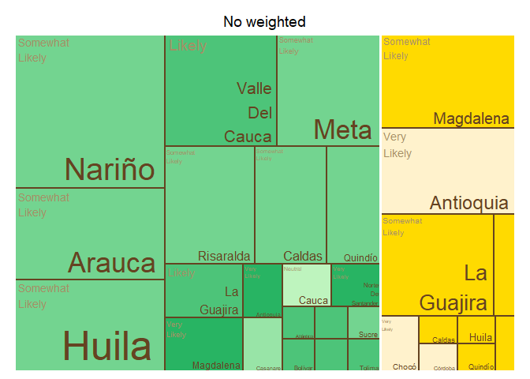<!-- -->

    ## $tm
    ##        crop          expert_in           ave_cat vSize  vColor stdErr
    ## 1    Banana          Antioquia              <NA>    11 #FFF2CC     11
    ## 2    Banana          Antioquia       Very Likely    11 #FFF2CC     11
    ## 3    Banana             Caldas              <NA>     1 #FFDA00      1
    ## 4    Banana             Caldas   Somewhat Likely     1 #FFDA00      1
    ## 5    Banana              Cesar              <NA>     2 #FFDA00      2
    ## 6    Banana              Cesar   Somewhat Likely     2 #FFDA00      2
    ## 7    Banana              Chocó              <NA>     2 #FFF2CC      2
    ## 8    Banana              Chocó       Very Likely     2 #FFF2CC      2
    ## 9    Banana            Córdoba              <NA>     1 #FFF2CC      1
    ## 10   Banana            Córdoba       Very Likely     1 #FFF2CC      1
    ## 11   Banana              Huila              <NA>     1 #FFDA00      1
    ## 12   Banana              Huila   Somewhat Likely     1 #FFDA00      1
    ## 13   Banana         La Guajira              <NA>    11 #FFDA00     11
    ## 14   Banana         La Guajira   Somewhat Likely    11 #FFDA00     11
    ## 15   Banana          Magdalena              <NA>    12 #FFDA00     12
    ## 16   Banana          Magdalena   Somewhat Likely    12 #FFDA00     12
    ## 17   Banana               <NA>              <NA>    43 #FFDA00     43
    ## 18   Banana            Quindío              <NA>     1 #FFDA00      1
    ## 19   Banana            Quindío   Somewhat Likely     1 #FFDA00      1
    ## 20   Banana          Risaralda              <NA>     1 #FFDA00      1
    ## 21   Banana          Risaralda   Somewhat Likely     1 #FFDA00      1
    ## 22 Plantain          Antioquia              <NA>     2 #28B463      2
    ## 23 Plantain          Antioquia       Very Likely     2 #28B463      2
    ## 24 Plantain             Arauca              <NA>     2 #BEF4BE      2
    ## 25 Plantain             Arauca Somewhat Unlikely     2 #BEF4BE      2
    ## 26 Plantain          Atlántico            Likely     1 #59C981      1
    ## 27 Plantain          Atlántico              <NA>     1 #59C981      1
    ## 28 Plantain            Bolívar            Likely     1 #59C981      1
    ## 29 Plantain            Bolívar              <NA>     1 #59C981      1
    ## 30 Plantain             Caldas              <NA>     7 #8CDE9F      7
    ## 31 Plantain             Caldas   Somewhat Likely     7 #8CDE9F      7
    ## 32 Plantain           Casanare              <NA>     2 #BEF4BE      2
    ## 33 Plantain           Casanare Somewhat Unlikely     2 #BEF4BE      2
    ## 34 Plantain            Córdoba            Likely     1 #59C981      1
    ## 35 Plantain            Córdoba              <NA>     1 #59C981      1
    ## 36 Plantain              Huila            Likely     1 #59C981      1
    ## 37 Plantain              Huila              <NA>     1 #59C981      1
    ## 38 Plantain         La Guajira            Likely     4 #59C981      4
    ## 39 Plantain         La Guajira              <NA>     4 #59C981      4
    ## 40 Plantain          Magdalena            Likely     3 #59C981      3
    ## 41 Plantain          Magdalena              <NA>     3 #59C981      3
    ## 42 Plantain               Meta              <NA>    11 #8CDE9F     11
    ## 43 Plantain               Meta   Somewhat Likely    11 #8CDE9F     11
    ## 44 Plantain               <NA>              <NA>    55 #59C981     55
    ## 45 Plantain Norte De Santander            Likely     1 #59C981      1
    ## 46 Plantain Norte De Santander              <NA>     1 #59C981      1
    ## 47 Plantain            Quindío              <NA>     6 #8CDE9F      6
    ## 48 Plantain            Quindío   Somewhat Likely     6 #8CDE9F      6
    ## 49 Plantain          Risaralda              <NA>    10 #8CDE9F     10
    ## 50 Plantain          Risaralda   Somewhat Likely    10 #8CDE9F     10
    ## 51 Plantain          Santander            Likely     1 #59C981      1
    ## 52 Plantain          Santander              <NA>     1 #59C981      1
    ## 53 Plantain              Sucre              <NA>     1 #8CDE9F      1
    ## 54 Plantain              Sucre   Somewhat Likely     1 #8CDE9F      1
    ## 55 Plantain             Tolima            Likely     1 #59C981      1
    ## 56 Plantain             Tolima              <NA>     1 #59C981      1
    ##    vColorValue level        x0         y0          w          h   color
    ## 1           NA     2 0.7901508 0.46511628 0.20984916 0.53488372 #FFF2CC
    ## 2           NA     3 0.7901508 0.46511628 0.20984916 0.53488372 #FFF2CC
    ## 3           NA     2 0.9488095 0.26578073 0.05119048 0.19933555 #FFDA00
    ## 4           NA     3 0.9488095 0.26578073 0.05119048 0.19933555 #FFDA00
    ## 5           NA     2 0.5612245 0.00000000 0.28520408 0.07155635 #FFDA00
    ## 6           NA     3 0.5612245 0.00000000 0.28520408 0.07155635 #FFDA00
    ## 7           NA     2 0.8464286 0.26578073 0.10238095 0.19933555 #FFF2CC
    ## 8           NA     3 0.8464286 0.26578073 0.10238095 0.19933555 #FFF2CC
    ## 9           NA     2 0.8464286 0.13289037 0.07678571 0.13289037 #FFF2CC
    ## 10          NA     3 0.8464286 0.13289037 0.07678571 0.13289037 #FFF2CC
    ## 11          NA     2 0.9232143 0.13289037 0.07678571 0.13289037 #FFDA00
    ## 12          NA     3 0.9232143 0.13289037 0.07678571 0.13289037 #FFDA00
    ## 13          NA     2 0.5612245 0.07155635 0.28520408 0.39355993 #FFDA00
    ## 14          NA     3 0.5612245 0.07155635 0.28520408 0.39355993 #FFDA00
    ## 15          NA     2 0.5612245 0.46511628 0.22892635 0.53488372 #FFDA00
    ## 16          NA     3 0.5612245 0.46511628 0.22892635 0.53488372 #FFDA00
    ## 17          NA     1 0.5612245 0.00000000 0.43877551 1.00000000 #FFDA00
    ## 18          NA     2 0.8464286 0.00000000 0.07678571 0.13289037 #FFDA00
    ## 19          NA     3 0.8464286 0.00000000 0.07678571 0.13289037 #FFDA00
    ## 20          NA     2 0.9232143 0.00000000 0.07678571 0.13289037 #FFDA00
    ## 21          NA     3 0.9232143 0.00000000 0.07678571 0.13289037 #FFDA00
    ## 22          NA     2 0.4841937 0.35324675 0.07703081 0.26493506 #28B463
    ## 23          NA     3 0.4841937 0.35324675 0.07703081 0.26493506 #28B463
    ## 24          NA     2 0.2145858 0.17662338 0.11554622 0.17662338 #BEF4BE
    ## 25          NA     3 0.2145858 0.17662338 0.11554622 0.17662338 #BEF4BE
    ## 26          NA     3 0.3301321 0.22077922 0.07703081 0.13246753 #59C981
    ## 27          NA     2 0.3301321 0.22077922 0.07703081 0.13246753 #59C981
    ## 28          NA     3 0.4071629 0.22077922 0.07703081 0.13246753 #59C981
    ## 29          NA     2 0.4071629 0.22077922 0.07703081 0.13246753 #59C981
    ## 30          NA     2 0.0000000 0.28531469 0.21458583 0.33286713 #8CDE9F
    ## 31          NA     3 0.0000000 0.28531469 0.21458583 0.33286713 #8CDE9F
    ## 32          NA     2 0.2145858 0.00000000 0.11554622 0.17662338 #BEF4BE
    ## 33          NA     3 0.2145858 0.00000000 0.11554622 0.17662338 #BEF4BE
    ## 34          NA     3 0.4841937 0.22077922 0.07703081 0.13246753 #59C981
    ## 35          NA     2 0.4841937 0.22077922 0.07703081 0.13246753 #59C981
    ## 36          NA     3 0.3301321 0.11038961 0.09243697 0.11038961 #59C981
    ## 37          NA     2 0.3301321 0.11038961 0.09243697 0.11038961 #59C981
    ## 38          NA     3 0.2145858 0.35324675 0.15406162 0.26493506 #59C981
    ## 39          NA     2 0.2145858 0.35324675 0.15406162 0.26493506 #59C981
    ## 40          NA     3 0.3686475 0.35324675 0.11554622 0.26493506 #59C981
    ## 41          NA     2 0.3686475 0.35324675 0.11554622 0.26493506 #59C981
    ## 42          NA     2 0.0000000 0.61818182 0.29397473 0.38181818 #8CDE9F
    ## 43          NA     3 0.0000000 0.61818182 0.29397473 0.38181818 #8CDE9F
    ## 44          NA     1 0.0000000 0.00000000 0.56122449 1.00000000 #59C981
    ## 45          NA     3 0.3301321 0.00000000 0.09243697 0.11038961 #59C981
    ## 46          NA     2 0.3301321 0.00000000 0.09243697 0.11038961 #59C981
    ## 47          NA     2 0.0000000 0.00000000 0.21458583 0.28531469 #8CDE9F
    ## 48          NA     3 0.0000000 0.00000000 0.21458583 0.28531469 #8CDE9F
    ## 49          NA     2 0.2939747 0.61818182 0.26724976 0.38181818 #8CDE9F
    ## 50          NA     3 0.2939747 0.61818182 0.26724976 0.38181818 #8CDE9F
    ## 51          NA     3 0.4225690 0.07359307 0.06932773 0.14718615 #59C981
    ## 52          NA     2 0.4225690 0.07359307 0.06932773 0.14718615 #59C981
    ## 53          NA     2 0.4918968 0.07359307 0.06932773 0.14718615 #8CDE9F
    ## 54          NA     3 0.4918968 0.07359307 0.06932773 0.14718615 #8CDE9F
    ## 55          NA     3 0.4225690 0.00000000 0.13865546 0.07359307 #59C981
    ## 56          NA     2 0.4225690 0.00000000 0.13865546 0.07359307 #59C981
    ## 
    ## $type
    ## [1] "color"
    ## 
    ## $vSize
    ## [1] "frequency"
    ## 
    ## $vColor
    ## [1] "group_color"
    ## 
    ## $stdErr
    ## [1] "frequency"
    ## 
    ## $algorithm
    ## [1] "pivotSize"
    ## 
    ## $vpCoorX
    ## [1] 0.02812148 0.97187852
    ## 
    ## $vpCoorY
    ## [1] 0.01968504 0.91031496
    ## 
    ## $aspRatio
    ## [1] 1.483512
    ## 
    ## $range
    ## [1] NA NA
    ## 
    ## $mapping
    ## [1] NA NA NA
    ## 
    ## $draw
    ## [1] TRUE

``` r
tree_map_3(data = avg_dept_weight_37, "crop", "expert_in", "ave_cat_weighted", "group_color", title="weighted")
```

    ## `summarise()` has grouped output by 'crop', 'expert_in', 'ave_cat_weighted'.
    ## You can override using the `.groups` argument.

<!-- -->

    ## $tm
    ##        crop          expert_in  ave_cat_weighted vSize  vColor stdErr
    ## 1    Banana          Antioquia              <NA>    11 #FFF2CC     11
    ## 2    Banana          Antioquia       Very Likely    11 #FFF2CC     11
    ## 3    Banana             Caldas              <NA>     1 #FFDA00      1
    ## 4    Banana             Caldas   Somewhat Likely     1 #FFDA00      1
    ## 5    Banana              Cesar              <NA>     2 #FFDA00      2
    ## 6    Banana              Cesar   Somewhat Likely     2 #FFDA00      2
    ## 7    Banana              Chocó              <NA>     2 #FFF2CC      2
    ## 8    Banana              Chocó       Very Likely     2 #FFF2CC      2
    ## 9    Banana            Córdoba              <NA>     1 #FFF2CC      1
    ## 10   Banana            Córdoba       Very Likely     1 #FFF2CC      1
    ## 11   Banana              Huila              <NA>     1 #FFDA00      1
    ## 12   Banana              Huila   Somewhat Likely     1 #FFDA00      1
    ## 13   Banana         La Guajira              <NA>     9 #FFDA00      9
    ## 14   Banana         La Guajira   Somewhat Likely     9 #FFDA00      9
    ## 15   Banana          Magdalena            Likely    11 #FFE566     11
    ## 16   Banana          Magdalena              <NA>    11 #FFE566     11
    ## 17   Banana               <NA>              <NA>    40 #FFDA00     40
    ## 18   Banana            Quindío              <NA>     1 #FFDA00      1
    ## 19   Banana            Quindío   Somewhat Likely     1 #FFDA00      1
    ## 20   Banana          Risaralda              <NA>     1 #FFDA00      1
    ## 21   Banana          Risaralda   Somewhat Likely     1 #FFDA00      1
    ## 22 Plantain          Antioquia              <NA>     2 #28B463      2
    ## 23 Plantain          Antioquia       Very Likely     2 #28B463      2
    ## 24 Plantain             Arauca              <NA>     2 #BEF4BE      2
    ## 25 Plantain             Arauca Somewhat Unlikely     2 #BEF4BE      2
    ## 26 Plantain          Atlántico            Likely     1 #59C981      1
    ## 27 Plantain          Atlántico              <NA>     1 #59C981      1
    ## 28 Plantain            Bolívar            Likely     1 #59C981      1
    ## 29 Plantain            Bolívar              <NA>     1 #59C981      1
    ## 30 Plantain             Caldas              <NA>     7 #8CDE9F      7
    ## 31 Plantain             Caldas   Somewhat Likely     7 #8CDE9F      7
    ## 32 Plantain           Casanare              <NA>     2 #BEF4BE      2
    ## 33 Plantain           Casanare Somewhat Unlikely     2 #BEF4BE      2
    ## 34 Plantain            Córdoba            Likely     1 #59C981      1
    ## 35 Plantain            Córdoba              <NA>     1 #59C981      1
    ## 36 Plantain              Huila            Likely     1 #59C981      1
    ## 37 Plantain              Huila              <NA>     1 #59C981      1
    ## 38 Plantain         La Guajira            Likely     4 #59C981      4
    ## 39 Plantain         La Guajira              <NA>     4 #59C981      4
    ## 40 Plantain          Magdalena            Likely     3 #59C981      3
    ## 41 Plantain          Magdalena              <NA>     3 #59C981      3
    ## 42 Plantain               Meta              <NA>    10 #8CDE9F     10
    ## 43 Plantain               Meta   Somewhat Likely    10 #8CDE9F     10
    ## 44 Plantain               <NA>              <NA>    54 #59C981     54
    ## 45 Plantain Norte De Santander            Likely     1 #59C981      1
    ## 46 Plantain Norte De Santander              <NA>     1 #59C981      1
    ## 47 Plantain            Quindío              <NA>     6 #8CDE9F      6
    ## 48 Plantain            Quindío   Somewhat Likely     6 #8CDE9F      6
    ## 49 Plantain          Risaralda              <NA>    10 #8CDE9F     10
    ## 50 Plantain          Risaralda   Somewhat Likely    10 #8CDE9F     10
    ## 51 Plantain          Santander            Likely     1 #59C981      1
    ## 52 Plantain          Santander              <NA>     1 #59C981      1
    ## 53 Plantain              Sucre              <NA>     1 #8CDE9F      1
    ## 54 Plantain              Sucre   Somewhat Likely     1 #8CDE9F      1
    ## 55 Plantain             Tolima            Likely     1 #59C981      1
    ## 56 Plantain             Tolima              <NA>     1 #59C981      1
    ##    vColorValue level        x0         y0          w          h   color
    ## 1           NA     2 0.5744681 0.45000000 0.21276596 0.55000000 #FFF2CC
    ## 2           NA     3 0.5744681 0.45000000 0.21276596 0.55000000 #FFF2CC
    ## 3           NA     2 0.9448385 0.25714286 0.05516154 0.19285714 #FFDA00
    ## 4           NA     3 0.9448385 0.25714286 0.05516154 0.19285714 #FFDA00
    ## 5           NA     2 0.5744681 0.00000000 0.26004728 0.08181818 #FFDA00
    ## 6           NA     3 0.5744681 0.00000000 0.26004728 0.08181818 #FFDA00
    ## 7           NA     2 0.8345154 0.25714286 0.11032309 0.19285714 #FFF2CC
    ## 8           NA     3 0.8345154 0.25714286 0.11032309 0.19285714 #FFF2CC
    ## 9           NA     2 0.8345154 0.12857143 0.08274232 0.12857143 #FFF2CC
    ## 10          NA     3 0.8345154 0.12857143 0.08274232 0.12857143 #FFF2CC
    ## 11          NA     2 0.9172577 0.12857143 0.08274232 0.12857143 #FFDA00
    ## 12          NA     3 0.9172577 0.12857143 0.08274232 0.12857143 #FFDA00
    ## 13          NA     2 0.5744681 0.08181818 0.26004728 0.36818182 #FFDA00
    ## 14          NA     3 0.5744681 0.08181818 0.26004728 0.36818182 #FFDA00
    ## 15          NA     3 0.7872340 0.45000000 0.21276596 0.55000000 #FFE566
    ## 16          NA     2 0.7872340 0.45000000 0.21276596 0.55000000 #FFE566
    ## 17          NA     1 0.5744681 0.00000000 0.42553191 1.00000000 #FFDA00
    ## 18          NA     2 0.8345154 0.00000000 0.08274232 0.12857143 #FFDA00
    ## 19          NA     3 0.8345154 0.00000000 0.08274232 0.12857143 #FFDA00
    ## 20          NA     2 0.9172577 0.00000000 0.08274232 0.12857143 #FFDA00
    ## 21          NA     3 0.9172577 0.00000000 0.08274232 0.12857143 #FFDA00
    ## 22          NA     2 0.4956195 0.35978836 0.07884856 0.26984127 #28B463
    ## 23          NA     3 0.4956195 0.35978836 0.07884856 0.26984127 #28B463
    ## 24          NA     2 0.2196496 0.17989418 0.11827284 0.17989418 #BEF4BE
    ## 25          NA     3 0.2196496 0.17989418 0.11827284 0.17989418 #BEF4BE
    ## 26          NA     3 0.3379224 0.22486772 0.07884856 0.13492063 #59C981
    ## 27          NA     2 0.3379224 0.22486772 0.07884856 0.13492063 #59C981
    ## 28          NA     3 0.4167710 0.22486772 0.07884856 0.13492063 #59C981
    ## 29          NA     2 0.4167710 0.22486772 0.07884856 0.13492063 #59C981
    ## 30          NA     2 0.0000000 0.29059829 0.21964956 0.33903134 #8CDE9F
    ## 31          NA     3 0.0000000 0.29059829 0.21964956 0.33903134 #8CDE9F
    ## 32          NA     2 0.2196496 0.00000000 0.11827284 0.17989418 #BEF4BE
    ## 33          NA     3 0.2196496 0.00000000 0.11827284 0.17989418 #BEF4BE
    ## 34          NA     3 0.4956195 0.22486772 0.07884856 0.13492063 #59C981
    ## 35          NA     2 0.4956195 0.22486772 0.07884856 0.13492063 #59C981
    ## 36          NA     3 0.3379224 0.11243386 0.09461827 0.11243386 #59C981
    ## 37          NA     2 0.3379224 0.11243386 0.09461827 0.11243386 #59C981
    ## 38          NA     3 0.2196496 0.35978836 0.15769712 0.26984127 #59C981
    ## 39          NA     2 0.2196496 0.35978836 0.15769712 0.26984127 #59C981
    ## 40          NA     3 0.3773467 0.35978836 0.11827284 0.26984127 #59C981
    ## 41          NA     2 0.3773467 0.35978836 0.11827284 0.26984127 #59C981
    ## 42          NA     2 0.0000000 0.62962963 0.28723404 0.37037037 #8CDE9F
    ## 43          NA     3 0.0000000 0.62962963 0.28723404 0.37037037 #8CDE9F
    ## 44          NA     1 0.0000000 0.00000000 0.57446809 1.00000000 #59C981
    ## 45          NA     3 0.3379224 0.00000000 0.09461827 0.11243386 #59C981
    ## 46          NA     2 0.3379224 0.00000000 0.09461827 0.11243386 #59C981
    ## 47          NA     2 0.0000000 0.00000000 0.21964956 0.29059829 #8CDE9F
    ## 48          NA     3 0.0000000 0.00000000 0.21964956 0.29059829 #8CDE9F
    ## 49          NA     2 0.2872340 0.62962963 0.28723404 0.37037037 #8CDE9F
    ## 50          NA     3 0.2872340 0.62962963 0.28723404 0.37037037 #8CDE9F
    ## 51          NA     3 0.4325407 0.07495591 0.07096370 0.14991182 #59C981
    ## 52          NA     2 0.4325407 0.07495591 0.07096370 0.14991182 #59C981
    ## 53          NA     2 0.5035044 0.07495591 0.07096370 0.14991182 #8CDE9F
    ## 54          NA     3 0.5035044 0.07495591 0.07096370 0.14991182 #8CDE9F
    ## 55          NA     3 0.4325407 0.00000000 0.14192741 0.07495591 #59C981
    ## 56          NA     2 0.4325407 0.00000000 0.14192741 0.07495591 #59C981
    ## 
    ## $type
    ## [1] "color"
    ## 
    ## $vSize
    ## [1] "frequency"
    ## 
    ## $vColor
    ## [1] "group_color"
    ## 
    ## $stdErr
    ## [1] "frequency"
    ## 
    ## $algorithm
    ## [1] "pivotSize"
    ## 
    ## $vpCoorX
    ## [1] 0.02812148 0.97187852
    ## 
    ## $vpCoorY
    ## [1] 0.01968504 0.91031496
    ## 
    ## $aspRatio
    ## [1] 1.483512
    ## 
    ## $range
    ## [1] NA NA
    ## 
    ## $mapping
    ## [1] NA NA NA
    ## 
    ## $draw
    ## [1] TRUE

``` r
#Map of Colombia  
#non weighted
nal_q37_no_weight<- question_37 %>% group_by(expert_in) %>%
  summarise(average= mean(as.numeric(numeric_answer))) %>%
  group_by(average) %>% 
  mutate(cat= category_by_mean_by_question(language = "en", mean = average, question =37))%>%
  rename(EKE.expert.in = expert_in)
```

    ## Warning: There was 1 warning in `mutate()`.
    ## ℹ In argument: `cat = category_by_mean_by_question(...)`.
    ## ℹ In group 0: .
    ## Caused by warning:
    ## ! There was 1 warning in `filter()`.
    ## ℹ In argument: `number == question & number_to_category == mean`.
    ## Caused by warning in `number_to_category == mean`:
    ## ! longer object length is not a multiple of shorter object length

``` r
nal_q37_no_weight<- full_join(codes_department, nal_q37_no_weight)
```

    ## Joining with `by = join_by(EKE.expert.in)`

``` r
nal_q37_no_weight$cat<- factor(nal_q37_no_weight$cat, levels = level_37)
colmap(departamentos, data = nal_q37_no_weight, data_id = "id_depto", var = "cat")+
  scale_fill_manual(values = palette_soil(length(unique(nal_q37_no_weight$cat))-1), na.value = "#eeeeee")
```

    ## Scale for fill is already present.
    ## Adding another scale for fill, which will replace the existing scale.

<!-- -->

``` r
# weighted
nal_q37_weight<- inner_join(question_37, experience_of_each_expert)
```

    ## Joining with `by = join_by(crop, expert_ID, expert_in)`

``` r
nal_q37_weight<- nal_q37_weight %>%
  group_by(expert_in) %>%
  mutate(numeric_answer=as.numeric(numeric_answer)) %>%
  summarise(average_weighted= weighted.mean(numeric_answer, weights)) %>% 
  group_by(average_weighted) %>%
  mutate(cat_weighted= category_by_mean_by_question(language = "en", mean = average_weighted, question =37)) %>%
  rename(EKE.expert.in=expert_in)
```

    ## Warning: There was 1 warning in `mutate()`.
    ## ℹ In argument: `cat_weighted = category_by_mean_by_question(...)`.
    ## ℹ In group 0: .
    ## Caused by warning:
    ## ! There was 1 warning in `filter()`.
    ## ℹ In argument: `number == question & number_to_category == mean`.
    ## Caused by warning in `number_to_category == mean`:
    ## ! longer object length is not a multiple of shorter object length

``` r
nal_q37_weight<- full_join(codes_department, nal_q37_weight)
```

    ## Joining with `by = join_by(EKE.expert.in)`

``` r
nal_q37_weight$cat_weighted<- factor(nal_q37_weight$cat_weighted, levels = level_37)
colmap(departamentos, data = nal_q37_weight, data_id = "id_depto", var = "cat_weighted")+
  scale_fill_manual(values = palette_soil(length(unique(nal_q37_weight$cat))-1), na.value = "#eeeeee")
```

    ## Scale for fill is already present.
    ## Adding another scale for fill, which will replace the existing scale.

<!-- -->

## Question 39: What are the risks associated with the introduction or reintroduction of TR4 through any of Colombia’s borders?

``` r
#selecting only question 39----
question_39<- filter(individual_surveys, question_number==39)
#unique(question_39$numeric_answer)
#dput(unique(question_39$answer_in_english))
#organizing the order of the levels
level_39<- c("Very Low Risk", "Low Risk", "Moderate Risk", "High Risk", "Not Sure")
question_39$answer_in_english<- factor(question_39$answer_in_english,levels = level_39)
question_39<- filter(question_39, answer_in_english!="Not Sure")
#average by department (weighted and no weighted)
#not weighted 
avg_dept_no_weight_39<- question_39 %>%
  group_by(crop, expert_in) %>%
  mutate(numeric_answer=as.numeric(numeric_answer))%>%
  mutate(average= mean(numeric_answer)) %>%
  group_by(average)%>%
  mutate(ave_cat= category_by_mean_by_question(39, mean =average, language = "en"))
```

    ## Warning: There were 7 warnings in `mutate()`.
    ## The first warning was:
    ## ℹ In argument: `ave_cat = category_by_mean_by_question(39, mean = average,
    ##   language = "en")`.
    ## ℹ In group 0: .
    ## Caused by warning:
    ## ! There was 1 warning in `filter()`.
    ## ℹ In argument: `number == question & number_to_category == mean`.
    ## Caused by warning in `number_to_category == mean`:
    ## ! longer object length is not a multiple of shorter object length
    ## ℹ Run `dplyr::last_dplyr_warnings()` to see the 6 remaining warnings.

``` r
#weighted 
add_weights_question_39<- inner_join(question_39, experience_of_each_expert)
```

    ## Joining with `by = join_by(crop, expert_ID, expert_in)`

``` r
avg_dept_weight_39<- add_weights_question_39 %>%
  group_by(crop, expert_in) %>%
  mutate(numeric_answer=as.numeric(numeric_answer))%>%
  mutate(average_weighted= weighted.mean(numeric_answer, weights)) %>% 
  group_by(average_weighted)%>%
  mutate(ave_cat_weighted= category_by_mean_by_question(39, mean =average_weighted, language = "en"))
```

    ## Warning: There were 9 warnings in `mutate()`.
    ## The first warning was:
    ## ℹ In argument: `ave_cat_weighted = category_by_mean_by_question(39, mean =
    ##   average_weighted, language = "en")`.
    ## ℹ In group 0: .
    ## Caused by warning:
    ## ! There was 1 warning in `filter()`.
    ## ℹ In argument: `number == question & number_to_category == mean`.
    ## Caused by warning in `number_to_category == mean`:
    ## ! longer object length is not a multiple of shorter object length
    ## ℹ Run `dplyr::last_dplyr_warnings()` to see the 8 remaining warnings.

``` r
#finding the levels per crop (banana and plantain) no weighted
levels_per_crop_Q39_no_weighted<- tapply(avg_dept_no_weight_39$ave_cat, avg_dept_no_weight_39$crop, function(x){(unique(x))})
#generating a ramp palette according to the number of levels per crop
colors_banana_question39_no_weighted<- palette_banana(length(levels_per_crop_Q39_no_weighted$Banana))
colors_plantain_question39_no_weighted<- palette_plantain(length(levels_per_crop_Q39_no_weighted$Plantain))
#Assigning the colors by crop and answer
# Define the knowledge levels for each crop
levels_by_crop_no_weighted_39 <- list(
  Banana = levels_per_crop_Q39_no_weighted$Banana,
  Plantain = levels_per_crop_Q39_no_weighted$Plantain
)
# Define the colors for each crop
colors_by_crop_no_weighted_39 <- list(
  Banana = colors_banana_question39_no_weighted, # Replace with actual color vector for Banana
  Plantain = colors_plantain_question39_no_weighted # Replace with actual color vector for Plantain
  # Add more crops and their color vectors here if needed
)
# Now call the function
avg_dept_no_weight_39 <- assign_group_color(data = avg_dept_no_weight_39, levels_by_crop = levels_by_crop_no_weighted_39, colors_by_crop = colors_by_crop_no_weighted_39,answer_col =  "ave_cat")

#finding the levels per crop (banana and plantain) weighted
levels_per_crop_Q39_weighted<- tapply(avg_dept_weight_39$ave_cat_weighted, avg_dept_weight_39$crop, function(x){(unique(x))})
#generating a ramp palette according to the number of levels per crop
colors_banana_question39_weighted<- palette_banana(length(levels_per_crop_Q39_weighted$Banana))
colors_plantain_question39_weighted<- palette_plantain(length(levels_per_crop_Q39_weighted$Plantain))
#Assigning the colors by crop and answer
# Define the knowledge levels for each crop
levels_by_crop_weighted_39 <- list(
  Banana = levels_per_crop_Q39_weighted$Banana,
  Plantain = levels_per_crop_Q39_weighted$Plantain
)
# Define the colors for each crop
colors_by_crop_weighted_39 <- list(
  Banana = colors_banana_question39_weighted, # Replace with actual color vector for Banana
  Plantain = colors_plantain_question39_weighted # Replace with actual color vector for Plantain
  # Add more crops and their color vectors here if needed
)
# Now call the function
avg_dept_weight_39 <- assign_group_color(data = avg_dept_weight_39, levels_by_crop = levels_by_crop_weighted_39, colors_by_crop = colors_by_crop_weighted_39,answer_col =  "ave_cat_weighted")

#tree map
tree_map_3(data = avg_dept_no_weight_39, "crop", "expert_in", "ave_cat", "group_color", title="No weighted")
```

    ## `summarise()` has grouped output by 'crop', 'expert_in', 'ave_cat'. You can
    ## override using the `.groups` argument.

<!-- -->

    ## $tm
    ##        crop          expert_in       ave_cat vSize  vColor stdErr vColorValue
    ## 1    Banana          Antioquia     High Risk    11 #FFDA00     11          NA
    ## 2    Banana          Antioquia          <NA>    11 #FFDA00     11          NA
    ## 3    Banana             Arauca     High Risk     1 #FFDA00      1          NA
    ## 4    Banana             Arauca          <NA>     1 #FFDA00      1          NA
    ## 5    Banana             Caldas          <NA>     1 #FFF2CC      1          NA
    ## 6    Banana             Caldas Very Low Risk     1 #FFF2CC      1          NA
    ## 7    Banana              Cesar Moderate Risk     2 #FFE566      2          NA
    ## 8    Banana              Cesar          <NA>     2 #FFE566      2          NA
    ## 9    Banana              Chocó Moderate Risk     2 #FFE566      2          NA
    ## 10   Banana              Chocó          <NA>     2 #FFE566      2          NA
    ## 11   Banana            Córdoba Moderate Risk     1 #FFE566      1          NA
    ## 12   Banana            Córdoba          <NA>     1 #FFE566      1          NA
    ## 13   Banana              Huila          <NA>     1 #FFF2CC      1          NA
    ## 14   Banana              Huila Very Low Risk     1 #FFF2CC      1          NA
    ## 15   Banana         La Guajira     High Risk    10 #FFDA00     10          NA
    ## 16   Banana         La Guajira          <NA>    10 #FFDA00     10          NA
    ## 17   Banana          Magdalena Moderate Risk    10 #FFE566     10          NA
    ## 18   Banana          Magdalena          <NA>    10 #FFE566     10          NA
    ## 19   Banana               <NA>          <NA>    41 #FFE566     41          NA
    ## 20   Banana            Quindío          <NA>     1 #FFF2CC      1          NA
    ## 21   Banana            Quindío Very Low Risk     1 #FFF2CC      1          NA
    ## 22   Banana          Risaralda          <NA>     1 #FFF2CC      1          NA
    ## 23   Banana          Risaralda Very Low Risk     1 #FFF2CC      1          NA
    ## 24 Plantain          Antioquia Moderate Risk     2 #28B463      2          NA
    ## 25 Plantain          Antioquia          <NA>     2 #28B463      2          NA
    ## 26 Plantain             Arauca     High Risk     1 #59C981      1          NA
    ## 27 Plantain             Arauca          <NA>     1 #59C981      1          NA
    ## 28 Plantain          Atlántico      Low Risk     1 #BEF4BE      1          NA
    ## 29 Plantain          Atlántico          <NA>     1 #BEF4BE      1          NA
    ## 30 Plantain            Bolívar      Low Risk     1 #BEF4BE      1          NA
    ## 31 Plantain            Bolívar          <NA>     1 #BEF4BE      1          NA
    ## 32 Plantain             Caldas Moderate Risk     7 #28B463      7          NA
    ## 33 Plantain             Caldas          <NA>     7 #28B463      7          NA
    ## 34 Plantain           Casanare      Low Risk     1 #BEF4BE      1          NA
    ## 35 Plantain           Casanare          <NA>     1 #BEF4BE      1          NA
    ## 36 Plantain              Chocó          <NA>     1 #8CDE9F      1          NA
    ## 37 Plantain              Chocó Very Low Risk     1 #8CDE9F      1          NA
    ## 38 Plantain            Córdoba      Low Risk     1 #BEF4BE      1          NA
    ## 39 Plantain            Córdoba          <NA>     1 #BEF4BE      1          NA
    ## 40 Plantain              Huila      Low Risk     1 #BEF4BE      1          NA
    ## 41 Plantain              Huila          <NA>     1 #BEF4BE      1          NA
    ## 42 Plantain         La Guajira     High Risk     4 #59C981      4          NA
    ## 43 Plantain         La Guajira          <NA>     4 #59C981      4          NA
    ## 44 Plantain          Magdalena Moderate Risk     3 #28B463      3          NA
    ## 45 Plantain          Magdalena          <NA>     3 #28B463      3          NA
    ## 46 Plantain               Meta Moderate Risk     9 #28B463      9          NA
    ## 47 Plantain               Meta          <NA>     9 #28B463      9          NA
    ## 48 Plantain               <NA>          <NA>    50 #BEF4BE     50          NA
    ## 49 Plantain Norte De Santander Moderate Risk     1 #28B463      1          NA
    ## 50 Plantain Norte De Santander          <NA>     1 #28B463      1          NA
    ## 51 Plantain            Quindío Moderate Risk     5 #28B463      5          NA
    ## 52 Plantain            Quindío          <NA>     5 #28B463      5          NA
    ## 53 Plantain          Risaralda Moderate Risk     9 #28B463      9          NA
    ## 54 Plantain          Risaralda          <NA>     9 #28B463      9          NA
    ## 55 Plantain          Santander      Low Risk     1 #BEF4BE      1          NA
    ## 56 Plantain          Santander          <NA>     1 #BEF4BE      1          NA
    ## 57 Plantain              Sucre      Low Risk     1 #BEF4BE      1          NA
    ## 58 Plantain              Sucre          <NA>     1 #BEF4BE      1          NA
    ## 59 Plantain             Tolima      Low Risk     1 #BEF4BE      1          NA
    ## 60 Plantain             Tolima          <NA>     1 #BEF4BE      1          NA
    ##    level        x0         y0          w          h   color
    ## 1      3 0.5494505 0.48780488 0.23600209 0.51219512 #FFDA00
    ## 2      2 0.5494505 0.48780488 0.23600209 0.51219512 #FFDA00
    ## 3      3 0.9399267 0.30487805 0.06007326 0.18292683 #FFDA00
    ## 4      2 0.9399267 0.30487805 0.06007326 0.18292683 #FFDA00
    ## 5      2 0.8197802 0.18292683 0.09010989 0.12195122 #FFF2CC
    ## 6      3 0.8197802 0.18292683 0.09010989 0.12195122 #FFF2CC
    ## 7      3 0.5494505 0.00000000 0.27032967 0.08130081 #FFE566
    ## 8      2 0.5494505 0.00000000 0.27032967 0.08130081 #FFE566
    ## 9      3 0.8197802 0.30487805 0.12014652 0.18292683 #FFE566
    ## 10     2 0.8197802 0.30487805 0.12014652 0.18292683 #FFE566
    ## 11     3 0.9098901 0.18292683 0.09010989 0.12195122 #FFE566
    ## 12     2 0.9098901 0.18292683 0.09010989 0.12195122 #FFE566
    ## 13     2 0.8197802 0.09146341 0.12014652 0.09146341 #FFF2CC
    ## 14     3 0.8197802 0.09146341 0.12014652 0.09146341 #FFF2CC
    ## 15     3 0.7854526 0.48780488 0.21454736 0.51219512 #FFDA00
    ## 16     2 0.7854526 0.48780488 0.21454736 0.51219512 #FFDA00
    ## 17     3 0.5494505 0.08130081 0.27032967 0.40650407 #FFE566
    ## 18     2 0.5494505 0.08130081 0.27032967 0.40650407 #FFE566
    ## 19     1 0.5494505 0.00000000 0.45054945 1.00000000 #FFE566
    ## 20     2 0.8197802 0.00000000 0.12014652 0.09146341 #FFF2CC
    ## 21     3 0.8197802 0.00000000 0.12014652 0.09146341 #FFF2CC
    ## 22     2 0.9399267 0.00000000 0.06007326 0.18292683 #FFF2CC
    ## 23     3 0.9399267 0.00000000 0.06007326 0.18292683 #FFF2CC
    ## 24     3 0.3586691 0.35200000 0.19078144 0.11520000 #28B463
    ## 25     2 0.3586691 0.35200000 0.19078144 0.11520000 #28B463
    ## 26     3 0.2060440 0.23466667 0.09365634 0.11733333 #59C981
    ## 27     2 0.2060440 0.23466667 0.09365634 0.11733333 #59C981
    ## 28     3 0.2060440 0.11733333 0.09365634 0.11733333 #BEF4BE
    ## 29     2 0.2060440 0.11733333 0.09365634 0.11733333 #BEF4BE
    ## 30     3 0.2060440 0.00000000 0.09365634 0.11733333 #BEF4BE
    ## 31     2 0.2060440 0.00000000 0.09365634 0.11733333 #BEF4BE
    ## 32     3 0.0000000 0.26666667 0.20604396 0.37333333 #28B463
    ## 33     2 0.0000000 0.26666667 0.20604396 0.37333333 #28B463
    ## 34     3 0.2997003 0.23466667 0.09365634 0.11733333 #BEF4BE
    ## 35     2 0.2997003 0.23466667 0.09365634 0.11733333 #BEF4BE
    ## 36     2 0.2997003 0.11733333 0.09365634 0.11733333 #8CDE9F
    ## 37     3 0.2997003 0.11733333 0.09365634 0.11733333 #8CDE9F
    ## 38     3 0.2997003 0.00000000 0.09365634 0.11733333 #BEF4BE
    ## 39     2 0.2997003 0.00000000 0.09365634 0.11733333 #BEF4BE
    ## 40     3 0.3933566 0.21120000 0.07804695 0.14080000 #BEF4BE
    ## 41     2 0.3933566 0.21120000 0.07804695 0.14080000 #BEF4BE
    ## 42     3 0.2060440 0.35200000 0.15262515 0.28800000 #59C981
    ## 43     2 0.2060440 0.35200000 0.15262515 0.28800000 #59C981
    ## 44     3 0.3586691 0.46720000 0.19078144 0.17280000 #28B463
    ## 45     2 0.3586691 0.46720000 0.19078144 0.17280000 #28B463
    ## 46     3 0.0000000 0.64000000 0.27472527 0.36000000 #28B463
    ## 47     2 0.0000000 0.64000000 0.27472527 0.36000000 #28B463
    ## 48     1 0.0000000 0.00000000 0.54945055 1.00000000 #BEF4BE
    ## 49     3 0.4714036 0.21120000 0.07804695 0.14080000 #28B463
    ## 50     2 0.4714036 0.21120000 0.07804695 0.14080000 #28B463
    ## 51     3 0.0000000 0.00000000 0.20604396 0.26666667 #28B463
    ## 52     2 0.0000000 0.00000000 0.20604396 0.26666667 #28B463
    ## 53     3 0.2747253 0.64000000 0.27472527 0.36000000 #28B463
    ## 54     2 0.2747253 0.64000000 0.27472527 0.36000000 #28B463
    ## 55     3 0.3933566 0.10560000 0.10406260 0.10560000 #BEF4BE
    ## 56     2 0.3933566 0.10560000 0.10406260 0.10560000 #BEF4BE
    ## 57     3 0.3933566 0.00000000 0.10406260 0.10560000 #BEF4BE
    ## 58     2 0.3933566 0.00000000 0.10406260 0.10560000 #BEF4BE
    ## 59     3 0.4974192 0.00000000 0.05203130 0.21120000 #BEF4BE
    ## 60     2 0.4974192 0.00000000 0.05203130 0.21120000 #BEF4BE
    ## 
    ## $type
    ## [1] "color"
    ## 
    ## $vSize
    ## [1] "frequency"
    ## 
    ## $vColor
    ## [1] "group_color"
    ## 
    ## $stdErr
    ## [1] "frequency"
    ## 
    ## $algorithm
    ## [1] "pivotSize"
    ## 
    ## $vpCoorX
    ## [1] 0.02812148 0.97187852
    ## 
    ## $vpCoorY
    ## [1] 0.01968504 0.91031496
    ## 
    ## $aspRatio
    ## [1] 1.483512
    ## 
    ## $range
    ## [1] NA NA
    ## 
    ## $mapping
    ## [1] NA NA NA
    ## 
    ## $draw
    ## [1] TRUE

``` r
tree_map_3(data = avg_dept_weight_39, "crop", "expert_in", "ave_cat_weighted", "group_color", title="weighted")
```

    ## `summarise()` has grouped output by 'crop', 'expert_in', 'ave_cat_weighted'.
    ## You can override using the `.groups` argument.

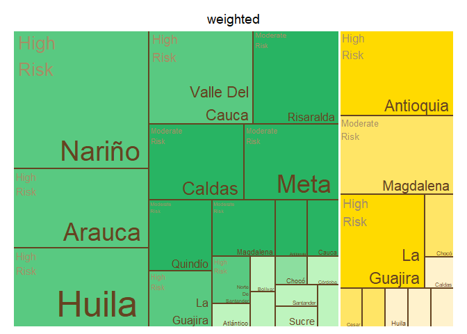<!-- -->

    ## $tm
    ##        crop          expert_in ave_cat_weighted vSize  vColor stdErr
    ## 1    Banana          Antioquia        High Risk    11 #FFDA00     11
    ## 2    Banana          Antioquia             <NA>    11 #FFDA00     11
    ## 3    Banana             Caldas             <NA>     1 #FFF2CC      1
    ## 4    Banana             Caldas    Very Low Risk     1 #FFF2CC      1
    ## 5    Banana              Cesar    Moderate Risk     1 #FFE566      1
    ## 6    Banana              Cesar             <NA>     1 #FFE566      1
    ## 7    Banana              Chocó    Moderate Risk     2 #FFE566      2
    ## 8    Banana              Chocó             <NA>     2 #FFE566      2
    ## 9    Banana            Córdoba    Moderate Risk     1 #FFE566      1
    ## 10   Banana            Córdoba             <NA>     1 #FFE566      1
    ## 11   Banana              Huila             <NA>     1 #FFF2CC      1
    ## 12   Banana              Huila    Very Low Risk     1 #FFF2CC      1
    ## 13   Banana         La Guajira        High Risk     9 #FFDA00      9
    ## 14   Banana         La Guajira             <NA>     9 #FFDA00      9
    ## 15   Banana          Magdalena    Moderate Risk    10 #FFE566     10
    ## 16   Banana          Magdalena             <NA>    10 #FFE566     10
    ## 17   Banana               <NA>             <NA>    38 #FFE566     38
    ## 18   Banana            Quindío             <NA>     1 #FFF2CC      1
    ## 19   Banana            Quindío    Very Low Risk     1 #FFF2CC      1
    ## 20   Banana          Risaralda             <NA>     1 #FFF2CC      1
    ## 21   Banana          Risaralda    Very Low Risk     1 #FFF2CC      1
    ## 22 Plantain          Antioquia    Moderate Risk     2 #28B463      2
    ## 23 Plantain          Antioquia             <NA>     2 #28B463      2
    ## 24 Plantain             Arauca        High Risk     1 #59C981      1
    ## 25 Plantain             Arauca             <NA>     1 #59C981      1
    ## 26 Plantain          Atlántico         Low Risk     1 #BEF4BE      1
    ## 27 Plantain          Atlántico             <NA>     1 #BEF4BE      1
    ## 28 Plantain            Bolívar         Low Risk     1 #BEF4BE      1
    ## 29 Plantain            Bolívar             <NA>     1 #BEF4BE      1
    ## 30 Plantain             Caldas    Moderate Risk     7 #28B463      7
    ## 31 Plantain             Caldas             <NA>     7 #28B463      7
    ## 32 Plantain           Casanare         Low Risk     1 #BEF4BE      1
    ## 33 Plantain           Casanare             <NA>     1 #BEF4BE      1
    ## 34 Plantain              Chocó             <NA>     1 #8CDE9F      1
    ## 35 Plantain              Chocó    Very Low Risk     1 #8CDE9F      1
    ## 36 Plantain            Córdoba         Low Risk     1 #BEF4BE      1
    ## 37 Plantain            Córdoba             <NA>     1 #BEF4BE      1
    ## 38 Plantain              Huila         Low Risk     1 #BEF4BE      1
    ## 39 Plantain              Huila             <NA>     1 #BEF4BE      1
    ## 40 Plantain         La Guajira        High Risk     4 #59C981      4
    ## 41 Plantain         La Guajira             <NA>     4 #59C981      4
    ## 42 Plantain          Magdalena    Moderate Risk     3 #28B463      3
    ## 43 Plantain          Magdalena             <NA>     3 #28B463      3
    ## 44 Plantain               Meta    Moderate Risk     8 #28B463      8
    ## 45 Plantain               Meta             <NA>     8 #28B463      8
    ## 46 Plantain               <NA>             <NA>    49 #BEF4BE     49
    ## 47 Plantain Norte De Santander    Moderate Risk     1 #28B463      1
    ## 48 Plantain Norte De Santander             <NA>     1 #28B463      1
    ## 49 Plantain            Quindío    Moderate Risk     5 #28B463      5
    ## 50 Plantain            Quindío             <NA>     5 #28B463      5
    ## 51 Plantain          Risaralda    Moderate Risk     9 #28B463      9
    ## 52 Plantain          Risaralda             <NA>     9 #28B463      9
    ## 53 Plantain          Santander         Low Risk     1 #BEF4BE      1
    ## 54 Plantain          Santander             <NA>     1 #BEF4BE      1
    ## 55 Plantain              Sucre         Low Risk     1 #BEF4BE      1
    ## 56 Plantain              Sucre             <NA>     1 #BEF4BE      1
    ## 57 Plantain             Tolima         Low Risk     1 #BEF4BE      1
    ## 58 Plantain             Tolima             <NA>     1 #BEF4BE      1
    ##    vColorValue level        x0         y0          w          h   color
    ## 1           NA     3 0.5632184 0.44736842 0.22879037 0.55263158 #FFDA00
    ## 2           NA     2 0.5632184 0.44736842 0.22879037 0.55263158 #FFDA00
    ## 3           NA     2 0.8458418 0.29824561 0.07707911 0.14912281 #FFF2CC
    ## 4           NA     3 0.8458418 0.29824561 0.07707911 0.14912281 #FFF2CC
    ## 5           NA     3 0.9229209 0.29824561 0.07707911 0.14912281 #FFE566
    ## 6           NA     2 0.9229209 0.29824561 0.07707911 0.14912281 #FFE566
    ## 7           NA     3 0.5632184 0.00000000 0.28262339 0.08133971 #FFE566
    ## 8           NA     2 0.5632184 0.00000000 0.28262339 0.08133971 #FFE566
    ## 9           NA     3 0.8458418 0.14912281 0.07707911 0.14912281 #FFE566
    ## 10          NA     2 0.8458418 0.14912281 0.07707911 0.14912281 #FFE566
    ## 11          NA     2 0.9229209 0.14912281 0.07707911 0.14912281 #FFF2CC
    ## 12          NA     3 0.9229209 0.14912281 0.07707911 0.14912281 #FFF2CC
    ## 13          NA     3 0.5632184 0.08133971 0.28262339 0.36602871 #FFDA00
    ## 14          NA     2 0.5632184 0.08133971 0.28262339 0.36602871 #FFDA00
    ## 15          NA     3 0.7920088 0.44736842 0.20799124 0.55263158 #FFE566
    ## 16          NA     2 0.7920088 0.44736842 0.20799124 0.55263158 #FFE566
    ## 17          NA     1 0.5632184 0.00000000 0.43678161 1.00000000 #FFE566
    ## 18          NA     2 0.8458418 0.00000000 0.07707911 0.14912281 #FFF2CC
    ## 19          NA     3 0.8458418 0.00000000 0.07707911 0.14912281 #FFF2CC
    ## 20          NA     2 0.9229209 0.00000000 0.07707911 0.14912281 #FFF2CC
    ## 21          NA     3 0.9229209 0.00000000 0.07707911 0.14912281 #FFF2CC
    ## 22          NA     3 0.3676564 0.35918367 0.19556194 0.11755102 #28B463
    ## 23          NA     2 0.3676564 0.35918367 0.19556194 0.11755102 #28B463
    ## 24          NA     3 0.2112069 0.23945578 0.09600313 0.11972789 #59C981
    ## 25          NA     2 0.2112069 0.23945578 0.09600313 0.11972789 #59C981
    ## 26          NA     3 0.2112069 0.11972789 0.09600313 0.11972789 #BEF4BE
    ## 27          NA     2 0.2112069 0.11972789 0.09600313 0.11972789 #BEF4BE
    ## 28          NA     3 0.2112069 0.00000000 0.09600313 0.11972789 #BEF4BE
    ## 29          NA     2 0.2112069 0.00000000 0.09600313 0.11972789 #BEF4BE
    ## 30          NA     3 0.0000000 0.27210884 0.21120690 0.38095238 #28B463
    ## 31          NA     2 0.0000000 0.27210884 0.21120690 0.38095238 #28B463
    ## 32          NA     3 0.3072100 0.23945578 0.09600313 0.11972789 #BEF4BE
    ## 33          NA     2 0.3072100 0.23945578 0.09600313 0.11972789 #BEF4BE
    ## 34          NA     2 0.3072100 0.11972789 0.09600313 0.11972789 #8CDE9F
    ## 35          NA     3 0.3072100 0.11972789 0.09600313 0.11972789 #8CDE9F
    ## 36          NA     3 0.3072100 0.00000000 0.09600313 0.11972789 #BEF4BE
    ## 37          NA     2 0.3072100 0.00000000 0.09600313 0.11972789 #BEF4BE
    ## 38          NA     3 0.4032132 0.21551020 0.08000261 0.14367347 #BEF4BE
    ## 39          NA     2 0.4032132 0.21551020 0.08000261 0.14367347 #BEF4BE
    ## 40          NA     3 0.2112069 0.35918367 0.15644955 0.29387755 #59C981
    ## 41          NA     2 0.2112069 0.35918367 0.15644955 0.29387755 #59C981
    ## 42          NA     3 0.3676564 0.47673469 0.19556194 0.17632653 #28B463
    ## 43          NA     2 0.3676564 0.47673469 0.19556194 0.17632653 #28B463
    ## 44          NA     3 0.2981744 0.65306122 0.26504395 0.34693878 #28B463
    ## 45          NA     2 0.2981744 0.65306122 0.26504395 0.34693878 #28B463
    ## 46          NA     1 0.0000000 0.00000000 0.56321839 1.00000000 #BEF4BE
    ## 47          NA     3 0.4832158 0.21551020 0.08000261 0.14367347 #28B463
    ## 48          NA     2 0.4832158 0.21551020 0.08000261 0.14367347 #28B463
    ## 49          NA     3 0.0000000 0.00000000 0.21120690 0.27210884 #28B463
    ## 50          NA     2 0.0000000 0.00000000 0.21120690 0.27210884 #28B463
    ## 51          NA     3 0.0000000 0.65306122 0.29817444 0.34693878 #28B463
    ## 52          NA     2 0.0000000 0.65306122 0.29817444 0.34693878 #28B463
    ## 53          NA     3 0.4032132 0.10775510 0.10667015 0.10775510 #BEF4BE
    ## 54          NA     2 0.4032132 0.10775510 0.10667015 0.10775510 #BEF4BE
    ## 55          NA     3 0.4032132 0.00000000 0.10667015 0.10775510 #BEF4BE
    ## 56          NA     2 0.4032132 0.00000000 0.10667015 0.10775510 #BEF4BE
    ## 57          NA     3 0.5098833 0.00000000 0.05333507 0.21551020 #BEF4BE
    ## 58          NA     2 0.5098833 0.00000000 0.05333507 0.21551020 #BEF4BE
    ## 
    ## $type
    ## [1] "color"
    ## 
    ## $vSize
    ## [1] "frequency"
    ## 
    ## $vColor
    ## [1] "group_color"
    ## 
    ## $stdErr
    ## [1] "frequency"
    ## 
    ## $algorithm
    ## [1] "pivotSize"
    ## 
    ## $vpCoorX
    ## [1] 0.02812148 0.97187852
    ## 
    ## $vpCoorY
    ## [1] 0.01968504 0.91031496
    ## 
    ## $aspRatio
    ## [1] 1.483512
    ## 
    ## $range
    ## [1] NA NA
    ## 
    ## $mapping
    ## [1] NA NA NA
    ## 
    ## $draw
    ## [1] TRUE

``` r
#Map of Colombia  
#non weighted
nal_q39_no_weight<- question_39 %>% group_by(expert_in) %>%
  summarise(average= mean(as.numeric(numeric_answer))) %>%
  group_by(average) %>% 
  mutate(cat= category_by_mean_by_question(language = "en", mean = average, question =39))%>%
  rename(EKE.expert.in = expert_in)
```

    ## Warning: There was 1 warning in `mutate()`.
    ## ℹ In argument: `cat = category_by_mean_by_question(...)`.
    ## ℹ In group 0: .
    ## Caused by warning:
    ## ! There was 1 warning in `filter()`.
    ## ℹ In argument: `number == question & number_to_category == mean`.
    ## Caused by warning in `number_to_category == mean`:
    ## ! longer object length is not a multiple of shorter object length

``` r
nal_q39_no_weight<- full_join(codes_department, nal_q39_no_weight)
```

    ## Joining with `by = join_by(EKE.expert.in)`

``` r
nal_q39_no_weight$cat<- factor(nal_q39_no_weight$cat, levels = level_39)
colmap(departamentos, data = nal_q39_no_weight, data_id = "id_depto", var = "cat")+
  scale_fill_manual(values = palette_soil(length(unique(nal_q39_no_weight$cat))-1), na.value = "#eeeeee")
```

    ## Scale for fill is already present.
    ## Adding another scale for fill, which will replace the existing scale.

<!-- -->

``` r
# weighted
nal_q39_weight<- inner_join(question_39, experience_of_each_expert)
```

    ## Joining with `by = join_by(crop, expert_ID, expert_in)`

``` r
nal_q39_weight<- nal_q39_weight %>%
  group_by(expert_in) %>%
  mutate(numeric_answer=as.numeric(numeric_answer)) %>%
  summarise(average_weighted= weighted.mean(numeric_answer, weights)) %>% 
  group_by(average_weighted) %>%
  mutate(cat_weighted= category_by_mean_by_question(language = "en", mean = average_weighted, question =39)) %>%
  rename(EKE.expert.in=expert_in)
```

    ## Warning: There was 1 warning in `mutate()`.
    ## ℹ In argument: `cat_weighted = category_by_mean_by_question(...)`.
    ## ℹ In group 0: .
    ## Caused by warning:
    ## ! There was 1 warning in `filter()`.
    ## ℹ In argument: `number == question & number_to_category == mean`.
    ## Caused by warning in `number_to_category == mean`:
    ## ! longer object length is not a multiple of shorter object length

``` r
nal_q39_weight<- full_join(codes_department, nal_q39_weight)
```

    ## Joining with `by = join_by(EKE.expert.in)`

``` r
nal_q39_weight$cat_weighted<- factor(nal_q39_weight$cat_weighted, levels = level_39)
colmap(departamentos, data = nal_q39_weight, data_id = "id_depto", var = "cat_weighted")+
  scale_fill_manual(values = palette_soil(length(unique(nal_q39_weight$cat))-1), na.value = "#eeeeee")
```

    ## Scale for fill is already present.
    ## Adding another scale for fill, which will replace the existing scale.

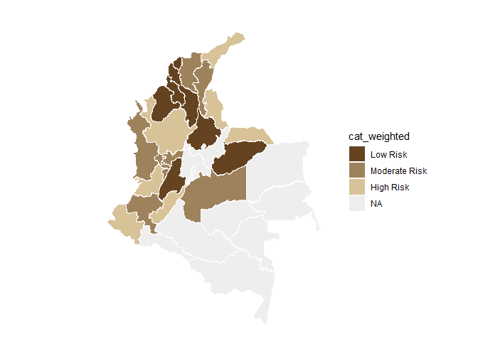<!-- -->

## Question 40: Considering the economic, social, and environmental characteristics of each sub-region, how feasible would it be to contain future outbreaks of R4T in these areas?

``` r
#selecting only question 40----
question_40<- filter(individual_surveys, question_number==40)
#unique(question_40$numeric_answer)
#dput(unique(question_40$answer_in_english))
#organizing the order of the levels
level_40<- c("Slightly Feasible", "Moderately Feasible", "Very Feasible", "Extremely Feasible")
question_40$answer_in_english<- factor(question_40$answer_in_english,levels = level_40)
#average by department (weighted and no weighted)
#not weighted 
avg_dept_no_weight_40<- question_40 %>%
  group_by(crop, expert_in) %>%
  mutate(numeric_answer=as.numeric(numeric_answer))%>%
  mutate(average= mean(numeric_answer)) %>%
  group_by(average)%>%
  mutate(ave_cat= category_by_mean_by_question(40, mean =average, language = "en"))
```

    ## Warning: There were 5 warnings in `mutate()`.
    ## The first warning was:
    ## ℹ In argument: `ave_cat = category_by_mean_by_question(40, mean = average,
    ##   language = "en")`.
    ## ℹ In group 0: .
    ## Caused by warning:
    ## ! There was 1 warning in `filter()`.
    ## ℹ In argument: `number == question & number_to_category == mean`.
    ## Caused by warning in `number_to_category == mean`:
    ## ! longer object length is not a multiple of shorter object length
    ## ℹ Run `dplyr::last_dplyr_warnings()` to see the 4 remaining warnings.

``` r
#weighted 
add_weights_question_40<- inner_join(question_40, experience_of_each_expert)
```

    ## Joining with `by = join_by(crop, expert_ID, expert_in)`

``` r
avg_dept_weight_40<- add_weights_question_40 %>%
  group_by(crop, expert_in) %>%
  mutate(numeric_answer=as.numeric(numeric_answer))%>%
  mutate(average_weighted= weighted.mean(numeric_answer, weights)) %>% 
  group_by(average_weighted)%>%
  mutate(ave_cat_weighted= category_by_mean_by_question(40, mean =average_weighted, language = "en"))
```

    ## Warning: There were 7 warnings in `mutate()`.
    ## The first warning was:
    ## ℹ In argument: `ave_cat_weighted = category_by_mean_by_question(40, mean =
    ##   average_weighted, language = "en")`.
    ## ℹ In group 0: .
    ## Caused by warning:
    ## ! There was 1 warning in `filter()`.
    ## ℹ In argument: `number == question & number_to_category == mean`.
    ## Caused by warning in `number_to_category == mean`:
    ## ! longer object length is not a multiple of shorter object length
    ## ℹ Run `dplyr::last_dplyr_warnings()` to see the 6 remaining warnings.

``` r
#finding the levels per crop (banana and plantain) no weighted
levels_per_crop_Q40_no_weighted<- tapply(avg_dept_no_weight_40$ave_cat, avg_dept_no_weight_40$crop, function(x){(unique(x))})
#generating a ramp palette according to the number of levels per crop
colors_banana_question40_no_weighted<- palette_banana(length(levels_per_crop_Q40_no_weighted$Banana))
colors_plantain_question40_no_weighted<- palette_plantain(length(levels_per_crop_Q40_no_weighted$Plantain))
#Assigning the colors by crop and answer
# Define the knowledge levels for each crop
levels_by_crop_no_weighted_40 <- list(
  Banana = levels_per_crop_Q40_no_weighted$Banana,
  Plantain = levels_per_crop_Q40_no_weighted$Plantain
)
# Define the colors for each crop
colors_by_crop_no_weighted_40 <- list(
  Banana = colors_banana_question40_no_weighted, # Replace with actual color vector for Banana
  Plantain = colors_plantain_question40_no_weighted # Replace with actual color vector for Plantain
  # Add more crops and their color vectors here if needed
)
# Now call the function
avg_dept_no_weight_40 <- assign_group_color(data = avg_dept_no_weight_40, levels_by_crop = levels_by_crop_no_weighted_40, colors_by_crop = colors_by_crop_no_weighted_40,answer_col =  "ave_cat")

#finding the levels per crop (banana and plantain) weighted
levels_per_crop_Q40_weighted<- tapply(avg_dept_weight_40$ave_cat_weighted, avg_dept_weight_40$crop, function(x){(unique(x))})
#generating a ramp palette according to the number of levels per crop
colors_banana_question40_weighted<- palette_banana(length(levels_per_crop_Q40_weighted$Banana))
colors_plantain_question40_weighted<- palette_plantain(length(levels_per_crop_Q40_weighted$Plantain))
#Assigning the colors by crop and answer
# Define the knowledge levels for each crop
levels_by_crop_weighted_40 <- list(
  Banana = levels_per_crop_Q40_weighted$Banana,
  Plantain = levels_per_crop_Q40_weighted$Plantain
)
# Define the colors for each crop
colors_by_crop_weighted_40 <- list(
  Banana = colors_banana_question40_weighted, # Replace with actual color vector for Banana
  Plantain = colors_plantain_question40_weighted # Replace with actual color vector for Plantain
  # Add more crops and their color vectors here if needed
)
# Now call the function
avg_dept_weight_40 <- assign_group_color(data = avg_dept_weight_40, levels_by_crop = levels_by_crop_weighted_40, colors_by_crop = colors_by_crop_weighted_40,answer_col =  "ave_cat_weighted")

#tree map
tree_map_3(data = avg_dept_no_weight_40, "crop", "expert_in", "ave_cat", "group_color", title="No weighted")
```

    ## `summarise()` has grouped output by 'crop', 'expert_in', 'ave_cat'. You can
    ## override using the `.groups` argument.

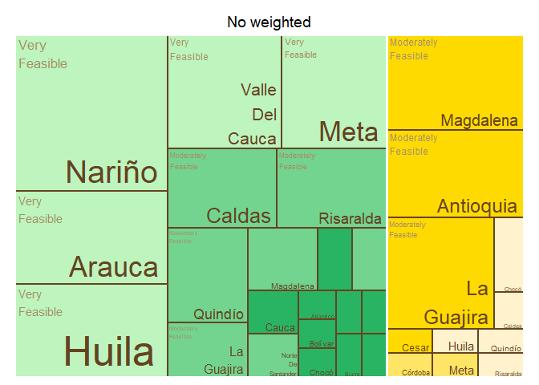<!-- -->

    ## $tm
    ##        crop          expert_in             ave_cat vSize  vColor stdErr
    ## 1    Banana          Antioquia Moderately Feasible    11 #FFDA00     11
    ## 2    Banana          Antioquia                <NA>    11 #FFDA00     11
    ## 3    Banana             Caldas                <NA>     1 #FFF2CC      1
    ## 4    Banana             Caldas   Slightly Feasible     1 #FFF2CC      1
    ## 5    Banana              Cesar Moderately Feasible     1 #FFDA00      1
    ## 6    Banana              Cesar                <NA>     1 #FFDA00      1
    ## 7    Banana              Chocó                <NA>     2 #FFF2CC      2
    ## 8    Banana              Chocó   Slightly Feasible     2 #FFF2CC      2
    ## 9    Banana            Córdoba                <NA>     1 #FFE566      1
    ## 10   Banana            Córdoba       Very Feasible     1 #FFE566      1
    ## 11   Banana              Huila                <NA>     1 #FFF2CC      1
    ## 12   Banana              Huila   Slightly Feasible     1 #FFF2CC      1
    ## 13   Banana         La Guajira Moderately Feasible    11 #FFDA00     11
    ## 14   Banana         La Guajira                <NA>    11 #FFDA00     11
    ## 15   Banana          Magdalena Moderately Feasible    12 #FFDA00     12
    ## 16   Banana          Magdalena                <NA>    12 #FFDA00     12
    ## 17   Banana               Meta                <NA>     1 #FFE566      1
    ## 18   Banana               Meta       Very Feasible     1 #FFE566      1
    ## 19   Banana               <NA>                <NA>    43 #FFF2CC     43
    ## 20   Banana            Quindío                <NA>     1 #FFF2CC      1
    ## 21   Banana            Quindío   Slightly Feasible     1 #FFF2CC      1
    ## 22   Banana          Risaralda                <NA>     1 #FFF2CC      1
    ## 23   Banana          Risaralda   Slightly Feasible     1 #FFF2CC      1
    ## 24 Plantain          Antioquia                <NA>     2 #28B463      2
    ## 25 Plantain          Antioquia   Slightly Feasible     2 #28B463      2
    ## 26 Plantain             Arauca                <NA>     2 #BEF4BE      2
    ## 27 Plantain             Arauca       Very Feasible     2 #BEF4BE      2
    ## 28 Plantain          Atlántico                <NA>     1 #28B463      1
    ## 29 Plantain          Atlántico   Slightly Feasible     1 #28B463      1
    ## 30 Plantain            Bolívar                <NA>     1 #28B463      1
    ## 31 Plantain            Bolívar   Slightly Feasible     1 #28B463      1
    ## 32 Plantain             Caldas Moderately Feasible     7 #73D490      7
    ## 33 Plantain             Caldas                <NA>     7 #73D490      7
    ## 34 Plantain           Casanare Moderately Feasible     2 #73D490      2
    ## 35 Plantain           Casanare                <NA>     2 #73D490      2
    ## 36 Plantain              Chocó                <NA>     1 #28B463      1
    ## 37 Plantain              Chocó   Slightly Feasible     1 #28B463      1
    ## 38 Plantain            Córdoba                <NA>     1 #28B463      1
    ## 39 Plantain            Córdoba   Slightly Feasible     1 #28B463      1
    ## 40 Plantain              Huila                <NA>     1 #28B463      1
    ## 41 Plantain              Huila   Slightly Feasible     1 #28B463      1
    ## 42 Plantain         La Guajira Moderately Feasible     4 #73D490      4
    ## 43 Plantain         La Guajira                <NA>     4 #73D490      4
    ## 44 Plantain          Magdalena Moderately Feasible     3 #73D490      3
    ## 45 Plantain          Magdalena                <NA>     3 #73D490      3
    ## 46 Plantain               Meta                <NA>    11 #BEF4BE     11
    ## 47 Plantain               Meta       Very Feasible    11 #BEF4BE     11
    ## 48 Plantain               <NA>                <NA>    55 #28B463     55
    ## 49 Plantain Norte De Santander                <NA>     1 #28B463      1
    ## 50 Plantain Norte De Santander   Slightly Feasible     1 #28B463      1
    ## 51 Plantain            Quindío Moderately Feasible     7 #73D490      7
    ## 52 Plantain            Quindío                <NA>     7 #73D490      7
    ## 53 Plantain          Risaralda Moderately Feasible     8 #73D490      8
    ## 54 Plantain          Risaralda                <NA>     8 #73D490      8
    ## 55 Plantain          Santander                <NA>     1 #28B463      1
    ## 56 Plantain          Santander   Slightly Feasible     1 #28B463      1
    ## 57 Plantain              Sucre                <NA>     1 #28B463      1
    ## 58 Plantain              Sucre   Slightly Feasible     1 #28B463      1
    ## 59 Plantain             Tolima                <NA>     1 #28B463      1
    ## 60 Plantain             Tolima   Slightly Feasible     1 #28B463      1
    ##    vColorValue level        x0         y0          w          h   color
    ## 1           NA     3 0.7901508 0.46511628 0.20984916 0.53488372 #FFDA00
    ## 2           NA     2 0.7901508 0.46511628 0.20984916 0.53488372 #FFDA00
    ## 3           NA     2 0.8464286 0.33222591 0.07678571 0.13289037 #FFF2CC
    ## 4           NA     3 0.8464286 0.33222591 0.07678571 0.13289037 #FFF2CC
    ## 5           NA     3 0.9232143 0.33222591 0.07678571 0.13289037 #FFDA00
    ## 6           NA     2 0.9232143 0.33222591 0.07678571 0.13289037 #FFDA00
    ## 7           NA     2 0.5612245 0.00000000 0.28520408 0.07155635 #FFF2CC
    ## 8           NA     3 0.5612245 0.00000000 0.28520408 0.07155635 #FFF2CC
    ## 9           NA     2 0.8464286 0.19933555 0.07678571 0.13289037 #FFE566
    ## 10          NA     3 0.8464286 0.19933555 0.07678571 0.13289037 #FFE566
    ## 11          NA     2 0.9232143 0.19933555 0.07678571 0.13289037 #FFF2CC
    ## 12          NA     3 0.9232143 0.19933555 0.07678571 0.13289037 #FFF2CC
    ## 13          NA     3 0.5612245 0.07155635 0.28520408 0.39355993 #FFDA00
    ## 14          NA     2 0.5612245 0.07155635 0.28520408 0.39355993 #FFDA00
    ## 15          NA     3 0.5612245 0.46511628 0.22892635 0.53488372 #FFDA00
    ## 16          NA     2 0.5612245 0.46511628 0.22892635 0.53488372 #FFDA00
    ## 17          NA     2 0.8464286 0.09966777 0.10238095 0.09966777 #FFE566
    ## 18          NA     3 0.8464286 0.09966777 0.10238095 0.09966777 #FFE566
    ## 19          NA     1 0.5612245 0.00000000 0.43877551 1.00000000 #FFF2CC
    ## 20          NA     2 0.8464286 0.00000000 0.10238095 0.09966777 #FFF2CC
    ## 21          NA     3 0.8464286 0.00000000 0.10238095 0.09966777 #FFF2CC
    ## 22          NA     2 0.9488095 0.00000000 0.05119048 0.19933555 #FFF2CC
    ## 23          NA     3 0.9488095 0.00000000 0.05119048 0.19933555 #FFF2CC
    ## 24          NA     2 0.3621695 0.32222222 0.09952750 0.20505051 #28B463
    ## 25          NA     3 0.3621695 0.32222222 0.09952750 0.20505051 #28B463
    ## 26          NA     2 0.4616970 0.32222222 0.09952750 0.20505051 #BEF4BE
    ## 27          NA     3 0.4616970 0.32222222 0.09952750 0.20505051 #BEF4BE
    ## 28          NA     2 0.2128783 0.00000000 0.06333568 0.16111111 #28B463
    ## 29          NA     3 0.2128783 0.00000000 0.06333568 0.16111111 #28B463
    ## 30          NA     2 0.2762139 0.00000000 0.06333568 0.16111111 #28B463
    ## 31          NA     3 0.2762139 0.00000000 0.06333568 0.16111111 #28B463
    ## 32          NA     3 0.4101256 0.52727273 0.15109890 0.47272727 #73D490
    ## 33          NA     2 0.4101256 0.52727273 0.15109890 0.47272727 #73D490
    ## 34          NA     3 0.2128783 0.16111111 0.12667136 0.16111111 #73D490
    ## 35          NA     2 0.2128783 0.16111111 0.12667136 0.16111111 #73D490
    ## 36          NA     2 0.3395496 0.21481481 0.09500352 0.10740741 #28B463
    ## 37          NA     3 0.3395496 0.21481481 0.09500352 0.10740741 #28B463
    ## 38          NA     2 0.3395496 0.10740741 0.09500352 0.10740741 #28B463
    ## 39          NA     3 0.3395496 0.10740741 0.09500352 0.10740741 #28B463
    ## 40          NA     2 0.3395496 0.00000000 0.09500352 0.10740741 #28B463
    ## 41          NA     3 0.3395496 0.00000000 0.09500352 0.10740741 #28B463
    ## 42          NA     3 0.0000000 0.00000000 0.21287825 0.19173554 #73D490
    ## 43          NA     2 0.0000000 0.00000000 0.21287825 0.19173554 #73D490
    ## 44          NA     3 0.2128783 0.32222222 0.14929124 0.20505051 #73D490
    ## 45          NA     2 0.2128783 0.32222222 0.14929124 0.20505051 #73D490
    ## 46          NA     2 0.0000000 0.52727273 0.23744113 0.47272727 #BEF4BE
    ## 47          NA     3 0.0000000 0.52727273 0.23744113 0.47272727 #BEF4BE
    ## 48          NA     1 0.0000000 0.00000000 0.56122449 1.00000000 #28B463
    ## 49          NA     2 0.4345531 0.16111111 0.06333568 0.16111111 #28B463
    ## 50          NA     3 0.4345531 0.16111111 0.06333568 0.16111111 #28B463
    ## 51          NA     3 0.0000000 0.19173554 0.21287825 0.33553719 #73D490
    ## 52          NA     2 0.0000000 0.19173554 0.21287825 0.33553719 #73D490
    ## 53          NA     3 0.2374411 0.52727273 0.17268446 0.47272727 #73D490
    ## 54          NA     2 0.2374411 0.52727273 0.17268446 0.47272727 #73D490
    ## 55          NA     2 0.4978888 0.16111111 0.06333568 0.16111111 #28B463
    ## 56          NA     3 0.4978888 0.16111111 0.06333568 0.16111111 #28B463
    ## 57          NA     2 0.4345531 0.00000000 0.06333568 0.16111111 #28B463
    ## 58          NA     3 0.4345531 0.00000000 0.06333568 0.16111111 #28B463
    ## 59          NA     2 0.4978888 0.00000000 0.06333568 0.16111111 #28B463
    ## 60          NA     3 0.4978888 0.00000000 0.06333568 0.16111111 #28B463
    ## 
    ## $type
    ## [1] "color"
    ## 
    ## $vSize
    ## [1] "frequency"
    ## 
    ## $vColor
    ## [1] "group_color"
    ## 
    ## $stdErr
    ## [1] "frequency"
    ## 
    ## $algorithm
    ## [1] "pivotSize"
    ## 
    ## $vpCoorX
    ## [1] 0.02812148 0.97187852
    ## 
    ## $vpCoorY
    ## [1] 0.01968504 0.91031496
    ## 
    ## $aspRatio
    ## [1] 1.483512
    ## 
    ## $range
    ## [1] NA NA
    ## 
    ## $mapping
    ## [1] NA NA NA
    ## 
    ## $draw
    ## [1] TRUE

``` r
tree_map_3(data = avg_dept_weight_40, "crop", "expert_in", "ave_cat_weighted", "group_color", title="weighted")
```

    ## `summarise()` has grouped output by 'crop', 'expert_in', 'ave_cat_weighted'.
    ## You can override using the `.groups` argument.

<!-- -->

    ## $tm
    ##        crop          expert_in    ave_cat_weighted vSize  vColor stdErr
    ## 1    Banana          Antioquia Moderately Feasible    11 #FFDA00     11
    ## 2    Banana          Antioquia                <NA>    11 #FFDA00     11
    ## 3    Banana             Caldas                <NA>     1 #FFE566      1
    ## 4    Banana             Caldas   Slightly Feasible     1 #FFE566      1
    ## 5    Banana              Cesar Moderately Feasible     1 #FFDA00      1
    ## 6    Banana              Cesar                <NA>     1 #FFDA00      1
    ## 7    Banana              Chocó                <NA>     2 #FFE566      2
    ## 8    Banana              Chocó   Slightly Feasible     2 #FFE566      2
    ## 9    Banana            Córdoba                <NA>     1 #FFF2CC      1
    ## 10   Banana            Córdoba       Very Feasible     1 #FFF2CC      1
    ## 11   Banana              Huila                <NA>     1 #FFE566      1
    ## 12   Banana              Huila   Slightly Feasible     1 #FFE566      1
    ## 13   Banana         La Guajira Moderately Feasible    10 #FFDA00     10
    ## 14   Banana         La Guajira                <NA>    10 #FFDA00     10
    ## 15   Banana          Magdalena Moderately Feasible    12 #FFDA00     12
    ## 16   Banana          Magdalena                <NA>    12 #FFDA00     12
    ## 17   Banana               <NA>                <NA>    41 #FFE566     41
    ## 18   Banana            Quindío                <NA>     1 #FFE566      1
    ## 19   Banana            Quindío   Slightly Feasible     1 #FFE566      1
    ## 20   Banana          Risaralda                <NA>     1 #FFE566      1
    ## 21   Banana          Risaralda   Slightly Feasible     1 #FFE566      1
    ## 22 Plantain          Antioquia Moderately Feasible     2 #28B463      2
    ## 23 Plantain          Antioquia                <NA>     2 #28B463      2
    ## 24 Plantain             Arauca                <NA>     2 #BEF4BE      2
    ## 25 Plantain             Arauca       Very Feasible     2 #BEF4BE      2
    ## 26 Plantain          Atlántico                <NA>     1 #73D490      1
    ## 27 Plantain          Atlántico   Slightly Feasible     1 #73D490      1
    ## 28 Plantain            Bolívar                <NA>     1 #73D490      1
    ## 29 Plantain            Bolívar   Slightly Feasible     1 #73D490      1
    ## 30 Plantain             Caldas Moderately Feasible     7 #28B463      7
    ## 31 Plantain             Caldas                <NA>     7 #28B463      7
    ## 32 Plantain           Casanare Moderately Feasible     2 #28B463      2
    ## 33 Plantain           Casanare                <NA>     2 #28B463      2
    ## 34 Plantain              Chocó                <NA>     1 #73D490      1
    ## 35 Plantain              Chocó   Slightly Feasible     1 #73D490      1
    ## 36 Plantain            Córdoba                <NA>     1 #73D490      1
    ## 37 Plantain            Córdoba   Slightly Feasible     1 #73D490      1
    ## 38 Plantain              Huila                <NA>     1 #73D490      1
    ## 39 Plantain              Huila   Slightly Feasible     1 #73D490      1
    ## 40 Plantain         La Guajira Moderately Feasible     4 #28B463      4
    ## 41 Plantain         La Guajira                <NA>     4 #28B463      4
    ## 42 Plantain          Magdalena Moderately Feasible     3 #28B463      3
    ## 43 Plantain          Magdalena                <NA>     3 #28B463      3
    ## 44 Plantain               Meta                <NA>    10 #BEF4BE     10
    ## 45 Plantain               Meta       Very Feasible    10 #BEF4BE     10
    ## 46 Plantain               <NA>                <NA>    53 #73D490     53
    ## 47 Plantain Norte De Santander                <NA>     1 #73D490      1
    ## 48 Plantain Norte De Santander   Slightly Feasible     1 #73D490      1
    ## 49 Plantain            Quindío Moderately Feasible     6 #28B463      6
    ## 50 Plantain            Quindío                <NA>     6 #28B463      6
    ## 51 Plantain          Risaralda Moderately Feasible     8 #28B463      8
    ## 52 Plantain          Risaralda                <NA>     8 #28B463      8
    ## 53 Plantain          Santander                <NA>     1 #73D490      1
    ## 54 Plantain          Santander   Slightly Feasible     1 #73D490      1
    ## 55 Plantain              Sucre                <NA>     1 #73D490      1
    ## 56 Plantain              Sucre   Slightly Feasible     1 #73D490      1
    ## 57 Plantain             Tolima                <NA>     1 #73D490      1
    ## 58 Plantain             Tolima   Slightly Feasible     1 #73D490      1
    ##    vColorValue level        x0         y0          w          h   color
    ## 1           NA     3 0.7913969 0.43902439 0.20860315 0.56097561 #FFDA00
    ## 2           NA     2 0.7913969 0.43902439 0.20860315 0.56097561 #FFDA00
    ## 3           NA     2 0.8546099 0.29268293 0.07269504 0.14634146 #FFE566
    ## 4           NA     3 0.8546099 0.29268293 0.07269504 0.14634146 #FFE566
    ## 5           NA     3 0.9273050 0.29268293 0.07269504 0.14634146 #FFDA00
    ## 6           NA     2 0.9273050 0.29268293 0.07269504 0.14634146 #FFDA00
    ## 7           NA     2 0.5638298 0.00000000 0.29078014 0.07317073 #FFE566
    ## 8           NA     3 0.5638298 0.00000000 0.29078014 0.07317073 #FFE566
    ## 9           NA     2 0.8546099 0.14634146 0.07269504 0.14634146 #FFF2CC
    ## 10          NA     3 0.8546099 0.14634146 0.07269504 0.14634146 #FFF2CC
    ## 11          NA     2 0.9273050 0.14634146 0.07269504 0.14634146 #FFE566
    ## 12          NA     3 0.9273050 0.14634146 0.07269504 0.14634146 #FFE566
    ## 13          NA     3 0.5638298 0.07317073 0.29078014 0.36585366 #FFDA00
    ## 14          NA     2 0.5638298 0.07317073 0.29078014 0.36585366 #FFDA00
    ## 15          NA     3 0.5638298 0.43902439 0.22756707 0.56097561 #FFDA00
    ## 16          NA     2 0.5638298 0.43902439 0.22756707 0.56097561 #FFDA00
    ## 17          NA     1 0.5638298 0.00000000 0.43617021 1.00000000 #FFE566
    ## 18          NA     2 0.8546099 0.00000000 0.07269504 0.14634146 #FFE566
    ## 19          NA     3 0.8546099 0.00000000 0.07269504 0.14634146 #FFE566
    ## 20          NA     2 0.9273050 0.00000000 0.07269504 0.14634146 #FFE566
    ## 21          NA     3 0.9273050 0.00000000 0.07269504 0.14634146 #FFE566
    ## 22          NA     3 0.4850726 0.39022298 0.07875718 0.27015437 #28B463
    ## 23          NA     2 0.4850726 0.39022298 0.07875718 0.27015437 #28B463
    ## 24          NA     2 0.2094225 0.19511149 0.10904840 0.19511149 #BEF4BE
    ## 25          NA     3 0.2094225 0.19511149 0.10904840 0.19511149 #BEF4BE
    ## 26          NA     2 0.3184709 0.26014866 0.08178630 0.13007433 #73D490
    ## 27          NA     3 0.3184709 0.26014866 0.08178630 0.13007433 #73D490
    ## 28          NA     2 0.4002572 0.26014866 0.08178630 0.13007433 #73D490
    ## 29          NA     3 0.4002572 0.26014866 0.08178630 0.13007433 #73D490
    ## 30          NA     3 0.0000000 0.30478955 0.20942249 0.35558781 #28B463
    ## 31          NA     2 0.0000000 0.30478955 0.20942249 0.35558781 #28B463
    ## 32          NA     3 0.2094225 0.00000000 0.10904840 0.19511149 #28B463
    ## 33          NA     2 0.2094225 0.00000000 0.10904840 0.19511149 #28B463
    ## 34          NA     2 0.4820435 0.26014866 0.08178630 0.13007433 #73D490
    ## 35          NA     3 0.4820435 0.26014866 0.08178630 0.13007433 #73D490
    ## 36          NA     2 0.3184709 0.13007433 0.08178630 0.13007433 #73D490
    ## 37          NA     3 0.3184709 0.13007433 0.08178630 0.13007433 #73D490
    ## 38          NA     2 0.3184709 0.00000000 0.08178630 0.13007433 #73D490
    ## 39          NA     3 0.3184709 0.00000000 0.08178630 0.13007433 #73D490
    ## 40          NA     3 0.2094225 0.39022298 0.15751435 0.27015437 #28B463
    ## 41          NA     2 0.2094225 0.39022298 0.15751435 0.27015437 #28B463
    ## 42          NA     3 0.3669368 0.39022298 0.11813576 0.27015437 #28B463
    ## 43          NA     2 0.3669368 0.39022298 0.11813576 0.27015437 #28B463
    ## 44          NA     2 0.0000000 0.66037736 0.31323877 0.33962264 #BEF4BE
    ## 45          NA     3 0.0000000 0.66037736 0.31323877 0.33962264 #BEF4BE
    ## 46          NA     1 0.0000000 0.00000000 0.56382979 1.00000000 #73D490
    ## 47          NA     2 0.4002572 0.13007433 0.08178630 0.13007433 #73D490
    ## 48          NA     3 0.4002572 0.13007433 0.08178630 0.13007433 #73D490
    ## 49          NA     3 0.0000000 0.00000000 0.20942249 0.30478955 #28B463
    ## 50          NA     2 0.0000000 0.00000000 0.20942249 0.30478955 #28B463
    ## 51          NA     3 0.3132388 0.66037736 0.25059102 0.33962264 #28B463
    ## 52          NA     2 0.3132388 0.66037736 0.25059102 0.33962264 #28B463
    ## 53          NA     2 0.4820435 0.13007433 0.08178630 0.13007433 #73D490
    ## 54          NA     3 0.4820435 0.13007433 0.08178630 0.13007433 #73D490
    ## 55          NA     2 0.4002572 0.00000000 0.08178630 0.13007433 #73D490
    ## 56          NA     3 0.4002572 0.00000000 0.08178630 0.13007433 #73D490
    ## 57          NA     2 0.4820435 0.00000000 0.08178630 0.13007433 #73D490
    ## 58          NA     3 0.4820435 0.00000000 0.08178630 0.13007433 #73D490
    ## 
    ## $type
    ## [1] "color"
    ## 
    ## $vSize
    ## [1] "frequency"
    ## 
    ## $vColor
    ## [1] "group_color"
    ## 
    ## $stdErr
    ## [1] "frequency"
    ## 
    ## $algorithm
    ## [1] "pivotSize"
    ## 
    ## $vpCoorX
    ## [1] 0.02812148 0.97187852
    ## 
    ## $vpCoorY
    ## [1] 0.01968504 0.91031496
    ## 
    ## $aspRatio
    ## [1] 1.483512
    ## 
    ## $range
    ## [1] NA NA
    ## 
    ## $mapping
    ## [1] NA NA NA
    ## 
    ## $draw
    ## [1] TRUE

``` r
#Map of Colombia  
#non weighted
nal_q40_no_weight<- question_40 %>% group_by(expert_in) %>%
  summarise(average= mean(as.numeric(numeric_answer))) %>%
  group_by(average) %>% 
  mutate(cat= category_by_mean_by_question(language = "en", mean = average, question =40))%>%
  rename(EKE.expert.in = expert_in)

nal_q40_no_weight<- full_join(codes_department, nal_q40_no_weight)
```

    ## Joining with `by = join_by(EKE.expert.in)`

``` r
nal_q40_no_weight$cat<- factor(nal_q40_no_weight$cat, levels = level_40)
colmap(departamentos, data = nal_q40_no_weight, data_id = "id_depto", var = "cat")+
  scale_fill_manual(values = palette_soil(length(unique(nal_q40_no_weight$cat))-1), na.value = "#eeeeee")
```

    ## Scale for fill is already present.
    ## Adding another scale for fill, which will replace the existing scale.

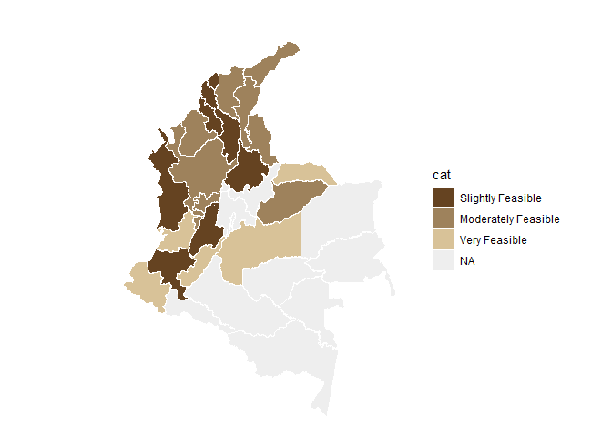<!-- -->

``` r
# weighted
nal_q40_weight<- inner_join(question_40, experience_of_each_expert)
```

    ## Joining with `by = join_by(crop, expert_ID, expert_in)`

``` r
nal_q40_weight<- nal_q40_weight %>%
  group_by(expert_in) %>%
  mutate(numeric_answer=as.numeric(numeric_answer)) %>%
  summarise(average_weighted= weighted.mean(numeric_answer, weights)) %>% 
  group_by(average_weighted) %>%
  mutate(cat_weighted= category_by_mean_by_question(language = "en", mean = average_weighted, question =40)) %>%
  rename(EKE.expert.in=expert_in)

nal_q40_weight<- full_join(codes_department, nal_q40_weight)
```

    ## Joining with `by = join_by(EKE.expert.in)`

``` r
nal_q40_weight$cat_weighted<- factor(nal_q40_weight$cat_weighted, levels = level_40)
colmap(departamentos, data = nal_q40_weight, data_id = "id_depto", var = "cat_weighted")+
  scale_fill_manual(values = palette_soil(length(unique(nal_q40_weight$cat))-1), na.value = "#eeeeee")
```

    ## Scale for fill is already present.
    ## Adding another scale for fill, which will replace the existing scale.

<!-- -->
