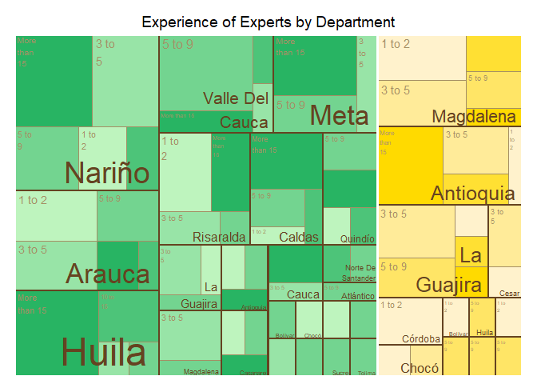
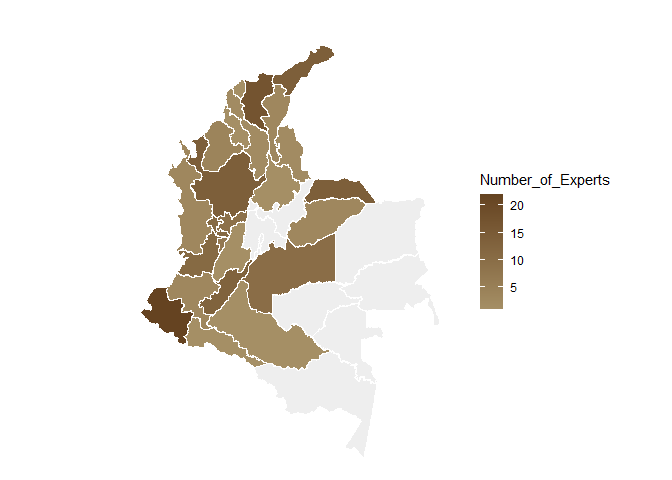

Analisis of individual Questions EKE Colombia - Banano and Plantain 2023
================
Jacobo Robledo
2024-01-02

## Libraries, Functions, and Global Variables

#### `tree_map_3` Function

**Description:**  
This function creates a treemap visualization based on a given dataset.
It first calculates the frequency of occurrences for specified grouping
variables and then plots a treemap using these frequencies.

**Parameters:**  

- `data`: A data frame containing the data to be visualized.

- `group`: The name of the column in ‘data’ to be used as the primary
  grouping variable.

- `subgroup_1`: The name of the column in ‘data’ to be used as the first
  level subgroup.

- `subgroup_2`: The name of the column in ‘data’ to be used as the
  second level subgroup.

- `color_column`: The name of the column in ‘data’ that determines the
  color of the treemap blocks.

- `title`: The title to be displayed on the treemap.

**Details:**  
The function groups the data by ‘group’, ‘subgroup_1’, ‘subgroup_2’, and
‘color_column’, then calculates the frequency of each group. It uses the
‘treemap’ package to create the treemap, where the size of each block is
determined by the calculated frequency. The color of the blocks is
determined by the ‘color_column’. The function allows customization of
label sizes, colors, and placement, as well as border colors and widths.

**Returns:**  
A treemap plot as specified by the input parameters.

**Example Usage:**  
`tree_map_3(my_data, "main_category", "sub_category1", "sub_category2", "color_var", "My Treemap Title")`

#### `Col_map_by_depto` Function

**Description:**  
This function creates a colored map visualization based on departmental
data. It utilizes the `colmap` function to map data to specific
geographical areas (departments) and applies a continuous color scale to
these areas.

**Function Structure:** - `colmap(departamentos, data, data_id, var)`:
Maps the `var` variable from the `data` data frame onto the
`departamentos` geographical layout. The `data_id` specifies the
matching column in `data` that corresponds to department IDs. -
`scale_fill_continuous(low, high, na.value)`: Applies a continuous color
scale to the map. The `low` and `high` parameters define the color range
for the lowest and highest values of `var`, respectively. The `na.value`
parameter defines the color for missing values. -
`labs(fill = legend_lab)`: Sets the label for the map legend.

**Parameters:**  
- `departamentos`: The geographical layout of departments. - `data`: The
data frame containing the data to be visualized. - `data_id`: The column
in `data` that corresponds to department IDs. - `var`: The variable in
`data` to be visualized on the map. - `low`: The color representing the
low end of the `var` variable’s range. - `high`: The color representing
the high end of the `var` variable’s range. - `na.value`: The color used
for missing values in `var`. - `legend_lab`: The label for the map’s
legend.

**Example Usage:**  
Suppose you have a data frame `my_data` with department IDs in
`depto_id` column and a variable `population` to visualize. You could
call:

`R Col_map_by_depto(departamentos = my_map_layout, data = my_data, data_id = "depto_id", var = "population", low = "blue", high = "red", na.value = "grey", legend_lab = "Population")`

#### `category_by_mean_by_question` Function

**Description:**  
This function retrieves the category corresponding to a given mean value
for a specific question. It reads a dataset from a specified URL
containing category information in both English and Spanish. The
function allows the user to specify the language for the category
description.

**Parameters:**  
- `question`: The question number for which the category needs to be
found. - `mean`: The mean value whose corresponding category is to be
retrieved. - `language`: A character vector specifying the language of
the category description. Default is `c("en", "es")`.

**Functionality:**  
- The function first rounds the mean value to the nearest whole
number. - It then reads a dataset from a given URL that contains
categories in both English and Spanish. - Depending on the selected
language, it filters the dataset to find the category corresponding to
the provided question number and rounded mean value. - If the language
is set to “en” (English), it retrieves the category from the
`trans_answer` column; if “es” (Spanish), it retrieves from the
`Category` column. - An error message is displayed if the specified
language is not found.

**Returns:**  
The category corresponding to the specified mean and question in the
chosen language.

**Example Usage:**  
Suppose you have a mean value of 3.6 for question number 5 and want the
category in English. You could call:

`R   category <- category_by_mean_by_question(question = 5, mean = 3.6, language = "en")`

#### `count_elements_by_group` Function

**Description:**  
This function is designed to count the frequency of elements within a
specified column that contains comma-separated values. It processes the
data to convert it into a long format and then performs a count of each
element within the specified groups.

**Parameters:**  
- `data`: The data frame containing the data to be analyzed. -
`value_column`: The name of the column in `data` that contains the
comma-separated values. - `group_columns`: A vector of column names in
`data` used to define groups for aggregation.

**Functionality:**  
- The function first uses `separate_rows` to split the comma-separated
values in `value_column` and convert the data into a long format. -
`group_by` is then applied to group the data by the columns specified in
`group_columns`. - `count` is used to count the occurrences of each
unique element within these groups. - The result is a long-format data
frame with the frequency count of each element in the specified groups.

**Returns:**  
A data frame in long format that contains the counts of each unique
element within the specified groups.

**Example Usage:**  
Suppose you have a data frame `df` with a column `categories` containing
comma-separated values and you want to count these values within groups
defined by `column1` and `column2`. You could call:
`R   result <- count_elements_by_group(df, "categories", c("column1", "column2"))`

#### `bar_plot_banana_plantain` Function

**Description:**  
This function creates a bar plot specifically designed for visualizing
data related to ‘Banana’ and ‘Plantain’ categories. It includes
customizable aesthetics such as background color for highlighting, bar
color coding, and an adjustable upper limit for the y-axis to enhance
the proportional representation of data.

**Parameters:**  
- `data_set`: The data frame containing the data to be plotted. -
`x_lab`: Label for the x-axis. - `y_lab`: Label for the y-axis. -
`title`: The title of the plot. - `x`: The name of the column in
`data_set` to be used as the x-axis variable. - `y`: The name of the
column in `data_set` to be used as the y-axis variable. - `facet`: The
name of the column in `data_set` to create facets for different panels
in the plot. - `alpha`: The transparency level for the background color
of the geom_rect. - `background_color`: The name of the column in
`data_set` that contains the background colors for the rectangles. -
`bar_color`: The name of the column in `data_set` that contains the
colors for the bars. - `proportional_limit`: A numeric value to set the
upper limit of the y-axis as a proportion of the maximum value of the y
variable.

**Functionality:**  
- The function starts by converting provided column names into symbols
for `ggplot2` aesthetics. - It calculates the new y-axis upper limit
based on the provided `proportional_limit`. - A ggplot object is
initialized, and layers are added for rectangles, text, and bars, with
aesthetics mapped accordingly. - The plot’s appearance is customized,
including colors for text and lines, and removing the grid lines for a
cleaner look. - The y-axis is scaled with the calculated limit, and
facet panels are created as per the `facet` column.

**Returns:**  
A ggplot object representing the bar plot with customized aesthetics and
scales, ready for rendering or further modification.

**Example Usage:**  
To create a plot for a data frame `df` with background colors specified
in `bg_colors` and bar colors in `bar_colors`, where we want to facet by
the ‘type’ column and set the y-axis upper limit to be 20% higher than
the max ‘value’ in `df`:

`R result_plot <- bar_plot_banana_plantain(   data_set = df,   x_lab = "Type of Crop",   y_lab = "Value in Percentage",   title = "Crop Value Comparison",   x = "type",   y = "value",   facet = "category",   alpha = 0.3,   background_color = "bg_colors",   bar_color = "bar_colors",   proportional_limit = 1.2 ) # Print the result print(result_plot)`

``` r
#libraries----
  library(treemap)
```

    ## Warning: package 'treemap' was built under R version 4.3.2

``` r
  library(tidyverse)
```

    ## ── Attaching core tidyverse packages ──────────────────────── tidyverse 2.0.0 ──
    ## ✔ dplyr     1.1.3     ✔ readr     2.1.4
    ## ✔ forcats   1.0.0     ✔ stringr   1.5.0
    ## ✔ ggplot2   3.4.4     ✔ tibble    3.2.1
    ## ✔ lubridate 1.9.3     ✔ tidyr     1.3.0
    ## ✔ purrr     1.0.2     
    ## ── Conflicts ────────────────────────────────────────── tidyverse_conflicts() ──
    ## ✖ dplyr::filter() masks stats::filter()
    ## ✖ dplyr::lag()    masks stats::lag()
    ## ℹ Use the conflicted package (<http://conflicted.r-lib.org/>) to force all conflicts to become errors

``` r
  library(RColorBrewer)
  library("colmaps")
```

    ## The legacy packages maptools, rgdal, and rgeos, underpinning the sp package,
    ## which was just loaded, were retired in October 2023.
    ## Please refer to R-spatial evolution reports for details, especially
    ## https://r-spatial.org/r/2023/05/15/evolution4.html.
    ## It may be desirable to make the sf package available;
    ## package maintainers should consider adding sf to Suggests:.

``` r
  library("homicidios")
  library(voronoiTreemap)
```

    ## Warning: package 'voronoiTreemap' was built under R version 4.3.2

``` r
  library(webshot)
```

    ## Warning: package 'webshot' was built under R version 4.3.2

``` r
  library(webshot2)
```

    ## Warning: package 'webshot2' was built under R version 4.3.2

    ## Registered S3 method overwritten by 'webshot2':
    ##   method        from   
    ##   print.webshot webshot
    ## 
    ## Attaching package: 'webshot2'
    ## 
    ## The following objects are masked from 'package:webshot':
    ## 
    ##     appshot, resize, rmdshot, shrink, webshot

``` r
#Global variables
  #set the color palette for bananas and plantains
  palette_banana <- colorRampPalette(c("#FFDA00","#FFF2CC" ))
  palette_plantain <- colorRampPalette(c("#28B463","#BEF4BE"))
  palette_soil<- colorRampPalette(c( "#654321","#d8c298"))
    
  #data set: individual questions:
  #read individual surveys from GitHub
  num_cols <- length(read.csv("https://raw.githubusercontent.com/jrobledob/R2M_Colombia_banana_and_plantain/main/Data/DATA_Individual_surveys_Banana_and_Plantain_Colombia_Clean_surveys_2023-12-28.csv", nrows = 1, header = TRUE))
  # Create a colClasses vector with "character" for each column
  col_classes <- rep("character", num_cols)
  individual_surveys<- read.csv("https://raw.githubusercontent.com/jrobledob/R2M_Colombia_banana_and_plantain/main/Data/DATA_Individual_surveys_Banana_and_Plantain_Colombia_Clean_surveys_2023-12-28.csv", colClasses = col_classes)
  #reformat columns
  individual_surveys$question_number<- as.integer(individual_surveys$question_number)

#function tree_map_3 
  tree_map_3<- function(data,group, subgroup_1, subgroup_2, color_column, title){
    #Calculate the frequencies
    frequency_personalized_question<- data %>%
      group_by(!!rlang::sym(group), !!rlang::sym(subgroup_1), !!rlang::sym(subgroup_2), !!rlang::sym(color_column)) %>%
      summarise(frequency=n())
    #Plot the tree map 
    figure<- treemap(frequency_personalized_question,
            index=c(group,subgroup_1, subgroup_2), 
            vSize="frequency",
            vColor=color_column,
            type="color",
            fontsize.labels=c(0,7,4),                # size of labels. Give the size per level of aggregation: size for group, size for subgroup, sub-subgroups...
            fontcolor.labels=c("transparent","#654321", "#A58F65"),    # Color of labels
            fontface.labels=c(2,1,1),                  # Font of labels: 1,2,3,4 for normal, bold, italic, bold-italic...
            bg.labels=c("transparent"),              # Background color of labels
            align.labels=list(
              c("center", "top"), 
              c("right", "bottom"), 
              c("left", "top")
            ),                                   # Where to place labels in the rectangle?
            overlap.labels=0.5,                      # number between 0 and 1 that determines the tolerance of the overlap between labels. 0 means that labels of lower levels are not printed if higher level labels overlap, 1  means that labels are always printed. In-between values, for instance the default value .5, means that lower level labels are printed if other labels do not overlap with more than .5  times their area size.
            inflate.labels=T,                        # If true, labels are bigger when rectangle is bigger.
            border.col=c("white","#654321","#A58F65"),             # Color of borders of groups, of subgroups, of subsubgroups ....
            border.lwds=c(3,2, 0.5),                         # Width of colors
            title=title,                      # Customize your title
            #fontsize.title=12                       # Size of the title
    )
    return(figure)
  }

#function Col_map_by_depto
  Col_map_by_depto<- function(data, data_id, var, low, high, na.values, legend_lab){
    
    figure<- colmap(departamentos, data = data, data_id = data_id, var = var)+
      scale_fill_continuous(low = low , high = high, na.value = na.values)
    labs(fill= legend_lab)
    return(figure)
  }
  
#function category_by_mean_by_question
category_by_mean_by_question<- function(question, mean, language=c("en","es")){
  mean<-round(mean, 0)
  data<- read.csv("https://raw.githubusercontent.com/jrobledob/R2M_Colombia_banana_and_plantain/main/Data/SUP_DATA_Categories_that_can_be_chosen_in_every_question_of_the_individual_survey_English_and_Spanish.csv")
  if (language=="en") {
    category<- filter(data, number==question & number_to_category==mean)$trans_answer
  }else{
    if (language=="es") {
      category<- filter(data, number==question & number_to_category==mean)$Category
    }
    cat("ERROR: Language not found")
  }
  return(category)
}

#Function count_elements_by_group
count_elements_by_group <- function(data, value_column, group_columns) {
  # Split the comma-separated values and convert to long format
  data_long <- data %>%
    separate_rows(!!sym(value_column), sep = ",\\s*") %>%
    group_by(across(all_of(group_columns))) %>%
    count(!!sym(value_column))
  return(data_long)
}
  
#function bar_plot_banana_plantain
bar_plot_banana_plantain <- function(data_set, x_lab, y_lab, title, x, y, alpha, background_color, bar_color, proportional_limit, facet = NULL) {
  # Calculate new y-axis upper limit, 20% above the max value
  ymax_limit <- max(data_set[[y]], na.rm = TRUE) * proportional_limit
  
  # Convert strings to symbols
  x_sym <- rlang::sym(x)
  y_sym <- rlang::sym(y)
  background_color_sym <- rlang::sym(background_color)
  bar_color_sym <- rlang::sym(bar_color)
  
  # Start the plot
  p <- ggplot(data_set, aes(x = !!x_sym, y = !!y_sym)) +
    geom_rect(aes(fill = !!background_color_sym), xmin = -Inf, xmax = Inf, ymin = -Inf, ymax = Inf, alpha = alpha) +
    geom_text(aes(label = !!y_sym), vjust = -0.5, color = "#654321") +
    geom_bar(aes(fill = !!bar_color_sym), color = "#654321",stat = 'identity', position = position_dodge()) +
    scale_fill_identity() +
    labs(x = x_lab, y = y_lab, title = title) +
    theme(
      text = element_text(color = "#654321"),
      axis.title = element_text(color = "#654321"),
      axis.text = element_text(color = "#654321"),
      axis.line = element_line(color = "#654321"),
      panel.grid.major = element_blank(),
      panel.grid.minor = element_blank(),
      panel.border = element_rect(color = "#654321", fill = NA),
      strip.text = element_text(color = "#654321"),
      strip.background = element_rect(fill = "#A58F65", colour = NA),
      legend.position = "none"
    ) +
    ylim(0, ymax_limit)
  
  # Conditionally add facet grid if facet is provided
  if (!is.null(facet) && facet != "") {
    facet_sym <- rlang::sym(facet)
    facet_formula <- as.formula(paste(". ~", facet))
    p <- p + facet_grid(facet_formula)
  }
  
  # Return the plot
  return(p)
}
```

## Question 1: How many years of experience do you have in each department?

``` r
#selecting only question 1----
  question_1<- filter(individual_surveys, question_number==1)
  #organizing the order of the levels
  question_1$answer_in_english<- factor(question_1$answer_in_english,levels = c("1 to 2", "3 to 5","5 to 9","10 to 15","More than 15"))
  #finding the number of levels per crop (banana and plantain)
  levels_per_crop_Q1<- tapply(question_1$answer_in_english, question_1$crop, function(x){length(unique(x))})
  #generating a ramp palette according to the number of levels per crop
  colors_banana_question1<- palette_banana(levels_per_crop_Q1["Banana"])
  colors_plantain_question1<- palette_plantain(levels_per_crop_Q1["Plantain"])
  #Assigning the colors by crop and answer
  question_1<- question_1 %>%
    mutate(group_color= case_when(
      crop=="Banana" & answer_in_english == "1 to 2" ~ colors_banana_question1[5],
      crop=="Banana" & answer_in_english == "3 to 5" ~ colors_banana_question1[4],
      crop=="Banana" & answer_in_english == "5 to 9" ~ colors_banana_question1[3],
      crop=="Banana" & answer_in_english == "10 to 15" ~ colors_banana_question1[2],
      crop=="Banana" & answer_in_english == "More than 15" ~ colors_banana_question1[1],
      crop=="Plantain" & answer_in_english == "1 to 2" ~ colors_plantain_question1[5],
      crop=="Plantain" & answer_in_english == "3 to 5" ~ colors_plantain_question1[4],
      crop=="Plantain" & answer_in_english == "5 to 9" ~ colors_plantain_question1[3],
      crop=="Plantain" & answer_in_english == "10 to 15" ~ colors_plantain_question1[2],
      crop=="Plantain" & answer_in_english == "More than 15" ~ colors_plantain_question1[1],
    ))
#tree map
tree_map_3(data = question_1, "crop", "expert_in", "answer_in_english", "group_color", title="Experience of Experts by Department")
```

    ## `summarise()` has grouped output by 'crop', 'expert_in', 'answer_in_english'.
    ## You can override using the `.groups` argument.

<!-- -->

    ## $tm
    ##        crop          expert_in answer_in_english vSize  vColor stdErr
    ## 1    Banana          Antioquia            1 to 2     1 #FFF2CC      1
    ## 2    Banana          Antioquia          10 to 15     2 #FFE033      2
    ## 3    Banana          Antioquia            3 to 5     3 #FFEB99      3
    ## 4    Banana          Antioquia      More than 15     5 #FFDA00      5
    ## 5    Banana          Antioquia              <NA>    11 #FFDA00     11
    ## 6    Banana            Bolívar            1 to 2     1 #FFF2CC      1
    ## 7    Banana            Bolívar              <NA>     1 #FFF2CC      1
    ## 8    Banana             Caldas            5 to 9     1 #FFE566      1
    ## 9    Banana             Caldas              <NA>     1 #FFE566      1
    ## 10   Banana              Cesar            1 to 2     1 #FFF2CC      1
    ## 11   Banana              Cesar            3 to 5     2 #FFEB99      2
    ## 12   Banana              Cesar              <NA>     3 #FFEB99      3
    ## 13   Banana              Chocó            1 to 2     1 #FFF2CC      1
    ## 14   Banana              Chocó            3 to 5     1 #FFEB99      1
    ## 15   Banana              Chocó              <NA>     2 #FFEB99      2
    ## 16   Banana            Córdoba            1 to 2     3 #FFF2CC      3
    ## 17   Banana            Córdoba              <NA>     3 #FFF2CC      3
    ## 18   Banana              Huila            5 to 9     1 #FFE566      1
    ## 19   Banana              Huila              <NA>     1 #FFE566      1
    ## 20   Banana         La Guajira            1 to 2     1 #FFF2CC      1
    ## 21   Banana         La Guajira          10 to 15     1 #FFE033      1
    ## 22   Banana         La Guajira            3 to 5     4 #FFEB99      4
    ## 23   Banana         La Guajira            5 to 9     3 #FFE566      3
    ## 24   Banana         La Guajira      More than 15     1 #FFDA00      1
    ## 25   Banana         La Guajira              <NA>    10 #FFDA00     10
    ## 26   Banana          Magdalena            1 to 2     4 #FFF2CC      4
    ## 27   Banana          Magdalena          10 to 15     2 #FFE033      2
    ## 28   Banana          Magdalena            3 to 5     4 #FFEB99      4
    ## 29   Banana          Magdalena            5 to 9     2 #FFE566      2
    ## 30   Banana          Magdalena      More than 15     1 #FFDA00      1
    ## 31   Banana          Magdalena              <NA>    13 #FFDA00     13
    ## 32   Banana               <NA>            1 to 2     1 #FFF2CC      1
    ## 33   Banana               <NA>              <NA>    48 #FFF2CC     48
    ## 34   Banana               <NA>              <NA>     1 #FFF2CC      1
    ## 35   Banana            Quindío            5 to 9     1 #FFE566      1
    ## 36   Banana            Quindío              <NA>     1 #FFE566      1
    ## 37   Banana          Risaralda            5 to 9     1 #FFE566      1
    ## 38   Banana          Risaralda              <NA>     1 #FFE566      1
    ## 39 Plantain          Antioquia            1 to 2     1 #BEF4BE      1
    ## 40 Plantain          Antioquia            5 to 9     1 #73D490      1
    ## 41 Plantain          Antioquia      More than 15     1 #28B463      1
    ## 42 Plantain          Antioquia              <NA>     3 #28B463      3
    ## 43 Plantain             Arauca            1 to 2     1 #BEF4BE      1
    ## 44 Plantain             Arauca            5 to 9     1 #73D490      1
    ## 45 Plantain             Arauca      More than 15     1 #28B463      1
    ## 46 Plantain             Arauca              <NA>     3 #28B463      3
    ## 47 Plantain          Atlántico            5 to 9     1 #73D490      1
    ## 48 Plantain          Atlántico              <NA>     1 #73D490      1
    ## 49 Plantain            Bolívar            5 to 9     1 #73D490      1
    ## 50 Plantain            Bolívar              <NA>     1 #73D490      1
    ## 51 Plantain             Caldas            1 to 2     1 #BEF4BE      1
    ## 52 Plantain             Caldas          10 to 15     1 #4DC479      1
    ## 53 Plantain             Caldas            5 to 9     2 #73D490      2
    ## 54 Plantain             Caldas      More than 15     3 #28B463      3
    ## 55 Plantain             Caldas              <NA>     7 #28B463      7
    ## 56 Plantain           Casanare            1 to 2     1 #BEF4BE      1
    ## 57 Plantain           Casanare            5 to 9     1 #73D490      1
    ## 58 Plantain           Casanare      More than 15     1 #28B463      1
    ## 59 Plantain           Casanare              <NA>     3 #28B463      3
    ## 60 Plantain              Chocó            1 to 2     1 #BEF4BE      1
    ## 61 Plantain              Chocó              <NA>     1 #BEF4BE      1
    ## 62 Plantain            Córdoba            5 to 9     1 #73D490      1
    ## 63 Plantain            Córdoba              <NA>     1 #73D490      1
    ## 64 Plantain              Huila            5 to 9     1 #73D490      1
    ## 65 Plantain              Huila              <NA>     1 #73D490      1
    ## 66 Plantain         La Guajira            1 to 2     1 #BEF4BE      1
    ## 67 Plantain         La Guajira            3 to 5     2 #98E4A7      2
    ## 68 Plantain         La Guajira            5 to 9     1 #73D490      1
    ## 69 Plantain         La Guajira              <NA>     4 #73D490      4
    ## 70 Plantain          Magdalena            3 to 5     2 #98E4A7      2
    ## 71 Plantain          Magdalena            5 to 9     1 #73D490      1
    ## 72 Plantain          Magdalena              <NA>     3 #73D490      3
    ## 73 Plantain               Meta            3 to 5     2 #98E4A7      2
    ## 74 Plantain               Meta            5 to 9     3 #73D490      3
    ## 75 Plantain               Meta      More than 15     5 #28B463      5
    ## 76 Plantain               Meta              <NA>    10 #28B463     10
    ## 77 Plantain               <NA>              <NA>    58 #73D490     58
    ## 78 Plantain Norte De Santander            5 to 9     1 #73D490      1
    ## 79 Plantain Norte De Santander              <NA>     1 #73D490      1
    ## 80 Plantain            Quindío            1 to 2     1 #BEF4BE      1
    ## 81 Plantain            Quindío          10 to 15     1 #4DC479      1
    ## 82 Plantain            Quindío            5 to 9     2 #73D490      2
    ## 83 Plantain            Quindío      More than 15     2 #28B463      2
    ## 84 Plantain            Quindío              <NA>     6 #28B463      6
    ## 85 Plantain          Risaralda            1 to 2     4 #BEF4BE      4
    ## 86 Plantain          Risaralda            3 to 5     2 #98E4A7      2
    ## 87 Plantain          Risaralda            5 to 9     1 #73D490      1
    ## 88 Plantain          Risaralda      More than 15     3 #28B463      3
    ## 89 Plantain          Risaralda              <NA>    10 #28B463     10
    ## 90 Plantain          Santander            5 to 9     1 #73D490      1
    ## 91 Plantain          Santander              <NA>     1 #73D490      1
    ## 92 Plantain              Sucre            5 to 9     1 #73D490      1
    ## 93 Plantain              Sucre              <NA>     1 #73D490      1
    ## 94 Plantain             Tolima            5 to 9     1 #73D490      1
    ## 95 Plantain             Tolima              <NA>     1 #73D490      1
    ##    vColorValue level         x0        y0          w          h   color
    ## 1           NA     3 0.96540881 0.5000000 0.03459119 0.27272727 #FFF2CC
    ## 2           NA     3 0.79245283 0.5000000 0.17295597 0.10909091 #FFE033
    ## 3           NA     3 0.79245283 0.6090909 0.17295597 0.16363636 #FFEB99
    ## 4           NA     3 0.79245283 0.7727273 0.20754717 0.22727273 #FFDA00
    ## 5           NA     2 0.79245283 0.5000000 0.20754717 0.50000000 #FFDA00
    ## 6           NA     3 0.79245283 0.1363636 0.06918239 0.13636364 #FFF2CC
    ## 7           NA     2 0.79245283 0.1363636 0.06918239 0.13636364 #FFF2CC
    ## 8           NA     3 0.79245283 0.0000000 0.06918239 0.13636364 #FFE566
    ## 9           NA     2 0.79245283 0.0000000 0.06918239 0.13636364 #FFE566
    ## 10          NA     3 0.71069182 0.0000000 0.08176101 0.11538462 #FFF2CC
    ## 11          NA     3 0.54716981 0.0000000 0.16352201 0.11538462 #FFEB99
    ## 12          NA     2 0.54716981 0.0000000 0.24528302 0.11538462 #FFEB99
    ## 13          NA     3 0.91698113 0.3863636 0.08301887 0.11363636 #FFF2CC
    ## 14          NA     3 0.91698113 0.2727273 0.08301887 0.11363636 #FFEB99
    ## 15          NA     2 0.91698113 0.2727273 0.08301887 0.22727273 #FFEB99
    ## 16          NA     3 0.79245283 0.2727273 0.12452830 0.22727273 #FFF2CC
    ## 17          NA     2 0.79245283 0.2727273 0.12452830 0.22727273 #FFF2CC
    ## 18          NA     3 0.86163522 0.1363636 0.06918239 0.13636364 #FFE566
    ## 19          NA     2 0.86163522 0.1363636 0.06918239 0.13636364 #FFE566
    ## 20          NA     3 0.54716981 0.1153846 0.08176101 0.11538462 #FFF2CC
    ## 21          NA     3 0.62893082 0.1153846 0.08176101 0.11538462 #FFE033
    ## 22          NA     3 0.54716981 0.2307692 0.14016173 0.26923077 #FFEB99
    ## 23          NA     3 0.68733154 0.2307692 0.10512129 0.26923077 #FFE566
    ## 24          NA     3 0.71069182 0.1153846 0.08176101 0.11538462 #FFDA00
    ## 25          NA     2 0.54716981 0.1153846 0.24528302 0.38461538 #FFDA00
    ## 26          NA     3 0.54716981 0.6923077 0.12264151 0.30769231 #FFF2CC
    ## 27          NA     3 0.54716981 0.5000000 0.09811321 0.19230769 #FFE033
    ## 28          NA     3 0.66981132 0.6923077 0.12264151 0.30769231 #FFEB99
    ## 29          NA     3 0.64528302 0.5000000 0.09811321 0.19230769 #FFE566
    ## 30          NA     3 0.74339623 0.5000000 0.04905660 0.19230769 #FFDA00
    ## 31          NA     2 0.54716981 0.5000000 0.24528302 0.50000000 #FFDA00
    ## 32          NA     3 0.93081761 0.1363636 0.06918239 0.13636364 #FFF2CC
    ## 33          NA     1 0.54716981 0.0000000 0.45283019 1.00000000 #FFF2CC
    ## 34          NA     2 0.93081761 0.1363636 0.06918239 0.13636364 #FFF2CC
    ## 35          NA     3 0.86163522 0.0000000 0.06918239 0.13636364 #FFE566
    ## 36          NA     2 0.86163522 0.0000000 0.06918239 0.13636364 #FFE566
    ## 37          NA     3 0.93081761 0.0000000 0.06918239 0.13636364 #FFE566
    ## 38          NA     2 0.93081761 0.0000000 0.06918239 0.13636364 #FFE566
    ## 39          NA     3 0.33118173 0.5678161 0.10799404 0.08735632 #BEF4BE
    ## 40          NA     3 0.33118173 0.4804598 0.10799404 0.08735632 #73D490
    ## 41          NA     3 0.33118173 0.3931034 0.10799404 0.08735632 #28B463
    ## 42          NA     2 0.33118173 0.3931034 0.10799404 0.26206897 #28B463
    ## 43          NA     3 0.43917577 0.5678161 0.10799404 0.08735632 #BEF4BE
    ## 44          NA     3 0.43917577 0.4804598 0.10799404 0.08735632 #73D490
    ## 45          NA     3 0.43917577 0.3931034 0.10799404 0.08735632 #28B463
    ## 46          NA     2 0.43917577 0.3931034 0.10799404 0.26206897 #28B463
    ## 47          NA     3 0.33118173 0.2620690 0.07199603 0.13103448 #73D490
    ## 48          NA     2 0.33118173 0.2620690 0.07199603 0.13103448 #73D490
    ## 49          NA     3 0.40317776 0.2620690 0.07199603 0.13103448 #73D490
    ## 50          NA     2 0.40317776 0.2620690 0.07199603 0.13103448 #73D490
    ## 51          NA     3 0.00000000 0.3023873 0.09359484 0.10079576 #BEF4BE
    ## 52          NA     3 0.09359484 0.3023873 0.09359484 0.10079576 #4DC479
    ## 53          NA     3 0.11231380 0.4031830 0.07487587 0.25198939 #73D490
    ## 54          NA     3 0.00000000 0.4031830 0.11231380 0.25198939 #28B463
    ## 55          NA     2 0.00000000 0.3023873 0.18718967 0.35278515 #28B463
    ## 56          NA     3 0.18718967 0.2948276 0.09599470 0.09827586 #BEF4BE
    ## 57          NA     3 0.18718967 0.1965517 0.09599470 0.09827586 #73D490
    ## 58          NA     3 0.28318438 0.1965517 0.04799735 0.19655172 #28B463
    ## 59          NA     2 0.18718967 0.1965517 0.14399206 0.19655172 #28B463
    ## 60          NA     3 0.47517378 0.2620690 0.07199603 0.13103448 #BEF4BE
    ## 61          NA     2 0.47517378 0.2620690 0.07199603 0.13103448 #BEF4BE
    ## 62          NA     3 0.33118173 0.1310345 0.07199603 0.13103448 #73D490
    ## 63          NA     2 0.33118173 0.1310345 0.07199603 0.13103448 #73D490
    ## 64          NA     3 0.33118173 0.0000000 0.07199603 0.13103448 #73D490
    ## 65          NA     2 0.33118173 0.0000000 0.07199603 0.13103448 #73D490
    ## 66          NA     3 0.28318438 0.4586207 0.04799735 0.19655172 #BEF4BE
    ## 67          NA     3 0.18718967 0.4586207 0.09599470 0.19655172 #98E4A7
    ## 68          NA     3 0.18718967 0.3931034 0.14399206 0.06551724 #73D490
    ## 69          NA     2 0.18718967 0.3931034 0.14399206 0.26206897 #73D490
    ## 70          NA     3 0.18718967 0.0000000 0.09599470 0.19655172 #98E4A7
    ## 71          NA     3 0.28318438 0.0000000 0.04799735 0.19655172 #73D490
    ## 72          NA     2 0.18718967 0.0000000 0.14399206 0.19655172 #73D490
    ## 73          NA     3 0.21886792 0.6551724 0.05471698 0.34482759 #98E4A7
    ## 74          NA     3 0.00000000 0.6551724 0.21886792 0.12931034 #73D490
    ## 75          NA     3 0.00000000 0.7844828 0.21886792 0.21551724 #28B463
    ## 76          NA     2 0.00000000 0.6551724 0.27358491 0.34482759 #28B463
    ## 77          NA     1 0.00000000 0.0000000 0.54716981 1.00000000 #73D490
    ## 78          NA     3 0.40317776 0.1310345 0.07199603 0.13103448 #73D490
    ## 79          NA     2 0.40317776 0.1310345 0.07199603 0.13103448 #73D490
    ## 80          NA     3 0.00000000 0.0000000 0.09359484 0.10079576 #BEF4BE
    ## 81          NA     3 0.09359484 0.0000000 0.09359484 0.10079576 #4DC479
    ## 82          NA     3 0.00000000 0.1007958 0.09359484 0.20159151 #73D490
    ## 83          NA     3 0.09359484 0.1007958 0.09359484 0.20159151 #28B463
    ## 84          NA     2 0.00000000 0.0000000 0.18718967 0.30238727 #28B463
    ## 85          NA     3 0.27358491 0.8029557 0.19150943 0.19704433 #BEF4BE
    ## 86          NA     3 0.46509434 0.7701149 0.08207547 0.22988506 #98E4A7
    ## 87          NA     3 0.46509434 0.6551724 0.08207547 0.11494253 #73D490
    ## 88          NA     3 0.27358491 0.6551724 0.19150943 0.14778325 #28B463
    ## 89          NA     2 0.27358491 0.6551724 0.27358491 0.34482759 #28B463
    ## 90          NA     3 0.47517378 0.1310345 0.07199603 0.13103448 #73D490
    ## 91          NA     2 0.47517378 0.1310345 0.07199603 0.13103448 #73D490
    ## 92          NA     3 0.40317776 0.0000000 0.07199603 0.13103448 #73D490
    ## 93          NA     2 0.40317776 0.0000000 0.07199603 0.13103448 #73D490
    ## 94          NA     3 0.47517378 0.0000000 0.07199603 0.13103448 #73D490
    ## 95          NA     2 0.47517378 0.0000000 0.07199603 0.13103448 #73D490
    ## 
    ## $type
    ## [1] "color"
    ## 
    ## $vSize
    ## [1] "frequency"
    ## 
    ## $vColor
    ## [1] "group_color"
    ## 
    ## $stdErr
    ## [1] "frequency"
    ## 
    ## $algorithm
    ## [1] "pivotSize"
    ## 
    ## $vpCoorX
    ## [1] 0.02812148 0.97187852
    ## 
    ## $vpCoorY
    ## [1] 0.01968504 0.91031496
    ## 
    ## $aspRatio
    ## [1] 1.483512
    ## 
    ## $range
    ## [1] NA NA
    ## 
    ## $mapping
    ## [1] NA NA NA
    ## 
    ## $draw
    ## [1] TRUE

``` r
#summarise to have the number of experts by departments
data<- question_1 %>%
  group_by(expert_in, id_depto) %>%
  summarise(Number_of_Experts= n())
```

    ## `summarise()` has grouped output by 'expert_in'. You can override using the
    ## `.groups` argument.

``` r
codes_department<- unique(data.frame(EKE.expert.in=homicidios$depto, id_depto=homicidios$id_depto))
data<- full_join(codes_department, data)
```

    ## Joining with `by = join_by(id_depto)`

``` r
#Map of Colombia
Col_map_by_depto(data = data, data_id = "id_depto", var = "Number_of_Experts", low = "#A58F65", high = "#654321", na.values = "#eeeeee", legend_lab = "Number \n of experts")
```

    ## Warning: `fortify(<SpatialPolygonsDataFrame>)` was deprecated in ggplot2 3.4.4.
    ## ℹ Please migrate to sf.
    ## ℹ The deprecated feature was likely used in the colmaps package.
    ##   Please report the issue to the authors.
    ## This warning is displayed once every 8 hours.
    ## Call `lifecycle::last_lifecycle_warnings()` to see where this warning was
    ## generated.

    ## Scale for fill is already present.
    ## Adding another scale for fill, which will replace the existing scale.

<!-- -->

``` r
#Total number of experts:
total_experts_Q1<- length(unique(question_1$expert_ID))
mode_Q1<- sort(table(question_1$answer_in_english), decreasing = T)
question_1$numeric_answer<- as.numeric(question_1$numeric_answer)
mean_q1<- mean(question_1$numeric_answer)
mean_q1<- category_by_mean_by_question(1, mean_q1, language = "en")
mean_q1_by_crops<- question_1 %>%
  group_by(crop) %>%
  summarise(mean_cat= mean(numeric_answer),
            surveys_by_crop= length(unique(expert_ID)),
            mode= names(sort(table(answer_in_english), decreasing = T))[1])
mean_q1_by_crops$cat_english<- tapply(mean_q1_by_crops$mean_cat, mean_q1_by_crops$crop, function(x){
  category_by_mean_by_question(1, mean = x, language = "en")}) 
```

#### Descriptive statistics:

Total number of experts that answer this question= 46

Mode in all the surveys= 5 to 9

Mean in all the surveys=5 to 9

Descriptive statistics by crop=

| crop     | mean_cat | surveys_by_crop | mode   | cat_english |
|:---------|---------:|----------------:|:-------|:------------|
| Banana   | 3.555556 |              23 | 3 to 5 | 5 to 9      |
| Plantain | 4.066092 |              25 | 5 to 9 | 5 to 9      |

## Question 2: How many years of experience do you have in each department?

``` r
question_2<- filter(individual_surveys,question_number==2)
question_2_frequencies <- count_elements_by_group(question_2, "answer_in_english", c("crop"))
question_2_frequencies$answer_in_english<- as.factor(question_2_frequencies$answer_in_english)
#finding the number of levels per crop (banana and plantain)
levels_per_crop_Q2<- tapply(question_2_frequencies$answer_in_english, question_2_frequencies$crop, function(x){length(unique(x))})
#generating a ramp palette according to the number of levels per crop
colors_banana_question2<- palette_banana(levels_per_crop_Q2["Banana"])
colors_plantain_question2<- palette_plantain(levels_per_crop_Q2["Plantain"])
#Assignig a color per factor by crop
question_2_frequencies <- question_2_frequencies %>%
  mutate(group_color = case_when(
    crop == "Banana" ~ colors_banana_question2[match(answer_in_english, c("Agricultural Extension", 
                                                                          "Agricultural Operations Management/Crop Consultants", 
                                                                          "Agronomy", "Economics", 
                                                                          "Entomology", "Horticulture", 
                                                                          "IPM (Integrated Pest Management)", 
                                                                          "Others", "Plant Pathology", 
                                                                          "Producer", "Research", 
                                                                          "Seed Systems", "Social Sciences"))],
    crop == "Plantain" ~ colors_plantain_question2[match(answer_in_english, c("Agricultural Extension", 
                                                                              "Agricultural Operations Management/Crop Consultants", 
                                                                              "Agronomy", "Economics", 
                                                                              "Entomology", "Horticulture", 
                                                                              "IPM (Integrated Pest Management)", 
                                                                              "Others", "Plant Pathology", 
                                                                              "Producer", "Research", 
                                                                              "Seed Systems", "Social Sciences"))]
  ))
#Creating avreviations for the the plot 
question_2_frequencies <- question_2_frequencies %>%
  mutate(cat_abbreviations = case_when(
    answer_in_english == "Agricultural Extension" ~ "AE",
    answer_in_english == "Agricultural Operations Management/Crop Consultants" ~ "AOM/CC",
    answer_in_english == "Agronomy" ~ "Agro",
    answer_in_english == "Economics" ~ "Econ",
    answer_in_english == "Entomology" ~ "Ento",
    answer_in_english == "Horticulture" ~ "Hort",
    answer_in_english == "IPM (Integrated Pest Management)" ~ "IPM",
    answer_in_english == "Others" ~ "Oth",
    answer_in_english == "Plant Pathology" ~ "PlPath",
    answer_in_english == "Producer" ~ "Prod",
    answer_in_english == "Research" ~ "Res",
    answer_in_english == "Seed Systems" ~ "SS",
    answer_in_english == "Social Sciences" ~ "SocSci",
    TRUE ~ NA_character_  # Default case if none of the above conditions are met
  ))
#formating the data set to make the visualization, voronoiTreemap was quite picky...  
colnames(question_2_frequencies)<- c('h2', "h3", "weight","color", "codes")
question_2_frequencies$h1<- "Total"
question_2_frequencies <- question_2_frequencies %>%
  select(h1, h2, h3, color, weight, codes)
question_2_frequencies$weight<- (question_2_frequencies$weight/sum(question_2_frequencies$weight))*100
question_2_frequencies$h1<- as.factor(question_2_frequencies$h1)
question_2_frequencies$h2<- as.factor(question_2_frequencies$h2)
question_2_frequencies<- data.frame(h1= question_2_frequencies$h1,
                                    h2= question_2_frequencies$h2,
                                    h3= question_2_frequencies$h3,
                                    color= question_2_frequencies$color,
                                    weight= question_2_frequencies$weight,
                                    codes= question_2_frequencies$codes)
gdp_json <- vt_export_json(vt_input_from_df(question_2_frequencies))
vt_d3(gdp_json, color_border = "#654321", size_border = "1.5px", label = T, color_label = "#654321", seed = 3)
```

    ## PhantomJS not found. You can install it with webshot::install_phantomjs(). If it is installed, please make sure the phantomjs executable can be found via the PATH variable.

<!-- -->

``` r
vt_d3(gdp_json, color_border = "#654321", size_border = "1.5px", label = F, color_label = "#654321", seed = 3)
```

<!-- -->

``` r
kable(question_2_frequencies)
```

| h1    | h2       | h3                                                  | color    |    weight | codes  |
|:------|:---------|:----------------------------------------------------|:---------|----------:|:-------|
| Total | Banana   | Agricultural Extension                              | \#FFDA00 | 4.9450549 | AE     |
| Total | Banana   | Agricultural Operations Management/Crop Consultants | \#FFDB11 | 1.6483516 | AOM/CC |
| Total | Banana   | Agronomy                                            | \#FFDE22 | 6.0439560 | Agro   |
| Total | Banana   | Economics                                           | \#FFE033 | 1.0989011 | Econ   |
| Total | Banana   | Entomology                                          | \#FFE244 | 2.1978022 | Ento   |
| Total | Banana   | Horticulture                                        | \#FFE355 | 3.2967033 | Hort   |
| Total | Banana   | IPM (Integrated Pest Management)                    | \#FFE566 | 6.0439560 | IPM    |
| Total | Banana   | Others                                              | \#FFE876 | 1.0989011 | Oth    |
| Total | Banana   | Plant Pathology                                     | \#FFEA88 | 4.3956044 | PlPath |
| Total | Banana   | Producer                                            | \#FFEB99 | 2.7472527 | Prod   |
| Total | Banana   | Research                                            | \#FFEDAA | 3.2967033 | Res    |
| Total | Banana   | Seed Systems                                        | \#FFF0BB | 4.3956044 | SS     |
| Total | Banana   | Social Sciences                                     | \#FFF2CC | 0.5494505 | SocSci |
| Total | Plantain | Agricultural Extension                              | \#28B463 | 7.1428571 | AE     |
| Total | Plantain | Agricultural Operations Management/Crop Consultants | \#34B96A | 1.6483516 | AOM/CC |
| Total | Plantain | Agronomy                                            | \#41BE72 | 8.7912088 | Agro   |
| Total | Plantain | Economics                                           | \#4DC479 | 1.0989011 | Econ   |
| Total | Plantain | Entomology                                          | \#59C981 | 5.4945055 | Ento   |
| Total | Plantain | Horticulture                                        | \#66CE88 | 2.1978022 | Hort   |
| Total | Plantain | IPM (Integrated Pest Management)                    | \#73D490 | 6.5934066 | IPM    |
| Total | Plantain | Others                                              | \#7FD998 | 0.5494505 | Oth    |
| Total | Plantain | Plant Pathology                                     | \#8CDE9F | 7.1428571 | PlPath |
| Total | Plantain | Producer                                            | \#98E4A7 | 4.3956044 | Prod   |
| Total | Plantain | Research                                            | \#A4E9AE | 5.4945055 | Res    |
| Total | Plantain | Seed Systems                                        | \#B1EEB6 | 7.1428571 | SS     |
| Total | Plantain | Social Sciences                                     | \#BEF4BE | 0.5494505 | SocSci |

## Question 3: How many years of experience do you have in each department?

``` r
#selecting only question 3----
  question_3<- filter(individual_surveys, question_number==3)
#Counts by crop
  question_3_frequencies <- count_elements_by_group(question_3, "answer_in_english", c("crop"))
  #calculate the percentages by crop and question 
  question_3_frequencies <- question_3_frequencies %>%
  group_by(crop) %>%
  mutate(total = sum(n),          # Calculate total for each crop group
         percentage = (n / total) * 100) %>%
  ungroup()
  #Plot
  #Add colors to each 
  question_3_frequencies<- question_3_frequencies %>%
  mutate(background_color= case_when(crop=="Banana" ~ "#FFF2CC",
                     crop=="Plantain" ~ "#BEF4BE"))
  #bars colors
question_3_frequencies<- question_3_frequencies %>%
  mutate(bar_color= case_when(crop=="Banana" & answer_in_english=="Public" ~ "#FFDA00",
                              crop=="Banana" & answer_in_english=="Private" ~ "#FFEDA3",
                              crop=="Plantain" & answer_in_english=="Public" ~ "#28B463",
                              crop=="Plantain" & answer_in_english=="Private" ~ "#82DA99"))
question_3_frequencies$percentage<- round(question_3_frequencies$percentage,0)
#custom function
question_3_plot<- bar_plot_banana_plantain(
  data_set = question_3_frequencies,
  x_lab = "Sector Affiliation of Experts",
  y_lab = "Percent (%)",
  title = "Expert Affiliation by Crop",
  x = "answer_in_english",
  y = "percentage",
  facet = "crop",
  alpha = 0.3,
  background_color = "background_color",
  bar_color = "bar_color",
  proportional_limit= 1.05
)
question_3_plot
```

<!-- -->

``` r
#Counts national
  question_3_frequencies_nal <- count_elements_by_group(question_3, "answer_in_english", c("answer_in_english"))
  #calculate the percentages by crop and question 
  question_3_frequencies_nal <- question_3_frequencies_nal %>%
     ungroup() %>%
    mutate(total = sum(n),          # Calculate total for each crop group
         percentage = (n / total) * 100) 
  #Plot
  #Add colors to each 
  question_3_frequencies_nal<- question_3_frequencies_nal %>%
  mutate(background_color= case_when(answer_in_english=="Public" ~ "transparent",
                     answer_in_english=="Private" ~ "transparent"))
  #Add color to the bars
 question_3_frequencies_nal<-  question_3_frequencies_nal %>%
  mutate(bar_color= case_when(answer_in_english=="Public"~ "#654321",
                              answer_in_english=="Private"~ "#d8c298"))
question_3_frequencies_nal$percentage<- round(question_3_frequencies_nal$percentage,0)
  #custom plot 
question_3_plot_nal<- bar_plot_banana_plantain(
  data_set = question_3_frequencies_nal,
  x_lab = "Sector Affiliation of Experts",
  y_lab = "Percent (%)",
  title = "Expert Affiliation",
  x = "answer_in_english",
  y = "percentage",
  alpha = 1,
  background_color = "background_color",
  bar_color = "bar_color",
  proportional_limit= 1.05
)
question_3_plot_nal
```

<!-- -->

## Question 4: How many years of experience do you have in each department?

``` r
#selecting only question 4----
  question_4<- filter(individual_surveys, question_number==4)
#Counts by crop
  question_4_frequencies <- count_elements_by_group(question_4, "answer_in_english", c("crop"))
  #calculate the percentages by crop and question 
  question_4_frequencies <- question_4_frequencies %>%
  group_by(crop) %>%
  mutate(total = sum(n),          # Calculate total for each crop group
         percentage = (n / total) * 100) %>%
  ungroup()
  question_4_frequencies$answer_in_english <- factor(
  question_4_frequencies$answer_in_english, 
  levels = c("No Formal Education", "Secondary Education", "Bachelor's Degree", "Master's Degree", "Doctorate"),
  labels = c("No Ed.", "Sec.", "Bac.", "Ms.C", "Ph.D")
)
  #Plot
  #Add colors to each backgorund 
  question_4_frequencies<- question_4_frequencies %>%
  mutate(background_color= case_when(crop=="Banana" ~ "#FFF2CC",
                     crop=="Plantain" ~ "#BEF4BE"))
  #Colors of the bars
  # Identify the levels by crop
  levels_Q_4_banana<- question_4_frequencies$answer_in_english[which( question_4_frequencies$crop=="Banana")]
  levels_Q_4_plantain<- question_4_frequencies$answer_in_english[which( question_4_frequencies$crop=="Plantain")]
  #set the color. The +1 is to make a different color that background wich will be the last element in the vector
  q_4_colors_banana<- palette_banana(length(levels_Q_4_banana)+1)
  q_4_colors_plantain<- palette_plantain(length(levels_Q_4_plantain)+1)
  names(q_4_colors_banana)<- levels_Q_4_banana
  names(q_4_colors_plantain)<- levels_Q_4_plantain
    # Modify the data_set to include the bar_color
question_4_frequencies <- question_4_frequencies %>%
  mutate(bar_color = case_when(
    crop == "Banana" ~ q_4_colors_banana[answer_in_english],
    crop == "Plantain" ~ q_4_colors_plantain[answer_in_english]
  ))
question_4_frequencies$percentage<- round(question_4_frequencies$percentage, 0)
dput(unique(question_4_frequencies$answer_in_english))
```

    ## structure(c(3L, 5L, 4L, 1L, 2L), levels = c("No Ed.", "Sec.", 
    ## "Bac.", "Ms.C", "Ph.D"), class = "factor")

``` r
#custom function
question_4_plot<- bar_plot_banana_plantain(
  data_set = question_4_frequencies,
  x_lab = "Education Level of the Experts",
  y_lab = "Percent (%)",
  title = "Eucation Level of the Experts by Crop",
  x = "answer_in_english",
  y = "percentage",
  facet = "crop",
  alpha = 0.3,
  background_color = "background_color",
  bar_color = "bar_color",
  proportional_limit= 1.05
)
question_4_plot
```

<!-- -->

``` r
#Counts national
  question_4_frequencies_nal <- count_elements_by_group(question_4, "answer_in_english", c("answer_in_english"))
  #calculate the percentages by crop and question 
  question_4_frequencies_nal <- question_4_frequencies_nal %>%
     ungroup() %>%
    mutate(total = sum(n),          # Calculate total for each crop group
         percentage = (n / total) * 100) 
  #Plot
  #Add colors to each background
   question_4_frequencies_nal$answer_in_english <- factor(
  question_4_frequencies_nal$answer_in_english, 
  levels = c("No Formal Education", "Secondary Education", "Bachelor's Degree", "Master's Degree", "Doctorate"),
  labels = c("No Ed.", "Sec.", "Bac.", "Ms.C", "Ph.D")
)
  question_4_frequencies_nal$background_color<-"transparent"
   q_4_colors_soil_nal<- palette_soil(length(levels(question_4_frequencies_nal$answer_in_english)))
    names(q_4_colors_soil_nal)<- levels(question_4_frequencies_nal)
 # Modify the data_set to include the bar_color
question_4_frequencies_nal <- question_4_frequencies_nal %>%
  mutate(bar_color = q_4_colors_soil_nal[answer_in_english])
question_4_frequencies_nal$percentage<- round(question_4_frequencies_nal$percentage, 0)
  #custom plot 
question_4_plot_nal<- bar_plot_banana_plantain(
  data_set = question_4_frequencies_nal,
  x_lab = "Education Level of the Experts",
  y_lab = "Percent (%)",
  title = "Education Level of the Experts",
  x = "answer_in_english",
  y = "percentage",
  alpha = 1,
  background_color = "background_color",
  bar_color = "bar_color",
  proportional_limit= 1.05
)
question_4_plot_nal
```

<!-- -->

## Question 5: How many years of experience do you have in each department?

``` r
question_5<- filter(individual_surveys,question_number==5)
question_5_frequencies <- count_elements_by_group(question_5, "answer_in_english", c("crop"))
question_5_frequencies$answer_in_english<- as.factor(question_5_frequencies$answer_in_english)
#finding the number of levels per crop (banana and plantain)
levels_per_crop_Q5<- tapply(question_5_frequencies$answer_in_english, question_5_frequencies$crop, function(x){length(unique(x))})
#generating a ramp palette according to the number of levels per crop
colors_banana_question5<- palette_banana(levels_per_crop_Q5["Banana"])
colors_plantain_question5<- palette_plantain(levels_per_crop_Q5["Plantain"])
#Assignig a color per factor by crop
question_5_frequencies <- question_5_frequencies %>%
  mutate(group_color = case_when(
    crop == "Banana" ~ colors_banana_question5[match(answer_in_english, c("Banana Mosaic Disease", "Black Sigatoka", 
"Black Weevil", "Elephantiasis", "Fusarium", "Moko or Madurabiche", 
"Nematodes", "Red Spider Mite", "Scale Insect", "Scarab Beetle", 
"Whiteflies", "Yellow Sigatoka"))],
    crop == "Plantain" ~ colors_plantain_question5[match(answer_in_english, c("Banana Mosaic Disease", "Black Sigatoka", 
"Black Weevil", "Elephantiasis", "Fusarium", "Moko or Madurabiche", 
"Nematodes", "Red Spider Mite", "Scale Insect", "Scarab Beetle", 
"Whiteflies", "Yellow Sigatoka"))]
  ))
#Make the abbreviations
question_5_frequencies <- question_5_frequencies %>%
  mutate(cat_abbreviations = case_when(
    answer_in_english == "Banana Mosaic Disease" ~ "BMD",
    answer_in_english == "Black Sigatoka" ~ "BS",
    answer_in_english == "Black Weevil" ~ "BW",
    answer_in_english == "Elephantiasis" ~ "ELE",
    answer_in_english == "Fusarium" ~ "FUS",
    answer_in_english == "Moko or Madurabiche" ~ "MOKO",
    answer_in_english == "Nematodes" ~ "NEM",
    answer_in_english == "Red Spider Mite" ~ "RSM",
    answer_in_english == "Scale Insect" ~ "SI",
    answer_in_english == "Scarab Beetle" ~ "SB",
    answer_in_english == "Whiteflies" ~ "WF",
    answer_in_english == "Yellow Sigatoka" ~ "YS",
    TRUE ~ NA_character_  # Default case if none of the above conditions are met
  ))

#formating the data set to make the visualization, voronoiTreemap was quite picky...  
colnames(question_5_frequencies)<- c('h2', "h3", "weight","color", "codes")
question_5_frequencies$h1<- "Total"
question_5_frequencies <- question_5_frequencies %>%
  select(h1, h2, h3, color, weight, codes)
question_5_frequencies$weight<- (question_5_frequencies$weight/sum(question_5_frequencies$weight))*100
question_5_frequencies$h1<- as.factor(question_5_frequencies$h1)
question_5_frequencies$h2<- as.factor(question_5_frequencies$h2)
question_5_frequencies<- data.frame(h1= question_5_frequencies$h1,
                                    h2= question_5_frequencies$h2,
                                    h3= question_5_frequencies$h3,
                                    color= question_5_frequencies$color,
                                    weight= question_5_frequencies$weight,
                                    codes= question_5_frequencies$codes)
gdp_json <- vt_export_json(vt_input_from_df(question_5_frequencies))
vt_d3(gdp_json, color_border = "#654321", size_border = "1.5px", label = T, color_label = "#654321", seed = 3)
```

<!-- -->

``` r
vt_d3(gdp_json, color_border = "#654321", size_border = "1.5px", label = F, color_label = "#654321", seed = 3)
```

<!-- -->

``` r
kable(question_5_frequencies)
```

| h1    | h2       | h3                    | color    |     weight | codes |
|:------|:---------|:----------------------|:---------|-----------:|:------|
| Total | Banana   | Banana Mosaic Disease | \#FFDA00 |  0.4376368 | BMD   |
| Total | Banana   | Black Sigatoka        | \#FFDC12 |  8.5339168 | BS    |
| Total | Banana   | Black Weevil          | \#FFDE25 |  6.3457330 | BW    |
| Total | Banana   | Elephantiasis         | \#FFE037 |  1.7505470 | ELE   |
| Total | Banana   | Fusarium              | \#FFE24A |  4.3763676 | FUS   |
| Total | Banana   | Moko or Madurabiche   | \#FFE45C |  7.8774617 | MOKO  |
| Total | Banana   | Nematodes             | \#FFE76F |  2.1881838 | NEM   |
| Total | Banana   | Red Spider Mite       | \#FFE981 |  2.4070022 | RSM   |
| Total | Banana   | Scale Insect          | \#FFEB94 |  3.9387309 | SI    |
| Total | Banana   | Scarab Beetle         | \#FFEDA6 |  1.3129103 | SB    |
| Total | Banana   | Whiteflies            | \#FFEFB9 |  0.4376368 | WF    |
| Total | Banana   | Yellow Sigatoka       | \#FFF2CC |  0.8752735 | YS    |
| Total | Plantain | Banana Mosaic Disease | \#28B463 |  2.1881838 | BMD   |
| Total | Plantain | Black Sigatoka        | \#35B96B |  9.4091904 | BS    |
| Total | Plantain | Black Weevil          | \#43BF73 |  7.8774617 | BW    |
| Total | Plantain | Elephantiasis         | \#50C57B |  5.2516411 | ELE   |
| Total | Plantain | Fusarium              | \#5ECB84 |  3.9387309 | FUS   |
| Total | Plantain | Moko or Madurabiche   | \#6CD18C | 10.2844639 | MOKO  |
| Total | Plantain | Nematodes             | \#79D694 |  7.6586433 | NEM   |
| Total | Plantain | Red Spider Mite       | \#87DC9C |  1.0940919 | RSM   |
| Total | Plantain | Scale Insect          | \#95E2A5 |  4.5951860 | SI    |
| Total | Plantain | Scarab Beetle         | \#A2E8AD |  0.2188184 | SB    |
| Total | Plantain | Whiteflies            | \#B0EEB5 |  1.7505470 | WF    |
| Total | Plantain | Yellow Sigatoka       | \#BEF4BE |  5.2516411 | YS    |

``` r
#select top 5
question_5_frequencies <- question_5_frequencies %>%
  group_by(h2) %>%
  slice_max(order_by = weight, n = 5) 
kable(question_5_frequencies, label = "TOP 5 pest and Diseases by Crop (banana and plantain")
```

| h1    | h2       | h3                  | color    |    weight | codes |
|:------|:---------|:--------------------|:---------|----------:|:------|
| Total | Banana   | Black Sigatoka      | \#FFDC12 |  8.533917 | BS    |
| Total | Banana   | Moko or Madurabiche | \#FFE45C |  7.877462 | MOKO  |
| Total | Banana   | Black Weevil        | \#FFDE25 |  6.345733 | BW    |
| Total | Banana   | Fusarium            | \#FFE24A |  4.376368 | FUS   |
| Total | Banana   | Scale Insect        | \#FFEB94 |  3.938731 | SI    |
| Total | Plantain | Moko or Madurabiche | \#6CD18C | 10.284464 | MOKO  |
| Total | Plantain | Black Sigatoka      | \#35B96B |  9.409190 | BS    |
| Total | Plantain | Black Weevil        | \#43BF73 |  7.877462 | BW    |
| Total | Plantain | Nematodes           | \#79D694 |  7.658643 | NEM   |
| Total | Plantain | Elephantiasis       | \#50C57B |  5.251641 | ELE   |
| Total | Plantain | Yellow Sigatoka     | \#BEF4BE |  5.251641 | YS    |

``` r
#Frequencies by department
question_5_frequencies_by_depto <- count_elements_by_group(question_5, "answer_in_english", c("crop", "expert_in"))
#colors by disease
question_5_frequencies_by_depto <- question_5_frequencies_by_depto %>%
  mutate(group_color = case_when(
    crop == "Banana" ~ colors_banana_question5[match(answer_in_english, c("Banana Mosaic Disease", "Black Sigatoka", 
"Black Weevil", "Elephantiasis", "Fusarium", "Moko or Madurabiche", 
"Nematodes", "Red Spider Mite", "Scale Insect", "Scarab Beetle", 
"Whiteflies", "Yellow Sigatoka"))],
    crop == "Plantain" ~ colors_plantain_question5[match(answer_in_english, c("Banana Mosaic Disease", "Black Sigatoka", 
"Black Weevil", "Elephantiasis", "Fusarium", "Moko or Madurabiche", 
"Nematodes", "Red Spider Mite", "Scale Insect", "Scarab Beetle", 
"Whiteflies", "Yellow Sigatoka"))]
  ))
#Make the abbreviations
question_5_frequencies_by_depto <- question_5_frequencies_by_depto %>%
  mutate(cat_abbreviations = case_when(
    answer_in_english == "Banana Mosaic Disease" ~ "BMD",
    answer_in_english == "Black Sigatoka" ~ "BS",
    answer_in_english == "Black Weevil" ~ "BW",
    answer_in_english == "Elephantiasis" ~ "ELE",
    answer_in_english == "Fusarium" ~ "FUS",
    answer_in_english == "Moko or Madurabiche" ~ "MOKO",
    answer_in_english == "Nematodes" ~ "NEM",
    answer_in_english == "Red Spider Mite" ~ "RSM",
    answer_in_english == "Scale Insect" ~ "SI",
    answer_in_english == "Scarab Beetle" ~ "SB",
    answer_in_english == "Whiteflies" ~ "WF",
    answer_in_english == "Yellow Sigatoka" ~ "YS",
    TRUE ~ NA_character_  # Default case if none of the above conditions are met
  ))
#tree map
question_5_frequencies_by_depto<- select(question_5_frequencies_by_depto,!answer_in_english)
question_5_frequencies_by_depto<- question_5_frequencies_by_depto %>%
  group_by(crop,expert_in) %>%
  mutate(total= sum(n),
         mean= round((n/total)*100,0))
question_5_frequencies_by_depto<- select(question_5_frequencies_by_depto,!n & !total)
#put it in long format
question_5_frequencies_by_depto <- question_5_frequencies_by_depto %>% 
  uncount(weights = mean, .id = "id")
#only select top 5 for the tree map
  #for banana
  question_5_frequencies_by_depto_banana<- filter(question_5_frequencies_by_depto, cat_abbreviations %in% question_5_frequencies$codes[which(question_5_frequencies$h2=="Banana")], crop=="Banana")
  #for plantain
  question_5_frequencies_by_depto_plantain<- filter(question_5_frequencies_by_depto, cat_abbreviations %in% question_5_frequencies$codes[which(question_5_frequencies$h2=="Plantain")], crop=="Plantain")
#merge both data set
question_5_frequencies_by_depto<- rbind(question_5_frequencies_by_depto_banana, question_5_frequencies_by_depto_plantain)
#tree map only plantain
tree_map_3(data = filter(question_5_frequencies_by_depto, crop=="Plantain"), "crop", "expert_in", "cat_abbreviations", "group_color", title="Top 5 Most Limiting Pests and Diseases in Plantains by Department")
```

    ## `summarise()` has grouped output by 'crop', 'expert_in', 'cat_abbreviations'.
    ## You can override using the `.groups` argument.

<!-- -->

    ## $tm
    ##         crop          expert_in cat_abbreviations vSize  vColor stdErr
    ## 1   Plantain          Antioquia                BS    12 #35B96B     12
    ## 2   Plantain          Antioquia                BW     6 #43BF73      6
    ## 3   Plantain          Antioquia              MOKO    12 #6CD18C     12
    ## 4   Plantain          Antioquia              <NA>    54 #35B96B     54
    ## 5   Plantain          Antioquia               NEM    12 #79D694     12
    ## 6   Plantain          Antioquia                YS    12 #BEF4BE     12
    ## 7   Plantain             Arauca                BS    15 #35B96B     15
    ## 8   Plantain             Arauca                BW    15 #43BF73     15
    ## 9   Plantain             Arauca              MOKO    15 #6CD18C     15
    ## 10  Plantain             Arauca              <NA>    60 #35B96B     60
    ## 11  Plantain             Arauca               NEM    15 #79D694     15
    ## 12  Plantain          Atlántico                BS    25 #35B96B     25
    ## 13  Plantain          Atlántico               ELE    25 #50C57B     25
    ## 14  Plantain          Atlántico              MOKO    25 #6CD18C     25
    ## 15  Plantain          Atlántico              <NA>   100 #35B96B    100
    ## 16  Plantain          Atlántico                YS    25 #BEF4BE     25
    ## 17  Plantain            Bolívar                BS    25 #35B96B     25
    ## 18  Plantain            Bolívar               ELE    25 #50C57B     25
    ## 19  Plantain            Bolívar              MOKO    25 #6CD18C     25
    ## 20  Plantain            Bolívar              <NA>   100 #35B96B    100
    ## 21  Plantain            Bolívar                YS    25 #BEF4BE     25
    ## 22  Plantain             Caldas                BS    12 #35B96B     12
    ## 23  Plantain             Caldas                BW    21 #43BF73     21
    ## 24  Plantain             Caldas               ELE    18 #50C57B     18
    ## 25  Plantain             Caldas              MOKO    12 #6CD18C     12
    ## 26  Plantain             Caldas              <NA>    90 #35B96B     90
    ## 27  Plantain             Caldas               NEM    15 #79D694     15
    ## 28  Plantain             Caldas                YS    12 #BEF4BE     12
    ## 29  Plantain           Casanare                BS    17 #35B96B     17
    ## 30  Plantain           Casanare                BW    17 #43BF73     17
    ## 31  Plantain           Casanare              MOKO    17 #6CD18C     17
    ## 32  Plantain           Casanare              <NA>    68 #35B96B     68
    ## 33  Plantain           Casanare               NEM    17 #79D694     17
    ## 34  Plantain              Chocó                BS    33 #35B96B     33
    ## 35  Plantain              Chocó              MOKO    33 #6CD18C     33
    ## 36  Plantain              Chocó              <NA>    99 #35B96B     99
    ## 37  Plantain              Chocó               NEM    33 #79D694     33
    ## 38  Plantain            Córdoba                BS    17 #35B96B     17
    ## 39  Plantain            Córdoba                BW    17 #43BF73     17
    ## 40  Plantain            Córdoba               ELE    17 #50C57B     17
    ## 41  Plantain            Córdoba              MOKO    17 #6CD18C     17
    ## 42  Plantain            Córdoba              <NA>    85 #35B96B     85
    ## 43  Plantain            Córdoba                YS    17 #BEF4BE     17
    ## 44  Plantain              Huila                BS    14 #35B96B     14
    ## 45  Plantain              Huila                BW    14 #43BF73     14
    ## 46  Plantain              Huila               ELE    14 #50C57B     14
    ## 47  Plantain              Huila              MOKO    14 #6CD18C     14
    ## 48  Plantain              Huila              <NA>    70 #35B96B     70
    ## 49  Plantain              Huila               NEM    14 #79D694     14
    ## 50  Plantain         La Guajira                BS    17 #35B96B     17
    ## 51  Plantain         La Guajira                BW    11 #43BF73     11
    ## 52  Plantain         La Guajira              MOKO    22 #6CD18C     22
    ## 53  Plantain         La Guajira              <NA>    67 #35B96B     67
    ## 54  Plantain         La Guajira               NEM    11 #79D694     11
    ## 55  Plantain         La Guajira                YS     6 #BEF4BE      6
    ## 56  Plantain          Magdalena                BS    20 #35B96B     20
    ## 57  Plantain          Magdalena                BW    10 #43BF73     10
    ## 58  Plantain          Magdalena              MOKO    30 #6CD18C     30
    ## 59  Plantain          Magdalena              <NA>    80 #35B96B     80
    ## 60  Plantain          Magdalena               NEM    10 #79D694     10
    ## 61  Plantain          Magdalena                YS    10 #BEF4BE     10
    ## 62  Plantain               Meta                BS    16 #35B96B     16
    ## 63  Plantain               Meta                BW    14 #43BF73     14
    ## 64  Plantain               Meta               ELE     2 #50C57B      2
    ## 65  Plantain               Meta              MOKO    16 #6CD18C     16
    ## 66  Plantain               Meta              <NA>    68 #35B96B     68
    ## 67  Plantain               Meta               NEM    14 #79D694     14
    ## 68  Plantain               Meta                YS     6 #BEF4BE      6
    ## 69  Plantain               <NA>              <NA>  1478 #35B96B   1478
    ## 70  Plantain Norte De Santander                BS    14 #35B96B     14
    ## 71  Plantain Norte De Santander                BW    14 #43BF73     14
    ## 72  Plantain Norte De Santander               ELE    14 #50C57B     14
    ## 73  Plantain Norte De Santander              MOKO    14 #6CD18C     14
    ## 74  Plantain Norte De Santander              <NA>    70 #35B96B     70
    ## 75  Plantain Norte De Santander               NEM    14 #79D694     14
    ## 76  Plantain            Quindío                BS    15 #35B96B     15
    ## 77  Plantain            Quindío                BW    15 #43BF73     15
    ## 78  Plantain            Quindío               ELE    15 #50C57B     15
    ## 79  Plantain            Quindío              MOKO    15 #6CD18C     15
    ## 80  Plantain            Quindío              <NA>    78 #35B96B     78
    ## 81  Plantain            Quindío               NEM    11 #79D694     11
    ## 82  Plantain            Quindío                YS     7 #BEF4BE      7
    ## 83  Plantain          Risaralda                BS    13 #35B96B     13
    ## 84  Plantain          Risaralda                BW    10 #43BF73     10
    ## 85  Plantain          Risaralda               ELE    18 #50C57B     18
    ## 86  Plantain          Risaralda              MOKO    21 #6CD18C     21
    ## 87  Plantain          Risaralda              <NA>    90 #35B96B     90
    ## 88  Plantain          Risaralda               NEM    15 #79D694     15
    ## 89  Plantain          Risaralda                YS    13 #BEF4BE     13
    ## 90  Plantain          Santander                BS    33 #35B96B     33
    ## 91  Plantain          Santander                BW    33 #43BF73     33
    ## 92  Plantain          Santander              MOKO    33 #6CD18C     33
    ## 93  Plantain          Santander              <NA>    99 #35B96B     99
    ## 94  Plantain              Sucre                BS    50 #35B96B     50
    ## 95  Plantain              Sucre              <NA>   100 #35B96B    100
    ## 96  Plantain              Sucre                YS    50 #BEF4BE     50
    ## 97  Plantain             Tolima                BS    25 #35B96B     25
    ## 98  Plantain             Tolima               ELE    25 #50C57B     25
    ## 99  Plantain             Tolima              MOKO    25 #6CD18C     25
    ## 100 Plantain             Tolima              <NA>   100 #35B96B    100
    ## 101 Plantain             Tolima                YS    25 #BEF4BE     25
    ##     vColorValue level        x0         y0          w          h   color
    ## 1            NA     3 0.8284662 0.10649758 0.07623722 0.10649758 #35B96B
    ## 2            NA     3 0.9682345 0.00000000 0.03176551 0.12779710 #43BF73
    ## 3            NA     3 0.8284662 0.00000000 0.07623722 0.10649758 #6CD18C
    ## 4            NA     2 0.8284662 0.00000000 0.17153375 0.21299516 #35B96B
    ## 5            NA     3 0.9047035 0.12779710 0.09529653 0.08519806 #79D694
    ## 6            NA     3 0.9047035 0.00000000 0.06353102 0.12779710 #BEF4BE
    ## 7            NA     3 0.8284662 0.33132580 0.08576688 0.11833064 #35B96B
    ## 8            NA     3 0.8284662 0.21299516 0.08576688 0.11833064 #43BF73
    ## 9            NA     3 0.9142331 0.33132580 0.08576688 0.11833064 #6CD18C
    ## 10           NA     2 0.8284662 0.21299516 0.17153375 0.23666129 #35B96B
    ## 11           NA     3 0.9142331 0.21299516 0.08576688 0.11833064 #79D694
    ## 12           NA     3 0.0000000 0.83333333 0.10148850 0.16666667 #35B96B
    ## 13           NA     3 0.1014885 0.83333333 0.10148850 0.16666667 #50C57B
    ## 14           NA     3 0.0000000 0.66666667 0.10148850 0.16666667 #6CD18C
    ## 15           NA     2 0.0000000 0.66666667 0.20297700 0.33333333 #35B96B
    ## 16           NA     3 0.1014885 0.66666667 0.10148850 0.16666667 #BEF4BE
    ## 17           NA     3 0.0000000 0.50000000 0.10148850 0.16666667 #35B96B
    ## 18           NA     3 0.1014885 0.50000000 0.10148850 0.16666667 #50C57B
    ## 19           NA     3 0.0000000 0.33333333 0.10148850 0.16666667 #6CD18C
    ## 20           NA     2 0.0000000 0.33333333 0.20297700 0.33333333 #35B96B
    ## 21           NA     3 0.1014885 0.33333333 0.10148850 0.16666667 #BEF4BE
    ## 22           NA     3 0.4046008 0.69886364 0.10705291 0.07584175 #35B96B
    ## 23           NA     3 0.4046008 0.86950758 0.10888287 0.13049242 #43BF73
    ## 24           NA     3 0.5134837 0.86950758 0.09332817 0.13049242 #50C57B
    ## 25           NA     3 0.5116537 0.78418561 0.09515814 0.08532197 #6CD18C
    ## 26           NA     2 0.4046008 0.69886364 0.20221105 0.30113636 #35B96B
    ## 27           NA     3 0.4046008 0.77470539 0.10705291 0.09480219 #79D694
    ## 28           NA     3 0.5116537 0.69886364 0.09515814 0.08532197 #BEF4BE
    ## 29           NA     3 0.8153821 0.57426004 0.09230897 0.12460359 #35B96B
    ## 30           NA     3 0.8153821 0.44965645 0.09230897 0.12460359 #43BF73
    ## 31           NA     3 0.9076910 0.57426004 0.09230897 0.12460359 #6CD18C
    ## 32           NA     2 0.8153821 0.44965645 0.18461795 0.24920719 #35B96B
    ## 33           NA     3 0.9076910 0.44965645 0.09230897 0.12460359 #79D694
    ## 34           NA     3 0.2029770 0.44295302 0.10081191 0.22147651 #35B96B
    ## 35           NA     3 0.3037889 0.44295302 0.10081191 0.22147651 #6CD18C
    ## 36           NA     2 0.2029770 0.33221477 0.20162382 0.33221477 #35B96B
    ## 37           NA     3 0.2029770 0.33221477 0.20162382 0.11073826 #79D694
    ## 38           NA     3 0.8090229 0.87954545 0.09548855 0.12045455 #35B96B
    ## 39           NA     3 0.9045115 0.87954545 0.09548855 0.12045455 #43BF73
    ## 40           NA     3 0.8090229 0.69886364 0.06365903 0.18068182 #50C57B
    ## 41           NA     3 0.8726819 0.69886364 0.06365903 0.18068182 #6CD18C
    ## 42           NA     2 0.8090229 0.69886364 0.19097710 0.30113636 #35B96B
    ## 43           NA     3 0.9363410 0.69886364 0.06365903 0.18068182 #BEF4BE
    ## 44           NA     3 0.4046008 0.10728170 0.08829334 0.10728170 #35B96B
    ## 45           NA     3 0.4046008 0.00000000 0.08829334 0.10728170 #43BF73
    ## 46           NA     3 0.4928942 0.07152113 0.06622001 0.14304226 #50C57B
    ## 47           NA     3 0.5591142 0.07152113 0.06622001 0.14304226 #6CD18C
    ## 48           NA     2 0.4046008 0.00000000 0.22073336 0.21456340 #35B96B
    ## 49           NA     3 0.4928942 0.00000000 0.13244001 0.07152113 #79D694
    ## 50           NA     3 0.6253342 0.00000000 0.11824106 0.09727611 #35B96B
    ## 51           NA     3 0.7435752 0.13549172 0.08489102 0.08767111 #43BF73
    ## 52           NA     3 0.6253342 0.09727611 0.11824106 0.12588672 #6CD18C
    ## 53           NA     2 0.6253342 0.00000000 0.20313208 0.22316283 #35B96B
    ## 54           NA     3 0.7435752 0.04782061 0.08489102 0.08767111 #79D694
    ## 55           NA     3 0.7435752 0.00000000 0.08489102 0.04782061 #BEF4BE
    ## 56           NA     3 0.4046008 0.45364833 0.13795835 0.09808612 #35B96B
    ## 57           NA     3 0.5425592 0.61712520 0.08277501 0.08173844 #43BF73
    ## 58           NA     3 0.4046008 0.55173445 0.13795835 0.14712919 #6CD18C
    ## 59           NA     2 0.4046008 0.45364833 0.22073336 0.24521531 #35B96B
    ## 60           NA     3 0.5425592 0.53538676 0.08277501 0.08173844 #79D694
    ## 61           NA     3 0.5425592 0.45364833 0.08277501 0.08173844 #BEF4BE
    ## 62           NA     3 0.6253342 0.33640964 0.09559157 0.11324681 #35B96B
    ## 63           NA     3 0.7209257 0.36157560 0.10754051 0.08808085 #43BF73
    ## 64           NA     3 0.7893606 0.22316283 0.03910564 0.03460319 #50C57B
    ## 65           NA     3 0.6253342 0.22316283 0.09559157 0.11324681 #6CD18C
    ## 66           NA     2 0.6253342 0.22316283 0.20313208 0.22649362 #35B96B
    ## 67           NA     3 0.7209257 0.22316283 0.06843487 0.13841277 #79D694
    ## 68           NA     3 0.7893606 0.25776602 0.03910564 0.10380958 #BEF4BE
    ## 69           NA     1 0.0000000 0.00000000 1.00000000 1.00000000 #35B96B
    ## 70           NA     3 0.6253342 0.57426004 0.07601915 0.12460359 #35B96B
    ## 71           NA     3 0.6253342 0.44965645 0.07601915 0.12460359 #43BF73
    ## 72           NA     3 0.7013533 0.53272551 0.05701437 0.16613813 #50C57B
    ## 73           NA     3 0.7583677 0.53272551 0.05701437 0.16613813 #6CD18C
    ## 74           NA     2 0.6253342 0.44965645 0.19004789 0.24920719 #35B96B
    ## 75           NA     3 0.7013533 0.44965645 0.11402873 0.08306906 #79D694
    ## 76           NA     3 0.4046008 0.33410586 0.08489745 0.11954246 #35B96B
    ## 77           NA     3 0.4046008 0.21456340 0.08489745 0.11954246 #43BF73
    ## 78           NA     3 0.4894983 0.30422025 0.06791796 0.14942808 #50C57B
    ## 79           NA     3 0.5574162 0.30422025 0.06791796 0.14942808 #6CD18C
    ## 80           NA     2 0.4046008 0.21456340 0.22073336 0.23908493 #35B96B
    ## 81           NA     3 0.4894983 0.21456340 0.08301084 0.08965685 #79D694
    ## 82           NA     3 0.5725091 0.21456340 0.05282508 0.08965685 #BEF4BE
    ## 83           NA     3 0.6068119 0.69886364 0.11101783 0.07922754 #35B96B
    ## 84           NA     3 0.7178297 0.69886364 0.09119322 0.07419302 #43BF73
    ## 85           NA     3 0.7156947 0.86950758 0.09332817 0.13049242 #50C57B
    ## 86           NA     3 0.6068119 0.86950758 0.10888287 0.13049242 #6CD18C
    ## 87           NA     2 0.6068119 0.69886364 0.20221105 0.30113636 #35B96B
    ## 88           NA     3 0.6068119 0.77809118 0.11101783 0.09141640 #79D694
    ## 89           NA     3 0.7178297 0.77305665 0.09119322 0.09645092 #BEF4BE
    ## 90           NA     3 0.2029770 0.11073826 0.10081191 0.22147651 #35B96B
    ## 91           NA     3 0.3037889 0.11073826 0.10081191 0.22147651 #43BF73
    ## 92           NA     3 0.2029770 0.00000000 0.20162382 0.11073826 #6CD18C
    ## 93           NA     2 0.2029770 0.00000000 0.20162382 0.33221477 #35B96B
    ## 94           NA     3 0.0000000 0.16666667 0.20297700 0.16666667 #35B96B
    ## 95           NA     2 0.0000000 0.00000000 0.20297700 0.33333333 #35B96B
    ## 96           NA     3 0.0000000 0.00000000 0.20297700 0.16666667 #BEF4BE
    ## 97           NA     3 0.2029770 0.83221477 0.10081191 0.16778523 #35B96B
    ## 98           NA     3 0.3037889 0.83221477 0.10081191 0.16778523 #50C57B
    ## 99           NA     3 0.2029770 0.66442953 0.10081191 0.16778523 #6CD18C
    ## 100          NA     2 0.2029770 0.66442953 0.20162382 0.33557047 #35B96B
    ## 101          NA     3 0.3037889 0.66442953 0.10081191 0.16778523 #BEF4BE
    ## 
    ## $type
    ## [1] "color"
    ## 
    ## $vSize
    ## [1] "frequency"
    ## 
    ## $vColor
    ## [1] "group_color"
    ## 
    ## $stdErr
    ## [1] "frequency"
    ## 
    ## $algorithm
    ## [1] "pivotSize"
    ## 
    ## $vpCoorX
    ## [1] 0.02812148 0.97187852
    ## 
    ## $vpCoorY
    ## [1] 0.01968504 0.91031496
    ## 
    ## $aspRatio
    ## [1] 1.483512
    ## 
    ## $range
    ## [1] NA NA
    ## 
    ## $mapping
    ## [1] NA NA NA
    ## 
    ## $draw
    ## [1] TRUE

``` r
#tree map only banana
tree_map_3(data = filter(question_5_frequencies_by_depto, crop=="Banana"), "crop", "expert_in", "cat_abbreviations", "group_color", title="Top 5 Most Limiting Pests and Diseases in Bananas by Department")
```

    ## `summarise()` has grouped output by 'crop', 'expert_in', 'cat_abbreviations'.
    ## You can override using the `.groups` argument.

<!-- -->

    ## $tm
    ##      crop  expert_in cat_abbreviations vSize  vColor stdErr vColorValue level
    ## 1  Banana  Antioquia                BS    17 #FFDC12     17          NA     3
    ## 2  Banana  Antioquia                BW    13 #FFDE25     13          NA     3
    ## 3  Banana  Antioquia               FUS     1 #FFE24A      1          NA     3
    ## 4  Banana  Antioquia              MOKO    17 #FFE45C     17          NA     3
    ## 5  Banana  Antioquia              <NA>    61 #FFDC12     61          NA     2
    ## 6  Banana  Antioquia                SI    13 #FFEB94     13          NA     3
    ## 7  Banana     Caldas                BS    20 #FFDC12     20          NA     3
    ## 8  Banana     Caldas                BW    20 #FFDE25     20          NA     3
    ## 9  Banana     Caldas               FUS    20 #FFE24A     20          NA     3
    ## 10 Banana     Caldas              MOKO    20 #FFE45C     20          NA     3
    ## 11 Banana     Caldas              <NA>    80 #FFDC12     80          NA     2
    ## 12 Banana      Cesar                BS   100 #FFDC12    100          NA     3
    ## 13 Banana      Cesar              <NA>   100 #FFDC12    100          NA     2
    ## 14 Banana      Chocó                BS    25 #FFDC12     25          NA     3
    ## 15 Banana      Chocó              MOKO    25 #FFE45C     25          NA     3
    ## 16 Banana      Chocó              <NA>    62 #FFDC12     62          NA     2
    ## 17 Banana      Chocó                SI    12 #FFEB94     12          NA     3
    ## 18 Banana    Córdoba                BS    25 #FFDC12     25          NA     3
    ## 19 Banana    Córdoba                BW    12 #FFDE25     12          NA     3
    ## 20 Banana    Córdoba              MOKO    25 #FFE45C     25          NA     3
    ## 21 Banana    Córdoba              <NA>    62 #FFDC12     62          NA     2
    ## 22 Banana      Huila                BS    20 #FFDC12     20          NA     3
    ## 23 Banana      Huila                BW    20 #FFDE25     20          NA     3
    ## 24 Banana      Huila               FUS    20 #FFE24A     20          NA     3
    ## 25 Banana      Huila              MOKO    20 #FFE45C     20          NA     3
    ## 26 Banana      Huila              <NA>    80 #FFDC12     80          NA     2
    ## 27 Banana La Guajira                BS    23 #FFDC12     23          NA     3
    ## 28 Banana La Guajira                BW    20 #FFDE25     20          NA     3
    ## 29 Banana La Guajira               FUS    23 #FFE24A     23          NA     3
    ## 30 Banana La Guajira              MOKO    17 #FFE45C     17          NA     3
    ## 31 Banana La Guajira              <NA>    93 #FFDC12     93          NA     2
    ## 32 Banana La Guajira                SI    10 #FFEB94     10          NA     3
    ## 33 Banana  Magdalena                BS    21 #FFDC12     21          NA     3
    ## 34 Banana  Magdalena                BW    19 #FFDE25     19          NA     3
    ## 35 Banana  Magdalena               FUS    17 #FFE24A     17          NA     3
    ## 36 Banana  Magdalena              MOKO    23 #FFE45C     23          NA     3
    ## 37 Banana  Magdalena              <NA>    90 #FFDC12     90          NA     2
    ## 38 Banana  Magdalena                SI    10 #FFEB94     10          NA     3
    ## 39 Banana       <NA>              <NA>   788 #FFDC12    788          NA     1
    ## 40 Banana    Quindío                BS    20 #FFDC12     20          NA     3
    ## 41 Banana    Quindío                BW    20 #FFDE25     20          NA     3
    ## 42 Banana    Quindío               FUS    20 #FFE24A     20          NA     3
    ## 43 Banana    Quindío              MOKO    20 #FFE45C     20          NA     3
    ## 44 Banana    Quindío              <NA>    80 #FFDC12     80          NA     2
    ## 45 Banana  Risaralda                BS    20 #FFDC12     20          NA     3
    ## 46 Banana  Risaralda                BW    20 #FFDE25     20          NA     3
    ## 47 Banana  Risaralda               FUS    20 #FFE24A     20          NA     3
    ## 48 Banana  Risaralda              MOKO    20 #FFE45C     20          NA     3
    ## 49 Banana  Risaralda              <NA>    80 #FFDC12     80          NA     2
    ##           x0         y0          w          h   color
    ## 1  0.8556386 0.38679021 0.14436137 0.14944167 #FFDC12
    ## 2  0.8556386 0.12306961 0.14436137 0.11427893 #FFDE25
    ## 3  0.9896885 0.00000000 0.01031153 0.12306961 #FFE24A
    ## 4  0.8556386 0.23734854 0.14436137 0.14944167 #FFE45C
    ## 5  0.8556386 0.00000000 0.14436137 0.53623188 #FFDC12
    ## 6  0.8556386 0.00000000 0.13404984 0.12306961 #FFEB94
    ## 7  0.2449239 0.48000000 0.15862944 0.16000000 #FFDC12
    ## 8  0.2449239 0.32000000 0.15862944 0.16000000 #FFDE25
    ## 9  0.4035533 0.48000000 0.15862944 0.16000000 #FFE24A
    ## 10 0.4035533 0.32000000 0.15862944 0.16000000 #FFE45C
    ## 11 0.2449239 0.32000000 0.31725888 0.32000000 #FFDC12
    ## 12 0.0000000 0.48186528 0.24492386 0.51813472 #FFDC12
    ## 13 0.0000000 0.48186528 0.24492386 0.51813472 #FFDC12
    ## 14 0.5621827 0.26811594 0.11832899 0.26811594 #FFDC12
    ## 15 0.6805117 0.35507246 0.17512690 0.18115942 #FFE45C
    ## 16 0.5621827 0.26811594 0.29345589 0.26811594 #FFDC12
    ## 17 0.6805117 0.26811594 0.17512690 0.08695652 #FFEB94
    ## 18 0.5621827 0.00000000 0.11832899 0.26811594 #FFDC12
    ## 19 0.6805117 0.00000000 0.17512690 0.08695652 #FFDE25
    ## 20 0.6805117 0.08695652 0.17512690 0.18115942 #FFE45C
    ## 21 0.5621827 0.00000000 0.29345589 0.26811594 #FFDC12
    ## 22 0.2449239 0.16000000 0.15862944 0.16000000 #FFDC12
    ## 23 0.2449239 0.00000000 0.15862944 0.16000000 #FFDE25
    ## 24 0.4035533 0.16000000 0.15862944 0.16000000 #FFE24A
    ## 25 0.4035533 0.00000000 0.15862944 0.16000000 #FFE45C
    ## 26 0.2449239 0.00000000 0.31725888 0.32000000 #FFDC12
    ## 27 0.0000000 0.24352332 0.12246193 0.23834197 #FFDC12
    ## 28 0.0000000 0.00000000 0.10422292 0.24352332 #FFDE25
    ## 29 0.1224619 0.24352332 0.12246193 0.23834197 #FFE24A
    ## 30 0.1042229 0.09019382 0.14070094 0.15332950 #FFE45C
    ## 31 0.0000000 0.00000000 0.24492386 0.48186528 #FFDC12
    ## 32 0.1042229 0.00000000 0.14070094 0.09019382 #FFEB94
    ## 33 0.2449239 0.64000000 0.15510434 0.17181818 #FFDC12
    ## 34 0.4000282 0.85130435 0.16215454 0.14869565 #FFDE25
    ## 35 0.4000282 0.64000000 0.10209730 0.21130435 #FFE24A
    ## 36 0.2449239 0.81181818 0.15510434 0.18818182 #FFE45C
    ## 37 0.2449239 0.64000000 0.31725888 0.36000000 #FFDC12
    ## 38 0.5021255 0.64000000 0.06005724 0.21130435 #FFEB94
    ## 39 0.0000000 0.00000000 1.00000000 1.00000000 #FFDC12
    ## 40 0.5621827 0.76811594 0.10945431 0.23188406 #FFDC12
    ## 41 0.6716371 0.76811594 0.10945431 0.23188406 #FFDE25
    ## 42 0.5621827 0.53623188 0.10945431 0.23188406 #FFE24A
    ## 43 0.6716371 0.53623188 0.10945431 0.23188406 #FFE45C
    ## 44 0.5621827 0.53623188 0.21890863 0.46376812 #FFDC12
    ## 45 0.7810914 0.76811594 0.10945431 0.23188406 #FFDC12
    ## 46 0.8905457 0.76811594 0.10945431 0.23188406 #FFDE25
    ## 47 0.7810914 0.53623188 0.10945431 0.23188406 #FFE24A
    ## 48 0.8905457 0.53623188 0.10945431 0.23188406 #FFE45C
    ## 49 0.7810914 0.53623188 0.21890863 0.46376812 #FFDC12
    ## 
    ## $type
    ## [1] "color"
    ## 
    ## $vSize
    ## [1] "frequency"
    ## 
    ## $vColor
    ## [1] "group_color"
    ## 
    ## $stdErr
    ## [1] "frequency"
    ## 
    ## $algorithm
    ## [1] "pivotSize"
    ## 
    ## $vpCoorX
    ## [1] 0.02812148 0.97187852
    ## 
    ## $vpCoorY
    ## [1] 0.01968504 0.91031496
    ## 
    ## $aspRatio
    ## [1] 1.483512
    ## 
    ## $range
    ## [1] NA NA
    ## 
    ## $mapping
    ## [1] NA NA NA
    ## 
    ## $draw
    ## [1] TRUE

``` r
#Additional top 5 diseases and pest in Colombia
q5_top_5Colobia<- count_elements_by_group(question_5, "answer_in_english", c("answer_in_english"))
q5_top_5Colobia$mean<-round((q5_top_5Colobia$n/sum(q5_top_5Colobia$n)*100),0)
q5_top_5Colobia$background_color<- "white"
q5_top_5Colobia$color<- palette_soil(length(unique(q5_top_5Colobia$answer_in_english)))
#Make abbreviations 
q5_top_5Colobia <- q5_top_5Colobia %>%
  mutate(cat_abbreviations = case_when(
    answer_in_english == "Banana Mosaic Disease" ~ "BMD",
    answer_in_english == "Black Sigatoka" ~ "BS",
    answer_in_english == "Black Weevil" ~ "BW",
    answer_in_english == "Elephantiasis" ~ "ELE",
    answer_in_english == "Fusarium" ~ "FUS",
    answer_in_english == "Moko or Madurabiche" ~ "MOKO",
    answer_in_english == "Nematodes" ~ "NEM",
    answer_in_english == "Red Spider Mite" ~ "RSM",
    answer_in_english == "Scale Insect" ~ "SI",
    answer_in_english == "Scarab Beetle" ~ "SB",
    answer_in_english == "Whiteflies" ~ "WF",
    answer_in_english == "Yellow Sigatoka" ~ "YS",
    TRUE ~ NA_character_  # Default case if none of the above conditions are met
  ))
#sort the results by mean
q5_top_5Colobia <- q5_top_5Colobia %>%
  arrange(desc(mean))
#Finding the order of the levels
q5_top_5Colobia$cat_abbreviations<- factor(q5_top_5Colobia$cat_abbreviations, levels = q5_top_5Colobia$cat_abbreviations)
#plot most important pest and diseases
bar_plot_banana_plantain(data_set = q5_top_5Colobia,x_lab = "Pest and Diseases", y_lab ="Proportion of Experts (%)", title = "
Important Pests and Diseases in Musaceae Identified by Experts" ,x = "cat_abbreviations", y = "mean", alpha = 0.3,background_color = "background_color", bar_color = "color",proportional_limit =1.10)
```

<!-- -->
